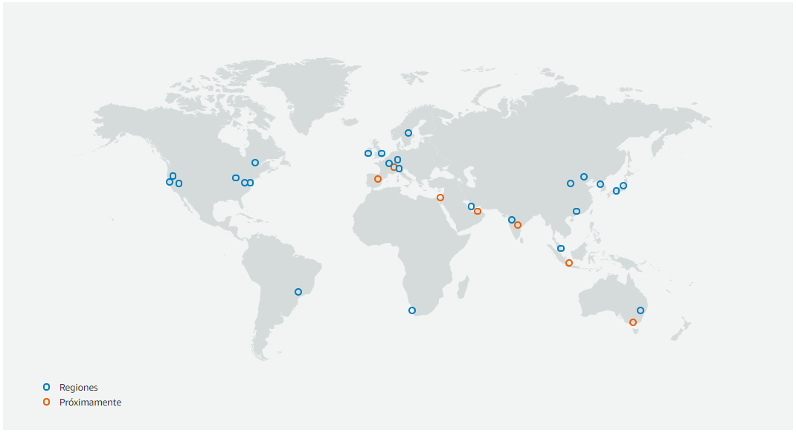
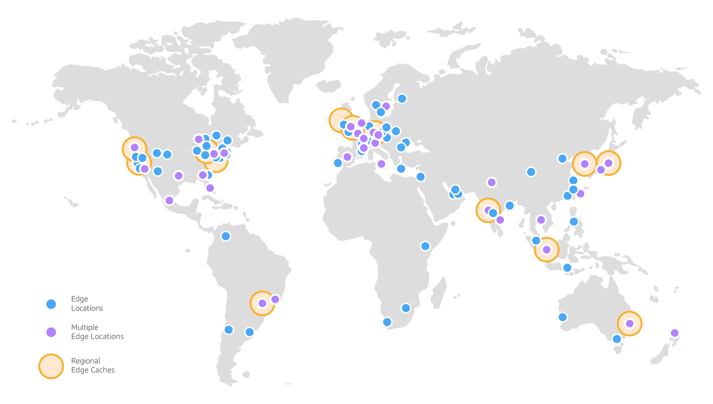

# Cloud Computing

## La Nube

Ya hemos visto que la industria 4.0 incluye el Big Data y la computación en la nube como uno de los elementos principales de su transformación.

El *Cloud Computing* permite obtener servicios de computación a través de internet de manera que sólo se pague por los recursos que usa y en el momento en que los necesita. Dicho de otro modo, es la entrega bajo demanda de potencia de cómputo, bases de datos, almacenamiento, aplicaciones y otros recursos informáticos, a través de Internet con un sistema de precios de pago por uso.

Los modelos productivos basados en la adquisición de hardware de manera propietaria ha quedado atrás, al implicar un proceso largo y costoso de compra de licencias, recursos físicos como oficinas y equipamiento y recursos humanos (tanto técnicos como de seguridad) para su implantación, gestión y mantenimiento.

Así pues plantea un cambio de perspectiva. La infraestructura se deja de considerar hardware para verla (y usarla) como software.

{ align=center && width=500px }

Si buscamos una definición formal, según el [NIST](https://www.nist.gov/) (National Institute for Standards and Technology) la computación en la nube es "un modelo que permite un acceso ubicuo, conveniente y *bajo demanda* a una red de *recursos de computación configurables* (por ejemplo, redes, servidores, almacenamiento, aplicaciones y servicios) que se pueden *aprovisionar rápidamente* y entregar con una interacción mínima con el proveedor del servicio".

<!--
<https://learning.oreilly.com/library/view/aws-certified-cloud/9780135266960/ch01.xhtml#ch01lev1sec2>
-->

### Ventajas

Así pues, los beneficios que ofrece la nube son:

* *Alta disponibilidad*, dada su naturaleza de recursos distribuidos.
* *Escalabilidad*: Si un usuario necesita más o menos capacidad de proceso o de almacenamiento, el proveedor se lo facilitará prácticamente en tiempo real. Además, permite escalar la aplicación a nivel mundial, desplegando las aplicaciones en diferente regiones de todo el mundo con sólo unos clicks.
* *Tolerancia a fallos*, ya que ofrecen una arquitectura de respaldo de copias de seguridad y a prueba de ataques.
* *Elasticidad*: de la misma manera que podemos escalar hacia arriba, podemos reducir los requisitos y buscar soluciones más económicas.
* *Alcance global*: cualquier usuario autorizado puede acceder o actualizar información desde cualquier lugar del mundo, en cualquier momento y mediante cualquier dispositivo.
* *Agilidad*: Permite amoldar los recursos al crecimiento de la empresa/proyecto, de manera casi instantánea. No hay que esperar a adquirir y montar los recursos (en vez de tardar del orden de semanas pasamos a minutos).
* *Capacidades de latencia del cliente*, pudiendo elegir cómo de cerca se despliegan las aplicaciones.
* *Cálculo de costes de manera predictiva*, siguiendo un modelo basado en el consumo (*pay-as-you go pricing*). Sólo se paga por los recursos que se utilizan, para ello se proporciona el precio de cada recurso por hora.

Una de las ventajas más interesante para las empresas puede que sea la reducción de los costes, ya que no necesitamos instalar ningún tipo de hardware ni software, ni pagar por las actualizaciones futuras en términos de ese hardware y software que ya no vamos a necesitar o que se ha quedado corto para nuestras necesidades.

En relación con los costes, es conveniente aclarar dos conceptos relacionados con la contabilidad y las finanzas: CapEx y OpEx.

### CapEx vs OpEx

Hay dos tipos diferentes de gastos que se deben tener en cuenta:

<figure style="float: right;">
    
    <figcaption>CapEx vs OpEx</figcaption>
</figure>

* La inversión de capital (**CapEx**, *Capital Expenditure*) hace referencia a la inversión previa de dinero en infraestructura física, que se podrá deducir a lo largo del tiempo. El coste previo de CapEx tiene un valor que disminuye con el tiempo.
* Los gastos operativos (**OpEx**, *Operational Expenses*) son dinero que se invierte en servicios o productos y se factura al instante. Este gasto se puede deducir el mismo año que se produce. No hay ningún pago previo, ya que se paga por un servicio o producto a medida que se usa.

Así pues, si nuestra empresa es dueña de su infraestructura, comprará equipos que se incluirán como recursos en su balance de cuentas. Dado que se ha realizado una inversión de capital, los contables clasifican esta transacción como CapEx. Con el tiempo, a fin de contabilizar la duración útil limitada de los activos, estos se deprecian o se amortizan.

Los servicios en la nube, por otro lado, se clasifican como OpEx debido a su modelo de consumo. Si nuestra empresa utiliza la nube, no tiene ningún recurso que pueda amortizar, y su proveedor de servicios en la nube (AWS / Azure) administra los costes asociados con la compra y la vida útil del equipo físico. En consecuencia, los gastos de explotación tienen un impacto directo en el beneficio neto, la base imponible y los gastos asociados en el balance contable.

En resumen, *CapEx* requiere unos costes financieros previos considerables, así como unos gastos continuos de mantenimiento y soporte técnico. En cambio, *OpEx* es un modelo basado en el consumo, y los gastos se deducen en el mismo año.

Así pues, la informática en la nube es un modelo basado en el consumo, lo que significa que los usuarios finales solo pagan por los recursos que usan. Lo que usan es lo que pagan.

Volviendo a las virtudes, los modelos basados en el consumo y *OpEx* aportan una serie de ventajas:

* Sin costes por adelantado.
* No es necesario comprar ni administrar infraestructuras costosas que es posible que los usuarios no aprovechen del todo, con lo cual el riesgo se reduce al mínimo.
* Se puede pagar para obtener recursos adicionales cuando se necesiten.
* Se puede dejar de pagar por los recursos que ya no se necesiten.

!!! info inline end
    Una solución *on-premise* implica que somos propietarios de los servidores, que hemos de contratar a un equipo de administradores de sistemas para su mantenimiento, que necesitamos unas instalaciones adecuadas y que hemos de protegerlas contra todo tipo de fallos.

Esta elasticidad facilita que la capacidad de cómputo se ajuste a la demanda real, en contraposición por un planteamiento de infraestructura *in-house/on-premise* donde tenemos que estimar cual va a ser la necesidad de la empresa y adquirir la infraestructura por adelantado teniendo en cuenta que:

* hay que aprovisionar por encima de la demanda, lo que es un desperdicio económico.
* si la demanda crece por encima de la estimación, tendré un impacto negativo en la demanda con la consiguiente pérdida de clientes.

<figure style="align: center;">
    
    <figcaption>Consumo respecto a Capacidad / Tiempo</figcaption>
</figure>

### Coste total de propiedad

El coste total de propiedad (CTO) es la estimación financiera que ayuda a identificar los costes directos e indirectos de un sistema. Permite comparar el coste de ejecutar una infraestructura completa o una carga de trabajo específica en las instalaciones del cliente frente a hacerlo en la nube.

Los elementos a considerar sobre el coste total de propiedad son:

Cuando migramos a una solución en la nube, por ejemplo AWS, los únicos costes que deberemos pagar son:

* Costes de computación (procesador, memoria): se factura por horas o por segundos (sólo máquinas Linux)
* Costes de almacenamiento: se factura por GB
* Costes de transferencia de datos: se factura por GB de salida (excepto casos excepcionales, los datos de entrada no se facturan)

Así pues, es necesario presupuestar y desarrollar casos de negocio para migrar a la nube y ver si son viables para nuestra organización. Para ello, podemos utilizar la calculadora de costes que ofrecen las plataformas cloud:

* AWS: <https://calculator.aws> y en concreto en <https://calculator.s3.amazonaws.com/index.html>
* Azure: <https://azure.microsoft.com/es-es/pricing/tco/calculator/>
* Google Cloud: <https://cloud.google.com/products/calculator?hl=es>

Estas calculadoras permiten:

* Calcular los costes mensuales.
* Identificar oportunidades para reducir los costes mensuales.
* Utilizar plantillas para comparar servicios y modelos de implementación.

La realidad es que el coste de desplegar y utilizar las aplicaciones en la nube es menor cada vez que se añade un gasto. Se dice que una solución cloud supone una mejora de un orden de magnitud, es decir, 10 veces más económicas. Sin embargo, operar en la nube realmente abarata los costes cuando automatizamos los procesos y los servicios se diseñan para trabajar en la nube, es decir, la mayoría de servicios no se ejecutan 24x7, sino que se detienen o reducen en tamaño cuando no son necesarios. Así pues, los proveedores *cloud* utilizan procesos automatizados para construir, gestionar, monitorizan y escalar todos sus servicios. Esta automatización de los procesos nos permitirán ahorrar dinero e irnos el fin de semana tranquilos a casa.

Un concepto que conviene conocer es el de **economía de escala**, el cual plantea que al disponer de miles de clientes, la plataforma *cloud* adquiere los productos a un precio inferior al de mercado y que luego repercute en los clientes, que acaban pagando un precio por uso más bajo.

### Inconvenientes

Ya hemos comentado las virtudes de utilizar una solución cloud, pero también cabe destacar sus desventajas:

* Necesita una conexión a internet continua y rápida.
* En las arquitecturas híbridas, puede haber bastante latencia.
* Hay funcionalidades que todavía no están implementadas, aunque su avance es continuo y salen soluciones nuevas cada mes.
* Puede haber una falta de confianza:
    * Los datos guardados pueden ser accedidos por otros
    * Nuestros datos ya no están en la empresa
    * Problemas legales (datos protegidos por leyes europeas que se encuentran en servidor americanos, ...)
* Dependencia tecnológica con compañías ajenas (Amazon, Microsoft, ...).

## Servicios en la nube

Los servicios en la nube son servicios que se utilizan a través de Internet, eliminando las limitaciones de nuestros equipos. Su principal ventaja es que su CapEx es 0, ya que no necesita ningún tipo de inversión inicial ni contrato a largo plazo.

{ width=600px }

<!-- IaaS=Cocina -> PaaS=Restaurante -> SaaS=Buffet -->

### IaaS

{ align=right && width=300px }

La infraestructura como servicio (*Infrastructure as a Service*) proporciona a las empresas recursos informáticos, incluyendo servidores, máquinas virtuales, redes, almacenamiento y espacio en centros de datos con pago en función del uso.

Los elementos que forman parte de IaaS son:

* Servidores y almacenamiento.
* Firewall y seguridad en red.
* Planta física o edificio del centro de datos.

Se contrata el hardware y el cliente es el responsable de la instalación y mantenimiento del software que corre en dichas máquinas, así como configurar la red, el almacenamiento y el control de acceso. Configurar una máquina virtual nueva es considerablemente más rápido que adquirir, instalar y configurar un servidor físico. Además, permite escalar la infraestructura bajo demanda para dar soporte a las cargas de trabajo dinámicas.

### PaaS

{ align=right && width=300px }

La plataforma como servicio (*Platform as a Service*) proporciona un entorno basado en cloud con todos los requisitos necesarios para dar soporte a todo el ciclo de vida de creación y puesta en marcha de aplicaciones basadas en web (cloud), sin el coste y la complejidad de comprar y gestionar el hardware, software, aprovisionamiento y alojamiento necesario.

Los elementos que forman parte de PaaS son todos los de IaaS más:

* Sistema operativo
* Herramientas de desarrollo (lenguajes de programación, librerías, servicios, ...), administración de bases de datos, análisis empresarial, etc...

Este enfoque acelera el desarrollo y la comercialización de aplicaciones, ya que desplegar una nueva aplicación es cuestión de minutos.

El cliente no necesita administrar la infraestructura subyacente. El proveedor *cloud* gestiona el sistema operativo, la implementación de parches a la base de datos, la configuración del *firewall* y la recuperación de desastres. De esta manera, el cliente puede centrarse en la administración de código o datos.

### SaaS

Finalmente, las aplicaciones basadas en cloud, o software como servicio (*Sofware as a Service*), se ejecutan en sistemas en la nube que no tienen porque residir en la misma máquina ni en la misma red. Estos servicios pertenecen y los administran otras empresas a las cuales el cliente se conecta a través de Internet y, por lo general, de un navegador web.

Así pues, podemos considerar SaaS como aplicaciones hospedadas y utilizables dentro de un PaaS.

{ width=600px }

Respecto al usuario, cuenta con una licencia según un modelo de suscripción o de pago por uso y no necesitan administrar la infraestructura que respalda el servicio. Por ello, SaaS permite iniciar sesión y empezar rápidamente a utilizar las aplicaciones desde el minuto 0.

Si el sistema fallase, no se pierden datos, ya que al estar en el *cloud* hay copias de seguridad continuas y al ser tolerante a fallos y elástico, el servicio permite escalar dinámicamente en función de las necesidades de uso.

Cada uno de estos tipos de servicios implican en mayor o menor medida al usuario, compartiendo la responsabilidad de cada área entre el proveedor cloud y el usuario. Este concepto se conoce como *principio de responsabilidad compartida* y lo estudiaremos en detalle en la [próxima sesión](02aws.md#modelo-de-responsabilidad-compartida-de-aws).

!!! info "¿Qué es la informática sin servidor / *Serverless computing*?"
    Igual que PaaS, la informática sin servidor permite que los desarrolladores creen aplicaciones más rápidamente, ya que elimina la necesidad de administrar la infraestructura. En las aplicaciones sin servidor, el proveedor de servicios en la nube aprovisiona, escala y administra automáticamente la infraestructura necesaria para ejecutar el código. Las arquitecturas sin servidor son muy escalables y **controladas por eventos**, y solo usan recursos cuando se produce una función o un desencadenador concretos.

    Es importante tener en cuenta que los servidores siguen ejecutando el código. El término "sin servidor" procede del hecho de que las tareas asociadas a la administración y el aprovisionamiento de la infraestructura son invisibles para el desarrollador. Este enfoque permite a los desarrolladores centrar su atención en la lógica de negocio y ofrecer más valor al núcleo de la empresa.

## Tipos de arquitectura según la infraestructura

### Arquitecturas *on premise*

También conocido como *in-house* es la arquitectura clásica, en la que la empresa adquiere el hardware por adelantado. De esta manera, las empresas tienen el control total sobre los recursos y la seguridad, pero también la responsabilidad respecto al mantenimiento y actualización del hardware.

### Arquitecturas *cloud*

Son aquellas donde los recursos se virtualizan y no son propiedad de la empresa, sino que se pueden aprovisionar y quitar bajo las necesidades de cada momento. Sólo se paga por lo que se consume.

A su vez, podemos distinguirlas entre:

* **Nube pública**: los recursos virtualizados se comparten de forma pública y entre varios clientes a la vez, permitiendo el acceso via internet.

    Los clouds públicos pertenecen y son administrados por proveedores que ofrecen a través de una red pública acceso rápido a recursos informáticos asequibles.

* **Nube privada**: los recursos virtualizados son privados, mediante un cluster dedicado para el cliente, normalmente mediante una conexión privada, ya sea de fibra propia o una VPN. Este tipo de nube lo utiliza únicamente una única organización, ya sea gestionada internamente o por terceros y alojada internamente o externamente.

El planteamiento de *todo en la nube* suele utilizarse en proyectos nuevos o en la actualización de cero de los proyectos existentes. Abarca implementaciones que sólo utilizan recursos de bajo nivel (redes, servidores, etc) o bien servicios de alto nivel (*serverless*, bases de datos administradas...).

### Arquitecturas híbridas

Brindan gran flexibilidad, ya que las empresas deciden donde se ejecutan sus aplicaciones, ya sea en su propia infraestructura *in-house* o con servicios cloud. De esta manera, controlan la seguridad y el cumplimiento de los requisitos legales de sus aplicaciones.

Un *cloud* híbrido utiliza una base de *cloud* privado combinada con la integración y el uso de servicios *cloud* públicos.

En realidad, un *cloud* privado no puede existir aislado del resto de los recursos TIC de una empresa ni del *cloud* público. La mayoría de las empresas con clouds privados evolucionan para gestionar cargas de trabajo en todos los centros de datos (privados y públicos) creando así *clouds* híbridos. Normalmente, las aplicaciones críticas y los datos confidenciales se mantienen en el cloud privado, dejando el *cloud* público para las aplicaciones más recientes y la infraestructura IaaS para obtener recursos virtuales de forma flexible.

El planteamiento híbrido es el más habitual (respecto a un *cloud* puro), donde los servicios se van migrando poco a poco (buscando primero ampliar o resolver carencias) coexistiendo con la infraestructura actual que está en la organización, normalmente conectada mediante VPN y enlaces dedicados.

## Plataformas Cloud

En la actualidad existen multitud de proveedores que ofrecen servicios en la nube clasificados de acuerdo al modelo de servicio. A continuación nombramos los más conocidos y más utilizados.

Los proveedores cloud de nube pública más importantes son:

* Amazon, con *Amazon Web Services* (<https://aws.amazon.com/es/>): Amazon fue el primer proveedor cloud, pionero y con mayor crecimiento. AWS proporciona una plataforma confiable en la nube que utilizan miles de empresa en todo el mundo.
* Microsoft, con *Azure* (<https://azure.microsoft.com/es-es/>): Ha realizado una fuerte inversión en los últimos años y es la plataforma cloud con mayor crecimiento. Ofrece servicios en las tres capas, no sólo en IaaS, sino también PaaS y SaaS.
* Google, con *Google Cloud* (<https://cloud.google.com>): Google también es un proveedor de nube pública mediante su plataforma *Google Cloud Platform (GCP)*. Le costó entrar en este área, pero en los últimos años ha crecido mucho y actualmente es ampliamente utilizada por grandes compañías.

En el caso de nube privada, destacar a *OpenStack* (<https://www.openstack.org>). Se trata de un proyecto de software de infraestructura de computación en la nube, es de código abierto y es uno de los proyectos open source más activos del mundo.

Si entramos a ejemplos concretos para cada tipo de servicio en la nube tenemos:

| Tipo de Servicio  | Proveedor             | Descripción   |
| ------            | -----                         | -----         |
| IaaS              | AWS EC2                       | Máquinas virtuales en Amazon, con procesador, memoria y almacenamiento a medida
|                   | Azure VM                      | Igual pero en Azure
|                   | Google Compute Engine         | Igual pero en Google
| PaaS              | AWS RDS, AWS Lambda           | Base de datos, funciones serverless
|                   | Google App Engine             | Alojamiento y despliegue web
|                   | Heroku                        | Plataforma que permite el despliegue de aplicaciones en la nube
| SaaS              | Microsoft Office 365          | Paquete ofimático de Microsoft en la nube
|                   | Aplicaciones web de Google    | Correo electrónico, calendario, fotos
|                   | Trello, Notion, GitHub, Dropbox, Spotify        | Tableros Kanban, gestión de tareas, repositorio de código fuente...

!!! tip "Herramientas DevOps relacionadas"
    Aunque se salen del ámbito del curso de IABD, es conveniente conocer algunas herramientas asociadas a perfiles *DevOps* como:

    * **Terraform** (<https://www.terraform.io/>): Facilita la definición, aprovisionamiento y orquestación de servicios mediante un lenguaje declarativo.
    * **Ansible** (<https://www.ansible.com/>): Permite centralizar la configuración de numerosos servidores, dispositivos de red y proveedores *cloud* de una forma sencilla y automatizada.
    * **Docker** (<https://www.docker.com/>): Permite la creación de contenedores a modo de máquinas virtuales ligeras, donde se instalan los servicios/recursos necesarios.
    * **Kubernetes (K8s)** (<https://kubernetes.io/es/>): Orquesta los contenedores para facilitar el despliegue, la supervisión de servicios, el reemplazo, el escalado automático y la administración de los servicios. Facilita la portabilidad de contenedores a la nube.

En Octubre de 2020, el informe de Synergy [Cloud Market Growth Rate Nudges Up as Amazon and Microsoft Solidify Leadership](https://www.srgresearch.com/articles/cloud-market-growth-rate-nudges-amazon-and-microsoft-solidify-leadership) permite observar el predominio de Amazon seguido del crecimiento de la plataforma Azure:

<figure style="float: right;">
    
    <figcaption>Posición competitiva plataformas cloud - Synergy</figcaption>
</figure>

## Infraestructura cloud

Las diferentes plataformas *cloud* ofrecen una infraestructura dividida en regiones y zonas.

### Regiones y Zonas de disponibilidad

A lo largo de todo el globo terráqueo se han construido enormes centros de datos que se conocen como **regiones**. Estas regiones son zonas geográficas, y dentro de cada una de ellas hay diferentes grupo de centros de datos lógicos que se conocen como **zonas de disponibilidad** (AZ - *Availability Zone*) situadas en ubicaciones aisladas. Normalmente cada región contiene 3 o más zonas de disponibilidad.

Cada zona de disponibilidad está aislada, pero las zonas de disponibilidad de una región están conectadas mediante redes troncales privadas que proporciona un menor coste y una latencia de red entre regiones mejor que las conexiones públicas de Internet. Una zona de disponibilidad se representa mediante un código de región seguido de un identificador de letra, por ejemplo, `us-east-1a`.

!!! note "AWS Academy"
    Dentro de AWS Academy siempre vamos a trabajar dentro de la región *us-east-1*, correspondiente al Norte de Virginia (es la región asignada también a la capa gratuita, y además, es la más económica).

Dicho de otro modo, cada región consta de varias zonas de disponibilidad aisladas y separadas físicamente dentro de un área geográfica. Cada zona de disponibilidad tiene alimentación, refrigeración y seguridad física independientes y está conectada a través de redes redundantes de latencia ultrabaja.

Por ejemplo, en AWS, dentro de la región *us-east-1* del Norte de Virginia, se encuentran 6 zonas de disponibilidad: *us-east-1a*, *us-east-1b*, *us-east-1c*, *us-east-1d*, *us-east-1e*, *us-east-1f*. En cambio, en *us-east-2* sólo tiene tres AZ: *us-east-2a*, *us-east-2b* y *us-east-2c*. Conviene destacar que no todos los servicios de AWS están disponibles en todas las regiones.

<figure style="float: right;">
    
    <figcaption>Ejemplo de infraestructura AWS</figcaption>
</figure>

Si seguimos desgranando, cada zona de disponibilidad contiene al menos 3 centros de datos, y cada centro de datos suele albergar entre 50.000 y 100.000 servidores físicos. Si hacemos cálculos podemos ver que una región puede incluir varios cientos de miles de servidores.

La elección de una región se basa normalmente en los requisitos de conformidad o en la intención de reducir la latencia. Cuanto más cerca esté la región de los clientes finales, más rápido será su acceso. En otras ocasiones elegiremos la región que asegura las leyes y regulaciones que nuestras aplicaciones deben cumplir. Finalmente, en el caso de una nube híbrida, elegiremos la región más cercana a nuestro centro de datos corporativo.

Las zonas de disponibilidad permiten que los clientes trabajen con bases de datos y aplicaciones de producción con un nivel de disponibilidad, tolerancia a errores y escalabilidad mayor que el que ofrecería un centro de datos único.

!!! tip "Tolerancia a fallos"
    La solución ideal es replicar los datos y la aplicación en varias zonas de disponibilidad de una región, y posteriormente, replicarlos a su vez entre diferentes regiones.

    <figure style="float: right;">
        
        <figcaption>Ejemplo de cluster con diferentes AZ</figcaption>
    </figure>

    Las AZ están físicamente separadas entre sí por una distancia significativa de muchos kilómetros, aunque todas están dentro de un rango de 100 km de separación.

    La replicación de datos entre regiones y zonas de disponibilidad es responsabilidad del cliente, mediante el diseño de una arquitectura con un clúster que reparta las peticiones a partir de un balanceador de carga entre, al menos, dos AZ distintas. Así, si cae una AZ, la otra dará respuesta a todas las peticiones.

Un fallo en una AZ (normalmente en uno de los centros de datos que contiene) no afectará los servicios que están diseñados para trabajar fuera de las AZ, como las diferentes opciones de almacenamiento ni de los servicios globales como DNS o CDN. Cabe destacar que si cae un centro de datos de una AZ no implica que caigan el resto de centros de datos de la misma AZ donde nuestras aplicaciones pueden estar replicadas. Además, cada AZ está aislada del resto de AZ dentro de la misma región.

Cada AZ está diseñada como una zona de error independiente:

* Están físicamente separadas dentro de una región metropolitana típica.
* Se ubican en terrenos de menor riesgo de inundación.
* Utilizan sistemas de alimentación ininterrumpida discretos y generación de copia de seguridad en las instalaciones
* La alimentación se suministra desde distintas redes de empresas de servicios públicos independientes.
* Están conectadas de forma redundante a varios ISP.

### Despliegue

Por ejemplo, en el siguiente gráfico podemos ver las 28 regiones que tiene AWS que incluyen 90 zonas de disponibilidad (en Noviembre de 2022 han añadido a [España como una nueva región](https://aws.amazon.com/es/blogs/aws/now-open-aws-region-in-spain/) - `eu-south-2`):

=== "Regiones 2021"

    <figure style="align: center;">
        
        <figcaption>Regiones AWS</figcaption>
    </figure>

=== "Regiones 2022"

    <figure style="align: center;">
        
        <figcaption>Regiones AWS</figcaption>
    </figure>

Podéis consultar el mapa interactivo de:

* *AWS* en <https://aws.amazon.com/es/about-aws/global-infrastructure/> (y las regiones en <https://aws.amazon.com/es/about-aws/global-infrastructure/regions_az/>)
* *Azure* en <https://infrastructuremap.microsoft.com/explore>.
* *Google Cloud* en <https://cloud.google.com/about/locations#regions>

La localización exacta de cada una de estas regiones y zonas de disponibilidad es difusa a propósito. A los proveedores, por temas de seguridad, no les interesa que se sepa donde se localizan los recursos.

### Ubicaciones de borde

Las ubicaciones de borde y las cachés de borde regionales mejoran el rendimiento almacenando en caché el contenido lo más cerca de los usuarios para reducir la latencia al mínimo. A menudo, las ubicaciones de borde están cerca de las zonas de gran población que generan volúmenes de tráfico elevados.

Así pues, se trata de un CDN (*Content Delivery Network*) que se utiliza para distribuir el contenido (datos, vídeos, aplicaciones y API) a los usuarios finales. Por ejemplo, [Amazon Cloudfront](https://aws.amazon.com/es/cloudfront/) despliega más de 410 [puntos de presencia](https://aws.amazon.com/es/about-aws/global-infrastructure/localzones) (más de 400 ubicaciones de borde y 13 cachés de nivel medio regional) a través de 90 ciudades en 47 países.

<figure style="align: center;">
    
    <figcaption>Mapa de ubicaciones de borde de AWS</figcaption>
</figure>

El acceso a estos CDN se realiza gracias al DNS interno que utiliza cada proveedor. En el caso de AWS se conoce como *Amazon Route 53*, de manera que resuelve los dominios más rápido y redirige el tráfico a los nodos *Cloudfront*.

## Referencias

* [Curso Academy Cloud Foundation](https://awsacademy.instructure.com/courses/2243/) de *Amazon Web Services*.
* [Azure Fundamentals AZ-900 FAQ](https://github.com/davidcervigonluna/AZ-900FAQ)
* [Google Cloud vs AWS en 2022](https://kinsta.com/es/blog/google-cloud-vs-aws/)
* [Conceptos fundamentales de Azure](https://docs.microsoft.com/es-es/learn/modules/fundamental-azure-concepts/)
* [AWS Certified Cloud Practitioner Training 2020 - Full Course](https://www.youtube.com/watch?v=3hLmDS179YE)

<!--
* [Tipos de cloud computing](https://openwebinars.net/blog/tipos-de-cloud-computing/)
* Curso de [Cloud Computing](https://courses.cs.ut.ee/2021/cloud/spring)
* [Ubicaciones de borde](https://www.lastweekinaws.com/blog/what-is-an-edge-location-in-aws-a-simple-explanation/)
-->

## Actividades

A lo largo de este bloque, vamos a trabajar con AWS como plataforma Cloud. Para ello, es necesario activar la cuenta educativa de AWS que habrás recibido en tu email.

1. (RA5075.2 / CE5.2a / 1p) Contesta a las siguientes preguntas justificando tus repuestas:
    1. A nivel financiero, ¿qué ventajas supone apostar por un modelo cloud respecto a una solución *on-premise*?
    2. De los modelos *As a Service*, ¿cuál permite crear aplicaciones que estén disponibles para cualquier persona en cualquier lugar?.

2. (RA5075.2 / CE5.2a / 1p) Realiza el módulo 1 (Información general sobre los conceptos de la nube) del curso [ACF de AWS](https://awsacademy.instructure.com/courses/30530).

*[RA5075.2]: Gestiona sistemas de almacenamiento y el amplio ecosistema alrededor de ellos facilitando el procesamiento de grandes cantidades de datos sin fallos y de forma rápida.
*[CE5.2a]: Se ha determinado la importancia de los sistemas de almacenamiento para depositar y procesar grandes cantidades de cualquier tipo de datos rápidamente.
