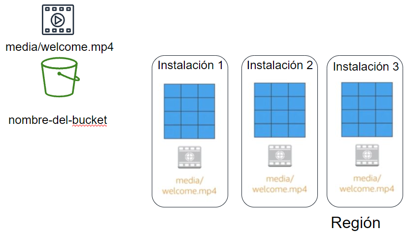

# Almacenamiento en la nube

El almacenamiento en la nube, por lo general, es más confiable, escalable y seguro que los sistemas de almacenamiento tradicionales en las instalaciones.

El análisis de *Big Data*, el almacenamiento de datos, el Internet de las cosas (IoT), las bases de datos y las aplicaciones de copias de seguridad y archivo dependen de algún tipo de arquitectura de almacenamiento de datos.

El almacenamiento más básico es el que incluyen las propias instancias, también conocido como el **almacén de instancias**, o almacenamiento efímero, es un almacenamiento temporal que se agrega a la instancia de EC2.

El almacén de instancias es una buena opción para el almacenamiento temporal de información que cambia con frecuencia, como *buffers*, memorias caché, datos de pruebas y demás contenido temporal. También se puede utilizar para los datos que se replican en una flota de instancias, como un grupo de servidores web con balanceo de carga. Si las instancias se detienen, ya sea debido a un error del usuario o un problema de funcionamiento, se eliminarán los datos en el almacén de instancias.

!!! info "Almacenamiento de bloque o de objeto"
    AWS permite almacenar los datos en bloques o como objetos. Si el almacenamiento es en bloques, los datos se almacenan por trozos (bloques), de manera si se modifica una parte de los datos, solo se ha de modificar el bloque que lo contiene. En cambio, si el almacenamiento es a nivel de objeto, una modificación implica tener que volver a actualizar el objeto entero.  
    Esto provoca que el almacenamiento por bloque sea más rápido. En cambio, el almacenamiento de objetos es más sencillo y por tanto más barato.

AWS ofrece múltiples soluciones que vamos a revisar:

<figure style="align: center;">
    
    <figcaption>Servicios de almacenamiento de AWS</figcaption>
</figure>

## Amazon EBS

*Amazon Elastic Block Store* (<https://aws.amazon.com/es/ebs/>) ofrece volúmenes de almacenamiento a nivel de bloque de alto rendimiento para utilizarlos con instancias de Amazon EC2 para las cargas de trabajo con un uso intensivo de transacciones y de rendimiento.

Los beneficios adicionales incluyen la replicación en la misma zona de disponibilidad, el cifrado fácil y transparente, los volúmenes elásticos y las copias de seguridad mediante instantáneas.

!!! tip "Importante"
    AmazonEBS se puede montar en una instancia de EC2 solamente dentro de la misma zona de disponibilidad.

### Volúmenes

!!! info  inline end "IOPS"
    El término IOPS, *operaciones de entrada y salida por segundo*, representa una medida de rendimiento frecuente que se utiliza para comparar dispositivos de almacenamiento.
    Un artículo muy interesante es [What you need to know about IOPS](https://cloudcasts.io/article/what-you-need-to-know-about-iops).

Los volúmenes de EBS proporcionan almacenamiento externo a EC2 que persiste independientemente de la vida de la instancia. Son similares a discos virtuales en la nube. *AmazonEBS* ofrece tres tipos de volúmenes: SSD de uso general, SSD de IOPS provisionadas y magnéticos (HDD). Los tres tipos de volúmenes difieren en características de rendimiento y coste, para ofrecer diferentes posibilidades según las necesidades de las aplicaciones:

* *Unidades de estado sólido (SSD)*: optimizadas para cargas de trabajo de transacciones que implican operaciones de lectura/escritura frecuentes de pequeño tamaño de E/S. Proporciona un equilibrio entre precio y rendimiento, y es el tipo recomendado para la mayoría de las cargas de trabajo. Los tipos existentes son `gp3` (1.000 MiB/s) y `gp2`(128-250 MiB/s) ambas con un máximo de 16.000 IOPS.
* *SSD de IOPS provisionadas*: proporciona un rendimiento elevado con cargas de trabajo críticas, baja latencia o alto rendimiento. Los tipos existentes con `io2 Block Express` (4.000 MiB/s con un máximo 246.000 IOPS) e `io2` (1.000 MiB/s con 64.000 IOPS)
* *Unidades de disco duro (HDD)*: optimizadas para grandes cargas de trabajo de streaming. Los tipos existentes con `st1` (500 MiB/s con 500 IOPS) y `sc1` (250 MiB/s con 250 IOPS).

Más información sobre los diferentes volúmenes: <https://docs.aws.amazon.com/es_es/AWSEC2/latest/UserGuide/ebs-volume-types.html>

Para crear o configurar un volumen, dentro de las instancias EC2, en el menú lateral podemos ver las opciones de *Elastic Block Store* y el submenú *Volúmenes*:


Los volúmenes de Amazon EBS están asociados a la red, y su duración es independiente a la vida de una instancia. Al tener un alto nivel de disponibilidad y de confianza, pueden aprovecharse como particiones de arranque de instancias de EC2 o asociarse a una instancia de EC2 en ejecución como dispositivos de bloques estándar.

Cuando se utilizan como particiones de arranque, las instancias de Amazon EC2 pueden detenerse y, posteriormente, reiniciarse, lo que le permite pagar solo por los recursos de almacenamiento utilizados al mismo tiempo que conserva el estado de la instancia. Los volúmenes de Amazon EBS tienen mayor durabilidad que los almacenes de instancias de EC2 locales porque los volúmenes de Amazon EBS se **replican automáticamente** en el *backend* (en una única zona de disponibilidad).

Los volúmenes de Amazon EBS ofrecen las siguientes características:

* Almacenamiento persistente: el tiempo de vida de los volúmenes es independiente de cualquier instancia de Amazon EC2.
* De uso general: son dispositivos de bloques sin formato que se pueden utilizar en cualquier sistema operativo.
* Alto rendimiento: ofrecen al menos el mismo o más rendimiento que las unidades de Amazon EC2 locales.
* Nivel de fiabilidad alto: tienen redundancia integrada dentro de una zona de disponibilidad.
* Diseñados para ofrecer resiliencia: la AFR (tasa anual de errores) de Amazon EBS oscila entre 0,1 % y 1 %.
* Tamaño variable: los tamaños de los volúmenes varían entre 1 GB y 16 TB.
* Fáciles de usar: se pueden crear, asociar, almacenar en copias de seguridad, restaurar y eliminar fácilmente.

!!! important "Un volumen en una instancia"
    Sólo una instancia de Amazon EC2 a la vez puede montarse en un volumen de Amazon EBS.

### Instantáneas

Sin embargo, para los que quieran aún más durabilidad, con *Amazon EBS* es posible crear instantáneas uniformes puntuales de los volúmenes, que luego se almacenan en *Amazon S3* y se replican automáticamente en varias zonas de disponibilidad.

Estas instantáneas se pueden utilizar como punto de partida para nuevos volúmenes de Amazon EBS (clonando o restaurando copias de seguridad) y permiten proteger la durabilidad de los datos a largo plazo. Como todo recurso S3, también se pueden compartir fácilmente con compañeros del equipo de desarrollo y otros desarrolladores de AWS.

## Amazon EFS

*Amazon Elastic File System* (<https://aws.amazon.com/es/efs/>) ofrece almacenamiento para las instancias EC2 a las que pueden acceder ^^varias máquinas virtuales de forma simultánea^^, de manera similar a un NAS (*Network Area Storage*). Se ha implementado como un sistema de archivos de uso compartido que utiliza el protocolo de sistemas de archivos de red (NFS), al que acceden varios miles de instancia EC2 así como servidores *on-premise* a traves de una VPN o conexiones directas (*AWS Direct Connect*).

Se trata de un almacenamiento de archivos simple, escalable y elástico para utilizarlo con los servicios de AWS y los recursos disponibles en las instalaciones. Mediante una interfaz sencilla permite crear y configurar sistemas de archivos de forma rápida y simple.

EFS está diseñado para escalar a petabytes de manera dinámica bajo demanda sin interrumpir las aplicaciones, por lo que se ampliará y reducirá de forma automática a medida que agregue o elimine archivos, no necesitando asignar espacio inicial. Respecto al rendimiento, su IOPS escala de forma automática conforme crece el tamaño del sistema de archivos, ofreciendo dos modos, el de uso general (ofrece alrededor de 7000 operaciones por segundo y fichero) y el max I/O (para miles de instancias que acceden al mismo archivo de forma simultanea), pudiendo admitir un rendimiento superior a 10 GB/seg y hasta 500.000 IOPS.

Las instancias se conectan a EFS desde cualquier AZ de la región. Todas las lecturas y escrituras son consistentes en todas las AZ. Por ejemplo, una lectura en una AZ garantiza que tendrá la misma información, aunque los datos se hayan escrito en otra AZ.

<figure style="align: center;">
    
    <figcaption>EFS compartido entre instancias</figcaption>
</figure>

Respecto al coste (<https://aws.amazon.com/es/efs/pricing/>), dependiendo del tipo de acceso y la administración del ciclo de vida, el acceso estándard se factura desde 0,30$ Gb/mes, mientras que si el acceso es poco frecuente, baja a 0,013$ Gb/mes más 0,01$ por transferencia y Gb/mes.

Su casos de uso más comunes son para bigdata y análisis, flujos de trabajo de procesamiento multimedia, administración de contenido, servidores web y directorios principales.

Respecto a su acceso, de manera similar al resto de servicios de almacenamiento, es un servicio completamente administrado al que se puede acceder desde la consola, una API o la CLI de AWS.

## Amazon S3

*S3* (<https://aws.amazon.com/es/s3/>) es un servicio de almacenamiento persistente de objetos creado para almacenar y recuperar cualquier cantidad de datos desde cualquier lugar mediante una URL: sitios web y aplicaciones móviles, aplicaciones corporativas y datos de sensores o dispositivos de Internet de las cosas (IoT) y análisis de *Big Data*.

S3 es un servicio de **almacenamiento a nivel de objetos**, y tal como habíamos comentado, significa que además de que los datos contengan metadatos que ayudan a catalogar el objeto, si desea cambiar una parte de un archivo, tiene que realizar la modificación y luego volver a cargar todo el archivo modificado. Esto puede tener implicaciones de rendimiento y consistencia, que conviene tener en cuenta.

Los datos se almacenan como objetos dentro de recursos conocidos como **buckets**. Los objetos pueden ser prácticamente cualquier archivo de datos, como imágenes, videos o registros del servidor. 

Es una solución administrada de almacenamiento en la nube que se diseñó para brindar un escalado sin problemas, ofreciendo 99,99% de **disponibilidad** (4 nueves) y 99,999999999% (11 nueves) de **durabilidad**. Además de poder almacenar prácticamente todos los objetos que deseemos dentro de un bucket (los objetos pueden ser de hasta 5TB), S3 permite realizar operaciones de escritura, lectura y eliminación de los objetos almacenados en el bucket. Los nombres de los buckets son universales y deben ser ^^únicos^^ entre todos los nombres de buckets existentes en Amazon S3.

De forma predeterminada, en Amazon S3 los datos se almacenan de forma redundante en varias instalaciones y en diferentes dispositivos de cada instalación.

<figure style="align: center;">
    
    <figcaption>Replicación en S3</figcaption>
</figure>

Los datos que almacenamos en *S3* no están asociados a ningún servidor en particular (aunque los *buckets* se asocien a regiones, los archivos se dice que están almacenados de forma global), con lo que no necesitamos administrar ningún tipo de servidor.

<figure style="float: right;">
    
    <figcaption>Replicación en S3</figcaption>
</figure>

Amazon S3 contiene billones de objetos y, con regularidad, tiene picos de millones de solicitudes por segundo, por ende, es un servicio de alto rendimiento, con una latencia de primer byte que se mide en milisegundos para la mayoría de las clases de almacenamiento.

### Elementos de un objeto

Cada objeto que almacenamos en S3 tiene:

* una clave: nombre que se le asigna al objeto y que se utiliza para recuperarlo.
* un id de versión: podemos mantener un histórico de cambios mediante el *versionado de los archivos*, de manera que cuando actualicemos un objeto, en vez de sustituirlo, se crea una nuevo versión manteniendo un histórico. Más información en <https://docs.aws.amazon.com/es_es/AmazonS3/latest/userguide/versioning-workflows.html>
* un valor: contenido real que se almacena.
* metadatos: pares clave-valor, que podemos definir nosotros como usuarios.
* subrecursos: que utiliza AWS para almacenar información adicional.

### Clases de almacenamiento

S3 ofrece una variedad de clases de almacenamiento (<https://docs.aws.amazon.com/es_es/S3/latest/userguide/storage-class-intro.html>) a nivel de objetos que están diseñadas para diferentes casos de uso. Entre estas clases se incluyen las siguientes:

* **S3 Estándar**: diseñada para ofrecer almacenamiento de objetos de alta durabilidad, disponibilidad y rendimiento para los datos a los que se accede con frecuencia. Como ofrece baja latencia y alto nivel de rendimiento, es una opción adecuada para aplicaciones en la nube, sitios web dinámicos, distribución de contenido, aplicaciones para dispositivos móviles y videojuegos, y el análisis de *big data*.
* **S3 Estándar - Acceso poco frecuente**: se utiliza para los datos a los que se accede con menos frecuencia, pero que requieren acceso rápido cuando es necesario. Es una opción ideal para el almacenamiento y las copias de seguridad a largo plazo, además de almacén de datos para los archivos de recuperación de desastres.
* **S3 Única zona – Acceso poco frecuente**: diseñada para guardar los datos a los que se accede con menos frecuencia, pero que requieren acceso rápido cuando es necesario, pero sin tener replicas (la clase S3 estándar replica los datos en un mínimo de tres AZ). Es una buena opción para almacenar copias de seguridad secundarias de los datos que se encuentran en las instalaciones o de los datos que se pueden volver a crear fácilmente.
* **S3 Intelligent-Tiering**: diseñada para optimizar los costes mediante la migración automática de los datos entre capas, sin que se perjudique el rendimiento ni se produzca una sobrecarga operativa. Se encarga de monitorizar los patrones de acceso de los objetos y traslada aquellos a los que no se ha accedido durante 30 días consecutivos a la capa de acceso poco frecuente. Si se accede a un objeto en la capa de acceso poco frecuente, este se traslada automáticamente a la capa de acceso frecuente. Funciona bien con datos de larga duración con patrones de acceso desconocidos o impredecibles.
* **S3 Glacier** (<https://aws.amazon.com/es/s3/glacier/>): es una clase de almacenamiento seguro, duradero y de bajo coste para archivar datos a largo plazo. Para que los costes se mantengan bajos, *S3 Glacier* proporciona tres opciones de recuperación (recuperación acelerada, estándar y masiva), que van desde unos pocos minutos a unas horas. Podemos cargar objetos directamente en *S3 Glacier* o utilizar políticas de ciclo de vida para transferir datos entre cualquiera de las clases de almacenamiento de S3 para datos activos y *S3 Glacier*.

    !!! info "Política de ciclo de vida"

        Una **política de ciclo de vida** define qué va a pasar con los datos partiendo de su almacenamiento masivo en S3 estándar, pasando a uso poco frecuente y seguidamente a Glacier y finalmente para su eliminación, en base a plazos o métricas y reduciendo costes de forma automática.

        <figure style="align: center;">
            
            <figcaption>Política de ciclo de vida</figcaption>
        </figure>

        Para ello, se puede monitorizar un bucket completo, un prefijo o una etiqueta de objeto, de manera que podamos evaluar los patrones de acceso y ajustar la política de ciclo de vida.

* **S3 Glacier Deep Archive**: es la clase de almacenamiento de menor coste en S3. Admite la retención a largo plazo y la preservación digital de datos a los que es posible que se acceda solo una o dos veces por año. Diseñado inicialmente los a sectores con niveles de regulación muy estrictos, como los servicios financieros, la sanidad y los sectores públicos, los cuales retienen conjuntos de datos durante un periodo de 7 a 10 años o más para cumplir los requisitos de conformidad normativa. También se puede utilizar para casos de uso de copias de seguridad y de recuperación de desastres. Todos los objetos almacenados en *S3 Glacier Deep Archive* se replican y almacenan en al menos tres zonas de disponibilidad geográficamente dispersas, y se pueden restaurar en 12 horas.

### Buckets

Amazon S3 almacena los datos en buckets, los cuales son los bloques básicos donde se estructura la información, actuando como contenedores lógicos de objetos. Los buckets son esencialmente el prefijo de un conjunto de archivos y, como tales, deben tener un ^^nombre único^^ en todo Amazon S3 a nivel mundial.

Podemos controlar el acceso a cada bucket mediante mecanismos de control de acceso (ACL) que pueden aplicarse tanto a objetos individuales como a los buckets, es decir, quién puede crear, eliminar y enumerar objetos en el bucket. También podemos obtener registros de acceso al bucket y a sus objetos, además de elegir la región geográfica donde *Amazon S3* almacenará el bucket y su contenido. Para cargar los datos (como fotos, vídeos o documentos), primero hemos de crear un bucket en una región de AWS y, a continuación, cargar casi cualquier cantidad de objetos en el bucket (los objetos pueden ocupar hasta 5TB).

Cuando creamos un bucket en S3, este se asocia a una región de AWS específica. Cuando almacenamos datos en el bucket, estos se almacenan de forma redundante en varias instalaciones de AWS dentro de la región seleccionada. *S3* está diseñado para almacenar los datos de forma duradera, incluso en el caso de producirse una pérdida de datos simultánea en dos instalaciones de AWS.

<figure style="float: right;">
    
    <figcaption>Creamos el bucket</figcaption>
</figure>

Por ejemplo, vamos a crear un *bucket* dentro de la región `us-east-1` con el nombre `s3severo2223` (recuerda que el nombre debe ser único y en minúsculas, así como evitar las tildes, ñ, etc...).

Para almacenar un objeto en *S3*, debemos cargarlo en un bucket.

<figure style="float: right;">
    
    <figcaption>Cargando el bucket</figcaption>
</figure>

Para cargar un archivo, una vez elegido el bucket sobre el que queremos cargar, simplemente arrastrando el [fichero](resources/labS3.csv), éste se subirá a S3 (también podemos establecer permisos sobre los datos y cualquier metadato).

Ya hemos comentado que un objeto está compuesto por los datos y cualquier metadato que describa a ese archivo, incluida la dirección URL. En nuestro caso su URL sería <https://s3severo2223.s3.amazonaws.com/labS3.csv>

*S3* administra automáticamente el almacenamiento detrás de cada bucket a medida que aumenta la cantidad de datos. *S3* también es escalable, lo que permite gestionar un volumen elevado de solicitudes. No es necesario aprovisionar el almacenamiento ni el rendimiento, y solo se facturará por lo que utilicemos.

### Casos de uso

Esta flexibilidad para almacenar una cantidad prácticamente ilimitada de datos y para acceder a ellos desde cualquier lugar convierte a *S3* en un servicio adecuado para distintos casos:

* Como ubicación para cualquier dato de aplicación, ya sea nuestra propia aplicación hospedada *on-premise*, como las aplicaciones de EC2 o mediante servidores en otros *hostings*. Esta característica puede resultar útil para los archivos multimedia generados por el usuario, los registros del servidor u otros archivos que su aplicación deba almacenar en una ubicación común. Además, como el contenido se puede obtener de manera directa a través de Internet, podemos delegar la entrega de contenido de nuestra aplicación y permitir que los clientes la consigan ellos mismos.
* Para el alojamiento web estático. *S3* puede entregar el contenido estático de un sitio web, que incluye HTML, CSS, JavaScript y otros archivos.
* Para almacenar copias de seguridad de sus datos. Para una disponibilidad y capacidad de recuperación de desastres incluso mejores, *S3* puede hasta configurarse para admitir la replicación entre regiones, de modo que los datos ubicados en un bucket de *S3* en una región puedan replicarse de forma automática en otra región de *S3*.

!!! info "Diferencias entre EBS y S3"
    * *EBS* solo se puede utilizar cuando se conecta a una instancia *EC2* y se puede acceder a Amazon *S3* por sí solo.
    * *EBS* no puede contener tantos datos como *S3*.
    * *EBS* solo se puede adjuntar a una instancia *EC2*, mientras que varias instancias *EC2* pueden acceder a los datos de un bucket de *S3*.
    * *S3* experimenta más retrasos que Amazon EBS al escribir datos.

    Así pues, es el usuario o el diseñador de la aplicación quien debe decidir si el almacenamiento de Amazon S3 o de Amazon EBS es el más apropiado para una aplicación determinada.

### Costes

Con *S3*, los costes específicos varían en función de la región y de las solicitudes específicas que se realizan. Solo se paga por lo que se utiliza, lo que incluye gigabytes por mes; transferencias desde otras regiones; y solicitudes PUT, COPY, POST, LIST y GET. Como regla general, solo se paga por las transferencias que cruzan el límite de su región, lo que significa que no paga por las transferencias entrantes a *S3* ni por las transferencias salientes desde *S3* a las ubicaciones de borde de Amazon CloudFront dentro de esa misma región.

Para calcular los costes de *S3* hay que tener en cuenta:

1. Clase de almacenamiento y cantidad almacenada:

    * El almacenamiento estándar está diseñado para proporcionar 99,999.999.999% (11 nueves) de durabilidad y 99,99% (4 nueves) de disponibilidad. Por ejemplo, los primeros 50 TB/mes cuestan 0,023$ por GB.
    * El almacenamiento Estándar - Acceso poco frecuente ofrece la misma durabilidad de 99,999.999.999% (11 nueves) de *S3*, pero con 99,9% (3 nueves) de disponibilidad en un año concreto. Su precio parte desde los 0,0125$ por GB.
    * Y si elegimos el almacenamiento poco frecuente pero en una única zona, el precio pasa a ser de 0,01$ por GB.
    * Si fuese a la capa Glacier, con una opción de recuperación de 1 minutos a 12 horas el precio baja a 0,004$ por GB.
    * Finalmente, con Glacier Deep Archive (archivos que se recuperan 1 o 2 veces al año con plazos de recuperación de 12 horas) baja hasta 0,000.99$ por GB

2. Solicitudes: se consideran la cantidad y el tipo de las solicitudes. Las solicitudes GET generan cargos (0,000.4$ por cada 1.000 solicitudes) a tasas diferentes de las de otras solicitudes, como PUT y COPY (0,005$ cada 1.000 solicitudes).

3. Transferencia de datos: se considera la cantidad de datos transferidos fuera de la región de *S3*, los datos salientes, siendo el primer GB gratuito y luego comienza a facturar a 0,09$ por GB. La transferencia entrante de datos es gratuita.

La información actualizada y detallada se encuentra disponible en <https://aws.amazon.com/es/s3/pricing/>.

### Sitio web estático

Vamos a hacer un caso práctico de uso de S3. AWS permite que un *bucket* funcione como un sitio web estático. Para ello, una vez creado el *bucket*, sobre sus propiedades, al final de la página, podemos habilitar el alojamiento de web estáticas.

Para este ejemplo, primero creamos un *bucket* llamado `severo8a-web`.

A continuación subiremos nuestro archivo [siteEstatico.zip](resources/siteEstatico.zip) descomprimido al bucket.

Para que la web sea visible, tenemos que modificar los permisos para que no bloquee el acceso público. Así pues, en la pestaña de permisos del bucket deshabilitamos todas las opciones.

<figure>
    
    <figcaption>Haciendo el bucket público</figcaption>
</figure>

Una vez que tenemos el bucket visible, tenemos que añadir una política para acceder a los recursos del mismo (la política también la podemos crear desde el generador de políticas que tenemos disponible en la misma página de edición):

``` json
{
    "Id": "Policy1633602259164",
    "Version": "2012-10-17",
    "Statement": [
        {
            "Sid": "PublicReadGetObject",
            "Effect": "Allow",
            "Principal": "*",
            "Action": "s3:GetObject",
            "Resource": "arn:aws:s3:::severo8a-web/*"
        }
    ]
}
```

Tras ello, ahora tenemos que configurar el bucket como un sitio web. Para ello, en las propiedades, en la parte final de la página, tenemos la opción de *Alojamiento de sitios web estáticos*, la cual debemos habilitar y posteriormente nos mostrará la URL de acceso a nuestro sitio web.

<figure>
    
    <figcaption>Sitio Web público</figcaption>
</figure>

Más información en <https://docs.aws.amazon.com/AmazonS3/latest/userguide/WebsiteHosting.html>

### S3 Select

*Amazon S3 Select* permite utilizar instrucciones SQL sencillas para filtrar el contenido de los objetos de Amazon S3 y recuperar exactamente el subconjunto de datos que necesitemos. Si utilizamos *S3 Select* para filtrar los datos, podemos reducir la cantidad de datos que Amazon transfiere, lo que reduce también los costes y la latencia para recuperarlos.

Admite los formatos *CSV*, *JSON* o *Apache Parquet*, ya sea en crudo o comprimidos con *GZIP* o *BZIP2* (solo para objetos *CSV* y *JSON*), así como objetos cifrados del lado del servidor.

Las expresiones SQL se pasan a Amazon S3 en la solicitud. Amazon S3 Select es compatible con un subconjunto de SQL. Para obtener más información sobre los elementos SQL compatibles es recomendable consultar la [referencia SQL de S3](https://docs.aws.amazon.com/es_es/AmazonS3/latest/userguide/s3-glacier-select-sql-reference.html).

<figure style="float: right;">
    
    <figcaption>Cargando el bucket</figcaption>
</figure>

Por ejemplo, si trabajamos sobre el bucket que habíamos creado, tras seleccionarlo, en las *Acciones de objeto*, elegiremos la opción de *Consultar con S3 Select* , y si no queremos configurar nada, podemos ejecutar una consulta de tipo *select* desde la propia ventana mediante el botón *Ejecutar consulta SQL*.

Si nos fijamos en la imagen, se crea una tabla ficticia denominada `s3object` que referencia al documento cargado. Si queremos hacer referencia a columna, podemos hacerlo por su posición (por ejemplo `s._1` referencia a la primera columna) o por el nombre de la columna (en nuestro caso, `s.VendorID`). Es importante marcar la casilla *Excluir la primera línea de CSV datos* si la primera fila de nuestro CSV contiene etiquetas a modo de encabezado.

<!-- SELECT * FROM s3object s WHERE s.VendorID='1' LIMIT 5 -->

Si pulsamos sobre el botón de *Agregar SQL desde plantillas*, podremos seleccionar entre algunas consultas predefinidas (contar, elegir columnas, filtrar los datos, etc...).

!!! question "Autoevaluación"
    Los datos que hemos cargado en el ejemplo están relacionados con trayectos de taxis.
    1. El campo `VendorID` tiene dos posibles valores: 1 y 2: ¿ Cuantos viajes han hecho los *vendor* de tipo 1?
    2. Cuando el campo `payment_type` tiene el valor 1, está indicando que el pago se ha realizado mediante tarjeta de crédito. A su vez, el campo `total_amount` almacena el coste total de cada viaje ¿Cuantos viajes se han realizado y cuanto han recaudado los trayectos que se han pagado mediante tarjeta de crédito?

    Para transformar el tipo de un campo, se emplea la función `cast` .Por ejemplo si queremos que interprete el campo total como de tipo float haríamos `cast(s.total as float)` o si fuera entero como `cast(s.total as int)`.

    <!-- SELECT count(*), sum(cast(s.total_amount as float)) FROM s3object s WHERE s.payment_type='1' --> 

    Puedes probar también con los datos almacenados en un [fichero comprimido](resources/labS3.csv.gz).

La consola de Amazon S3 limita la cantidad de datos devueltos a 40 MB. Para recuperar más datos, deberemos utilizar la AWS CLI o la API REST.

Más información en <https://docs.aws.amazon.com/es_es/AmazonS3/latest/userguide/selecting-content-from-objects.html>.

### Acceso

Podemos obtener acceso a *S3* a través de la consola, de la interfaz de línea de comandos de AWS (CLI de AWS) o del SDK de AWS. También se puede acceder a *S3* de forma privada a través de una VPC.

Por ejemplo, como ya conoces la AWS CLI, podríamos utilizarla para crear un *bucket*:

=== "Creando un bucket"

    ``` console
    aws s3api create-bucket --bucket severo8a-cli --region us-east-1
    ```

=== "Resultado"

    ``` json
    {
    "Location": "/severo8a-cli"
    }
    ```

Otra forma es el acceso a los datos de los bucket directamente a través de servicios REST, mediante puntos de enlace que admiten el acceso HTTP o HTTPS.

Para facilitar la integración de S3 con otros servicios, S3 ofrece **notificaciones de eventos** que permiten configurar notificaciones automáticas cuando se producen determinados eventos, como la carga o la eliminación de un objeto en un bucket específico. Estas notificaciones se pueden enviar o utilizarse para desencadenar otros procesos, como funciones de AWS Lambda.


### Seguridad

Por defecto, todos los buckets de S3 son privados y solo pueden acceder los usuarios a los que se les concede acceso explícitamente.
Normalmente utilizaremos S3 para almacenar datos que utiliza una aplicación que se ejecuta fuera de S3 o para hacer copias de seguridad de información confidencial. Para estos casos de uso comunes, el acceso público a los buckets que contienen datos nunca debe ser otorgado.

Disponemos de varias herramientas y posibilidades para controlar el acceso a los buckets u objetos de S3:

* Uso del bloqueo de acceso público, la cual anula de manera sencilla cualquier otra política o permisos de objetos.    
* La escritura de políticas IAM que indiquen los usuarios o roles que pueden acceder a buckets y objetos específicos.
* La escritura de políticas de bucket que definan el acceso a buckets u objetos específicos, ya sea para conceder acceso entre cuentas de AWS o para conceder acceso público o anónimo a los datos de Amazon S3. Se utiliza cuando el usuario o el sistema no pueden autenticarse mediante IAM.
* Creación de puntos de acceso de S3, los cuales son nombres de alojamiento únicos que aplican permisos y controles de red definidos para las solicitudes que se realizan a través de él. Podemos crear puntos de acceso individualizados con nombres y permisos personalizados para cada aplicación que accede a los datos.
* Configuración de listas de control de acceso (ACL). Se utilizan con menos frecuencia (las ACL preceden a la IAM). Si utilizamos ACL, se recomienda no establecer un acceso muy permisivo.

!!! caution "La seguridad es crítica"
    Recuerda que hay que controlar el acceso a los recursos, y en especial a S3. Si lo dejamos abierto, cualquier podrá introducir datos con el consiguiente incremento en el coste.
    También podemos cifrar los datos en tránsito y habilitar el cifrado del lado del servidor en nuestros objetos.

## S3 y Python

AWS ofrece diferentes interfaces para interactuar con S3, siendo Python una de las formas. A continuación, vamos a crear una serie de scripts en nuestra máquina local que accede, añade o recupere objeto<s de S3.

Para autenticarnos en AWS desde nuestro sistema local, recuerda que necesitas copiar las credenciales de acceso en `~/.aws/credentials` o mediante las [variables de entorno](02aws.md#variablesEntorno).

Para acceder a AWS desde *Python*, *Amazon* ofrece el [SDK Boto3](https://aws.amazon.com/es/sdk-for-python/). Para poder utilizarlo, la instalaremos mediante

``` console
pip install boto3
```

Podéis consultar toda la información relativa a *Boto3* en su documentación oficial en
<https://boto3.amazonaws.com/v1/documentation/api/latest/index.html>

Existen dos posibilidades para acceder a AWS mediante *Boto3*:

* **Recursos**: representan un interfaz orientado a objetos de AWS, de manera que cada recurso contendrá un identificador, unos atributos y un conjunto de operaciones. Un ejemplo de recurso es el [S3](https://boto3.amazonaws.com/v1/documentation/api/latest/reference/services/s3.html#object). Más información sobre recursos en la [documentación oficial](https://boto3.amazonaws.com/v1/documentation/api/latest/guide/resources.html).
* **Clientes**: ofrecen un interfaz de bajo nivel que se mapea 1:1 con el API de cada servicio. Los clientes se generan a partir de la definición JSON del servicio. Más información en la [documentación oficial](https://boto3.amazonaws.com/v1/documentation/api/latest/guide/clients.html).

En resumen, los recursos son una abstracción a más alto nivel de los servicios AWS que los clientes. Se recomienda el uso de los recursos al no tener que preocuparse de cómo se realiza por debajo la comunicación e interacción con los servicios. Sin embargo, a día de hoy no hay recursos para todos los servicios AWS, y por ello, en ocasiones no queda otra opción que utilizar los clientes.

Para demostrar las diferencias, vamos a ver cómo podemos realizar algunas operaciones haciendo uso del cliente o del recurso (en estos ejemplos nos vamos a centrar en el servicio S3 - <https://boto3.amazonaws.com/v1/documentation/api/latest/reference/services/s3.html>.):

=== "Buckets de un usuario"

    ``` python title="s3-buckets.py"
    import boto3

    # Opción 1
    print('Buckets mediante resource:')
    s3resource = boto3.resource('s3', region_name='us-east-1')
    buckets = s3resource.buckets.all()
    for bucket in buckets:
        print(f'\t{bucket.name}')

    # Opción 2
    print('Buckets mediante el cliente:')
    s3client = boto3.client('s3')
    response = s3client.list_buckets()
    for bucket in response['Buckets']:
        print(f'\t{bucket["Name"]}')
    ```

=== "Elementos de un bucket"

    ``` python title="s3-bucket-objects.py"
    import boto3

    s3 = boto3.resource('s3', region_name='us-east-1')
    bucket = s3.Bucket('s3severo2223python')
    for obj in bucket.objects.all():
        print(obj.key)
    ```

=== "Creación de un bucket"

    ``` python title="s3-create-bucket.py"
    import boto3

    # Opción 1 - resource
    s3r = boto3.resource('s3', region_name='us-east-1')
    bucket = s3r.Bucket('s3severo2223python-r')
    bucket.create()

    # Opción 2 - cliente
    s3c = boto3.client('s3')
    response = s3c.create_bucket(
        Bucket='s3severo2223python'
    )
    ```

=== "Eliminación de un recurso/bucket"

    ``` python title="s3-delete.py"
    import boto3

    s3r = boto3.resource('s3', region_name='us-east-1')
    bucket = s3r.Bucket('s3severo2223python')

    # Elimina todos los objetos del bucket
    bucket.objects.delete()
    # Elimina el bucket
    bucket.delete()
    ```

### Caso de uso - Comunicación con S3

Vamos a trabajar con el archivo [datosPeliculas.json](resources/datosPeliculas.json) el cual contiene un listado de películas con las que trabajaremos en los siguientes casos de uso.

Primero vamos a ver cómo podemos subir el archivo a S3 mediante Python:

``` python title="upload-movies-s3.py"
import boto3

ficheroUpload = "datosPeliculas.json"
nombreBucket = "s3severo2223python"

# Opción 1 - resource
s3r = boto3.resource('s3', region_name='us-east-1')

# 1.1 mediante upload_file
bucket = s3r.Object(nombreBucket, 'datosSubidosR1.txt')
bucket.upload_file(ficheroUpload)

# 1.2 mediante put
object = s3r.Object(nombreBucket, 'datosSubidosR2.txt')
object.put(Body=b'Ejemplo de datos binarios')

# Opción 2 - cliente
s3c = boto3.client('s3')

# 2.1 mediante upload_file
response = s3c.upload_file(ficheroUpload, nombreBucket, "datosSubidosC1.json")

# 2.2 mediante upload_fileobj
with open(ficheroUpload, "rb") as f:
    s3c.upload_fileobj(f, nombreBucket, "datosSubidosC2.json")

# Cliente: Ejemplo de como crear un objeto y añadirle contenido desde Python
s3c.put_object(Body=b'Ejemplo de datos binarios',
               Bucket=nombreBucket, Key="datosSubidosC3")
```

Si lo que queremos es descargar un recurso de S3 para tenerlo en nuestro sistema local haremos:

``` python
import boto3

# Opción 1 - descarga
s3c = boto3.client('s3')
s3c.download_file('s3severo2223python', 'datosPeliculas.json',
                 'datosDescargados.json')

# Opción 2 - Abrimos el fichero y metemos el contenido
with open('fichero.json', 'wb') as f:
    s3c.download_fileobj('s3severo2223python', 'datosPeliculas.json', f)
```

## Actividades

1. Realizar el módulo 7 (Almacenamiento) del curso [ACF de AWS](https://awsacademy.instructure.com/courses/2243/).

2. (opcional) Sigue el ejemplo de la web estática para crear un bucket que muestre el contenido como un sitio web. Adjunta una captura de pantalla del navegador una vez puedas acceder a la web.

3. (opcional) A partir del ejemplo de S3 Select, realiza las consultas propuestas en la autoevaluación (utilizando el archivo comprimido) y realiza capturas donde se vea tanto la consulta como su resultado.

## Referencias

* [Amazon EBS](https://aws.amazon.com/es/ebs/)
* [Amazon S3](https://aws.amazon.com/es/s3/)
* [Amazon EFS](https://aws.amazon.com/es/efs/)
