# AWS Elastic Map Reduce

<figure style="float: right;">
    
    <figcaption>Logo de AWS EMR</figcaption>
</figure>

[Amazon EMR](https://aws.amazon.com/es/emr/) es un servicio de *Amazon Web Services* que permite crear clusters *Hadoop* y *Spark*, mediante el cual podemos realizar analíticas sobre datos y cargas de BI, así como transformar y mover grandes volúmenes de datos, tanto cargando como almacenando datos en servicios de AWS como S3 y DynamoDB.

Para ello, utiliza una distribución propia de AWS que permite seleccionar los componentes que van a lanzarse en el cluster (Hive, Spark, Presto, etc...)

<figure style="align: center;">
    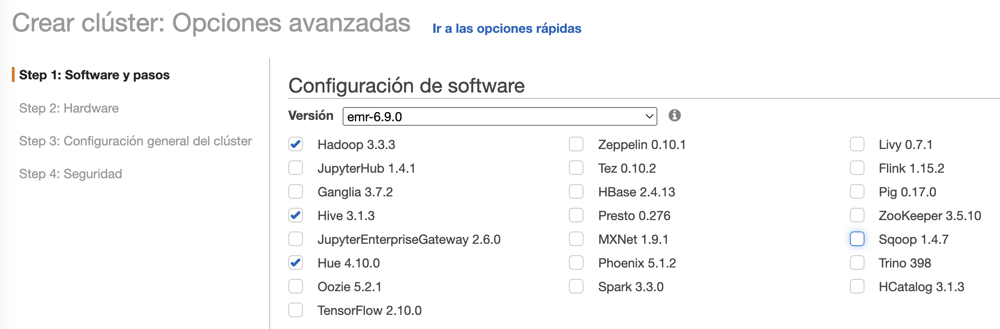
    <figcaption>Servicios Hadoop en EMR</figcaption>
</figure>

Ofrece elasticidad sobre el cluster, pudiendo modificar dinámicamente el dimensionamiento del cluster según necesidades, tanto hacia arriba como hacia abajo de clúster que están en ejecución.

Respecto al hardware, se ejecuta sobre máquinas EC2 (IaaS), las cuales podemos configurar según necesidades. Utiliza HDFS y S3 para el almacenamiento, de manera que podemos guardar los datos de entrada y los de salida en S3, mientras que los resultados intermedios los almacenamos en HDFS.

Los cluster de EMR se componen de:

* un nodo maestro, encargado de gestionar el cluster y ejecutar los servicios de coordinación de datos.
* varios nodos principales, los cuales ejecutan las tareas y almacenan los datos en el clúster HDFS.
* nodos *tareas*, los cuales son opcionales, y no almacenan datos, y podemos añadir a un cluster para incrementar la capacidad de procesamiento (e eliminarlos una vez no los necesitamos para reducir costes).

A nivel de servicios, podemos definir su arquitectura en cuatro capas:

* Almacenamiento: mediante HFDS, EMR FS o el sistema de archivos local (almacenamiento de las instancias EC2).
* Gestor de recursos del cluster: YARN
* Frameworks de procesamiento de datos: Hadoop MapReduce y Apache Spark
* Aplicaciones: Apache Spark, Apache Hive, etc...


## Lanzando EMR

Antes de lanzar EMR, necesitamos crear un repositorio de información donde guardar los datos de entrada y salida, así como los logs que EMR genere.

Para ello, en S3 generaremos un bucket al que llamaremos `s3severo8a-emr`.

Podemos lanzar un cluster de EMR de tres formas, mediante la consola, el CLI o con un API. Vamos a centrar en el uso de la consola.

A continuación, accedemos al servicio de EMR, y creamos un cluster el cual hemos llamado `ClusterEMRs8a` y le indicamos la carpeta en S3 que acabamos de crear, así como en el modo de lanzamiento elegimos *Clúster*:

<figure style="align: center;">
    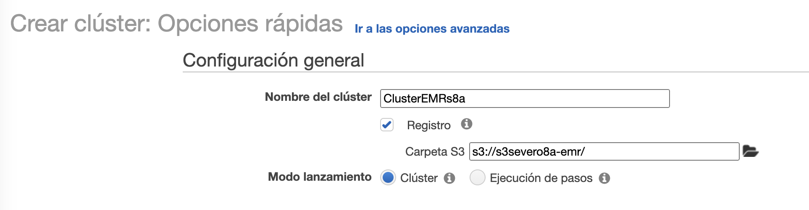
    <figcaption>Creando un clúster en EMR</figcaption>
</figure>

A continuación, elegimos como tipo de instancia `m4.large` (2 CPU y 8 GiB RAM) y como par de claves `vockey`, las cuales podemos descargar desde *AWS Details* al lanzar nuestro *Learner Lab*:

<figure style="align: center;">
    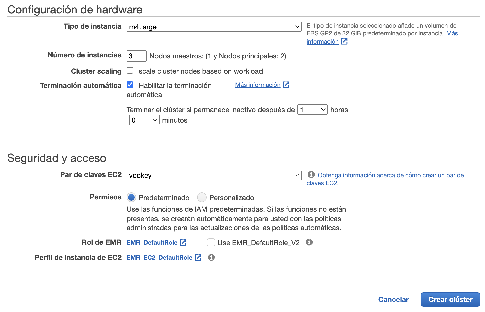
    <figcaption>Eligiendo instancias y clave SSH</figcaption>
</figure>

Tras darle a crear, a los 10 minutos aproximadamente, nuestro clúster estará listo para trabajar con él.

!!! info "Modos de lanzamiento"
    Normalmente, cuando utilizamos un clúster para procesar analíticas, interactuar con aplicaciones de big data o procesamiento de *datasets* de forma periódica, el clúster está siempre corriendo, a no ser que lo detengamos nosotros de forma explícita.
    Pero si queremos que sólo exista durante la ejecución de uno o más trabajos, el cual se le conoce como clúster *transient* o de ejecución por pasos, al terminar de ejecutar los pasos indicados, el clúster se detendrá.

## Preparando al clúster

En un cluster EMR, el nodo maestro es una instancia EC2 que coordina al resto de instancias EC2 que corren los nodos principales y de tareas. Este nodo expone un DNS público el cual podemos utilizar para conectarnos.

Por defecto, EMR crea un grupo de seguridad para el nodo maestro el cual determina el acceso. De inicio, es grupo de seguridad no permite las conexiones SSH. Por ello, antes de poder conectarnos al cluster, necesitamos modificar el grupo de seguridad del nodo principal para permitir todo el tráfico TCP y el SSH.

<figure style="align: center;">
    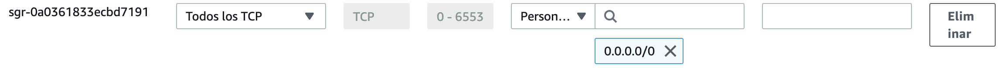
    <figcaption>Permitiendo todas las conexiones de entrada</figcaption>
</figure>

De forma paralela, por defecto, EMR bloquea el arranque de los clúster que permitan las conexiones del exterior (esto nos puede pasar si al crear el clúster le asignamos un grupo de seguridad que ya teníamos creado y que permitía el tráfico entrante).

Para permitir el acceso desde el exterior, podemos arrancar un clúster con el trafico cerrado, y una vez ya ha arrancado cambiar su grupo de seguridad, o en la opción de *Bloquear el acceso público* de EMR, desactivarlo:

<figure style="align: center;">
    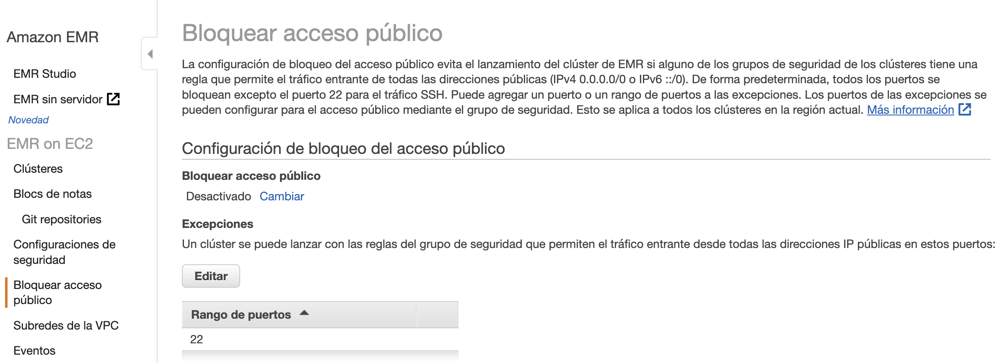
    <figcaption>Desactivando el bloqueo del acceso público</figcaption>
</figure>

## Conectándonos al clúster

Una vez arrancado, nos podemos conectar al nodo principal.

<figure style="float: right;">
    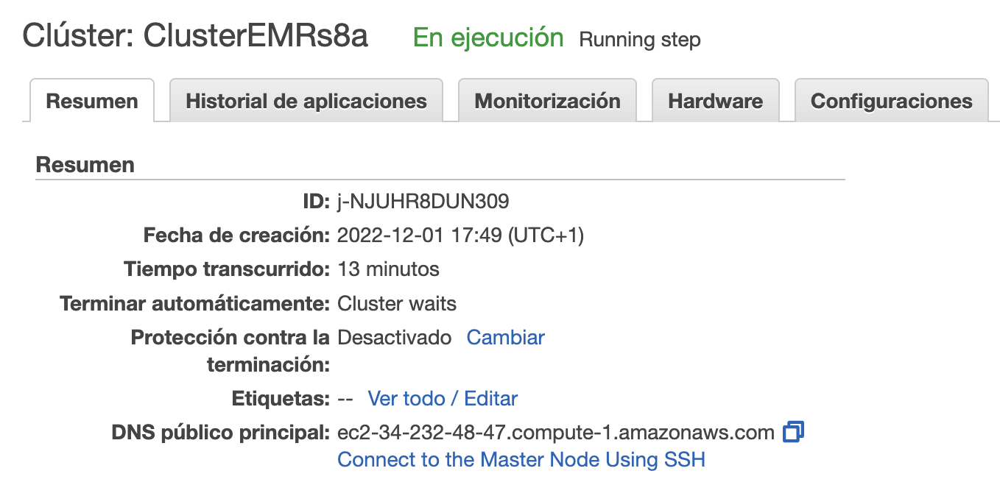
    <figcaption>Cluster arrancado</figcaption>
</figure>

Por ejemplo, podemos conectarnos a:

* El namenode de HDFS
* Hue (mal traducido a Tonalidad)
* El interfaz de Tez
* O la de YARN

!!! caution "Parece que funciona pero..."
    Una vez arrancado, a día de hoy tenemos un par de propiedades que modificar, ya que el acceso web a HDFS está bloqueado, y la ruta de HDFS en Hue está mal configurada.

Así pues, vamos a conectarnos vía SSH para activar el navegador web de HDFS. Con nuestras claves `labsuser.pem` descargadas, nos conectamos al clúster (recuerda poner `hadoop@` delante de la URL del namenode):

``` bash
ssh -i labsuser.pem hadoop@ec2-34-232-48-47.compute-1.amazonaws.com
```

Al conectarnos, tanto EC2 como EMR nos darán la bienvenida:

``` text

       __|  __|_  )
       _|  (     /   Amazon Linux 2 AMI
      ___|\___|___|

https://aws.amazon.com/amazon-linux-2/
22 package(s) needed for security, out of 32 available
Run "sudo yum update" to apply all updates.

EEEEEEEEEEEEEEEEEEEE MMMMMMMM           MMMMMMMM RRRRRRRRRRRRRRR    
E::::::::::::::::::E M:::::::M         M:::::::M R::::::::::::::R   
EE:::::EEEEEEEEE:::E M::::::::M       M::::::::M R:::::RRRRRR:::::R 
  E::::E       EEEEE M:::::::::M     M:::::::::M RR::::R      R::::R
  E::::E             M::::::M:::M   M:::M::::::M   R:::R      R::::R
  E:::::EEEEEEEEEE   M:::::M M:::M M:::M M:::::M   R:::RRRRRR:::::R 
  E::::::::::::::E   M:::::M  M:::M:::M  M:::::M   R:::::::::::RR   
  E:::::EEEEEEEEEE   M:::::M   M:::::M   M:::::M   R:::RRRRRR::::R  
  E::::E             M:::::M    M:::M    M:::::M   R:::R      R::::R
  E::::E       EEEEE M:::::M     MMM     M:::::M   R:::R      R::::R
EE:::::EEEEEEEE::::E M:::::M             M:::::M   R:::R      R::::R
E::::::::::::::::::E M:::::M             M:::::M RR::::R      R::::R
EEEEEEEEEEEEEEEEEEEE MMMMMMM             MMMMMMM RRRRRRR      RRRRRR

[hadoop@ip-172-31-15-67 ~]$
```

### Visualizando HDFS

Para poder visualizar el sistema de archivos de HDFS, primero le cambiamos los permisos al `hdfs-site.xml` para poder editarlo sin problemas:

``` bash
sudo chmod 777 /etc/hadoop/conf/hdfs-site.xml
nano /etc/hadoop/conf/hdfs-site.xml
```

Editamos la propiedad `dfs.webhdfs.enabled` y la ponemos a `true`:

``` xml
<property>
    <name>dfs.webhdfs.enabled</name>
    <value>false</value>
</property>
```

Sólo nos queda reiniciar el servicio de HDFS:

``` bash
sudo systemctl restart hadoop-hdfs-namenode
```

Y ahora desde el interfaz de HDFS ya podemos navegar por las carpetas y ver el contenido:

<figure style="align: center;">
    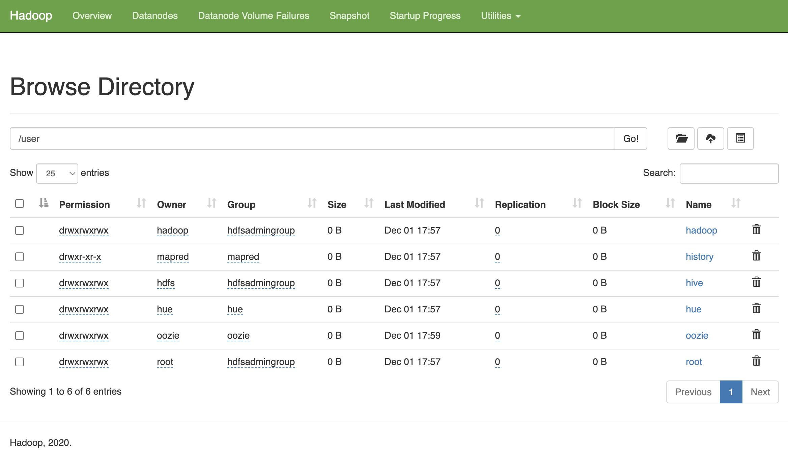
    <figcaption>Interfaz de HDFS</figcaption>
</figure>

### Hue y HDFS

Cuando arranca Hue, la primera vez nos pide crear un usuario (en nuestro caso, hemos creado el usuario `iabd` con contraseña `IABDiabd1.`)

<figure style="align: center;">
    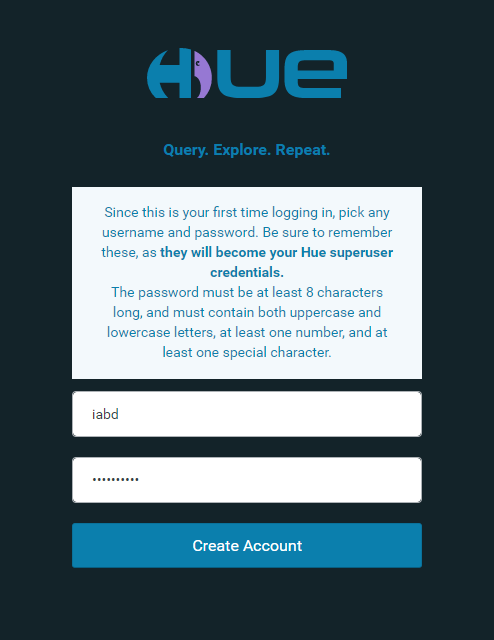
    <figcaption>Login de acceso a Hue</figcaption>
</figure>

Si intentamos visualizar los archivos, de igual modo, Hue no tiene bien configurado el acceso a HDFS:

<figure style="align: center;">
    
    <figcaption>Error al mostrar los archivos en Hue</figcaption>
</figure>

Para ello, igual que hemos realizado antes, cambiamos los permisos y editamos el fichero de configuración:

``` bash
sudo chmod 777 /etc/hue/conf/hue.ini
nano /etc/hue/conf/hue.ini
```

Y configuramos bien el puerto de acceso (debe ser 50070), dentro del grupo `[[hdfs_clusters]]` de `[hadoop]` editamos la propiedad `webhdfs_url`:

``` ini
webhdfs_url = http://ip-172-31-15-67.ec2.internal:50070/webhdfs/v1
```

Y reiniciamos el servicio:

``` bash
sudo systemctl restart hue
```

Sólo nos queda crear un carpeta para nuestro usuario en HDFS:

``` bash
hdfs dfs -mkdir /user/iabd
```

Y ya podemos trabajar con Hue.

<figure style="align: center;">
    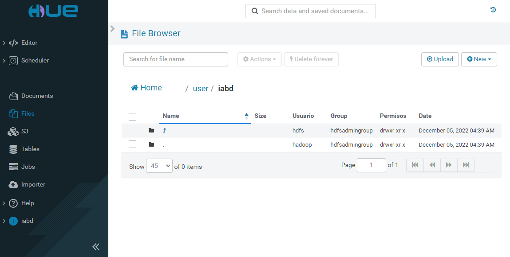
    <figcaption>Visualizando HDFS desde Hue</figcaption>
</figure>

## Escalando

Podemos ajustar el número de instancias EC2 con las que trabaja nuestro clúster de EMR, ya sea manualmente o de forma automática en respuesta a la demanda que reciba.

<figure style="align: center;">
    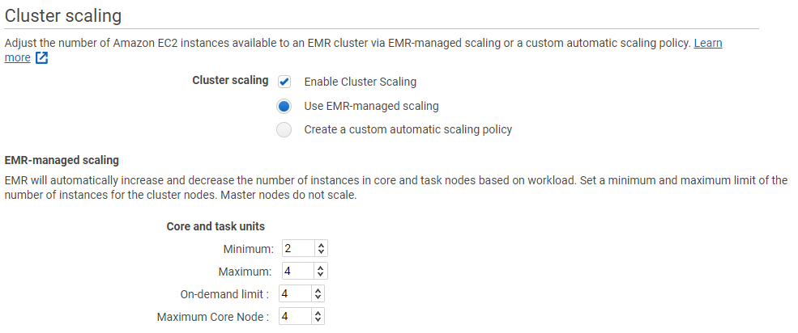
    <figcaption>Escalando un clúster EMR</figcaption>
</figure>

Para ello, podemos activar el escalado gestionado mediante EMR o crear una política de escalado a medida. Independiente del modo, hemos de considerar que siempre hemos de tener de uno a tres nodos maestros, y que una vez creado el clúster, este número no lo podemos cambiar. Lo que sí que podemos es añadir y eliminar nodos principales o de tareas.

<figure style="align: center;">
    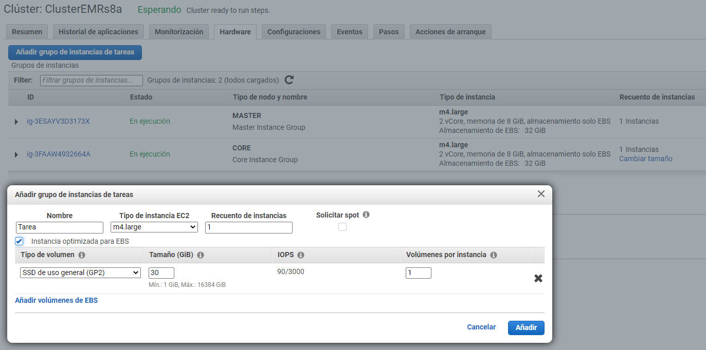
    <figcaption>Añadiendo un nodo de tipo tarea</figcaption>
</figure>

Conviene destacar que no podemos reconfigurar y redimensionar el clúster al mismo tiempo, de manera que hasta que no acabe la reconfiguración de un grupo de instancias no se puede iniciar el redimensionado.

## Costes

Es muy importante ser conscientes de los [costes](https://aws.amazon.com/es/emr/pricing/) que lleva utilizar EMR. *A grosso modo*, EMR supone un 25% de sobrecoste a las instancias ECS, es decir, pagaremos el coste del alquiler de las máquinas EC2 más un sobre un incremento del 25%.

<!--
4 CPUs con 16GB RAM - aprox 1,6€ / hora
-->

Por ejemplo, para 20 nodos con 122 Gb RAM, 16 vCPU, pagaríamos unos 32 €/h.

## Referencias

* [Tutorial de EMR en AWS](https://docs.aws.amazon.com/es_es/emr/latest/ManagementGuide/emr-gs.html)
* [AWS EMR Tutorial - Johnny Chivers - Youtube](https://www.youtube.com/watch?v=v9nk6mVxJDU)

## Actividades

1. (RA5075.2 / CE5.2b / 1p) Arranca un clúster EMR con 3 máquinas y modifica las configuraciones de HDFS y Hue para poder visualizar los archivos.
2. (RA5075.2 / CE5.2e / 1p) A continuación, añade un cuarto nodo al clúster y sube un archivo a HDFS. Tras ello, reescala el clúster para que quede en tres nodos. Vuelve a acceder a HDFS y comprueba que el archivo sigue estando disponible.

*[RA5075.2]: Gestiona sistemas de almacenamiento y el amplio ecosistema alrededor de ellos facilitando el procesamiento de grandes cantidades de datos sin fallos y de forma rápida.
*[CE5.2a]: Se ha determinado la importancia de los sistemas de almacenamiento para depositar y procesar grandes cantidades de cualquier tipo de datos rápidamente.
*[CE5.2b]: Se ha comprobado el poder de procesamiento de su modelo de computación distribuida.
*[CE5.2d]: Se ha determinado que se pueden almacenar tantos datos como se desee y decidir cómo utilizarlos más tarde.
*[CE5.2e]: Se ha visualizado que el sistema puede crecer fácilmente añadiendo módulos.
