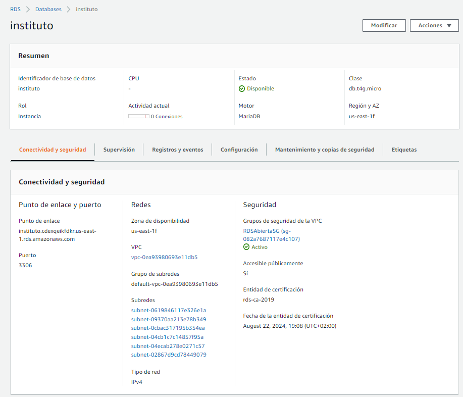
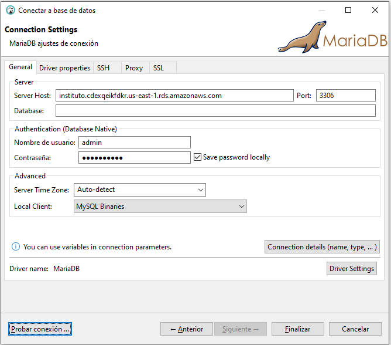
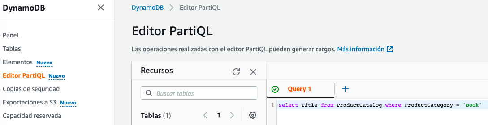

# Datos en la nube

Ya hemos visto que el almacenamiento en la nube ofrece un gran número de ventajas. Otro de los productos estrella de la computación en la nube es el uso de bases de datos, ya sean distribuidas o no.

La principal ventaja de utilizar un servicio de base de datos basado en la nube es que no requieren de la administración por parte del usuario. Éste sólo utiliza el servicio sin necesidad de tener conocimientos avanzados sobre su administración. Estos servicios se conocen como **administrados**, ya que la propia plataforma cloud se encarga de gestionar el escalado, las copias de seguridad automáticas, la tolerancia a errores y la alta disponibilidad, y por tanto, estos servicios forman parte de una solución PaaS.

Si nosotros creásemos una instancia EC2 e instalásemos cualquier sistema gestor de base de datos, como *MariaDB* o *PostgreSQL*, seríamos responsables de varias tareas administrativas, como el mantenimiento del servidor y la huella energética, el software, la instalación, la implementación de parches y las copias de seguridad de la base de datos, así como de garantizar su alta disponibilidad, de planificar la escalabilidad y la seguridad de los datos, y de instalar el sistema operativo e instalarle los respectivos parches.

## Datos relacionales - *Amazon RDS*

AWS ofrece *Amazon RDS* (<https://aws.amazon.com/es/rds/>) como servicio administrado que configura y opera una base de datos relacional en la nube, de manera que como desarrolladores sólo hemos de enfocar nuestros esfuerzos en los datos y optimizar nuestras aplicaciones.

### Instancias de bases de datos

Una instancia de base de datos es un entorno de base de datos aislado que puede contener varias bases de datos creadas por el usuario. Se puede acceder a él utilizando las mismas herramientas y aplicaciones que utiliza con una instancia de base de datos independiente.

Cuando vamos a crear una instancia de base de datos, primero hemos de indicar qué motor de base de datos ejecutar. Actualmente, RDS admite seis motores de bases de datos:

* [MySQL](https://aws.amazon.com/es/rds/mysql/), compatible con las versiones 5.6, 5.7 y 8.0.
* [Amazon Aurora](https://aws.amazon.com/es/rds/aurora/)
* [Microsoft SQL Server](https://aws.amazon.com/es/rds/sqlserver/), que permite implementar varias versiones de SQL Server (2012, 2014, 2016, 2017 y 2019), incluidas las Express, Web, Standard y Enterprise.
* [PostgreSQL](https://aws.amazon.com/es/rds/postgresql/), compatible con las versiones 9.6, 10, 11 y 12.
* [MariaDB](https://aws.amazon.com/es/rds/mariadb/), compatible con las versiones 10.2, 10.3, 10.4 y 10.5
* y [Oracle](https://aws.amazon.com/es/rds/oracle), compatible con Oracle 12 y Oracle 19, con dos modelos de licencia diferentes: *Licencia incluida* y *Bring-Your-Own-License (BYOL)*.

Los recursos que se encuentran en una instancia de base de datos se definen en función de la clase de instancia de base de datos, y el tipo de almacenamiento se determina por el tipo de disco. Las instancias y el almacenamiento de base de datos difieren en cuanto a las características de rendimiento y al precio, lo que permite adaptar el coste y el rendimiento a las necesidades de nuestra base de datos.

<figure style="align: center;">
    
    <figcaption>Instancia de RDS</figcaption>
</figure>

Por ejemplo, si seleccionamos el motor de *MariaDB*, podemos observar como mediante la creación sencilla nos ofrece tres propuestas de tamaño, dependiendo de si es para el entorno de producción, desarrollo y pruebas o el de la capa gratuita.

<figure style="align: center;">
    
    <figcaption>Configuración de tamaño de la instancia con MariaDB</figcaption>
</figure>

### Alta disponibilidad

Una de las características más importantes de *RDS* es la capacidad de configurar la instancia de base de datos para una alta disponibilidad con una [implementación Multi-AZ](https://aws.amazon.com/es/rds/features/multi-az/). Al hacerlo, se genera de manera automática una **copia en espera** de la instancia de base de datos en otra zona de disponibilidad dentro de la misma VPC. Después de propagar la copia de la base de datos, las transacciones se replican de forma ^^síncrona^^ a la copia en espera.

<figure style="align: center;">
    
    <figcaption>Alta disponibilidad en Multi-AZ</figcaption>
</figure>

Por lo tanto, si la instancia de base de datos principal falla en una implementación Multi-AZ, *RDS* activa automáticamente la instancia de base de datos en espera como la nueva instancia principal.

#### Réplica de lectura

RDS también admite la creación de [réplicas de lectura](https://aws.amazon.com/es/rds/features/read-replicas/) para MySQL, MariaDB, PostgreSQLy Amazon Aurora. 

<figure style="float: right;">
    
    <figcaption>Réplica de lectura</figcaption>
</figure>

Las actualizaciones que se realizan en la instancia principal se copian de manera ^^asíncrona^^ en la instancia de réplica de lectura, de manera que direccionando las consultas a esta nueva réplica reduciremos la carga de la instancia principal.

Las réplicas de lectura también pueden convertirse en la instancia de base de datos principal, pero, debido a la replicación asíncrona, este proceso debe hacerse de forma manual.

Las réplicas de lectura pueden crearse en una región diferente a la utilizada por la base de datos principal, lo que puede mejorar la recuperación de desastres y/o disminuir la latencia al dirigir las lecturas a una réplica de lectura lo más cercana al usuario.

### Casos de uso

AmazonRDS es ideal para las aplicaciones web y móviles que necesitan una base de datos con alto rendimiento, enorme escalabilidad en el almacenamiento y alta disponibilidad.

Se recomienda *RDS* cuando nuestra aplicación necesite:

* Transacciones o consultas complejas
* Tasa de consulta o escritura media a alta: hasta 30.000 IOPS (15.000 lecturas + 15.000 escrituras)
* No más de una única partición o nodo de trabajo
* Alta durabilidad

En cambio, no se recomienda cuando:

* Tasas de lectura o escritura muy grandes (por ejemplo, 150.000 escrituras por segundo)
* Fragmentación causada por el gran tamaño de los datos o las altas demandas de rendimiento
* Solicitudes y consultas GET o PUT simples que una base de datos NoSQL puede manejar
* Personalización del sistema de administración de bases de datos relacionales (en este caso, es mejor instalar por nuestra cuenta el SGBD que necesitemos en una instancia EC2).

### Costes

El [coste](https://aws.amazon.com/es/rds/pricing/) se calcula en base al tiempo de ejecución (calculado en horas) así como las características de la base de datos. Las características de la base de datos varían según el motor, el [tipo de instancia](https://aws.amazon.com/es/rds/instance-types/) y su cantidad, así como la clase de memoria de la base de datos.

Otros gastos asociados son:

* almacenamiento aprovisionado: el almacenamiento para copias de seguridad de hasta el 100% del almacenamiento de nuestra base de datos activa es gratuito. Una vez que se termina la instancia de base de datos, el almacenamiento para copias de seguridad se factura por GB por mes.
* cantidad de solicitudes de entrada y de salida.

Aunque se recomienda utilizar la [calculadora de costes](https://calculator.aws/#/addService) para afinar en el presupuesto, por ejemplo, una base de datos con MariaDB con una instancia `db.m4.large` con 2 procesadores y 8GB de RAM, en una única AZ, con un porcentaje de utilización del 100%  y 30GB para almacenar los datos, cuesta alrededor de 131$ mensuales. En cambio si la cambiamos por dos instancias más potentes, como puede ser la `db.m4.4xlarge`, con 16 procesadores y 64 GB de RAM, en multi-AZ ya sube a unos 4.100$ al mes.

Es importante recordar que si reservamos las instancias estos costes se reducirían en proporción a 2350$ (reserva de un año) o 1526$ (reserva de tres años).

### Ejemplo RDS

A continuación vamos a hacer un ejemplo sencillo donde vamos a crear una base de datos con la información que vimos en el bloque de SQL. Para ello, crearemos una instancia de MariaDB y nos conectaremos desde *HeidiSQL*.

<figure style="align: center;">
    
    <figcaption>Creación de la BD en RDS</figcaption>
</figure>

Así pues, desde la consola de AWS, crearemos nuestra base de datos a la que llamaremos `instituto`.

En nuestro caso hemos seguido la creación estándar con una plantilla de la capa gratuita (utiliza una instancia `db.t2.micro`). Una vez configurado el usuario `admin` y la contraseña `adminadmin` (al menos debe tener ocho caracteres), debemos configurar la conectividad.

!!! caution "Instancias permitidas en AWS Academy"
    Si queréis crear bases de datos con máquinas más potentes, podéis utilizar instancias hasta nivel *medium*, y a ser posible a ráfagas (instancias *t*). Dentro de la *Configuración adicional*, es importante deshabilitar la monitorización mejorada (no tenemos permiso para su uso en *AWS Academy*).

Como vamos a querer acceder a nuestro servidor de MariaDB desde fuera de una VPC de EC2, necesitamos configurar el acceso público. Al hacerlo, no quiere decir que ya sea accesible desde fuera de internet, ya que necesitamos configurar su grupo de seguridad (recordad que funciona a modo de *firewall*). Así pues, es recomendable crear un nuevo grupo de seguridad para que permitamos las conexiones del puerto 3306 a nuestra IP.

<figure style="align: center;">
    
    <figcaption>Configuración de la conectividad en RDS</figcaption>
</figure>

Así pues, una vez creada (lo cual tarda unos minutos), podremos seleccionar la instancia creada y ver su panel de información:

<figure style="align: center;">
    
    <figcaption>Resumen de instancia en RDS</figcaption>
</figure>

Así pues, si copiamos la información del punto de enlace y creamos una conexión en *HeidiSQL*, veremos que nos conectamos correctamente (si no hemos creado un nuevo grupo de seguridad, deberemos editar el grupo de seguridad por defecto, y añadir una regla de entrada para el protocolo TCP para el puerto 3306, y por ejemplo para todo internet - `0.0.0.0/0`).

<figure style="align: center;">
    
    <figcaption>Configuración en HeidiSQL</figcaption>
</figure>

Una vez conectado, ya procedemos de la misma manera que hemos trabajado en el módulo de repaso de SQL.

## Amazon Aurora

Amazon Aurora es una base de datos relacional compatible con *MySQL* y *PostgreSQL* optimizada para la nube. Combina el rendimiento y la disponibilidad de las bases de datos comerciales de alta gama con la simplicidad y la rentabilidad de las bases de datos de código abierto. Ofrece dos modelos, el clásico basado en instancias y un [modelo *serverless*](https://aws.amazon.com/es/rds/aurora/serverless/) en el cual se contratan unidades de computación (ACU). Cabe destacar que si creamos una base de datos serverless, Amazon no permite hacerla pública, de manera que únicamente se puede acceder desde otro servicio de AWS.

Al estar desarrollado de forma nativa por Amazon se adapta mejor a su infraestructura en coste, rendimiento y alta disponibilidad. Está pensado como un subsistema de almacenamiento distribuido de alto rendimiento, ofreciendo automatización de las tareas que requieren mucho tiempo, como el aprovisionamiento, la implementación de parches, las copias ​de seguridad, la recuperación, la detección de errores y su reparación.

<figure style="float: right;">
    
    <figcaption>Alta disponibles con Aurora</figcaption>
</figure>

Aurora replica varias copias de los datos en múltiples zonas de disponibilidad y realiza copias de seguridad continuas de los datos en *S3*.

Respecto a la seguridad, hay varios niveles disponibles, incluidos el aislamiento de la red con *VPC*, el cifrado en reposo por medio de claves creadas y controladas con *AWS KMS* y el cifrado de los datos en tránsito mediante SSL.

Respecto al coste, si cogemos el mismo ejemplo anterior de una instancia de Aurora compatible con MySQL con dos procesadores y 8GB de RAM, en este caso, la `db.t4g.large`, el precio se queda en 106$ mensuales.

## Datos NoSQL - *DynamoDB*

DynamoDB (<https://aws.amazon.com/es/dynamodb/>) es un servicio administrado de base de datos NoSQL clave-valor y documental, rápido y flexible para todas las aplicaciones que requieren una latencia uniforme de un solo dígito de milisegundos a cualquier escala y una capacidad de almacenamiento prácticamente ilimitado.

Así pues, es un almacén de claves/valor (similar a [Redis](https://redis.io/) y [MongoDB](https://www.mongodb.com/es) a la vez), flexible y sin estructura fija (los elementos pueden tener atributos diferentes), diseñado para garantizar un determinado rendimiento así como una determinada disponibilidad para cada tabla (en NoSQL suele haber pocas tablas), es decir, se definen elementos por tabla y se paga según lo exigido en cada una.

### Componentes y particiones

Los componentes principales son:

* las **tablas**: son conjuntos de datos, formada por los elementos.
* los **elementos**: grupo de atributos que se puede identificar de forma exclusiva entre todos los demás elementos
* los **atributos**: elemento de datos fundamental que no es preciso seguir dividiendo.

DynamoDB soporta dos tipos de claves principales:

* La **clave de partición** es una clave principal simple.
* La **clave de partición y de ordenamiento**, también conocidas como clave principal compuesta, ya que está formada por dos atributos.

<figure style="align: center;">
    
    <figcaption>Claves</figcaption>
</figure>

A medida que aumenta el volumen de datos, la clave principal particiona e indexa los datos de la tabla. Podemos recuperar los datos de una tabla de *DynamoDB* de dos formas distintas, bien por la clave y hacer una consulta directa, o utilizar un escaneo de todos los elementos en busca de aquello que coincida con el parámetro de búsqueda.

<figure style="align: center;">
    
    <figcaption>Consultas por clave o escaneo</figcaption>
</figure>

Para aprovechar al máximo las operaciones de consulta, es importante que la clave utilizada identifique de forma unívoca los elementos de la tabla de DynamoDB. Podemos configurar una clave principal simple basada en un único atributo de los valores de los datos con una distribución uniforme. De forma alternativa, podemos especificar una clave compuesta, que incluye una clave de partición y una clave secundaria.

Además, *DynamoDB* permite crear índices para optimizar las consultas que realicemos sobre atributos que no forman parte de la clave de partición u ordenamiento.

### Infraestructura

Amazon administra toda la infraestructura subyacente de datos y los almacena de manera redundante en varias instalaciones dentro de una región, como parte de la arquitectura tolerante a errores.

El sistema particiona los datos automáticamente, distribuyendo los datos entre diferentes dispositivos de almacenamiento. No existe ningún límite práctico respecto de la cantidad de elementos que se pueden almacenar en una tabla. Por ejemplo, algunos clientes tienen tablas de producción con miles de millones de elementos.

Todos los datos de *DynamoDB* se almacenan en unidades SSD, y su lenguaje de consulta simple ([PartiQL](https://partiql.org/)) permite un rendimiento de las consultas uniforme y de baja latencia. Además de escalar el almacenamiento, *DynamoDB* permite aprovisionar el volumen del rendimiento de lectura o escritura que necesita para cada tabla.

También permite habilitar el escalado automático, monitorizando la carga de la tabla e incrementando o disminuyendo el rendimiento aprovisionado de manera automática. Otras características clave son las tablas globales que permiten generar réplicas de manera automática en las regiones de AWS que elijamos, el cifrado en reposo y la visibilidad del tiempo de vida (TTL) de los elementos.

### Costes

Con *DynamoDB* se cobran las operaciones de lectura, escritura y almacenamiento de datos en sus tablas, junto con las características opcionales que decidamos habilitar. Ofrece dos modos de capacidad con opciones de facturación:

* [Bajo demanda](https://aws.amazon.com/es/dynamodb/pricing/on-demand/): se cobran las operaciones de lectura y escritura de datos realizada en las tablas. No necesitamos especificar el rendimiento de lectura y escritura que espera de nuestras aplicaciones. Apropiado cuando:

    * Creamos nuevas tablas con cargas de trabajo desconocidas.
    * El tráfico de la aplicación es impredecible.

* [Aprovisionada](https://aws.amazon.com/es/dynamodb/pricing/provisioned/): se configura el número de operaciones de lectura y escritura por segundo que consideramos que necesitará nuestra aplicación. Permite usar el escalado automático para ajustar automáticamente la capacidad de la tabla en función de la tasa de uso especificada. Apropiado cuando:

    * El tráfico de la aplicación es predecible.
    * Las aplicaciones tienen un tráfico uniforme o aumenta gradualmente.
    * Los requisitos de capacidad se pueden predecir para controlar los costos

Por ejemplo, una tabla donde especificamos un rendimiento garantizado de 1000  millones lecturas y 1 millón de escrituras al mes, con una coherencia eventual (es decir, que permite desorden de peticiones ) nos costará $67,17 al mes.

### Ejemplo DynamoDB

A continuación vamos a crear un ejemplo donde tras crear una tabla, la cargaremos con datos para posteriormente realizar alguna consulta.

Supongamos que tenemos datos relativos a un catálogo de productos, almacenados en el archivo [ProductCatalog.json](resources/ProductCatalog.json), el cual queremos poder consultar.

Si visualizamos el primer registro podemos observar su estructura. Esta estructura es específica de *DynamoDB*, ya que indica en el primer elemento el nombre de la tabla (en nuestro caso `ProductCatalog`), y a continuación el tipo de operación (`PutRequest`):

``` json
{
    "ProductCatalog": [
        {
            "PutRequest": {
                "Item": {
                    "Id": {
                        "N": "101"
                    },
                    "Title": {
                        "S": "Book 101 Title"
                    },
                    "ISBN": {
                        "S": "111-1111111111"
                    },
                    "Authors": {
                        "L": [
                            {
                                "S": "Author1"
                            }
                        ]
                    },
                    "Price": {
                        "N": "2"
                    },
                    "Dimensions": {
                        "S": "8.5 x 11.0 x 0.5"
                    },
                    "PageCount": {
                        "N": "500"
                    },
                    "InPublication": {
                        "BOOL": true
                    },
                    "ProductCategory": {
                        "S": "Book"
                    }
                }
            }
        },
```

Para ello, primero vamos a crear la tabla desde el interfaz web de AWS. Tras seleccionar *Amazon DynamoDB*, creamos una tabla que llamamos `ProductCatalog`, cuyo identificador será `Id` de tipo *número*. El resto de campos se crearán automáticamente al importar los datos.

<figure style="align: center;">
    
    <figcaption>Creando la tabla</figcaption>
</figure>

También podíamos haber creado la tabla mediante el comando [create-table](https://awscli.amazonaws.com/v2/documentation/api/latest/reference/dynamodb/create-table.html) de AWS CLI:

``` bash
aws dynamodb create-table \
    --table-name ProductCatalog \
    --attribute-definitions AttributeName=Id,AttributeType=N  \
    --key-schema AttributeName=Id,KeyType=HASH \
    --billing-mode PAY_PER_REQUEST
```

Para introducir los datos, podemos hacerlo de varias maneras.

* Si pulsamos sobra la tabla y luego en elementos podemos rellenar un formulario indicando el tipo de los elementos y su valor.
* Otra manera más ágil es mediante AWS CLI (recordad antes configurar las [variables de entorno](02aws.md#variablesEntorno) con la información de la conexión):

    El comando [batch-write-item](https://awscli.amazonaws.com/v2/documentation/api/latest/reference/dynamodb/batch-write-item.html) permite importar los datos desde un archivo JSON siempre y cuando cumpla con el formato comentado anteriormente.

    Así pues, el comando sería:

    ``` bash
    aws dynamodb batch-write-item --request-items file://ProductCatalog.json
    ```

    Una vez ejecutado tendremos un mensaje de `UnprocessedItems: {}`.

Si volvemos a la consola web, tras entrar en la tabla y pulsar en *Ver elementos* veremos los datos ya introducidos.

<figure style="align: center;">
    
    <figcaption>Ver elementos</figcaption>
</figure>

Si queremos consultar información de la tabla mediante el comando [describe-table](https://awscli.amazonaws.com/v2/documentation/api/latest/reference/dynamodb/describe-table.html) de AWS CLi, ejecutaremos:

``` bash
aws dynamodb describe-table --table-name ProductCatalog
```

Si queremos hacer la consulta de la tabla para ver los datos que contiene desde el comando [scan](https://awscli.amazonaws.com/v2/documentation/api/latest/reference/dynamodb/scan.html) de AWS CLI, ejecutaremos:

``` bash
aws dynamodb scan --table-name ProductCatalog
```

Y veremos algo similar a:

``` json
{
    "Items": [
        {
            "Title": {
                "S": "18-Bike-204"
            },
            "Price": {
                "N": "500"
            },
            "Brand": {
                "S": "Brand-Company C"
            },
            "Description": {
                "S": "205 Description"
            },
            "Color": {
                "L": [
                    {
                        "S": "Red"
                    },
                    {
                        "S": "Black"
                    }
                ]
            },
            "ProductCategory": {
                "S": "Bicycle"
            },
            "Id": {
                "N": "205"
            },
            "BicycleType": {
                "S": "Hybrid"
```

Como se puede observar, los datos salen desordenados.

Vamos a realizar consultas sobre estos datos haciendo uso de *PartiQL*. Así pues, en el menú de la izquierda, seleccionamos el editor *PartiQL*.

<figure style="align: center;">
    
    <figcaption>Consultas con PartiQL</figcaption>
</figure>

En el panel de la derecha podremos realizar consultas del tipo:

``` sql
select * from ProductCatalog where Id = 101
select Title from ProductCatalog where ProductCategory = 'Book'
select * from ProductCatalog where Price >= 300
```

!!! info "Consultas *PartiQL* mediante *Python*"
    Más adelante mediante *Python*, accederemos a *DynamoDB* y realizaremos consultas con *PartiQL*, además de operaciones de inserción, modificación y borrado de datos.

## Actividades

1. Realizar el módulo 8 (Bases de Datos) del curso [ACF de AWS](https://awsacademy.instructure.com/courses/2243/).

2. Siguiendo el ejemplo de RDS, crea una instancia (`instituto`) de una base de datos de tipo *MariaDB* y cárgala con todos los datos de las sesiones de repaso de SQL (las tablas iniciales y las de inserción).

3. (opcional) A partir de la instancia del ejercicio anterior, crea una instantánea de forma manual. A continuación, restaura esta instantánea en una nueva instancia (por ejemplo, `instituto2`) de tipo `db.t4g.medium`, y tras conectarte mediante *HeidiSQL*, comprueba que tiene los datos ya cargados. Adjunta una captura de pantalla donde se vean las características de las dos instancias.

4. Siguiendo el ejemplo de *DynamoDB*, crea la tabla (`ProductCatalog`), cárgala con los datos del ejemplo y realiza un consulta para obtener bicicletas híbridas. Exporta el resultado a CSV.

## Referencias

* [Guía de usuario de Amazon RDS](https://docs.aws.amazon.com/es_es/AmazonRDS/latest/UserGuide/Welcome.html)
* [Guía de referencias de Amazon DynamoDB](https://docs.aws.amazon.com/es_es/amazondynamodb/latest/developerguide/Introduction.html)
* [Laboratorios con ejemplos y modelado con Amazon DynamoDB](https://amazon-dynamodb-labs.com/index.html)
