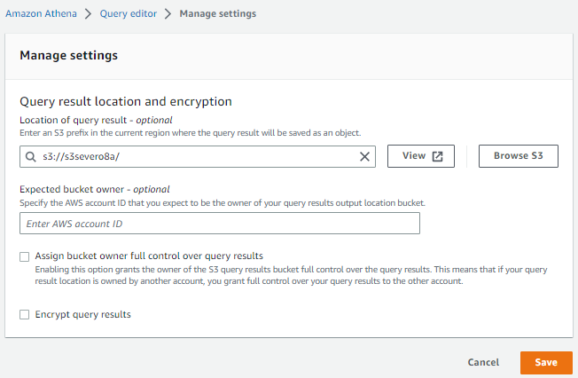
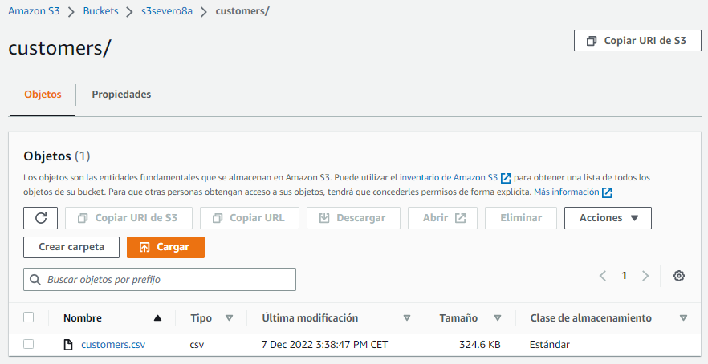
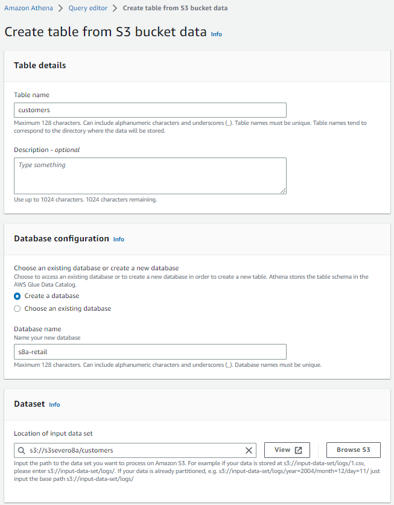
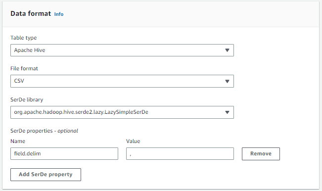
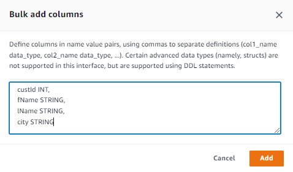
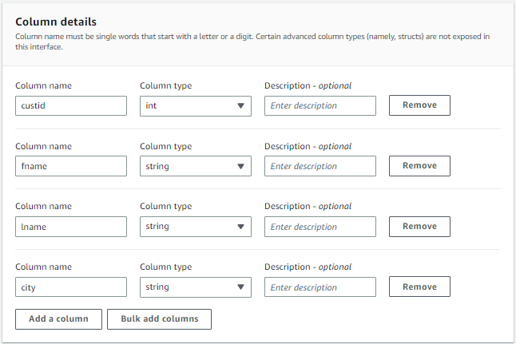
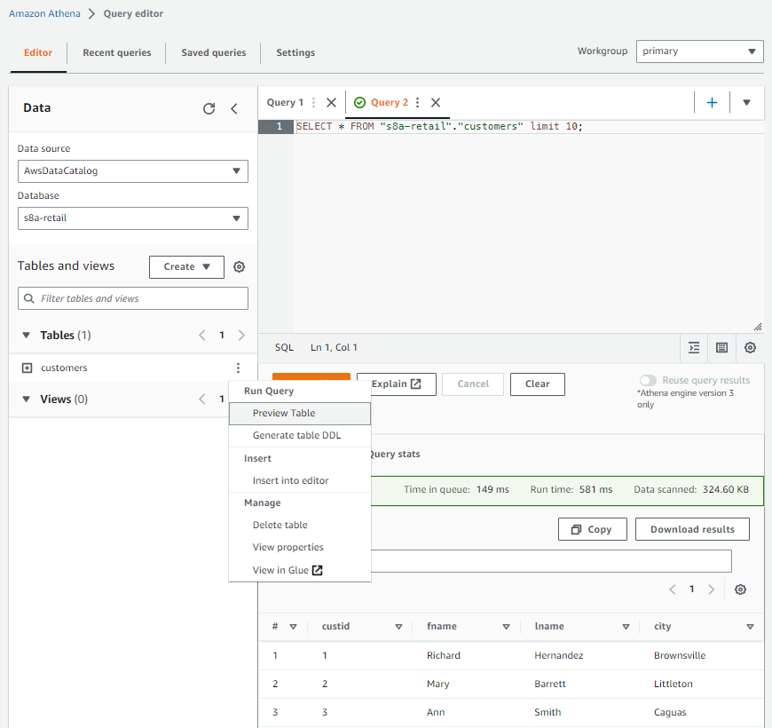

# AWS Athena

[Athena](https://aws.amazon.com/es/athena) es una herramienta *serverless* que permite realizar consultas sobre datos los cuales están directamente en S3 y que provienen de fuentes dispares como bases de datos, un flujo de datos, contenido web desestructurado, etc.. Athena almacena metadatos sobre las fuentes de datos, así como las consultas para poder reutilizarlas o compartirlas con otros usuarios.

<!--
Amazon Athena is an interactive query service that makes it easy for you to
analyze data directly in Amazon S3 using standard SQL. With a few actions in
the AWS Management Console, you can use Athena directly against data assets
stored in the data lake and begin using standard SQL to run ad hoc queries and
get results in a matter of seconds.
Athena is serverless, so there is no infrastructure to set up or manage, and you
only pay for the volume of data assets scanned during the queries you run.
Athena scales automatically—executing queries in parallel—so results are fast,
even with large datasets and complex queries. You can use Athena to process
unstructured, semi-structured, and structured data sets. Supported data asset
formats include CSV, JSON, or columnar data formats such as Apache Parquet
and Apache ORC. Athena integrates with Amazon QuickSight for easy
visualization. It can also be used with third-party reporting and business
intelligence tools by connecting these tools to Athena with a JDBC driver.

Athena is serverless, so there is no infrastructure to set up or manage, and you pay only for the queries you run. Athena scales automatically—running queries in parallel—so results are fast, even with large datasets and complex queries.

Amazon Athena is a fast, cost-effective, interactive query service that makes it easy to analyze petabytes of data in S3 with no data warehouses or clusters to manage.

-->

En el siguiente supuesto, vamos a crear una aplicación *Athena*, definiremos una base de datos, crearemos una tabla con sus columnas y tipos de datos, y ejecutaremos consultas sencillas y compuestas.

Los pasos a realizar son:

1. Seleccionar el *data set*, identificando en S3 donde están los datos. Athena permite consultar los datos CSV, TSV, JSON, Parquet y formato ORC.
2. Crear la tabla, mediante el asistente de crear tabla o utilizamos la sintaxis DDL de Hive.
3. Consultar los datos, mediante SQL.

## Preparando Athena

Antes de empezar con *Athena*, necesitamos indicar un *bucket* donde almacenar los resultados de nuestras consultas. Así pues, vamos a utilizar uno de los buckets que hemos creado en sesiones anteriores.

Tras acceder a *Athena*, en la pestaña de *Settings* del *Query Editor*, configuramos donde vamos a guardar los resultados:

<figure style="align: center;">
    
    <figcaption>Athena - Configuración inicial</figcaption>
</figure>

!!! info "Preparando los datos"
    Los datos que vamos a consultar son los datos de los clientes de la base de datos `retail_db` que hemos utilizando en la sesión de [Hive](../hadoop/06hive.md), los cuales hemos exportado al archivo [customers.csv](resources/customers.csv).

    Para poder leer estos datos, primero hemos de colocarlos en S3. En nuestro caso, hemos decidido crear una carpeta llamada `customers` dentro del *bucket* `s3severo8a`, y dentro de ella, hemos dejado el archivo con los datos:

    <figure style="align: center;">
        
        <figcaption>Archivo de customers.csv en S3</figcaption>
    </figure>

## Creando la estructura

En AWS Glue, o directamente en *Athena*, vamos a crear una base de datos y una tabla de forma similar a como se hace mediante *Hive*.

A continuación, entramos al *Query editor*, y a lado de la sección *Tables and views*, desplegamos el menú *Create* y creamos una tabla a partir de datos S3, indicándole un nombre para la tabla, otro para la base de datos (o elegimos una existente), así como la localización en S3 de la carpeta donde se encuentren nuestros datos:

<figure style="align: center;">
    
    <figcaption>Athena - Opción para crear la tabla a partir de S3</figcaption>
</figure>

A continuación, le indicamos que vamos a cargar los datos en una tabla de tipo Hive en formato CSV, utilizando la coma como separador de campos:

<figure style="align: center;">
    
    <figcaption>Athena - Configuración del formato</figcaption>
</figure>

Una vez tenemos el formato, debemos indicar la estructura de la tabla. 

<figure style="float: right;">
    
    <figcaption>Athena - Definición de las columnas</figcaption>
</figure>

Para ello, podemos añadir cada columna de una en una, indicando su nombre y su tipo, o mediante la opción *Bulk add columns*, y le pegamos el nombre y el tipo de las columnas, que en nuestro caso son:

``` sql
custId INT,
fName STRING,
lName STRING,
city STRING
```

Cuando los hayamos introducido, veremos como se han creado dichas columnas:

<figure style="align: center;">
    
    <figcaption>Athena - Configuración del formato</figcaption>
</figure>

Finalmente, veremos a modo de resumen una instrucción `create table` similar a la siguiente y ya podemos pulsar sobre *Create table*:

``` sql
CREATE EXTERNAL TABLE IF NOT EXISTS `s8a-retail`.`customers` (
  `custid` int,
  `fname` string,
  `lname` string,
  `city` string
)
ROW FORMAT SERDE 'org.apache.hadoop.hive.serde2.lazy.LazySimpleSerDe'
WITH SERDEPROPERTIES ('field.delim' = ',')
STORED AS INPUTFORMAT 'org.apache.hadoop.mapred.TextInputFormat' OUTPUTFORMAT 'org.apache.hadoop.hive.ql.io.HiveIgnoreKeyTextOutputFormat'
LOCATION 's3://s3severo8a/customers/'
TBLPROPERTIES ('classification' = 'csv');
```

## Realizando consultas

Si volvemos a la pantalla de *Query Editor*, si pinchamos sobre los tres puntos de la tabla `customers`, podemos hacer un preview de la tabla, y veremos que automáticamente realiza una consulta de tipo *`select * from customers`*

<figure style="align: center;">
    
    <figcaption>Athena - Realización de una consulta</figcaption>
</figure>

<!--
## AWS Glue

Es la herramienta ETL completamente administrado que ofrece Amazon Web Services.

Cuando el esquema de los datos es desconocido, *AWS Glue* permite inferirlo. Para ello, hemos de construir un rastreador (*crawler*) para descubrir su estructura.

. AWS Glue builds a catalog that contains metadata about the various data sources. AWS Glue is similar to Amazon Athena in that the actual data you analyze remains in the data source. The key difference is that you can build a crawler with AWS Glue to discover the schema.

### Creación

### Ejecución

Se puede ejecutar bajo demanda o planificar su ejecución de forma diaria, por horas, etc... Una vez lanzado, al cabo de un minuto, veremos que ha finalizado y en Base de Datos - > Tablas podremos ver la tabla que ha creado (en nuestro caso la tabla `csv`), junto con la estructura que ha inferido respecto a los datos cargados.

El siguiente paso es editar el esquema y ponerle nombres significativos a los campos:

Una vez los datos están cargados, ya podemos realizar consular con AWS Athena.
-->

## Referencias

* [Guía de usuario de AWS Athena](https://docs.aws.amazon.com/athena/latest/ug/what-is.html)
* [Getting started with AWS Athena](https://docs.aws.amazon.com/athena/latest/ug/getting-started.html)