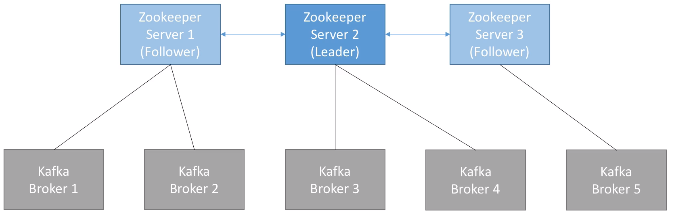

# Kafka

<!--
https://enmilocalfunciona.io/aprendiendo-apache-kafka-parte-3-conceptos-basicos-extra/

https://www.theninjacto.xyz/Instalacion-Configuracion-Kafka-Manager/

https://medium.com/big-data-engineering/hello-kafka-world-the-complete-guide-to-kafka-with-docker-and-python-f788e2588cfc
-->

## Introducción

[Apache Kafka](https://kafka.apache.org/) es, en pocas palabras, un *middleware* de mensajería entre sistemas heterogéneos, el cual, mediante un sistema de colas (*topics*, para ser concreto) facilita la comunicación asíncrona, desacoplando los flujos de datos de los sistemas que los producen o consumen. Funciona como un *broker* de mensajes, encargado de enrutar los mensajes entre los clientes de un modo muy rápido.

<figure style="align: center;">
    
    <figcaption>Kafka como middleware/broker de mensajes</figcaption>
</figure>

En concreto, se trata de una plataforma *open source* **distribuida** de **transmisión de eventos/mensajes** en tiempo real con almacenamiento duradero y que proporciona de base un alto rendimiento (capaz de manejar billones de peticiones al día, con una latencia inferior a 10ms), tolerancia a fallos, disponibilidad y escalabilidad horizontal (mediante cientos de nodos).

!!! info "Evento / Mensaje"
    Dentro del vocabulario asociado a arquitectura asíncronas basadas en productor/consumidor o publicador/suscriptor, se utiliza el mensaje para indicar el dato que viaja desde un punto a otro. En Kafka, además de utilizar el concepto mensaje, se emplea el término evento.

Más del [80% de las 100 compañías](https://kafka.apache.org/powered-by) más importantes de EEUU utilizan *Kafka*: *Uber*, *Twitter*, *Netflix*, *Spotify*, *Blizzard*, *LinkedIn*, *Spotify*, y *PayPal* procesan cada día sus mensajes con *Kafka*.

Como sistema de mensajes, sigue un modelo publicador-suscriptor. Su arquitectura tiene dos directivas claras:

* No bloquear los productores (para poder gestionar la [*back pressure*](https://youtu.be/K3axU2b0dDk), la cual sucede cuando un publicador produce más elementos de los que un suscriptor puede consumir).
* Aislar los productores y los consumidores, de manera que los productores y los consumidores no se conocen.

A día de hoy, *Apache Kafka* se utiliza, además de como un sistema de mensajería, para ingestar datos, realizar procesado de datos en streaming y analítica de datos en tiempo real, así como en arquitectura de microservicios y sistemas IOT.

!!! info "Amazon Kinesis"
    [Amazon Kinesis](https://aws.amazon.com/es/kinesis/) es un producto similar a *Apache Kafka* pero dentro de la plataforma AWS, por lo que no es un producto *open source* como tal. Su principal ventaja es la facilidad de escalabilidad a golpe de click e integración con el resto de servicios que ofrece AWS.
    Se trata de una herramienta muy utilizada que permite incorporar datos en tiempo real, como vídeos, audios, registros de aplicaciones, secuencias de clicks de sitios web y datos de sensores IoT para machine learning, analítica de datos en streaming, etc...

### Publicador / Suscriptor

Antes de entrar en detalle sobre Kafka, hay que conocer el modelo publicador/suscriptor. Este patrón también se conoce como *publish / subscribe* o *productor / consumidor*.

Hay tres elementos que hay que tener realmente claros:

* Publicador (*publisher* / productor / emisor): genera un dato y lo coloca en un *topic* como un mensaje.
* topic (tema): almacén temporal/duradero que guarda los mensajes funcionando como una cola.
* Suscriptor (*subscriber* / consumidor / receptor): recibe el mensaje.

Cabe destacar que un productor no se comunica nunca directamente con un consumidor, siempre lo hace a través de un *topic*:

<figure style="align: center;">
    
    <figcaption>Productor - Consumidor</figcaption>
</figure>

<!--
A partir de estos, existen otros elementos más complejos que ofrecen diferentes configuraciones:

tradicional: Cada suscriptor está asociado a uno o varios topic en concreto. Existen muchas variaciones:
Cada suscriptor está escuchando 1 topic propio.
Cada suscriptor está escuchando X topics independientes.
Cada suscriptor está escuchando X topics independientes y Y topics compartido.
Grupos de consumo: Los suscriptores se pueden agrupar por grupo, este grupo está escuchando un topic y sólo un miembro del grupo tendrá la capacidad de atender el mensaje.
Radio Difusión: Todos los suscriptores que están escuchando el topic reciben el mensaje (cada suscriptor es responsable de interpretar el mensaje de forma independiente).

Para ello se dispone de listas de temas/topics publicados específicos y un conjunto de suscriptores, el productor trata de clasificar el mensaje en base a una tipología, lo pone en la lista de un tema específico y el receptor se suscribe a la listas para recibir ese tipo de mensajes.

Tiene una clave, un valor y una marca
Los eventos se organizan de forma duradera en temas (similar a una carpeta de archivos)
Los temas están divididos, distribuidos en varios depósitos. Los eventos con la misma clave, se escriben en la misma partición.
-->

<!--
https://kafka.apache.org/quickstart
-->

## Caso 0: Hola Kafka

Para arrancar Kafka, vamos a utilizar la instalación que tenemos creada en nuestra máquina virtual.

!!! tip "Kafka mediante Docker"
    *Bitnami* tiene una imagen para trabajar con *Docker* la cual permite probar todos los ejemplos de esta sesión. Para ello, se recomienda seguir los pasos de la página oficial: <https://hub.docker.com/r/bitnami/kafka/>

El primer paso, una vez dentro de la carpeta de instalación de Kafka (en nuestro caso `/opt/kafka_2.13-3.3.1`), es arrancar *Zookeeper* mediante el comando `zookeeper-server-start.sh`, el cual se encarga de gestionar la comunicación entre los diferentes brokers:

``` bash
zookeeper-server-start.sh ./config/zookeeper.properties
```

!!! info "zookeeper.properties"
    Del archivo de configuración de Zookeeper conviene destacar dos propiedades:

    * `clientPort`: puerto por defecto (2181)
    * `dataDir`: indica donde está el directorio de datos de *Zookeeper* (por defecto es `tmp/zookeeper`, pero si queremos que dicha carpeta no se elimine es mejor que apunte a una ruta propia, por ejemplo `/opt/zookeeper-data`)

Para comprobar que Zookeeper está arrancado, podemos ejecutar el comando `lsof -i :2181`, el cual escanea el puerto 2181 donde está corriendo *Zookeeper*.

Una vez comprobado, en un nuevo terminal, arrancamos el servidor de *Kafka* mediante el comando `kafka-server-start.sh` (de manera que tenemos corriendo a la vez *Zookeeper* y *Kafka*):

``` bash
kafka-server-start.sh ./config/server.properties
```

### Creando un *topic*

A continuación, en un tercer terminal, vamos a crear un *topic* mediante el comando `kafka-topics.sh`:

``` bash
kafka-topics.sh --create --topic iabd-topic --bootstrap-server iabd-virtualbox:9092
```

Si queremos obtener la descripción del *topic* creado con la cantidad de particiones le pasamos el parámetro `--describe`:

``` bash
kafka-topics.sh --describe --topic iabd-topic --bootstrap-server iabd-virtualbox:9092
```

Obteniendo la siguiente información:

``` text
Topic: iabd-topic       TopicId: ogKnRpOFS7mfOhspLcuB4A PartitionCount: 1       ReplicationFactor: 1      Configs: segment.bytes=1073741824
        Topic: iabd-topic       Partition: 0    Leader: 0       Replicas: 0     Isr: 0
```

### Produciendo mensajes

Para enviar un mensaje a un *topic*, ejecutaremos en un cuarto terminal un productor mediante el comando `kafka-console-producer.sh`. Por defecto, cada línea que introduzcamos resultará en un evento separado que escribirá un mensaje en el *topic* (podemos pulsar CTRL+C en cualquier momento para cancelar):

``` bash
kafka-console-producer.sh --topic iabd-topic --bootstrap-server iabd-virtualbox:9092
```

Así pues, escribimos los mensajes que queramos:

``` text
>Este es un mensaje
>Y este es otro
>Y el tercero
```

### Consumiendo mensajes

Y finalmente, en otro terminal, vamos a consumir los mensajes:

``` bash
kafka-console-consumer.sh --topic iabd-topic --from-beginning --bootstrap-server iabd-virtualbox:9092
```

Al ejecutarlo veremos los mensajes que habíamos introducido antes (ya que hemos indicado la opción `--from-beginning`). Si ahora volvemos a escribir en el productor, casi instantáneamente, aparecerá en el consumidor el mismo mensaje.

Tras esto, paramos todos los procesos que se están ejecutando mediante CTRL+C y hemos finalizado nuestro primer contacto con Kafka.

## Elementos

Dentro de una arquitectura con Kafka, existen múltiples elementos que interactúan entre sí.

### Topic y Particiones

Un *topic* (¿tema?) es un flujo particular de datos que funciona como una cola almacenando de forma temporal o duradera los datos que se colocan en él.

Podemos crear tantos *topics* como queramos y cada uno de ellos tendrá un nombre unívoco.

Un *topic* se divide en **particiones**, las cuales se numeran, siendo la primera la 0. Al crear un *topic* hemos de indicar la cantidad de particiones inicial, la cual podemos modificar *a posteriori*. Cada partición está ordenada, de manera que cada mensaje dentro de una partición tendrá un identificador incremental, llamado ***offset*** (desplazamiento). Cada partición funciona como un *commit log* almacenando los mensajes que recibe.

<figure style="align: center;">
    
    <figcaption>Offset dentro de las particiones de un topic</figcaption>
</figure>

Como podemos observar en la imagen, cada partición tiene sus propios *offset* (el *offset* 3 de la partición 0 no representa el mismo dato que el *offset* 3 de la partición 1).

Habíamos comentado que las particiones están ordenadas, pero el orden sólo se garantiza dentro de una partición (no entre particiones), es decir, el mensaje 7 de la partición 0 puede haber llegado antes, a la vez, o después que el mensaje 5 de la partición 1.

Los datos de una partición tiene un tiempo de vida limitado (*retention period*) que indica el tiempo que se mantendrán los mensajes antes de eliminarlos. Por defecto es de una semana. Además, una vez que los datos se escriben en una partición, no se pueden modificar (las mensajes son immutables).

Finalmente, por defecto, los datos se asignan de manera aleatoria a una partición. Sin embargo, existe la posibilidad de indicar una clave de particionado.

### Brokers

Un clúster de *Kafka* está compuesto de múltiples nodos conocidos como *Brokers*, donde cada *broker* es un servidor de *Kafka*. Cada *broker* se identifica con un id, el cual debe ser un número entero.

Cada *broker* contiene un conjunto de particiones, de manera que un *broker* contiene parte de los datos, nunca los datos completos ya que Kafka es un sistema distribuido. Al conectarse a un broker del clúster (*bootstrap broker*), automáticamente nos conectaremos al clúster entero.

Para comenzar se recomienda una arquitectura de 3 brokers, aunque algunos clústers lo forman cerca de un centenar de *brokers*.

Por ejemplo, el siguiente gráfico muestra el *topic A* dividido en tres particiones, cada una de ellas residiendo en un broker diferente (no hay ninguna relación entre el número de la partición y el nombre del broker), y el *topic B* dividido en dos particiones:

<figure style="align: center;">
    
    <figcaption>Ejemplo de 3 brokers</figcaption>
</figure>

En el caso de haber introducido un nuevo *topic* con 4 particiones, uno de los brokers contendría dos particiones.

### Factor de replicación

Para soportar la tolerancia a fallos, los *topics* deben tener un factor de replicación mayor que uno (normalmente se configura entre 2 y 3).

En la siguiente imagen podemos ver como tenemos 3 brokers, y un *topic A* con dos particiones y una factor de replicación de 2, de manera que cada partición crea un replica de si misma:

<figure style="align: center;">
    
    <figcaption>Divisiones de un broker en particiones</figcaption>
</figure>

Si se cayera el *broker 102*, *Kafka* podría devolver los datos al estar disponibles en los nodos 101 y 103.

#### Réplica líder

Acabamos de ver que cada broker tiene múltiples particiones, y cada partición tiene múltiples réplicas, de manera que si se cae un nodo/broker, *Kafka* puede utilizar otro *broker* para servir los datos.

En cualquier instante, una determinada partición tendrá una única réplica que será la líder, y esta réplica líder será la única que pueda recibir y servir los datos de una partición. La réplica líder es importante porque todas las lecturas y escrituras siempre van a esta réplica. El resto de brokers sincronizarán sus datos. En resume, cada partición tendrá un líder y múltiples ISR (*in-sync replica*).

<figure style="align: center;">
    
    <figcaption>Réplicas de una partición</figcaption>
</figure>

Si se cayera el *Broker 101* , entonces la partición 0 del *Broker 102* se convertiría en la líder. Y cuando vuelva a funcionar el *Broker 101*, intentará volver a ser la partición líder.

### Productores

Los productores escriben datos en los *topics*, sabiendo automáticamente el *broker* y la partición en la cual deben escribir.
En el caso de un fallo de un *broker*, los productores automáticamente se recuperan y se comunican con el *broker* adecuado.

Si el productor envía los datos sin una clave determinada, *Kafka* realiza una algoritmo de *Round Robin*, de manera que cada mensaje se va alternando entre los diferentes *brokers*.

<figure style="align: center;">
    
    <figcaption>La carga se balancea entre los brokers</figcaption>
</figure>

Podemos configurar los productores para que reciban un ACK de las escrituras de los datos con los siguientes valores:

* `ack=0`: El productor no espera la confirmación (posible pérdida de datos).
* `ack=1`: El productor espera la confirmación del líder (limitación de la pérdida de datos).
* `ack=all`: El productores espera la confirmación del líder y de todas las réplicas (sin pérdida de datos).

#### Clave de mensaje

Los productores pueden enviar una clave con el mensaje (de tipo cadena, numérico, etc...). Cuando la clave no se envía, ya hemos comentado que los datos se envían mediante *Round Robin* (primero *Broker 101*, luego el 102, el 103, etc... y vuelta al 101).

Si se envía la clave, todos los mensajes con la misma clave siempre irán a la misma partición. Por lo tanto, enviaremos una clave cuando necesitemos ordenar los mensajes por un campo específico (por ejemplo, el identificador de una operación).

### Consumidores

Los consumidores obtienen los datos de los *topics* y las particiones, y saben de qué broker deben leer los datos. Igual que los productores, en el caso de un fallo de un *broker*, los consumidores automáticamente se recuperan y se comunican con el *broker* adecuado.

Los datos se leen en orden dentro de cada partición, de manera que el consumidor no podrá leer, por ejemplo, los datos del offset 6 hasta que no haya leído los del offset 5. Además, un consumidor puede leer de varias particiones (se realiza en paralelo), pero el orden sólo se respeta dentro de cada partición, no entre particiones:

<figure style="align: center;">
    
    <figcaption>Los consumidores leen en orden dentro de cada partición</figcaption>
</figure>

#### Grupo de consumidores

Un consumidor puede pertenecer a un grupo de consumidores, de manera que cada uno de los consumidores del grupo obtendrán una parte de los datos, es decir, una partición de un *topic*.

Por ejemplo, tenemos una aplicación compuesta de dos consumidores, formando un grupo de consumidores. El consumidor 1 lo hará de dos particiones, y el consumidor 2 lo hará de la tercera partición. También tenemos otra aplicación compuesta de tres consumidores, de manera que cada consumidor lo hará de cada una de las particiones. Finalmente, tenemos un tercer grupo de consumidores formado por un único consumidor que leerá las tres particiones. En conclusión, cada grupo de consumidores funciona como un único consumidor de manera que accede a todas las particiones de un *topic*.

<figure style="align: center;">
    
    <figcaption>Grupos de consumidores</figcaption>
</figure>

!!! info "Coordinando los consumidores"
    Los consumidores, por sí solos, no saben con que partición se deben comunicar. Para ello, se utiliza un *GroupCoordinator* y un *Consumer Coordinator* para asignar los consumidores a cada partición. Esta gestión la realiza Kafka.

Cabe destacar que los diferentes grupos de consumidores reciben el mismo dato de cada partición, es decir, el consumidor 1 del grupo 1 y el consumidor 1 del grupo 2 reciben la información que había en la partición 0. Este caso de uso es muy útil cuando tenemos dos aplicaciones que queremos que reciban los mismos datos (por ejemplo, uno encargado de realizar *machine learning* y otro analítica de datos).

En el caso de tener más consumidores que particiones, algunos consumidores no realizarán nada. Este caso de uso es atípico, ya que lo recomendable es tener tantos consumidores como el mayor número de particiones existentes.

#### Probando los grupos de consumidores

Vamos a simular el gráfico anterior mediante un ejemplo con el terminal. Primero crearemos un *topic* que contenga tres particiones:

``` bash
kafka-topics.sh --create --topic iabd-topic-group \
    --bootstrap-server iabd-virtualbox:9092 --partitions 3
```

Si comprobamos el estado del *topic* mediante:

``` bash
kafka-topics.sh --describe --topic iabd-topic-group \
    --bootstrap-server iabd-virtualbox:9092
```

Obtendremos la siguiente información:

``` text
Topic: iabd-topic-group TopicId: p1i3m4fMRximngLjAV5rsA PartitionCount: 3       ReplicationFactor: 1    Configs: segment.bytes=1073741824
        Topic: iabd-topic-group Partition: 0    Leader: 0       Replicas: 0     Isr: 0
        Topic: iabd-topic-group Partition: 1    Leader: 0       Replicas: 0     Isr: 0
        Topic: iabd-topic-group Partition: 2    Leader: 0       Replicas: 0     Isr: 0
```

A continuación, en dos pestañas diferentes, vamos a crear dos consumidores que pertenezcan al mismo grupo de consumidores:

``` bash
kafka-console-consumer.sh --topic iabd-topic-group \
    --group iabd-app1 \
    --bootstrap-server iabd-virtualbox:9092
```

Y finalmente, creamos un nuevo productor sobre el *topic*:

``` bash
kafka-console-producer.sh --topic iabd-topic-group \
    --bootstrap-server iabd-virtualbox:9092
```

Y si creamos varios mensajes en el productor, veremos cómo van llegando de manera alterna a los diferentes consumidores:

<figure style="align: center;">
    
    <figcaption>Ejemplo de grupo de consumidores</figcaption>
</figure>

!!! question "Autoevaluación"

    * ¿Que sucederá se creamos un nuevo consumidor que lo haga del mismo *topic* pero con un grupo de consumidores diferente (por ejemplo, `iabd-app2`) y le pedimos que lea los mensajes desde el principio (mediante `--from-beginning`) ?  
        Que aparecerán todos los mensajes desde el principio.
    * ¿Y si lo detenemos y volvemos a crear el mismo consumidor (también con el grupo de consumidores `iabd-app2` y los vuelva a leer desde el principio también)?  
        En esta ocasión, ya no recibirá ningún mensaje, ya que el primer consumidor hace *commit* de la lectura y el segundo al hacerlo desde el mismo grupo de consumidores ya tiene los mensajes previos marcados como leídos.
    * ¿Y si detenemos todos los consumidores y seguimos creando mensajes en el productor?  
        Los mensajes se almacenan en el *topic*.
    * ¿Y si arrancamos de nuevo un consumidor sobre el grupo de consumidores `iabd-app2`?  
        Que consumirá los mensajes que acabamos de crear.

Mediante el comando `kafka-consumer-groups.sh` podemos obtener sobre los diferentes grupos de consumidores que tenemos creado, así como eliminarlos o resetear sus offsets.

Por ejemplo, si queremos listar los grupos de consumidores existentes ejecutaremos:

``` bash
kafka-consumer-groups.sh --list \
    --bootstrap-server iabd-virtualbox:9092
```

En cambio, si queremos obtener la información de un determinado grupo ejecutaremos:

``` bash
kafka-consumer-groups.sh --describe --group iabd-app1 \
    --bootstrap-server iabd-virtualbox:9092
```

Obteniendo información a destacar como:

* `CURRENT-OFFSET`: valor actual del *offset*
* `LOG-END-OFFSET`: *offset* del último mensaje de la partición
* `LAG`: cantidad de mensajes pendientes de leer

``` text
GROUP           TOPIC            PARTITION  CURRENT-OFFSET  LOG-END-OFFSET  LAG             CONSUMER-ID                                               HOST            CLIENT-ID
iabd-app1       iabd-topic-group 0          4               4               0               consumer-iabd-app1-1-405b2b39-2252-4e12-ba55-00a579441df2 /127.0.0.1      consumer-iabd-app1-1
iabd-app1       iabd-topic-group 1          2               2               0               consumer-iabd-app1-1-405b2b39-2252-4e12-ba55-00a579441df2 /127.0.0.1      consumer-iabd-app1-1
iabd-app1       iabd-topic-group 2          4               4               0               consumer-iabd-app1-1-8f09bc45-8e8c-46d2-9c9c-cf6bd3a5fdc7 /127.0.0.1      consumer-iabd-app1-1
```

Si por ejemplo, con todos los consumidores detenidos, mediante un productor lanzamos 5 mensajes nuevos, estos se quedarán en el topic a la espera de ser consumidos, y se habrán repartidos entre las diferentes particiones. Si volvemos a lanzar el comando anterior obtendríamos:

``` text
Consumer group 'iabd-app1' has no active members.

GROUP           TOPIC            PARTITION  CURRENT-OFFSET  LOG-END-OFFSET  LAG             CONSUMER-ID     HOST            CLIENT-ID
iabd-app1       iabd-topic-group 2          4               5               1               -               -               -
iabd-app1       iabd-topic-group 1          2               4               2               -               -               -
iabd-app1       iabd-topic-group 0          4               6               2               -               -               -
```

#### Offsets de Consumidor

*Kafka* almacena los *offsets* por el que va leyendo un grupo de consumidores, a modo de *checkpoint*, en un topic llamado `__consumer_offsets`.

Cuando un consumidor de un grupo ha procesado los datos que ha leído de *Kafka*, realizará un *commit* de sus *offsets*. Si el consumidor se cae, podrá volver a leer los mensajes desde el último *offset* sobre el que se realizó *commit*.

Por ejemplo, supongamos que tenemos un consumidor el cual ha hecho un *commit* tras el *offset* 4262. Tras el *commit* seguimos leyendo los siguientes mensajes: 4263, 4264, 4265 y de repente el consumidor se cae sin haber hecho *commit* de esos mensajes. Cuando el consumidor vuelva a funcionar, volverá a leer los mensajes desde el 4263, asegurándose que no se ha quedado ningún mensaje sin procesar.

<figure style="align: center;">
    
    <figcaption>Offsets de consumidor</figcaption>
</figure>

El *commit* de los mensajes está muy relacionado con la semántica de la entrega. Los consumidores eligen cuando realizar el *commit* de los *offsets*:

* *As most once*: se realiza el commit del mensaje tan pronto como se recibe el mensaje. Si falla su procesamiento, el mensaje se perderá (y no se volverá a leer).
* *At least once* (opción más equilibrada): El *commit* se realiza una vez procesado el mensaje. Este enfoque puede resultar en un procesado duplicado de los mensajes, por lo que hemos de asegurarnos que son idempotentes (el volver a procesar un mensaje no tendrá un impacto en el sistema)
* *Exactly once*: sólo se puede conseguir utilizando flujos de trabajo de *Kafka* con *Kafka* mediante el API de *Kafka Streams*. Si necesitamos la interacción de *Kafka* con un sistema externo, como una base de datos, se recomienda utilizar un consumidor idempotente que nos asegura que no habrá duplicados en la base de datos.

### Descubrimiento de brokers

Cada *broker* de *Kafka* es un *bootstrap server*, lo que significa que dicho servidor contiene un listado con todos los nodos del clúster, de manera que al conectarnos a un *broker*, automáticamente nos conectaremos al clúster entero.

Mediante esta configuración, cada *broker* conoce todos los *brokers*, *topics* y particiones (metadatos del clúster).

Así pues, cuando un cliente se conecta a un *broker*, también realiza una petición de los metadatos, y obtiene un listado con todos los *brokers*. Tras ello, ya puede conectarse a cualquiera de los *brokers* que necesite:

<figure style="align: center;">
    
    <figcaption>Descubrimiento de brokers</figcaption>
</figure>

### Zookeeper

En la primera sesión de *Hadoop* ya vimos que [ZooKeeper](https://zookeeper.apache.org/) es un servicio para mantener la configuración, coordinación y aprovisionamiento de aplicaciones distribuidas dentro del ecosistema de *Apache*. No sólo se utiliza en *Hadoop*, pero es muy útil ya que elimina la complejidad de la gestión distribuida de la plataforma.

En el caso de *Kafka*, *Zookeeper*:

* gestiona los *brokers* (manteniendo una lista de ellos).
* ayuda en la elección de la partición líder
* envía notificaciones a *Kafka* cuando hay algún cambio (por ejemplo, se crea un *topic*, se cae un broker, se recupera un *broker*, al eliminar un *topic*, etc...).

Por todo ello, *Kafka* no puede funcionar sin *Zookeeper*.

En un entorno real, se instalan un número impar de servidores *Zookeeper* (3, 5, 7). Para su gestión, *Zookeeper* define un líder (gestiona las escrituras) y el resto de servidores funcionan como réplicas de lectura.

<figure style="align: center;">
    
    <figcaption>Kafka y Zookeeper</figcaption>
</figure>

Pese a su dependencia, los productores y consumidores no interactúan nunca con *Zookeeper*, sólo lo hacen con *Kafka*.

!!! important "Kafka garantiza que..."

    * Los mensajes se añaden a una partición/*topic* en el orden en el que se envían
    * Los consumidores leen los mensajes en el orden en que se almacenaron en la partición/*topic*
    * Con un factor de replicación N, los productores y consumidores pueden soportar que se caigan N-1 brokers.
        * Por ejemplo, con un factor de replicación de 3 (el cual es un valor muy apropiado), podemos tener un nodo detenido para mantenimiento y podemos permitirnos que otro de los nodos se caiga de forma inesperada.
    * Mientras el número de particiones de un *topic* permanezca constante (no se hayan creado nuevas particiones), la misma clave implicará que los mensajes vayan a la misma partición.

## Caso 1: Kafka y Python

Para poder producir y consumir mensajes desde Python necesitamos instalar la librería [Kafka-python](https://kafka-python.readthedocs.io/en/master/):

``` bash
pip install kafka-python
```

### KafkaConsumer

Vamos a crear un consumidor, mediante un [KafkaConsumer](https://kafka-python.readthedocs.io/en/master/apidoc/KafkaConsumer.html), que escuche de nuestro servidor de *Kafka*:

``` python title="consumer.py"
from kafka import KafkaConsumer
from json import loads

consumer = KafkaConsumer(
    'iabd-topic',
    auto_offset_reset='earliest',
    enable_auto_commit=True,
    group_id='iabd-grupo-1',
    value_deserializer=lambda m: loads(m.decode('utf-8')),
    bootstrap_servers=['iabd-virtualbox:9092'])

for m in consumer:
    print(m.value)
```

Al crear el consumidor, configuramos los siguientes parámetros:

* en el primer parámetro indicamos el topic desde el que vamos a consumir los mensajes
* `bootstrap_servers`: listado de brokers de Kafka
* `auto_offset_reset`: le indica al consumidor desde donde empezar a leer los mensaje si se cae: `earliest` se moverá hasta el mensaje más antiguo y `latest` al más reciente.
* `enable_auto_commit`: si `True`, el *offset* del consumidor realizará periódicamente *commit* en segundo plano.
* `value_deserializer`: método utilizado para deserializar los datos. En este caso, transforma los datos recibidos en JSON.

### KafkaProducer

Y para el productor, mediante un [KafkaProducer](https://kafka-python.readthedocs.io/en/master/apidoc/KafkaProducer.html), vamos a enviar 10 mensajes en formato JSON:

``` python title="producer.py"
from kafka import KafkaProducer
from json import dumps
import time

producer = KafkaProducer(
    value_serializer=lambda m: dumps(m).encode('utf-8'),
    bootstrap_servers=['iabd-virtualbox:9092'])

for i in range(10):
    producer.send("iabd-topic", value={"nombre": "producer " + str(i)})
# Como el envío es asíncrono, para que no se salga del programa antes de enviar el mensaje, esperamos 1 seg
time.sleep(1)
# producer.flush()
```

Tras ejecutar ambos programas en pestañas diferentes, en la salida del consumidor recibiremos:

``` json
{'nombre': 'producer 0'}
{'nombre': 'producer 1'}
{'nombre': 'producer 2'}
{'nombre': 'producer 3'}
{'nombre': 'producer 4'}
{'nombre': 'producer 5'}
{'nombre': 'producer 6'}
{'nombre': 'producer 7'}
{'nombre': 'producer 8'}
{'nombre': 'producer 9'}
```

## Referencias

* [Apache Kafka Series - Learn Apache Kafka for Beginners](https://www.packtpub.com/product/apache-kafka-series-learn-apache-kafka-for-beginners-video/9781789342604)
* Serie de artículos de Víctor Madrid sobre [Kafka](https://enmilocalfunciona.io/tag/kafka/) en [enmilocalfunciona.io](https://enmilocalfunciona.io).
* [Distributed Databases: Kafka](https://mikeldeltio.com/2020/05/20/distributed-databases-kafka/) por Miguel del Tio
* [Kafka Cheatsheet](https://github.com/lensesio/kafka-cheat-sheet)

## Actividades

1. Realiza los casos de uso 0 y 1.

<!--
https://www.theninjacto.xyz/tags/apache-kafka/

https://youtu.be/yfi-M0vC8SY?t=1098
-->