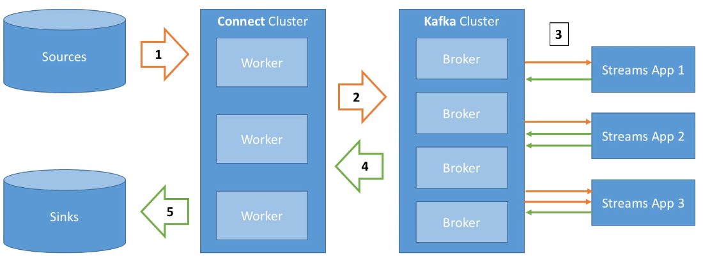

# Kafka II

<!--
https://learning.oreilly.com/library/view/modern-data-engineering/9781484274521/html/505711_1_En_11_Chapter.xhtml
Stream Processing
Stream processing evolved from the simple mechanism of messages passing between operating system (OS) processes across buses. They were more popularly known simply as pub/sub systems, as system processes would publish or subscribe to messages in a form of cross-application communication within a single machine.

Interprocess Communication
This simple, albeit useful, construct allowed for magnitude gains in parallel processing by allowing processes (applications and kernel tasks) within a single computer OS to take part in a conversation. The beauty of this was that processes could participate in conversations in either synchronous or asynchronous fashion and distribute work among many applications without the necessary overhead of locking and synchronization.

Network Queues
This approach to parallel processing via pub/sub message buses on a single system allowed engineers to expand and evolve these systems in a distributed-first approach. This led to the advent of the network message queue.

The basic message queue allowed for one or many channels, or named queues, to be created in a distributed first-in, first-out (FIFO) style queue that ran as a service on top of a network addressable location (e.g., ip-address:port). This enabled network-based applications and services to communicate asynchronously, which meant that the producers of the messages didn’t need to know about the subscribers (consumers) directly. Instead this was offloaded to the network queue, which simplified distributed systems greatly.

From Distributed Queues to Repayable Message Queues
Apache Kafka is a household name within the tech community and is as common a component in the data platform as boutique seltzer and ping pong are to any startup. Kafka started at LinkedIn, and was later gifted to the Apache Foundation, with the goal was to create a distributed, fault-tolerant platform for handling low-latency data feeds, or streams of data.

Kafka was built with a fresh approach to the distributed network queue. However, it had a different approach to handling partial failures from consumers. As you may imagine, if we have a distributed queue and we take a message from that queue, then we could assume that the queue would purge that message and life would go on.

However, in the face of failure, no matter where you point the blame, there would be data loss associated with a message that has been purged from the queue if the process that took the message was lost due to a fault in the application code. It is common for systems reading messages to come across bad data, and without the appropriate defense mechanisms in place to handle corrupt data, the process could terminate unexpectedly. Without a means of recovering. Now as you can imagine, this was not good for business.

Fault-Tolerance and Reliability
To protect consumers from the inevitable, Kafka was architected to ensure that downstream failures would not immediately lead to data loss. The solution was to treat the messages in a similar fashion to how databases handle reliability. That is, through durable writes. Like magic, the distributed write-ahead log (WAL) emerged. We go over the key terminology, architectural components, and Kafka nomenclature now. If you have experience with Kafka, you can skip ahead to how Spark comes into play as the final piece of the modern data puzzle.

Kafka’s Distributed Architecture
Kafka stores data emitted by producers in what are called topics. A Kafka topic is further broken down into one or more logical partitions, which enable each topic to be scaled to handle variable read and write throughputs. Each partition is guaranteed to store the data it receives (known as a Kafka record) in time based sequential order. See Figure 1-5.

Given that each partition maintains this synchronous stream of records, Kafka is commonly used to store event streams from contiguous timeseries events (such as users placing items into their shopping carts or transactions being made across a credit card). These timeseries event streams enables the system to analyze data that would otherwise be hard to group efficiently.

Since you can guarantee the ordering of the events within each partition, and events being written into each partition are distributed based on each record’s key, this kind of distribution helps to solve common problems associated with timeseries analysis. The problem of out-of-order data, stored across many locations and across different data stores, feels like the data silo conversation from earlier in the chapter.

Instead of first running a job to collect all the data by key, across all partitions or across different data stores, an application can work across individual partitions, or slices, of the Kafka topic without having to shuffle data around first.

This can greatly reduce the stress on a system processing credit card fraud or handling recommendations based on a user’s real-time activity. With the right selection of keys for each record, you can guarantee how the data lands within each topic.

Kafka Records
Records are simple rows of data, written out to disk in a durable fashion, like with the write-ahead log (WAL). Each record is identified by a key, which helps Kafka pass the data to the correct partition for the topic being written to. The record carries a main message, or payload, which is called the message value. In addition to the key/value pair, there is an internal timestamp (UNIX epoch milliseconds) stamped when the message is received and written into the topics log. This ensures that the insert order is maintained without issues with time (clock drift, time zone differences, etc.). Lastly, in more recent versions of Kafka, each record has an optional map of headers that can be used to annotate the data further. It can apply metadata about the producer, the payload schema, and just about anything you can dream up.

Brokers
Kafka manages producers and consumers of data in a similar fashion to that of a common pub/sub system. Data stored in each partition of a topic is managed by an active broker within the Kafka cluster.

These brokers manage the replicas of each record written into the topic and are kept in sync so that if a broker is lost due to the server going offline, or from network partitioning, that there is zero data loss. The next available in-sync replica quickly takes over the serving of the data, and Kafka will find another available broker to assign as the next backup to prevent a data loss scenario.

Why Stream Processing Matters
Kafka is the most widely used stream-processing framework and given the flexible, low-latency, highly available nature of the framework it isn’t difficult to see why. Kafka however isn’t the only player in the field. Apache Pulsar, which evolved from an internal project at Yahoo!, is another open-source alternative to Kafka. While we won’t be using Apache Pulsar in this book, it is always good to know there are alternatives out there. Chapter 11 introduces using Apache Kafka with Spark.

* Integración de Apache Flume y Apache Kafka

-->

## Caso 2: Clúster de Kafka

En *Kafka* hay tres tipos de clústers:

* Un nodo con un *broker*
* Un nodo con muchos *brokers*
* Muchos nodos con múltiples *brokers*

Para nuestro ejemplo, como sólo disponemos de una máquina, vamos a crear 3 *brokers* en un nodo.

### Creando brokers

Para ello, vamos a crear diferentes archivos de configuración a partir del archivo `config/server.properties` que utilizábamos para arrancar el servidor.

Así pues, crearemos 3 copias del archivo modificando las propiedades `broker.id` (identificador del broker), `listeners` (URL y puerto de escucha del broker) y `log.dirs` (carpeta donde se guardaran los logs del broker):

=== "Broker 101"

    ``` properties title="server101.properties"
    broker.id=101
    listeners=PLAINTEXT://:9092  
    log.dirs=/opt/kafka_2.13-2.8.1/logs/broker_101
    zookeeper.connect=localhost:2181
    ```

=== "Broker 102"

    ``` properties title="server102.properties"
    broker.id=102
    listeners=PLAINTEXT://:9093  
    log.dirs=/opt/kafka_2.13-2.8.1/logs/broker_102
    zookeeper.connect=localhost:2181
    ```

=== "Broker 103"

    ``` properties title="server103.properties"
    broker.id=103
    listeners=PLAINTEXT://:9094
    log.dirs=/opt/kafka_2.13-2.8.1/logs/broker_103 
    zookeeper.connect=localhost:2181
    ```

Una vez creados los tres archivos, ejecutaremos los siguientes comandos (cada uno en un terminal diferente) para arrancar *Zookeeper* y cada uno de los *brokers*:

``` bash
zookeeper-server-start.sh ./config/zookeeper.properties
kafka-server-start.sh ./config/server101.properties
kafka-server-start.sh ./config/server102.properties
kafka-server-start.sh ./config/server103.properties
```

### Creando topics

Con cada comando que vayamos a interactuar con *Kafka*, le vamos a pasar como parámetro `--bootstrap-server iabd-virtualbox:9092` para indicarle donde se encuentra uno de los brokers (en versiones antiguas de *Kafka* se indicaba donde estaba *Zookeeper* mediante `--zookeeper iabd-virtualbox:9092`).

A la hora de crear un *topic*, además de indicarle donde está *Zookeeper* y el nombre del *topic*, indicaremos:

* la cantidad de particiones con el parámetro `--partitions`
* el factor de replicación con el parámetro `--replication-factor`

Así pues, vamos a crear un *topic* con tres particiones y factor de replicación 2:

``` bash
kafka-topics.sh --create --topic iabd-topic-3p2r \
    --bootstrap-server iabd-virtualbox:9092 \
    --partitions 3 --replication-factor 2
```

Si ahora obtenemos la información del topic

``` bash
kafka-topics.sh --describe --topic iabd-topic-3p2r \
    --bootstrap-server iabd-virtualbox:9092
```

Podemos observar como cada partición tiene la partición líder en un broker distinto y en qué brokers se encuentran las réplicas:

``` text
Topic: iabd-topic-3p2r  TopicId: lyrv4qXkS1-c09XAXnIj7w PartitionCount: 3       ReplicationFactor: 2    Configs: segment.bytes=1073741824 
        Topic: iabd-topic-3p2r  Partition: 0    Leader: 103     Replicas: 103,102       Isr: 103,102 
        Topic: iabd-topic-3p2r  Partition: 1    Leader: 102     Replicas: 102,101       Isr: 102,101 
        Topic: iabd-topic-3p2r  Partition: 2    Leader: 101     Replicas: 101,103       Isr: 101,103 
```

### Produciendo y consumiendo

Respecto al código Python, va a ser el mismo que hemos visto antes pero modificando:

* el nombre del *topic*
* la lista de *boostrap_servers* (aunque podríamos haber dejado únicamente el nodo principal, ya que Kafka le comunica al cliente el resto de nodos del clúster, es una buena práctica por si el nodo al que nos conectamos de manera explícita está caído).

=== "Productor"

    ``` python title="producer-cluster.py"
    from kafka import KafkaProducer
    from json import dumps
    import time

    producer = KafkaProducer(
        value_serializer=lambda m: dumps(m).encode('utf-8'),
        bootstrap_servers=['iabd-virtualbox:9092','iabd-virtualbox:9093','iabd-virtualbox:9094'])

    for i in range(10):
        producer.send("iabd-topic-3p2r", value={"nombre": "producer " + str(i)}, key=b"iabd")
    # Como el envío es asíncrono, para que no se salga del programa antes de enviar el mensaje, esperamos 1 seg
    time.sleep(1)
    ```

=== "Consumidor"

    En el consumidor, además hemos modificado la forma de mostrar los mensajes para visualizar más información: 

    ``` python title="consumer-cluster.py"
    from kafka import KafkaConsumer
    from json import loads

    consumer = KafkaConsumer(
        'iabd-topic-3p2r',
        auto_offset_reset='earliest',
        enable_auto_commit=True,
        group_id='iabd-grupo-1',
        value_deserializer=lambda m: loads(m.decode('utf-8')),
        bootstrap_servers=['iabd-virtualbox:9092','iabd-virtualbox:9093','iabd-virtualbox:9094'])

    for m in consumer:
        print(f"P:{m.partition} O:{m.offset} K:{m.key} V:{m.value}")
    ```

Como ahora tenemos los datos repartidos en dos brokers (por el factor de replicación) y tres particiones, los datos consumidos no tienen por qué llegar en orden (como es el caso), ya que los productores han enviado los datos de manera aleatoria para repartir la carga:

``` text
P:1 O:0 K:None V:{'nombre': 'producer 0'}
P:1 O:1 K:None V:{'nombre': 'producer 3'}
P:2 O:0 K:None V:{'nombre': 'producer 1'}
P:2 O:1 K:None V:{'nombre': 'producer 5'}
P:2 O:2 K:None V:{'nombre': 'producer 6'}
P:2 O:3 K:None V:{'nombre': 'producer 7'}
P:2 O:4 K:None V:{'nombre': 'producer 8'}
P:0 O:0 K:None V:{'nombre': 'producer 2'}
P:0 O:1 K:None V:{'nombre': 'producer 4'}
P:0 O:2 K:None V:{'nombre': 'producer 9'}
```

Para asegurarnos el orden, debemos enviar los mensajes con una clave de partición con el atributo `key` del método `send`:

``` python
producer.send("iabd-topic-3p2r",
    value={"nombre": "producer " + str(i)},
    key=b"iabd")
```

Si volvemos a ejecutar el productor con esa clave, el resultado sí que sale ordenado:

``` text
P:0 O:3 K:b'iabd' V:{'nombre': 'producer 0'}
P:0 O:4 K:b'iabd' V:{'nombre': 'producer 1'}
P:0 O:5 K:b'iabd' V:{'nombre': 'producer 2'}
P:0 O:6 K:b'iabd' V:{'nombre': 'producer 3'}
P:0 O:7 K:b'iabd' V:{'nombre': 'producer 4'}
P:0 O:8 K:b'iabd' V:{'nombre': 'producer 5'}
P:0 O:9 K:b'iabd' V:{'nombre': 'producer 6'}
P:0 O:10 K:b'iabd' V:{'nombre': 'producer 7'}
P:0 O:11 K:b'iabd' V:{'nombre': 'producer 8'}
P:0 O:12 K:b'iabd' V:{'nombre': 'producer 9'}
```

### Decisiones de rendimiento

Aunque podemos modificar la cantidad de particiones y el factor de replicación una vez creado el clúster, es mejor hacerlo de la manera correcta durante la creación ya que tienen un impacto directo en el rendimiento y durabilidad del sistema:

* si el número de particiones crece con el clúster ya creado, el orden de las claves no está garantizado.
* si se incrementa el factor de replicación durante el ciclo de vida de un *topic*, estaremos metiendo presión al clúster, que provocará un decremento inesperado del rendimiento.

Cada partición puede manejar un rendimiento de unos pocos MB/s. Al añadir más particiones, obtendremos mejor paralelización y por tanto, mejor rendimiento. Además, podremos ejecutar más consumidores en un grupo. Pero el hecho de añadir más brokers al clúster para que las particiones los aprovechen, provocará que *Zookeeper* tenga que realizar más elecciones y que Kafka tenga más ficheros abiertos.

!!! tip "Guía de rendimiento"
    Una propuesta es:

    * Si nuestro clúster es pequeño (menos de 6 *brokers*), crear el doble de particiones que *brokers*.
    * Si tenemos un clúster grande (más de 12 *brokers*), crear la misma cantidad de particiones que *brokers*.
    * Ajustar el número de consumidores necesarios que necesitamos que se ejecuten en paralelo en los picos de rendimiento.

    Independientemente de la decisión que tomemos, hay que realizar pruebas de rendimiento con diferentes configuraciones.

Respecto al factor de replicación, debería ser, al menos 2, siendo 3 la cantidad recomendada (es necesario tener al menos 3 *brokers*) y no sobrepasar de 4. Cuanto mayor sea el factor de replicación (RF):

* El sistema tendrá mejor tolerancia a fallos (se pueden caer RF-1 *brokers*)
* Pero tendremos mayor replicación (lo que implicará una mayor latencia si `acks=all`)
* Y también ocupará más espacio en disco (50% más si RF es 3 en vez de 2).

Respecto al clúster, se recomienda que un *broker* no contenga más de 2000-4000 particiones (entre todos los *topics* de ese broker). Además, un clúster de *Kafka* debería tener un máximo de 20.000 particiones entre todos los brokers, ya que si se cayese algún nodo, *Zookeeper* necesitaría realizar muchas elecciones de líder.

<!--
Kafka con Docker:
https://www.theninjacto.xyz/Instalacion-Configuracion-Kafka-Manager/

https://learning.oreilly.com/videos/apache-kafka-a-z/9781801077569/
Apache Kafka A-Z with Hands-On Learning
-->

## Caso 3: De Twitter a Elasticsearch con Python

A continuación vamos a crear un ejemplo completo de flujo de datos mediante *Python* que nos permita recoger *tweets* y meterlos dentro de *ElasticSearch*.

Vamos a suponer que ya disponemos de una cuenta de *Twitter* y que tenemos las credenciales de acceso, las cuales vamos a almacenar en un fichero denominado `credential.py`:

``` python title="credentials.py"
API_KEY = 'YOUR_API_KEY'
API_SECRET_KEY = 'YOUR_API_SECRET_KEY'
ACCESS_TOKEN = 'YOUR_ACCESS_TOKEN'
ACCESS_TOKEN_SECRET = 'YOUR_ACCESS_TOKEN_SECRET'
```

### Tweepy

Para acceder a Twitter desde Python, la librería por excelencia es [Tweepy](https://www.tweepy.org), la cual instalaremos mediante:

``` bash
pip install tweepy
```

A continuación, vamos a realizar el proceso de autenticación en *Tweepy* y recoger el timeline de mi usuario:

``` python title="timeline.py"
import credentials
import tweepy

# Nos autenticamos mediante OAuth
auth = tweepy.OAuthHandler(credentials.API_KEY, credentials.API_SECRET_KEY)
auth.set_access_token(credentials.ACCESS_TOKEN, credentials.ACCESS_TOKEN_SECRET)
api = tweepy.API(auth)

miTimeline = api.home_timeline()
for tweet in miTimeline:
    print(f'{tweet.user.screen_name}:\n{tweet.text}\n{"*"*60}')
```

### Productor de Tweets

En este caso de uso vamos a buscar los *tweets* que contengan la palabra *bigdata* y meterlos en un topic de *Kafka*. Así pues, en vez de obtener el timeline de un usuario, realizaremos una búsqueda mediante la función [`search`](https://docs.tweepy.org/en/v4.6.0/api.html#search-tweets) y para cada elemento recuperado, lo enviaremos al productor con toda la información (seguimos un planteamiento ELT).

Primero creamos el topic:

``` bash
kafka-topics.sh --create --topic iabd-twitter  --bootstrap-server iabd-virtualbox:9092
```

Y a continuación desarrollamos el productor:

``` python title="producerTwitter.py"
import credentials
import tweepy
from kafka import KafkaProducer
from json import dumps
import time

# Creamos el productor de Kafka
producer = KafkaProducer(
    value_serializer=lambda m: dumps(m).encode('utf-8'),
    bootstrap_servers=['iabd-virtualbox:9092'])

# Nos autenticamos mediante OAuth en Twitter
auth = tweepy.OAuthHandler(credentials.API_KEY, credentials.API_SECRET_KEY)
auth.set_access_token(credentials.ACCESS_TOKEN, credentials.ACCESS_TOKEN_SECRET)
api = tweepy.API(auth)

# Cargamos 500 tweets
id = None
cantidad = 0
while cantidad <= 500:
    tweets = api.search_tweets(q='bigdata', tweet_mode='extended', max_id=id)
    for tweet in tweets:
        producer.send("iabd-twitter", value=tweet._json)
        cantidad += 1
    #  Al final del ciclo le asignamos el id del último tweet
    #  para que en cada ciclo se consulten solo los tweets hasta el más antiguos del ciclo anterior
    id = tweet.id

# Como el envío es asíncrono, para que no se salga del programa antes de enviar el último mensaje, esperamos 1 seg
time.sleep(1)
```

### Elasticsearch desde Python

Para poder acceder a [Elasticsearch desde Python](https://elasticsearch-py.readthedocs.io/en/latest/) necesitamos descargar la librería:

``` bash
pip install elasticsearch
```

El siguiente fragmento muestra varias operaciones básicas y como las operaciones REST de *Elasticsearch* se traducen en métodos:

=== "Código Python"

    ``` python title="prueba-elasticsearch.py"
    from datetime import datetime
    from elasticsearch import Elasticsearch

    es = Elasticsearch("http://localhost:9200")

    doc1 = {
        'author': 'Aitor Medrano',
        'text': 'Prueba de texto desde Python',
        'timestamp': datetime.now(),
    }
    doc2 = {
        'author': 'Aitor Medrano',
        'text': 'Y otra #prueba desde @Python',
        'timestamp': datetime.now(),
    }
    # Inserción
    resp = es.index(index="prueba", id=1, document=doc1)
    resp = es.index(index="prueba", id=2, document=doc2)
    print(resp['result'])

    # Recuperación
    resp = es.get(index="prueba", id=1)
    print(resp['_source'])

    es.indices.refresh(index="prueba")

    # Búsqueda
    resp = es.search(index="prueba", query={"match_all": {}})
    print("Encontrados %d Hits:" % resp['hits']['total']['value'])
    for hit in resp['hits']['hits']:
        print("%(timestamp)s %(author)s: %(text)s" % hit["_source"])
    ```

=== "Resultado"

    ``` text
        resp = es.index(index="prueba", id=1, document=doc1)
        resp = es.index(index="prueba", id=2, document=doc2)
    updated
        resp = es.get(index="prueba", id=1)
    {'author': 'Aitor Medrano', 'text': 'Prueba de texto desde Python', 'timestamp': '2022-02-25T15:11:43.720820'}
        es.indices.refresh(index="prueba")
        resp = es.search(index="prueba", query={"match_all": {}})
    Encontrados 2 Hits:
    2022-02-25T15:11:43.720820 Aitor Medrano: Prueba de texto desde Python
    2022-02-25T15:11:43.720826 Aitor Medrano: Y otra #prueba desde @Python
    ```

### Consumidor en Elasticsearch

Finalmente, vamos a crear un consumidor que se conecte a *Kafka* para consumir los mensajes, e introduzca cada uno de los *tuits* en *Elasticsearch*:

``` python title="consumerTwitter.py"
from datetime import datetime
from elasticsearch import Elasticsearch
from kafka import KafkaConsumer
from json import loads
import ast

es = Elasticsearch("http://localhost:9200")

consumer = KafkaConsumer(
    'iabd-twitter',
    auto_offset_reset='earliest',
    enable_auto_commit=True,
    group_id='iabd-caso3',
    value_deserializer=lambda m: loads(m.decode('utf-8')),
    bootstrap_servers=['iabd-virtualbox:9092'])

cantidad = 1
for m in consumer:
    tweet = m.value
    # print(type(tweet))
    # tweet = ast.literal_eval(m.value)
    # print(tweet['user'])
    # doc = {
    #     'user': m.value.user.screen_name,
    #     'text': m.value.full_text,
    #     'created_at': m.value.created_at,
    #     'likes': m.value.favourite_count
    # }
    resp = es.index(index="iabd-twitter-es", id=cantidad, document=tweet)
    cantidad += 1

# Forzamos que se persistan los cambios
es.indices.refresh(index="iabd-twitter-es")
```

Si accedemos a `http://localhost:9200/iabd-twitter-es/_search?pretty` podremos ver como *Elasticsearch* contiene los *tuits* que habíamos producido previamente:

<figure style="align: center;">
    
    <figcaption>Resultado de consumir tuits desde Kafka y cargar en Elasticsearch</figcaption>
</figure>

### Todo en uno con Nifi

Vamos a realizar un flujo de datos en *Nifi* para el mismo caso de uso que acabamos de desarrollar. Para ello, vamos a crear dos grupos de procesos para tener los flujos ordenados:

<figure style="align: center;">
    
    <figcaption>Grupos de procesos para E y L</figcaption>
</figure>

En el primer grupo, que hemos denominado *Extract Twitter*, vamos a realizar la carga desde Twitter (filtrando los mensajes que contengan la palabra *bigdata*) y los vamos a meter en el topic `iabd-twitter`.

Para ello, conectaremos los siguientes procesadores:

* *GetTwitter*: tras introducir los valores para autenticarnos en Twitter, configuraremos como *endpoint* que sea de tipo *Filter Endpoint* y como término a filtrar *bigdata* (no olvides poner las claves de autenticación).
* *PublishKafka_2_6*: en este procesador, además del *topic* `iabd-twitter`, indicaremos que no utilizaremos transacciones (*Use Transactions: false*), así como que intente garantizar la entrega (*Delivery Guarantee: Best Effort):

<figure style="align: center;">
    
    <figcaption>De Twitter a Kafka</figcaption>
</figure>

Del mismo modo, dentro del segundo grupo (*Load Elasticsearch*), conectaremos los siguientes procesadores:

* *ConsumerKafka_2_6*: donde consumiremos los mensajes del topic `iabd-twitter` de *Kafka*, y por ejemplo, como grupo de consumidores le indicaremos que usamos nifi (*group id: nifi*)
* *PutElasticsearchHttp*: como ya hicimos en la sesión de *Nifi*, indicaremos la URL de Elasticsearch (`http://localhost:9200`) y que lo almacene en un indice que hemos denominado `iabd-twitter-es`:

<figure style="align: center;">
    
    <figcaption>De Kafka a Elasticsearch</figcaption>
</figure>

<!--
Ejemplo con Kafka
Split Text + ExtractText + PutKafka
https://www.youtube.com/watch?v=2w14d16wR8Y

Nifi + Kafka
https://www.youtube.com/watch?time_continue=1588&v=nWEna1mE4KY&feature=emb_logo
-->

## Kafka Connect

Si hacerlo con *Nifi* ya es un avance respecto a tener que codificarlo con *Python*, ¿qué dirías si *Kafka* ofreciera una serie de conectores para las operaciones más comunes?

Así pues, *Kafka Connect* permite importar/exportar datos desde/hacia *Kafka*, facilitando la integración en sistemas existentes mediante alguno del [centenar de conectores disponibles](https://www.confluent.io/hub/).

<figure style="align: center;">
    
    <figcaption>Arquitectura Kafka Connect</figcaption>
</figure>

Los elementos que forman *Kafka Connect* son:

* Conectores fuente (*source*), para obtener datos desde las fuentes de datos (E en ETL)
* Conectores destino (*sink*) para publicar los datos en los almacenes de datos (L en ETL).

Estos conectores facilitan que desarrolladores no expertos puedan trabajar con sus datos en *Kafka* de forma rápida y fiable, de manera que podamos introducir *Kafka* dentro de nuestros procesos ETL.

### Hola Kafka Connect

Vamos a realizar un ejemplo muy sencillo leyendo datos de una base de datos para meterlos en Kafka.

Para ello, utilizaremos la base de datos de *retail_db* que ya hemos empleado en [otras sesiones](../hadoop/05flume.md#actividades) y vamos a cargar en *Kafka* los datos de la tabla `categories`:

``` mysql
MariaDB [retail_db]> describe categories;
+------------------------+-------------+------+-----+---------+----------------+
| Field                  | Type        | Null | Key | Default | Extra          |
+------------------------+-------------+------+-----+---------+----------------+
| category_id            | int(11)     | NO   | PRI | NULL    | auto_increment |
| category_department_id | int(11)     | NO   |     | NULL    |                |
| category_name          | varchar(45) | NO   |     | NULL    |                |
+------------------------+-------------+------+-----+---------+----------------
```

#### Configuración

Cuando ejecutemos *Kafka Connect*, le debemos pasar un archivo de configuración. Para empezar, tenemos `config/connect-standalone.properties` el cual ya viene rellenado e indica los formatos que utilizarán los conversores y otros aspectos:

``` properties title="config/connect-standalone.properties"
bootstrap.servers=localhost:9092

key.converter=org.apache.kafka.connect.json.JsonConverter
value.converter=org.apache.kafka.connect.json.JsonConverter
key.converter.schemas.enable=true
value.converter.schemas.enable=true

offset.storage.file.filename=/tmp/connect.offsets
```

Los conectores se incluyen en *Kafka* como plugins. Para ello, primero hemos de indicarle a *Kafka* donde se encuentran. Para ello, en el archivo de configuración le indicaremos la siguiente ruta:

``` properties
plugin.path=/opt/kafka_2.13-2.8.1/plugins
```

#### Extrayendo datos mediante Kafka Connect

Así pues, el primer paso es crear el archivo de configuración de *Kafka Connect* con los datos (en nuestro caso lo colocamos en la carpeta `config`  de la instalación de *Kafka*) utilizando un [conector fuente de JDBC](https://docs.confluent.io/kafka-connect-jdbc/current/source-connector/source_config_options.html#jdbc-source-configs):

``` properties title="retaildb-mariadb-source-connector.properties"
name=retaildb-mariabd-source-jdbc-autoincrement
connector.class=io.confluent.connect.jdbc.JdbcSourceConnector
tasks.max=1
connection.url=jdbc:mysql://localhost/retail_db
connection.user=iabd
connection.password=iabd
table.whitelist=categories
mode=incrementing
incrementing.column.name=category_id
topic.prefix=iabd-retail_db-
```

Antes de ponerlo en marcha, debemos [descargar el conector](https://www.confluent.io/hub/confluentinc/kafka-connect-jdbc) y colocar la carpeta descomprimida dentro de nuestra carpeta de plugins `/opt/kafka_2.13-2.8.1/plugins` y descargar el [driver de MySQL](resources/mysql-connector-j-8.0.31.jar) y colocarlos en la carpeta `/opt/kafka_2.13-2.8.1/lib`.

Y a continuación ya podemos ejecutar *Kafka Connect*:

``` bash
connect-standalone.sh config/connect-standalone.properties config/retaildb-mariadb-source-connector.properties
```

!!! caution "Guava"
    Es posible que salte un error de ejecución indicando que falta la librería [Guava](https://github.com/google/guava) la cual podéis descargar [desde aquí](https://repo1.maven.org/maven2/com/google/guava/guava/31.0.1-jre/guava-31.0.1-jre.jar) y colocar en la carpeta `/opt/kafka_2.13-2.8.1/lib`

Si ahora arrancamos un consumidor sobre el topic `iabd-retail_db-categories`:

``` bash
kafka-console-consumer.sh --topic iabd-retail_db-categories --from-beginning --bootstrap-server iabd-virtualbox:9092
```

Veremos que aparecen todos los datos que teníamos en la tabla en formato JSON (es lo que hemos indicado en el archivo de configuración de *Kafka Connect*):

``` json
{"schema":{
        "type":"struct","fields":[
            {"type":"int32","optional":false,"field":"category_id"},
            {"type":"int32","optional":false,"field":"category_department_id"},
            {"type":"string","optional":false,"field":"category_name"}],
        "optional":false,"name":"categories"},
        "payload":{"category_id":1,"category_department_id":2,"category_name":"Football"}}
{"schema":{
        "type":"struct","fields":[
            {"type":"int32","optional":false,"field":"category_id"},
            {"type":"int32","optional":false,"field":"category_department_id"},
            {"type":"string","optional":false,"field":"category_name"}],
        "optional":false,"name":"categories"},
        "payload":{"category_id":2,"category_department_id":2,"category_name":"Soccer"}}
...
```

!!! question "Autoevaluación"
    Vamos a dejar el consumidor y *Kafka Connect* corriendo.
    ¿Qué sucederá si inserto un nuevo registro en la base de datos en la tabla `categories`?
    Que automáticamente aparecerá en nuestro consumidor.

### REST API

Como *Kafka Connect* está diseñado como un servicio que debería correr continuamente, ofrece un API REST para gestionar los conectores. Por defecto está a la escucha el puerto 8083, de manera que si accedemos a <http://iabd-virtualbox:8083/> obtendremos información sobre la versión que se está ejecutando:

``` json
{"version":"2.8.1","commit":"839b886f9b732b15","kafka_cluster_id":"iHa0JUnTSfm85fvFadsylA"}
```

Por ejemplo, si queremos obtener un listado de los conectores realizaremos una petición GET a `/connectors` mediante `http://iabd-virtualbox:8083/connectors`:

``` json
["retaildb-mariabd-source-jdbc-autoincrement"]
```

Más información en <https://kafka.apache.org/documentation/#connect_rest>

!!! tip "Kafka Streams"
    [Kafka Streams](https://kafka.apache.org/documentation/streams/) es la tercera pata del ecosistema de Kafka, y permite procesar y transformar datos dentro de Kafka.
    Una vez que los datos se almacenan en *Kafka* como eventos, podemos procesar los datos en nuestras aplicaciones cliente mediante *Kafka Streams* y sus librerías desarrolladas en Java y/o Scala, ya que requiere una JVM.

    En nuestro caso, realizaremos en posteriores sesiones un procesamiento similar de los datos mediante *Spark Streaming*, permitiendo operaciones con estado y agregaciones, funciones ventana, *joins*, procesamiento de eventos basados en el tiempo, etc...

### Kafka y el Big Data

El siguiente gráfico muestra cómo *Kafka* está enfocado principalmente para el tratamiento en *streaming*, aunque con los conectores de *Kafka Connect* da soporte para el procesamiento *batch*:

<figure style="align: center;">
    
    <figcaption>Kafka y Big Data</figcaption>
</figure>

## Referencias

* [Apache Kafka Series - Learn Apache Kafka for Beginners](https://www.packtpub.com/product/apache-kafka-series-learn-apache-kafka-for-beginners-video/9781789342604)
* Serie de artículos de Víctor Madrid sobre [Kafka](https://enmilocalfunciona.io/tag/kafka/) en [enmilocalfunciona.io](https://enmilocalfunciona.io).
* [Distributed Databases: Kafka](https://mikeldeltio.com/2020/05/20/distributed-databases-kafka/) por Miguel del Tio
* [Introduction to Kafka Connectors](https://www.baeldung.com/kafka-connectors-guide)
* [Kafka Cheatsheet](https://github.com/lensesio/kafka-cheat-sheet)

## Actividades

1. (opcional) A partir del caso 2, crea un clúster de Kafka con 4 particiones y 3 nodos. A continuación, en el productor utiliza *Faker* para crear 10 personas (almacénalas como un diccionario). En el consumidor, muestra los datos de las personas (no es necesario recibirlos ordenados, sólo necesitamos que se aproveche al máximo la infraestructura de Kafka).
2. Realiza el caso de uso 3 (De *Twitter* a *ElasticSearch*) tanto con *Python* como con *Nifi*.
3. (opcional) Repite el caso de uso 2 únicamente mediante *Kafka Connect*.  
4. (opcional) Investiga en qué consiste el patrón CDC (*Change Data Capture*) y cómo se realiza CDC con *Kafka*/*Kafka Connect* y [Debezium](https://debezium.io/). ¿Qué ventajas aportan las soluciones CDC?
