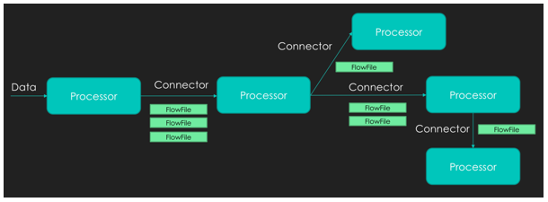
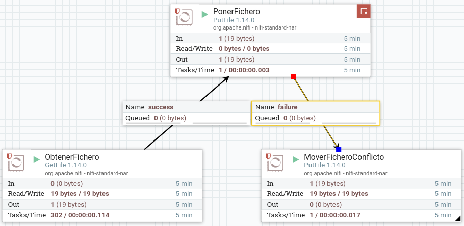
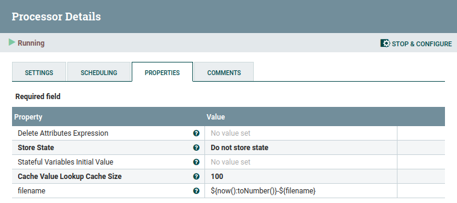
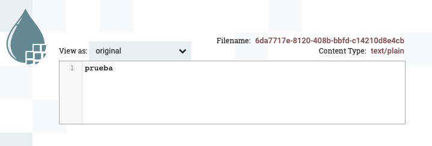
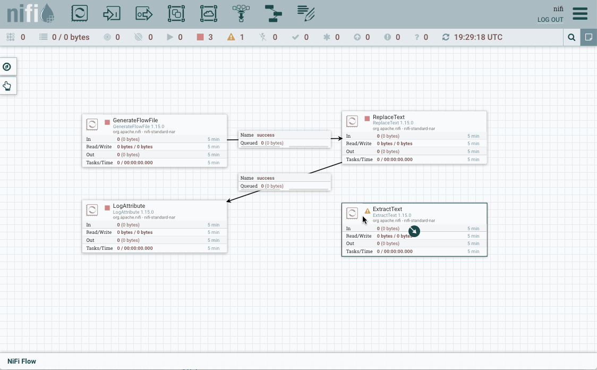
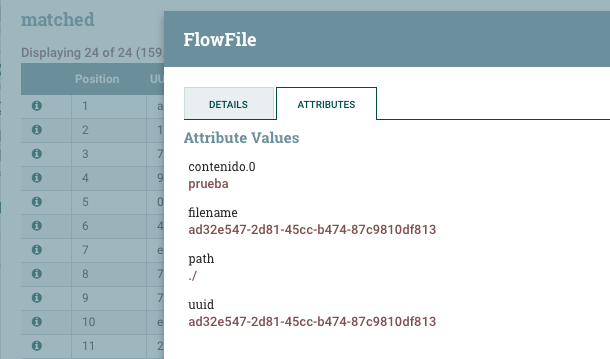
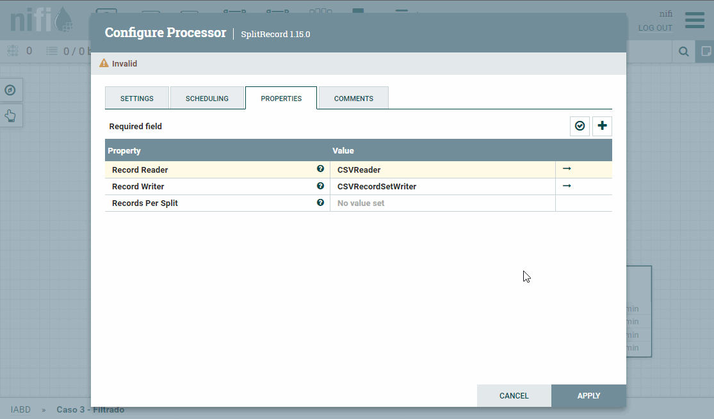
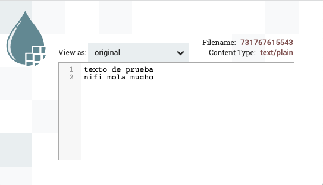
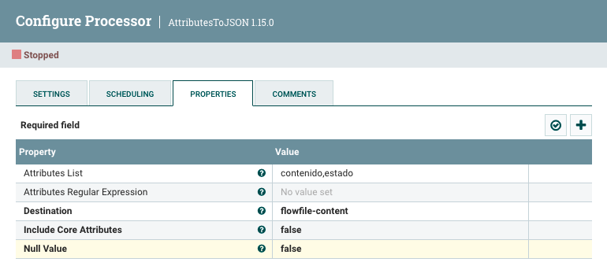

# Nifi

<figure style="float: right;">
    
    <figcaption>Logo de Apache Nifi</figcaption>
</figure>

[*Nifi*](https://nifi.apache.org) es un proyecto de Apache (desarrollado en Java inicialmente por la NSA) que plantea un sistema distribuido dedicado a ingestar y transformar datos de nuestros sistemas mediante el paradigma *streaming*.

Entre sus características principales destacamos:

* proyecto *Open Source*
* flujos de datos escalables.
* más de 300 conectores.
* procesadores personalizados.
* ingesta de datos en streaming.
* usa el paradigma de programación basado en flujos.
* define las aplicaciones como grafos de procesos dirigidos (DAG) a través de conexiones que envían mensajes.
* entrega garantizada sin pérdida de datos.

Las ventajas de utilizar Nifi son:

* multiplataforma
* licencia *Open Source*
* facilidad de uso mediante un interfaz gráfica y web
* escalabilidad horizontal mediante un cluster de máquinas.
* evolución y comunidad
* política de usuarios (LDAP)
* validador de configuraciones
* linaje y procedencia del dato

Sus casos de uso son:

* transferencias de datos entre sistemas, por ejemplo, de JSON a una base de datos, de un FTP a *Hadoop*, etc..
* preparar y enriquecer los datos
* enrutar datos en función de características, con diferentes prioridades
* conversión de datos entre formatos

En cambio, no es apropiado para:

* procesamiento y operaciones de cómputo distribuido
* operaciones de streaming complejas con joins o agregaciones.
* procesamiento complejo de eventos.

## Puesta en marcha

Para instalar Nifi, sólo hemos de descargar la última versión desde <https://nifi.apache.org> (en nuestro caso hemos descargado la version 1.15) y tras descomprimirla, debemos crear unas credenciales de acceso. Para ello, ejecutaremos el comando `./nifi.sh set-single-user-credentials <username> <password>` indicando el usuario y contraseña que queramos.

Por ejemplo, nosotros hemos creado el usuario `nifi`/`nifinifinifi`:

``` bash
./bin/nifi.sh set-single-user-credentials nifi nifinifinifi
```

A continuación, ya podemos arrancar Nifi ejecutando el comando `./nifi.sh start` (se ejecutará en *brackgound*):

``` bash
./bin/nifi.sh start
```

Si queremos detenerlo ejecutaremos `./bin/nifi.sh stop`.

### Instalación con AWS

Si quieres trabajar con una máquina en AWS has de seguir los siguientes pasos:

1. Crear una instancia EC2 (se recomienda elegir el tipo `t3.large`  para tener 8GB RAM), con un grupo de seguridad que permita tanto las conexiones SSH como el puerto 8443.
2. Conectarnos via SSH a la *ipPublicaAWS* y descargar Nifi:
``` bash
wget https://downloads.apache.org/nifi/1.15.0/nifi-1.15.0-bin.zip
unzip nifi-1.15.0-bin.zip
```
3. Tras meternos dentro de la carpeta recién creada, configurar el archivo `conf/nifi.properties` para permitir el acceso remoto. Para ello, modificaremos las siguientes propiedades:
``` properties
nifi.web.https.host = 0.0.0.0
nifi.web.proxy.host = <ipPublicaAWS>:8443
```
4. Configurar el usuario con las credenciales de acceso
``` bash
./bin/nifi.sh set-single-user-credentials nifi nifinifinifi
```
5. Acceder desde un navegador a la dirección <https://ipPublicaAWS:8443/nifi>

### Instalación con Docker

Si no queremos instalarlo y hacer uso de un contenedor mediante Docker, ejecutaremos el siguiente comando:

``` bash
docker run --name nifi -p 8443:8443 -d -e SINGLE_USER_CREDENTIALS_USERNAME=nifi -e  SINGLE_USER_CREDENTIALS_PASSWORD=nifinifinifi -e NIFI_JVM_HEAP_MAX=2g apache/nifi:latest
```

!!! tip "Cluster de Nifi mediante Docker"
    El siguiente artículo sobre ejecutar [Nifi en un cluster utilizando Docker](https://www.theninjacto.xyz/Running-cluster-Apache-Nifi-Docker/) es muy interesante.

### Acceso

Esperaremos un par de minutos tras arrancar Nifi para acceder al entorno de trabajo. Para ello, introduciremos en el navegador la URL <https://localhost:8443/nifi> y tras aceptar la alerta de seguridad respecto al certificado veremos un interfaz similar a la siguiente imagen:

<figure style="align: center;">
    
    <figcaption>Página de inicio en Nifi</figcaption>
</figure>

Respecto al interfaz de usuario, cabe destacar cuatro zonas:

* Menú superior: con los iconos grandes (procesadores, puertos de entrada y salida, etc...)
* Barra de debajo con iconos: indican el estado de la ejecución (hilos, procesadores en marcha, detenidos, etc..)
* Cuadro *Navigate* para hacer zoom
* Cuadro *Operate* con las opciones del flujo de trabajo o del recurso seleccionado
* Zona de trabajo *drag&drop*.

## Componentes

### Flowfile

En castellano se conocen como *ficheros de flujo* o FF: es básicamente el dato, el cual se persiste en disco tras su creación. Realmente es un puntero al dato en su almacenamiento local, de esta manera se acelera su rendimiento. El *Flowfile* a a su vez se compone de dos partes:

* contenido: el dato en sí
* atributos: metadatos en pares de clave/valor

### Procesador

Encargado de ejecutar alguna transformación o regla sobre los datos o el flujo para generar un nuevo *Flowfile*. La salida de un procesador es un *Flowfile* que será la entrada de otro procesador. Así pues, para implementar un flujo de datos en NiFi, crearemos una secuencia de procesadores que reproduzcan las acciones y transformaciones que queremos realizar sobre sobre los datos.

Todos los procesadores se ejecutan en paralelo (mediante diferentes hilos de ejecución), abstrayendo la complejidad de la programación concurrente y además se pueden ejecutar en varios nodos de forma simultánea o bien en el nodo primario de un clúster.

Si bien es posible diseñar a mano un procesador, por defecto, NiFi ofrece un amplio catálogo con más de 300 procesadores, que cubre ampliamente las operaciones más frecuentes que se van a necesitar en un flujo de datos: añadir o modificar los atributos del FF, capturar cambios en una base de datos, cambiar de formato el contenido del FF (JSON, CSV, Avro…), extraer el contenido textual de un fichero, extraer el valor de un campo de un fichero JSON a partir de su ruta, extraer cabeceras de un email, consultar a ElasticSearch, geolocalizar una IP, obtener un fichero de una cola Kafka, escribir en un log, unir el contenido de varios FFs, realizar una petición HTTP, transformar un fichero XML, validar un fichero CSV, enviar mensajes a un web socket, etc.

!!! info "Tipos de procesadores"
    Además de en la documentación oficial (<https://nifi.apache.org/docs.html>), puedes consultar información extra en <https://www.nifi.rocks/apache-nifi-processors/>. A *grosso modo*, los más utilizados son:

    * Tranformación de datos: `ReplaceText`, `JoltTransformJSON`, `CompressContent`.
    * Enrutado y mediación: `RouteOnAttribute`, `RouteOnContent`
    * Acceso a base de datos: `ExecuteSQL`, `ConvertJSONToSQL`, `PutSQL`
    * Extracción de atributos: `EvaluateJsonPath`, `ExtractText`, `UpdateAttribute`
    * Interacción con el sistema: `ExecuteProcess`
    * Ingestión de datos: `GetFile`, `GetFTP`, `GetHTTP`, `GetHDFS`
    * Envío de datos: `PutEmail`, `PutFile`, `PutFTP`, `PutKafka`, `PutMongo`
    * División y agregación: `SplitText`, `SplitJson`, `SplitXml`, `MergeContent`
    * HTTP: `GetHTTP`, `ListenHTTP`, `PostHTTP`
    * AWS: `FetchS3Object`, `PutS3Object`, `PutSNS`, `PutSQS`

### Conector

Es una cola dirigida (con un origen y un destino que determinan un sentido) que une diferentes procesadores y contiene los FF que todavía no se han ejecutado, pudiendo definir diferentes prioridades (por ejemplo, FIFO o LIFO según necesitemos).

Así pues, los conectores van a unir la salida de un procesador con la entrada de otro (o un procesador consigo mismo, por ejemplo, para realizar reintentos sobre una operación).

Las conexiones se caracterizan y nombran por el tipo de puerto de salida del procesador del que nacen. En la mayoría de los casos nos enfrentaremos a conexiones de tipo ***success***, que recogen el FF que devuelve un procesador cuando ha terminado satisfactoriamente su tarea, o de tipo ***failure***, que conducen el FF en los casos en los que la tarea ha fallado. También podemos crear nuestros propios conectores.
Además, existe la posibilidad de configurar algunos aspectos de la conexión, como el número de FF que pueden viajar de forma simultánea por ella, la prioridad de salida de los FF que hay en la conexión, o el tiempo que los FF deben permanecer a la espera para ser recogidos por el procesador de destino.

<figure style="align: center;">
    
    <figcaption>Componentes de Nifi</figcaption>
</figure>

## Caso 1 - Moviendo datos

Vamos a hacer un pequeño ejercicio con Nifi para familiarizarnos con el entorno desarrollando un flujo de datos sencillo que mueva un fichero de un directorio a otro.

A continuación detallamos los pasos a realizar:

1. Seleccionamos un procesador (primer icono grande) y lo arrastramos en nuestra área de trabajo.
2. Nos aparece un dialogo con tres partes diferenciadas:

    <figure style="align: center;">
        
        <figcaption>Diálogo de elección de procesador</figcaption>
    </figure>

    * A la izquierda una nube de etiquetas para poder filtrar los procesador.
    * Arriba a la derecha tenemos un buscador para buscar procesadores por su nombre
    * La parte central con el listado de procesadores, desde donde lo podemos seleccionar.

    Así pues, buscamos el procesador *GetFile* y lo añadimos al flujo.

3. Damos doble click sobre el elemento gráfico que representa nuestro procesador, y en la pestaña *properties* indicamos el directorio de entrada de donde tendrá que recoger el fichero mediante la propiedad *Input Directory*. En nuestro caso le pondremos el valor `/home/iabd/Documentos/in`:

<figure style="align: center;">
    
    <figcaption>Propiedades de GetFile</figcaption>
</figure>

4. Ahora añadimos un nuevo procesador de tipo *PutFile*, y en las propiedades indicamos el directorio de salida con la propiedad *directory* a `/home/iabd/Documentos/out`.
5. Si visualizamos la pestaña *Settings*, y nos centramos en el lado derecho, podemos configurar el comportamiento a seguir si el procesador se ejecuta correctamente (*success*) o falla (*failure*). Como vamos a hacer que este procesador sea el paso final, vamos a configurar que *autoterminen* marcando ambos casos:

<figure style="align: center;">
    
    <figcaption>Finalización de PutFile</figcaption>
</figure>

!!! danger "Terminar las relaciones"
    Si nos olvidamos de autoterminar las relaciones, o tenemos conexiones sin conectar, no podremos iniciar los procesadores implicados. Esto lo tenemos que realizar para todos los procesadores que tengamos en nuestro flujo de datos.

6. Unimos ambos procesadores creando una conexión. Para ello, tras pulsar sobre el icono de la flecha que aparece al dejar el ratón sobre el primer procesador y lo arrastramos hasta el segundo.

<figure style="align: center;">
    
    <figcaption>Conexión mediante un conector entre procesadores</figcaption>
</figure>

7. Antes de arrancar el primer procesador, creamos un pequeño fichero en el directorio que hemos puesto como entrada:

``` bash
echo "Hola Severo!" > hola.txt
```

8. Arrancamos el procesador mediante el botón derecho y la opción *Start*, y comprobamos que el fichero ya no está en la carpeta `in`, y que sí aparece en la cola (*Queued 1*). También podemos comprobar como tampoco está en la carpeta `out`.

9. Finalmente, arrancamos el procesador de *Poner Fichero*, y veremos como la cola se vacía y el archivo aparece en la carpeta `out`.

¡Ya hemos creado nuestro primer flujo de datos!

### Gestionando los errores

¿Qué sucede si leemos dos veces un archivo con el mismo nombre? Tal como lo hemos definido en nuestro flujo, sólo se guardará la primera copia.

Si vamos a la pestaña *Properties* del procesador *PonerFichero*, podemos cambiar este comportamiento en la propiedad *Conflict Resolution Strategy* a *replace*, de esta manera, se guardará el último archivo.

<figure style="align: center;">
    
    <figcaption>Propiedades de PutFile - gestión de conflictos</figcaption>
</figure>

Realmente, en vez de decidir si lo ignora o lo sobreescribe, lo ideal es definir un nuevo flujo que dependa del estado de finalización del procesador. De esta manera, podremos almacenar todos los archivos que han llegado con el mismo nombre para su posterior estudio.

Así pues, vamos a quitar la *autoterminación* que antes habíamos puesto al procesador de *PonerFichero*, para que cuando falle, redirija el flujo a un nuevo procesador *PutFile* que coloque el archivo en una nueva carpeta (en nuestro caso en `/home/iabd/Documentos/conflictos`):

<figure style="align: center;">
    
    <figcaption>Flujo failure para los ficheros repetidos</figcaption>
</figure>

Aunque ahora tenemos un mecanismo para almacenar los ficheros que coinciden en nombre, sólo nos guardará uno (nos sucede lo mismo que antes, pero ahora sólo con los repetidos).

Asi pues, necesitamos renombrar los ficheros que vayamos a colocar en la carpeta `conflictos` para guardar el histórico. Para ello, necesitamos introducir un procesador previo que le cambie el nombre al archivo.

Nifi añade la propiedad `filename` a todos los FF. Esta propiedad la podemos consultar mediante el [*Nifi Expression Language* (Nifi EL)](https://nifi.apache.org/docs/nifi-docs/html/expression-language-guide.html) y haciendo uso del procesador *UpdateAttribute* modificar su valor.

Así pues, vamos a colocar el procesador *UpdateAttribute* antes de colocar los archivos en la carpeta de `conflictos`:

<figure style="align: center;">
    
    <figcaption>Añadimos el procesador UpdateAttribute</figcaption>
</figure>

Hemos decidido añadir como prefijo al nombre del archivo la fecha del sistema en formato de milisegundos, de manera que obtendremos archivos similares a `1637151536113-fichero.txt`. Para ello, añadimos un nuevo atributo que llamaremos `filename` haciendo clic sobre el icono de `+` que aparece arriba a la derecha y en su valor utilizaremos la expresión `${now():toNumber()}-${filename}`:

<figure style="align: center;">
    
    <figcaption>Añadimos el procesador UpdateAttribute</figcaption>
</figure>

## Caso 2 - Trabajando con atributos

Cada vez que se generan FF (representa un registro de datos que viaja por el flujo) estos van a tener asignados ciertos atributos por defecto. Entre estos atributos están el UUID o identificador único, su *timestamp* y el tamaño del fichero. Como ya hemos visto, mediante el uso de procesadores podremos modificar estos o añadir nuevos atributos.

### Generando contenido

Vamos a ver cómo hacerlo realizando los siguientes pasos:

1. Vamos a añadir un procesador del tipo `GenerateFlowFile` (este procesador crea FF con datos aleatorios o contenidos personalizados, lo cual es muy útil para testear y depurar nuestros flujos de datos).

    En las opciones del procesador vamos a la pestaña de propiedades y completamos los campos:

    * `Flow Size: 10 bytes`
    * `Batch Size: 1` para que nos genere un FF por cada ejecución
    * `Data Format: Text`
    * `Unique Flowfiles: true` e indicamos que los FF van a ser únicos.

    <figure style="align: center;">
        
        <figcaption>Configuración del procesador GenerateFlowFile</figcaption>
    </figure>

    A continuación, en la configuración de planificación (*Scheduling*) de este procesador vamos a indicar que se ejecute cada 3 segundos (en el campo *Run Schedule* le ponemos como valor `3s`).

2. Una vez tenemos listo el generador, vamos a añadir el procesador *ReplaceText* con el que cambiaremos el texto. Tras ello, conectamos ambos procesadores.

    <figure style="align: center;">
        
        <figcaption>Conexión con ReplaceText</figcaption>
    </figure>

3. Si nos fijamos, a la izquierda del nombre del procesador, aparece un icono de aviso, el cual nos indica que necesitamos configurar el nuevo procesador, además de indicarnos que ambas relaciones no están conectadas o que faltan por autocompletar.

    <figure style="align: center;">
        
        <figcaption>Avisos que aparecen</figcaption>
    </figure>

    Para ello, configuramos la estrategia de reemplazo para que lo haga siempre (en el campo *Replacement Value* seleccionamos *Always Replace*), y al hacer esto el campo  Search Value se invalida. Además, en el *Replacement Value* vamos a indicar simplemente `prueba`. Finalmente, marcamos para que autotermine la conexión `failure`.

4. Añadimos un procesador de tipo *LogAttribute* para mostrar en el log los atributos del FF, y conectamos el procesador anterior (*ReplaceText*) a éste mediante la relación `success`.

    <figure style="align: center;">
        
        <figcaption>Log con los atributos</figcaption>
    </figure>

5. Arrancamos el primer procesador y visualizamos la cola para comprobar qué ha generado. Para ello, sobre la cola elegimos la opción *list queue* para ver su contenido, y tras elegir uno, sobre el icono del ojo, visualizamos su contenido y comprobado que ha generado datos aleatorios:

    <figure style="align: center;">
        
        <figcaption>Acceso y visualización de la cola</figcaption>
    </figure>

6. Si ejecutamos el siguiente procesador, vemos que saca el FF de la cola anterior y aparecerá en la siguiente. Si comprobamos su valor, veremos que ha cambiado el valor original por `prueba`.

    <figure style="align: center;">
        
        <figcaption>Resultado de visualizar la cola tras ReplaceText</figcaption>
    </figure>

Si accedemos al log de la aplicación (archivo `nifi-app.log` dentro de la carpeta `logs`) veremos mensajes similares a:

``` irc
2021-11-17 19:12:37,446 INFO [Timer-Driven Process Thread-2]
o.a.n.processors.standard.LogAttribute LogAttribute
[id=2f300ff5-017d-1000-9020-2744e67e8d04]
logging for flow file StandardFlowFileRecord
[uuid=f4181825-f996-40c0-9e3c-a78326837d60,claim=StandardContentClaim
    [resourceClaim=StandardResourceClaim
        [id=1637174667410-1, container=default, section=1],
        offset=7953, length=7],
    offset=0,name=f4181825-f996-40c0-9e3c-a78326837d60,size=7]
--------------------------------------------------
Standard FlowFile Attributes
Key: 'entryDate'
Value: 'Wed Nov 17 19:12:37 UTC 2021'
Key: 'lineageStartDate'
Value: 'Wed Nov 17 19:12:37 UTC 2021'
Key: 'fileSize'
Value: '7'
FlowFile Attribute Map Content
Key: 'filename'
Value: 'f4181825-f996-40c0-9e3c-a78326837d60'
Key: 'path'
Value: './'
Key: 'uuid'
Value: 'f4181825-f996-40c0-9e3c-a78326837d60'
--------------------------------------------------
```

### Añadiendo un atributo

Ahora vamos a extraer el contenido del FF a un atributo mediante el procesador *ExtractText*.

7. En las propiedades, creamos una nueva propiedad (botón `+` de la esquina superior derecha) que llamaremos `contenido`, y en cuyo valor vamos a poner la expresión `.*` que indica que queremos que coincida con todo.

    <figure style="align: center;">
        
        <figcaption>Añadimos la propiedad contenido a ExtractText</figcaption>
    </figure>

8. Una vez creado, vamos a colocar este procesador entre los dos anteriores (para el segundo con el caso `matched`, que es cuando ha coincidido con la expresión regular). En la conexión `unmatched` la marcamos para que autotermine, y comprobamos que no tenemos ningún advertencia en ningún procesador.

    <figure style="align: center;">
        
        <figcaption>Flujo completo del caso 2</figcaption>
    </figure>

9. Finalmente, ejecutamos todos los procesadores y comprobamos como en el log aparece el nuevo atributo creado. También podemos acceder a la cola, y en la parte izquierda de cada flujo, en el icono de la `i`, pulsar y comprobar la pestaña *Atributes*.

    <figure style="align: center;">
        
        <figcaption>Comprobación de los atributos de un FF</figcaption>
    </figure>

### Linaje de los datos

Para comprobar el dato final, es muy útil utilizar la opción de *Data provenance*, la cual nos ofrece un linaje de los datos.

!!! tip "Linaje de los datos"
    El linaje de los datos describe el origen, movimientos, características y calidad de los datos, aportando visibilidad de punto a punto para incrementar la calidad de los datos. Se puede considerar como el historial de los datos, facilitando la documentación y gobernanza de los datos.

Para ello, sobre el procesador final, con el botón derecho, elegimos la opción *View data provenance*. Si elegimos uno de los flujos, a la derecha de cada flujo, podemos pulsar sobre el primer icono podremos ver un grafo y un *slider* que modifica el grafo respecto al instante temporal (en cada uno de los pasos, podemos hacer doble clik y ver la información y el contenido del FF en dicho momento exacto):

<figure style="align: center;">
    
    <figcaption>Linaje de los datos</figcaption>
</figure>

## Caso 3 - Filtrado de datos

En este caso, vamos a coger los datos de [ventas](resources/pdi_sales_small.csv) que ya utilizamos en la sesión de *Pentaho*, el cual tiene la siguiente estructura:

``` csv  title="pdi_sales_small.csv"
ProductID;Date;Zip;Units;Revenue;Country
725;1/15/1999;41540          ;1;115.5;Germany
787;6/6/2002;41540          ;1;314.9;Germany
788;6/6/2002;41540          ;1;314.9;Germany
```

Utilizando Nifi, vamos a crear un nuevo fichero CSV que contenga únicamente los datos de Francia que han realizado más de una venta.

Para ello, tendremos que leer el fichero haciendo uso del procesador *GetFile*, separar cada fila en un FF mediante *SplitRecord*, filtrar los datos usando el procesador *QueryRecord* y finalmente los almacenaremos en disco gracias al procesador *PutFile*.

### Lectura y división

1. Así pues, comenzamos leyendo el fichero con el procesador *GetFile*. En este caso vamos a dejar la opción *keep source file* a *true* para que no lo elimine.
2. Mediante el procesador *SplitRecord*, vamos a separar cada fila del CSV a un FF. Para ello, primero hemos de crear un *RecordReader* y un *RecordWriter* para que sepa interactuar con el CSV (*Nifi* ya tiene varios implementados que podemos utilizar). Así pues:

    * En el *Record Reader*, seleccionamos *Create new service*, y elegimos *CVSReader*.
    * A su vez, en el *Record Writer* elegimos *CVSRecordSetWriter*.

    Para configurar estos servicios, pulsaremos sobre la flecha, y veremos la pantalla de configuración. Para cada uno de ellos, tendremos otros tres iconos: la rueda para configurar, el rayo para activar/desactivar el servicio y la papelera para eliminarlo. Así, pues, tras comprobar los valores de *CVSReader* y *CSVSWriter* (indicamos el `;` como separador de campos tanto para la lectura como la escritura de CSV en el campo *value separator y marcamos como *true* que el archivo contiene la primera fila con encabezados (*treat first line as header*)), pulsamos sobre el rayo para activar ambos servicios.

    <figure style="align: center;">
        
        <figcaption>Configuración y activación de Split Record</figcaption>
    </figure>

    Finalmente, en el campo *Records per Split* le indicamos `1` para que coloque cada fila en un FF.

### Filtrado de FF

3. En este paso, mediante el procesador *QueryRecord* vamos a ejecutar una consulta SQL contra el FF. El resultado del nuevo FF será el resultado de la consulta. En nuestro caso, como hemos comentado antes, vamos a quedarnos con las ventas de más de una unidad realizadas en Francia.

    Igual que antes, configuramos los mismos *Record Reader* y *Record Writer*. Además, hemos de poner la propiedad *Include Zero Record FlowFiles* a *false* para que no vuelva a enrutar los FF que no cumplan la consulta.
    Finalmente, añadimos una nueva propiedad para indicar la consulta. En nuestro caso la hemos denominado `FranciaMayor1` y en el contenido ponemos la consulta:

    ``` sql
    select * from Flowfile where Country = 'France' and Units > 1
    ```

    !!! tip "campos"
        También podríamos haber filtrado los campos para recuperar menos contenido con una consulta similar a `select ProductID, Date from FlowFile ....`. Con este procesador podemos filtrar, hacer agrupaciones, cálculos, del mismo modo que lo hacemos con SQL.

4. Finalmente, igual que hicimos en el caso 1, vamos a cambiarle el nombre a cada FF para generar un archivo por cada resultado mediante *UpdateAttribute* y persistimos los datos con *PutFile*.

El resultado del flujo de datos será similar a:

<figure style="align: center;">
    
    <figcaption>Flujo completo del caso 3</figcaption>
</figure>

<!--
Si quisiéramos volver a unir los FF en un CSV, realizaríamos un MergeContent poniendo:

* header: los campos del CSV
* demarcator: el salto de línea

Modificaríamos el QueryRecord para que utilizará un CSVWriter que no incluyese el header del CSV, si no, el resultado tendría N encabezados y N datos
-->

## Caso 4 - Fusionar datos

En esta caso vamos a realizar los siguientes pasos:

1. Escuchar datos que recibimos de un servidor web.
2. Reconocer si el mensaje contiene la cadena `error`.
3. Fusionar los mensajes en varios ficheros, dependiendo de si contienen un error.
4. Almacenar el fichero resultante en *MongoDB*.

### Recibiendo datos via HTTP

1. Vamos a utilizar el procesador *ListenHTTP* para escuchar peticiones HTTP. Para ello, lo añadimos a nuestro flujo de trabajo y configuramos:

* *Listening port* (puerto de escucha): `8081`
* *Base Path* (*endpoint* de la petición): `iabd`

2. A continuación, para distinguir entre los diferentes datos de entrada, utilizaremos el procesador *RouteOnContent*, con el objetivo de separar en dos flujos de datos, los que contienen la cadena `error` y los que no. Para ello, tras añadir el procesador, le conectamos al flujo `success` que viene de *ListenHTTP*, y configuramos:

* Cambiamos el *Match Requirement* (requisito de coincidencia) a: `content must contain match` (no tienen que coincidir exactamente, sino contener el valor).
* Y añadimos la propiedad `textoError` con el valor `ERROR`.

<figure style="align: center;">
    
    <figcaption>Propiedades de RouteOnContent</figcaption>
</figure>

Para poder probarlo, arrancamos el primer procesador, y desde un terminal, hacemos una petición a:

``` bash
curl --data "texto de prueba" http://localhost:8081/iabd
```

Si comprobamos la cola, podremos ver como se ha creado un FF cuyo contenido es `texto de prueba`.

### Fusionando contenido

Si nos fijamos en las propiedades del procesador *RouteOnContent*, tenemos dos flujos de salida `textoError` (para los mensajes que contienen el texto `ERROR`) y `unmatched` (para los que no).

3. Vamos a añadir el procesador *MergeContent*, el cual recibe un conjunto de FF y los fusiona en uno a partir de la estrategia de fusión que defina el usuario. Las diferentes opciones incluye agrupando ciertos atributos de forma similar a como se realiza la fase *reduce* de un algoritmo *MapReduce*.

Así pues, vamos a conectar las relaciones `textoError` y `unmatched` con *MergeContent*:

<figure style="align: center;">
    
    <figcaption>Conexión con MergeContent</figcaption>
</figure>

Tras conectar los procesadores, vamos a configurar el procesador *MergeContent*:

* En la pestaña de planificación, vamos a poner que el procesador se ejecuta cada 30 segundos para poder agrupar varios FF.
* En las propiedades:

    * *Merge Strategy*: `Bin-Packing Algorithm` (se fusionan en grupos).
    * *Correlation Attribute Name*: `RouteOnContent.Route` (crea diferentes grupos para `textoError` y `unmatched`)
    * *Merge Format*: `Binary Concatenation` (concatena los contenidos de los FF en un único FF, otra opción sería comprimirlos en un zip)
    * *Maximum Number of Entries*: `1000` (cantidad máxima de elementos por grupo, por si tuviéramos muchas peticiones HTTP)
    * *Maximum Bin Age*: `300s` (fuerza que el fichero fusionado salga como muy tarde a los 300s)
    * *Delimiter Strategy*: `Text` (para concatenar los fichero utilizando una nueva línea como carácter delimitador) y *Demarcator*: al abrir el campo, pulsar Shift/Mayús + Intro para poner el carácter del salto de línea.

Para poder probar como se van creando y agrupando los mensajes, podemos ejecutar los siguientes comandos:

``` bash
curl --data "texto de prueba" http://localhost:8081/iabd
curl --data "este sí que tiene ERROR" http://localhost:8081/iabd
curl --data "vaya ERROR más tonto" http://localhost:8081/iabd
curl --data "nifi mola mucho" http://localhost:8081/iabd
```

Por ejemplo, si abrimos uno de los flujos podemos ver cómo se han agrupado varias peticiones en un único FF:

<figure style="align: center;">
    
    <figcaption>Resultado de MergeContent</figcaption>
</figure>

### Guardando el resultado a MongoDB

Para almacenar el resultado de las fusiones anteriores, vamos a guardar los resultados en una colección de MongoDB.

Suponemos que ya tenemos instalado *MongoDB* en nuestro sistema. Si no, podemos lanzarlo mediante *Docker*:

!!! tip "MongoDB + Nifi via Docker"
    Si queremos utilizarlo mediante Docker, necesitamos que MongoDB y Nifi estén dentro del mismo contenedor. Para ello, podemos configurarlo mediante el siguiente archivo [docker-compose.yml](resources/nifi-mongodb/docker-compose.yml) (si tuvieras alguna problema con la imagen de MongoDB y tu procesador, prueba a cambiar la línea 15 `mongo:latest` por `mongo:4.4`):

    ``` yaml title="docker-compose.yml"
    services:
        nifi:
            ports:
                - "8443:8443"
            image: apache/nifi:latest
            environment:
                SINGLE_USER_CREDENTIALS_USERNAME: nifi
                SINGLE_USER_CREDENTIALS_PASSWORD: nifinifinifi
                NIFI_JVM_HEAP_MAX: 2g
            links:
                - mongodb
        mongodb:
            ports:
                - "27017:27017"
            image: mongo:latest
    ```

    Una vez creado el archivo, construimos el contenedor mediante:

    ``` bash
    docker-compose -p nifimongodb up -d
    ```

Para poder meter los mensajes en *MongoDB*, vamos a preparar el contenido para que esté en formato JSON. Además del contenido, vamos a crear un atributo con el nombre del enrutador utilizado para posteriormente poder filtrar los mensajes de error.

Para poder crear el formato JSON, utilizaremos el procesador *AttributesToJSON*. Así pues, previamente necesitamos pasar los mensajes desde el contenido de los FF a los atributos (para ello, igual que en el caso anterior, utilizaremos el procesador *ExtracText*). A su vez, también crearemos un nuevo atributo con el nombre del enrutador mediante el procesador *UpdateAttribute*.

El resultado final será similar al siguiente flujo:

<figure style="align: center;">
    
    <figcaption>Resultado completo del caso 4</figcaption>
</figure>

5. Utilizamos el procesador *ExtracText* para pasar el contenido a los atributos. Dentro de las propiedades configuraremos:

    * *Enable DOTALL mode*: `true`, para que incluya los saltos de línea como contenido.
    * Añadimos una nueva propiedad `contenido`, y como expresión regular introducimos `(.*)`.

    Una vez creado, conectamos *MergeContent* con *ExtractText* mediante la conexión *merged*, y el resto de conexiones las marcamos para que autoterminen.

6. Añadimos el procesador *UpdateAttribute*, y dentro de las propiedades, añadirmos una nueva propiedad que vamos a llamar `estado` cuyo valor será `${RouteOnContent.Route}`, es decir, le ponemos el mismo que contenga el atributo *RouteOnContent.Route*.

    <figure style="align: center;">
        
        <figcaption>Creando el atributo estado</figcaption>
    </figure>

    Una vez creado, conectamos *ExtractText* con *UpdateAttribute* mediante la conexión *matched*, y el resto de conexiones las marcamos para que autoterminen.

7. A continuación, vamos a utilizar el procesador *AttributesToJSON* para pasar los atributos `contenido`y `estado` como contenido de un FF en formato JSON.

    Para ello, configuramos las propiedades:

    * *Attribute List*: `contenido,estado`
    * *Destination*: `flowfile-content`

    <figure style="align: center;">
        
        <figcaption>Creando el atributo estado</figcaption>
    </figure>

    Una vez creado, conectamos *UpdateAttribute* con *AttributesToJSON* mediante la conexión *success*, y el resto de conexiones las marcamos para que autoterminen.

    Si ejecutamos los procesadores anteriores y comprobamos la salida, veremos como se están creando FF cuyo contenido es la petición introducida más el estado:

    <figure style="align: center;">
        
        <figcaption>Mensaje JSON creado</figcaption>
    </figure>

8. Finalmente, añadimos el procesador *PutMongo* para introducir el contenido JSON. Las propiedades que hay que configurar son:

    * Mongo URI: `mongodb://localhost`
    * Mongo Database Name: `iabd`
    * Mongo Collection Name: `caso4`

    En nuestro caso, hemos autoterminado la conexión `success` y reconectado con el mismo procesador la conexión `failure`.

Si arrancamos el flujo de datos completo, y tras realizar las mismas peticiones de antes:

``` bash
curl --data "texto de prueba" http://localhost:8081/iabd
curl --data "este sí que tiene ERROR" http://localhost:8081/iabd
curl --data "vaya ERROR más tonto" http://localhost:8081/iabd
curl --data "nifi mola mucho" http://localhost:8081/iabd
```

Sólo nos queda entrar a *MongoDB* y comprobar que nos aparecen los datos:

``` json
> use iabd
switched to db iabd
> db.caso4.find()
{ "_id" : ObjectId("6197cca29c63ec4e825b8232"), "contenido" : "este sí que tiene ERROR\nvaya ERROR más tonto", "estado" : "textoError" }
{ "_id" : ObjectId("6197cca29c63ec4e825b8233"), "contenido" : "texto de prueba\nnifi mola mucho", "estado" : "unmatched" }
```

## Actividades

1. Realiza los casos de uso del 1 al 3. En la entrega debes adjuntar una captura de pantalla donde se vea el flujo de datos completo con una nota con tu nombre, y adjuntar la definición de cada flujo (sobre el área de trabajo, con el botón derecho, *Download flow definition*).

2. (opcional) Realiza el caso de uso 4.

## Referencias

* [Getting started with Apache Nifi](https://nifi.apache.org/docs/nifi-docs/html/getting-started.html)
* [Apache Nifi User Guide](https://nifi.apache.org/docs/nifi-docs/html/user-guide.html)
* [Apache Nifi in Depth](https://nifi.apache.org/docs/nifi-docs/html/nifi-in-depth.html)
* [Apache Nifi en TutorialsPoint](https://www.tutorialspoint.com/apache_nifi/index.htm)
