# Nifi Avanzado

## Grupos

En *Nifi* sólo hay un canvas de nivel superior, pero podemos construir tantos flujos lógicos como deseemos. Normalmente, para organizar las flujos, se utilizan **grupos de procesos**, por lo que el canvas de nivel superior puede tener varios grupos de procesos, cada uno de los cuales representa un flujo lógico, pero no necesariamente conectados entre sí.

<figure style="float: right;">
    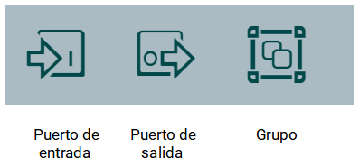
    <figcaption>Trabajando con grupos</figcaption>
</figure>

Dentro de los grupos, para indicar como entran los datos se utiliza un *Input port*, el cual va a definir un **puerto de entrada** al grupo. Del mismo modo, para indicar cómo salen los datos, se utiliza un *Output port* como **puerto de salida** para transferir la información fuera del grupo.

Así pues, los grupos de procesos nos van a permitir refactorizar nuestros flujos para agruparlos y poder reutilizarlos en otros flujos, o bien mejorar la legibilidad de nuestro flujo de datos.

En todo momento podemos ver el nivel en el que nos encontramos en la parte inferior izquierda, con una notación similar a `Nifi Flow >> Subnivel >> Otro Nivel`.

### Creando un grupo

Vamos a partir de un ejemplo sencillo de leer un fichero de texto, partirlo en fragmentos y nos saque por el log alguno de sus atributos.

Para ello, vamos a conectar un procesador *GetFile* con un *SplitText* y finalmente con *LogAttribute*.
El procesador *SplitText* nos permite dividir cualquier flujo de texto en fragmentos a partir del número de líneas que queramos (pudiendo tener encabezados, ignorar las líneas en blanco, etc...)

<figure style="align: center;">
    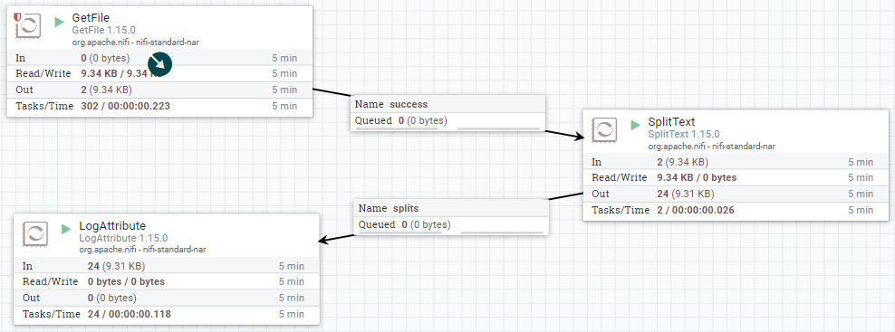
    <figcaption>Dividimos un archivo en fragmentos</figcaption>
</figure>

Para probarlo, podemos copiar cualquier archivo (ya sea el `README` o el `NOTICE`) en la carpeta que hayamos indicado de entrada y comprobar el log.

Una vez lo tenemos funcionando, vamos a colocar el procesador *SplitText* dentro de un grupo. Así pues, un grupo encapsula la lógica de un procesador haciéndolo funcionar como una caja negra.

Para ello, desde la barra superior arrastramos el icono de *Process Group* y lo nombramos como *grupo*.

<figure style="align: center;">
    
    <figcaption>Creación de un grupo</figcaption>
</figure>

### Importando un flujo

Otra manera de crear un grupo es a partir de una definición de flujo, tal como hemos entregando los ejercicios de la sesión anterior.

En cualquier momento, sobre el área de trabajo de un flujo, con el botón derecho, podemos seleccionar la opción *Download flow definition*, el cual nos descarga un archivo JSON con la definición del flujo.

Cuando arrastramos un grupo de procesadores al área de trabajo, nos aparece la opción de ponerle un nombre o, si pulsamos sobre el icono, cargar uno ya existente:

<figure style="align: center;">
    
    <figcaption>Importando un flujo en Nifi</figcaption>
</figure>


### Puertos

Una vez creado, vamos a copiar nuestro procesador *SplitText*. Pulsamos doble click sobre el grupo y bajaremos un nivel en el canvas para meternos dentro de *Grupo*. Una vez dentro, vamos a pegar el procesador y añadiremos tanto un *Input port* (al que nombramos como *entrada*) como un *Output port* (al que llamamos *salida*). Una vez creados, los conectamos con el procesador con las mismas conexiones que antes.

<figure style="align: center;">
    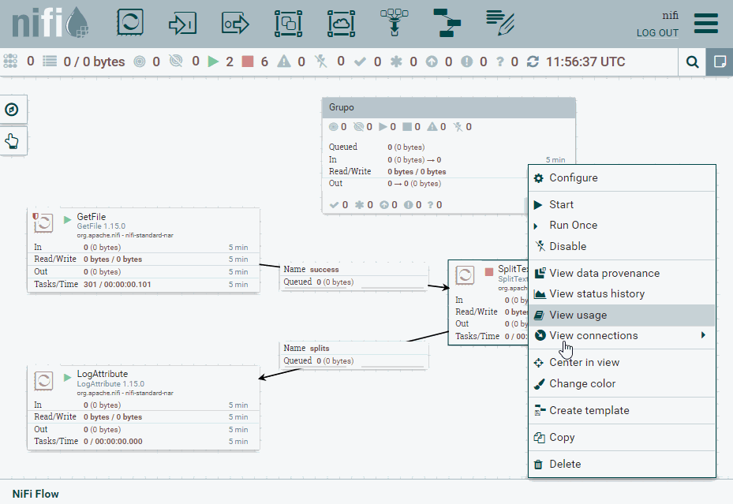
    <figcaption>Grupo con puertos de entrada y salida</figcaption>
</figure>

Ahora salimos del grupo, y conectamos los procesadores del nivel superior con el grupo creado y comprobamos como sigue funcionando.

<figure style="align: center;">
    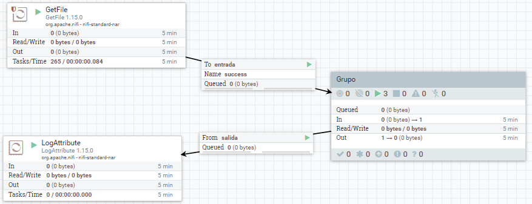
    <figcaption>Sustituimos el procesador por el grupo creado</figcaption>
</figure>

## Funnels

<figure style="float: right;">
    
    <figcaption>Funnel</figcaption>
</figure>

Los *funnels* son un tipo de componente que permite trabajar en paralelo y después unir los diferentes flujos en un único flujo de ejecución, además de poder definir su propia prioridad de forma centralizada.

Para ello vamos a poner varios *GenerateFlowFile* (4 en este caso) para mostrar sus datos mediante *LogAttribute*.

<figure style="align: center;">
    
    <figcaption>Varios procesadores que apuntan a uno</figcaption>
</figure>

Si quisiéramos cambiar el procesador de *LogAttribute* por otro tipo de procesador, deberíamos borrar todas las conexiones y volver a conectarlo todo. Para evitar esto añadimos un *Funnel* que va a centralizar todas las conexiones en un único punto.

<figure style="align: center;">
    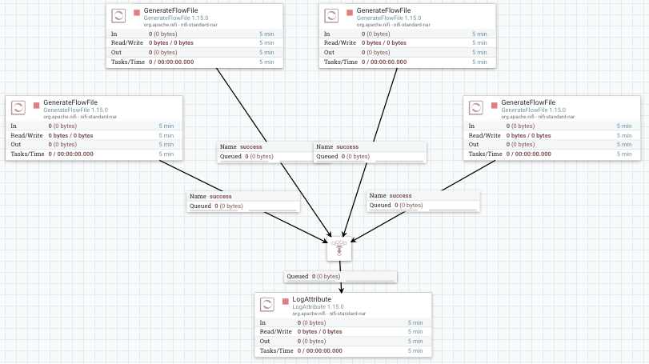
    <figcaption>El Funnel agrupa las conexiones</figcaption>
</figure>

## Plantillas

Nifi permite trabajar con plantillas para poder reutilizar flujos de datos, así como importar y exportar nuestras plantillas.

### Creando plantillas

Crear una plantilla es muy sencillo. Si partimos del ejemplo anterior, mediante shift y el ratón, podemos seleccionar todos los elementos que queremos que formen parte de la plantilla.

Una vez seleccionado, podemos utilizar el botón derecho o dentro del menú *Operate*, y elegir *Create Template*:

<figure style="align: center;">
    
    <figcaption>Creación de una plantilla</figcaption>
</figure>

Si queremos descargar una plantilla para usarla en otra instalación, desde el menú de la esquina superior derecha, en la opción *Templates*, podemos consultar las plantillas que tenemos cargadas, y para cada una de ellas, tenemos la opción de descargarlas o eliminarlas.

<figure style="align: center;">
    
    <figcaption>Descargando una plantilla</figcaption>
</figure>

### Cargando plantillas

En cambio, para cargar una plantilla, desde el propio menú de *Operate*, el icono con la plantilla y la flecha hacia arriba, nos permitirá elegir un archivo `.xml` con el código de la plantilla.

Una vez cargada, usaremos el control del menu superior para arrastrarla al área de trabajo.

Una de las mayores ventajas es el uso de plantillas ya existentes. Existe una colección de plantillas mantenida por *Cloudera* en <https://github.com/hortonworks-gallery/nifi-templates>. Se recomienda darle un ojo a la [hoja de cálculo](https://github.com/hortonworks-gallery/nifi-templates/blob/master/NiFi%20Templates.xlsx) que contiene un resumen de las plantillas compartidas.

Otros ejemplos a destacar se encuentran en <https://github.com/xmlking/nifi-examples>.

En nuestro caso, vamos a utilizar la plantilla de *CSV-to-JSON*, la cual podemos descargar desde <https://raw.githubusercontent.com/hortonworks-gallery/nifi-templates/master/templates/csv-to-json-flow.xml>.

Una vez descargado el archivo xml, lo subimos a Nifi. Tras ello, arrastramos el componente y vemos su resultado:

<figure style="align: center;">
    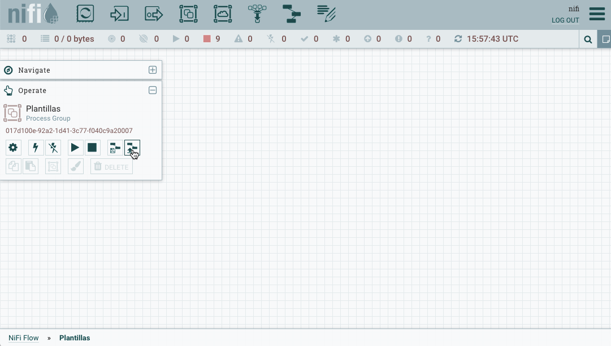
    <figcaption>Cargando una plantilla</figcaption>
</figure>

## Caso 5: Trabajando con conjuntos de registros

En los casos anteriores, ya hemos visto que haciendo uso de *ExtractText* y *AttributesToJSON* podíamos crear ficheros JSON a partir de CSV.

Nifi ofrece una forma más cómoda de realizar esto. Haciendo uso de los FF como registros y los procesadores de tipo *Record* (ya utilizamos alguno en el caso 3, en el que filtrábamos mediante una sentencia SQL), vamos a poder trabajar con los datos como un conjunto de registros en vez de hacerlo de forma individual.

Estos procesadores hacen que los flujos de construcción para manejar datos sean más sencillos, ya que que podemos construir procesadores que acepten cualquier formato de datos sin tener que preocuparnos por el análisis y la lógica de serialización. Otra gran ventaja de este enfoque es que podemos mantener los FF más grandes, cada uno de los cuales consta de múltiples registros, lo que resulta en un mejor rendimiento.

Tenemos tres componentes a destacar:

* De lectura: `AvroReader`, `CsvReader`, `ParquetReader`, `JsonPathReader`, `JsonTreeReader`, `ScriptedReader`, ...
* De escritura: `AvroRecordSetWriter`, `CsvRecordSetWriter`, `JsonRecordSetWriter`, `FreeFormTextRecordSetWriter`, `ScriptedRecordSetWriter`, ...
* Procesador de registros:
    * `ConvertRecord`: convierte entre formatos y/o esquemas similares. Por ejemplo, la conversión de CSV a Avro se puede realizar configurando `ConvertRecord` con un `CsvReader` y un `AvroRecordSetWriter`. Además, la conversión de esquemas entre esquemas similares se puede realizar cuando el esquema de escritura es un subconjunto de los campos del esquema de lectura o si el esquema de escritura tiene campos adicionales con valores propuestos.
    * `LookupRecord`: extrae uno o más campos de un registro y busca un valor para esos campos en un `LookupService` (ya sea a un fichero CSV, XML, accediendo a una base de datos o un servicio REST, etc...). Estos servicios funcionan como un mapa, de manera que reciben la clave y el servicio devuelve el valor. Puedes consultar más información en la serie de artículos [Data flow enrichment with NiFi part: LookupRecord processor](https://community.cloudera.com/t5/Community-Articles/Data-flow-enrichment-with-NiFi-part-1-LookupRecord-processor/ta-p/246940) y un ejemplo completo en [Enriching Records with LookupRecord & REST APIs in NiFi](https://alasdairb.com/2021/05/16/enriching-records-with-lookuprecord-rest-apis-in-nifi/).
    * `QueryRecord`: ejecuta una declaración SQL contra los registros y escribe los resultados en el contenido del archivo de flujo. Este es el procesador que usamos en el [caso 3 de la sesión anterior](04nifi1.md#caso-3-filtrado-de-datos).
    * `ConsumeKafkaRecord_N_M`: utiliza el *Reader* de registros configurado para deserializar los datos sin procesar recuperados de Kafka, y luego utiliza el *Writer* de registros configurado para serializar los registros al contenido del archivo de flujo.
    * `PublishKafkaRecord_N_M`: utiliza el *Reader* de registros configurado para leer el archivo de flujo entrante como registros, y luego utiliza el *Writer* de registros configurado para serializar cada registro para publicarlo en Kafka.

### Convirtiendo formatos

Así pues, para demostrar su uso vamos a convertir el archivo CSV del [caso 3 de la sesión anterior](04nifi1.md#caso-3---filtrado-de-datos) que contiene información sobre [ventas](resources/pdi_sales_small.csv) a formato JSON.

Podríamos utilizar simplemente un *GetFile* conectado a un *ConvertRecord* y este a un *PutFile*. Para que el fichero generado contenga como extensión el formato al que convertimos, antes de serializar los datos, añadimos un procesador *UpdateAttribute* para modificar el nombre del fichero.

El flujo de datos resultante será similar a:

<figure style="align: center;">
    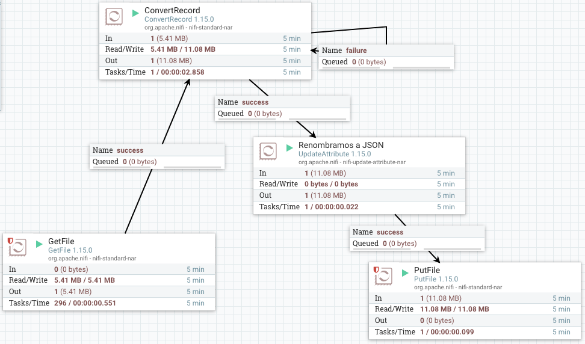
    <figcaption>Conversión de formato mediante ConvertRecord</figcaption>
</figure>

En concreto, en el caso del *ConvertRecord*, hemos utilizado los siguientes elementos:

<figure style="align: center;">
    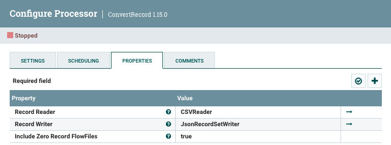
    <figcaption>Configuración de ConvertRecord</figcaption>
</figure>

Para el *CSVReader*, hemos de configurar el separador de campos con el `;` e indicar que la primera fila contiene un encabezado. Para el *JSONRecordSetWriter* no hemos configurado nada.

### Renombrando el destino

Tal como hemos comentado, necesitamos renombrar el fichero de salida. Para ello, necesitamos hacer uso del procesador *UpdateAttribute* y utilizar el [Nifi Expression Language](https://nifi.apache.org/docs/nifi-docs/html/expression-language-guide.html) para modificar la propiedad `filename` y recortar la extensión y concatenar con la nueva mediante la expresión `${filename:substringBefore('.csv')}.json`:

<figure style="align: center;">
    
    <figcaption>Modificando la extensión de filename</figcaption>
</figure>

## Caso 6: Trabajando con MySQL

¿Y si queremos recuperar datos de una base de datos relacional y guardarla en MongoDB? Para ello, podemos utilizar el procesador ExecuteSQLRecord que nos permite realizar cualquier tipo de operación SQL sobre un base de datos relacional y tratar los datos devueltos como un conjunto de registros.

!!! tip "Nifi + MongoDB + MySQL via Docker"

    Para poder acceder a MySQL y MongoDB desde la imagen de Nifi, necesitamos que formen parte de la misma red. Para ello, del mismo modo que hemos realizado en la sesión anterior, lo más cómodo es utilizar *Docker Compose* y definir las dependencias mediante el fichero de configuración de [docker-compose.yml](resources/nifi-mysql-mongodb/docker-compose.yml):

    ``` yaml title="docker-compose.yml"
    services:
        nifi:
            ports:
            - "8443:8443"
            image: apache/nifi:latest
            environment:
            SINGLE_USER_CREDENTIALS_USERNAME: nifi
            SINGLE_USER_CREDENTIALS_PASSWORD: nifinifinifi
            NIFI_JVM_HEAP_MAX: 2g
            links:
            - elasticsearch
            - mongodb
            - mysql
        mysql:
            image: mysql:latest
            container_name: iabd-mysql
            restart: always
            command: --default-authentication-plugin=mysql_native_password
            ports:
            - "3306:3306"
            environment:
            TZ: Europe/Madrid
            MYSQL_ROOT_PASSWORD: iabd
            MYSQL_DATABASE: retail_db
            MYSQL_USER: iabd
            MYSQL_PASSWORD: iabd
        mongodb:
            ports:
            - "27017:27017"
            image: mongo:latest
    ```

    Una vez colocado el [driver de MySQL](resources/nifi-mysql-mongodb/mysql-connector-j-8.0.31.jar) en la misma carpeta, lanzamos *docker-compose*:

    ``` bash
    docker-compose -p iabd-nifi-mysql-mongodb up -d
    ```

    Tras arrancar los contenedores, la primera vez, deberemos cargar la [base de datos](resources/nifi-mysql-mongodb/create_db.sql):

    ``` bash
    docker exec -i iabd-nifi-mysql-mongodb mysql -h 0.0.0.0 -P 3306 -uiabd -piabd retail_db < create_db.sql
    ```

    A partir de aquí, es importante destacar que la *url* de conexión a la base de datos, en vez de acceder a `localhost`, lo hace al nombre del contenedor `iabd-mysql`:

    ``` python
    url = "jdbc:mysql://iabd-mysql/retail_db"
    ```

Para este caso de uso, vamos a conectar la ejecución de SQL del procesador *ExecuteSQLRecord*, con un procesador *SplitText* encargado de separar el resultado de la consulta en múltiples *flowfiles*, para posteriormente insertar estos mediante el procesador *PutMongo*:

<figure style="align: center;">
    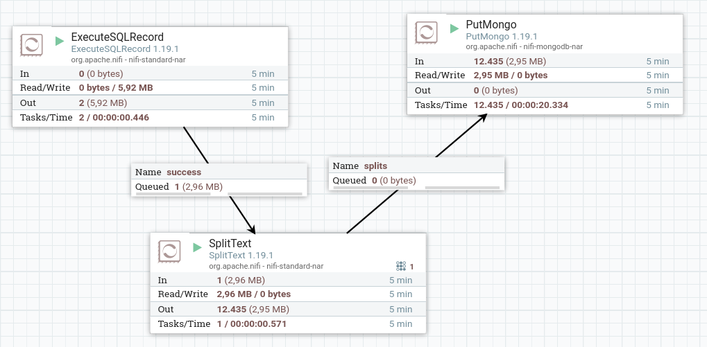
    <figcaption>Flujo del caso 6</figcaption>
</figure>

Así pues, veamos paso a paso cómo configuramos cada procesador.

### Ejecutando la consulta

Tal como hemos dicho, el primer paso es crear un procesador de tipo [*ExecuteSQLRecord*](https://nifi.apache.org/docs/nifi-docs/components/org.apache.nifi/nifi-standard-nar/latest/org.apache.nifi.processors.standard.ExecuteSQLRecord/index.html) que será el encargado de realizar la consulta a la base de datos.

Los dos elementos principales que debemos configurar en el procesador son:

* la entrada de los datos, mediante un *DBCPConnectionPool*
* la consulta SQL donde recuperamos todos los datos de la tabla `customers`.
* la salida de los datos, que en nuestro caso, hemos elegido *JSONRecordSetWriter* para facilitar su posterior inserción en MongoDB.

<figure style="align: center;">
    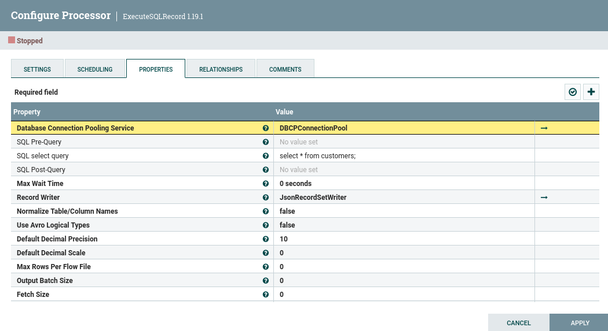
    <figcaption>Caso 6 - Procesador ExecuteSQLRecord</figcaption>
</figure>

#### Configurando la conexión a la base de datos

Al crear el servicio para la conexión a la base de datos, seleccionaremos un [DBCPConnectionPool](https://nifi.apache.org/docs/nifi-docs/components/org.apache.nifi/nifi-dbcp-service-nar/latest/org.apache.nifi.dbcp.DBCPConnectionPool/index.html) donde indicaremos:

* la URL para conectarnos a la base de datos: `jdbc:mysql://localhost/retail_db`
* el driver empleado: `com.mysql.cj.jdbc.Driver`
* la ruta donde encontrar el driver: `/opt/mysql-connector-j-8.0.31.jar` (podéis [descargarlo desde aquí](resources/mysql-connector-j-8.0.31.jar) y colocarlo en la carpeta)
* usuario y contraseña de la base de datos: `iabd` / `iabd`

<figure style="align: center;">
    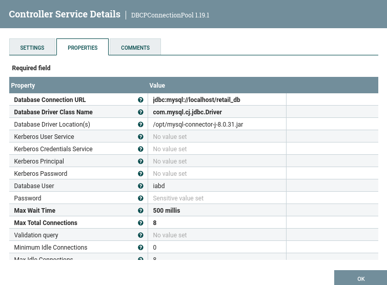
    <figcaption>Configuración de DBCPConnectionPool</figcaption>
</figure>

#### Salida en JSON

Respecto al [JSONRecordSetWriter](https://nifi.apache.org/docs/nifi-docs/components/org.apache.nifi/nifi-record-serialization-services-nar/latest/org.apache.nifi.json.JsonRecordSetWriter/index.html), únicamente vamos a configurar la propiedad *Outgoing grouping* con el valor `One Line per Object`, para que cada documento JSON ocupe una única línea.

### Dividiendo los datos

Tras conectar el procesador *ExecuteSQLRecord* con *SplitText*, en éste último configuraremos:

* *Line Split Count* a `1`, tal como acabamos de configurar, cada documento sólo ocupa una línea.
* *Header Line Count* a `0`, ya que los datos no contiene encabezado.

### Persistiendo en MongoDB

<figure style="float: right;">
    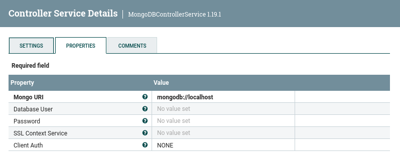
    <figcaption>Configuración de MongoDBControllerService</figcaption>
</figure>

Para guardar los datos en *MongoDB*, volvemos a utilizar el procesador [PutMongo](https://nifi.apache.org/docs/nifi-docs/components/org.apache.nifi/nifi-mongodb-nar/latest/org.apache.nifi.processors.mongodb.PutMongo/index.html), pero a diferencia de la sesión anterior, en este caso vamos a utilizar un servicio de cliente donde previamente hemos configurado la conexión con MongoDB. De esta manera, ya no necesitamos configurar la URI ni la autenticación.

!!! caution "Arrancar MongoDB"
    Recuerda arrancar *MongoDB* mediante `sudo service mongod start`

Para ello, si nos centramos en la instalación de nuestra máquina virtual donde no tenemos activado ningún tipo de autenticación, creamos un [MongoDBControllerService](https://nifi.apache.org/docs/nifi-docs/components/org.apache.nifi/nifi-mongodb-services-nar/latest/org.apache.nifi.mongodb.MongoDBControllerService/index.html) y configuramos:

* la URI: `mongodb://localhost`
* el usuario y la contraseña: no los rellenamos
* el tipo de autenticación: `NONE`

Una vez activado el servicio, en nuestro procesador *PutMongo* ya no necesitamos configurar los datos anteriores, y por lo tanto, será similar a:

<figure style="align: center;">
    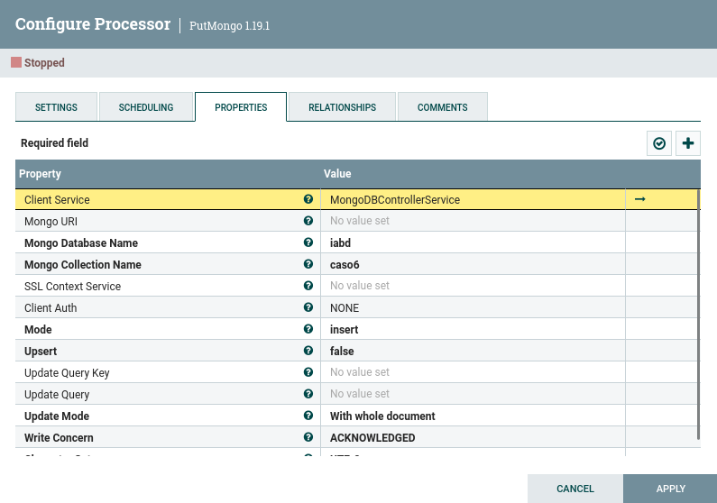
    <figcaption>Configuración de PutMongo</figcaption>
</figure>

### Trabajando sólo con registros

¿Para qué transformamos los datos a JSON cuando podemos directamente persistir los datos en MongoDB como conjuntos de registros?

Nifi ofrece el procesador [PutMongoRecord](https://nifi.apache.org/docs/nifi-docs/components/org.apache.nifi/nifi-mongodb-nar/latest/org.apache.nifi.processors.mongodb.PutMongoRecord/index.html) que espera como entrada un conjunto de registros y realiza la misma lógica que *PutMongo*. Así pues, vamos a conectar directamente la salida de la ejecución de SQL con un procesador de tipo *PutMongoRecord*:

<figure style="align: center;">
    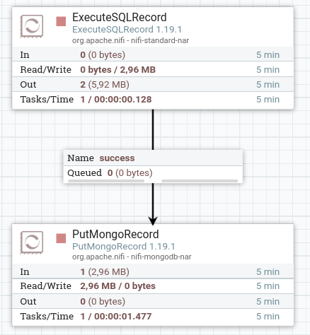
    <figcaption>Uso de PutMongoRecord</figcaption>
</figure>

Y configuramos el procesador:

<figure style="align: center;">
    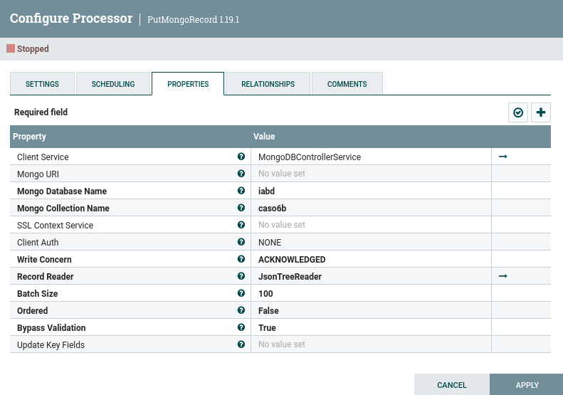
    <figcaption>Configuración de PutMongoRecord</figcaption>
</figure>

## Caso 7: de AEMET a MongoDB y S3

Para este caso de uso, vamos a recoger datos de un servicio REST, en concreto, datos climatológicos de la Agencia Estatal de METeorología (AEMET) y los vamos a persistir tanto en *MongoDB* como en un lago de datos almacenado en *S3*.

Aunque [AEMET](https://www.aemet.es/) ofrece su [propia API](https://opendata.aemet.es/centrodedescargas/inicio) para obtener datos, vamos a utilizar el [API pública](https://www.el-tiempo.net/api) de <https://www.el-tiempo.net>, la cual simplifica su uso.

En concreto, nos vamos a centrar en realizar llamadas a la  URL <https://www.el-tiempo.net/api/json/v2/provincias/03/municipios/03065>, en la cual vamos a recuperar los datos del municipio de Elche (`03065`) que pertenece a la provincia de Alicante (`03`), obteniendo datos similares a:

``` json hl_lines="15 26 31"
{
  "origin": {
    "productor": "Agencia Estatal de Meteorología - AEMET. Gobierno de España",
    "web": "https://www.aemet.es",
    ...
  },
  "title": "elTiempo.net | El tiempo en Elche/Elx (Alacant/Alicante)",
  ...
  "municipio": {
    "CODIGOINE": "03065000000",
    "ID_REL": "1030651",
    "COD_GEO": "03320",
    "CODPROV": "03",
    "NOMBRE_PROVINCIA": "Alacant/Alicante",
    "NOMBRE": "Elche/Elx",
    "POBLACION_MUNI": 228647,
    "SUPERFICIE": 32606.7487,
    "PERIMETRO": 91751,
    ...
  },
  "fecha": "2023-03-10",
  "stateSky": {
    "description": "Nubes altas",
    "id": "17"
  },
  "temperatura_actual": "24",
  "temperaturas": {
    "max": "27",
    "min": "15"
  },
  "humedad": "24",
  "viento": "18",
  "precipitacion": "0",
  "lluvia": "",
  ...
}
```

De todos los datos recuperados, nos vamos a centrar en recuperar la ciudad, la temperatura y la humedad.

### Bronze: Petición REST y S3

Para recuperar los datos a partir del servicio REST necesitamos utilizar el procesador [InvokeHTTP](https://nifi.apache.org/docs/nifi-docs/components/org.apache.nifi/nifi-standard-nar/latest/org.apache.nifi.processors.standard.InvokeHTTP/index.html), mediante el cual hacemos la petición GET a la URL <https://www.el-tiempo.net/api/json/v2/provincias/03/municipios/03065>.

En este ejemplo, hemos definido que se ejecute cada 60 segundos (en la pestaña *Scheduling*, completamos la propiedad *Run Schedule* a `60 sec`).

Para seguir el enfoque de *data lake*, vamos a almacenar en crudo el resultado de la petición en S3, utilizando el procesador *PutS3Object*, pero previamente necesitamos añadir el atributo `filename` para ponerle un nombre el archivo guardado.

!!! info "Data Lake"
    Respecto a la estructura del *data lake*, vamos a crear un *bucket* que llamaremos `iabd-nifi` donde añadiremos a su vez tres carpetas:

    * `iabd-nifi/bronze`: donde colocaremos los documentos JSON tal cual los recibimos de la petición REST.
    * `iabd-nifi/silver`: donde guardaremos cada minuto documentos JSON con la siguiente estructura:

        ``` json
        {
            "fecha":"2023-03-13 10:17:20",
            "ciudad":"Elche/Elx",
            "temp":"20",
            "humedad":"47"
        }
        ```

    * `iabd-nifi/gold`: donde guardaremos cada diez minutos documentos *Parquet* con la misma estructura que antes, pero con las medias de las temperaturas y las humedades:

        ``` json
        {
            "fecha": "2023-03-13T08:17:20.000Z",
            "ciudad": "Elche/Elx",
            "temp": 20,
            "humedad": 47
        }
        ```

#### Creando el bucket

Tras entrar a la consola de AWS creamos el *bucket* y le damos acceso público y, en la pestaña *Permisos*, configuramos la política del *bucket* para permitir tanto el almacenamiento como la recuperación de datos:

``` json hl_lines="13 20"
{
    "Version": "2012-10-17",
    "Statement": [
        {
            "Sid": "UploadNifi",
            "Effect": "Allow",
            "Principal": "*",
            "Action": [
                "s3:ListMultipartUploadParts",
                "s3:PutObject",
                "s3:GetObject"
            ],
            "Resource": "arn:aws:s3:::iabd-nifi/*"
        },
        {
            "Sid": "UploadNifiListBucket",
            "Effect": "Allow",
            "Principal": "*",
            "Action": "s3:ListBucketMultipartUploads",
            "Resource": "arn:aws:s3:::iabd-nifi"
        }
    ]
}
```

#### Nombrando el fichero

Tras recibir la petición REST vamos a crear dos nuevos atributos mediante el procesador *UpdateAttribute* para darle un nombre a los ficheros que vamos a almacenar y crear un atributo con la fecha de la petición:

* `fecha`: `${now():format("yyyy-MM-dd HH:mm:ss")}`
* `filename`: `${now():format("yyyy-MM-dd HH:mm:ss")}.json`

Podemos observar como ademas hemos creado un atributo `fecha` para poder almacenar el *timestamp* de cada mensaje (dicha información no viene en la respuesta de la petición REST, únicamente viene la fecha).

#### Persistiendo en S3

!!! tip inline end "Clave en AWS Academy"
    Recuerda que puedes recuperar las claves desde *AWS CLI* en *AWS Details* al arrancar el laboratorio de *Learner Labs*.

Para conectar *Nifi* con *S3* necesitamos obtener nuestras credenciales de *AWS* (en nuestro caso de *AWS Academy*) y copiarlas en `~/.aws/credentials`:

``` properties
[default]
aws_access_key_id=ASI...
aws_secret_access_key=otO8...
aws_session_token=FwoGZ...
```

Tras ello utilizamos un procesador [PutS3Object](https://nifi.apache.org/docs/nifi-docs/components/org.apache.nifi/nifi-aws-nar/latest/org.apache.nifi.processors.aws.s3.PutS3Object/index.html) rellenando las siguientes propiedades:

* *Object Key*: `${filename}`
* *Bucket*: `iabd-nifi/bronze`
* *Region*: US East (N. Virginia)

Y finalmente conectamos los tres procesadores conforme a la imagen del lateral donde, para dotar de mayor información a los procesadores, les hemos puesto nombres descriptivos:

* La petición REST a modificar los atributos mediante la conexión *Response*.
* La modificación de atributos al almacenamiento en S3 mediante *success*.

<figure style="align: center;">
    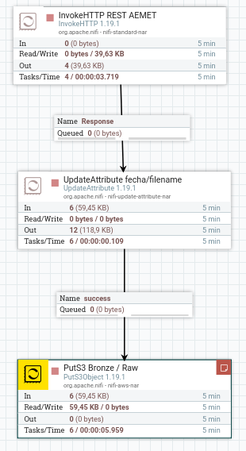
    <figcaption>Flujo de la petición REST hasta S3</figcaption>
</figure>

Tras ejecutarlos, podemos listar los archivos de nuestro bucket:

``` bash
[cloudshell-user@ip-10-6-106-167 ~]$ aws s3 ls s3://iabd-nifi/bronze/
2023-03-13 09:12:20      10146 2023-03-12 19:11:44.json
2023-03-13 09:12:21      10146 2023-03-12 19:12:45.json
2023-03-13 09:12:22      10146 2023-03-12 19:13:46.json
2023-03-13 09:12:23      10146 2023-03-12 19:14:47.json
2023-03-13 09:12:23      10146 2023-03-12 19:15:47.json
...
```

### Silver: De REST a JSON

Una vez tenemos las peticiones REST recuperadas (y almacenadas en el *data lake*) vamos a seleccionar los datos que nos interesan y los guardaremos en la capa *silver* en formato JSON.

Así pues, el primer paso es utilizar un procesador [EvaluateJSONPath](https://nifi.apache.org/docs/nifi-docs/components/org.apache.nifi/nifi-standard-nar/latest/org.apache.nifi.processors.standard.EvaluateJSONPath/index.html) para recoger la ciudad, la temperatura y la humedad. Para ello, hemos de crear tres nuevas propiedades y referenciar a la raíz del documento mediante el `$`, de modo que para recuperar el atributo `temperatura` utilizaremos `$.temperatura`:

<figure style="align: center;">
    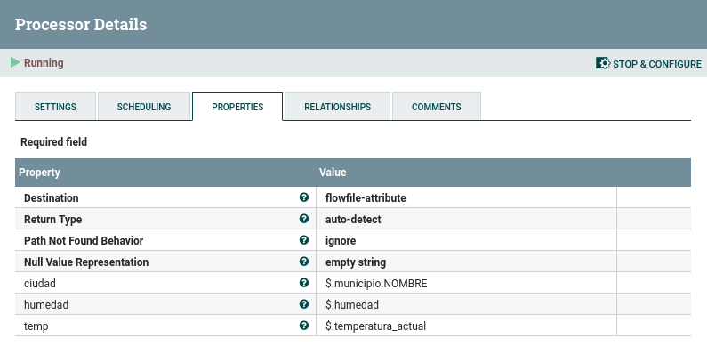
    <figcaption>Parseando el JSON</figcaption>
</figure>

Con este procesador hemos creado tres atributos que contienen el valor de cada propiedades. La conexión que nos permite conectar este procesador con el que contiene los valores es `matched`.

#### De atributos a JSON

Y ahora vamos a pasar esos atributos al contenido del mensaje. Para ello, mediante el procesador [AttributesToJSON](https://nifi.apache.org/docs/nifi-docs/components/org.apache.nifi/nifi-standard-nar/latest/org.apache.nifi.processors.standard.AttributesToJSON/index.html) indicamos una lista de atributos separados por comas y configuramos que queremos que coloque el resultado en el contenido del mensaje:

<figure style="align: center;">
    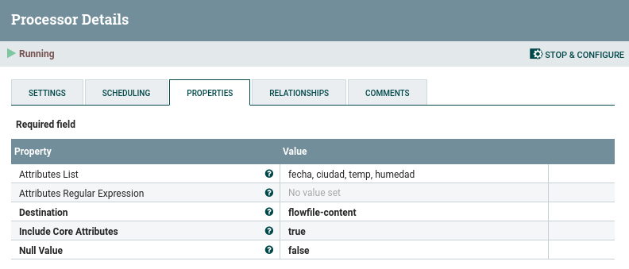
    <figcaption>De atributos a JSON</figcaption>
</figure>

#### Persistencia en S3 y MongoDB

Y con este mensaje que únicamente contiene la información que nos interesa la volvemos a guardar en S3, en este caso en el *bucket* `iabd-nifi/silver`.

Además, queremos almacenar los mismos datos en *MongoDB* para facilitar la analítica. Para ello, configuramos la base de datos `iabd` y la colección `caso7silver`.

Recapitulando, en este momento nuestro flujo de datos sería similar a la siguiente imagen:

<figure style="align: center;">
    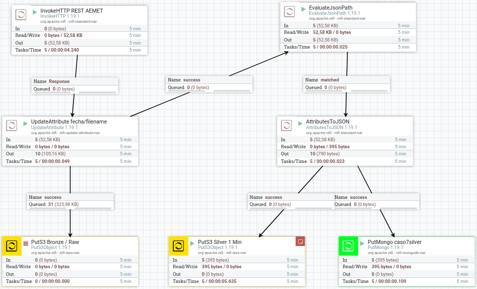
    <figcaption>Caso 7 - Flujo hasta silver</figcaption>
</figure>

Si consultamos los datos almacenados en S3 obtendremos:

``` bash
[cloudshell-user@ip-10-6-106-167 ~]$ aws s3 ls s3://iabd-nifi/silver/
2023-03-12 18:07:44         79 2023-03-12 19:07:41.json
2023-03-12 18:08:45         79 2023-03-12 19:08:41.json
2023-03-12 18:09:46         79 2023-03-12 19:09:43.json
2023-03-12 18:10:47         79 2023-03-12 19:10:43.json
...
```

Además, si realizamos una consulta sobre los datos obtendremos:

``` json
iabd> db.caso7silver.find()
[
  {
    _id: ObjectId("640ef8b112ca74269a8cf805"),
    fecha: '2023-03-13 11:18:14',
    temp: '22',
    ciudad: 'Elche/Elx',
    humedad: '42'
  },
  {
    _id: ObjectId("640ef8b112ca74269a8cf806"),
    fecha: '2023-03-13 11:19:15',
    temp: '22',
    ciudad: 'Elche/Elx',
    humedad: '42'
  },
  ...
]
```

!!! danger "Formato de la fecha"
    ¿Te has fijado que la fecha se ha almacenado como una cadena? ¿Cómo podríamos solucionarlo?  
    Como el procesador *PutMongo* espera el contenido en formato JSON, no podemos configura bien los tipos de datos. En el siguiente apartado usaremos *PutMongoRecord*

### Gold: agregando datos

En este paso, vamos a agrupar mensajes de 10 en 10 (lo que implicaría cada 10 minutos) y calcular las temperaturas y humedades medias, para posteriormente volver a almacenarlo tanto en S3 como en *MongoDB*.

#### Agrupando mensajes

Así pues, el primer paso es agrupar los mensajes. Para ello, tal como hicimos en el [caso 4](04nifi1.md#caso-4-fusionar-datos) utilizaremos el procesador [MergeContent](https://nifi.apache.org/docs/nifi-docs/components/org.apache.nifi/nifi-standard-nar/latest/org.apache.nifi.processors.standard.MergeContent/index.html) donde le indicamos que siempre agrupe 10 mensajes y que utilice el salto de línea como delimitador de línea (esto último lo hicimos en la sesión anterior):

<figure style="align: center;">
    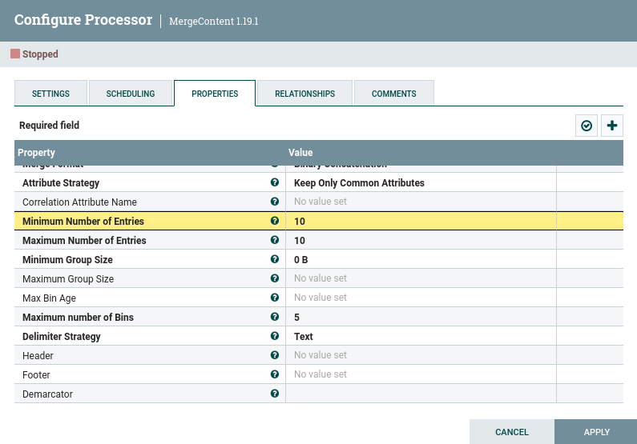
    <figcaption>Caso 7 - Agrupando mensajes</figcaption>
</figure>

En este momento, cada FF contiene 10 líneas con mensajes JSON con los datos de los últimos diez minutos.

Al agrupar los datos, como hemos seleccionado que solo mantenga los atributos que eran comunes, tendremos que volver a añadir otro atributo con el nombre del fichero. Así pues, añadimos un nuevo procesador *UpdateAttribute* donde volvemos a crear el atributo `filename`, pero en este caso utilizaremos la expresión `${now():format("yyyy-MM-dd HH:mm")}:00.parquet` para indicarle que los segundos siempre serán `00` (para dejar claro que lo importante son los minutos) y le añadimos la extensión `parquet`, ya que vamos a persistir los datos en ese formato

<figure style="align: center;">
    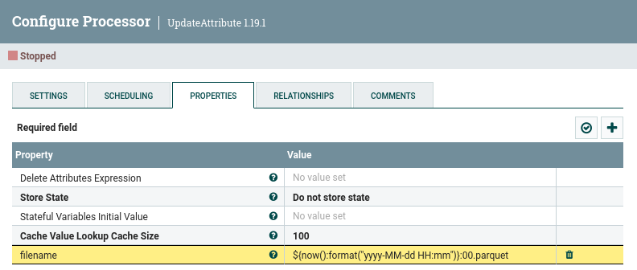
    <figcaption>Caso 7 - Atributo filename</figcaption>
</figure>

#### Calculando valores mediante SQL

Con esos datos que tenemos en un único FF podemos realizar una consulta SQL que agregue los datos. Para ello, volvemos a utilizar el procesador [*QueryRecord*](https://nifi.apache.org/docs/nifi-docs/components/org.apache.nifi/nifi-standard-nar/latest/org.apache.nifi.processors.standard.QueryRecord/index.html) con la siguiente consulta (en mi flujo la he denominado `tempMedia`) que obtiene la temperatura y humedad media, agrupada por ciudad, mostrando también la fecha de la última lectura.

``` sql title="tempMedia"
select ciudad, max(fecha) as fecha, avg(temp) as temp, avg(humedad) as humedad from Flowfile group by ciudad
```

<figure style="align: center;">
    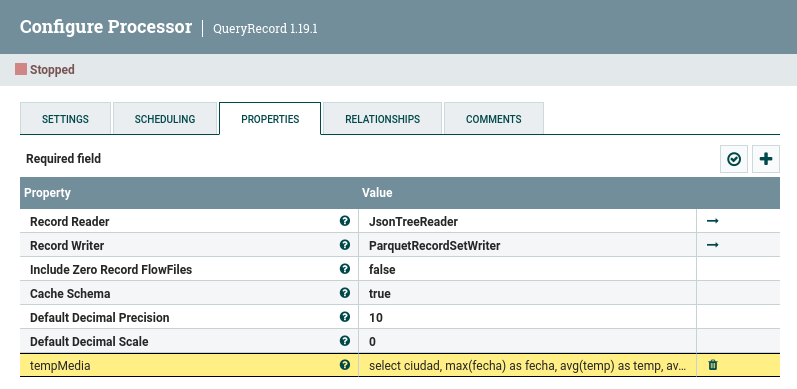
    <figcaption>Caso 7 - Configuración del QueryRecord</figcaption>
</figure>

Para la lectura, como nuestros FF contienen JSON, crearemos y utilizaremos un *JsonTreeReader* donde en el formato del *timestamp* le pondremos el formato que hemos utilizado hasta ahora `yyyy-MM-dd HH:mm:ss`:

<figure style="align: center;">
    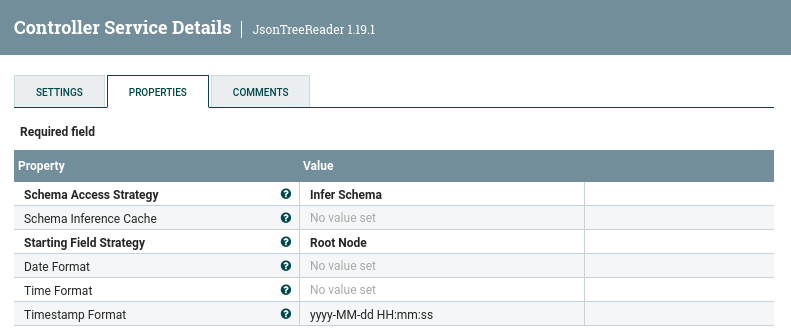
    <figcaption>Caso 7 - Configuración del JsonTreeReader</figcaption>
</figure>

Y para guardar el resultado, como queremos persistirlo en formato *Parquet*, únicamente hemos de crear y seleccionar el *ParquetRecordSetWriter*, donde no hemos de configurar nada.

#### Almacenando en S3

Del mismo modo que antes, volvemos a utilizar el procesador *PutS3Object* para almacenar los datos que provienen de la conexión `tempMedia`, en este caso, en el bucket `iabd-gold`.

Al conectarnos a S3 podemos ver los datos que se van almacenando:

``` bash1
[cloudshell-user@ip-10-6-106-167 ~]$ aws s3 ls s3://iabd-nifi/gold/
2023-03-12 18:10:47       1376 2023-03-12 19:10:00.parquet
2023-03-12 18:13:50       1376 2023-03-12 19:13:00.parquet
2023-03-12 18:16:52       1376 2023-03-12 19:16:00.parquet
2023-03-12 18:19:55       1376 2023-03-12 19:19:00.parquet
2023-03-12 18:22:57       1376 2023-03-12 19:22:00.parquet
```

Si queremos comprobar los datos *Parquet* almacenados, podemos acceder a la consola de S3 y sobre uno de los archivos realizar una consulta *S3Select* seleccionando que los datos de entrada están en formato *Parquet* y los de salida, por ejemplo, en JSON:

<figure style="align: center;">
    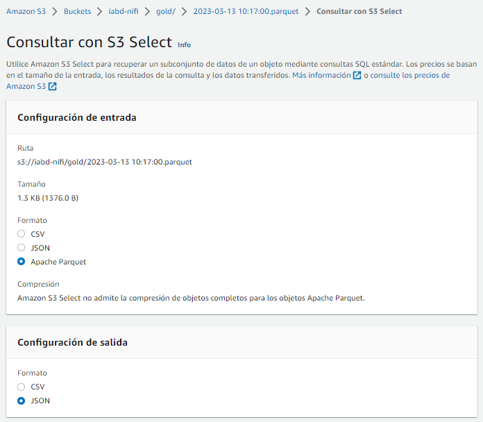
    <figcaption>Consulta con S3Select</figcaption>
</figure>

Y realizamos un consulta para mostrar todos los datos y ver el resultado:

<figure style="align: center;">
    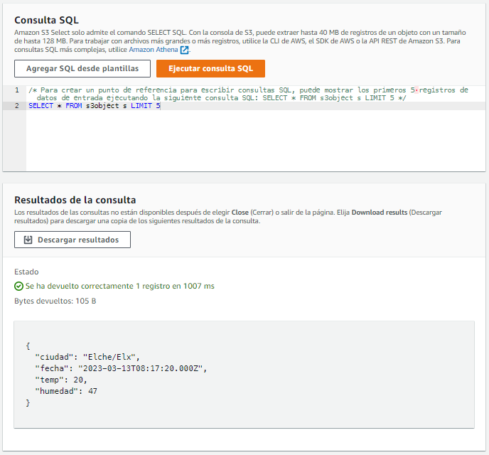
    <figcaption>Consulta con S3Select</figcaption>
</figure>

#### Datos agregado en MongoDB

Para almacenar el dato calculado en MongoDB en esta ocasión utilizaremos el procesador [PutMongoRecord](https://nifi.apache.org/docs/nifi-docs/components/org.apache.nifi/nifi-mongodb-nar/latest/org.apache.nifi.processors.mongodb.PutMongoRecord/index.html) indicando de nuevo la base de datos (`iabd`), la colección (`caso7gold`) y en este caso que el encargado de las lecturas será un *ParquetReader*

<figure style="align: center;">
    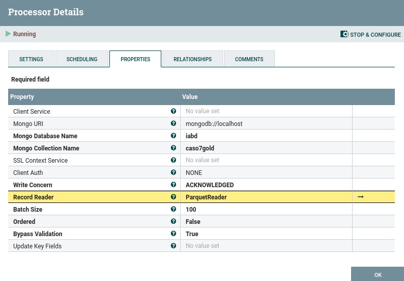
    <figcaption>Caso 7 - Persistiendo en MongoDB mediante PutMongoRecord</figcaption>
</figure>

De esta manera, ahora sí que se almacena la fecha correctamente y los datos numéricos también:

``` json
iabd> db.caso7gold.find()
[
  {
    _id: ObjectId("640ef91d12ca74269a8cf80a"),
    ciudad: 'Elche/Elx',
    fecha: ISODate("2023-03-13T09:21:17.000Z"),
    temp: Decimal128("22.000000000"),
    humedad: Decimal128("42.000000000")
  },
  {
    _id: ObjectId("640f050312ca74269a8cf83c"),
    ciudad: 'Elche/Elx',
    fecha: ISODate("2023-03-13T09:52:45.000Z"),
    temp: Decimal128("22.000000000"),
    humedad: Decimal128("42.000000000")
  },
  ...
]
```

En resumen, el flujo completo del caso de uso sería:

<figure style="align: center;">
    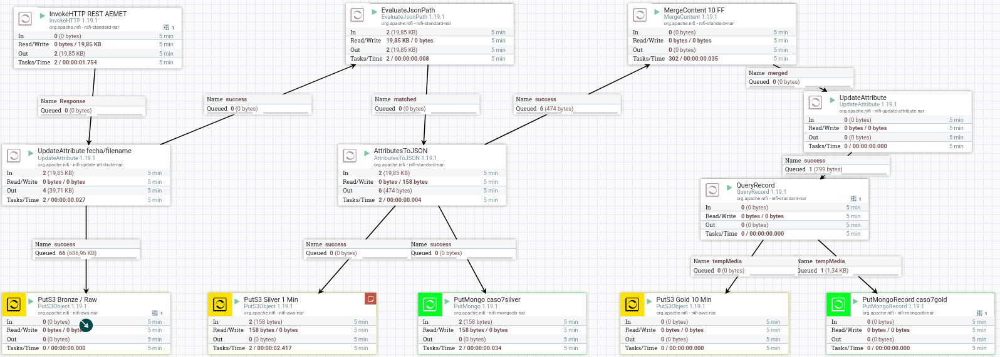
    <figcaption>Flujo completo del caso 7</figcaption>
</figure>

## API REST

*Nifi* ofrece un API REST con el cual podemos interactuar de forma similar al interfaz gráfico.

A partir del host donde tenemos *Nifi* instalado, las peticiones siguen al nomenclatura `/nifi-api/<servicio>`, de manera que con nuestra máquina virtual podríamos acceder a información sobre la instalación mediante <https://localhost:8443/nifi-api/flow/about>.

``` json
{
  "about": {
    "title": "NiFi",
    "version": "1.19.1",
    "uri": "https://localhost:8443/nifi-api/",
    "contentViewerUrl": "../nifi-content-viewer/",
    "timezone": "CET",
    "buildTag": "nifi-1.19.1-RC2",
    "buildRevision": "a7236ec",
    "buildBranch": "UNKNOWN",
    "buildTimestamp": "12/05/2022 09:57:12 CET"
  }
}
```

Podemos consultar todas los servicios disponibles en la [documentación oficial](https://nifi.apache.org/docs/nifi-docs/rest-api/index.html).

!!! info inline end "Peticiones REST"
    Para el posterior ejemplo, hemos realizado las peticiones REST mediante el comando `curl`, aunque para probar sería más ágil utilizar [Postman](https://www.postman.com/), o directamente mediante Python y la librería request.

Los *endpoints* más destacados son:

* `/access`: para autenticarnos y obtener el token de acceso a Nifi
* `/controller`: permite obtener la configuración de los controladores, gestionar el cluster y crear tareas para informes.
* `/controller-services`: permite gestionar los servicios de controlador y modificar sus referencias.
* `/flow`: para obtener metadatos de los flujos de datos, estado de los componentes y el histórico de consultas.
* `/process-groups`: Para cargar e iniciar plantillas y crear componentes.
* `/processors`: Permite crear y planificar un procesador y definir sus propiedades.
* `/connections`: Para crear conexiones, definir las prioridades de las colas y modificar el destino de las conexiones.
* `/flowfile-queues`: Permite ver el contenido de loas colas, descargar sus *flowfiles* y vaciar las colas.
* `/remote-process-groups`: Para crear un grupo remoto y habilitar la transmisión.
* `/provenance`: Para consultar el linaje de los datos.

Si por ejemplo, quisiéramos lanzar un grupo de procesadores mediante el interfaz REST necesitamos:

1. Autenticarnos para obtener un token de sesión mediante `/access/token`.

    ``` bash
    curl --tlsv1.2 https://localhost:8443/nifi-api/access/token --data 'username=nifi&password=nifinifinifi' -k
    ```

    El cual nos devuelve el token:

    ``` bash
    eyJraWQiOiI3...
    ```

2. Recuperamos el *uuid* del grupo de procesadores que queremos lanzar (hemos elegido uno que previamente hemos comprobado que está detenido):

    <figure style="align: center;">
        
        <figcaption>Identificador de un grupo de procesadores</figcaption>
    </figure>

    En este caso, el identificador del grupo de procesadores que queremos lanzar es `b1a0a805-0186-1000-8b83-2033ab7036c9`.

3. Mediante `flow/process-groups/{id}` con una petición PUT modificamos el grupo de procesadores y ponemos su estado en ejecución (`RUNNING`):

    ``` bash
    curl --tlsv1.2 -ik -H 'Content-Type: application/json' -H 'Authorization:Bearer eyJraWQiOiI3...' \
    -XPUT -d '{"id":"b1a0a805-0186-1000-8b83-2033ab7036c9","state":"RUNNING"}' \
    https://localhost:8443/nifi-api/flow/process-groups/b1a0a805-0186-1000-8b83-2033ab7036c9
    ```

    Obteniendo como resultado el nuevo estado del grupo de procesadores:

    ``` http hl_lines="16"
    HTTP/1.1 200 OK
    Date: Mon, 06 Mar 2023 11:28:49 GMT
    Set-Cookie: __Secure-Request-Token=4e531dfb-45fb-4fd4-aed9-c2a4a6a00b04; Path=/; Secure
    Expires: Thu, 01 Jan 1970 00:00:00 GMT
    Cache-Control: private, no-cache, no-store, no-transform
    Content-Type: application/json
    Vary: Accept-Encoding
    Content-Security-Policy: frame-ancestors 'self'
    Strict-Transport-Security: max-age=31536000 ; includeSubDomains
    X-Content-Type-Options: nosniff
    X-Frame-Options: SAMEORIGIN
    X-XSS-Protection: 1; mode=block
    Vary: User-Agent
    Content-Length: 63

    {"id":"b1a0a805-0186-1000-8b83-2033ab7036c9","state":"RUNNING"}
    ```

Si entramos al interfaz de *Nifi*, veremos como ese grupo de procesadores ahora aparece arrancado.

!!! info "Elasticsearch y Twitter"
    En la edición de 21/22, en estas sesiones, realizamos diferentes casos de uso con *Elasticsearch* y *Twitter*. 
    
    Este curso no hemos visto *Elasticsearch*, y además, el API de *Twitter* ha dejado de ser gratuita. Si tienes curiosidad, puedes consultar dichos casos de uso en los [apuntes del curso pasado](https://aitor-medrano.github.io/bigdata2122/apuntes/ingesta04nifi2.html).

    Conviene destacar, que Desde la versión 1.17 de Nifi (disponible desde agosto del 2022), podemos emplear el procesador [*ConsumeTwitter*](https://nifi.apache.org/docs/nifi-docs/components/org.apache.nifi/nifi-social-media-nar/latest/org.apache.nifi.processors.twitter.ConsumeTwitter/index.html) que ya emplea la versión 2 del API de Twitter, y sustituye al procesador anterior, de manera que no hace falta tener una cuenta de nivel *Elevated*.

## Referencias

* Documentación oficial:
    * [Getting started with Apache Nifi](https://nifi.apache.org/docs/nifi-docs/html/getting-started.html)
    * [Apache Nifi User Guide](https://nifi.apache.org/docs/nifi-docs/html/user-guide.html)
    * [Apache Nifi in Depth](https://nifi.apache.org/docs/nifi-docs/html/nifi-in-depth.html)
* [Apache Nifi en TutorialsPoint](https://www.tutorialspoint.com/apache_nifi/index.htm)
* [Playlist de Youtube de InsightByte](https://www.youtube.com/playlist?list=PLkp40uss1kSI66DA_aDCfx02gXipoRQHc)
* Libro [Data Engineering with Python](https://www.packtpub.com/product/data-engineering-with-python/9781839214189)
* Artículo de *Futurespace*: [Flujo de extracción, validación, transformación y carga de ficheros (Caso de uso real)](https://www.futurespace.es/apache-nifi-flujo-de-extraccion-validacion-transformacion-y-carga-de-ficheros-caso-de-uso-real/)

## Actividades

En la entrega debes adjuntar una captura de pantalla donde se vea el flujo de datos completo con una nota con tu nombre, y adjuntar la definición de cada flujo (sobre el área de trabajo, con el botón derecho, *Download flow definition*).

1. (RA5075.1 / CE5.1c / 1.5p) Realiza el caso de uso 5, colocando los procesadores *ConvertRecord* y *UpdateAttribute* dentro de un grupo de procesadores, al que denominaras `caso5<nombre>` (con tu nombre).

    A continuación, exporta todo el ejercicio como una plantilla, y adjúntala a la entrega.

2. (RA5075.1 / CE5.1d / 1.5p) En la base de datos `retail_db`, además de `customers`, podemos utilizar las tablas `orders` y `order_items` para obtener la cantidad de productos que contiene un pedido. Se pide almacenar en *MongoDB* los pedidos:

    * Código y fecha del pedido.
    * Precio del pedido (sumando las líneas de pedido).
    * Código, nombre y apellidos del cliente.

    Dichos datos se tienen que persistir en dos colecciones las cuales se rellenen automáticamente utilizando tanto el uso de registros (en la colección `caso6-records`) como los *flowfile* separados de forma individual (`caso6-split`).

    Además, indica que cambios habría que realizar en *Nifi* para ingestar de forma continua los pedidos de la última hora.

3. (RA5075.1 / CE5.1d / 1p) Realiza el caso de uso 7 recogiendo los datos de *AEMET* y almacenando los datos en S3 a modo de *data lake* tanto los datos en crudo como los datos agregados y de forma simultánea en *MongoDB*, pero realizando peticiones cada 30 segundos y los datos agregados cada 3 minutos.

*[RA5075.1]: Gestiona soluciones a problemas propuestos, utilizando sistemas de almacenamiento y herramientas asociadas al centro de datos.
*[CE5.1b]: Se han determinado los procedimientos y mecanismos para la ingestión de datos.
*[CE5.1c]: Se ha determinado el formato de datos adecuado para el almacenamiento.
*[CE5.1d]: Se han procesado los datos almacenados.
