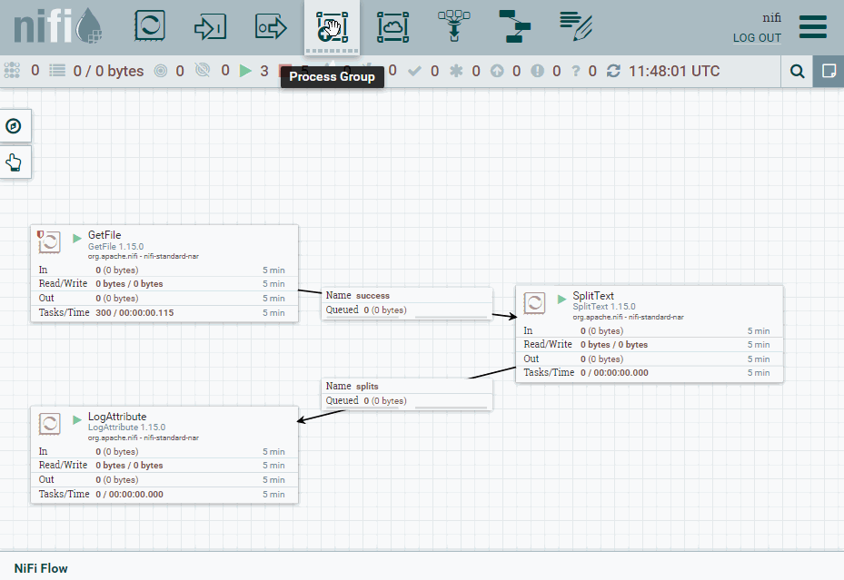
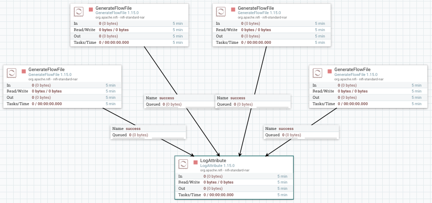

# Nifi Avanzado

## Grupos

En *Nifi* sólo hay un canvas de nivel superior, pero podemos construir tantos flujos lógicos como deseemos. Normalmente, para organizar las flujos, se utilizan **grupos de procesos**, por lo que el canvas de nivel superior puede tener varios grupos de procesos, cada uno de los cuales representa un flujo lógico, pero no necesariamente conectados entre sí.

<figure style="float: right;">
    
    <figcaption>Trabajando con grupos</figcaption>
</figure>

Dentro de los grupos, para indicar como entran los datos se utiliza un *Input port*, el cual va a definir un **puerto de entrada** al grupo. Del mismo modo, para indicar cómo salen los datos, se utiliza un *Output port* como **puerto de salida** para transferir la información fuera del grupo.

Así pues, los grupos de procesos nos van a permitir refactorizar nuestros flujos para agruparlos y poder reutilizarlos en otros flujos, o bien mejorar la legibilidad de nuestro flujo de datos.

En todo momento podemos ver el nivel en el que nos encontramos en la parte inferior izquierda, con una notación similar a `Nifi Flow >> Subnivel >> Otro Nivel`.

### Creando un grupo

Vamos a partir de un ejemplo sencillo de leer un fichero de texto, partirlo en fragmentos y nos saque por el log alguno de sus atributos.

Para ello, vamos a conectar un procesador *GetFile* con un *SplitText* y finalmente con *LogAttribute*.
El procesador *SplitText* nos permite dividir cualquier flujo de texto en fragmentos a partir del número de líneas que queramos (pudiendo tener encabezados, ignorar las líneas en blanco, etc...)

<figure style="align: center;">
    
    <figcaption>Dividimos un archivo en fragmentos</figcaption>
</figure>

Para probarlo, podemos copiar cualquier archivo (ya sea el `README` o el `NOTICE`) en la carpeta que hayamos indicado de entrada y comprobar el log.

Una vez lo tenemos funcionando, vamos a colocar el procesador *SplitText* dentro de un grupo. Así pues, un grupo encapsula la lógica de un procesador haciéndolo funcionar como una caja negra.

Para ello, desde la barra superior arrastramos el icono de *Process Group* y lo nombramos como *grupo*.

<figure style="align: center;">
    
    <figcaption>Creación de un grupo</figcaption>
</figure>

### Puertos

Una vez creado, vamos a copiar nuestro procesador *SplitText*. Pulsamos doble click sobre el grupo y bajaremos un nivel en el canvas para meternos dentro de *Grupo*. Una vez dentro, vamos a pegar el procesador y añadiremos tanto un *Input port* (al que nombramos como *entrada*) como un *Output port* (al que llamamos *salida*). Una vez creados, los conectamos con el procesador con las mismas conexiones que antes.

<figure style="align: center;">
    
    <figcaption>Grupo con puertos de entrada y salida</figcaption>
</figure>

Ahora salimos del grupo, y conectamos los procesadores del nivel superior con el grupo creado y comprobamos como sigue funcionando.

<figure style="align: center;">
    
    <figcaption>Sustituimos el procesador por el grupo creado</figcaption>
</figure>

## Funnels

<figure style="float: right;">
    
    <figcaption>Funnel</figcaption>
</figure>

Los *funnels* son un tipo de componente que permite trabajar en paralelo y después unir los diferentes flujos en un único flujo de ejecución, además de poder definir su propia prioridad de forma centralizada.

Para ello vamos a poner varios *GenerateFlowFile* (4 en este caso) para mostrar sus datos mediante *LogAttribute*.

<figure style="align: center;">
    
    <figcaption>Varios procesadores que apuntan a uno</figcaption>
</figure>

Si quisiéramos cambiar el procesador de *LogAttribute* por otro tipo de procesador, deberíamos borrar todas las conexiones y volver a conectarlo todo. Para evitar esto añadimos un *Funnel* que va a centralizar todas las conexiones en un único punto.

<figure style="align: center;">
    
    <figcaption>El Funnel agrupa las conexiones</figcaption>
</figure>

## Plantillas

Nifi permite trabajar con plantillas para poder reutilizar flujos de datos, así como importar y exportar nuestras plantillas.

### Creando plantillas

Crear una plantilla es muy sencillo. Si partimos del ejemplo anterior, mediante shift y el ratón, podemos seleccionar todos los elementos que queremos que formen parte de la plantilla.

Una vez seleccionado, podemos utilizar el botón derecho o dentro del menú *Operate*, y elegir *Create Template*:

<figure style="align: center;">
    
    <figcaption>Creación de una plantilla</figcaption>
</figure>

Si queremos descargar una plantilla para usarla en otra instalación, desde el menú de la esquina superior derecha, en la opción *Templates*, podemos consultar las plantillas que tenemos cargadas, y para cada una de ellas, tenemos la opción de descargarlas o eliminarlas.

<figure style="align: center;">
    
    <figcaption>Descargando una plantilla</figcaption>
</figure>

### Cargando plantillas

En cambio, para cargar una plantilla, desde el propio menú de *Operate*, el icono con la plantilla y la flecha hacia arriba, nos permitirá elegir un archivo `.xml` con el código de la plantilla.

Una vez cargada, usaremos el control del menu superior para arrastrarla al área de trabajo.

Una de las mayores ventajas es el uso de plantillas ya existentes. Existe una colección de plantillas mantenida por *Cloudera* en <https://github.com/hortonworks-gallery/nifi-templates>. Se recomienda darle un ojo a la [hoja de cálculo](https://github.com/hortonworks-gallery/nifi-templates/blob/master/NiFi%20Templates.xlsx) que contiene un resumen de las plantillas compartidas.

Otros ejemplos a destacar se encuentran en <https://github.com/xmlking/nifi-examples>.

En nuestro caso, vamos a utilizar la plantilla de *CSV-to-JSON*, la cual podemos descargar desde <https://raw.githubusercontent.com/hortonworks-gallery/nifi-templates/master/templates/csv-to-json-flow.xml>.

Una vez descargado el archivo xml, lo subimos a Nifi. Tras ello, arrastramos el componente y vemos su resultado:

<figure style="align: center;">
    
    <figcaption>Cargando una plantilla</figcaption>
</figure>

## Caso 5: Trabajando con conjuntos de registros

En los casos anteriores, ya hemos visto que haciendo uso de *ExtractText* y *AttributesToJSON* podíamos crear ficheros JSON a partir de CSV.

Nifi ofrece una forma más cómoda de realizar esto. Haciendo uso de los FF como registros y los procesadores de tipo *Record* (ya utilizamos alguno en el caso 3, en el que filtrábamos mediante una sentencia SQL), vamos a poder trabajar con los datos como un conjunto de registros en vez de hacerlo de forma individual.

Estos procesadores hacen que los flujos de construcción para manejar datos sean más sencillos, ya que que podemos construir procesadores que acepten cualquier formato de datos sin tener que preocuparnos por el análisis y la lógica de serialización. Otra gran ventaja de este enfoque es que podemos mantener los FF más grandes, cada uno de los cuales consta de múltiples registros, lo que resulta en un mejor rendimiento.

Tenemos tres componentes a destacar:

* De lectura: `AvroReader`, `CsvReader`, `ParquetReader`, `JsonPathReader`, `JsonTreeReader`, `ScriptedReader`, ...
* De escritura: `AvroRecordSetWriter`, `CsvRecordSetWriter`, `JsonRecordSetWriter`, `FreeFormTextRecordSetWriter`, `ScriptedRecordSetWriter`, ...
* Procesador de registros:
    * `ConvertRecord`: convierte entre formatos y/o esquemas similares. Por ejemplo, la conversión de CSV a Avro se puede realizar configurando `ConvertRecord` con un `CsvReader` y un `AvroRecordSetWriter`. Además, la conversión de esquemas entre esquemas similares se puede realizar cuando el esquema de escritura es un subconjunto de los campos del esquema de lectura o si el esquema de escritura tiene campos adicionales con valores propuestos.
    * `LookupRecord`: extrae uno o más campos de un registro y busca un valor para esos campos en un `LookupService` (ya sea a un fichero CSV, XML, accediendo a una base de datos o un servicio REST, etc...). Estos servicios funcionan como un mapa, de manera que reciben la clave y el servicio devuelve el valor. Puedes consultar más información en la serie de artículos [Data flow enrichment with NiFi part: LookupRecord processor](https://community.cloudera.com/t5/Community-Articles/Data-flow-enrichment-with-NiFi-part-1-LookupRecord-processor/ta-p/246940) y un ejemplo completo en [Enriching Records with LookupRecord & REST APIs in NiFi](https://alasdairb.com/2021/05/16/enriching-records-with-lookuprecord-rest-apis-in-nifi/).
    * `QueryRecord`: ejecuta una declaración SQL contra los registros y escribe los resultados en el contenido del archivo de flujo. Este es el procesador que usamos en el [caso 3 de la sesión anterior](04nifi1.md#caso-3---filtrado-de-datos).
    * `ConsumeKafkaRecord_N_M`: utiliza el *Reader* de registros configurado para deserializar los datos sin procesar recuperados de Kafka, y luego utiliza el *Writer* de registros configurado para serializar los registros al contenido del archivo de flujo.
    * `PublicarKafkaRecord_N_M`: utiliza el *Reader* de registros configurado para leer el archivo de flujo entrante como registros, y luego utiliza el *Writer* de registros configurado para serializar cada registro para publicarlo en Kafka.

### Convirtiendo formatos

Así pues, para demostrar su uso vamos a convertir el archivo CSV del [caso 3 de la sesión anterior](04nifi1.md#caso-3---filtrado-de-datos) que contiene información sobre [ventas](resources/pdi_sales_small.csv) a formato JSON.

Podríamos utilizar simplemente un *GetFile* conectado a un *ConvertRecord* y este a un *PutFile*. Para que el fichero generado contenga como extensión el formato al que convertimos, antes de serializar los datos, añadimos un procesador *UpdateAttribute* para modificar el nombre del fichero.

El flujo de datos resultante será similar a:

<figure style="align: center;">
    
    <figcaption>Conversión de formato mediante ConvertRecord</figcaption>
</figure>

En concreto, en el caso del *ConvertRecord*, hemos utilizado los siguientes elementos:

<figure style="align: center;">
    
    <figcaption>Configuración de ConvertRecord</figcaption>
</figure>

Para el *CSVReader*, hemos de configurar el separador de campos con el `;` e indicar que la primera fila contiene un encabezado. Para el *JSONRecordSetWriter* no hemos configurado nada.

### Renombrando el destino

Tal como hemos comentado, necesitamos renombrar el fichero de salida. Para ello, necesitamos hacer uso del procesador *UpdateAttribute* y utilizar el [Nifi Expression Language](https://nifi.apache.org/docs/nifi-docs/html/expression-language-guide.html) para modificar la propiedad `filename` y recortar la extensión y concatenar con la nueva mediante la expresión `${filename:substringBefore('.csv')}.json`:

<figure style="align: center;">
    
    <figcaption>Modificando la extensión de filename</figcaption>
</figure>

## Caso 6: Trabajando con Elasticsearch

En bloques anteriores ya hemos trabajado con *Elasticsearch*. En nuestro caso, tenemos la versión 7.16 descargada en la carpeta `/opt/elasticsearch-7.16.0` de nuestra máquina virtual.

!!! tip "Elasticsearch+Nifi via Docker"
    Si queremos utilizarlo mediante *Docker*, necesitamos que *ElasticSearch* y *Nifi* estén dentro del mismo contenedor. Para ello, podemos configurarlo mediante el siguiente archivo [docker-compose.yml](resources/nifi-elastic/docker-compose.yml):

    ``` yaml title="docker-compose.yml"
    services:
        nifi:
            ports:
                - "8443:8443"
            image: apache/nifi:latest
            environment:
                SINGLE_USER_CREDENTIALS_USERNAME: nifi
                SINGLE_USER_CREDENTIALS_PASSWORD: nifinifinifi
            links:
                - elasticsearch
        elasticsearch:
            ports:
                - "9200:9200"
                - "9300:9300"
            environment:
                discovery.type: single-node
            image: docker.elastic.co/elasticsearch/elasticsearch:7.15.2
    ```

    Una vez creado el archivo, construimos el contenedor mediante:

    ``` bash
    docker-compose -p nifielasticsearch up -d
    ```

Recordad que necesitamos arrancarla mediante el comando `./bin/elasticsearch`. Para comprobar que ha ido todo bien, podemos ejecutar la siguiente petición:

``` bash
curl -X GET 'localhost:9200/_cat/health?v=true&pretty'
```

El procesador con el que vamos a trabajar es del tipo *PutElasticSearchHttp*, en el cual vamos a configurar:

* *Elasticsearch URL*: `http://localhost:9200` (en el caso de usar *Docker*, deberás cambiar `localhost` por el nombre del servicio: `http://elasticsearch:9200`)
* *Index*: aquí vamos a poner como valor la palabra `peliculas`.
* marcamos la opción de autoterminar para las conexiones *retry* y *failure*.

Una vez creado el procesador, vamos a alimentarlo a partir de los datos de un fichero JSON, mediante el procesador que ya conocemos *GetFile*. Podéis descargar el fichero de pruebas [movies.json](resources/movies.json) y colocarlo en la carpeta donde hayamos configurado.

<figure style="align: center;">
    
    <figcaption>Lectura de JSON e inserción en Elasticsearch</figcaption>
</figure>

Una vez ejecutado, para comprobar que se han introducido los datos podemos ejecutar la siguiente petición:

``` bash
curl -X  GET "localhost:9200/peliculas/_search?pretty"
```

Y veremos cómo se han introducido en *Elasticsearch*:

``` json
{
"took": 46,
"timed_out": false,
"_shards": {
    "total": 1,
    "successful": 1,
    "skipped": 0,
    "failed": 0
},
"hits": {
    "total": {
        "value": 1,
        "relation": "eq"
    },
    "max_score": 1,
    "hits": [
        {
            "_index": "peliculas",
            "_type": "_doc",
            "_id": "FTUyU30BBEE3YF7Zlgn1",
            "_score": 1,
            "_source": {
                "movies": [
                    {
                        "title": "The Shawshank Redemption",
                        "rank": "1",
                        "id": "tt0111161"
                    },
```

Si nos fijamos bien, realmente solo ha insertado un documento que contiene un array de películas, lo cual no está bien.

### Separando los datos

Así pues, previamente debemos separar el array contenido dentro de `movies.json` en documentos individuales.

!!! warning "Borrar el índice"
    Recuerda que antes de meter nuevos datos, necesitamos eliminar el índice de ElasticSearch mediante `curl -X DELETE "localhost:9200/peliculas"`.

Para dividir el documento de películas en documentos individuales, necesitamos utilizar el procesador *SplitJSON*. Lo conectamos entre los dos procesadores anteriores, y le indicamos en la propiedad *JSonPath Expression* la expresión donde se encuentran las películas: `$.movies.*`

<figure style="align: center;">
    
    <figcaption>Separamos las películas</figcaption>
</figure>

Y ahora si volvemos a consultar el índice mediante `curl -X  GET "localhost:9200/peliculas/_search?pretty"`, sí que veremos que ha insertado las cien películas por separado:

``` json
{
  "took" : 5,
  "timed_out" : false,
  "_shards" : {
    "total" : 1,
    "successful" : 1,
    "skipped" : 0,
    "failed" : 0
  },
  "hits" : {
    "total" : {
      "value" : 100,
      "relation" : "eq"
    },
    "max_score" : 1.0,
    "hits" : [
      {
        "_index" : "peliculas",
        "_type" : "_doc",
        "_id" : "X-uaWH0BesFhA-H6MMxA",
        "_score" : 1.0,
        "_source" : {
          "title" : "The Shawshank Redemption",
          "rank" : "1",
          "id" : "tt0111161"
        }
      },
      {
        "_index" : "peliculas",
        "_type" : "_doc",
        "_id" : "YOuaWH0BesFhA-H6MMxC",
        "_score" : 1.0,
        "_source" : {
          "title" : "The Godfather",
          "rank" : "2",
          "id" : "tt0068646"
        }
      },
```

## Caso 7: de Twitter a Elasticsearch/MongoDB

Para este caso de uso, vamos a recoger datos de *Twitter* y los vamos a meter tanto en *MongoDB* como en *ElasticSearch* a la vez.

El primer paso es obtener unas credenciales de desarrollador por parte de *Twitter* para poder acceder a su API.
Para ello, en <https://developer.twitter.com/> creamos una cuenta de desarrollador y creamos un proyecto.

<figure style="align: center;">
    
    <figcaption>Claves necesarias para conectar con Twitter</figcaption>
</figure>

!!! tip "Nifi+Elasticsearch+MongDB via Docker"
    Si queremos realizar este caso de uso mediante Docker, necesitamos que ElasticSearch, MongoDB y Nifi estén dentro del mismo contenedor. Para ello, podemos configurarlo mediante el siguiente archivo [docker-compose.yml](resources/nifi-elastic-mongodb/docker-compose.yml):

    ``` yaml title="docker-compose.yml"
    services:
        nifi:
            ports:
                - "8443:8443"
            image: apache/nifi:latest
            environment:
                SINGLE_USER_CREDENTIALS_USERNAME: nifi
                SINGLE_USER_CREDENTIALS_PASSWORD: nifinifinifi
                NIFI_JVM_HEAP_MAX: 2g
            links:
                - elasticsearch
                - mongodb
        elasticsearch:
            ports:
                - "9200:9200"
                - "9300:9300"
            environment:
                discovery.type: single-node
                image: docker.elastic.co/elasticsearch/elasticsearch:7.15.2
        mongodb:
            ports:
                - "27017:27017"
            image: mongo:latest
    ```

    Una vez creado el archivo, construimos el contenedor mediante:

    ``` bash
    docker-compose -p nifielasticsearchmongodb up -d
    ```

### Leyendo tweets

Vamos a recuperar cada 100 segundos los mensajes que contengan la palabra **bigdata**.

!!! warning "Procesador GetTwitter - Twitter Elevated"
    Para poder utilizar el procesador de Nifi *GetTwitter* es necesario acceder al *Twitter API v1.1*, la cual solo está disponible para las cuentas con un nivel *Elevated*. Por ello, en vez de utilizar las credenciales habituales (API Key, API Key Secret, Access Token y Access Token Secret), vamos a realizar el acceso mediante una petición HTTP utilizando un token de validación, conocido como *Bearer Token* (lo cual es una mejor práctica de seguridad).

Para ello, usamos un procesador *InvokeHTTP* y configuramos los siguientes parámetros:

* En la planificación, vamos a configurar que se realice una petición cada 100 segundos, configurando *Run Schedule* a `100s`.
* *HTTP Method*: `GET`
* *Remote UR*L: `https://api.twitter.com/2/tweets/search/recent?query=bigdata&tweet.fields=created_at,lang,public_metrics`
    * Mediante el parámetro `query` indicamos el término a buscar. En nuestro caso, buscamos la palabra `bigdata`.
    * Mediante el parámetro `tweet.field` indicamos los campos a recuperar (por defecto recupera el id y el texto de cada *tweet*)
        * Puedes comprobar todos los campos que podemos obtener de los mensajes en <https://developer.twitter.com/en/docs/twitter-api/data-dictionary/object-model/tweet>
* Añadimos una propiedad (mediante el icono del signo `+`) que nombramos como *Authorization* y le asignamos la palabra *Bearer* y el token que copiamos desde la administración de Twitter: `Bearer AAAAAAAAAAAAAAAAAAAAAIGNWAEAAAAA...`

<figure style="align: center;">
    
    <figcaption>Caso 7: Comprobando la lectura de mensajes de Twitter</figcaption>
</figure>

Tras realizar una petición, obtendremos un FF similar a la siguiente información (he dejado sólo dos mensajes para facilitar la visualización):

``` json
{
   "data":[
      {
         "id":"1468197767885561856",
         "text":"RT @CatherineAdenle: Machine Learning Algorithms in Python You Must Learn \n#DataScience #MachineLearning\n#BigData #Analytics #AI #Tech #Alg…",
         "created_at":"2021-12-07T12:36:40.000Z",
         "public_metrics":{
            "retweet_count":22,
            "reply_count":0,
            "like_count":0,
            "quote_count":0
         },
         "lang":"en"
      },
      ...
      {
         "id":"1468197570925277190",
         "text":"RT @gp_pulipaka: A Quick Intro to Deep Learning Course! #BigData #Analytics #DataScience #AI #MachineLearning #IoT #IIoT #Python #RStats #T…",
         "created_at":"2021-12-07T12:35:53.000Z",
         "public_metrics":{
            "retweet_count":60,
            "reply_count":0,
            "like_count":0,
            "quote_count":0
         },
         "lang":"en"
      }
   ],
   "meta":{
      "newest_id":"1468197767885561856",
      "oldest_id":"1468197570925277190",
      "result_count":10,
      "next_token":"b26v89c19zqg8o3fpdy8xh0ikrj9fhq1nywqt95oqkxh9"
   }
}
```

A continuación, vamos a separar los mensajes en diferentes FF del mismo modo que acabamos de hacer en el ejercicio anterior. Así pues, añadimos el procesador *SplitJson* y configuramos la división de los mensajes mediante expresión con `$.data.*`.

### Evaluando el idioma

Con esta información, hemos decidido enviar todos los mensajes que vengan en inglés (`"lang": "en"`) a *ElasticSearch*, y los que vengan en castellano a MongoDB.

Mediante el procesador *EvaluateJsonPath*, vamos a colocar en atributos la siguiente información que queremos almacenar, definiendo la propiedad *Destination* como `flow-attribute`:

Para ello creamos los siguientes atributos con la expresión para acceder al campo JSON asociado:

* twitter.id: `$.id`
* twitter.text: `$.text`
* twitter.lang: `$.lang`
* twitter.created_at: `$.created_at`
* twitter.rt: `$.public_metrics.retweet_count`
* twitter.likes: `$.public_metrics.like_count`

<figure style="align: center;">
    
    <figcaption>Caso 7: Creamos atributos con información de los tweets</figcaption>
</figure>

A continuación, conectamos con el procesador *RouteOnAttribute*.

<figure style="align: center;">
    
    <figcaption>Caso 7: Conexiones para enrutar según el idioma</figcaption>
</figure>

Dentro del procesador *RouteOnAttribute*, creamos dos propiedas para enrutar los FF según el valor del atributo *twitter.lang*:

* *lang-en*: `${twitter.lang:equals("en")}`
* *lang-es*: `${twitter.lang:equals("es")}`

<figure style="align: center;">
    
    <figcaption>Caso 7: Enrutamos según el atributo twitter.lang</figcaption>
</figure>

### Guardando mensajes en inglés en ElasticSearch

Tal como acabamos de hacer, sólo tenemos que añadir el procesador *PutElasticsearchHttp* y configurar las siguientes propiedades:

* *Elasticsearch URL*: `http://localhost:9200` (en el caso de usar *Docker*, deberás cambiar `localhost` por el nombre del servicio: `http://elasticsearch:9200`)
* *Index*: aquí vamos a poner como valor la palabra `tweets`.
* marcamos la opción de autoterminar para las conexiones *retry* y *failure*.

A continuación, lo conectamos mediante la conexión `lang-en` que sale del procesador anterior.

Para comprobar que los datos se están insertando correctamente, podemos hacer una petición a:

``` bash
curl -X  GET "localhost:9200/tweets/_search?pretty"
```

### Guardando mensajes en castellano en MongoDB

De forma similar, agregamos el procesador *PutMongo* y configuramos las siguientes propiedades:

* Mongo URI: `mongodb://localhost` (en el caso de usar *Docker*, deberás cambiar `localhost` por el nombre del servicio: `mongodb://mongodb`)
* Mongo Database Name: `iabd`
* Mongo Collection Name: `tweets`

Tras ello, lo conectamos mediante la conexión `lang-es` (y si queremos, también podemos añadir la conexión `unmatched` de manera que almacenerá los también los mensajes que no estén ni en inglés ni en español. Cuando Twitter no reconoce el lenguaje del mensaje, le asigna como lenguaje *undetermined* mediante el código `und`).

Para comprobar que los datos se están insertando correctamente, una vez conectados a `mongo`, podemos realizar la siguiente consulta:

``` javascript
use iabd;
db.tweets.find();
```

Así pues, el flujo de datos queda tal que así:

<figure style="align: center;">
    
    <figcaption>Caso 7: Flujo de datos con ElasticSearch y MongoDB</figcaption>
</figure>

!!! question "Renombrando id"
    Si queremos que *MongoDB* utilice el id del tweet como la clave de los documentos en *MongoDB* y así asegurar que no tenemos mensajes repetidos, debemos renombrar el campo a `_id`. Para ello, podemos utilizar el procesador *UpdateAttribute* para renombrar `twitter.id` a `_id` y luego el procesador *AttritubesToJSON* para generar la información a almacenar.

!!! info "REST API"
    Nifi ofrece un API REST con el cual podemos interactuar de forma similar al interfaz gráfico.
    Teniendo Nifi arrancado, prueba con las siguientes URL: <https://localhost:8443/nifi-api/access> y <https://localhost:8443/nifi-api/flow/about>.  
    Más información en <https://nifi.apache.org/docs/nifi-docs/rest-api/index.html>

## Actividades

1. Realiza los casos de uso del 5 al 7. En la entrega debes adjuntar una captura de pantalla donde se vea el flujo de datos completo con una nota con tu nombre, y adjuntar la plantilla de cada flujo.

2. (opcional) Modifica el caso 7 para que los tweets que no están ni en castellano ni en inglés se inserten en una base de datos *MySQL*/*MariaDB*.

    Para ello, debes recoger la información de los atributos que hemos separado y generar un nuevo JSON con los datos que quieres almacenar (*id*, *text*, *created_at*, *rt* y *likes*) mediante el procesador *AttributestoJSON*. Una vez tengas el JSON, utiliza los procesadores *ConvertJSONToSQL* y *ExecuteSQL* para insertar los datos. Antes deberás crear la tabla en la base de datos. Tienes un ejemplo parecido en el artículo [Using Apache Nifi to Load Tweets from Twitter API to MemSQL](https://medium.com/@moha.ajori/using-apache-nifi-to-load-tweets-from-twitter-api-to-memsql-19e19a3be20e).

    Adjunta capturas de pantalla de la configuración de los procesadores que has añadido, así como de una consulta sobre la base de datos donde aparezcan mensajes insertados y la plantilla del caso de uso completo.

<!--
https://github.com/addmeaning/nifi-exercises
-->

## Referencias

* [Apache Nifi User Guide](https://nifi.apache.org/docs/nifi-docs/html/user-guide.html)
* [Apache Nifi in Depth](https://nifi.apache.org/docs/nifi-docs/html/nifi-in-depth.html)
* [Apache Nifi en TutorialsPoint](https://www.tutorialspoint.com/apache_nifi/index.htm)
* Libro [Data Engineering with Python](https://www.packtpub.com/free-ebook/data-engineering-with-python/9781839214189)
* Artículo de Futurespace: [Flujo de extracción, validación, transformación y carga de ficheros (Caso de uso real)](https://www.futurespace.es/apache-nifi-flujo-de-extraccion-validacion-transformacion-y-carga-de-ficheros-caso-de-uso-real/)

<!--
https://courses.cs.ut.ee/2021/cloud/spring/Main/Practice10
https://courses.cs.ut.ee/2021/cloud/spring/Main/Practice11
https://www.theninjacto.xyz/tags/apache-nifi/
https://github.com/tjaensch/nifi_docker_elasticsearch_demo
-->
