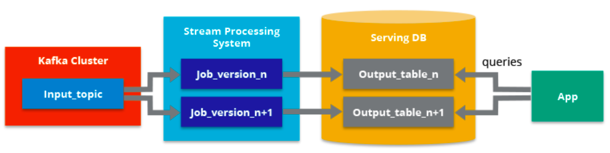

# Arquitecturas Big Data

Ya sabemos en qué consiste Big Data, y que dentro de sus 5V, dos de las más importantes son el *volumen* y la *velocidad*. Para cumplir con estas necesidades, necesitamos una infraestructura que dote a nuestras aplicaciones de toda la potencia y robustez necesarias.

Una arquitectura de big data se diseña para manejar la ingestión, el procesamiento y el análisis de los datos que son demasiado grandes o complejos para un sistema tradicional de base de datos.

En esta sesión no vamos a profundizar en ninguna tecnología concreta, ya que el stack de herramientas es muy amplio y en constante crecimiento. A lo largo del curso iremos conociendo las distintas herramientas y aprenderemos cómo y cuándo utilizarlas.

## Características

Todas las arquitecturas que diseñemos / utilicemos deben cumplir las siguientes características:

* *Escalabilidad*: permite aumentar fácilmente las capacidades de procesamiento y almacenamiento de datos.
* *Tolerancia a fallos*: garantiza la disponibilidad del sistema, aunque se produzcan fallos en algunas de las máquinas, evitando la pérdida de datos.
* *Datos distribuidos*: los datos deben estar almacenados entre diferentes máquinas evitando así el problema de almacenar grandes volúmenes de datos en un único nodo central (*SPOF*).
* *Procesamiento distribuido*: el tratamiento de los datos se realiza entre diferentes máquinas para mejorar los tiempos de ejecución y dotar al sistema de escalabilidad.
* *Localidad del dato*: los datos a trabajar y los procesos que los tratan deben estar cerca, para evitar las transmisiones por red que añaden latencias y aumentan los tiempos de ejecución.

Antes de conocer las arquitecturas más empleadas, es conveniente tener presente siempre cuál es el objetivo que debe cumplir nuestra solución. Es muy fácil caer en la sobreingeniería y montar una arquitectura con una amalgama de productos que luego son difíciles de configurar y mantener.

## Tipos de arquitecturas

Debido a que las empresas disponen de un volumen de datos cada vez mayor y la necesidad de analizarlos y obtener valor de ellos lo antes posible, surge la necesidad de definir nuevas arquitecturas para cubrir casos de uso distintos a los que había hasta el momento.

Las arquitecturas más comunes en estos proyectos son principalmente dos: *Lambda* y *Kappa*. La principal diferencia entre ambas son los flujos de tratamiento de datos que intervienen.

Un par de conceptos que tenemos que definir antes de ver las características de ambas son el procesamiento *batch* y el procesamiento en *streaming*.

### Procesamiento Batch

*Batch* hace referencia a un proceso en el que intervienen un conjunto de datos y que tiene un inicio y un fin en el tiempo. También se le conoce como procesamiento por lotes y se ejecuta sin control directo del usuario.

Por ejemplo, si tenemos un conjunto de datos muy grande con múltiples relaciones, puede llevarnos del orden de horas ejecutar las consultas que necesita el cliente, y por tanto, no se pueden ejecutar en tiempo real y necesitan de algoritmos paralelos (como por ejemplo, *Map Reduce*). En estos casos, los resultados se almacenan en un lugar diferente al de origen para posteriores consultas.

Otro ejemplo, si tenemos una aplicación que muestra el total de casos COVID que hay en cada ciudad, en vez de realizar el cálculo sobre el conjunto completo de los datos, podemos realizar una serie de operaciones que hagan esos cálculos y los almacenen en tablas temporales (por ejemplo, mediante `INSERT ... SELECT`), de manera que si queremos volver a realizar la consulta sobre todos los datos, accederíamos a los datos ya calculados de la tabla temporal. El problema es que este cálculo necesita actualizarse, por ejemplo, de manera diaria, y de ahí que haya que rehacer todas las tablas temporales.

Es el procesamiento que se ha realizado desde los inicios del trabajo con datos, tanto a nivel de bases de datos como con *Data Warehouses*.

De la mano del procesamiento *batch* se ha implantado el ecosistema *Hadoop* con todas las herramientas que abarcan un proceso ETL (extracción, transformación y carga de los datos). Estos conceptos los trabajaremos más adelante.

### Procesamiento en Streaming

Un procesamiento es de tipo *streaming* cuando está continuamente recibiendo y tratando nueva información según va llegando sin tener un fin en lo referente al apartado temporal.

Este procesamiento se relaciona con el análisis en tiempo real. Para ello, se utilizan diferentes sistemas basados en el uso de colas de mensajes.

!!! warning "No todo es tiempo real"
    No confundir tiempo real con inmediatez.
    En informática, un sistema de tiempo real es aquel que responde en un periodo de tiempo finito, normalmente muy pequeño, pero no tiene por qué ser instantáneo.

## Arquitectura Lambda

Representada mediante la letra griega, apareció en el año 2012 y se atribuye a [*Nathan Marz*](http://nathanmarz.com/).

!!! note "Nathan Marz"
    La definió en base a su experiencia en sistemas de tratamiento de datos distribuidos durante su etapa como empleado en las empresas *Backtype* y *Twitter*, y está inspirada en su artículo [*How to beat the CAP theorem*](http://nathanmarz.com/blog/how-to-beat-the-cap-theorem.html).

Su objetivo era montar un sistema robusto y tolerante a fallos, tanto humanos como de hardware, que fuera linealmente escalable y que permitiese realizar escrituras y lecturas con baja latencia.

Todos los datos que llegan al sistema van a ir por dos caminos, uno el lento (capa *batch*) y otro el rápido (capa *streaming*), que finalmente confluyen en la capa de consultas. Así pues, se compone de tres capas:

* Capa **batch**: se encarga de gestionar los datos históricos y recalcular los resultados. De manera específica, la capa *batch* recibe todos los datos en crudo, los almacena de forma inmutable y los combina con el histórico existente (se añaden a los datos existente y los datos previos nunca se sobreescriben) y recalcula los resultados iterando sobre todo el conjunto de datos combinado. Cualquier cambio en un dato se almacena como un nuevo registro, no modifica nada, para así poder seguir el ^^linaje de los datos^^.

    !!! info inline end "Linaje de los datos"
        Indica las transformaciones que ha sufrido un dato, desde el origen hasta el estado actual, incluyendo las combinaciones con otros datos o el cambio del dato en sí a lo largo de su ciclo de vida.

    Así pues, este capa opera sobre el conjunto completo y permite que el sistema produzca los resultados más precisos. Sin embargo, esto conlleva un coste de alta latencia debido a los requisitos de tiempo de computación.

* Capa de **streaming** / *speed*: sirve para ofrecer resultados con muy baja latencia, cercano al tiempo real. Este capa recibe los datos y realiza modificaciones incrementales sobre los resultados de la capa *batch*. Gracias a los algoritmos incrementales implementados en esta capa, se consigue reducir el coste computacional de manera considerable, a coste de perder algo de precisión.
* Capa de **serving**: permite la consulta de los resultados enviados desde las dos capas anteriores, en base a las vistas *batch* que rellenan las capas anteriores.

Podemos ver un esquema de la arquitectura en el siguiente gráfico:

<figure style="align: center;">
    
    <figcaption>Arquitectura Lambda</figcaption>
</figure>

Los datos que fluyen por la capa de velocidad/*streaming* tienen la restricción de latencia que impone la propia capa para poder procesar los datos todo lo rápido que sea posible. Normalmente, este requisito choca con la precisión de los datos. Por ejemplo, en un escenario IoT donde se leen un gran número de sensores de temperatura que envían datos de telemetría, la capa de velocidad se puede utilizar para procesar una ventana temporal de los datos que entran (por ejemplo, los diez primeros segundos de cada minuto).

Los datos que fluyen por el camino lento, no están sujeto a los mismos requisitos de latencia, lo que permite una mayor precisión computacional sobre grandes conjuntos de datos, que pueden conllevar mucho tiempo de procesamiento.

Finalmente, ambos caminos, el lento y el rápido, convergen en las aplicaciones analíticas del cliente. Si el cliente necesita información constante (cercana al tiempo real) aunque menos precisa, obtendrá los datos del camino rápido. Si no, lo hará a partir de los datos de la capa *batch*.

Dicho de otro modo, el camino rápido tiene los datos de una pequeña ventana temporal, la cual se puede actualizar con datos más precisos provenientes de la capa *batch*.

### Paso a paso

<figure style="align: center;">
    
    <figcaption>Arquitectura Lambda</figcaption>
</figure>

El flujo de trabajo es el siguiente:

1. La nueva información recogida por el sistema se envía tanto a la capa *batch* como a la capa de *streaming* (*Speed Layer* en la imagen anterior).
2. En la capa *batch* (*Batch Layer*) se gestiona la información en crudo, es decir, sin modificar. Los datos nuevos se añaden a los ya existentes. Seguidamente se hace un tratamiento mediante un proceso *batch* cuyo resultado serán las *Batch Views*, que se usarán en la capa que sirve los datos para ofrecer la información ya transformada al exterior.
3. La capa que sirve los datos (*Serving Layer*) indexa las *Batch Views* generadas en el paso anterior de forma que puedan ser consultadas con tiempos de respuesta muy bajos.
4. La capa de *streaming* compensa la alta latencia de las escrituras que ocurre en la *serving layer* y solo tiene en cuenta los datos nuevos (incrementos entre los procesos batch y el momento actual).
5. Finalmente, combinando los resultados de las *Batch Views* y de las vistas en tiempo real (*Real-time Views*), se construye la respuesta a las consultas realizadas.

## Arquitectura Kappa

El término ^^Arquitectura Kappa^^ fue introducido en 2014 por [*Jay Kreps*](https://blog.empathybox.com/) en su artículo [Questioning the Lambda Architecture](https://www.oreilly.com/radar/questioning-the-lambda-architecture/). En él señala los posibles puntos débiles de la arquitectura *Lambda* y cómo solucionarlos mediante una evolución.

Uno de los mayores inconveniente de la arquitectura *Lambda* es su complejidad. El procesamiento de los datos se realiza en dos caminos diferenciados, lo que conlleva duplicar la lógica de computación y la gestión de la arquitectura de ambos caminos.

Lo que señala *Jay Kreps* en su propuesta es que todos los datos fluyan por un único camino, eliminando la capa *batch* y dejando solamente la capa de *streaming*. Esta capa, a diferencia de la de tipo *batch*, no tiene un comienzo ni un fin desde un punto de vista temporal y está continuamente procesando nuevos datos a medida que van llegando.

Para conseguir un único camino, se sustituyen las fuentes de datos por colas de mensajes (por ejemplo, mediante una herramienta como Apache Kafka), obteniendo flujos de datos que facilitan el acceso en tiempo real, leyendo y transformando los datos de los mensajes en un formato que sea fácilmente accesible a los usuarios finales. 

<figure style="align: center;">
    
    <figcaption>Arquitectura Kappa</figcaption>
</figure>

Podemos decir que sus cuatro pilares principales son los siguientes:

1. Todo es un *stream*: las operaciones *batch* son un subconjunto de las operaciones de *streaming*, por lo que todo puede ser tratado como un *stream*.
2. Los datos de partida no se modifican: los datos se almacenan sin ser transformados, por tanto son inmutables, y las vistas se derivan de ellos. Un estado concreto puede ser recalculado puesto que la información de origen no se modifica.
3. Solo existe un flujo de procesamiento: puesto que mantenemos un solo flujo, el código, el mantenimiento y la actualización del sistema se ven reducidos considerablemente.
4. Tenemos la posibilidad de volver a lanzar un procesamiento: se puede modificar un procesamiento concreto y su configuración para variar los resultados obtenidos partiendo de los mismos datos de entrada.

<figure style="align: center;">
    
    <figcaption>Arquitectura Kappa</figcaption>
</figure>

Como requisito previo a cumplir, se tiene que garantizar que los eventos se leen y almacenan en el orden en el que se han generado. De esta forma, podremos variar un procesamiento concreto partiendo de una misma versión de los datos.

## Arquitectura por capas

Además de las dos soluciones que acabamos de conocer, otra forma de diseñar las capas de una arquitectura Big Data consiste en separar las diferentes fases del dato en capa diferenciadas.

[La arquitectura por capas](https://docs.microsoft.com/en-us/azure/architecture/data-guide/big-data/) da soporte tanto al procesamiento *batch* como por *streaming*. La arquitectura consiste en 6 capas que aseguran un flujo seguro de los datos:

<figure style="align: center;">
    
    <figcaption>Arquitectura por capas (xenonstack.com)</figcaption>
</figure>

* Capa de ingestión: es la primera capa que recoge los datos que provienen de fuentes diversas. Los datos se categorizan y priorizan, facilitando el flujo de éstos en posteriores capas.
* Capa de colección: Centrada en el transporte de los datos desde la ingesta al resto del *pipeline* de datos. En esta capa los datos se deshacen para facilitar la analítica posterior.
* Capa de procesamiento: Esta es la capa principal. Se procesan los datos recogidos en las capas anteriores (ya sea mediante procesos *batch*, *streaming* o modelos híbridos), y se clasifican para decidir hacía qué capa se dirige.
* Capa de almacenamiento: Se centra en decidir donde almacenar de forma eficiente la enorme cantidad de datos. Normalmente en un almacén de archivos distribuido, que da pie al concepto de *data lake*.
* Capa de consulta: capa donde se realiza el procesado analítico, centrándose en obtener valor a partir de los datos.
* Capa de visualización: también conocida como capa de presentación, es con la que interactúan los usuarios.

## Tecnologías

Por ejemplo, la ingesta de datos hacia las arquitecturas *Lambda* y *Kappa* se pueden realizar mediante un sistema de mensajería de colas *publish/subscribe* como [Apache Kafka](https://kafka.apache.org) y/o un servicio de flujo de datos como [Apache Nifi](https://nifi.apache.org/).

El almacenamiento de los datos y modelos lo podemos realizar mediante *HDFS* o *S3*. Dentro de una arquitectura *Lambda*, en el sistema batch, mediante algoritmos *MapReduce de Hadoop* o consultas *Hive* podemos generar modelos. Para la capa de *streaming* (tanto para Lambda como Kappa) se pueden utilizar otras tecnologías como [*Apache Storm*](http://storm.apache.org), [*Apache Samza*](http://samza.apache.org) o [*Spark Streaming*](https://spark.apache.org/docs/latest/streaming-programming-guide.html) para modificar modelos de forma incremental.

De forma alternativa, [Apache Spark](https://spark.apache.org) se puede utilizar como plataforma común para desarrollar las capas *batch* y *streaming* de la arquitectura Lambda. De ahí su amplia aceptación y uso a día de hoy en la industria, se codifica una vez y se comparte en ambas capas

La capa de *serving* se puede implementar mediante una base de datos NoSQL como pueda ser [Apache HBase](https://hbase.apache.org), [MongoDB](https://www.mongodb.com), [Redis](https://redis.com) o [AWS Dynamo DB](https://aws.amazon.com/es/dynamodb/). También se pueden utilizar motores de consultas como [Apache Drill](https://drill.apache.org) o [Presto](https://prestodb.io/).

## Principio SCV

Mientras que el teorema CAP tiene que ver con almacenamiento de datos distribuidos, el [principio SCV](https://fulmanski.pl/tutorials/computer-science/big-data/processing-concepts-for-big-data/#scv_principle) está relacionado con el **procesamiento distribuido de los datos**.

Es decir, no tiene que ver con la escritura y lectura (consistente o no) de los datos en entornos distribuidos sino con el procesamiento que se realiza sobre ellos dentro de los nodos de un sistema de procesamiento distribuido.

De modo similar a lo que ocurría con el teorema CAP, el principio SCV establece que un sistema de procesamiento distribuido sólo puede soportar como máximo 2 de las siguientes 3 características:

* **Velocidad** (*Speed*): Se refiere a cuánto tardan en procesarse los datos desde el momento en el que son recibidos en el sistema analítico. Por lo general se excluye el tiempo que se tarda en capturar los datos, considerando sólo lo que se tarda en generar la estadística o ejecutar el algoritmo en cuestión.
Esta velocidad es más alta si estamos ante un sistema de analítica en tiempo real que si se trata de un sistema de analítica por lotes (del inglés batch).
* **Consistencia** (*Consistency*): Se refiere en este caso a la precisión de los resultados de la analítica (no confundir, por lo tanto, con el significado de la C del teorema CAP).
Tal precisión depende de si para la analítica se utilizan todos los datos disponibles (precisión alta) o de si por el contrario se emplean técnicas de muestreo para seleccionar sólo un subconjunto de los mismos con la intención de producir resultados (de menor precisión) en un menor tiempo.
* **Volumen** (*Volume*). Se refiere a la cantidad de datos que pueden ser procesados. Hay que tener en cuenta que en entornos de Big Data, el alto volumen de datos es una características siempre presente (una de las 5 Vs).

De igual modo que hicimos al estudiar el [teorema CAP](../sa/01nosql.md#teorema-de-cap), nos fijaremos en una serie de escenarios para mostrar que no podemos conseguir un sistema que cumpla a la vez las 3 características del principio SCV.

<figure style="float: right;">
    
    <figcaption>Principio SCV</figcaption>
</figure>

* Si se requiere velocidad (S) y consistencia (C), no podemos procesar un alto volumen (V) de datos ya que eso aumenta el tiempo de respuesta.
* Si se requiere consistencia (C) y poder procesar grandes volúmenes de datos (V), no es posible realizar tal procesado a una alta velocidad (S).
* Si necesitamos procesar un alto volumen de datos (V) a una alta velocidad (S), entonces necesitaremos emplear técnicas de muestreo para seleccionar sólo un subconjunto de esos datos, lo cual producirá un resultado no consistente (C).

<!--
Dado que en ambientes de Big Data el ser capaz de manejar grandes volúmenes de datos (V) es una obligación, ¿podremos típicamente realizar analítica en tiempo real con todos ellos?
    No, ya que para que sea en tiempo real debemos cumplir S, por lo que necesitaríamos realizar la analítica sobre un subconjunto de los datos, encontrándonos en el caso S+V, y produciendo por lo tanto un resultado no totalmente consistente (C).

Dado que en ambientes de Big Data el ser capaz de manejar grandes volúmenes de datos (V) es una obligación, ¿podremos típicamente realizar procesamiento por lotes empleando todo ese conjunto de datos?
    Sí, ya que al ser analítica por lotes en lugar de en tiempo real, la característica S ya no es necesaria, de modo que podemos encontrarnos en un caso C+V, utilizando todos los datos sin ningún tipo de muestreo para así producir un resultado consistente (C).
-->

## Casos de uso

¿Qué arquitectura se adapta mejor a los requerimientos que nos traslada el cliente? *¿Lambda* o *Kappa*? ¿Cuál encaja mejor en nuestro modelo de negocio?.

Depende. La arquitectura *Lambda* es más versátil y es capaz de cubrir un mayor número de casos, muchos de ellos que requieren incluso procesamiento en tiempo real.

Una pregunta que debemos plantearnos es, ¿el análisis y el procesamiento (sus algoritmos) que vamos a realizar en las capas *batch* y *streaming* es el mismo? En ese caso la opción más acertada sería la arquitectura *Kappa*.

Sin embargo, en otras ocasiones necesitaremos acceder a todo el conjunto de datos sin penalizar el rendimiento por lo que la *Lambda* puede ser más apropiada e incluso más fácil de implementar.

También nos inclinaremos hacia *Lambda* si nuestros algoritmos de *batch* y *streaming* generan resultados muy distintos, como puede suceder con operaciones de procesamiento pesado o en modelos de *Machine Learning*. En estos casos, los algoritmos *batch* se pueden optimizar ya que acceden al dataset histórico completo.

El decidir entre Lamba y Kappa al final es una decisión entre favorecer el rendimiento de ejecución de un proceso *batch* sobre la simplicidad de compartir código para ambas capas.

!!! info "Casos reales"
    Un ejemplo real de una arquitectura *Kappa* sería un sistema de geolocalización de usuarios por la cercanía a una antena de telefonía móvil. Cada vez que se aproximase a una antena que le diese cobertura se generaría un evento. Este evento se procesaría en la capa de *streaming* y serviría para pintar sobre un mapa su desplazamiento respecto a su posición anterior.

    Un caso de uso real para una arquitectura *Lambda* podría ser un sistema que recomiende películas en función de los gustos de los usuarios. Por un lado, tendría una capa batch encargada de entrenar el modelo e ir mejorando las predicciones; y por otro, una capa streaming capaz de encargarse de las valoraciones en tiempo real.

    Como lectura recomendable tenemos un par de casos desarrollados por *Ericsson* que podéis leer en <https://www.ericsson.com/en/blog/2015/11/data-processing-architectures--lambda-and-kappa-examples>

Es muy importante siempre tener en mente lo rápido que evolucionan los casos de uso que queremos cubrir y el mercado del Big Data, lo que implica la necesidad de adaptarse a ellos lo antes posible, modificando la arquitectura sobre la marcha.

## Buenas prácticas

* En la ingesta de datos: evaluar los tipos de fuentes de datos, no todas las herramientas sirven para cualquier fuente de datos, y en algún caso lo mejor es combinar varias herramientas para cubrir todo el abanico.
* En el procesamiento: analizar si el sistema debe ser *streaming* o *batch*. Algunos sistemas que no se definen como puramente *streaming*, es decir, utilizan lo que denominan *micro-batch* que suele dar respuesta a problemas que en el uso cotidiano del lenguaje se denomina como *streaming*.
* En la monitorización: al trabajar con multitud de herramientas es importante utilizar herramienta para controlar, monitorizar y gestionar la arquitectura.
* Algunas decisiones que debemos tomar a la hora de elegir la arquitectura son:
    * Enfocar los casos de uso. Cuando tengamos los objetivos claros sabremos qué parte debemos fortalecer en la arquitectura. ¿Volumen, variedad, velocidad?
    * Definir la arquitectura: *¿batch* o *streaming*? ¿Realmente es necesario que nuestra arquitectura soporte *streaming*?
    * Evaluar las fuentes de datos: ¿Cómo de heterogéneas son? ¿soportan las herramientas elegidas todos los tipos de fuentes de datos que se utilizan?

## Referencias

* [Big Data Lambda Architecture - Nathan Marz](http://www.databasetube.com/database/big-data-lambda-architecture/)
* [What Is Lambda Architecture?](https://hazelcast.com/glossary/lambda-architecture/)
* [Arquitectura Lambda vs Arquitectura Kappa](http://i2ds.org/wp-content/uploads/2020/03/arquitecturalambdavsarquitecturakappa.pdf)
* [Data processing architectures – Lambda and Kappa](https://www.ericsson.com/en/blog/2015/11/data-processing-architectures--lambda-and-kappa)
* [Big Data Architecture – Detailed Explanation](https://www.interviewbit.com/blog/big-data-architecture/)

## Actividades

1. (RA5075.1 / CE5.1a / 2p) Contesta a las siguientes preguntas justificando tus repuestas:
    1. En una arquitectura *Lambda*, ¿cómo consigue la capa de streaming mostrar la más información más rápida que la de batch? ¿A coste de que se consigue la velocidad?
    2. Indica las diferencias en cantidad de datos y tiempo entre el procesamiento *batch* y en *streaming*.
    3. Respecto al procesamiento *batch*/*streaming* ¿Por qué *Spark* es una de las herramientas más utilizadas a día de hoy?

*[RA5075.1]: Gestiona soluciones a problemas propuestos, utilizando sistemas de almacenamiento y herramientas asociadas al centro de datos
*[CE5.1a]: Se ha caracterizado el proceso de diseño y construcción de soluciones en sistemas de almacenamiento de datos.
*[CE5.1b]: Se han determinado los procedimientos y mecanismos para la ingestión de datos.
