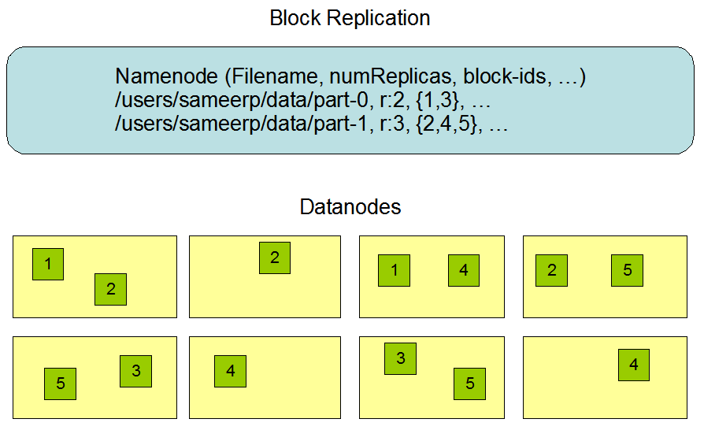
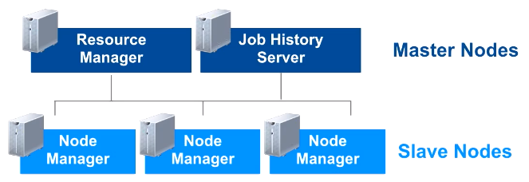
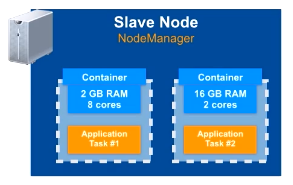
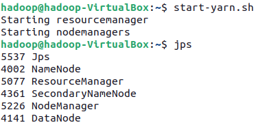
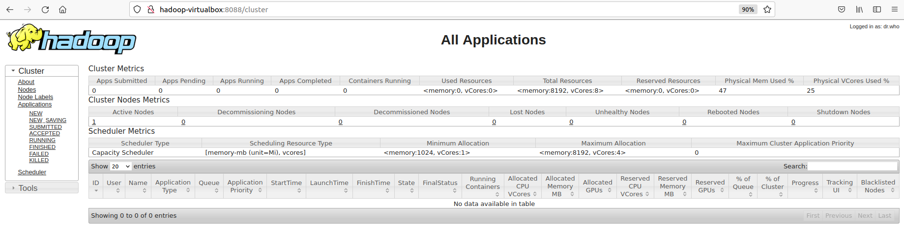
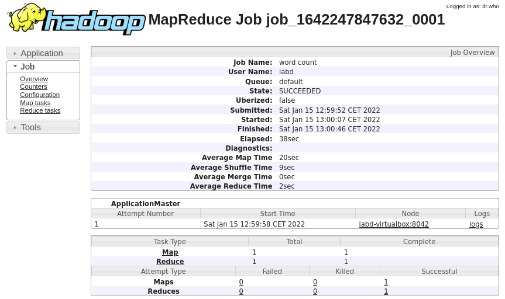
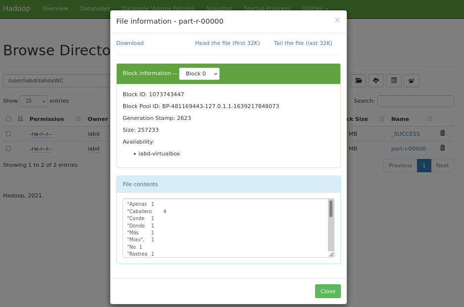

# Hadoop

<figure style="float: right;">
    
    <figcaption>Logo de Apache Hadoop</figcaption>
</figure>

Si *Big Data* es la filosofía de trabajo para grandes volúmenes de datos, *Apache Hadoop* (<http://hadoop.apache.org/>) es la tecnología catalizadora. *Hadoop* puede escalar hasta miles de ordenadores creando un clúster con un almacenamiento del orden de *petabytes* de información.

Más que un producto, es un proyecto *open source* que aglutina una serie de herramientas para el procesamiento distribuido de grandes conjuntos de datos a través de clústers de ordenadores utilizando modelos de programación sencillos.

Sus características son:

* Confiable: crea múltiples copias de los datos de manera automática y, en caso de fallo, vuelve a desplegar la lógica de procesamiento.
* Tolerante a fallos: tras detectar un fallo aplica una recuperación automática. Cuando un componente se recupera, vuelve a formar parte del clúster. En *Hadoop* los fallos de hardware se tratan como una regla, no como una excepción.
* Escalable: los datos y su procesamiento se distribuyen sobre un clúster de ordenadores (escalado horizontal), desde un único servidor a miles de máquinas, cada uno ofreciendo computación y almacenamiento local.
* Portable: se puede instalar en todo tipos de *hardware* y sistemas operativos.

Hadoop está diseñado para ejecutar sistemas de procesamiento en el mismo clúster que almacena los datos (*data local computing*). La filosofía de Hadoop es almacenar todos los datos en un lugar y procesar los datos en el mismo lugar, esto es, mover el procesamiento al almacén de datos y no mover los datos al sistema de procesamiento.

Esto lo logra mediante un entorno distribuido de datos y procesos. El procesamiento se realiza en paralelo a través de nodos de datos en un sistema de ficheros distribuidos (HDFS), donde se distingue entre:

* Nodos maestros: encargados de los procesos de gestión global. Normalmente se necesitan 3. Su hardware tiene mayores requisitos.
* Nodos esclavos/*workers*: tratan con los datos locales y los procesos de aplicación. Su número dependerá de las necesidad de nuestros sistemas, pero pueden estar comprendido entre 4 y 10.000. Su hardware es relativamente barato (*commodity hardware*) mediante servidores X86.

Cada vez que añadimos un nuevo nodo esclavo, aumentamos tanto la capacidad como el rendimiento de nuestro sistema.

En la actualidad se ha impuesto Hadoop v3 (la última versión a día de hoy es la 3.3.1), aunque todavía existe mucho código para Hadoop v2.

## Componentes y Ecosistema

El núcleo se compone de:

* un conjunto de utilidades comunes (*Hadoop Common*)
* un sistema de ficheros distribuidos (*Hadoop Distributed File System* ↔ *HDFS*).
* un gestor de recursos para el manejo del clúster y la planificación de procesos (*YARN*)
* un sistema para procesamiento paralelo de grandes conjuntos de datos (*MapReduce*)

Estos elementos permiten trabajar casi de la misma forma que si tuviéramos un sistema de fichero locales en nuestro ordenador personal, pero realmente los datos están repartidos entre miles de servidores.

Las aplicaciones se desarrollan a alto nivel, sin tener constancia de las características de la red. De esta manera, los científicos de datos se centran en la analítica y no en la programación distribuida.

Sobre este conjunto de herramientas existe un ecosistema "infinito" con tecnologías que facilitan el acceso, gestión y extensión del propio Hadoop.


Las más utilizadas son:

* [Hive](http://hive.apache.org/index.html): Permite acceder a HDFS como si fuera una Base de datos, ejecutando comandos muy parecido a SQL para recuperar valores (*HiveSQL*). Simplifica enormemente el desarrollo y la gestión con *Hadoop*.
* [HBase](http://hbase.apache.org/): Es el sistema de almacenamiento *NoSQL* basado en columnas para *Hadoop*.
    * Es una base de datos de código abierto, distribuida y escalable para el almacenamiento de Big Data.
    * Escrita en Java, implementa y proporciona capacidades similares sobre Hadoop y HDFS.
    * El objetivo de este proyecto es el de trabajar con grandes tablas, de miles de millones de filas de millones de columnas, sobre un clúster *Hadoop*.
* [Pig](https://pig.apache.org/): Lenguaje de alto de nivel para analizar grandes volúmenes de datos. Trabaja en paralelo, lo que permite gestionar gran cantidad de información. Realmente es un compilador que genera comandos MapReduce, mediante el lenguaje textual denominado *Pig Latin*.
* [Sqoop](http://sqoop.apache.org/): Permite transferir un gran volumen de datos de manera eficiente entre Hadoop y gestores de datos estructurados.
* [Flume](https://flume.apache.org/): Servicio distribuido y altamente eficiente para distribuir, agregar y recolectar grandes cantidades de información. Es útil para cargar y mover información en Hadoop, como ficheros de logs, bloques de Twitter/Reddit, etc. Utiliza una arquitectura de tipo streaming con un flujo de datos muy potente y personalizables
* [ZooKeeper](https://zookeeper.apache.org/): Servicio para mantener la configuración, coordinación y aprovisionamiento de aplicaciones distribuidas. No sólo se utiliza en Hadoop, pero es muy útil en esa arquitectura, eliminando la complejidad de la gestión distribuida de la plataforma.
* [Spark](http://spark.apache.org/): Es un motor muy eficiente de procesamiento de datos a gran escala. Implementa procesamiento en tiempo real al contrario que MapReduce, lo que provoca que sea más rápido. Para ello, en vez de almacenar los datos en disco, trabaja de forma masiva en memoria. Puede trabajar de forma autónoma, sin necesidad de Hadoop.
* [Ambari](https://ambari.apache.org/) es una herramienta para instalar, configurar, mantener y monitorizar Hadoop.

Si queremos empezar a utilizar *Hadoop* y todo su ecosistema, disponemos de diversas distribuciones con toda la arquitectura, herramientas y configuración ya preparadas. Las más reseñables son:

* [Amazon Elastic MapReduce (EMR)](https://aws.amazon.com/es/emr) de AWS.
* [CDH](https://www.cloudera.com/products/open-source/apache-hadoop/key-cdh-components.html) de Cloudera
* [Azure HDInsight](https://azure.microsoft.com/es-es/services/hdinsight/) de Microsoft

## HDFS

Es la capa de almacenamiento de Hadoop, y como tal, es un sistema de ficheros distribuido y tolerante a fallos que puede almacenar gran cantidad de datos, escalar de forma incremental y sobrevivir a fallos de hardware sin perder datos. Se basa en el [*paper*](https://static.googleusercontent.com/media/research.google.com/es//archive/gfs-sosp2003.pdf) que publicó Google explicando su *Google File System* en 2003.

En un sistema que reparte los datos entre todos los nodos del clúster de Hadoop, dividiendo los ficheros en bloques (cada bloque por defecto es de 128MB) y almacenando copias duplicadas a través de los nodos. Por defecto se replica en 3 nodos distintos (esto se conoce como el **factor de replicación**).

HDFS asegura que se puedan añadir servidores para incrementar el tamaño de almacenamiento de forma lineal, de manera que al introducir un nuevo nodo, se incrementa tanto la redundancia como la capacidad de almacenamiento.

Está planteado para escribir los datos una vez y leerlos muchos veces (*WORM / Write Once, Read Many*). Las escrituras se pueden realizar a mano, o desde herramientas como *Flume* y *Sqoop*, que estudiaremos más adelante.

No ofrece buen rendimiento para:

* Accesos de baja latencia. Realmente se utiliza para almacenar datos de entrada necesarios para procesos de computación.
* Ficheros pequeños (a menos que se agrupen). Funciona mejor con grandes cantidades de ficheros grandes, es decir, mejor millones de ficheros de 100MB que billones de ficheros de 1MB.
* Múltiples escritores.
* Modificaciones arbitrarias de ficheros.

Así pues, los datos, una vez escritos en HDFS son immutables. Cada fichero de HDFS solo permite añadir contenido (*append-only*). Una vez se ha creado y escrito en él, solo podemos añadir contenido o eliminarlo. Es decir, a priori, no podemos modificar los datos.

!!! tip "HBase / Hive"
    Tanto HBase como Hive ofrecen una capa por encima de HDFS para dar soporte a la modificación de los datos, como en cualquier base de datos.

### Bloques

Un bloque es la cantidad mínima de datos que puede ser leída o escrita. El tamaño predeterminado de HDFS son 128 MB, ya que como hemos comentado, Hadoop está pensado para trabajar con ficheros de gran tamaño.

Todos los ficheros están divididos en bloques. Esto quiere decir que si subimos un fichero de 600MB, lo dividirá en 5 bloques de 128MB. Estos bloques se distribuyen por todos los nodos de datos del clúster de Hadoop.

A partir del *factor de replicación*, cada bloque se almacena varias veces en máquinas distintas. El valor por defecto es 3. Por lo tanto, el archivo de 600MB que teníamos dividido en 5 bloques de 128MB, si lo replicamos tres veces, lo tendremos repartido en 15 bloques entre todos los nodos del clúster.

<figure style="align: center;">
    
    <figcaption>Factor de replicación HDFS</figcaption>
</figure>

Respecto a los permisos de lectura y escritura de los ficheros, sigue la misma filosofía de asignación de usuarios y grupos que se realiza en los sistemas *Posix*. Es una buena práctica crear una carpeta `/user/` en el raíz de HDFS, de forma similar al `/home/`de Linux.

En HDFS se distinguen las siguientes máquinas:

* *Namenode*: Actúa como máster y almacena todos los metadatos necesarios para construir el sistema de ficheros a partir de sus bloques. Tiene control sobre dónde están todos los bloques.
* *Datanode*: Son los esclavos, se limitan a almacenar los bloques que compone cada fichero.
* *Secondary Namenode*: Su función principal es tomar puntos de control de los metadatos del sistema de archivos presentes en namenode.

<figure style="align: center;">
    
    <figcaption>Arquitectura HDFS</figcaption>
</figure>

### Namenode

Tal como hemos comentado, existen dos tipos de nodos. El principal se conoce como **Namenode**:

* Solo existe uno, y hace de servidor principal.
* Nodo al que se tienen que conectar los clientes para realizar las lecturas / escrituras.
* Mantiene el árbol del sistema de archivos (*espacio de nombre*) y los metadatos para todos los ficheros y directorios en el árbol, de manera que sabe en qué nodo del clúster está cada bloque de información (*mapa de bloques*)
* Los metadatos se almacenan tanto en memoria (para acelerar su uso) como en disco a la vez, por lo que es un nodo que requiere de mucha memoria RAM.
* Los bloques nunca pasan por el *NameNode*, se transfieren entre *DataNodes* y/o el cliente. Es decir, el *Namenode* no es responsable de almacenar o transferir los datos.
* Si se cae, no hay acceso a HDFS, por lo que es crítico el mantenimiento de copias de seguridad.

El segundo tipo es el **Secondary Namenode**:

* Su función principal es guardar una copia de *FsImage* y *EditLog*:
    * *FsImage*: instantánea de los metadatos del sistema de archivos.
    * *EditLog*: registro de transacciones que contiene los registros de cada cambio (*deltas*) que se produce en los metadatos del sistema de archivos.
* No se trata de un nodo de respaldo
* Por lo general se ejecuta en una máquina distinta

Además de distribuir los bloques entre distintos nodos de datos, también los replica (con un factor de replicación igual a tres, los replicaría en 3 nodos diferentes, 2 en el mismo rack y 1 en otro diferente) para evitar pérdidas de información si alguno de los nodos falla.

Cuando una aplicación cliente necesita leer o modificar un bloque de datos, el *Namenode* le indica en qué nodo se localiza esa información. También se asegura de que los nodos no estén caídos y que la información esté replicada, para asegurar su disponibilidad aún en estos casos.

Para hacernos una idea, independientemente del cloud, *Facebook* utiliza un clúster de 1100 máquinas, con 8800 nodos y cerca de 12 PB de almacenamiento.

### Datanode

* De este tipo de nodo habrá más de uno en cada clúster. Por cada *Namenode* podemos tener miles de *Datanodes*
* Almacena y lee bloques de datos.
* Recuperado por *Namenode* clientes.
* Reportan al *Namenode* la lista de bloques que están almacenando.
* Pueden ir en distintos discos.
* Guarda un *checksum* del bloque.

<figure style="align: center;">
    
    <figcaption>Relación entre Namenodes y Datanodes HDFS</figcaption>
</figure>

## MapReduce

Se trata de un paradigma de programación funcional en dos fases, la de mapeo y la de reducción, y define el algoritmo que utiliza *Hadoop* para paralelizar las tareas. Un algoritmo MapReduce divide los datos, los procesa en paralelo, los reordena, combina y agrega de vuelta los resultados mediante un formato clave/valor.

Sin embargo, este algoritmo no casa bien con el análisis interactivo o programas iterativos, ya que persiste los datos en disco entre cada uno de los pasos del mismo, lo que con grandes *datasets* conlleva una penalización en el rendimiento.

Un **job** de *MapReduce* se compone de múltiples tareas *MapReduce*, donde la salida de una tarea es la entrada de la siguiente.

El siguiente gráfico muestra un ejemplo de una empresa que fabrica juguetes de colores. Cuando un cliente compra un juguete desde la página web, el pedido se almacena como un fichero en *Hadoop* con los colores de los juguetes adquiridos. Para averiguar cuantas unidades de cada color debe preparar la fábrica, se emplea un algoritmo *MapReduce* para contar los colores:


Como sugiere el nombre, el proceso se divide principalmente en dos fases:

* Fase de mapeo (*Map*) — Los documentos se parten en pares de clave/valor. Hasta que no se reduzca, podemos tener muchos duplicados.
* Fase de reducción (*Reduce*) — Es en cierta medida similar a un *"group by"* de SQL. Las ocurrencias similares se agrupan, y dependiendo de la función de reducción, se puede crear un resultado diferente. En nuestro ejemplo queremos contar los colores, y eso es lo que devuelve nuestra función.

Realmente, es un proceso más complicado:


1. Lectura desde HDFS de los ficheros de entrada como pares clave/valor.
2. Pasar cada línea de forma separada al mapeador, teniendo tantos mapeadores como bloques de datos tengamos.
3. El mapeador parsea los colores (claves) de cada fichero y produce un nuevo fichero para cada color con el número de ocurrencias encontradas (valor), es decir, mapea una clave (color) con un valor (número de ocurrencias).
4. Para facilitar la agregación, se ordenan y/o barajan los datos a partir de la clave.
5. La fase de reducción suma las ocurrencias de cada color y genera un fichero por clave con el total de cada color.
6. Las claves se unen en un único fichero de salida que se persiste en HDFS.

!!! note "No es oro todo lo que reluce"
    Hadoop facilita el trabajo con grandes volúmenes de datos, pero montar un clúster funcional no es una cosa trivial. Existen gestores de clústers que hacen las cosas un poco menos incómodas (como son [Apache Ambari](https://ambari.apache.org/) o [Apache Mesos](https://mesos.apache.org/)), aunque la tendencia es utilizar una solución cloud que nos evita toda la instalación y configuración.

Tal como comentamos al inicio, uno de los puntos débiles de *Hadoop* es el trabajo con algoritmos iterativos, los cuales son fundamentales en la parte de IA. La solución es el uso de [Spark](https://spark.apache.org/) (que estudiaremos al final del curso), que mejora el rendimiento por una orden de magnitud.

## YARN

*Yet Another Resource Negotiator* es un distribuidor de datos y gestor de recursos distribuidos. Forma parte de Hadoop desde la versión 2, y abstrae la gestión de recursos de los procesos *MapReduce* lo que implica una asignación de recursos más efectiva. YARN soporta varios frameworks de procesamiento distribuido, como *MapReduce v2*, *Tez*, *Impala*, *Spark*, etc..

<figure style="align: center;">
    
    <figcaption>YARN y Hadoop</figcaption>
</figure>

El objetivo principal de YARN es separar en dos servicios las funcionalidades de gestión de recursos de la monitorización/planificación de tareas.

Se divide en tres componentes principales: un *Resource Manager*, múltiples *Node Manager* y varios *ApplicationMaster*.

La idea es tener un *Resource Manager* por clúster y un *Application Master* por aplicación, considerando una aplicación tanto un único *job* como un conjunto de jobs cíclicos.

El *Resource Manager* y el *Node Manager* componen el framework de computación de datos. En concreto, el *ResourceManager* controla el arranque de la aplicación, siendo la autoridad que orquesta los recursos entre todas las aplicaciones del sistema. A su vez, tendremos tantos *NodeManager* como *datanodes* tenga nuestro clúster, siendo responsables de gestionar y monitorizar los recursos de cada nodo (CPU, memoria, disco y red) y reportar estos datos al *Resource Manager*.

El *Application Master* es una librería específica encargada de negociar los recursos con el *ResourceManager* y de trabajar con los *Node Manager* para ejecutar y monitorizar las tareas.

Finalmente, en nuestro clúster, tendremos corriendo un *Job History Server* encargado de archivar los fichero de log de los *jobs*. Aunque es un proceso opcional, se recomienda su uso para monitorizar los jobs ejecutados.

<figure style="align: center;">
    
    <figcaption>Componentes en YARN</figcaption>
</figure>

### *Resource Manager*

El gestor de recursos, a su vez, se divide en dos componentes:

* El *Scheduler* o planificador es el encargado de gestionar la distribución de los recursos del clúster de YARN. Además, las aplicaciones usan los recursos que el *Resource Manager* les ha proporcionado en función de sus criterios de planificación. Este planificador no monitoriza el estado de ninguna aplicación ni les ofrece garantías de ejecución, ni recuperación por fallos de la aplicación o el hardware, sólo planifica. Este componente realiza su planificación a partir de los requisitos de recursos necesarios por las aplicaciones (CPU, memoria, disco y red).
* *Applications Manager*:  es el componente del *Resource Manager* responsable de aceptar las peticiones de trabajos, negociar el contenedor con los recursos necesarios en el que ejecutar la *Application Master* y proporcionar reinicios de los trabajos en caso de que fuera necesario debido a errores.

El *Resource Manager* mantiene un listado de los *Node Manager* activos y de sus recursos disponibles.

### *Node Manager*

<figure style="float: right; width: 300px">
    
    <figcaption>Contenedores en NodeManager</figcaption>
</figure>

Arranca el *Application Masters* tras petición del *Resource Manager*, iniciando las tareas/jobs que le indique el *Application Master*.

Gestiona los trabajos en contenedores proporcionado los recursos computacionales necesarios para las aplicaciones.

Los contenedores YARN tienen una asignación de recursos (CPU, memoria, disco y red) fija de un host del clúster y el *Node Manager* es el encargado de monitorizar esta asignación. Si un proceso sobrepasase los recursos asignados, por ejemplo, sería el encargado de detenerlo. Además, mapean las variables de entorno necesarias, las dependencias y los servicios necesarios para crear los procesos.

También implementa *heartbeats* para mantener informado del estado al *Resource Manager*. Finalmente, almacena los *logs* de aplicación en HDFS.

### *Application Master*

El *Application Master* es el responsable de negociar los recursos apropiados con el *Resource Manager* y monitorizar su estado y su progreso. También coordina la ejecución de todas las tareas en las que puede dividirse su aplicación.

Podemos ver la secuencia de trabajo y colaboración de estos componentes en el siguiente gráfico:

<figure style="align: center;">
    
    <figcaption>Secuencia de trabajo YARN</figcaption>
</figure>

1. El cliente envía una aplicación YARN.
2. *Resource Manager* reserva los recursos en un contenedor para su ejecución.
3. El *Application Manager* se registra con el *Resource Manager* y pide los recursos necesarios.
4. El *Application Manager* notifica al *Node Manager* la ejecución de los contenedores. Se ejecuta la aplicación YARN en el/los contenedor/es correspondiente.
5. El *Application Master* monitoriza la ejecución y reporta el estado al *Resource Manager* y al *Application Manager*.
6. Al terminar la ejecución, el *Application Manager* lo notifica al *Resource Manager*.

YARN soporta la reserva de recursos mediante el [*Reservation System*](https://hadoop.apache.org/docs/stable/hadoop-yarn/hadoop-yarn-site/ReservationSystem.html), un componente que permite a los usuarios especificar un perfil de recurso y restricciones temporales (*deadlines*) y posteriormente reservar recursos para asegurar la ejecución predecibles de las tareas importantes. Este sistema registra los recursos a lo largo del tiempo, realiza control de admisión para las reservas, e informa dinámicamente al planificador para asegurarse que se produce la reserva.

Para conseguir una alta escalabilidad (del orden de miles de nodos), YARN ofrece el concepto de [*Federación*](https://hadoop.apache.org/docs/stable/hadoop-yarn/hadoop-yarn-site/Federation.html). Esta funcionalidad permite conectar varios clústeres YARN y hacerlos visibles como un clúster único. De esta forma puede ejecutar trabajos muy pesados y distribuidos.

!!! info "Hadoop v1"
    MapReduce en hadoop-2.x mantiene la compatibilidad del API con versiones previas (hadoop-1.x). De esta manera, todo los *jobs* de *MapReduce* funcionan perfectamente con YARN sólo recompilando el código.

    En *Hadoop v1* los componentes encargados de realizar el procesamiento eran el *JobTracker* (situado en el *namenode*) y los *TaskTracker* (situados en los *datanodes*).

## Instalación

Para trabajar en esta y las siguientes sesiones, vamos a utilizar la máquina virtual que tenemos compartida en *Aules*. A partir de la OVA de VirtualBox, podrás entrar con el usuario *iabd* y la contraseña *iabd*.

Si quieres instalar el software del curso, se recomienda crear una máquina virtual con cualquier distribución Linux.
En mi caso, yo lo he probado en la versión *Lubuntu 20.04 LTS* y la versión 3.3.1 de *Hadoop*. Puedes seguir las instrucciones del artículo [Cómo instalar y configurar Hadoop en Ubuntu 20.04 LTS](https://noviello.it/es/como-instalar-y-configurar-hadoop-en-ubuntu-20-04-lts/).

Para trabajar en local tenemos montada una solución que se conoce como *pseudo-distribuida*, porque es al mismo tiempo maestro y esclavo. En el mundo real o si utilizamos una solución cloud tendremos un nodo maestro y múltiples nodos esclavos.

### Configuración

Los archivos que vamos a revisar a continuación se encuentran dentro de la carpeta `$HADOOP_HOME/etc/hadoop`.

El archivo que contiene la configuración general del clúster es el archivo `core-site.xml`. En él se configura cual será el sistema de ficheros, que normalmente será `hdfs`, indicando el dominio del nodo que será el maestro de datos (*namenode*) de la arquitectura. Por ejemplo, su contenido será similar al siguiente:

``` xml title="core-site.xml"
<configuration>
    <property>
        <name>fs.defaultFS</name>
        <value>hdfs://iabd-virtualbox:9000</value>
    </property>
</configuration>
```

El siguiente paso es configurar el archivo `hdfs-site.xml` donde se indica tanto el factor de replicación como la ruta donde se almacenan tanto los metadatos (*namenode*) como los datos en sí (*datanode*):

``` xml title="hdfs-site.xml"
<configuration>
    <property>
        <name>dfs.replication</name>
        <value>1</value>
    </property>

    <property>
        <name>dfs.namenode.name.dir</name>
        <value>/opt/hadoop-data/hdfs/namenode</value>
    </property>

    <property>
        <name>dfs.datanode.data.dir</name>
        <value>/opt/hadoop-data/hdfs/datanode</value>
    </property>
</configuration>
```

!!! caution "Recuerda"
    Si tuviésemos un clúster, en el nodo maestro sólo configuraríamos la ruta del *namenode* y en cada uno de los nodos esclavos, únicamente la ruta del *datanode*.

Para configurar YARN, primero editaremos el archivo `yarn-site.xml` para indicar quien va a ser el nodo maestro, así como el manejador y la gestión para hacer el *MapReduce*:

``` xml title="yarn-site.xml"
<configuration>
    <property>
        <name>yarn.resourcemanager.hostname</name>
        <value>iabd-virtualbox</value>
    </property>
    <property>
        <name>yarn.nodemanager.aux-services</name>
        <value>mapreduce_shuffle</value>
    </property>
    <property>
        <name>yarn.nodemanager.aux-services.mapreduce_shuffle.class</name>
        <value>org.apache.hadoop.mapred.ShuffleHandler</value>
    </property>
</configuration>
```

Y finalmente el archivo `mapred-site.xml` para indicar que utilice YARN como framework *MapReduce*:

``` xml
<configuration>
    <property>
        <name>mapreduce.framework.name</name>
        <value>yarn</value>
    </property>
</configuration>
```

## Puesta en marcha

<figure style="float: right; width: 300px">
    
    <figcaption>Arrancando HDFS</figcaption>
</figure>

Para arrancar Hadoop/HDFS, hemos de ejecutar el comando `start-dfs.sh`. Al finalizar, veremos que ha arrancado el *namenode*, los *datanodes*, y el *secondary namenode*.

Si en cualquier momento queremos comprobar el estado de los servicios y procesos en ejecución, tenemos el comando `jps`.

Si accedemos a `http://iabd-virtualbox:9870/` podremos visualizar su interfaz web.

<figure style="align: center">
    
    <figcaption>Interfaz Web de Hadoop</figcaption>
</figure>

<figure style="float: right; width: 300px">
    
    <figcaption>Arrancando YARN</figcaption>
</figure>

Para arrancar YARN utilizaremos el comando `start-yarn.sh` para lanzar el *Resource Manager* y el *Node Manager*:

Y a su vez, YARN también ofrece un interfaz web para obtener información relativa a los jobs ejecutados. Nos conectaremos con el nombre del nodo principal y el puerto `8088`. En nuestro caso lo hemos realizado a `http://hadoop-virtualbox:8088` obteniendo la siguiente página:

<figure style="align: center">
    
    <figcaption>Interfaz Web de YARN</figcaption>
</figure>

## Hola Mundo

El primer ejemplo que se realiza como *Hola Mundo* en *Hadoop* suele ser una aplicación que cuente las ocurrencias de cada palabra que aparece en un documento de texto.

En nuestro caso, vamos a contar las palabras del libro de *El Quijote*, el cual podemos descargar desde <https://gist.github.com/jsdario/6d6c69398cb0c73111e49f1218960f79>.

Una vez arrancado *Hadoop* y *YARN*, vamos a colocar el libro dentro de HDFS (estos comandos los estudiaremos en profundidad en la siguiente sesión):

``` bash
hdfs dfs -put el_quijote.txt /user/iabd/
```

Hadoop tiene una serie de ejemplos ya implementados para demostrar el uso de MapReduce en la carpeta `$HADOOP_HOME/share/hadoop/mapreduce`. Así pues, podemos ejecutar el programa `wordcount` de la siguiente manera:

``` bash
hadoop jar $HADOOP_HOME/share/hadoop/mapreduce/hadoop-mapreduce-examples-3.3.1.jar \
    wordcount /user/iabd/el_quijote.txt /user/iabd/salidaWC
```

Si nos fijamos en la salida del comando podremos ver una traza del proceso *MapReduce*:

``` bash
2022-01-15 12:59:49,015 INFO client.DefaultNoHARMFailoverProxyProvider: Connecting to ResourceManager at iabd-virtualbox/127.0.1.1:8032
2022-01-15 12:59:49,844 INFO mapreduce.JobResourceUploader: Disabling Erasure Coding for path: /tmp/hadoop-yarn/staging/iabd/.staging/job_1642247847632_0001
2022-01-15 12:59:51,042 INFO input.FileInputFormat: Total input files to process : 1
2022-01-15 12:59:51,669 INFO mapreduce.JobSubmitter: number of splits:1
2022-01-15 12:59:51,968 INFO mapreduce.JobSubmitter: Submitting tokens for job: job_1642247847632_0001
2022-01-15 12:59:51,968 INFO mapreduce.JobSubmitter: Executing with tokens: []
2022-01-15 12:59:52,351 INFO conf.Configuration: resource-types.xml not found
2022-01-15 12:59:52,355 INFO resource.ResourceUtils: Unable to find 'resource-types.xml'.
2022-01-15 12:59:53,142 INFO impl.YarnClientImpl: Submitted application application_1642247847632_0001
2022-01-15 12:59:53,360 INFO mapreduce.Job: The url to track the job: http://iabd-virtualbox:8088/proxy/application_1642247847632_0001/
2022-01-15 12:59:53,360 INFO mapreduce.Job: Running job: job_1642247847632_0001
2022-01-15 13:00:08,894 INFO mapreduce.Job: Job job_1642247847632_0001 running in uber mode : false
2022-01-15 13:00:08,932 INFO mapreduce.Job:  map 0% reduce 0%
2022-01-15 13:00:32,985 INFO mapreduce.Job:  map 100% reduce 0%
2022-01-15 13:00:47,344 INFO mapreduce.Job:  map 100% reduce 100%
2022-01-15 13:00:48,373 INFO mapreduce.Job: Job job_1642247847632_0001 completed successfully
```

Podemos observar como se crea un *job* que se envía a YARN, el cual ejecuta el proceso *MapReduce*, el cual tarda alrededor de 40 segundos. A continuación aparecen estadísticas del proceso:

``` bash
2022-01-15 13:00:48,679 INFO mapreduce.Job: Counters: 54
        File System Counters
                FILE: Number of bytes read=347063
                FILE: Number of bytes written=1241519
                FILE: Number of read operations=0
                FILE: Number of large read operations=0
                FILE: Number of write operations=0
                HDFS: Number of bytes read=1060376
                HDFS: Number of bytes written=257233
                HDFS: Number of read operations=8
                HDFS: Number of large read operations=0
                HDFS: Number of write operations=2
                HDFS: Number of bytes read erasure-coded=0
        Job Counters 
                Launched map tasks=1
                Launched reduce tasks=1
                Data-local map tasks=1
                Total time spent by all maps in occupied slots (ms)=20353
                Total time spent by all reduces in occupied slots (ms)=12093
                Total time spent by all map tasks (ms)=20353
                Total time spent by all reduce tasks (ms)=12093
                Total vcore-milliseconds taken by all map tasks=20353
                Total vcore-milliseconds taken by all reduce tasks=12093
                Total megabyte-milliseconds taken by all map tasks=20841472
                Total megabyte-milliseconds taken by all reduce tasks=12383232
        Map-Reduce Framework
                Map input records=2186
                Map output records=187018
                Map output bytes=1808330
                Map output materialized bytes=347063
                Input split bytes=117
                Combine input records=187018
                Combine output records=22938
                Reduce input groups=22938
                Reduce shuffle bytes=347063
                Reduce input records=22938
                Reduce output records=22938
                Spilled Records=45876
                Shuffled Maps =1
                Failed Shuffles=0
                Merged Map outputs=1
                GC time elapsed (ms)=394
                CPU time spent (ms)=7470
                Physical memory (bytes) snapshot=384565248
                Virtual memory (bytes) snapshot=5007564800
                Total committed heap usage (bytes)=295571456
                Peak Map Physical memory (bytes)=247332864
                Peak Map Virtual memory (bytes)=2500415488
                Peak Reduce Physical memory (bytes)=137232384
                Peak Reduce Virtual memory (bytes)=2507149312
        Shuffle Errors
                BAD_ID=0
                CONNECTION=0
                IO_ERROR=0
                WRONG_LENGTH=0
                WRONG_MAP=0
                WRONG_REDUCE=0
        File Input Format Counters 
                Bytes Read=1060259
        File Output Format Counters 
                Bytes Written=257233
```

Para poder obtener toda la información de un *job* necesitamos arrancar el ***Job History Server***:

``` bash
mapred --daemon start historyserver
```

De manera que si accedemos a la URL que se visualiza en el log, podremos ver de forma gráfica la información obtenida:

<figure style="align: center;">
    
    <figcaption>Resultado del History Server</figcaption>
</figure>

Si accedemos al interfaz gráfico de HDFS (<http://iabd-virtualbox:9870/explorer.html#/user/iabd/quijote/salidaWC>), podremos ver cómo se ha creado la carpeta `salidaWC` y dentro contiene dos archivos:

* `_SUCCESS`: indica que el j*ob de *MapReduce* se ha ejecutado correctamente
* `part-r-00000`: bloque de datos con el resultado

<figure style="align: center;">
    
    <figcaption>Contenido HDFS de salidaWC</figcaption>
</figure>

### MapReduce en Python

El API de *MapReduce* está escrito en *Java*, pero mediante *Hadoop Streaming* podemos utilizar *MapReduce* con cualquier lenguaje compatible con el sistema de tuberías Unix (`|`).

Para entender cómo funciona, vamos a reproducir el ejemplo anterior mediante *Python*.

#### Mapper

Primero creamos el *mapeador*, el cual se encarga de parsear línea a línea el fragmento de documento que reciba, y va a generar una nueva salida con todas las palabras de manera que cada nueva línea la compongan una tupla formada por la palabra, un tabulador y el número 1 (hay una ocurrencia de dicha palabra)

``` python title="mapper.py"
#!/usr/bin/python3
import sys 
for linea in sys.stdin: 
    # eliminamos los espacios de delante y de detrás
    linea = linea.strip() 
    # dividimos la línea en palabras
    palabras = linea.split() 
    # creamos tuplas de (palabra, 1)
    for palabra in palabras: 
        print(palabra, "\t1")
```

Si queremos probar el mapper, podríamos ejecutar el siguiente comando:

``` bash
cat el_quijote.txt | python3 mapper.py
```

Obteniendo un resultado similar a:

``` tsv
...
gritos  1
al      1
cielo   1
allí    1
se      1
renovaron       1
las     1
maldiciones     1
...
```

#### Reducer

A continuación, en el *reducer*, vamos a recibir la salida del *mapper* y parseamos la cadena para separar la palabra del contador.

Para llevar la cuenta de las palabras, vamos a meterlas dentro de un diccionario para incrementar las ocurrencias encontradas.

!!! warning "Cuidado con la memoria"
    En un caso real, hemos de evitar almacenar todos los datos que recibimos en memoria, ya que es posible que al trabajar con *big data* no quepa en la RAM de cada *datanode*. Para ello, se recomienda el uso de la librería *itertools*, por ejemplo, utilizando la función `groupby()`.

Finalmente, volvemos a crear tuplas de palabra, tabulador y cantidad de ocurrencias.

``` python title="reducer.py"
#!/usr/bin/python3 
import sys

# inicializamos el diccionario
dictPalabras = {}

for linea in sys.stdin:
    # quitamos espacios de sobra
    linea = linea.strip()
    # parseamos la entrada de mapper.py
    palabra, cuenta = linea.split('\t', 1)
    # convertimos cuenta de string a int
    try:
        cuenta = int(cuenta)
    except ValueError:
        # cuenta no era un numero, descartamos la linea
        continue

    try:
        dictPalabras[palabra] += cuenta
    except:
        dictPalabras[palabra] = cuenta

for palabra in dictPalabras.keys():
    print(palabra, "\t", dictPalabras[palabra])
```

Para probar el  proceso completo, ejecutaremos el siguiente comando:

``` bash
cat el_quijote.txt | python3 mapper.py | python3 reducer.py > salida.tsv
```

Si abrimos el fichero, podemos ver el resultado:

``` tsv title="salida.tsv"
don         1072
quijote     812
de          9035
la          5014
mancha      50
miguel      3
cervantes   3
...
```

### Hadoop Streaming

Una vez comprobados que los algoritmos de mapeo y reducción funcionan, vamos a procesarlos dentro de Hadoop para aprovechar la computación distribuida.

Para ello, haremos uso de [*Hadoop Streaming*](https://hadoop.apache.org/docs/r3.3.1/hadoop-streaming/HadoopStreaming.html), el cual permite ejecutar *jobs Map/Reduce* con cualquier script (y por ende, codificados en cualquier lenguaje de programación) que pueda leer de la entrada estándar (*stdin*) y escribir a la salida estándar (*stdout*). De este manera, *Hadoop Streaming* envia los datos en crudo al mapper vía *stdin* y tras procesarlos, se los pasa al reducer vía *stdout*.

La sintaxis para ejecutar los *jobs* es:

``` basg
mapred streaming \
    -input miCarpetaEntradaHDFS \
    -output miCarpetaSalidaHDFS \
    -mapper scriptMapper \
    -reducer scriptReducer
```

!!! tip "Versiones 1.x"
    En versiones más antiguas de Hadoop, en vez de utilizar el comando `mapred`, se utiliza el comando `hadoop jar rutaDeHadoopStreaming.jar <parametros>`, siendo normalmente la ruta del jar `$HADOOP_HOME/share/hadoop/tools/lib`.

Así pues, en nuestro caso ejecutaríamos el siguiente comando si tuviésemos los archivos (tanto los datos como los scripts) dentro de HDFS:

``` bash
mapred streaming \
    -input el_quijote.txt \
    -output salidaPy \
    -mapper mapper.py \
    -reducer reducer.py
```

!!! warning "Permisos de ejecución"
    Recuerda darle permisos de ejecución a ambos scripts (`chmod u+x mapper.py` y `chmod u+x reducer.py`) para que *Hadoop Streaming* los pueda ejecutar

Como queremos usar los archivos que tenemos en local, debemos indicar cada uno de los elementos mediante el parámetro `-file`:

``` bash
mapred streaming \
    -input el_quijote.txt \
    -output salidaPy \
    -mapper mapper.py -file mapper.py \
    -reducer reducer.py -file reducer.py 
```

Una vez finalizado el *job*, podemos comprobar cómo se han generado el resultado en HDFS mediante:

``` bash
hdfs dfs -head /user/iabd/salidaPy/part-r-00000
```

## Referencias

* Documentación de [Apache Hadoop](https://hadoop.apache.org/docs/stable/).
* [Hadoop: The definitive Guide, 4th Ed - de Tom White - O'Reilly](https://www.oreilly.com/library/view/hadoop-the-definitive/9780596521974/)
* Artículo de [Hadoop por dentro](https://empresas.blogthinkbig.com/hadoop-por-dentro-ii-hdfs-y-mapreduce/).
* [Tutorial de Hadoop](https://www.tutorialspoint.com/hadoop/index.htm) de *Tutorialspoint*.

## Actividades

Para los siguientes ejercicios, copia el comando y/o haz una captura de pantalla donde se muestre el resultado de cada acción.

1. Realizar el ejemplo de *MapReduce* con el fichero de *El Quijote* utilizando el proceso que ofrece *Hadoop*.

2. Vuelve a contar las palabras que tiene *El Quijote*, pero haciendo usos de los scripts *Python*, teniendo en cuenta que el proceso de mapeo va a limpiar las palabrás de signos ortográficos (quitar puntos, comas, paréntesis) y en el *reducer* vamos a considerar que las palabras en mayúsculas y minúsculas son la misma palabra.
    * *Tip*: para la limpieza, puedes utilizar el método de string *translate* de manera que elimine las `string.punctuation`.

3. Entra en *Hadoop UI* y en *YARN*, y visualiza los procesos que se han ejecutado en las actividades 1 y 2.

4. (opcional) Desarrolla el ejemplo del artículo [*Creación y ejecución de un programa Python para Hadoop Map Reduce en Linux*](http://exponentis.es/creacion-y-ejecucion-de-un-programa-python-para-hadoop-map-reduce-en-linux). Adjunta los scripts, el fichero de datos, y el fichero de resultado.

    !!! caution "Versión de Python"
        En el artículo, en el encabezado del *mapper* y del *reducer*, utilizan como interprete de Python la ruta `#!/usr/bin/python` cuando en nuestra máquina virtual sería `#!/usr/bin/python3`

<!--
http://www.tsc.uc3m.es/~miguel/MLG/adjuntos/Hadoop.pdf
-->

FIXME: corregir con info/apuntes del MEC, tema 1 BDA sobre especificaciones del hw de Hadoop