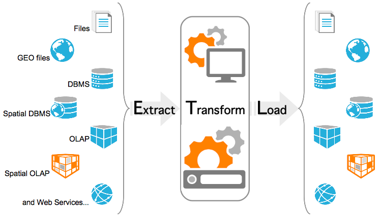
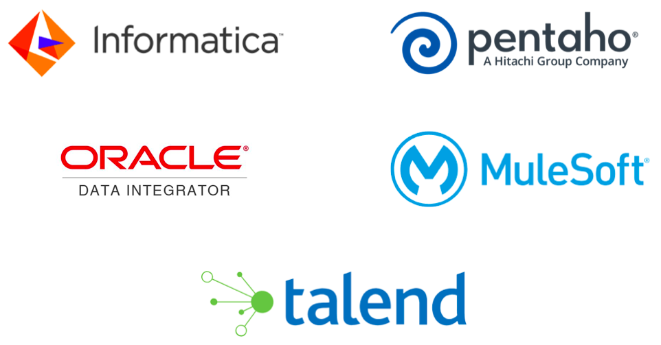

# Ingesta de Datos

## Introducción

Formalmente, la ingesta de datos es el proceso mediante el cual se introducen datos, desde diferentes fuentes, estructura y/o características dentro de otro sistema de almacenamiento o procesamiento de datos.

<figure style="float: right;">
    
    <figcaption>Ingesta de datos</figcaption>
</figure>

La ingesta de datos es un proceso muy importante porque la productividad de un equipo va directamente ligada a la calidad del proceso de ingesta de datos. Estos procesos deben ser flexibles y ágiles, ya que una vez puesta en marcha, los analistas y científicos de datos puedan construir un *pipeline* de datos para mover los datos a la herramienta con la que trabajen. Entendemos como *pipeline* de datos un proceso que consume datos desde un punto de origen, los limpia y los escribe en un nuevo destino.

Es sin duda, el primer paso que ha de tenerse en cuenta a la hora de diseñar una arquitectura *Big Data*, para lo cual, hay que tener muy claro, no solamente el tipo y fuente de datos, sino cual es el objetivo final y qué se pretende conseguir con ellos. A la hora de diseñar un *pipeline*, se debe empezar desde el problema que negocio quiere solucionar, y retroceder con los datos hasta el origen de los mismos. Por lo tanto, en este punto, hay que realizar un análisis detallado, porque es la base para determinar las tecnologías que compondrán nuestra arquitectura Big Data.

Dada la gran cantidad de datos que disponen las empresas, toda la información que generan desde diferentes fuentes se deben integrar en un único lugar, al que actualmente se le conoce como *data lake*, asegurándose que los datos sean compatibles entre sí. Gestionar tal volumen de datos puede llegar a ser un procedimiento complejo, normalmente dividido en procesos distintos y de relativamente larga duración.

## Pipeline de datos

Un *pipeline* es una construcción lógica que representa un proceso dividido en fases. Los pipelines de datos se caracterizan por definir el conjunto de pasos o fases y las tecnologías involucradas en un proceso de movimiento o procesamiento de datos. En su forma más simple, consisten en recoger los datos, almacenarlos y procesarlos, y construir algo útil con los datos.

<figure style="align: center;">
    
    <figcaption>Pipeline de datos - AWS</figcaption>
</figure>

Las pipelines de datos son necesarios ya que no debemos analizar los datos en los mismos sistemas donde se crean (principalmente para evitar problemas de rendimiento). El proceso de analítica es costoso computacionalmente, por lo que se separa para evitar perjudicar el rendimiento del servicio. De esta forma, tenemos sistemas OLTP (sistemas de procesamiento transaccional online, como un CRM), encargados de capturar y crear datos, y de forma separada, sistemas OLAP (sistemas de procesamiento analítico, como un *Data Warehouse*), encargados de analizar los datos.

### Fases del pipeline

Los movimientos de datos entre estos sistemas involucran varias fases. Por ejemplo:

1. Ingesta. Recogemos los datos y los enviamos a un topic de *Apache Kafka*.
2. Almacenamiento. *Kafka* actúa aquí como un *buffer* para el siguiente paso.

    <figure style="align: center;">
        
        <figcaption>Fases en un pipeline de datos - AWS</figcaption>
    </figure>

3. Procesamiento. Mediante una tecnología de procesamiento, que puede ser *streaming* o *batch*, leemos los datos del buffer.
4. Análisis y Visualización. Por ejemplo, mediante *Spark* realizamos la analítica sobre estos datos (haciendo cálculos, filtrados, agrupaciones de datos, etc...). Finalmente, podemos visualizar los resultado obtenidos o almacenarlos en una base de datos NoSQL como *Amazon DynamoDB* o un sistema de almacenamiento distribuido como *Amazon S3*.

Antes de realizar el análisis de los datos, va a ser muy normal tener que limpiar o normalizar los datos, ya sea porque las fuentes de datos, al ser distintas, utilicen diferentes codificaciones o nomenclaturas, o bien que haya datos sin rellenar o incorrectos. Conforme los datos avanzan a través del *pipeline*, los datos se van a transformar (por ejemplo, poniendo ceros en los campos vacíos, o rellenando los huecos con valores que aporten valor). Estas transformaciones se conocen como *Data Wrangling* (manipulación o disputa de datos), termino que engloba las acciones realizadas desde los datos en crudo hasta el estado final en el cual el dato cobra valor y sentido para los usuarios.

### Pipeline iterativo

Este proceso de ingesta, almacenamiento, procesamiento y análisis es iterativo. Sobre una hipótesis que se nos plantee en negocio, comprobaremos los datos almacenados, y si no disponemos de la información necesaria, recogeremos nuevos datos. EStos nuevos datos pasaran por todo el pipeline, integrándose con los datos ya existentes. En la fase de analítica, si no obtenemos el resultado esperado, nos tocará volver a la fase de ingesta para obtener o modificar los datos recogidos, y así, de forma iterativa, hasta producir el resultado esperado.

<figure style="align: center;">
    
    <figcaption>Desarrollo iterativo de un pipeline de datos - AWS</figcaption>
</figure>

Aunque a menudo se intercambian los términos de *pipeline* de datos y ETL, no significan lo mismo. Las ETLs son un caso particular de pipeline de datos que involucran las fases de extracción, transformación y carga de datos. Las pipelines de datos son cualquier proceso que involucre el movimiento de datos entre sistemas.

## ETL

Una ETL, entendida como un proceso que lleva la información de un punto A a un punto B, puede realizarse mediante diversas herramientas, scripts, Python, etc... Pero cuando nos metemos con Big Data no servirá cualquier tipo de herramienta, ya que necesitamos que sean:

* Flexibles y soporten formatos variados (JSON, CSV, etc...)
* Escalables y tolerante a fallos.
* Dispongan de conectores a múltiples fuentes y destinos de datos.

Los procesos ETL, siglas de **e**xtracción, **t**ransformación y carga (***l****oad*), permiten a las organizaciones recopilar en un único lugar todos los datos de los que pueden disponer. Ya hemos comentado que estos datos provienen de diversas fuentes, por lo que es necesario acceder a ellos, y formatearlos para poder ser capaces de integrarlos. Además, es muy recomendable asegurar la calidad de los datos y su veracidad, para así evitar la creación de errores en los datos.

<figure style="align: center;">
    
    <figcaption>Extracción, Transformación y Carga (load)</figcaption>
</figure>

Una vez los datos están unificados en un *data lake*, otro tipo de herramientas de análisis permitirán su estudio para apoyar procesos de negocio.

Dada la gran variedad de posibilidades existentes para representar la realidad en un dato, junto con la gran cantidad de datos almacenados en las diferentes fuentes de origen, los procesos ETL consumen una gran cantidad de los recursos asignados a un proyecto.

### Extracción

Encargada de recopilar los datos de los sistemas originales y transportarlos al sistema donde se almacenarán, de manera general suele tratarse de un entorno de Data Warehouse o almacén de datos. Las fuentes de datos pueden encontrarse en diferentes formatos, desde ficheros planos hasta bases de datos relacionales, pasando por mensajes de redes sociales como *Twitter* o *Reddit*.

Un paso que forma parte de la extracción es la de analizar que los datos sean veraces, que contiene la información que se espera, verificando que siguen el formato que se esperaba. En caso contrario, esos datos se rechazan.

La primera característica deseable de un proceso de extracción es que debe ser un proceso rápido, ligero, causar el menor impacto posible, ser transparente para los sistemas operacionales e independiente de las infraestructuras.

La segunda característica es que debe reducir al mínimo el impacto que se genera en el sistema origen de la información. No se puede poner en riesgo el sistema original, generalmente operacional, ni perder ni modificar sus datos; ya que si colapsase esto podría afectar el uso normal del sistema y generar pérdidas a nivel operacional.

Así pues, la extracción convierte los datos a un formato preparado para iniciar el proceso de transformación.

### Transformación

En esta fase se espera realizar los cambios necesarios en los datos de manera que estos tengan el formato y contenido esperado.

En concreto, la transformación puede comprender:

* Cambios de codificación.
* Eliminar datos duplicados.
* Cruzar diferentes fuentes de datos para obtener una fuente diferente.
* Agregar información en función de alguna variable.
* Tomar parte de los datos para cargarlos.
* Transformar información para generar códigos, claves, identificadores…
* Generar información.
* Estructurar mejor la información.
* Generar indicadores que faciliten el procesamiento y entendimiento.

Respecto a sus características, debe transformar los datos para mejorarlos, incrementar su calidad, integrarlos con otros sistemas, normalizarlos, eliminar duplicidades o ambigüedades. Además, no debe crear información, duplicar, eliminar información relevante, ser errónea o impredecible.

Una vez transformados, los datos ya estarán listos para su carga.

### Carga

Fase encargada de almacenar los datos en el destino, un *data warehouse* o en cualquier tipo de base de datos. Por tanto la fase de carga interactúa de manera directa con el sistema destino, y debe adaptarse al mismo con el fin de cargar los datos de manera satisfactoria.

La carga debe realizarse buscando minimizar el tiempo de la transacción.

Cada BBDD puede tener un sistema ideal de carga basado en:

* SQL (Oracle, SQL Server, Redshift, Postgres, Teradata, Greenplum, …)
* Ficheros (Postgres, Redshift, ...)
* Cargadores Propios (HDFS, S3, ...)

Para mejorar la carga debemos tener en cuenta la:

* Gestiones de índices
* Gestión de claves de distribución y particionado
* Tamaño de las transacciones y commit’s

## ELT

ELT cambia el orden de las siglas y se basa en extraer, cargar y transformar. Es un técnica de ingestión de datos donde los datos que se obtienen desde múltiples fuentes se colocan sin transformar directamente en un *data lake* o almacenamiento de objetos en la nube. Desde ahí, los datos se pueden transformar dependiendo de los diferentes objetivos de negocio.

En principio un proceso ELT necesita menos ingenieros de datos necesarios. Con la separación de la extracción y la transformación, ELT permite que los analistas y científicos de datos realicen las transformaciones, ya sea con SQL o mediante Python. De esta manera, más departamentos se involucran en obtener y mejorar los datos.

Una de las principales razones de que ELT cueste menos de implementar es que permite una mayor generalización de la información que se almacena. Los ingenieros de datos generan un *data lake* con los datos obtenidos de las fuentes de datos más populares, dejando que la transformación la realicen los expertos en el negocio. Esto también implica que los datos estén disponibles antes, ya que mediante un proceso ETL los datos no están disponibles para los usuarios hasta que se han transformado, lo que suele implicar un largo proceso de trabajo.

En resumen, el mercado se está moviendo desde un desarrollo centralizado mediante ETL a uno más orientado a servicios como ELT, que permite automatizar la carga del *data lake* y la posterior codificación de los flujos de datos.

## Herramientas ETL

Las caracteristicas de las herramientas ETL son:

* Permiten conectividad con diferentes sistemas y tipos de datos
    * Excel, BBDD transaccionales, XML, ficheros CSV / JSON, Teradata, HDFS, Hive, S3, ...
    * Peticiones HTTP, servicios REST...
    * APIs de aplicaciones de terceros, logs…

* Permiten la planificación mediante *batch*, *eventos* o en *streaming*.

* Capacidad para transformar los datos:
    * Transformaciones simples: tipos de datos, cadenas, codificaciones, cálculos simples.
    * Transformaciones intermedias: agregaciones, lookups.
    * Transformaciones complejas: algoritmos de IA, segmentación, integración de código de terceros, integración con otros lenguajes.

* Metadatos y gestión de errores
    * Permiten tener información del funcionamiento de todo el proceso
    * Permiten el control de errores y establecer politicas al respecto

Las soluciones más empleadas son:

* [Pentaho Data Integration (PDI)](https://www.hitachivantara.com/en-us/products/data-management-analytics/lumada-data-integration.html)
* [Oracle Data Integrator](https://www.oracle.com/es/middleware/technologies/data-integrator.html)
* [Talend Open Studio](https://www.talend.com/products/talend-open-studio/)
* [Mulesoft](https://www.mulesoft.com/es/)
* [Informatica Data Integration](https://www.informatica.com/products/data-integration.html)

<figure style="align: center;">
    
    <figcaption>Herramientas ETL</figcaption>
</figure>

## La ingesta por dentro

La ingesta extrae los datos desde la fuente donde se crean o almacenan originalmente y los carga en un destino o zona temporal. Un *pipeline* de datos sencillo puede que tenga que aplicar uno o más transformaciones ligeras para enriquecer o filtrar los datos antes de escribirlos en un destino, almacén de datos o cola de mensajería. Se pueden añadir nuevos *pipelines* para transformaciones más complejas como *joins*, agregaciones u ordenaciones para analítica de datos, aplicaciones o sistema de informes.

<figure style="align: center;">
    
    <figcaption>La ingesta de datos - StreamSets</figcaption>
</figure>

Las fuentes más comunes desde las que se obtienen los datos son:

* servicios de mensajería como Apache Kafka, los cuales han obtenido datos desde fuentes externas, como pueden ser dispositivos IOT o contenido obtenido directamente de las redes sociales.
* bases de datos relacionales, las cuales se acceden, por ejemplo, mediante JDBC.
* servicios REST que devuelven los datos en formato JSON.
* servicios de almacenamiento distribuido como HDFS o S3.

Los destinos donde se almacenan los datos son:

* servicios de mensajería como *Apache Kafka*.
* bases de datos relacionales.
* bases de datos NoSQL.
* servicios de almacenamiento distribuido como HDFS o S3.
* plataformas de datos como *Snowflake* o *Databricks*.

### Batch vs Streaming

El movimiento de datos entre los orígenes y los destinos se puede hacer, tal como vimos en la sesión de [Arquitecturas de Big Data](01arq.md#tipos-de-arquitecturas), mediante un proceso:

* *Batch*: el proceso se ejecuta de forma periódica (normalmente en intervalos fijos) a partir de unos datos *estáticos*. Muy eficiente para grandes volúmenes de datos, y donde la latencia (del orden de minutos) no es el factor más importante. Algunas de las herramientas utilizadas son *Apache Sqoop*, trabajos en *MapReduce* o de *Spark jobs*, etc...
* *Streaming*: también conocido como en tiempo real, donde los datos se leen, modifican y cargan tan pronto como llegan a la capa de ingesta (la latencia es crítica). Algunas de las herramientas utilizadas son *Apache Storm*, *Spark Streaming*, *Apache Nifi*, *Apache Kafka*, etc...

### Arquitectura

Si nos basamos en la [arquitectura por capas](01arq.md#arquitectura-por-capas), podemos ver como la capa de ingesta es la primera de las capas, la cual recoge los datos que provienen de fuentes diversas. Los datos se categorizan y priorizan, facilitando el flujo de éstos en posteriores capas:

<figure style="align: center;">
    
    <figcaption>Arquitectura por capas (xenonstack.com)</figcaption>
</figure>

En el primer paso de la ingesta es el paso más pesado, por tiempo y cantidad de recursos necesarios. Es normal realizar la ingesta de flujos de datos desde cientos a miles de fuentes de datos, los cuales se obtiene a velocidades variables y en diferentes formatos.

Para ello, es necesario:

* Priorizar las fuentes de datos
* Validar de forma individual cada fichero
* Enrutar cada elemento a su destino correcto.

Resumiendo, los cuatro parámetros en los que debemos centrar nuestros esfuerzos son:

1. Velocidad de los datos: cómo fluyen los datos entre máquinas, interacción con usuario y redes sociales, si el flujo es continuo o masivo.
2. Tamaño de los datos: la ingesta de múltiples fuentes puede incrementarse con el tiempo.
3. Frecuencia de los datos: *¿batch* o en *streaming*?
4. Formato de los datos: estructurado (tablas), desestructurado (imágenes, audios, vídeos, ...) o semi-estructurado (JSON).

## Herramientas de Ingesta de datos

Las herramientas de ingesta de datos para ecosistemas Big Data se clasifican en los siguientes bloques:

<figure style="float: right;">
    
    <figcaption>Herramientas de ingesta de datos</figcaption>
</figure>

* [*Apache Sqoop*](https://sqoop.apache.org): permite la transferencia bidireccional de datos entre *Hadoop/Hive/HBase* y una bases de datos SQL (datos estructurados). Aunque principalmente se interactúa mediante comandos, proporciona una API Java.
* [*Apache Flume*](https://flume.apache.org): sistema de ingesta de datos semiestructurados o no estructurados sobre HDFS o HBase mediante una arquitectura basada en flujos de datos en streaming.
* [*Apache Nifi*](https://nifi.apache.org): herramienta que facilita un interfaz gráfico que permite cargar datos de diferentes fuentes (tanto *batch* como *streaming*), los pasa por un flujo de procesos (mediante grafos dirigidos) para su tratamiento y transformación, y los vuelca en otra fuente.
* [*Elastic Logstash*](https://www.elastic.co/es/logstash/): Pensada inicialmente para la ingesta de logs en *Elasticsearch*, admite entradas y salidas de diferentes tipos (incluso AWS).
* [*AWS Glue*](https://aws.amazon.com/es/glue): servicios gestionado para realizar tareas ETL desde la consola de AWS. Facilita el descubrimiento de datos y esquemas. También se utiliza como almacenamiento de servicios como *Amazon Athena* o *AWS Data Pipeline*.

Por otro lado existen sistemas de mensajería con funciones propias de ingesta, tales como:

* *Apache Kafka*: sistema de intermediación de mensajes basado en el modelo publicador/suscriptor.
* *RabbitMQ*: sistema de colas de mensajes (MQ) que actúa de middleware entre productores y consumidores.
* *Amazon Kinesis*: homólogo de *Kafka* para la infraestructura *Amazon Web Services*.
* *Microsoft Azure Event Hubs*: homólogo de *Kafka* para la infraestructura *Microsoft Azure*.
* *Google Pub/Sub*: homólogo de *Kafka* para la infraestructura *Google Cloud*.

## Consideraciones

A la hora de analizar cual sería la tecnología y arquitectura adecuada para realizar la ingesta de datos en un sistema *Big Data*, hemos de tener en cuenta los siguientes factores:

* Origen y formato de los datos
    * ¿Cuál va a ser el origen u orígenes de los datos?
    * ¿Provienen de sistemas externos o internos a nuestra empresa?
    * ¿Serán datos estructurados o datos sin estructurar?
    * ¿Cuál es el volumen de los datos? Analizar el volumen diario y plantear como sería la primera carga de datos.
    * ¿Existe la posibilidad de que más adelante se incorporen nuevas fuentes de datos?
* Latencia/Disponibilidad
    * ¿Cómo de importante es la velocidad con la que se deben obtener los datos?
    * Ventana temporal que debe pasar desde que los datos se ingestan hasta que puedan ser utilizables, desde horas/días (mediante procesos *batch*) o ser *real-time* (mediante *streaming*)
* Actualizaciones
    * ¿Las fuentes de origen se modifican habitualmente?
    * ¿Podemos almacenar toda la información y guardar un histórico de cambios?
    * ¿Modificamos la información que tenemos? ¿mediante *updates*, o *deletes + insert*?
* Transformaciones
    * ¿Son necesarias durante la ingesta?
    * ¿Aportan latencia al sistema? ¿Afecta al rendimiento?
    * ¿Tiene consecuencias que la información sea transformada y no sea la original?
* Destino de los datos
    * ¿Será necesario enviar los datos a más de un destino, por ejemplo, *S3* y *MongoDB*?
    * ¿Almacenaremos los datos con el mismo formato que los ingestamos? ¿Los almacenamos en formatos basados en filas (*Avro*) o columnares (*Parquet*)?
    * ¿Cómo se van a utilizar los datos en el destino? ¿cómo serán las consultas? ¿es necesario particionar los datos? ¿serán búsquedas aleatorias o no? ¿Utilizaremos *Hive* / *Pig* / *Spark*?
    * ¿Qué procesos de transformación se van a realizar una vez ingestados los datos?
    * ¿Cual es la frecuencia y actualización de los datos origen?
* Estudio de los datos
    * Calidad de los datos ¿son fiables? ¿existen duplicados?
    * Respecto a la seguridad de los datos, si tenemos datos sensibles o confidenciales, ¿los enmascaramos o decidimos no realizar su ingesta? ¿Conocemos los requisitos de seguridad de nuestros datos? ¿Quién tiene que acceder y en qué estado?

## Referencias

* [Ingesta, es más que una mudanza de datos](https://www.futurespace.es/ingesta-es-mas-que-una-mudanza-de-datos/)
* [¿Qué es ETL?](https://www.talend.com/es/resources/what-is-etl/)
* [Building Big Data Storage Solutions (Data Lakes) for Maximum Flexibility](https://docs.aws.amazon.com/whitepapers/latest/building-data-lakes/building-data-lake-aws.html?did=wp_card&trk=wp_card)
* [Data Ingestion, Processing and Big Data Architecture Layers](https://medium.com/digital-transformation-and-platform-engineering/data-ingestion-processing-and-big-data-architecture-layers-3cb4988c07de)

## Actividades

1. (RA5075.1 / CE5.1b / 2p) Contesta a las siguientes preguntas justificando tus repuestas:
    1. ¿Qué relación existe entre un *pipeline* de datos y una ETL?
    2. ¿Es lo mismo un proceso ETL que ELT? ¿Cuándo se realiza un ETL y cuando un ELT?  
    Dentro de un contexto Big data, ¿Cuál crees que se utiliza más? ¿Por qué?
    3. Supongamos que somos una empresa que va a sacar un producto al mercado, y queremos medir las reacciones de las comunidades en las redes sociales.  
    Del apartado [Consideraciones](#consideraciones) contesta todas las preguntas planteadas a partir del supuesto planteado.

*[RA5075.1]: Gestiona soluciones a problemas propuestos, utilizando sistemas de almacenamiento y herramientas asociadas al centro de datos
*[CE5.1a]: Se ha caracterizado el proceso de diseño y construcción de soluciones en sistemas de almacenamiento de datos.
*[CE5.1b]: Se han determinado los procedimientos y mecanismos para la ingestión de datos.
<!--
https://streamsets.com/learn/data-ingestion/
https://streamsets.com/learn/etl-or-elt/
https://aprenderbigdata.com/pipeline-de-datos/
-->
