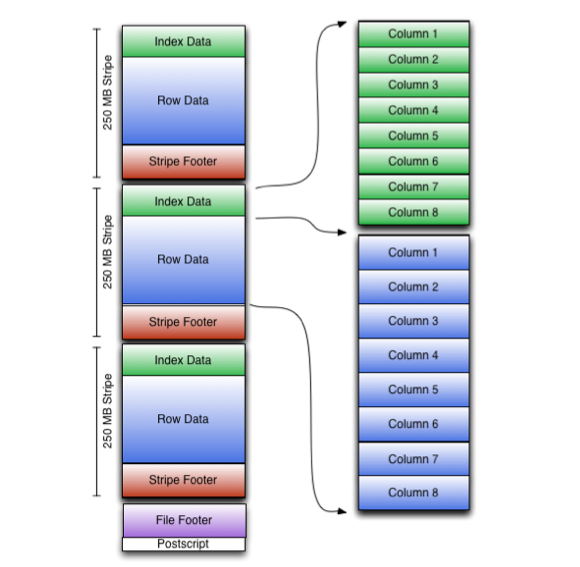
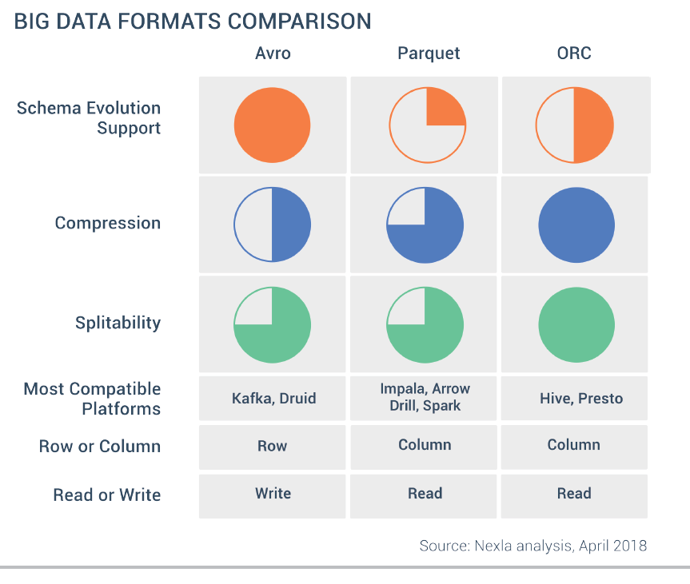

En la primera unidad de trabajo ya vimos una pequeña introducción a los diferentes [formatos de datos](https://manoli-iborra.github.io/bigdata2122/apuntes04.html#formato-de-datos_1).

Las propiedades que ha de tener un formato de datos son:

* independiente del lenguaje
* expresivo, con soporte para estructuras complejas y anidadas
* eficiente, rápido y reducido
* dinámico, de manera que los programas puedan procesar y definir nuevos tipos de datos.
* formato de fichero *standalone* y que permita **dividirlo** y comprimirlo.

Para que Hadoop/Spark o cualquier herramienta de analítica de datos pueda procesar documentos, es imprescindible que el formato del fichero permita su división en fragmentos (*splittable in chunks*).

Si los clasificamos respecto al formato de almacenamiento tenemos:

* texto (más lentos, ocupan más pero son más expresivos y permiten su interoperabilidad): CSV, XML, JSON, etc...
* binarios (mejor rendimiento, ocupan menos, menos expresivos): Avro, Parquet, ORC, etc...

Si comparamos los formatos más empleados a partir de las propiedades descritas tenemos:

| Característica                | CSV   | XML / JSON    | SequenceFile  | Avro
| ----- | ----- | ---- | ----- | ----- |
| Independencia del lenguaje    | :thumbsup:    | :thumbsup:            | :fontawesome-regular-thumbs-down:              | :thumbsup:
| Expresivo                     | :fontawesome-regular-thumbs-down:    | :thumbsup:            | :thumbsup:            | :thumbsup:
| Eficiente                     | :fontawesome-regular-thumbs-down:    | :fontawesome-regular-thumbs-down:            | :thumbsup:            | :thumbsup:
| Dinámico                      | :thumbsup:    | :thumbsup:            | :fontawesome-regular-thumbs-down:         | :thumbsup:
| *Standalone*                  | :grey_question:     | :thumbsup:            | :fontawesome-regular-thumbs-down:             | :thumbsup:
| Divisible                     | :grey_question:     | :grey_question:             | :thumbsup:             | :thumbsup:

<!--
https://www.xenonstack.com/blog/data-serialization-hadoop
-->

Las ventajas de elegir el formato correcto son:

* Mayor rendimiento en la lectura y/o escritura
* Ficheros *troceables* (*splittables*)
* Soporte para esquemas que evolucionan
* Soporte para compresión de los datos (por ejemplo, mediante *Snappy*).

## Filas vs Columnas

Los formatos con los que estamos más familiarizados, como son CSV o JSON, se basan en filas, donde cada registro se almacena en una fila o documento. Estos formatos son más lentos en ciertas consultas y su almacenamiento no es óptimo.

En un formato basado en columnas, cada fila almacena toda la información de una columna. Al basarse en columnas, ofrece mejor rendimiento para consultas de determinadas columnas y/o agregaciones, y el almacenamiento es más óptimo (como todos los datos de una columna son del mismo tipo, la compresión es mayor).

Supongamos que tenemos los siguientes datos:

<figure style="align: center;">
    
    <figcaption>Ejemplo de tabla</figcaption>
</figure>

Dependiendo del almacenamiento en filas o columnas tendríamos la siguiente representación:

<figure style="align: center;">
    
    <figcaption>Comparación filas y columnas</figcaption>
</figure>

En un formato columnar los datos del mismo tipo se agrupan, lo que mejora el rendimiento de acceso y reduce el tamaño:

<figure style="align: center;">
    
    <figcaption>Comparación filas y columnas</figcaption>
</figure>

El artículo [Apache Parquet: How to be a hero with the open-source columnar data format](https://blog.openbridge.com/how-to-be-a-hero-with-powerful-parquet-google-and-amazon-f2ae0f35ee04) compara un formato basado en filas, como *CSV*, con uno basado en columnas como Parquet, en base al tiempo y el coste de su lectura en AWS (por ejemplo, *AWS Athena* cobra 5$ por cada TB escaneado):

<figure style="align: center;">
    
    <figcaption>Comparación CSV y Parquet</figcaption>
</figure>

En la tabla podemos observar como 1TB de un fichero *CSV* en texto plano pasa a ocupar sólo 130GB mediante *Parquet*, lo que provoca que las posteriores consultas tarden menos y, en consecuencia, cuesten menos.

En la siguiente tabla comparamos un fichero CSV compuesto de cuatro columnas almacenado en S3 mediante tres formatos:

<figure style="align: center;">
    
    <figcaption>Comparación filas y columnas</figcaption>
</figure>

Queda claro que la elección del formato de los datos y la posibilidad de elegir el formato dependiendo de sus futuros casos de uso puede conllevar un importante ahorro en tiempo y costes.

## Avro

<figure style="float: right;">
    
    <figcaption>Logo de Apache Avro</figcaption>
</figure>

[Apache Avro](https://avro.apache.org/) es un formato de almacenamiento basado en filas para *Hadoop*, utilizado para la serialización de datos, ya que es más rápido y ocupa menos espacio que JSON, debido a que la serialización de los datos se realiza en un formato binario compacto.

Tiene soporte para la compresión de bloques y es un formato que permite la división de los datos (*splittable*).

### Formato

El formato *Avro* se basa en el uso de esquemas, los cuales definen los tipos de datos y protocolos mediante JSON. Cuando los datos `.avro` son leídos siempre está presente el esquema con el que han sido escritos.

<figure style="float: right;">
    
    <figcaption>Formato de un archivo Avro</figcaption>
</figure>

Cada fichero Avro almacena el esquema en la cabecera del fichero y luego están los datos en formato binario.

Los esquemas se componen de tipos primitivos (`null`, `boolean`, `int`, `long`, `float`, `double`, `bytes`, y `string`) y compuestos (`record`, `enum`, `array`, `map`, `union`, y `fixed`).

Un ejemplo de esquema podría ser:

``` json title="empleado.avsc"
{
   "type" : "record",
   "namespace" : "SeveroOchoa",
   "name" : "Empleado",
   "fields" : [
      { "name" : "Nombre" , "type" : "string" },
      { "name" : "Altura" , "type" : "float" }
      { "name" : "Edad" , "type" : "int" }
   ]
}
```

### Avro y Python

Para poder serializar y deserializar documentos *Avro* mediante *Python*, previamente debemos instalar la librería [`avro`](https://avro.apache.org/docs/1.11.1/getting-started-python/):

``` bash
pip install avro-python3
# o si utilizamos Anaconda
conda install -c conda-forge avro-python3
```

Vamos a realizar un ejemplo donde primero leemos un esquema de un archivo *Avro*, y con dicho esquema, escribiremos nuevos datos en un fichero. A continuación, abrimos el fichero escrito y leemos y mostramos los datos:

=== "Código Python"

    ``` python
    import avro
    import copy
    import json
    from avro.datafile import DataFileReader, DataFileWriter
    from avro.io import DatumReader, DatumWriter

    # abrimos el fichero en modo binario y leemos el esquema
    schema = avro.schema.parse(open("empleado.avsc", "rb").read())

    # escribimos un fichero a partir del esquema leído
    with open('empleados.avro', 'wb') as f:
        writer = DataFileWriter(f, DatumWriter(), schema)
        writer.append({"nombre": "Carlos", "altura": 180, "edad": 44})
        writer.append({"nombre": "Juan", "altura": 175})
        writer.close()

    # abrimos el archivo creado, lo leemos y mostramos línea a línea
    with open("empleados.avro", "rb") as f:
        reader = DataFileReader(f, DatumReader())
        # copiamos los metadatos del fichero leído
        metadata = copy.deepcopy(reader.meta)
        # obtenemos el schema del fichero leído
        schemaFromFile = json.loads(metadata['avro.schema'])
        # recuperamos los empleados
        empleados = [empleado for empleado in reader]
        reader.close()

    print(f'Schema de empleado.avsc:\n {schema}')
    print(f'Schema del fichero empleados.avro:\n {schemaFromFile}')
    print(f'Empleados:\n {empleados}')
    ```

=== "Resultado"

    ``` json
    Schema de empleado.avsc:
    {"type": "record", "name": "empleado", "namespace": "SeveroOchoa", "fields": [{"type": "string", "name": "nombre"}, {"type": "int", "name": "altura"}, {"type": ["null", "int"], "name": "edad", "default": null}]}
    Schema del fichero empleados.avro:
    {'type': 'record', 'name': 'empleado', 'namespace': 'SeveroOchoa', 'fields': [{'type': 'string', 'name': 'nombre'}, {'type': 'int', 'name': 'altura'}, {'type': ['null', 'int'], 'name': 'edad', 'default': None}]}
    Empleados:
    [{'nombre': 'Carlos', 'altura': 180, 'edad': 44}, {'nombre': 'Juan', 'altura': 175, 'edad': None}]
    ```

=== "Google Colab"

    Accede al [cuaderno en Google Colab](https://colab.research.google.com/drive/1zxfPwEdHjaYHjkKjPOwXuj9fXGD8Anc1?usp=sharing) y adjunta el archivo del [empleado.avsc](resources/empleado.avsc).

### Fastavro

Para trabajar con *Avro* y grandes volúmenes de datos, es mejor utilizar la librería *Fastavro* (<https://github.com/fastavro/fastavro>) la cual ofrece un rendimiento mayor (en vez de estar codificada en *Python* puro, tiene algunos fragmentos realizados mediante *Cython*).

Primero, hemos de instalar la librería:

``` bash
pip install fastavro
# o si utilizamos Anaconda
conda install -c conda-forge fastavro
```

Como podéis observar a continuación, hemos repetido el ejemplo y el código es muy similar:

=== "Código Python"

    ``` python
    import fastavro
    import copy
    import json
    from fastavro import reader

    # abrimos el fichero en modo binario y leemos el esquema
    with open("empleado.avsc", "rb") as f:
        schemaJSON = json.load(f)
    schemaDict = fastavro.parse_schema(schemaJSON)

    empleados = [{"nombre": "Carlos", "altura": 180, "edad": 44},
                {"nombre": "Juan", "altura": 175}]

    # escribimos un fichero a partir del esquema leído
    with open('empleadosf.avro', 'wb') as f:
        fastavro.writer(f, schemaDict, empleados)

    # abrimos el archivo creado, lo leemos y mostramos línea a línea
    with open("empleadosf.avro", "rb") as f:
        reader = fastavro.reader(f)
        # copiamos los metadatos del fichero leído
        metadata = copy.deepcopy(reader.metadata)
        # obtenemos el schema del fichero leído
        schemaReader = copy.deepcopy(reader.writer_schema)
        schemaFromFile = json.loads(metadata['avro.schema'])
        # recuperamos los empleados
        empleados = [empleado for empleado in reader]

    print(f'Schema de empleado.avsc:\n {schemaDict}')
    print(f'Schema del fichero empleadosf.avro:\n {schemaFromFile}')
    print(f'Empleados:\n {empleados}')
    ```

=== "Resultado"

    ``` json
    Schema de empleado.avsc:
    {'type': 'record', 'name': 'SeveroOchoa.empleado', 'fields': [{'name': 'nombre', 'type': 'string'}, {'name': 'altura', 'type': 'int'}, {'default': None, 'name': 'edad', 'type': ['null', 'int']}], '__fastavro_parsed': True, '__named_schemas': {'SeveroOchoa.empleado': {'type': 'record', 'name': 'SeveroOchoa.empleado', 'fields': [{'name': 'nombre', 'type': 'string'}, {'name': 'altura', 'type': 'int'}, {'default': None, 'name': 'edad', 'type': ['null', 'int']}]}}}
    Schema del fichero empleadosf.avro:
    {'type': 'record', 'name': 'SeveroOchoa.empleado', 'fields': [{'name': 'nombre', 'type': 'string'}, {'name': 'altura', 'type': 'int'}, {'default': None, 'name': 'edad', 'type': ['null', 'int']}]}
    Empleados:
    [{'nombre': 'Carlos', 'altura': 180, 'edad': 44}, {'nombre': 'Juan', 'altura': 175, 'edad': None}]
    ```

=== "Google Colab"

    Accede al [cuaderno en Google Colab](https://colab.research.google.com/drive/1z0ZsCX2Ws-3kSFLQEJS74CDkkot--Y-n?usp=sharing) y adjunta el archivo del [empleado.avsc](resources/empleado.avsc).

### Fastavro y Pandas

Finalmente, vamos a realizar un último ejemplo con las dos librerías más utilizadas.

Vamos a leer un fichero *CSV* de [ventas](resources/pdi_sales.csv) mediante *Pandas*, y tras limpiar los datos y quedarnos únicamente con las ventas de Alemania, almacenaremos el resultado del procesamiento en *Avro*.

=== "Acceso Local"

    ``` python hl_lines="35 32"
    import pandas as pd
    from fastavro import writer, parse_schema

    # Leemos el csv mediante pandas
    df = pd.read_csv('pdi_sales.csv',sep=';')
    # Limpiamos los datos (strip a los códigos postales) y nos quedamos con Alemania
    df['Zip'] = df['Zip'].str.strip()
    filtro = df.Country=="Germany"
    df = df[filtro]

    # 1. Definimos el esquema
    schema = {
        'name': 'Sales',
        'namespace' : 'SeveroOchoa',
        'type': 'record',
        'fields': [
            {'name': 'ProductID', 'type': 'int'},
            {'name': 'Date', 'type': 'string'},
            {'name': 'Zip', 'type': 'string'},
            {'name': 'Units', 'type': 'int'},
            {'name': 'Revenue', 'type': 'float'},
            {'name': 'Country', 'type': 'string'}
        ]
    }
    schemaParseado = parse_schema(schema)

    # 2. Convertimos el Dataframe a una lista de diccionarios
    records = df.to_dict('records')

    # 3. Persistimos en un fichero avro
    with open('sales.avro', 'wb') as f:
        writer(f, schemaParseado, records)
    ```

=== "Google Colab"

    Accede al [cuaderno en Google Colab](https://colab.research.google.com/drive/1zaM4132cmUIsOWL5rbiCre5dCIyVL1RC?usp=sharing) y adjunta el archivo de ventas [pdi_sales.csv](resources/pdi_sales.csv).

!!! tip "Acceso HDFS"

    Aunque todavía no hayamos estudiado el ecosistema Hadoop, vamos a ver como podemos conectarnos a HDFS para leer y persistir datos en formato *Avro*:

    ``` python
    import pandas as pd
    from fastavro import parse_schema
    from hdfs import InsecureClient
    from hdfs.ext.avro import AvroWriter
    from hdfs.ext.dataframe import write_dataframe

    # 1. Nos conectamos a HDFS
    HDFS_HOSTNAME = 'iabd-virtualbox'
    HDFSCLI_PORT = 9870
    HDFSCLI_CONNECTION_STRING = f'http://{HDFS_HOSTNAME}:{HDFSCLI_PORT}'
    hdfs_client = InsecureClient(HDFSCLI_CONNECTION_STRING)

    # 2. Leemos el Dataframe
    with hdfs_client.read('/user/iabd/pdi_sales.csv') as reader:
        df = pd.read_csv(reader,sep=';')

    # Limpiamos los datos (strip a los códigos postales) y nos quedamos con Alemania
    df['Zip'] = df['Zip'].str.strip()
    filtro = df.Country=="Germany"
    df = df[filtro]

    # 3. Definimos el esquema
    schema = {
        'name': 'Sales',
        'namespace' : 'SeveroOchoa',
        'type': 'record',
        'fields': [
            {'name': 'ProductID', 'type': 'int'},
            {'name': 'Date', 'type': 'string'},
            {'name': 'Zip', 'type': 'string'},
            {'name': 'Units', 'type': 'int'},
            {'name': 'Revenue', 'type': 'float'},
            {'name': 'Country', 'type': 'string'}
        ]
    }
    schemaParseado = parse_schema(schema)

    # 4a. Persistimos en un fichero avro dentro de HDFS mediante la extension AvroWriter de hdfs
    with AvroWriter(hdfs_client, '/user/iabd/sales.avro', schemaParseado) as writer:
        records = df.to_dict('records') # diccionario
        for record in records:
            writer.write(record)

    # 4b. O directamente persistimos el Dataframe mediante la extension write_dataframe de hdfs
    write_dataframe(hdfs_client, '/user/iabd/sales2.avro', df)  # infiere el esquema
    write_dataframe(hdfs_client, '/user/iabd/sales3.avro', df, schema=schemaParseado)
    ```

    Para el acceso HDFS hemos utilizados las extensiones [Fastavro](https://hdfscli.readthedocs.io/en/latest/api.html#module-hdfs.ext.avro) y [Pandas](https://hdfscli.readthedocs.io/en/latest/api.html#module-hdfs.ext.dataframe) de la librería HDFS que veremos en posteriores sesiones.

### Comprimiendo los datos

¿Y sí comprimimos los datos para ocupen menos espacio en nuestro clúster y por tanto, nos cuesten menos dinero?

*Fastavro* soporta dos tipos de compresión: *gzip* (mediante el algoritmo `deflate`) y `snappy`. **Snappy** es una biblioteca de compresión y descompresión de datos de gran rendimiento que se utiliza con frecuencia en proyectos Big Data, la cual hemos de instalar previamente mediante `pip install python-snappy`.

Para indicar el tipo de compresión, únicamente hemos de añadir un parámetros extra con el algoritmo de compresión en la función/constructor de persistencia:

=== "Fastavro y gzip"

    ``` python
    writer(f, schemaParseado, records, 'deflate')
    ```

=== "AvroWriter y snappy"

    ``` python
    with AvroWriter(hdfs_client, '/user/iabd/sales.avro', schemaParseado, 'snappy') as writer:
    ```

=== "write_dataframe y snappy"

    ``` python
    write_dataframe(hdfs_client, '/user/iabd/sales3.avro', df, schema=schemaParseado, codec='snappy')
    ```

!!! info "Comparando algoritmos de compresión"

    Respecto a la compresión, sobre un fichero de 100GB, podemos considerar media si ronda los 50GB y alta si baja a los 40GB.
    
    | Algoritmo | Velocidad | Compresión
    | -----     | -----     | ------
    | Gzip      | Media     | Media 
    | Bzip2     | Lenta     | Alta
    | Snappy    | Alta      | Media

    Más que un tema de espacio, necesitamos que los procesos sean eficientes y por eso priman los algoritmos que son más rápidos. Si te interesa el tema, es muy interesante el artículo [Data Compression in Hadoop](http://comphadoop.weebly.com).

    Por ejemplo, si realizamos el ejemplo de [Fast Avro y Pandas](#fastavro-y-pandas) con acceso local obtenemos los siguientes tamaños:
    
    * Sin compresión: 6,9 MiB
    * Gzip: 1,9 MiB
    * Snappy: 2,8 MiB

## Parquet

<figure style="float: right;">
    
    <figcaption>Logo de Apache Parquet</figcaption>
</figure>

[Apache Parquet](https://parquet.apache.org/) es un formato de almacenamiento basado en columnas para *Hadoop*, con soporte para todos los frameworks de procesamiento de datos, así como lenguajes de programación. De la misma forma que *Avro*, se trata de un formato de datos auto-descriptivo, de manera que embebe el esquema o estructura de los datos con los propios datos en sí. Parquet es idóneo para analizar datasets que contienen muchas columnas, es decir, para lecturas de grandes cargas de trabajo.

Tiene un ratio de compresión muy alto (mediante Snappy ronda el 75%), y además, solo se recorren las columnas necesarias en cada lectura, lo que reduce las operaciones de disco de entrada/salida.

### Formato

<figure style="float: right;">
    
    <figcaption>Formato de un archivo Parquet</figcaption>
</figure>

Cada fichero Parquet almacena los datos en binario organizados en grupos de filas. Para cada grupo de filas (*row group*), los valores de los datos se organizan en columnas, lo que facilita la compresión a nivel de columna.

La columna de metadatos de un fichero Parquet se almacena al final del fichero, lo que permite que las escrituras sean rápidas con una única pasada. Los metadatos pueden incluir información como los tipos de datos, esquemas de codificación/compresión, estadísticas, nombre de los elementos, etc...

<!--
https://www.upsolver.com/blog/apache-parquet-why-use
https://towardsdatascience.com/understanding-apache-parquet-7197ba6462a9
-->

### Parquet y Python

Para interactuar con el formato Parquet mediante Python, la librería más utilizada es la que ofrece [Apache Arrow](https://arrow.apache.org/), en concreto la librería [*PyArrow*](https://arrow.apache.org/docs/python/).

Así pues, la instalamos mediante pip:

``` bash
pip install pyarrow
```

*Apache Arrow* usa un tipo de estructura denominada tabla para almacenar los datos bidimensional (sería muy similar a un *Dataframe* de *Pandas*). La documentación de *PyArrow* dispone de un [libro de recetas](https://arrow.apache.org/cookbook/py/) con ejemplos con código para los diferentes casos de uso que se nos puedan plantear.

Vamos a simular el mismo ejemplo que hemos realizado previamente mediante *Avro*, y vamos a crear un fichero en formato *JSON* con empleados, y tras persistirlo en formato *Parquet*, lo vamos a recuperar:

=== "Empleados en columnas"

    ``` python title="dict-parquet.py"
    import pyarrow.parquet as pq
    import pyarrow as pa

    # 1.- Definimos el esquema
    schema = pa.schema([ ('nombre', pa.string()),
                        ('altura', pa.int32()),
                        ('edad', pa.int32())  ])

    # 2.- Almacenamos los empleados por columnas
    empleados = {"nombre": ["Carlos", "Juan"],
                "altura": [180, 44],
                "edad": [None, 34]}

    # 3.- Creamos una tabla Arrow y la persistimos mediante Parquet
    tabla = pa.Table.from_pydict(empleados, schema)
    pq.write_table(tabla, 'empleados.parquet')

    # 4.- Leemos el fichero generado
    table2 = pq.read_table('empleados.parquet')
    schemaFromFile = table2.schema

    print(f'Schema del fichero empleados.parquet:\n{schemaFromFile}\n')
    print(f'Tabla de Empleados:\n{table2}')
    ```

=== "Empleados en Filas"

    Para que *pyarrow* pueda leer los empleados como documentos JSON, a día de hoy sólo puede hacerlo leyendo documentos individuales almacenados en fichero:

    Por lo tanto, creamos el fichero `empleados.json` con la siguiente información:

    ``` json title="empleados.json"
    { "nombre": "Carlos", "altura": 180, "edad": 44 }
    { "nombre": "Juan", "altura": 175 }
    ```

    De manera que podemos leer los datos JSON y persistirlos en Parquet del siguiente modo:

    ``` python title="json-parquet.py"
    import pyarrow.parquet as pq
    import pyarrow as pa
    from pyarrow import json

    # 1.- Definimos el esquema
    schema = pa.schema([ ('nombre', pa.string()),
                        ('altura', pa.int32()),
                        ('edad', pa.int32())  ])

    # 2.- Leemos los empleados
    tabla = json.read_json("empleados.json")
    # 3.- Persistimos la tabla en Parquet
    pq.write_table(tabla, 'empleados-json.parquet')

    # 4.- Leemos el fichero generado
    table2 = pq.read_table('empleados-json.parquet')
    schemaFromFile = table2.schema

    print(f'Schema del fichero empleados-json.parquet:\n{schemaFromFile}\n')
    print(f'Tabla de Empleados:\n{table2}')
    ```

En ambos casos obtendríamos algo similar a:

``` text
Schema del fichero empleados.parquet:
nombre: string
altura: int32
edad: int32

Tabla de Empleados:
pyarrow.Table
nombre: string
altura: int32
edad: int32
----
nombre: [["Carlos","Juan"]]
altura: [[180,44]]
edad: [[null,34]]
```

### Parquet y Pandas

En el caso del uso de *Pandas* el código todavía se simplifica más.

Un fragmento de código muy sencillo y que nos puede ser muy útil es cómo leer un archivo en formato *Parquet* y pasarlo a *Pandas*:

``` python
import pyarrow.parquet as pq
trips = pq.read_table('archivo.parquet')
trips = trips.to_pandas()
```

Si reproducimos el mismo ejemplo que hemos realizado con *Avro* tenemos que los *Dataframes* ofrecen el método `to_parquet` para exportar a un fichero *Parquet*:

```  python title="csv-parquet.py"
import pandas as pd

df = pd.read_csv('pdi_sales.csv',sep=';')

df['Zip'] = df['Zip'].str.strip()
filtro = df.Country=="Germany"
df = df[filtro]

# A partir de un DataFrame, persistimos los datos
df.to_parquet('sales.parquet')
```

!!! tip "Parquet y HDFS"

    Si quisiéramos almacenar el archivo directamente en HDFS, necesitamos indicarle a Pandas la dirección del sistema de archivos que tenemos configurado en `core-site.xml`:

    ``` xml title="core-site.ml"
    <property>
        <name>fs.defaultFS</name>
        <value>hdfs://iabd-virtualbox:9000</value>
    </property>
    ```

    Así pues, únicamente necesitamos modificar el nombre del archivo donde serializamos los datos a *Parquet*:

    ```  python
    df.to_parquet('hdfs://iabd-virtualbox:9000/sales.parquet')
    ```

## ORC

<figure style="float: right;">
    
    <figcaption>Formato de un archivo ORC</figcaption>
</figure>

[Apache ORC](https://orc.apache.org/) es un formato de datos columnar optimizado para la lectura, escritura y procesamiento de datos en *Hive*. *ORC* tiene una tasa de compresión alta (utiliza *zlib*), y al basarse en Hive, soporta sus tipos de datos (*datetime*, *decimal*, y tipos complejos como *struct*, *list*, *map* y *union*) y es compatible con HiveQL.

Los fichero *ORC* se componen de tiras de datos (*stripes*), donde cada tira contiene un índice, los datos de la fila y un pie (con estadísticas como la cantidad, máximos y mínimos y la suma de cada columna convenientemente cacheadas)

### ORC y Python

Para crear archivos ORC y leerlos, volvemos a necesitar la librería [*PyArrow*](https://arrow.apache.org/docs/python/).

Así pues, para la escritura de datos, por ejemplo, desde un Dataframe, haríamos:

``` python hl_lines="12 13"
import pandas as pd
import pyarrow as pa
import pyarrow.orc as orc

df = pd.read_csv('pdi_sales.csv',sep=';')

# Limpiamos los datos (strip a los códigos postales) y nos quedamos con Alemania
df['Zip'] = df['Zip'].str.strip()
filtro = df.Country=="Germany"
df = df[filtro]

table = pa.Table.from_pandas(df, preserve_index=False)
orc.write_table(table, 'pdi_sales.orc')
```

Y si queremos leer, la propia librería de Pandas tiene su método [`read_orc`](https://pandas.pydata.org/docs/reference/api/pandas.read_orc.html):

``` python
df_orc = pd.read_orc('pdi_sales.orc')
```

!!! note "to_orc"
    Desde Pandas 1.5, a partir de un *DataFrame*, podemos persistir los datos mediante el método [`to_orc`](https://pandas.pydata.org/docs/reference/api/pandas.DataFrame.to_orc.html). El problema lo tienen *Google Colab* o *Kaggle*, que todavía no dan soporta a esa versión.

## Comparando formatos

Acabamos de ver que cada uno de los formatos tiene sus puntos fuertes.

Los formatos basados en filas ofrecen un rendimiento mayor en las escrituras que en las lecturas, ya que añadir nuevos registros en más sencillo. Si sólo vamos a hacer consultas sobre un subconjunto de las columnas, entonces un formato columnas se comportará mejor, ya que no necesita recuperar los registros enteros (cosa que sí hacen los formatos basados en filas).

Respecto a la compresión, entendiendo que ofrece una ventaja a la hora de almacenar y transmitir la información, es útil cuando trabajamos con un gran volumen de datos. Los formatos basado en columnas ofrecen un mejor rendimiento ya que todos los datos del mismo tipo se almacenan de forma contigua lo que permite una mayor eficiencia en la compresión (además, cada tipo de columna tiene su propia codificación).

Respecto a la evolución del esquema, con operaciones como añadir o eliminar columnas o cambiar su nombre, la mejor decisión es decantarse por Avro. Además, al tener el esquema en JSON facilita su gestión y permite que tengan más de un esquema.

Si nuestros documentos tienen una estructura compleja compuesta por columnas anidadas y normalmente realizamos consultas sobre un subconjunto de las subcolumnas, la elección debería ser Parquet, por la estructura que utiliza.

Finalmente, recordar que ORC está especialmente enfocado a su uso con Hive, mientras que Spark tiene un amplio soporte para Parquet y que si trabajamos con Kafka, Avro es una buena elección.

<figure style="align: center;">
    
    <figcaption>Comparativa de formatos</figcaption>
</figure>

Si comparamos los tamaños de los archivos respecto al formato de datos empleado con únicamente las ventas de Alemania tendríamos:

* `ger_sales.csv`: 9,7 MiB
* `ger_sales.avro`: 6,9 MiB
    * `ger_sales-gzip.avro`: 1,9 MiB
    * `ger_sales-snappy.avro`:  2,8 MiB
* `ger_sales.parquet`: 2,3 MiB
    * `ger_sales-gzip.parquet`: 1,6 MiB
    * `ger_sales-snappy.parquet`: 2,3 MiBa
* `ger_sales.orc`: 6,98 MiB

## Referencias

* [Introduction to Big Data Formats](https://webcdn.nexla.com/n3x_ctx/uploads/2018/05/An-Introduction-to-Big-Data-Formats-Nexla.pdf)
* [Handling Avro files in Python](https://www.perfectlyrandom.org/2019/11/29/handling-avro-files-in-python/)
* [Big Data File Formats Demystified](https://www.datanami.com/2018/05/16/big-data-file-formats-demystified/)

## Actividades

5. (RA5075.1 / CE5.1c / 1p) Mediante *Python* y utilizando *Kaggle*, crea un notebook a partir de los datos del dataset de [retrasos en los vuelos](https://www.kaggle.com/datasets/yuanyuwendymu/airline-delay-and-cancellation-data-2009-2018) y a partir de uno de los ficheros (el que más te guste) transforma los datos y persiste los siguientes archivos:

    * `air<anyo>.parquet`: el archivo csv en formato *Parquet*.
    * `air<anyo>.orc`: el archivo csv en formato *ORC*.
    * `air<anyo>_small.avro`: la fecha (*FL_DATE*), el identificador de la aerolínea (*OP_CARRIER*) y el retraso de cada vuelo (*DEP_DELAY*) en formato Avro
    * `air<anyo>_small.parquet`: con los mismos atributos pero en *Parquet*.

    Adjunta una captura del cuaderno, anota los tamaños de los ficheros creados y el tiempo necesario para su creación, y finalmente, comparte el *notebook* con el usuario *Aitor Medrano* de *Kaggle*.

*[RA5075.1]: Gestiona soluciones a problemas propuestos, utilizando sistemas de almacenamiento y herramientas asociadas al centro de datos.
*[CE5.1c]: Se ha determinado el formato de datos adecuado para el almacenamiento.
