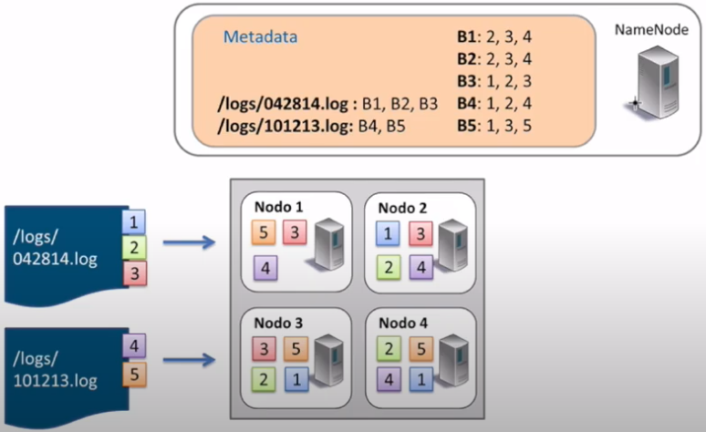

# HDFS

## Namenodes y Datanodes

En la sesión anterior ya vimos una pequeña introducción a la arquitectura de HDFS.

<figure style="align: center;">
    
    <figcaption>Arquitectura HDFS</figcaption>
</figure>

Vamos a profundizar en sus elementos.

### Namenode

Tal como hemos comentado, existen dos tipos de nodos. El principal se conoce como **Namenode**:

* Solo existe uno, y hace de servidor principal.
* Nodo al que se tienen que conectar los clientes para realizar las lecturas / escrituras.
* Mantiene el árbol del sistema de archivos (*espacio de nombre*) y los metadatos para todos los ficheros y directorios en el árbol, de manera que sabe en qué nodo del clúster está cada bloque de información (*mapa de bloques*)
* Los metadatos se almacenan tanto en memoria (para acelerar su uso) como en disco a la vez, por lo que es un nodo que requiere de mucha memoria RAM.
* Los bloques nunca pasan por el *NameNode*, se transfieren entre *DataNodes* y/o el cliente. Es decir, el *Namenode* no es responsable de almacenar o transferir los datos.
* Si se cae, no hay acceso a HDFS, por lo que es crítico el mantenimiento de copias de seguridad.

El segundo tipo es el **Secondary Namenode**:

* Su función principal es guardar una copia de *FsImage* y *EditLog*:
    * *FsImage*: instantánea de los metadatos del sistema de archivos.
    * *EditLog*: registro de transacciones que contiene los registros de cada cambio (*deltas*) que se produce en los metadatos del sistema de archivos.
* No se trata de un nodo de respaldo
* Por lo general se ejecuta en una máquina distinta

Además de distribuir los bloques entre distintos nodos de datos, también los replica (con un factor de replicación igual a tres, los replicaría en 3 nodos diferentes, 2 en el mismo rack y 1 en otro diferente) para evitar pérdidas de información si alguno de los nodos falla.

Cuando una aplicación cliente necesita leer o modificar un bloque de datos, el *Namenode* le indica en qué nodo se localiza esa información. También se asegura de que los nodos no estén caídos y que la información esté replicada, para asegurar su disponibilidad aún en estos casos.

Para hacernos una idea, independientemente del cloud, *Facebook* utiliza un clúster de 1100 máquinas, con 8800 nodos y cerca de 12 PB de almacenamiento.

### Datanode

* De este tipo de nodo habrá más de uno en cada clúster. Por cada *Namenode* podemos tener miles de *Datanodes*
* Almacena y lee bloques de datos.
* Recuperado por *Namenode* clientes.
* Reportan al *Namenode* la lista de bloques que están almacenando.
* Pueden ir en distintos discos.
* Guarda un *checksum* del bloque.

<figure style="align: center;">
    
    <figcaption>Relación entre Namenodes y Datanodes HDFS</figcaption>
</figure>

## Procesos de lectura

Vamos a revisar como fluyen los datos en un proceso de lectura entre el cliente y HDFS a partir de la siguiente imagen:

<figure style="align: center;">
    
    <figcaption>Proceso de lectura</figcaption>
</figure>

1. El cliente abre el fichero que quiere leer mediante el método `open()` del sistema de archivos distribuido.
2. Éste llama al *namenode* mediante una RPC (llamada a procedimiento remoto) el cual le indica la localización del primer bloque del fichero. Para cada bloque, el *namenode* devuelve la dirección de los *datanodes* que tienen una copia de ese bloque. Además, los *datanodes* se ordenan respecto a su proximidad con el cliente (depende de la topología de la red y despliegue en *datacenter/rack/nodo*). Si el cliente en sí es un *datanode*, la lectura la realizará desde su propio sistema local.
3. El sistema de ficheros distribuido devuelve al cliente un *FSDataInputStream* (un flujo de entrada que soporta la búsqueda de ficheros), sobre el cual se invoca la lectura mediante el método `read()`. Este flujo, que contiene las direcciones de los *datanodes* para los primeros bloques del fichero, conecta con el *datanode* más cercano para la lectura del primer bloque.
4. Los datos se leen desde el *datanode* con llamadas al método `read()`. Cuando se haya leído el bloque completo, el flujo de entrada cerrará la conexión con el *datanode* actual y buscará el mejor *datanode* para el siguiente bloque.
5. Se repite el paso anterior (siempre de manera transparente para el cliente, el cual solo está leyendo datos desde un flujo de datos continuo).
6. Cuando el cliente finaliza la lectura, cierra la conexión con el flujo de datos.

Durante la lectura, si el flujo encuentra un error al comunicarse con un *datanode* (o un error de *checksum*), intentará el proceso con el siguiente nodo más cercano (además, recordará los nodos que han fallado para no realizar reintentos en futuros bloques y/o informará de los bloque corruptos al *namenode*)

!!! importante "Namenode sin datos"
    Recordad que los datos nunca pasan por el *namenode*. El cliente que realiza la conexión con HDFS es el que hace las operaciones de lectura/escritura directamente con los *datanodes*.
    Este diseño permite que HDFS escale de manera adecuada, ya que el tráfico de los clientes se esparce por todos los *datanodes* de nuestro clúster.

## Proceso de escritura

El proceso de escritura en HDFS sigue un planteamiento similar. Vamos a analizar la creación, escritura y cierre de un archivo con la siguiente imagen:

<figure style="align: center;">
    
    <figcaption>Proceso de escritura</figcaption>
</figure>

1. El cliente crea el fichero mediante la llamada al método `create()` del *DistributedFileSystem*.
2. Este realiza una llamada RPC al *namenode* para crear el fichero en el sistema de ficheros del *namenode*, sin ningún bloque asociado a él. El *namenode* realiza varias comprobaciones para asegurar que el fichero no existe previamente y que el usuario tiene los permisos necesarios para su creación. Tras ello, el *namenode* determina la forma en que va a dividir los datos en bloques y qué *datanodes* utilizará para almacenar los bloques.
3. El *DistributedFileSystem* devuelve un *FSDataOutputStream*  el cual gestiona la comunicación con los datanodes y el *namenode* para que el cliente comience a escribir los datos de cada bloque en el *namenode* apropiado.
4. Conforme el cliente escribe los datos, el flujo obtiene del *namenode* una lista de datanodes candidatos para almacenar las réplicas. La lista de nodos forman un *pipeline*, de manera que si el factor de replicación es 3, habrá 3 nodos en el *pipeline*. El flujo envía los paquete al primer datanode del pipeline, el cual almacena cada paquete y los reenvía al segundo datanode del *pipeline*. Y así sucesivamente con el resto de nodos del pipeline.
5. Cuando todos los nodos han confirmado la recepción y almacenamiento de los paquetes, envía un paquete de confirmación al flujo.
6. Cuando el cliente finaliza con la escritura de los datos, cierra el flujo mediante el método `close()` el cual libera los paquetes restantes al pipeline de datanodes y queda a la espera de recibir las confirmaciones. Una vez confirmado, le indica al *namenode* que la escritura se ha completado, informando de los bloques finales que conforman el fichero (puede que hayan cambiado respecto al paso 2 si ha habido algún error de escritura).

## HDFS por dentro

HDFS utiliza de un conjunto de ficheros que gestionan los cambios que se producen en el clúster.

Primero entramos en `$HADOOP_HOME/etc/hadoop` y averiguamos la carpeta de datos que tenemos configurada en `hdfs-site.xml` para el *namenode*:

``` xml title="hdfs-site.xml"
<property>
    <name>dfs.name.dir</name>
    <value>file:///opt/hadoop-data/hdfs/namenode</value>
</property>
```

Desde nuestro sistema de archivos, accedemos a dicha carpeta y vemos que existe una carpeta `current` que contendrá un conjunto de ficheros cuyos prefijos son:

* `edits_000NNN`: histórico de cambios que se van produciendo.
* `edits_inprogress_NNN`: cambios actuales en memoria que no se han persistido.
* `fsimagen_000NNN`: *snapshot* en el tiempo del sistema de ficheros.

<figure align="center">
    
    <figcaption>HDFS por dentro</figcaption>
</figure>

Al arrancar HDFS se carga en memoria el último fichero `fsimage` disponible junto con los `edits` que no han sido procesados. Mediante el *secondary namenode*, cuando se llena un bloque, se irán sincronizando los cambios que se producen en `edits_inprogress` creando un nuevo `fsimage` y un nuevo `edits`.

Así pues, cada vez que se reinicie el *namenode*, se realizará el *merge* de los archivos `fsimage` y `edits log`.

## Trabajando con HDFS

Para interactuar con el almacenamiento desde un terminal, se utiliza el comando `hdfs`. Este comando admite un segundo parámetro con diferentes opciones.

Antes la duda, es recomendable consultar la [documentación oficial](https://hadoop.apache.org/docs/current/hadoop-project-dist/hadoop-hdfs/HDFSCommands.html)

``` bash
hdfs comando
```

!!! info "hadoop fs"
    <figure style="float: left; padding-right: 20px">
        
        <figcaption>HDFS DFS</figcaption>
    </figure>

    `hadoop fs` se relaciona con un sistema de archivos genérico que puede apuntar a cualquier sistema de archivos como local, HDFS, FTP, S3, etc. En versiones anteriores se utilizaba el comando `hadoop dfs` para acceder a HDFS, pero ya quedado obsoleto en favor de `hdfs dfs`.

En el caso concreto de interactuar con el sistema de ficheros de *Hadoop* se utiliza el comando `dfs`, el cual requiere de otro argumento (empezando con un guion) el cual será uno de los comandos Linux para interactuar con el shell. Podéis consultar la lista de comandos en la [documentación oficial](https://hadoop.apache.org/docs/current/hadoop-project-dist/hadoop-common/FileSystemShell.html).

``` bash
hdfs dfs -comandosLinux
```

Por ejemplo, para mostrar todos los archivos que tenemos en el raíz haríamos:

``` bash
hdfs dfs -ls
```

Los comandos más utilizados son:

* `put` (o `copyFromLocal`): Coloca un archivo dentro de HDFS
* `get` (o `copyToLocal`): Recupera un archivo de HDFS y lo lleva a nuestro sistema *host*.
* `cat` / `text` / `head` / `tail`: Visualiza el contenido de un archivo.
* `mkdir` / `rmdir`: Crea / borra una carpeta.
* `count`: Cuenta el número de elementos (número de carpetas, ficheros, tamaño y ruta).
* `cp` / `mv` / `rm`: Copia / mueve-renombra / elimina un archivo.

Durante la realización de los ejercicios, es muy común necesitar eliminar una carpeta y todo los archivo que contiene. Para ello, podemos hacer un borrado recursivo:

``` bash
hdfs dfs -rm -r /user/iabd/datos
```

!!! question "Autoevaluación"

    ¿Sabes qué realiza cada uno de los siguientes comandos?

    ``` bash
    hdfs dfs -mkdir /user/iabd/datos
    hdfs dfs -put ejemplo.txt /user/iabd/datos/
    hdfs dfs -put ejemplo.txt /user/iabd/datos/ejemploRenombrado.txt
    hdfs dfs -ls datos
    hdfs dfs -count datos
    hdfs dfs -mv datos/ejemploRenombrado.txt /user/iabd/datos/otroNombre.json
    hdfs dfs -get /datos/otroNombre.json /tmp
    ```

!!! info "CRC"
    Cuando recuperamos un archivo desde HDFS podemos indicarle que genere un fichero con el *checksum* CRC, y así poder comprobar la fiabilidad de los datos transmitidos.

    ``` bash
    hdfs dfs -get -crc /user/iabd/archivo archivoLocal
    ```

## Bloques

A continuación vamos a ver cómo trabaja internamente HDFS con los bloques. Para el siguiente ejemplo, vamos a trabajar con un archivo que ocupe más de un bloque, como pueden ser [los datos de 25 millones de películas](https://files.grouplens.org/datasets/movielens/ml-25m.zip). Una vez descargado y descomprimido, colocaremos el archivo `ratings.csv` dentro de HDFS.

Comenzaremos creando un directorio dentro de HDFS llamado `prueba-hdfs`:

``` bash
hdfs dfs -mkdir /user/iabd/prueba-hdfs
```

Una vez creado subimos el archivo con las calificaciones de las películas:

``` bash
hdfs dfs -put ratings.csv  /user/iabd/prueba-hdfs
```

Con el fichero subido nos vamos al interfaz gráfico de Hadoop (<http://iabd-virtualbox:9870/explorer.html#/>), localizamos el archivo y obtenemos el *Block Pool ID* del *block information*:

<figure style="align: center;">
    
    <figcaption>Identificador de bloque</figcaption>
</figure>

Si desplegamos el combo de *block information*, podremos ver cómo ha partido el archivo CSV en 5 bloques (566 MB que ocupa el fichero CSV / 128 del tamaño del bloque).

<figure style="align: center;">
    
    <figcaption>Bloques del archivo</figcaption>
</figure>

Así pues, con el código del *Block Pool Id*, podemos confirmar que debe existir el directorio `current` del *datanode* donde almacena la información nuestro servidor (en `/opt/hadoop-data/):

``` bash hl_lines="2"
iabd@iabd-virtualbox:~$ ls /opt/hadoop-data/hdfs/datanode/current
BP-481169443-127.0.1.1-1639217848073  VERSION
```
El valor que aparece coincide con el que hemos recuperado en la imagen.

Dentro de este subdirectorio existe otro `finalized`, donde *Hadoop* irá creando una estructura de subdirectorios `subdir` donde albergará los bloques de datos:

``` bash hl_lines="2"
iabd@iabd-virtualbox:~$ ls /opt/hadoop-data/hdfs/datanode/current/BP-481169443-127.0.1.1-1639217848073/current/finalized/subdir0
total 172
drwxrwxr-x 2 iabd iabd 20480 dic 22  2021 subdir0
drwxrwxr-x 2 iabd iabd 20480 dic 22  2021 subdir1
drwxrwxr-x 2 iabd iabd 20480 dic 22  2021 subdir2
drwxrwxr-x 2 iabd iabd 12288 feb  9  2022 subdir3
drwxrwxr-x 2 iabd iabd 20480 mar 16  2022 subdir4
drwxrwxr-x 2 iabd iabd 20480 mar 16  2022 subdir5
drwxrwxr-x 2 iabd iabd 12288 nov 28 20:16 subdir6
drwxrwxr-x 2 iabd iabd 20480 nov 28 20:03 subdir7
drwxrwxr-x 2 iabd iabd 20480 mar 16  2022 subdir8
drwxrwxr-x 2 iabd iabd  4096 nov 30 17:31 subdir9
```

Una vez en este nivel, vamos a buscar el archivo que coincide con el *block id* poniéndole como prefijo `blk_`:

``` bash hl_lines="3"
iabd@iabd-virtualbox:~$ cd /opt/hadoop-data/hdfs/datanode/current/BP-481169443-127.0.1.1-1639217848073/current/finalized/subdir0
iabd@iabd-virtualbox:/opt/hadoop-data/hdfs/datanode/current/BP-481169443-127.0.1.1-1639217848073/current/finalized/subdir0$ \
> find -name blk_1073744314
```

En mi caso devuelve `./subdir9/blk_1073744314`. De manera que ya podemos comprobar como el inicio del documento se encuentra en dicho archivo:

``` bash hl_lines="4"
iabd@iabd-virtualbox:/opt/hadoop-data/hdfs/datanode/current/BP-481169443-127.0.1.1-1639217848073/current/finalized/subdir0$ \
> cd subdir9
iabd@iabd-virtualbox:/opt/hadoop-data/hdfs/datanode/current/BP-481169443-127.0.1.1-1639217848073/current/finalized/subdir0/subdir9$ \
> head blk_1073744314
userId,movieId,rating,timestamp
1,296,5.0,1147880044
1,306,3.5,1147868817
1,307,5.0,1147868828
1,665,5.0,1147878820
1,899,3.5,1147868510
1,1088,4.0,1147868495
1,1175,3.5,1147868826
1,1217,3.5,1147878326
1,1237,5.0,1147868839
```

## Administración

Algunas de las opciones más útiles para administrar HDFS son:

* `hdfs dfsadmin -report`: Realiza un resumen del sistema HDFS, similar al que aparece en el interfaz web, donde podemos comprobar el estado de los diferentes nodos.
* `hdfs fsck`: Comprueba el estado del sistema de ficheros. Si queremos comprobar el estado de un determinado directorio, lo indicamos mediante un segundo parámetro: `hdfs fsck /datos/prueba`
* `hdfs dfsadmin -printTopology`: Muestra la topología, identificando los nodos que tenemos y al rack al que pertenece cada nodo.
* `hdfs dfsadmin -listOpenFiles`: Comprueba si hay algún fichero abierto.
* `hdfs dfsadmin -safemode enter`: Pone el sistema en modo seguro, el cual evita la modificación de los recursos del sistema de archivos.
* `hdfs dfsadmin -safemode leave`: Sale del modo seguro.

### *Snapshots*

Mediante las *snapshots* podemos crear una instantánea que almacena cómo está en un determinado momento nuestro sistema de ficheros, a modo de copia de seguridad de los datos, para en un futuro poder realizar una recuperación.

El primer paso es activar el uso de *snapshots*, mediante el comando de administración indicando sobre qué carpeta vamos a habilitar su uso:

``` bash
hdfs dfsadmin -allowSnapshot /user/iabd/datos
```

El siguiente paso es crear una *snapshot*, para ello se indica tanto la carpeta como un nombre para la captura (es un comando que se realiza sobre el sistema de archivos):

``` bash
hdfs dfs -createSnapshot /user/iabd/datos snapshot1
```

Esta captura se creará dentro de una carpeta oculta dentro de la ruta indicada (en nuestro caso creará la carpeta  `/user/iabd/datos/.snapshot/snapshot1/` la cual contendrá la información de la instantánea).

A continuación, vamos a borrar uno de los archivo creados anteriormente y comprobar que ya no existe:

``` bash
hdfs dfs -rm /user/iabd/datos/ejemplo.txt
hdfs dfs -ls /user/iabd/datos
```

Para comprobar el funcionamiento de los *snapshots*, vamos a recuperar el archivo desde la captura creada anteriormente.

``` bash
hdfs dfs -cp \
    /user/iabd/datos/.snapshot/snapshot1/ejemplo.txt \
    /user/iabd/datos
```

Si queremos saber que carpetas soportan las instantáneas:

``` bash
hdfs lsSnapshottableDir
```

Finalmente, si queremos deshabilitar las *snapshots* de una determinada carpeta, primero hemos de eliminarlas y luego deshabilitarlas:

``` bash
hdfs dfs -deleteSnapshot /user/iabd/datos snapshot1
hdfs dfsadmin -disallowSnapshot /user/iabd/datos
```

## HDFS UI

En la sesión anterior ya vimos que podíamos acceder al interfaz gráfico de Hadoop (<http://iabd-virtualbox:9870/explorer.html#/>) y navegar por las carpetas de HDFS.

Si intentamos crear una carpeta o eliminar algún archivo recibimos un mensaje del tipo *Permission denied: user=dr.who, access=WRITE, inode="/":iabd:supergroup:drwxr-xr-x*. Por defecto, los recursos via web los crea el usuario *dr.who*.

<figure style="align: center;">
    
    <figcaption>Error al crear un directorio mediante Hadoop UI</figcaption>
</figure>

Si queremos habilitar los permisos para que desde este IU podamos crear/modificar/eliminar recursos, podemos cambiar permisos a la carpeta:

``` bash
hdfs dfs -mkdir /user/iabd/pruebas
hdfs dfs -chmod 777 /user/iabd/pruebas 
```

Si ahora accedemos al interfaz, sí que podremos trabajar con la carpeta `pruebas` via web, teniendo en cuenta que las operaciones las realiza el usuario `dr.who` que pertenece al grupo `supergroup`.

Otra posibilidad es modificar el archivo de configuración `core-site.xml` y añadir una propiedad para modificar el usuario estático:

``` xml title="core-site.xml"
<property>
    <name>hadoop.http.staticuser.user</name>
    <value>iabd</value>
</property>
```

Tras reiniciar *Hadoop*, ya podremos crear los recursos como el usuario `iabd`.

## HDFS y Python

Para el acceso mediante Python a HDFS podemos utilizar la librería [HdfsCLI](https://hdfscli.readthedocs.io/en/latest/).

Primero hemos de instalarla mediante `pip`:

``` bash
pip install hdfs
```

Vamos a ver un sencillo ejemplo de lectura y escritura en HDFS:

``` python
from hdfs import InsecureClient

# Datos de conexión
HDFS_HOSTNAME = 'iabd-virtualbox'
HDFSCLI_PORT = 9870
HDFSCLI_CONNECTION_STRING = f'http://{HDFS_HOSTNAME}:{HDFSCLI_PORT}'

# En nuestro caso, al no usar Kerberos, creamos una conexión no segura
hdfs_client = InsecureClient(HDFSCLI_CONNECTION_STRING)

# Leemos el fichero de 'El quijote' que tenemos en HDFS
fichero = '/user/iabd/el_quijote.txt'
with hdfs_client.read(fichero) as reader:
    texto = reader.read()

print(texto)

# Creamos una cadena con formato CSV y la almacenamos en HDFS
datos="nombre,apellidos\nAitor,Medrano\nPedro,Casas"
hdfs_client.write("/user/iabd/datos.csv", datos)
```

Otra librería que podemos utilizar es [Snakebite](https://snakebite.readthedocs.io/en/latest/), la cual fue creada por *Spotify* para interactuar con HDFS (aunque a día de hoy ya no se mantiene), y utiliza *protobuf* como protocolo de comunicación, lo cual incrementa su rendimiento.

Tras instalarla (es necesario instalar la versión para Python3 y *downgradear* la librería *protobuf*):

``` bash
pip install snakebite-py3
pip install protobuf==3.20.*
```

Ya podemos repetir parte del ejemplo anterior (ya que *Snakebite* no permite escribir en HDFS):

``` python
from snakebite.client import Client

sb_client = Client('iabd-virtualbox', 9000)
# Mostramos el contenido de /user/iabd
for x in sb_client.ls(['/user/iabd']):
   print(x)

# Leemos el fichero de 'El quijote' que tenemos en HDFS
fichero = '/user/iabd/el_quijote.txt'
for linea in sb_client.text([fichero]):
   print(linea)
```

En el mundo real, los formatos de los archivos normalmente serán *Avro* y/o *Parquet*, y el acceso lo realizaremos en gran medida mediante la librería de *Pandas*.

!!! info "Otras librerías"
    Python ofrece muchas más librerías para trabajar con Hadoop y HDFS:

    * [mrjob](https://mrjob.readthedocs.io/en/latest/index.html): permite ejecutar tareas *MapReduce* y ejecutarlas en diferentes plataformas, ya sea en local, un cluster Hadoop, AWS EMR, etc..
    * [Pydoop](https://crs4.github.io/pydoop/): también permite escribir aplicaciones *MapReduce*, así como ofrece una api para HDFS y trabaja de forma transparente con el formato Avro.

## Hue

[Hue](https://gethue.com) (*Hadoop User Experience*) es una interfaz gráfica de código abierto basada en web para su uso con *Apache Hadoop*. *Hue* actúa como *front-end* para las aplicaciones que se ejecutan en el clúster, lo que permite interactuar con las aplicaciones mediante una interfaz más amigable que el interfaz de comandos.

En nuestra máquina virtual ya lo tenemos instalado y configurado para que funcione con *HDFS* y *Hive*.

La ruta de instalación es `/opt/hue-4.10.0` y desde allí, arrancaremos Hue:

``` bash
./build/env/bin/hue runserver
```

!!! tip "Docker"
    Si queremos ejecutarlo desde Docker, la propia Hue dispone de una imagen oficial, la cual podemos lanzar mediante:

    ``` bash
    docker run -it -p 8888:8888 gethue/hue:latest
    ```

    Para su configuración se recomienda consultar la [documentación oficial de la imagen](https://github.com/cloudera/hue/tree/testing/tools/docker/hue).

Tras arrancarlo, nos dirigimos a `http://127.0.0.1:8000/`y visualizaremos el formulario de entrada, el cual entraremos con el usuario `iabd` y la contraseña `iabd`:

<figure style="align: center;">
    
    <figcaption>Login en Hue</figcaption>
</figure>

Una vez dentro, por ejemplo, podemos visualizar e interactuar con HDFS:

<figure style="align: center;">
    
    <figcaption>HDFS en Hue</figcaption>
</figure>

## Referencias

* Documentación de [Apache Hadoop](https://hadoop.apache.org/docs/stable/).
* [Hadoop: The definitive Guide, 4th Ed - de Tom White - O'Reilly](https://www.oreilly.com/library/view/hadoop-the-definitive/9780596521974/)
* [HDFS Commands, HDFS Permissions and HDFS Storage](https://www.informit.com/articles/article.aspx?p=2755708)
* [Introduction to Data Serialization in Apache Hadoop](https://www.xenonstack.com/blog/data-serialization-hadoop)
* [Handling Avro files in Python](https://www.perfectlyrandom.org/2019/11/29/handling-avro-files-in-python/)
* [Native Hadoop file system (HDFS) connectivity in Python](https://wesmckinney.com/blog/python-hdfs-interfaces/)

## Actividades

Para los siguientes ejercicios, copia el comando y/o haz una captura de pantalla donde se muestre el resultado de cada acción.

1. (RA5075.3 / CE5.3a / 0.5p) Explica paso a paso el proceso de lectura (indicando qué bloques y los *datanodes* empleados) que realiza HDFS si queremos leer el archivo `/logs/101213.log`:

    <figure style="align: center;">
        
        <figcaption>Proceso de lectura HDFS</figcaption>
    </figure>

2. (RA5075.3 / CE5.3a y CE5.3c / 0.5p) En este ejercicio vamos a practicar los comandos básicos de HDFS. Una vez arrancado *Hadoop*:
    1. Crea la carpeta `/user/iabd/ejercicios`.
    2. Sube el archivo `el_quijote.txt` a la carpeta creada.
    3. Crea una copia en HDFS y llámala `el_quijote2.txt`.
    4. Recupera el principio del fichero `el_quijote2.txt`.
    5. Renombra `el_quijote2.txt` a `el_quijote_copia.txt`.
    6. Descarga en local `el_quijote_copia.txt` con su código CRC.
    6. Adjunta una captura desde el interfaz web donde se vean ambos archivos.
    7. Vuelve al terminal y elimina la carpeta con los archivos contenidos mediante un único comando.

3. (RA5075.4 / CE5.4e y CE5.4f / 1p) Vamos a practicar los comandos de gestión de instantáneas y administración de HDFS. Para ello:
    1. Crea la carpeta `/user/iabd/snaps`.
    2. Habilita las *snapshots* sobre la carpeta creada.
    3. Sube el archivo `el_quijote.txt` a la carpeta creada.
    4. Crea una copia en HDFS y llámala `el_quijote_snapshot.txt`.
    5. Crea una instantánea de la carpeta llamada `ss1`.
    6. Elimina ambos ficheros del quijote.
    7. Comprueba que la carpeta está vacía.
    8. Recupera desde `ss1` el archivo `el_quijote.txt`.
    9. Crea una nueva instantánea de la carpeta llamada `ss2`.
    10. Muestra el contenido de la carpeta `/user/iabd/snaps` así como de sus *snapshots*.

4. (RA5075.4 / CE5.4e y CE5.4f / 1p) HDFS por dentro
    1. Accede al archivo de configuración `hdfs-site.xml` y averigua la carpeta donde se almacena el *namenode*.
    2. Muestra los archivos que contiene la carpeta `current` dentro del *namenode*
    3. Comprueba el id del archivo `VERSION`.
    4. En los siguientes pasos vamos a realizar un *checkpoint* manual para sincronizar el sistema de ficheros. Para ello entramos en modo *safe* con el comando `hdfs dfsadmin -safemode enter`, de manera que impedamos que se trabaje con el sistema de ficheros mientras lanzamos el *checkpoint*.
    5. Comprueba mediante el interfaz gráfico que el modo seguro está activo (*Safe mode is ON*).
    6. Ahora realiza el checkpoint con el comando `hdfs dfsadmin -saveNamespace`
    7. Vuelve a entrar al modo normal (saliendo del modo seguro mediante `hdfs dfsadmin -safemode leave`)
    8. Accede a la carpeta del *namenode* y comprueba que los *fsimage* del *namenode* son iguales.

*[RA5075.3]: Genera mecanismos de integridad de los datos, comprobando su mantenimiento en los sistemas de ficheros distribuidos y valorando la sobrecarga que conlleva en el tratamiento de los datos.
*[CE5.3a]: Se ha valorado la importancia de la calidad de los datos en los sistemas de ficheros distribuidos.
*[CE5.3b]: Se ha valorado que a mayor volumen de tratamiento de datos corresponde un mayor peligro relacionado con la integridad de los datos. 
*[CE5.3c]: Se ha reconocido que los sistemas de ficheros distribuidos implementan una suma de verificación para la comprobación de los contenidos de los archivos.
*[CE5.3d]: Se ha reconocido el papel del servidor en los procesos previos a la suma de verificación.

*[RA5075.4]:  Realiza el seguimiento de la monitorización de un sistema, asegurando la fiabilidad y estabilidad de los servicios que se proveen
*[CE5.4a]: Se han aplicado herramientas de monitorización eficiente de los recursos.
*[CE5.4e]: Se ha comprobado la fiabilidad de los datos según respuestas. 
*[CE5.4f]: Se ha analizado la estabilidad de servicios. 