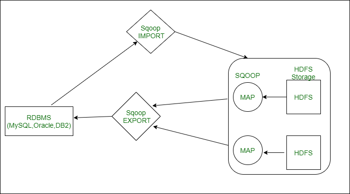
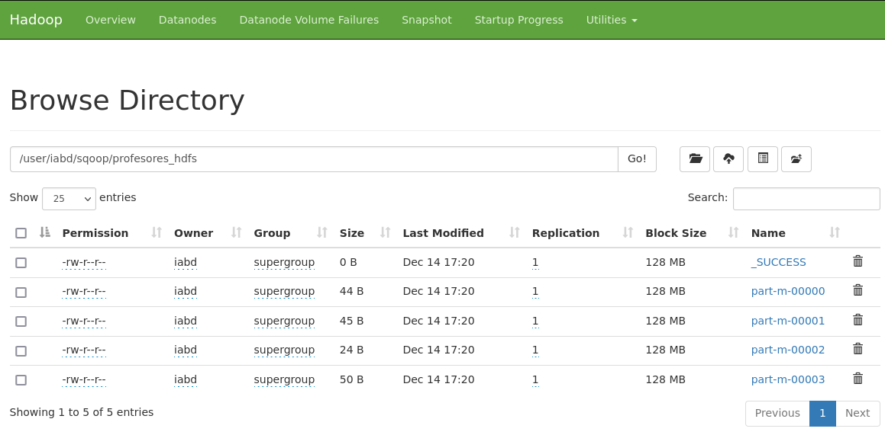
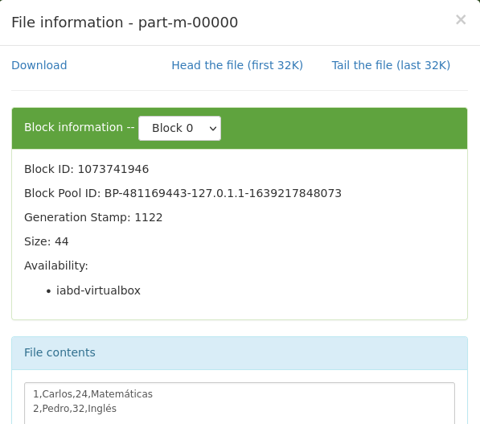

# Sqoop / Flume

Las dos herramientas principales utilizadas para importar/exportar datos en *HDFS* son Sqoop y Flume, las cuales vamos a estudiar a continuación.

## Sqoop

<figure style="float: right;">
    
    <figcaption>Logo de Apache Sqoop</figcaption>
</figure>

*Apache Sqoop* (<https://sqoop.apache.org>) es una herramienta diseñada para transferir de forma eficiente datos crudos entre un cluster de Hadoop y un almacenamiento estructurado, como una base de datos relacional.

!!! caution "Sin continuidad"
    Desde Junio de 2021, el proyecto *Sqoop* ha dejado de mantenerse como proyecto de Apache y forma parte del *ático*. Aún así, creemos conveniente conocer su uso en el estado actual. Gran parte de las funcionalidad que ofrece *Sqoop* se pueden realizar mediante *Nifi* o *Spark*.

Un caso típico de uso es el de cargar los datos en un *data lake*  (ya sea en HDFS o en S3) con datos que importaremos desde una base de datos, como *MariaDB*, *PostgreSQL* o *MongoDB*.

*Sqoop* utiliza una arquitectura basada en conectores, con soporte para *plugins* que ofrecen la conectividad a los sistemas externos, como pueden ser *Oracle* o *SqlServer*. Internamente, Sqoop utiliza los algoritmos *MapReduce* para importar y exportar los datos.

Por defecto, todos los trabajos *Sqoop* ejecutan cuatro mapas de trabajo, de manera que los datos se dividen en cuatro nodos de Hadoop.

!!! info "Instalación"
    Aunque en la máquina virtual con la que trabajamos ya tenemos tanto *Hadoop* como *Sqoop* instalados, podemos descargar la última versión desde <http://archive.apache.org/dist/sqoop/1.4.7/sqoop-1.4.7.bin__hadoop-2.6.0.tar.gz>.

    Se recomienda seguir las instrucciones resumidas que tenemos en <https://www.tutorialspoint.com/sqoop/sqoop_installation.htm> o las de <https://riptutorial.com/sqoop>.

    Un par de aspectos que hemos tenido que modificar en nuestra máquina virtual son:

    * Copiar el [driver de MySQL](resources/mysql-connector-java-5.1.49-bin.jar) en `$SQOOP_HOME/lib`
    * Copiar la librería [commons-langs-2.6](https://repo1.maven.org/maven2/commons-lang/commons-lang/2.6/commons-lang-2.6.jar) en `$SQOOP_HOME/lib`

    Una vez configurado, podemos comprobar que funciona, por ejemplo, consultando las bases de datos que tenemos en MariaDB (aparecen mensajes de *warning* por no tener instalados/configurados algunos productos):

    ```
    sqoop list-databases --connect jdbc:mysql://localhost --username=iabd --password=iabd
    ```

### Importando datos

La sintaxis básica de *Sqoop* para importar datos en HDFS es la siguiente:

``` bash
sqoop import -connect jdbc:mysql://host/nombredb -table <nombreTabla> \
    --username <usuarioMariaDB> --password <passwordMariaDB> -m 2
```

El único parámetro que conviene explicar es `-m 2`, el cual está indicando que utilice dos *mappers* en paralelo para importar los datos. Si no le indicamos este parámetro, como hemos comentado antes, *Sqoop* siempre utilizará cuatro *mappers*.

La importación se realiza en dos pasos:

1. *Sqoop* escanea la base de datos y colecta los metadatos de la tabla a importar.
2. Envía un *job* y transfiere los datos reales utilizando los metadatos necesarios.
3. De forma paralela, cada uno de los *mappers* se encarga de cargar en HDFS una parte proporcional de los datos.

<figure style="align: center;">
    
    <figcaption>Arquitectura de trabajo de Sqoop</figcaption>
</figure>

Los datos importados se almacenan en carpetas de HDFS, pudiendo especificar otras carpetas, así como los caracteres separadores o de terminación de registro. Además, podemos utilizar diferentes formatos, como son Avro, ORC, Parquet, ficheros secuenciales o de tipo texto, para almacenar los datos en HDFS.

### Caso 1 - Importando datos desde MariaDB

En el siguiente caso de uso vamos a importar datos que tenemos en una base de datos de MariaDB a HDFS.

!!! caution "Sqoop y las zonas horarias"
    Cuando se lanza Sqoop captura los *timestamps* de nuestra base de datos origen y las convierte a la hora del sistema servidor por lo que tenemos que especificar en nuestra base de datos la zona horaria.

    Para realizar estos ajustes simplemente editamos el fichero `mysqld.cnf` que se encuentra en `/etc/mysql/my.cnf/` y añadimos la siguiente propiedad para asignarle nuestra zona horaria:

    ``` conf
    [mariabd]
    default_time_zone = 'Europe/Madrid'
    ``` 

Primero, vamos a preparar nuestro entorno. Una vez conectados a *MariaDB*, creamos una base de datos que contenga una tabla con información sobre profesores:

``` sql
create database sqoopCaso1;
use sqoopCaso1;
CREATE TABLE profesores(
    id MEDIUMINT NOT NULL AUTO_INCREMENT,
    nombre CHAR(30) NOT NULL,
    edad INTEGER(30),
    materia CHAR(30),
    PRIMARY KEY (id) );
```

Insertamos datos en la tabla `profesores:`

``` sql
INSERT INTO profesores (nombre, edad, materia) VALUES ("Carlos", 24, "Matemáticas"),
("Pedro", 32, "Inglés"), ("Juan", 35, "Tecnología"), ("Jose", 48, "Matemáticas"),
("Paula", 24, "Informática"), ("Susana", 32, "Informática"), ("Lorena", 54, "Informática");
```

A continuación, arrancamos *HDFS* y *YARN*:

``` bash
start-dfs.sh
start-yarn.sh
```

Con el comando `sqoop list-tables` listamos todas las tablas de la base de datos `sqoopCaso1`:

``` bash
sqoop list-tables --connect jdbc:mysql://localhost/sqoopCaso1 --username=iabd --password=iabd
```

Y finalmente importamos los datos mediante el comando `sqoop import`:

``` bash
sqoop import --connect jdbc:mysql://localhost/sqoopCaso1 \
    --username=iabd --password=iabd \
    --table=profesores --driver=com.mysql.jdbc.Driver \
    --target-dir=/user/iabd/sqoop/profesores_hdfs \
    --fields-terminated-by=',' --lines-terminated-by '\n'
```

En la primera línea, indicamos que vamos a importar datos desde un conexión JDBC, donde se indica el SGBD (`mysql`), el host (`localhost`) y el nombre de la base de datos (`sqoopCaso1`).
En la línea dos, se configuran tanto el usuario como la contraseña del usuario (`iabd` / `iabd`) que se conecta a la base de datos.
En la tercera línea, indicamos la tabla que vamos a leer (`profesores`) y el driver que utilizamos.
En la cuarta línea configuramos el destino HDFS donde se van a importar los datos.
Finalmente, en la última línea, indicamos el separador de los campos y el carácter para separar las líneas.

Si queremos que en el caso de que ya existe la carpeta de destino la borre previamente, añadiremos la opción `--delete-target-dir`.

!!! caution "Unhealthy node"
    Nuestra máquina virtual tiene el espacio limitado a 30GB, y es probable que en algún momento se llene el disco. Además de eliminar archivos no necesarios, una opción es configurar YARN mediante el archivo `yarn-site.xml` y configurar las siguientes propiedades para ser más permisivos con la falta de espacio:

    ```  xml
    <property>
        <name>yarn.nodemanager.disk-health-checker.min-healthy-disks</name>
        <value>0.0</value>
    </property>
    <property>
        <name>yarn.nodemanager.disk-health-checker.max-disk-utilization-per-disk-percentage</name>
        <value>100.0</value>
    </property>
    ```

El resultado que aparece en consola es:

``` log hl_lines="5 6 7 15 20 29-34"
2021-12-14 17:19:04,684 INFO sqoop.Sqoop: Running Sqoop version: 1.4.7
2021-12-14 17:19:04,806 WARN tool.BaseSqoopTool: Setting your password on the command-line is insecure. Consider using -P instead.
2021-12-14 17:19:05,057 WARN sqoop.ConnFactory: Parameter --driver is set to an explicit driver however appropriate connection manager is not being set (via --connection-manager). Sqoop is going to fall back to org.apache.sqoop.manager.GenericJdbcManager. Please specify explicitly which connection manager should be used next time.
2021-12-14 17:19:05,087 INFO manager.SqlManager: Using default fetchSize of 1000
2021-12-14 17:19:05,087 INFO tool.CodeGenTool: Beginning code generation
2021-12-14 17:19:05,793 INFO manager.SqlManager: Executing SQL statement: SELECT t.* FROM profesores AS t WHERE 1=0
2021-12-14 17:19:05,798 INFO manager.SqlManager: Executing SQL statement: SELECT t.* FROM profesores AS t WHERE 1=0
2021-12-14 17:19:05,877 INFO orm.CompilationManager: HADOOP_MAPRED_HOME is /opt/hadoop-3.3.1
Note: /tmp/sqoop-iabd/compile/585dc8a5a92b80ebbd22c9f597dd1928/profesores.java uses or overrides a deprecated API.
Note: Recompile with -Xlint:deprecation for details.
2021-12-14 17:19:12,153 INFO orm.CompilationManager: Writing jar file: /tmp/sqoop-iabd/compile/585dc8a5a92b80ebbd22c9f597dd1928/profesores.jar
2021-12-14 17:19:12,235 INFO mapreduce.ImportJobBase: Beginning import of profesores
2021-12-14 17:19:12,240 INFO Configuration.deprecation: mapred.job.tracker is deprecated. Instead, use mapreduce.jobtracker.address
2021-12-14 17:19:12,706 INFO Configuration.deprecation: mapred.jar is deprecated. Instead, use mapreduce.job.jar
2021-12-14 17:19:12,714 INFO manager.SqlManager: Executing SQL statement: SELECT t.* FROM profesores AS t WHERE 1=0
2021-12-14 17:19:14,330 INFO Configuration.deprecation: mapred.map.tasks is deprecated. Instead, use mapreduce.job.maps
2021-12-14 17:19:14,608 INFO client.DefaultNoHARMFailoverProxyProvider: Connecting to ResourceManager at iabd-virtualbox/127.0.1.1:8032
2021-12-14 17:19:16,112 INFO mapreduce.JobResourceUploader: Disabling Erasure Coding for path: /tmp/hadoop-yarn/staging/iabd/.staging/job_1639498733738_0001
2021-12-14 17:19:22,016 INFO db.DBInputFormat: Using read commited transaction isolation
2021-12-14 17:19:22,018 INFO db.DataDrivenDBInputFormat: BoundingValsQuery: SELECT MIN(id), MAX(id) FROM profesores
2021-12-14 17:19:22,022 INFO db.IntegerSplitter: Split size: 1; Num splits: 4 from: 1 to: 7
2021-12-14 17:19:22,214 INFO mapreduce.JobSubmitter: number of splits:4
2021-12-14 17:19:22,707 INFO mapreduce.JobSubmitter: Submitting tokens for job: job_1639498733738_0001
2021-12-14 17:19:22,707 INFO mapreduce.JobSubmitter: Executing with tokens: []
2021-12-14 17:19:23,390 INFO conf.Configuration: resource-types.xml not found
2021-12-14 17:19:23,391 INFO resource.ResourceUtils: Unable to find 'resource-types.xml'.
2021-12-14 17:19:24,073 INFO impl.YarnClientImpl: Submitted application application_1639498733738_0001
2021-12-14 17:19:24,300 INFO mapreduce.Job: The url to track the job: http://iabd-virtualbox:8088/proxy/application_1639498733738_0001/
2021-12-14 17:19:24,303 INFO mapreduce.Job: Running job: job_1639498733738_0001
2021-12-14 17:19:44,015 INFO mapreduce.Job: Job job_1639498733738_0001 running in uber mode : false
2021-12-14 17:19:44,017 INFO mapreduce.Job:  map 0% reduce 0%
2021-12-14 17:20:21,680 INFO mapreduce.Job:  map 50% reduce 0%
2021-12-14 17:20:23,707 INFO mapreduce.Job:  map 100% reduce 0%
2021-12-14 17:20:24,736 INFO mapreduce.Job: Job job_1639498733738_0001 completed successfully
2021-12-14 17:20:24,960 INFO mapreduce.Job: Counters: 34
        File System Counters
                FILE: Number of bytes read=0
                FILE: Number of bytes written=1125124
                FILE: Number of read operations=0
                FILE: Number of large read operations=0
                FILE: Number of write operations=0
                HDFS: Number of bytes read=377
                HDFS: Number of bytes written=163
                HDFS: Number of read operations=24
                HDFS: Number of large read operations=0
                HDFS: Number of write operations=8
                HDFS: Number of bytes read erasure-coded=0
        Job Counters 
                Killed map tasks=1
                Launched map tasks=4
                Other local map tasks=4
                Total time spent by all maps in occupied slots (ms)=139377
                Total time spent by all reduces in occupied slots (ms)=0
                Total time spent by all map tasks (ms)=139377
                Total vcore-milliseconds taken by all map tasks=139377
                Total megabyte-milliseconds taken by all map tasks=142722048
        Map-Reduce Framework
                Map input records=7
                Map output records=7
                Input split bytes=377
                Spilled Records=0
                Failed Shuffles=0
                Merged Map outputs=0
                GC time elapsed (ms)=1218
                CPU time spent (ms)=5350
                Physical memory (bytes) snapshot=560439296
                Virtual memory (bytes) snapshot=10029588480
                Total committed heap usage (bytes)=349175808
                Peak Map Physical memory (bytes)=142544896
                Peak Map Virtual memory (bytes)=2507415552
        File Input Format Counters 
                Bytes Read=0
        File Output Format Counters 
                Bytes Written=163
2021-12-14 17:20:24,979 INFO mapreduce.ImportJobBase: Transferred 163 bytes in 70,589 seconds (2,3091 bytes/sec)
2021-12-14 17:20:24,986 INFO mapreduce.ImportJobBase: Retrieved 7 records.
```

Vamos a repasar la salida del log para entender el proceso:

* En la línea 5 vemos como se lanza el generador de código.
* En las líneas 6, 7 y 15 vemos como ejecuta la consulta para obtener todos los datos de profesores.
* En la línea 20 obtiene los valores mínimo y máximo para calcular como dividir los datos.
* De las líneas 29 a la 34 se ejecuta el proceso *MapReduce*.
* En el resto se puede observar un resumen estadístico.

Si accedemos al interfaz gráfico de YARN (en `http://iabd-virtualbox:8088/cluster`) podemos ver cómo aparece el proceso como realizado:

<figure style="align: center;">
    
    <figcaption>Estado de YARN tras la importación</figcaption>
</figure>

Si accedemos al interfaz gráfico de Hadoop (recuerda que puedes acceder a él mediante `http://localhost:9870`) podremos comprobar en el directorio `/user/iabd/sqoop` que ha creado el directorio que hemos especificado junto con los siguientes archivos:

<figure style="align: center;">
    
    <figcaption>Contenido de /user/iabd/sqoop/profesores_hdfs</figcaption>
</figure>

Si entramos a ver los datos, podemos visualizar el contenido del primer fragmento que contiene los primeros datos de la tabla:

<figure style="align: center;">
    
    <figcaption>Contenido de part-m-0000</figcaption>
</figure>

### Caso 2 - Exportando datos a MariaDB

Ahora vamos a hacer el paso contrario, desde HDFS vamos a exportar los ficheros a otra tabla. Así pues, primero vamos a crear la nueva tabla en una nueva base de datos (aunque podíamos haber reutilizado la base de datos):

``` sql
create database sqoopCaso2;
use sqoopCaso2;
CREATE TABLE profesores2(
    id MEDIUMINT NOT NULL AUTO_INCREMENT,
    nombre CHAR(30) NOT NULL,
    edad INTEGER(30),
    materia CHAR(30),
    PRIMARY KEY (id) );
```

Para exportar los datos de HDFS y cargarlos en esta nueva tabla lanzamos la siguiente orden:

``` bash
sqoop export --connect jdbc:mysql://localhost/sqoopCaso2 \
    --username=iabd --password=iabd \
    --table=profesores2 --export-dir=/user/iabd/sqoop/profesores_hdfs
```

### Formatos Avro y Parquet

Sqoop permite trabajar con diferentes formatos, tanto *Avro* como *Parquet*.

*Avro* es un formato de almacenamiento basado en filas para *Hadoop* que se usa ampliamente como formato de serialización. Recuerda que *Avro* almacena la estructura en formato JSON y los datos en binario.

*Parquet* a su vez es un formato de almacenamiento binario basado en columnas que puede almacenar estructuras de datos anidados.

!!! warning "Avro y Hadoop"
    Para que funcione la serialización con *Avro* hay que copiar el fichero `.jar` que viene en el directorio de `Sqoop` para *Avro* como librería de *Hadoop*, mediante el siguiente comando:

    ``` bash
    cp $SQOOP_HOME/lib/avro-1.8.1.jar $HADOOP_HOME/share/hadoop/common/lib/
    rm $HADOOP_HOME/share/hadoop/common/lib/avro-1.7.7.jar
    ```

    En nuestra máquina virtual este paso ya está realizado.

Para importar los datos en formato **Avro**, añadiremos la opción `--as-avrodatafile`:

``` bash
sqoop import --connect jdbc:mysql://localhost/sqoopCaso1    \
    --username=iabd --password=iabd \
    --table=profesores --driver=com.mysql.jdbc.Driver   \
    --target-dir=/user/iabd/sqoop/profesores_avro --as-avrodatafile
```

Si en vez de *Avro*, queremos importar los datos en formato **Parquet** cambiamos el último parámetro por `--as-parquetfile`:

``` bash
sqoop import --connect jdbc:mysql://localhost/sqoopCaso1    \
    --username=iabd --password=iabd \
    --table=profesores --driver=com.mysql.jdbc.Driver   \
    --target-dir=/user/iabd/sqoop/profesores_parquet --as-parquetfile
```

Si queremos comprobar los archivos, podemos acceder via HDFS y la opción `-ls`:

``` bash
hdfs dfs -ls /user/iabd/sqoop/profesores_avro
```

Obteniendo:

``` console
Found 5 items
-rw-r--r--   1 iabd supergroup          0 2021-12-14 17:56 /user/iabd/sqoop/profesores_avro/_SUCCESS
-rw-r--r--   1 iabd supergroup        568 2021-12-14 17:56 /user/iabd/sqoop/profesores_avro/part-m-00000.avro
-rw-r--r--   1 iabd supergroup        569 2021-12-14 17:56 /user/iabd/sqoop/profesores_avro/part-m-00001.avro
-rw-r--r--   1 iabd supergroup        547 2021-12-14 17:56 /user/iabd/sqoop/profesores_avro/part-m-00002.avro
-rw-r--r--   1 iabd supergroup        574 2021-12-14 17:56 /user/iabd/sqoop/profesores_avro/part-m-00003.avro
```

Si queremos ver el contenido de una de las partes, utilizamos la opción `-text`:

``` bash
hdfs dfs -text /user/iabd/sqoop/profesores_avro/part-m-00000.avro
```

Obteniendo el esquema y los datos en formato *Avro*:

``` avro
{"id":{"int":1},"nombre":{"string":"Carlos"},"edad":{"int":24},"materia":{"string":"Matemáticas"}}
{"id":{"int":2},"nombre":{"string":"Pedro"},"edad":{"int":32},"materia":{"string":"Inglés"}}
```

!!! question "Autoevaluación"
    ¿Qué sucede si ejectuamos el comando `hdfs dfs -tail /user/iabd/sqoop/profesores_avro/part-m-00000.avro`? ¿Por qué aparece contenido en binario?

En el caso de ficheros *Parquet*, primero listamos los archivos generados:

``` bash
hdfs dfs -ls /user/iabd/sqoop/profesores_parquet
```

Obteniendo:

``` console
Found 6 items
drwxr-xr-x   - iabd supergroup          0 2021-12-15 16:13 /user/iabd/sqoop/profesores_parquet/.metadata
drwxr-xr-x   - iabd supergroup          0 2021-12-15 16:14 /user/iabd/sqoop/profesores_parquet/.signals
-rw-r--r--   1 iabd supergroup       1094 2021-12-15 16:14 /user/iabd/sqoop/profesores_parquet/12205ee4-6e63-4c0d-8e64-751882d60179.parquet
-rw-r--r--   1 iabd supergroup       1114 2021-12-15 16:14 /user/iabd/sqoop/profesores_parquet/1e12aaad-98c6-4508-9c41-e1599e698385.parquet
-rw-r--r--   1 iabd supergroup       1097 2021-12-15 16:14 /user/iabd/sqoop/profesores_parquet/6a803503-f3e0-4f2a-8546-a337f7f90e73.parquet
-rw-r--r--   1 iabd supergroup       1073 2021-12-15 16:14 /user/iabd/sqoop/profesores_parquet/eda459b2-1da4-4790-b649-0f2f8b83ab06.parquet
```

Podemos usar las `parquet-tools` para ver su contenido. Si la instalamos mediante `pip install parquet-tools`, podremos acceder a ficheros locales y almacenados en S3. Si queremos acceder de forma remota via HDFS, podemos descargar la [versión Java](https://repo1.maven.org/maven2/org/apache/parquet/parquet-tools/1.11.2/parquet-tools-1.11.2.jar) y utilizarla mediante `hadoop` (aunque da problemas entre las versiones de Sqoop y Parquet):

``` bash
hadoop jar parquet-tools-1.11.2.jar head -n5 hdfs://iabd-virtualbox:9000/user/iabd/sqoop/profesores_parquet/12205ee4-6e63-4c0d-8e64-751882d60179.parquet
```

Si queremos obtener información sobre los documentos, usaremos la opción `meta`:

``` bash
hadoop jar parquet-tools-1.11.2.jar meta hdfs://iabd-virtualbox:9000/user/iabd/sqoop/profesores_parquet/12205ee4-6e63-4c0d-8e64-751882d60179.parquet
```

Más información sobre *parquet-tools* en <https://pypi.org/project/parquet-tools/>.

### Trabajando con datos comprimidos

En un principio, vamos a trabajar siempre con los datos sin comprimir. Cuando tengamos datos que vamos a utilizar durante mucho tiempo (del orden de varios años) es cuando nos plantearemos comprimir los datos.

Por defecto, podemos comprimir mediante el formato **gzip**:

``` bash
sqoop import --connect jdbc:mysql://localhost/sqoopCaso1 \
    --username=iabd --password=iabd \
    --table=profesores --driver=com.mysql.jdbc.Driver \
    --target-dir=/user/iabd/sqoop/profesores_gzip \
    --compress
```

Si en cambio queremos comprimirlo con formato **bzip2**:

``` bash
sqoop import --connect jdbc:mysql://localhost/sqoopCaso1 \
    --username=iabd --password=iabd \
    --table=profesores --driver=com.mysql.jdbc.Driver \
    --target-dir=/user/iabd/sqoop/profesores_bzip \
    --compress --compression-codec bzip2
```

<!--
    --compression-codec org.apache.hadoop.io.compress.BZip2Codec --as-sequencefile 
-->

**Snappy** es una biblioteca de compresión y descompresión de datos de gran rendimiento que se utiliza con frecuencia en proyectos Big Data. Así pues, para utilizarlo lo indicaremos mediante el codec `snappy`:

``` bash
sqoop import --connect jdbc:mysql://localhost/sqoopCaso1 \
    --username=iabd --password=iabd \
    --table=profesores --driver=com.mysql.jdbc.Driver \
    --target-dir=/user/iabd/sqoop/profesores_snappy \
    --compress --compression-codec snappy
```

<!--
--compression-codec org.apache.hadoop.io.compress.SnappyCodec
-->

### Importando con filtros

Además de poder importar todos los datos de una tabla, podemos filtrar los datos. Por ejemplo, podemos indicar mediante la opción `--where` el filtro a ejecutar en la consulta:

``` bash
sqoop import --connect jdbc:mysql://localhost/sqoopCaso1 \
    --username=iabd --password=iabd \
    --table=profesores --driver=com.mysql.jdbc.Driver \
    --target-dir=/user/iabd/sqoop/profesores_materia_info \
    --where "materia='Informática'"
```

También podemos restringir las columnas que queremos recuperar mediante la opción `--columns`:

``` bash
sqoop import --connect jdbc:mysql://localhost/sqoopCaso1 \
    --username=iabd --password=iabd \
    --table=profesores --driver=com.mysql.jdbc.Driver \
    --target-dir=/user/iabd/sqoop/profesores_cols \
    --columns "nombre,materia"
```

Finalmente, podemos especificar una consulta con clave de particionado (en este caso, ya no indicamos el nombre de la tabla):

``` bash
sqoop import --connect jdbc:mysql://localhost/sqoopCaso1 \
    --username=iabd --password=iabd \
    --driver=com.mysql.jdbc.Driver \
    --target-dir=/user/iabd/sqoop/profesores_query \
    --query "select * from profesores where edad > 40 AND \$CONDITIONS" \
    --split-by "id"
```

En la consulta, hemos de añadir el token `\$CONDITIONS`, el cual Hadoop substituirá por la columna por la que realiza el particionado.

### Importación incremental

Si utilizamos procesos *batch*, es muy común realizar importaciones incrementales tras una carga de datos. Para ello, utilizaremos las opciones `--incremental append` junto con la columna a comprobar mediante `--check-column` y el último registro cargado mediante `--last-value`:

``` bash
sqoop import --connect jdbc:mysql://localhost/sqoopCaso1 \
    --username=iabd --password=iabd \
    --table=profesores --driver=com.mysql.jdbc.Driver \
    --target-dir=/user/iabd/sqoop/profesores_inc \
    --incremental append \
    --check-column id \
    --last-value 4
```

Después de ejecutarlo, si vemos la información que nos devuelve, en las últimas líneas, podemos copiar los parámetros que tenemos que utilizar para posteriores importaciones.

``` console
...
2021-12-15 19:10:59,348 INFO tool.ImportTool: Incremental import complete! To run another incremental import of all data following this import, supply the following arguments:
2021-12-15 19:10:59,348 INFO tool.ImportTool:  --incremental append
2021-12-15 19:10:59,348 INFO tool.ImportTool:   --check-column id
2021-12-15 19:10:59,348 INFO tool.ImportTool:   --last-value 7
2021-12-15 19:10:59,349 INFO tool.ImportTool: (Consider saving this with 'sqoop job --create')
```

### Trabajando con Hive

Podemos importar los datos en HDFS para que luego puedan ser consultables desde *Hive*. Para ello hemos de utilizar el parámetro `--hive-import` e indicar el nombre de la base de datos mediante `--hive-database` así como la opción de `--create-hive-table`para que cree la tabla indicada en el parámetro `hive-table`.

Es importante destacar que ya no ponemos destino con `target-dir`:

``` bash
sqoop import --connect jdbc:mysql://localhost/sqoopCaso1 \
    --username=iabd --password=iabd \
    --table=profesores --driver=com.mysql.jdbc.Driver \
    --hive-import --hive-database default \
    --create-hive-table --hive-table profesores_mariadb
```

Para comprobar el resultado, dentro de *Hive* ejecutaremos el comando:

``` sql
describe formatted profesores_mariadb
```

Para exportar los datos, de forma similar haremos:

``` bash
sqoop export --connect jdbc:mysql://localhost/sqoopCaso2 \
    --username=iabd --password=iabd \
    --table=profesores2 --driver=com.mysql.jdbc.Driver \
    --h-catalog-table profesores_mariadb
```

## Flume

<figure style="float: right;">
    
    <figcaption>Logo de Apache Flume</figcaption>
</figure>

Allá por el año 2010 *Cloudera* presentó ***Flume*** que posteriormente pasó a formar parte de Apache (<https://flume.apache.org/>) como un software para tratamiento e ingesta de datos masivo. *Flume* permite crear desarrollos complejos que permiten el tratamiento en *streaming* de datos masivos.

*Flume* funciona como un buffer entre los productores de datos y el destino final. Al utilizar un buffer, evitamos que un productor sature a un consumidor, sin necesidad de preocuparnos de que algún destino esté inalcanzable o inoperable (por ejemplo, en el caso de que haya caído HDFS), etc...

!!! info "Instalación"
    Aunque en la máquina virtual con la que trabajamos también tenemos instalado *Flume*, podemos descargar la última versión desde <http://www.apache.org/dyn/closer.lua/flume/1.9.0/apache-flume-1.9.0-bin.tar.gz>.

    A nivel de configuración sólo hemos definido la variable de entorno `$FLUME_HOME` que apunta a `/opt/flume-1.9.0`.

### Arquitectura

Su arquitectura es sencilla, y se basa en el uso de agentes que se dividen en tres componentes los cuales podemos configurar:

* *Source* (fuente): Fuente de origen de los datos, ya sea *Twitter*, *Kafka*, una petición *Http*, etc...  
Las fuentes son un componente activo que recibe datos desde otra aplicación que produce datos (aunque también existen fuentes que pueden producir datos por sí mismos, cuyo objetivo es poder probar ciertos flujos de datos). Las fuentes puedes escuchar uno o más puertos de red para recibir o leer datos del sistema de arhcivos. Cada fuente debe conectar a al menos un canal. Una fuente puede escribir en varios canales, replicando los eventos a todos o algunos canales en base a algún criterio.
* *Channel* (canal): la vía por donde se tratarán los datos.  
Un canal es un componente pasivo que almacena los datos como un buffer. Se comportan como colas, donde las fuentes publican y los sumideros consumen los datos. Múltiples fuentes pueden escribir de forma segura en el mismo canal, y múltiples sumideros pueden leer desde el mismo canal. Sin embargo, cada sumidero sólo puede leer de un único canal. Si múltiples sumideros leen del mismo canal, sólo uno de ellos leerá el dato.
* *Sink* (sumidero): persistencia/movimiento de los datos, a ficheros / base de datos.  
Toma eventos del canal de manera continua leyendo y eliminando los eventos. A continuación, los transmite hacia el siguiente componente, ya sea a HDFS, Hive, etc... Una vez los datos han llegado al siguiente destino, el sumidero informa al canal mediante un *commit transaccional* para que elimine dichos eventos del canal.

<figure style="align: center">
    
    <figcaption>Arquitectura Flume - imagen extraída de https://www.diegocalvo.es/flume/</figcaption>
</figure>

Es muy recomendable acceder a la [guía de usuario](https://flume.apache.org/FlumeUserGuide.html) oficial para consultar todas las fuentes de datos, canales y sumideros disponibles en la actualidad. A continuación se nombran algunos de los más destacados:

| Sources                   | Channels              | Sinks |
| ------                    | ------                | ----- |
| Avro Source               | Memory Channel        | HDFS Sink |
| Thrift Source             | JDBC Channel          | Hive Sink |
| Exec Source               | Kafka Channel         | Logger Sink |
| JMS Source                | File Channel          |  Avro Sink |
| Spooling Directory Source | Spillable Memory Channel      | Thrift Sink |
| Twitter 1% firehose Source | Pseudo Transaction Channel   | Kafka Sink |
| Kafka Source              |                       | File Roll Sink |
| NetCat Source             |                       | Null Sink |
| Sequence Generator Source |                       | HBaseSink |
| Syslog Sources            |                       | AsyncHBaseSink |
| HTTP Source               |                       | MorphlineSolrSink |
| Multiport Syslog TCP Source |                     | ElasticSearchSink |
| Syslog UDP Source         |                       | Kite Dataset Sink |

*Flume* se complica cuando queremos utilizarlo para obtener datos de manera paralela (o multiplexada) y/o necesitamos crear nuestros propios sumideros o interceptores. Pero por lo general, su uso es sencillo y se trata de una herramienta muy recomendada como ayuda/alternativa a herramientas como *Pentaho*.

Algunas de sus características son:

* Diseño flexible basado en flujos de datos de transmisión.
* Resistente a fallos y robusto con múltiples conmutaciones por error y  mecanismos de recuperación.
* Lleva datos desde origen a destino: incluidos HDFS y *HBase*.

#### Agentes

Un agente es la unidad más sencilla con la que trabaja *Flume*, permitiendo conectar un agente *Flume* a uno o más agentes, encandenándolos. Además, un agente puede recibir datos de uno o más agentes. Conectando múltiples agentes entre sí podemos crear un flujo de datos para mover datos de un lugar a otro, de aplicaciones que producen datos a HDFS, HBase o donde necesitemos.

Para lanzar un tarea en *Flume*, debemos definir un agente, el cual funciona como un contenedor para alojar subcomponentes que permiten mover los datos.

Estos agentes tienen cuatro partes bien diferenciadas asociadas a la arquitectura de Flume. En la primera parte, definiremos los componente del agente (*sources*, *channels* y *sinks*), y luego, para cada uno de ellos, configuraremos sus propiedades:

* `sources`: responsables de colocar los eventos/datos en el agente
* `channels`: *buffer* que almacena los eventos/datos recibidos por los *sources* hasta que un *sink* lo saca para enviarlo al siguiente destino.
* `sinks`: responsable de sacar los eventos/datos del agente y reenviarlo al siguiente agente (HDFS, HBase, etc...)

#### Evento

El evento es la unidad más pequeña del procesamiento de eventos de Flume. Cuando Flume lee una fuente de datos, envuelve una fila de datos (es decir, encuentra los saltos de línea) en un evento.

Un evento es una estructura de datos que se compone de dos partes:

* Encabezado, se utiliza principalmente para registrar información mediante un mapa en forma de clave y valor. No transfieren datos, pero contienen información util para el enrutado y gestión de la prioridad o importancia de los mensajes.
* Cuerpo: array de bytes que almacena los datos reales.

### Probando Flume

Por ejemplo, vamos a crear un agente el cual llamaremos `ExecLoggerAgent` el cual va a ejecutar un comando y mostrará el resultado por el log de *Flume*.

Para ello, creamos la configuración del agente en el fichero `agente.conf` (todas las propiedades comenzarán con el nombre del agente):

``` properties title="agente.conf"
# Nombramos los componentes del agente
ExecLoggerAgent.sources = Exec
ExecLoggerAgent.channels = MemChannel
ExecLoggerAgent.sinks = LoggerSink

# Describimos el tipo de origen
ExecLoggerAgent.sources.Exec.type = exec
ExecLoggerAgent.sources.Exec.command = ls /home/iabd/

# Describimos el destino
ExecLoggerAgent.sinks.LoggerSink.type = logger

# Describimos la configuración del canal
ExecLoggerAgent.channels.MemChannel.type = memory
ExecLoggerAgent.channels.MemChannel.capacity = 1000
ExecLoggerAgent.channels.MemChannel.transactionCapacity = 100

# Unimos el origen y el destino a través del canal
ExecLoggerAgent.sources.Exec.channels = MemChannel
ExecLoggerAgent.sinks.LoggerSink.channel = MemChannel
```

Antes de lanzar el agente Flume, recuerda que debes arrancar tanto *Hadoop* como *YARN*, por ejemplo, mediante el comando `start-all.sh`.

A continuación ya podemos lanzar *Flume* con el agente mediante el comando (la opción `-n` sirve para indicar el nombre del agente, y con `-f` indicamos el nombre del archivo de configuración):

``` bash
flume-ng agent -n ExecLoggerAgent -f agente.conf 
```

### Configurando un agente

Si te has fijado en el ejemplo anterior, los ficheros de configuración de los agentes siguen el mismo formato.
Para definir un flujo dentro de un agente, necesitamos enlazar las fuentes y los sumideros con un canal. Para ello, listaremos las fuentes, sumideros y canales del agente, y entonces apuntaremos la fuente y el sumidero a un canal.

!!! important "1 - N - 1"
    Una fuente puede indicar múltiples canales, pero un sumidero sólo puede indicar un único canal.

Así pues, el formato será similar al siguiente archivo:

``` properties
# Listamos las fuentes, sumideros y canales
<Agent>.sources = <Source>
<Agent>.sinks = <Sink>
<Agent>.channels = <Channel1> <Channel2>

# Configuramos los canales de la fuente
<Agent>.sources.<Source>.channels = <Channel1> <Channel2> ...

# Configuramos el canal para el sumidero
<Agent>.sinks.<Sink>.channel = <Channel1>
```

Además de definir el flujo, es necesario configurar las propiedades de cada fuente, sumidero y canal. Para elo se sigue la misma nomenclatura donde fijamos el tipo de componente (mediante la propiedad `type`) y el resto de propiedades específicas de cada componente:

``` properties
# Propiedades de las fuentes
<Agent>.sources.<Source>.<someProperty> = <someValue>

# Propiedades de los canales
<Agent>.channel.<Channel>.<someProperty> = <someValue>

# Propiedades de los sumideros
<Agent>.sources.<Sink>.<someProperty> = <someValue>
```

Para cada tipo de [fuente](https://flume.apache.org/FlumeUserGuide.html#flume-sources), [canal](https://flume.apache.org/FlumeUserGuide.html#flume-channels) y [sumidero](https://flume.apache.org/FlumeUserGuide.html#flume-sinks) es recomendable revisar la documentación para validar todas las propiedades disponibles.

### Caso 3a - Almacenando en HDFS

En este caso de uso vamos [generar datos de forma secuencial](https://flume.apache.org/FlumeUserGuide.html#sequence-generator-source) y los vamos a ingestar en [HDFS](https://flume.apache.org/FlumeUserGuide.html#hdfs-sink).

Una buena práctica es colocar los archivos de configuración dentro de `$FLUME_HOME/conf`. Así pues, vamos a crear el agente `SeqGenAgent` y almacenar la configuración en el fichero `seqgen.conf`:

``` properties title="seqgen.conf"
# Nombramos a los componentes del agente
SeqGenAgent.sources = SeqSource
SeqGenAgent.channels = MemChannel
SeqGenAgent.sinks = HDFS

# Describimos el tipo de origen
SeqGenAgent.sources.SeqSource.type = seq

# Describimos el destino
SeqGenAgent.sinks.HDFS.type = hdfs
SeqGenAgent.sinks.HDFS.hdfs.path = hdfs://iabd-virtualbox:9000/user/iabd/flume/seqgen_data/
SeqGenAgent.sinks.HDFS.hdfs.filePrefix = flume-caso3-seqgen
SeqGenAgent.sinks.HDFS.hdfs.rollInterval = 0
SeqGenAgent.sinks.HDFS.hdfs.rollCount = 1000
SeqGenAgent.sinks.HDFS.hdfs.fileType = DataStream

# Describimos la configuración del canal
SeqGenAgent.channels.MemChannel.type = memory
SeqGenAgent.channels.MemChannel.capacity = 1000
SeqGenAgent.channels.MemChannel.transactionCapacity = 100

# Unimos el origen y el destino a través del canal
SeqGenAgent.sources.SeqSource.channels = MemChannel
SeqGenAgent.sinks.HDFS.channel = MemChannel
```

Ejecutamos el siguiente comando desde `$FLUME_HOME` y a los pocos segundo lo paramos mediante `CTRL + C` para que detenga la generación de números, ya que si no seguirá generando archivos en HDFS:

``` bash
./bin/flume-ng agent --conf ./conf/ --conf-file conf/seqgen.conf \
    --name SeqGenAgent \
    -Dflume.root.logger=INFO,console
```

!!! caution "Vaciando HDFS"
    Si queremos eliminar los ficheros generados en HDFS, recuerda que puedes realizar un borrado recursivo mediante el comando:

    ``` bash
    hdfs dfs -rm -r /user/iabd/flume
    ```

Si comprobamos por ejemplo el contenido de la carpeta (`hdfs dfs -ls /user/iabd/flume/seqgen_data`) veremos que se han generado múltiples archivos:

``` ls
Found 10 items
-rw-r--r--   1 iabd supergroup       1402 2021-12-22 16:42 /user/iabd/flume/seqgen_data/flume-caso3-seqgen.1640187740933
-rw-r--r--   1 iabd supergroup       1368 2021-12-22 16:42 /user/iabd/flume/seqgen_data/flume-caso3-seqgen.1640187740934
-rw-r--r--   1 iabd supergroup       1350 2021-12-22 16:42 /user/iabd/flume/seqgen_data/flume-caso3-seqgen.1640187740935
-rw-r--r--   1 iabd supergroup       1280 2021-12-22 16:42 /user/iabd/flume/seqgen_data/flume-caso3-seqgen.1640187740936
-rw-r--r--   1 iabd supergroup       1280 2021-12-22 16:42 /user/iabd/flume/seqgen_data/flume-caso3-seqgen.1640187740937
-rw-r--r--   1 iabd supergroup       1280 2021-12-22 16:42 /user/iabd/flume/seqgen_data/flume-caso3-seqgen.1640187740938
-rw-r--r--   1 iabd supergroup       1280 2021-12-22 16:42 /user/iabd/flume/seqgen_data/flume-caso3-seqgen.1640187740939
-rw-r--r--   1 iabd supergroup       1280 2021-12-22 16:42 /user/iabd/flume/seqgen_data/flume-caso3-seqgen.1640187740940
-rw-r--r--   1 iabd supergroup       1280 2021-12-22 16:42 /user/iabd/flume/seqgen_data/flume-caso3-seqgen.1640187740941
-rw-r--r--   1 iabd supergroup       1280 2021-12-22 16:42 /user/iabd/flume/seqgen_data/flume-caso3-seqgen.1640187740942
```

Y si comprobamos el contenido del primero (`hdfs dfs -cat /user/iabd/flume/seqgen_data/flume-caso3-seqgen.1640187740933`) veremos como contiene la secuencia generada:

``` log
0
1
2
3
...
```

### Caso 3b - De Netcat a HDFS

Ahora vamos a crear otro ejemplo de generación de información, pero esta vez, en vez que utilizar la memoria del servidor como canal, vamos a utilizar el sistema de archivos. Además, para generar la información nos basamos en una fuente [Netcat](https://flume.apache.org/FlumeUserGuide.html#netcat-tcp-source), en la cual debemos especificar un puerto de escucha. Mediante esta fuente, *Flume* quedará a la escucha en dicho puerto y recibirá cada línea introducida como un evento individual que transferirá al canal especificado.

En el mismo directorio `$FLUME_HOME\conf`, creamos un nuevo fichero con el nombre `netcat.conf` y creamos otro agente que se va a encargar de generar información:

``` properties title="netcat.conf"
# Nombramos a los componentes del agente
NetcatAgent.sources = Netcat
NetcatAgent.channels = FileChannel
NetcatAgent.sinks = HdfsSink

# Describimos el origen netcat en localhost:44444
NetcatAgent.sources.Netcat.type = netcat
NetcatAgent.sources.Netcat.bind = localhost
NetcatAgent.sources.Netcat.port = 44444
NetcatAgent.sources.Netcat.channels = FileChannel

# Describimos el destino en HDFS
NetcatAgent.sinks.HdfsSink.type = hdfs
NetcatAgent.sinks.HdfsSink.hdfs.path = hdfs://iabd-virtualbox:9000/user/iabd/flume/net_data/
NetcatAgent.sinks.HdfsSink.hdfs.writeFormat = Text
NetcatAgent.sinks.HdfsSink.hdfs.fileType = DataStream
NetcatAgent.sinks.HdfsSink.channel = FileChannel

# Unimos el origen y el destino a través del canal de fichero
NetcatAgent.channels.FileChannel.type = file
NetcatAgent.channels.FileChannel.dataDir = /home/iabd/flume/data
NetcatAgent.channels.FileChannel.checkpointDir = /home/iabd/flume/checkpoint
```

Lanzamos al agente:

``` bash
./bin/flume-ng agent --conf ./conf/ --conf-file ./conf/netcat.conf \
    --name NetcatAgent \
    -Dflume.root.logger=INFO,console
```

En una nueva pestaña introducimos el siguiente comando y escribimos

``` bash
curl telnet://localhost:44444
```

Una vez conectados, escribimos varias frases con saltos de línea. Por cada vez que pulsamos *Enter*, nos aparecerá un `OK`.

``` netcat
Probando Netcat
OK
Esto parece que funciona más o menos
OK
```

A continuación, nos vamos al navegador web de HDFS (<http://iabd-virtualbox:9870/explorer.html#/user/iabd/flume/net_data>) y comprobamos que se ha creado el fichero:

<figure style="align: center">
    
    <figcaption>Resultado del flujo Netcat-HDFS</figcaption>
</figure>

### Caso 4 - Flujos encadenados

Es muy común definir un pipeline de flujos encadenados, uniendo la salida de un agente a la entrada de otro. Para ello, utilizaremos como enlace un [sink](https://flume.apache.org/FlumeUserGuide.html#avro-sink)-[source](https://flume.apache.org/FlumeUserGuide.html#avro-source) de tipo *Avro*. Este diseño también se conoce como flujo *Multi-hop*:

<figure style="align: center">
    
    <figcaption>Encadenando flujos</figcaption>
</figure>

En este caso, vamos a crear un primer agente (`NetcatAvroAgent`) que ingeste datos desde *Netcat* y los coloque en un *sink* de tipo *Avro*. Para ello, creamos el agente `netcat-avro.conf`:

``` properties title="netcat-avro.conf"
# Nombramos a los componentes del agente
NetcatAvroAgent.sources = Netcat
NetcatAvroAgent.channels = FileChannel
NetcatAvroAgent.sinks = AvroSink

# Describimos el origen netcat en localhost:44444
NetcatAvroAgent.sources.Netcat.type = netcat
NetcatAvroAgent.sources.Netcat.bind = localhost
NetcatAvroAgent.sources.Netcat.port = 44444

# Describimos el destino como Avro en localhost:10003
NetcatAvroAgent.sinks.AvroSink.type = avro
NetcatAvroAgent.sinks.AvroSink.hostname = localhost
NetcatAvroAgent.sinks.AvroSink.port = 10003

# Unimos el origen y el destino a través del canal de fichero
NetcatAvroAgent.sources.Netcat.channels = FileChannel
NetcatAvroAgent.sinks.AvroSink.channel = FileChannel
NetcatAvroAgent.channels.FileChannel.type = file
NetcatAvroAgent.channels.FileChannel.dataDir = /home/iabd/flume/data
NetcatAvroAgent.channels.FileChannel.checkpointDir = /home/iabd/flume/checkpoint
```

A continuación, creamos un segundo agente (`AvroHdfsAgent`) que utilice como fuente Avro y que almacene los eventos recibidos en HDFS. Para ello, creamos el agente `avro-hdfs.conf`:

``` properties title="avro-hdfs.conf"
# Nombramos a los componentes del agente
AvroHdfsAgent.sources = AvroSource
AvroHdfsAgent.channels = MemChannel
AvroHdfsAgent.sinks = HdfsSink

# Describimos el origen como Avro en localhost:10003
AvroHdfsAgent.sources.AvroSource.type = avro
AvroHdfsAgent.sources.AvroSource.bind = localhost
AvroHdfsAgent.sources.AvroSource.port = 10003


# Describimos el destino HDFS 
AvroHdfsAgent.sinks.HdfsSink.type = hdfs
AvroHdfsAgent.sinks.HdfsSink.hdfs.path = /user/iabd/flume/avro_data/
AvroHdfsAgent.sinks.HdfsSink.hdfs.fileType = DataStream
AvroHdfsAgent.sinks.HdfsSink.hdfs.writeFormat = Text

# Unimos el origen y el destino
AvroHdfsAgent.sources.AvroSource.channels = MemChannel
AvroHdfsAgent.sinks.HdfsSink.channel = MemChannel
AvroHdfsAgent.channels.MemChannel.type = memory
```

Primero lanzamos este último agente, para que Flume quede a la espera de mensajes Avro en `localhost:10003`:

``` bash
./bin/flume-ng agent --conf ./conf/ --conf-file ./conf/avro-hdfs.conf \
    --name AvroHdfsAgent \
    -Dflume.root.logger=INFO,console
```

Una vez ha arrancado, en nueva pestaña, lanzamos el primer agente:

``` bash
./bin/flume-ng agent --conf ./conf/ --conf-file ./conf/netcat-avro.conf \
    --name NetcatAvroAgent \
    -Dflume.root.logger=INFO,console
```

Finalmente, en otro terminal, escribimos mensajes Netcat accediendo a `curl telnet://localhost:44444`. Si accedéis a la carpeta `/user/iabd/flume/avro_data` en HDFS podremos comprobar cómo se van creando archivos que agrupan los mensajes enviados.

### Caso 5 - Flujo multi-agente

Para demostrar como varios agentes pueden conectarse entre sí, vamos a realizar un caso de uso donde vamos a leer información de tres fuentes distintas: una fuente de Netcat con un canal basado en ficheros, otra que realice *spooling* de una carpeta (vigile una carpeta y cuando haya algún archivo, lo ingeste y lo elimine) utilizando un canal en memoria y un tercero que ejecute un comando utilizando también un canal en memoria.

Como agente de consolidación que una la información de las tres fuentes de datos, vamos a reutilizar el agente *AvroHdfsAgent* que hemos creado en el caso de uso anterior.

<figure style="align: center">
    
    <figcaption>Consolidando flujos</figcaption>
</figure>

Para ello, vamos a definir los agentes en  siguiente fichero de configuración `multiagent-avro.conf`):

``` properties title="multiagent-avro.conf"
# Nombramos las tres fuentes con sus tres sumideros
MultiAgent.sources = Netcat Spooldir Exec
MultiAgent.channels = FileChannel MemChannel1 MemChannel2
MultiAgent.sinks = AvroSink1 AvroSink2 AvroSink3

# Describimos el primer agente
MultiAgent.sources.Netcat.type = netcat
MultiAgent.sources.Netcat.bind = localhost
MultiAgent.sources.Netcat.port = 10004

# Describimos el segundo agente
MultiAgent.sources.Spooldir.type = spooldir
MultiAgent.sources.Spooldir.spoolDir = /home/iabd/flume/spoolDir
MultiAgent.sources.Spooldir.deletePolicy = immediate

# Describimos el tercer agente
MultiAgent.sources.Exec.type = exec
MultiAgent.sources.Exec.command = cat /home/iabd/datos/empleados.txt

# Describimos los tres destinos como Avro en localhost:10003
MultiAgent.sinks.AvroSink1.type = avro
MultiAgent.sinks.AvroSink1.hostname = localhost
MultiAgent.sinks.AvroSink1.port = 10003

MultiAgent.sinks.AvroSink2.type = avro
MultiAgent.sinks.AvroSink2.hostname = localhost
MultiAgent.sinks.AvroSink2.port = 10003

MultiAgent.sinks.AvroSink3.type = avro
MultiAgent.sinks.AvroSink3.hostname = localhost
MultiAgent.sinks.AvroSink3.port = 10003

# Describimos los canales
MultiAgent.channels.FileChannel.type = file
MultiAgent.channels.FileChannel.dataDir = /home/iabd/flume/data
MultiAgent.channels.FileChannel.checkpointDir = /home/iabd/flume/checkpoint
MultiAgent.channels.MemChannel1.type = memory
MultiAgent.channels.MemChannel2.type = memory

# Unimos los orígenes y destinos
MultiAgent.sources.Netcat.channels = FileChannel
MultiAgent.sources.Spooldir.channels = MemChannel1
MultiAgent.sources.Exec.channels = MemChannel2
MultiAgent.sinks.AvroSink1.channel = FileChannel
MultiAgent.sinks.AvroSink2.channel = MemChannel1
MultiAgent.sinks.AvroSink3.channel = MemChannel2
```

!!! tip "Preparación"
    Antes de arrancar los agentes, asegúrate de tener creada la carpeta `/home/iabd/flume/spoolDir` y disponible el recurso `/home/iabd/datos/empleados.txt`.

Igual que en el caso de uso anterior, primero lanzamos el agente consolidador para que *Flume* quede a la espera de mensajes *Avro* en `localhost:10003`:

``` bash
./bin/flume-ng agent --conf ./conf/ --conf-file ./conf/avro-hdfs.conf \
    --name AvroHdfsAgent \
    -Dflume.root.logger=INFO,console
```

Una vez ha arrancado, en una nueva pestaña, lanzamos el multi agente:

``` bash
./bin/flume-ng agent --conf ./conf/ --conf-file ./conf/multiagent-avro.conf \
    --name MultiAgent \
    -Dflume.root.logger=INFO,console
```

!!! help "Interceptores"
    Podemos utilizar interceptores para modificar o borrar eventos al vuelo a partir del *timestamp*, nombre del *host*, *uuid*, etc... incluso mediante el uso de una expresión regular.
    Si quieres profundizar en el tema, el siguiente artículo detalla los diferentes tipos y configuraciones:
    <https://data-flair.training/blogs/flume-interceptors/>

En este caso, para poder probarlo, además de enviar comandos *Netstat* en `curl telnet://localhost:10004`, prueba a colocar un archivo de texto (por ejemplo, un documento CSV) en `/home/iabd/flume/spoolDir`.

## Actividades

!!! tip "Preparación MariaBD"
    Para estos actividades y futuras sesiones, vamos a utilizar una base de datos (*retail_db*) que contiene información sobre un comercio (clientes, productos, pedidos, etc...).

    Para ello, descargaremos el archivo [create_db.sql](resources/create_db.sql) con las sentencias para crear la base de datos y los datos como instrucciones SQL.

    Tras ello, si nos conectamos a *MariaDB* (`mariadb -u iabd -p`) desde la misma carpeta que hemos descargado el archivo, ejecutaremos los siguientes comando:

    ``` sql
    create database retail_db;
    use retail_db;
    source create_db.sql;
    show tables;
    ``` 

1. Haciendo uso de *Sqoop* y la base de datos *retail_db*, importa todos los pedidos de la tabla `orders` cuyo campo `order_status` sea `COMPLETE`.

    Coloca los datos en `user/iabd/sqoop/orders/datos_parquet` en formato Parquet, utilizando el tabulador como delimitador de campos y utilizando la compresión Snappy. Deberás recuperar 22.899 (¿o 22.902?) registros.

2. Haciendo uso de *Sqoop* y la base de datos *retail_db*, importa todos los clientes de la tabla `customers` cuyo campo `state` sea `CA`.

    Coloca los datos en `user/iabd/sqoop/customers/datos_avro` en formato Avro,  utilizando la compresión bzip2. Deberás recuperar las columnas `customer_id, customer_fname, customer_lname, customer_state`. El resultado contendrá 2012 registros.

3. Mediante *Flume*, realiza los caso de uso 3, 4 y 5.

FIXME: Revisar claves de Twitter

4. (opcional) Haciendo uso de Flume, recupera información de Twitter y almacénala en HDFS. Para ello, utiliza el [Twitter 1% Firehouse source](https://flume.apache.org/FlumeUserGuide.html#twitter-1-firehose-source-experimental) y el [HDFS sink](https://flume.apache.org/FlumeUserGuide.html#hdfs-sink). Para ello, necesitaréis las claves de desarrollo que ya creamos en las sesiones sobre Nifi. Adjunta una captura de pantalla donde se visualice el contenido de uno de los bloques de HDFS.

    !!! tip "Cuidado con el espacio de almacenamiento"
        Una vez lances el agente, detenlo a los tres segundos para no llenar de datos HDFS.

## Referencias

* Página oficial de [Sqoop](https://sqoop.apache.org)
* [Sqoop User Guide](https://sqoop.apache.org/docs/1.4.7/SqoopUserGuide.html)
* [Sqoop Tutorial](https://www.tutorialspoint.com/sqoop/index.htm) en *Tutorialspoint*
* Página oficial de [Flume](https://flume.apache.org/)
* [Flume User Guide](https://flume.apache.org/FlumeUserGuide.html)
