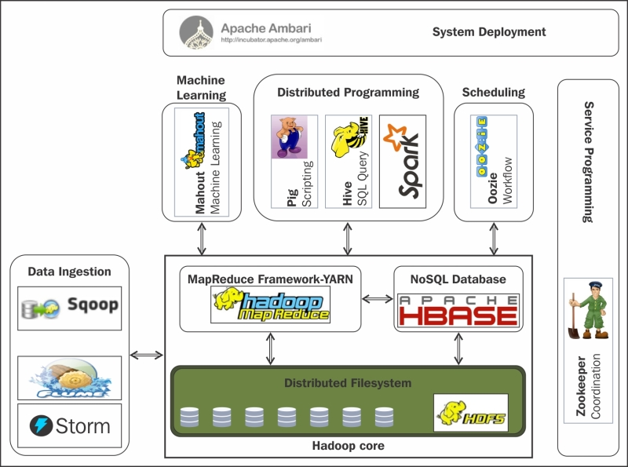
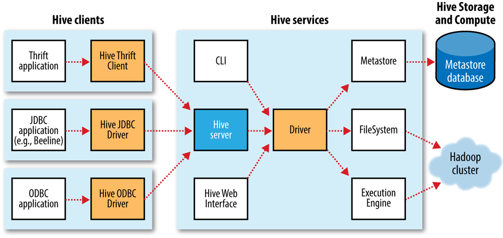
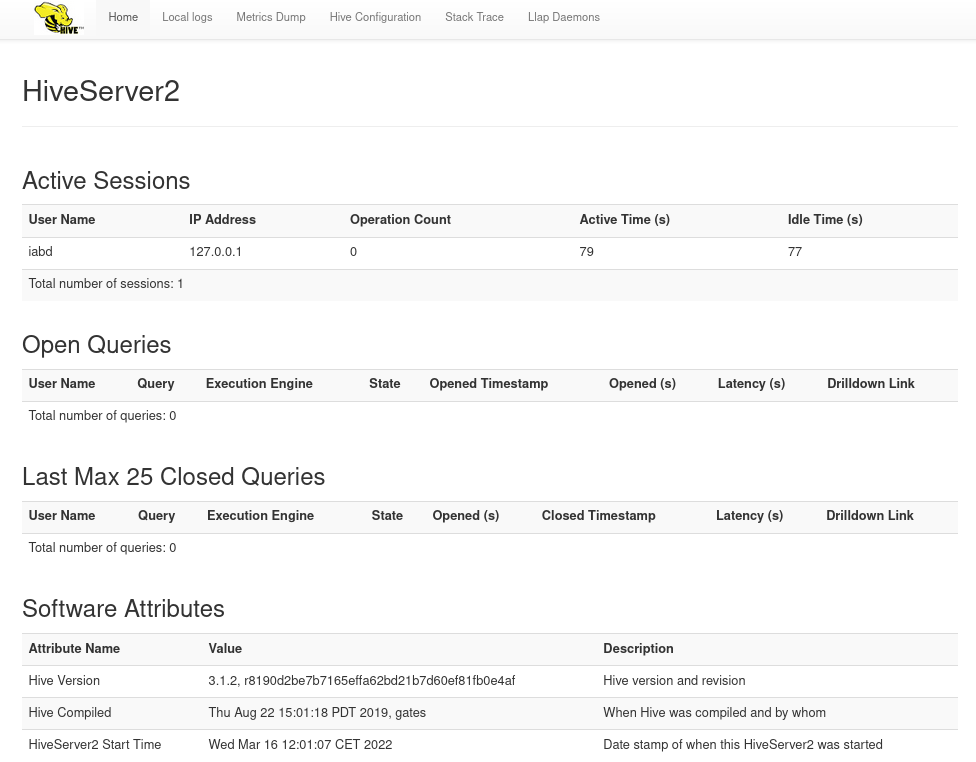
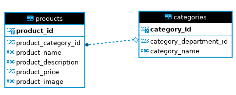

# Hive

*Apache Hive* (<https://hive.apache.org/>) es una tecnología distribuida diseñada y construida sobre un clúster de *Hadoop*. Permite leer, escribir y gestionar grandes *datasets* (con escala de petabytes) que residen en HDFS haciendo uso de un lenguaje dialecto de SQL, conocido como *HiveSQL*, lo que simplifica mucho el desarrollo y la gestión de *Hadoop*.

<figure style="float: right;">
    
    <figcaption>Logo de Apache Hive</figcaption>
</figure>

El proyecto lo inició *Facebook* para conseguir que la interacción con *Hadoop* fuera similar a la que se realiza con un *datawarehouse* tradicional. La tecnología *Hadoop* es altamente escalable, aunque hay que destacar su dificultad de uso y que está orientado únicamente a operaciones *batch*, con lo que no soporta el acceso aleatorio ni está optimizado para ficheros pequeños.

## Hive y Hadoop

Si volvemos a ver como casa *Hive* dentro del ecosistema de *Hadoop*, *Hive* es una fachada construida sobre Hadoop que permite acceder a los datos almacenados en HDFS de forma muy sencilla sin necesidad de conocer *Java*, *Map Reduce* u otras tecnologías.

Aunque en principio estaba diseñado para el procesamiento *batch*, ahora se integra con frameworks en *streaming* como *Tez* y *Spark*.

<figure style="align: center;">
    
    <figcaption>Ecosistema Hadoop</figcaption>
</figure>

### Características

*Hive* impone una estructura sobre los datos almacenados en HDFS. Esta estructura se conoce como ***Schema***, y *Hive* la almacena en su propia base de datos (*metastore*). Gracias a ella, optimiza de forma automática el plan de ejecución y usa particionado de tablas en determinadas consultas. También soporta diferentes formatos de ficheros, codificaciones y fuentes de datos como *HBase*.

Para interactuar con *Hive* utilizaremos *HiveQL*, el cual es un dialecto de *SQL* (recuerda que *SQL* no es sensible a las mayúsculas, excepto en la comparación de cadenas).

*Hive* amplía el paradigma de *SQL* incluyendo formatos de serialización. También podemos personalizar el procesamiento de consultas creando un esquema de tabla acorde con nuestros datos, pero sin tocar los datos. Aunque SQL solo es compatible con tipos de valor primitivos (como fechas, números y cadenas), los valores de las tablas de *Hive* son elementos estructurados, por ejemplo, objetos JSON o cualquier tipo de datos definido por el usuario o cualquier función escrita en Java.

Una consulta típica en *Hive* se ejecuta en varios *datanodes* en paralelo, con varios trabajos *MapReduce* asociados. Estas operaciones son de tipo *batch*, por lo que la latencia es más alta que en otros tipos de bases de datos. Además, hay que considerar el retardo producido por la inicialización de los trabajos, sobre todo en el caso de consultar pequeños *datasets*.

#### Ventajas

Las ventajas de utilizar *Hive* son:

* Reduce la complejidad de la programación *MapReduce* al usar *HiveQL* como lenguaje de consulta.
* Está orientado a aplicaciones de tipo *Data Warehouse*, con datos estáticos, poco cambiantes y sin requisitos de tiempos de respuesta rápidos.
* Permite a los usuarios despreocuparse de en qué formato y dónde se almacenan los datos.
* Incorpora *Beeline*: una herramienta por línea de comandos para realizar consultas con *HiveQL*.

En cambio, *Hive* no es la mejor opción para consultas en tiempo real o de tipo transaccional. Además, no está diseñado para usarse con actualizaciones de valores al nivel de registro, y el soporte de SQL es limitado.

#### Alternativas

Una de las alternativas más populares es [Apache Impala](https://impala.apache.org/), originalmente creado por Cloudera, el cual utiliza un demonio dedicado en cada *datanode* del clúster, de manera que hay un coordinador que reenvía a cada *datanode* la consulta a realizar y luego se encarga de unir los datos en el resultado final. *Impala* utiliza el *metastore* de *Hive* y soporta la mayoría de construcciones de *Hive*, con lo que la migración de un sistema a otro es sencilla.

En lugar de utilizar MapReduce, aprovecha un motor de procesamiento masivo en paralelo (MPP) como el que existe en los sistemas gestores de bases de datos relacionales (RDBMS). Esta arquitectura hace que Impala sea adecuado para análisis interactivos y de baja latencia.

<!--
https://aws.amazon.com/es/emr/faqs/#Using_Impala
-->

Otras alternativas *open source* son :

* [Presto de Facebook](http://prestodb.io/) y [Apache Drill](http://drill.apache.org/), con arquitecturas muy similares a *Impala*.
* [Spark SQL](https://spark.apache.org/sql/): utiliza *Spark* como motor de ejecución y permite utilizar consultas SQL embebidas. La estudiaremos m,en sesiones futuras.

!!! info "Pig"
    [Apache Pig](https://pig.apache.org) es una herramienta que abstrae el acceso a *MapReduce* de forma similar a como lo realiza *Hive*, pero en vez de SQL, utiliza su propio lenguaje de *scripting* (*PigLatin*) para expresar los flujos de datos.
    Actualmente ha perdido uso en detrimento de *Hive*/*Impala* y de *Spark*.

    Tenéis una pequeña introducción en <https://www.analyticsvidhya.com/blog/2021/08/an-introduction-to-apache-pig-for-absolute-beginners/>.

### Componentes

A continuación podemos ver un gráfico que relaciona los diferentes componentes de *Hive* y define su arquitectura:

<figure style="align: center;">
    
    <figcaption>Arquitectura de Apache Hive</figcaption>
</figure>

#### Hive Server

*HiveServer 2* (HS2) es la última versión del servicio. Se compone de una interfaz que permite a clientes externos ejecutar consultas contra *Apache Hive* y obtener los resultados. Está basado en *Thrift RPC* y soporta clientes concurrentes. Para arrancar el servidor, ejecutaremos el comando `hiveserver2`, el cual quedará a la escucha en el puerto `10000.`

A este servidor nos conectaremos mediante la herramienta *Beeline* (Beeline CLI).

#### Hive Metastore

Es el repositorio central para los metatados de *Hive*, y se almacena en una base de datos relacional como *MySQL*, *PostgreSQL* o *Apache Derby* (embebida). Mantiene los metadatos, las tablas y sus tipos mediante *Hive DDL* (*Data Definition Language*). Además, el sistema se puede configurar para que también almacene estadísticas de las operaciones y registros de autorización para optimizar las consultas.

En las últimas versiones de *Hive*, este componente se puede desplegar de forma remota e independiente, para no compartir la misma JVM con *HiveServer*. Dentro del *metastore* podemos encontrar el *Hive Catalog* (*HCatalog*), que permite acceder a sus metadatos, actuando como una API. Al poder desplegarse de forma aislada e independiente, permite que otras aplicaciones hagan uso del *schema* sin tener que desplegar el motor de consultas de Hive.

Así pues, al *Metastore* podremos acceder mediante *HiveCLI*, o a través del *Hive Server* mediante una conexión remota mediante *Beeline*.

#### Beeline

*Hive* incorpora *Beeline*, el cual actúa como un cliente basado en JDBC para hacer consultas por línea de comandos contra el *Hive Server*, sin necesitar las dependencias de *Hive*.

Por otro lado, también podemos utilizar *Hive CLI*, un cliente basado en *Apache Thrift*, que usa los mismos drivers que *Hive*.

!!! info "Apache Tez"
    Hive 3 deja de soportar *MapReduce*. *Apache Tez* lo reemplaza como el motor de ejecución por defecto, de manera que mejora el rendimiento y se ejecuta sobre *Hadoop Yarn*, que encola y planifica los trabajos en el clúster. Además de *Tez*, *Hive* también puede utilizar *Apache Spark* como motor de ejecución.

    Para indicar que queremos ejecutar *Tez* como motor de ejecución, ejecutaríamos el siguiente comando:

    ```
    SET hive.execution.engine=tez;
    ```

    En nuestro caso no tenemos *Tez* instalado en la máquina virtual, quedando fuera del alcance del presente curso.

### Tipos de datos

Los tipos de datos que podemos emplear en Hive son muy similares a los que se utilizan en el DDL de SQL.
Los tipos simples más comunes son `STRING` e `INT`, aunque podemos utilizar otros tipos como `TINYINT`, `BIGINT`, `DOUBLE`, `DATE`, `TIMESTAMP`, etc...

Para realizar una conversión explicita de tipos, por ejemplo de un tipo texto a uno numérico, hay que utilizar la función `CAST`:

``` sql
select CAST('1' as INT) from tablaPruebas;
```

Respecto a los tipos compuestos, tenemos tres tipos:

* arrays mediante el tipo `ARRAY`, para agrupar elementos del mismo tipo: `["manzana", "pera", "naranja]`.
* mapas mediante el tipo `MAP`, para definir parejas de clave-valor: `{1: "manzana", 2: "pera"}`
* estructuras mediante el tipo `STRUCT`, para definir estructuras con propiedades: `{"fruta": "manzana", "cantidad": 1, "tipo": "postre"}`.

## Instalación y configuración

!!! important "Máquina virtual"
    Los siguientes pasos no son necesarios ya que nuestra máquina virtual ya tiene *Hive* instalado y configurado correctamente. Si quieres hacer tu propia instalación sigue los siguientes pasos de la [documentación oficial](https://cwiki.apache.org/confluence/display/Hive//GettingStarted).

Una vez instalado, vamos a configurarlo. Para ello, debemos crear los ficheros de configuración a partir de las plantilla que ofrece *Hive*. Para ello, desde la carpeta `$HIVE_HOME/conf`, ejecutaremos los siguientes comandos:

``` bash
cp hive-default.xml.template hive-site.xml
cp hive-env.sh.template hive-env.sh
cp hive-exec-log4j2.properties.template hive-exec-log4j2.properties
cp hive-log4j2.properties.template hive-log4j2.properties
```

Modificamos el fichero `hive.env.sh` para incluir dos variables de entorno con las rutas de *Hadoop* y la configuración de *Hive*

``` sh title="hive.env.sh"
export HADOOP_HOME=/opt/hadoop-3.3.1
export HIVE_CONF_DIR=/opt/hive-3.1.2/conf
```

Para que funcione la ingesta de datos en *Hive* mediante *Sqoop*, necesitamos añadir una librería a *Sqoop*:

``` bash
cp $HIVE_HOME/lib/hive-common-3.1.2.jar $SQOOP_HOME/lib
```

Preparamos HDFS para crear la estructura de archivos:

``` bash
hdfs dfs -mkdir /tmp
hdfs dfs -mkdir -p /user/hive/warehouse
hdfs dfs -chmod g+w /tmp
hdfs dfs -chmod g+w /user/hive/warehouse
```

Para el *metastore*, como en nuestra máquina virtual tenemos un servidor de *MariaDB* corriendo, vamos a reutilizarlo. La mayoría de ejemplos que hay en internet y la diferente bibliografía, utilizan *DerbyDB* como almacén (ya que no requiere una instalación extra). Así pues, creamos el almacén mediante:

``` bash
schematool -dbType mysql -initSchema
```

Modificamos el fichero de configuración `hive-site.xml` y configuramos :

``` xml title="hive-site.xml"
<!-- nuevas propiedades -->
<property>
  <name>system:java.io.tmpdir</name>
  <value>/tmp/hive/java</value>
</property>
<property>
  <name>system:user.name</name>
  <value>${user.name}</value>
</property>
<property>
  <name>datanucleus.schema.autoCreateAll</name>
  <value>true</value>
</property>
<!-- propiedades existentes a modificar -->
<property>
  <name>javax.jdo.option.ConnectionURL</name>
  <value>jdbc:mysql://localhost:3306/hive?createDatabaseIfNotExist=true</value>
</property>
<property>
  <name>javax.jdo.option.ConnectionDriverName</name>
  <value>com.mysql.jdbc.Driver</value>
</property>
<property>
  <name>javax.jdo.option.ConnectionUserName</name>
  <value>iabd</value>
</property>
<property>
  <name>javax.jdo.option.ConnectionPassword</name>
  <value>iabd</value>
</property>
```

## Hola Mundo

Si entramos a nuestro `$HIVE_HOME` podemos comprobar con tenemos las siguientes herramientas:

* `hive`: Herramienta cliente
* `beeline`: Otra herramienta cliente
* `hiserver2`: Nos permite arrancar el servidor de Hive
* `schematool`: Nos permite trabajar contra la base de datos de metadatos (Metastore)

Una vez arrancado *Hadoop* y *YARN*, vamos a arrancar *Hive* mediante el cliente local:

``` bash
hive
```

Y una vez dentro, podemos comprobar las bases de datos existentes para ver que todo se configuró correctamente

``` sql
show databases;
```

Si quisiéramos ejecutar un script, podemos hacerlo desde el propio comando `hive` con la opción `-f`:

``` bash
hive -f script.sql
```

Además, tenemos la opción de pasar una consulta desde la propia línea de comandos mediante la opción `-e`:

``` bash
hive -e 'select * from tablaEjemplo`
```

### Acceso remoto

*HiveServer2* (desde Hive 0.11) tiene su propio cliente conocido como *Beeline*. En entornos reales, el cliente *Hive* está en desuso a favor de *Beeline*, por la falta de múltiples usuarios, seguridad y otras características de *HiveServer2*.

Arrancamos *HiveServer2* (lo hará en el puerto `10000`) y *Beeline* en dos pestañas diferentes mediante los comandos `hiveserver2` y `beeline`. Una vez dentro de *Beeline*, tras esperar unos segundo a que *HiveServer2* haya arrancando completamente, nos conectamos al servidor:

``` hive
!connect jdbc:hive2://iabd-virtualbox:10000
```

Al conectarnos, tras introducir `iabd` como usuario y contraseña, obtendremos un interfaz similar al siguiente:

``` hive
Beeline version 3.1.2 by Apache Hive
beeline> !connect jdbc:hive2://iabd-virtualbox:10000
Connecting to jdbc:hive2://iabd-virtualbox:10000
Enter username for jdbc:hive2://iabd-virtualbox:10000: iabd
Enter password for jdbc:hive2://iabd-virtualbox:10000: ****
Connected to: Apache Hive (version 3.1.2)
Driver: Hive JDBC (version 3.1.2)
Transaction isolation: TRANSACTION_REPEATABLE_READ
0: jdbc:hive2://iabd-virtualbox:10000>
```

Dentro de *Beeline*, en cualquier momento podemos ejecutar el comando `help` que nos mostrará todos los comandos disponibles. Si nos fijamos, además de las comandos del cliente hive, tenemos los comandos *beeline* que empiezan por el símbolo de exclamación `!`:

``` hive
0: jdbc:hive2://iabd-virtualbox:10000> help
!addlocaldriverjar  Add driver jar file in the beeline client side.
!addlocaldrivername Add driver name that needs to be supported in the beeline
                    client side.
!all                Execute the specified SQL against all the current connections
!autocommit         Set autocommit mode on or off
!batch              Start or execute a batch of statements
...
```

Otra forma de trabajar, para arrancar en el mismo proceso *Beeline* y *HiveServer2* para pruebas/desarrollo y tener una experiencia similar al cliente *Hive* accediendo de forma local, podemos ejecutar el siguiente comando donde indicamos tanto el usuario (`-n`) como la contraseña (`-p`):

``` bash
beeline -u jdbc:hive2://iabd-virtualbox:10000 -n iabd -p iabd
```

Mediante la interfaz gráfica de *Hive Server UI* a la cual podemos acceder mediante <http://localhost:10002> podemos monitorizar los procesos ejecutados por *HiveServer2*:

<figure style="align: center;">
    
    <figcaption>Monitorización mediante Hive Server UI</figcaption>
</figure>

## Caso de uso 1: Creación y borrado de tablas

Para este caso de uso, vamos a utilizar la base de datos `retail_db` que ya utilizamos en las actividades de la sesión anterior.

Para empezar, vamos a cargar en HDFS los datos de los clientes que contiene la tabla `customer`. Mediante *Sqoop*, ejecutamos el siguiente comando:

``` bash
sqoop import --connect "jdbc:mysql://localhost/retail_db" \
  --username iabd --password iabd \
  --table customers --target-dir /user/iabd/hive/customer \
  --fields-terminated-by '|' --delete-target-dir \
  --columns "customer_id,customer_fname,customer_lname,customer_city"
```

Una vez nos hemos conectado con el cliente `hive` o mediante `beeline`, creamos una base de datos llamada `iabd`:

``` sql
create database iabd;
```

Nos conectamos a la base de datos que acabamos de crear:

``` sql
use iabd;
```

!!! warning "default"
    Si olvidamos el comando `use`, se utilizará la base de datos `default`, la cual reside en `/user/hive/warehouse` como raíz en HDFS.

A continuación, vamos a crear una tabla que almacene el identificador, nombre, apellido y ciudad de los clientes (como puedes observar, la sintaxis es similar a SQL):

``` sql
CREATE TABLE customers
(
  custId INT,
  fName STRING,
  lName STRING,
  city STRING
)
ROW FORMAT DELIMITED  -- (1)!
FIELDS TERMINATED BY '|'  -- (2)!
STORED AS TEXTFILE  -- (3)!
LOCATION '/user/iabd/hive/customer';  -- (4)!
```

1. Indica el formato de cada fila como delimitado (con un salto del línea)
2. Los campos están separados por el caràcter `|` (es el mismo que habíamos indicado en Sqoop)
3. El contenido está almacenado en HDFS en  formato texto
4. Ruta de HDFS donde se encuentran los datos

Y ya podemos realizar algunas consultas:

``` sql
select * from customers limit 5;
select count(*) from customers;
```

!!! info "Utilizando Hue"
    Si no queremos conectarnos mediante *Beeline*, siempre podemos utilizar *Hue* como un entorno más amigable. Recuerda que para acceder desde la máquina virtual necesitas arrancarlo previamente mediante `/opt/hue-4.10.0/build/env/bin/hue runserver`.

    Una vez dentro, podemos realizar las consultas u operaciones de creación de tablas, etc...

    <figure style="align: center;">
        
        <figcaption>Consultas Hive desde Hue</figcaption>
    </figure>

En ocasiones necesitamos almacenar la salida de una consulta *Hive* en una nueva tabla. Las definiciones de las columnas de la nueva tabla se deriva de las columnas recuperadas en la consulta. Para ello, usaremos el comando *create table-as select*:

``` sql
CREATE TABLE customers_new as SELECT * from customers;
```

En el caso de la consulta falle por algún motivo, la tabla no se crearía.

Otra posibilidad es crear una tabla con la misma estructura que otra ya existente (pero sin datos):

``` sql
CREATE TABLE customers2 LIKE customers;
```

En cualquier momento podemos obtener información de la tabla:

``` sql
describe customers_new;
describe formatted customers_new;
```

Si empleamos la forma larga, obtendremos mucha más información. Por ejemplo, si nos fijamos, vemos que la localización de la nueva tabla ya no es `/user/iabd/hive/customer` sino `hdfs://iabd-virtualbox:9000/user/hive/warehouse/iabd.db/customers_new`. Esto se debe a que en vez de crear una tabla enlazada a un recurso de HDFS ya existente, ha creado una copia de los datos en el propio almacén de *Hive* (hemos pasado de una tabla externa a una interna).

Igual que las creamos, las podemos eliminar:

``` sql
drop table customers_new;
drop table customers2;
```

Si ejecutamos el comando `!tables` (o `show tables` en el cliente `hive`) veremos que ya no aparecen dichas tablas.

En el caso de que queramos eliminar una base de datos, de la misma manera que en SQL, ejecutaríamos el comando `drop database iabd;`.

## Caso de uso 2: Insertando datos

Para insertar datos en las tablas de Hive lo podemos hacer de varias formas:

* Cargando los datos mediante sentencias `LOAD DATA`.
* Insertando los datos mediante sentencias `INSERT`.
* Cargando los datos directamente mediante *Sqoop* o alguna herramienta similar.

### Cargando datos

Para cargar datos se utiliza la sentencia `LOAD DATA`. Si quisiéramos volver a cargar los datos desde HDFS utilizaremos:

``` sql
LOAD DATA INPATH '/user/iabd/hive/customer'
  overwrite into table customers;
```

Si en cambio vamos a cargar los datos desde un archivo local a nuestro sistema de archivos añadiremos `LOCAL`:

``` sql
LOAD DATA LOCAL INPATH '/home/iabd/datos'
  overwrite into table customers;
```

### Insertando datos

Aunque podemos insertar datos de forma atómica (es decir, registro a registro mediante `INSERT INTO TABLE ... VALUES`), realmente las inserciones que se realizan en *Hive* se hacen a partir de los datos de otras tablas mediante el comando *insert-select* a modo de ETL:

``` sql
INSERT OVERWRITE TABLE destino
  SELECT col1, col2 FROM fuente;
```

Mediante la opción `OVERWRITE`, en cada ejecución se vacía la tabla y se vuelve a rellenar. Si no lo indicamos o utilizamos `INTO`, los datos se añadirían a los ya existentes.

Si necesitamos insertar datos en múltiples tablas a la vez lo haremos mediante el comando *from-insert*:

``` sql
FROM fuente
INSERT OVERWRITE TABLE destino1
  SELECT col1, col2
INSERT OVERWRITE TABLE destino2
  SELECT col1, col3
```

Por ejemplo, vamos a crear un par de tablas con la misma estructura de clientes, pero para almacenar los clientes de determinadas ciudades:

``` sql
CREATE TABLE customers_brooklyn LIKE customers;
CREATE TABLE customers_caguas LIKE customers;
```

Y a continuación rellenamos ambas tablas con sus clientes;

``` sql
FROM customers
INSERT OVERWRITE TABLE customers_brooklyn
  SELECT custId, fName, lName, city WHERE city = "Brooklyn"
INSERT OVERWRITE TABLE customers_caguas
  SELECT custId, fName, lName, city WHERE city = "Caguas";
```

### Ingestando datos

Tal como vimos en la [sesión anterior](05flume.md#trabajando-con-hive), podemos ingestar los datos en *Hive* haciendo uso de *Sqoop* (también lo podemos hacer con *Flume* o *Nifi*).

Por ejemplo, vamos a ingestar los datos de la tabla `orders` de la base de datos *MariaDB* que tenemos instalada en nuestra máquina virtual. En el comando de *Sqoop* le indicamos que dentro de *Hive* lo ingeste en la base de datos `iabd` y que cree una tabla llamada `orders`:

``` bash
sqoop import --connect jdbc:mysql://localhost/retail_db \
    --username=iabd --password=iabd \
    --table=orders --driver=com.mysql.jdbc.Driver \
    --hive-import --hive-database iabd \
    --create-hive-table --hive-table orders
```

Una vez realizada la ingesta, podemos comprobar que los datos están dentro de *Hive* (en una tabla interna/gestionada):

``` bash
hdfs dfs -ls /user/hive/warehouse/iabd.db/orders
```

Y si entramos a `hive`, podemos consultar sus datos:

``` sql
select * from orders limit 10;
```

### Extrayendo datos insertados

Combinando los comandos de HQL y HDFS podemos extraer datos a ficheros locales o remotos:

``` sh
# Añadiendo contenido local
hive -e "use iabd; select * from customers" >> prueba1
# Sobrescribiendo contenido local
hive -e "use iabd; select * from customers" > prueba2
# Añadiendo contenido HDFS
hive -e "use iabd; select * from customers" | hdfs dfs --appendToFile /tmp/prueba3
# Sobrescribiendo contenido
hive -e "use iabd; select * from customers" | hdfs dfs --put -f /tmp/prueba4
```

Si indicamos la propiedad `set hive.cli.print.header=true` antes de la consulta, también nos mostrará el encabezado de las columnas. Esto puede ser útil si queremos generar un csv con el resultado de una consulta:

``` sh
hive -e 'use iabd; set hive.cli.print.header=true; select * from customers' | \
  sed 's/[\t]/,/g' > fichero.csv
```

!!! question "¿Y usar *INSERT LOCAL*?"
    Mediante `INSERT LOCAL` podemos escribir el resultado de una consulta en nuestro sistema de archivos, fuera de HDFS. El problema es que si hay muchos datos creará múltiples ficheros y necesitaremos concatenarlos para tener un único resultado:

    ``` sql
    insert overwrite local directory '/home/iabd/datos'
      row format delimited
      fields terminated by ','
      select * from customers;
    ```

## Caso de uso 3: Consultas con *join*

En este caso de uso vamos a trabajar con los datos de clientes que hemos cargado en los dos casos anteriores, tanto en `customers` como en `orders`.

Si queremos relacionar los datos de ambas tablas, tenemos que hacer un *join* entre la clave ajena de `orders` (`order_customer_id`) y la clave primaria de `customers` (`custid`):

``` sql hl_lines="1 8"
hive> describe customers;
OK
custid                  int                                         
fname                   string                                      
lname                   string                                      
city                    string                                      
Time taken: 0.426 seconds, Fetched: 4 row(s)
hive> describe orders;
OK
order_id                int                                         
order_date              string                                      
order_customer_id       int                                         
order_status            string                                      
Time taken: 0.276 seconds, Fetched: 4 row(s)
```

Para ello, para obtener la ciudad de cada pedido, podemos ejecutar la consulta:

``` sql
select o.order_id, o.order_date, c.city
from orders o join customers c
  on (o.order_customer_id=c.custid);
```

### Outer join

De la misma manera que en cualquier SGBD, podemos realizar un *outer join*, tanto *left* como *right* o *full*.

Por ejemplo, vamos a obtener para cada cliente, cuantos pedidos ha realizado:

``` sql
select c.custid, count(order_id)
from customers c join orders o
  on (c.custid=o.order_customer_id)
group by c.custid
order by count(order_id) desc;
```

Si queremos que salgan todos los clientes, independientemente de que tengan pedidos, deberemos realizar un *left outer join*:

``` sql
select c.custid, count(order_id)
from customers c left outer join orders o
  on (c.custid=o.order_customer_id)
group by c.custid
order by count(order_id) desc;
```

### Semi-joins

Si quisiéramos obtener las ciudades de los clientes que han realizado pedidos podríamos realizar la siguiente consulta:

``` sql
select distinct c.city from customers c
  where c.custid in (
    select order_customer_id
    from orders);
```

Mediante un semi-join podemos obtener el mismo resultado:

``` sql
select distinct city
from customers c
left semi join orders o on
  (c.custid=o.order_customer_id)
```

Hay que tener en cuenta la restricción que las columnas de la tabla de la derecha sólo pueden aparecer en la clausula `on`, nunca en la expresión `select`.

### Map joins

Consideramos la consulta inicial de join:

``` sql
select o.order_id, o.order_date, c.city
from orders o join customers c
  on (o.order_customer_id=c.custid);
```

Si una tabla es suficientemente pequeña para caber en memoria, tal como nos ocurre con nuestros datos, *Hive* puede cargarla en memoria para realizar el *join* en cada uno de los *mappers*. Esto se conoce como un ***map join***.

El *job* que ejecuta la consulta no tiene *reducers*, con lo que esta consulta no funcionará para un *right* o *right outer join*, ya que la ausencias de coincidencias sólo se puede detectar en los pasos de agregación (*reduce*).

En el caso de utilizar *map joins* con tablas organizadas en *buckets*, la sintaxis es la misma, sólo siendo necesario activarlo mediante la propiedad `hive.optimize.bucketmapjoin`:

``` sh
SET hive.optimize.bucketmapjoin=true;
```

## Comandos

Mediante los casos de uso realizados hasta ahora, hemos podido observar cómo para interactuar con *Hive* se utilizan comandos similares a SQL.

Es conveniente consultar la siguiente *cheatsheet*: <http://hortonworks.com/wp-content/uploads/2016/05/Hortonworks.CheatSheet.SQLtoHive.pdf>

Además *Hive* viene con un conjunto de funciones predefinidas para tratamiento de cadenas, fechas, funciones estadísticas, condicionales, etc... las cuales puedes consultar en la [documentación oficial](https://cwiki.apache.org/confluence/display/hive/languagemanual+udf).

Mediante el comando `show functions` podemos obtener una lista de las funciones. Si queremos más información sobre una determinada función utilizaremos el comando `describe function nombreFuncion`:

``` sql
hive> describe function length;
length(str | binary) - Returns the length of str or number of bytes in binary data
```

## Caso de uso 4: Tabla interna

Hive permite crear tablas de dos tipos:

* tabla **interna** o gestionada: Hive gestiona la estructura y el almacenamiento de los datos. Para ello, crea los datos en HDFS. Al borrar la tabla de *Hive*, se borra la información de HDFS.
* tabla **externa**: Hive define la estructura de los datos en el *metastore*, pero los datos ya residen previamente en HDFS. Al borrar la tabla de *Hive*, no se eliminan los datos de HDFS. Se emplea cuando compartimos datos almacenados en HDFS entre diferentes herramientas.

En este caso de uso, vamos a centrarnos en una tabla interna.

Supongamos el siguiente fichero con datos de empleados:

``` txt title="empleados.txt"
Michael|Montreal,Toronto|Male,30|DB:80|Product:DeveloperLead
Will|Montreal|Male,35|Perl:85|Product:Lead,Test:Lead
Shelley|New York|Female,27|Python:80|Test:Lead,COE:Architect
Lucy|Vancouver|Female,57|Sales:89,HR:94|Sales:Lead
```

Podemos observar como se utiliza `|` como separador de campos. Analizando los datos, vemos que tenemos los siguientes campos:

* Nombre
* Centros de trabajo (array con las ciudades)
* Sexo y edad
* Destreza y puntuación
* Departamento y cargo

Creamos la siguiente tabla interna en *Hive* mediante el siguiente comando:

``` sql
CREATE TABLE IF NOT EXISTS empleados_interna
(
  name string,
  work_place ARRAY<string>,
  sex_age STRUCT<sex:string,age:int>,
  skills_score MAP<string,int>,
  depart_title MAP<string,ARRAY<string>>
) COMMENT 'Esto es una tabla interna'
ROW FORMAT DELIMITED
FIELDS TERMINATED BY '|'
COLLECTION ITEMS TERMINATED BY ','
MAP KEYS TERMINATED BY ':';
```

La sintaxis es muy similar a SQL, destacando las siguientes opciones:

* `ROW FORMAT DELIMITED`: cada registro ocupa una línea
* `FIELDS TERMINATED BY '|'`: define el `|` como separador de campos
* `COLLECTION ITEMS TERMINATED BY ','`: define la coma como separador de los arrays / estructuras
* `MAP KEYS TERMINATED BY ':'`: define los dos puntos como separador utilizado en los mapas.

Si queremos comprobar la estructura de la tabla mediante el comando `show create table empleados_interna` veremos las opciones que hemos indicado:

``` sql
+----------------------------------------------------+
|                   createtab_stmt                   |
+----------------------------------------------------+
| CREATE TABLE `empleados_interna`(                  |
|   `name` string,                                   |
|   `work_place` array<string>,                      |
|   `sex_age` struct<sex:string,age:int>,            |
|   `skills_score` map<string,int>,                  |
|   `depart_title` map<string,array<string>>)        |
| COMMENT 'Esto es una tabla interna'                |
| ROW FORMAT SERDE                                   |
|   'org.apache.hadoop.hive.serde2.lazy.LazySimpleSerDe'  |
| WITH SERDEPROPERTIES (                             |
|   'collection.delim'=',',                          |
|   'field.delim'='|',                               |
|   'mapkey.delim'=':',                              |
|   'serialization.format'='|')                      |
| STORED AS INPUTFORMAT                              |
|   'org.apache.hadoop.mapred.TextInputFormat'       |
| OUTPUTFORMAT                                       |
|   'org.apache.hadoop.hive.ql.io.HiveIgnoreKeyTextOutputFormat' |
| LOCATION                                           |
|   'hdfs://iabd-virtualbox:9000/user/hive/warehouse/iabd.db/empleados_interna' |
| TBLPROPERTIES (                                    |
|   'bucketing_version'='2',                         |
|   'transient_lastDdlTime'='1647432129')            |
+----------------------------------------------------+
```

A continuación, vamos a cargar los datos del fichero [empleados.txt](resources/empleados.txt), el cual colocaremos en nuestra carpeta de *Descargas*:

``` sql
LOAD DATA LOCAL INPATH '/home/iabd/Descargas/empleados.txt' OVERWRITE INTO TABLE empleados_interna;
```

Comprobamos que los datos se han cargado correctamente:

``` sql
select * from empleados_interna;
```

Y obtenemos:

``` console
+-------------------------+-------------------------------+----------------------------+---------------------------------+----------------------------------------+
| empleados_interna.name  | empleados_interna.work_place  | empleados_interna.sex_age  | empleados_interna.skills_score  |     empleados_interna.depart_title     |
+-------------------------+-------------------------------+----------------------------+---------------------------------+----------------------------------------+
| Michael                 | ["Montreal","Toronto"]        | {"sex":"Male","age":30}    | {"DB":80}                       | {"Product":["Developer","Lead"]}       |
| Will                    | ["Montreal"]                  | {"sex":"Male","age":35}    | {"Perl":85}                     | {"Product":["Lead"],"Test":["Lead"]}   |
| Shelley                 | ["New York"]                  | {"sex":"Female","age":27}  | {"Python":80}                   | {"Test":["Lead"],"COE":["Architect"]}  |
| Lucy                    | ["Vancouver"]                 | {"sex":"Female","age":57}  | {"Sales":89,"HR":94}            | {"Sales":["Lead"]}                     |
+-------------------------+-------------------------------+----------------------------+---------------------------------+----------------------------------------+
```

Y si nos abrimos otra pestaña, mediante HDFS, comprobamos que tenemos los datos:

``` bash
hdfs dfs -ls /user/hive/warehouse/curso.db/empleados_interna
hdfs dfs -cat /user/hive/warehouse/curso.db/empleados_interna/empleados.txt
```

Y obtenemos:

``` console
Michael|Montreal,Toronto|Male,30|DB:80|Product:DeveloperLead
Will|Montreal|Male,35|Perl:85|Product:Lead,Test:Lead
Shelley|New York|Female,27|Python:80|Test:Lead,COE:Architect
Lucy|Vancouver|Female,57|Sales:89,HR:94|Sales:Lead
```

### Consultando datos compuestos

Si nos fijamos bien en la tabla, tenemos tres columnas con diferentes datos compuestos.

* `work_place`, con un `ARRAY<string>`
* `sex_age` con una `STRUCT<sex:string,age:int>`
* `skills_score` con un `MAP<string,int>`,
* `depart_title` con un `MAP<STRING,ARRAY<STRING>>`

Si queremos obtener los datos del **array**, podemos realizar las siguientes consultas:

=== "Todos los elementos"

    Todos los lugares de trabajo:

    ``` sql
    select name, work_place from empleados_interna;
    ```

    Resultado:

    ``` js
    +----------+-------------------------+
    |   name   |       work_place        |
    +----------+-------------------------+
    | Michael  | ["Montreal","Toronto"]  |
    | Will     | ["Montreal"]            |
    | Shelley  | ["New York"]            |
    | Lucy     | ["Vancouver"]           |
    +----------+-------------------------+
    ```    

=== "Elementos individuales"

    Utilizamos la notación de array para mostrar los dos primeros puestos de trabajo:

    ``` sql
    select work_place[0] as lugar1, work_place[1] as lugar2
    from empleados_interna;
    ```

    Resultado:

    ``` js
    +------------+----------+
    |   lugar1   |  lugar2  |
    +------------+----------+
    | Montreal   | Toronto  |
    | Montreal   | NULL     |
    | New York   | NULL     |
    | Vancouver  | NULL     |
    +------------+----------+
    ```    

=== "Cantidad de elementos"

    Mediante la función `size` obtenemos la cantidad de lugares de trabajo:

    ``` sql
    select size(work_place) as cantLugares
    from empleados_interna;
    ```

    Resultado:

    ``` js
    +--------------+
    | cantlugares  |
    +--------------+
    | 2            |
    | 1            |
    | 1            |
    | 1            |
    +--------------+
    ```    

=== "Explode array"

    Para obtener los empleados y lugares de trabajo mostrados uno por fila, hemos de realizar un *explode* sobre el array:

    ``` sql
    select name, lugar
    from empleados_interna
    lateral view explode (work_place) e2 as lugar;
    ```

    Para ello hemos creado una vista lateral y con la función `explode` *desenrollamos* el array. Resultado:

    ``` js
    +----------+------------+
    |   name   |   lugar    |
    +----------+------------+
    | Michael  | Montreal   |
    | Michael  | Toronto    |
    | Will     | Montreal   |
    | Shelley  | New York   |
    | Lucy     | Vancouver  |
    +----------+------------+
    ```    

En el caso de la **estructura** con el sexo y la edad podemos realizar las siguientes consultas

=== "Todos los elementos"

    Todas las estructuras de sexo/edad:

    ``` sql
    select sex_age from empleados_interna;
    ```

    Resultado:

    ``` js
    +----------------------------+
    |          sex_age           |
    +----------------------------+
    | {"sex":"Male","age":30}    |
    | {"sex":"Male","age":35}    |
    | {"sex":"Female","age":27}  |
    | {"sex":"Female","age":57}  |
    +----------------------------+
    ```    

=== "Elementos individuales"

    Utilizando la notación `.` podemos obtener el sexo y edad por separado

    ``` sql
    select sex_age.sex as sexo, sex_age.age as edad
    from empleados_interna;
    ```

    Resultado:

    ``` js
    +---------+-------+
    |  sexo   | edad  |
    +---------+-------+
    | Male    | 30    |
    | Male    | 35    |
    | Female  | 27    |
    | Female  | 57    |
    +---------+-------+
    ```

Respecto al **mapa** con las habilidades y sus puntuaciones:

=== "Todos los elementos"

    Todas las habilidades como un mapa:

    ``` sql
    select skills_score from empleados_interna;
    ```

    Resultado:

    ``` js
    +-----------------------+
    |     skills_score      |
    +-----------------------+
    | {"DB":80}             |
    | {"Perl":85}           |
    | {"Python":80}         |
    | {"Sales":89,"HR":94}  |
    +-----------------------+
    ```    

=== "Elementos individuales"

    Utilizando la notación array con claves, obtenemos el nombre y puntuación de las habilidades:

    ``` sql
    select name, skills_score["DB"] as db,
      skills_score["Perl"] as perl,
      skills_score["Python"] as python,
      skills_score["Sales"] as ventas,
      skills_score["HR"] as hr
    from empleados_interna;
    ```

    Resultado:

    ``` js
    +----------+-------+-------+---------+---------+-------+
    |   name   |  db   | perl  | python  | ventas  |  hr   |
    +----------+-------+-------+---------+---------+-------+
    | Michael  | 80    | NULL  | NULL    | NULL    | NULL  |
    | Will     | NULL  | 85    | NULL    | NULL    | NULL  |
    | Shelley  | NULL  | NULL  | 80      | NULL    | NULL  |
    | Lucy     | NULL  | NULL  | NULL    | 89      | 94    |
    +----------+-------+-------+---------+---------+-------+
    ```

=== "Claves y valores"

    Claves y valores de las habilidades:

    ``` sql
    select name, map_keys(skills_score) as claves,
      map_values(skills_score) as valores
    from empleados_interna;
    ```

    Resultado:

    ``` js
    +----------+-----------------+----------+
    |   name   |     claves      | valores  |
    +----------+-----------------+----------+
    | Michael  | ["DB"]          | [80]     |
    | Will     | ["Perl"]        | [85]     |
    | Shelley  | ["Python"]      | [80]     |
    | Lucy     | ["Sales","HR"]  | [89,94]  |
    +----------+-----------------+----------+
    ```

Y finalmente, con el mapa de departamentos que contiene un array:

=== "Todos los elementos"

    Toda la información sobre los departamentos:

    ``` sql
    select depart_title from empleados_interna;
    ```

    Resultado:

    ``` js
    +----------------------------------------+
    |              depart_title              |
    +----------------------------------------+
    | {"Product":["Developer","Lead"]}       |
    | {"Product":["Lead"],"Test":["Lead"]}   |
    | {"Test":["Lead"],"COE":["Architect"]}  |
    | {"Sales":["Lead"]}                     |
    +----------------------------------------+
    ```

=== "Elementos individuales"

    Nombre y puntuación de las habilidades:

    ``` sql
    select name, depart_title["Product"] as product,
      depart_title["Test"] as test,
      depart_title["COE"] as coe,
      depart_title["Sales"] as sales
    from empleados_interna;
    ```

    Resultado:

    ``` js
    +----------+-----------------------+-----------+----------------+-----------+
    |   name   |        product        |   test    |      coe       |   sales   |
    +----------+-----------------------+-----------+----------------+-----------+
    | Michael  | ["Developer","Lead"]  | NULL      | NULL           | NULL      |
    | Will     | ["Lead"]              | ["Lead"]  | NULL           | NULL      |
    | Shelley  | NULL                  | ["Lead"]  | ["Architect"]  | NULL      |
    | Lucy     | NULL                  | NULL      | NULL           | ["Lead"]  |
    +----------+-----------------------+-----------+----------------+-----------+
    ```

=== "Primer elemento de los elementos individuales"

    Primera habilidad de producto y pruebas de cada empleado:

    ``` sql
    select name, depart_title["Product"][0] as product0,
      depart_title["Test"][0] as test0
    from empleados_interna;
    ```

    Resultado:

    ``` js
    +----------+-------------+--------+
    |   name   |  product0   | test0  |
    +----------+-------------+--------+
    | Michael  | Developer   | NULL   |
    | Will     | Lead        | Lead   |
    | Shelley  | NULL        | Lead   |
    | Lucy     | NULL        | NULL   |
    +----------+-------------+--------+
    ```

## Caso de uso 5: Tabla externa

En este caso de uso vamos a repetir la misma estructura de la tabla del caso anterior, pero en esta ocasión en una tabla externa. De esta manera, al borrar la tabla de *Hive*, **no** se borra la información de HDFS.

Para ello, únicamente hemos de añadir la palabra `EXTERNAL` a la instrucción `CREATE TABLE` y la clausula `LOCATION` para indicar la ruta de HDFS donde se encuentran los datos:

``` sql
CREATE EXTERNAL TABLE IF NOT EXISTS empleados_externa
(
  name string,
  work_place ARRAY<string>,
  sex_age STRUCT<sex:string,age:int>,
  skills_score MAP<string,int>,
  depart_title MAP<STRING,ARRAY<STRING>>
) COMMENT "Esto es una tabla externa"
ROW FORMAT DELIMITED
FIELDS TERMINATED BY '|'
COLLECTION ITEMS TERMINATED BY ','
MAP KEYS TERMINATED BY ':'
LOCATION "/user/iabd/hive/empleados_externa";
```

Realizamos la misma carga que en el caso anterior:

``` sql
LOAD DATA LOCAL INPATH '/home/iabd/Descargas/empleados.txt' OVERWRITE INTO TABLE empleados_externa;
```

Si hacemos una consulta sobre la tabla para ver que están todos los campos obtendremos la misma información que antes:

``` sql
SELECT * FROM empleados_externa;
```

!!! question "Interna o externa"
    Como normal general, si todo nuestro procesamiento lo hacemos mediante *Hive*, es más cómodo utilizar tablas internas. Si no es así, y otras herramientas acceden al mismo dataset, es mejor utilizar tablas externas.

    Un patrón de uso muy común es utilizar una tabla externa para acceder al dataset inicial almacenado en HDFS (creado por otro proceso), y posteriormente crear una transformación en *Hive* para mover los datos a una tabla interna.

<!--

### Consultas agregadas

Para ordenar los datos podemos utilizar la clausula `order by`, la cual realiza un ordenación del resultado final. Cuando no necesitamos ordenar todo el resultado, podemos usar la extensión de *Hive* `sort by`, que realiza la ordenación a nivel de *reducer*.

Para controlar que *reducer* se aplica a una determinada fila (normalmente para realizar algún tipo de agregación), hemos de utilizar la clausula de Hive `distribute by`.

``` sql
SELECT year, temperature
FROM weather
DISTRIBUTE BY year
SORT BY year ASC, temperature DESC;
```

Si las columnas de `sort by` y `distribute by` son las mismas, podemos utilizar `cluster by` como un atajo para indicar ambas.
-->

## Estructuras de datos en Hive

*Hive* proporciona una estructura basada en tablas sobre HDFS. Soporta tres tipos de estructuras: tablas, particiones y *buckets*. Las tablas se corresponden con directorios de HDFS, las particiones son las divisiones de las tablas y los buckets son las divisiones de las particiones.

Acabamos de ver en el apartado anterior que *Hive* permite crear tablas externas, similares a las tablas en una base de datos, pero a la que se les proporciona una ubicación. En este caso, cuando se elimina la tabla externa, los datos continúan en HDFS.

### Particiones

Las ***particiones*** en *Hive* consisten en dividir las tablas en varios subdirectorios. Esta estructura permite aumentar el rendimiento cuando utilizamos consultas que filtran los datos mediante la cláusula *where*.

Por ejemplo, si estamos almacenado ficheros de log (tanto la línea del log como su *timestamp*), podemos pensar en agrupar por fecha los diferentes ficheros. Podríamos añadir otra partición para también dividirlos por países:

``` sql
CREATE TABLE logs (ts BIGINT, linea STRING)
PARTITIONED BY (fecha STRING, pais STRING);
```

Por ejemplo, para cargar los datos en una partición:

``` sql
LOAD DATA LOCAL INPATH 'input/hive/particiones/log1'
INTO TABLE logs
PARTITION (fecha='2022-01-01', pais='ES');
```

A nivel del sistema de fichero, las particiones se traducen en subdirectorios dentro de la carpeta de la tabla. Por ejemplo, tras insertar varios ficheros de logs, podríamos tener una estructura similar a:

``` txt
/user/hive/warehouse/logs
├── fecha=2022-01-01/
│   ├── pais=ES/
│   │   ├── log1
│   │   └── log2
│   └── pais=US/
│       └── log3
└── fecha=2022-01-02/
    ├── pais=ES/
    │   └── log4
    └── pais=US/
        ├── log5
        └── log6
```

Para averiguar las particiones en *Hive*, utilizaremos el comando `SHOW PARTITIONS`:

``` txt
hive> SHOW PARTITIONS logs;
fecha=2022-01-01/pais=ES
fecha=2022-01-01/pais=US
fecha=2022-01-02/pais=ES
fecha=2022-01-02/pais=US
```

Hay que tener en cuenta que la definición de columnas de la clausula `PARTITIONED BY` forman parte de las columnas de la tabla, y se conocen como ^^columnas de partición^^. Sin embargo, los ficheros de datos no contienen valores para esas columnas, ya que se deriva el nombre del subdirectorio.

Podemos utilizar las columnas de partición en las consultas igual que una columna ordinaria. *Hive* traduce la consulta en la navegación adecuada para sólo escanear las particiones relevantes. Por ejemplo, la siguiente consulta solo escaneará los ficheros `log1`, `log2` y `log4`:

``` sql
SELECT ts, fecha, linea
FROM logs
WHERE pais='ES';
```

!!! note "Moviendo datos a una tabla particionada"

    Si queremos mover datos de una tabla ordinaria a una particionada (vaciando los datos de la partición existente):

    ``` sql
    INSERT OVERWRITE TABLE logs
    PARTITION (dt='2022-01-01')
    SELECT col1, col2 FROM fuente;
    ```

    Otra posibilidad es utilizar un *particionado dinámico*, de manera que las particiones se crean de forma relativa a los datos:

    ``` sql
    INSERT OVERWRITE TABLE logs
    PARTITION (dt)
    SELECT col1, col2 FROM fuente;
    ```

    Para ello, previamente hay que habilitarlo (por defecto está deshabilitado para evitar la creación de múltiples particiones sin querer) y configurar el modo no estricto para que no nos obligue a indicar al menos una partición estática:

    ``` bash
    set hive.exec.dynamic.partition = true
    set hive.exec.dynamic.partition.mode = nonstrict;
    ```

### Buckets

Otro concepto importante en *Hive* son los ***buckets***. Son particiones *hasheadas* por una columna/clave, en las que los datos se distribuyen en función de su valor *hash*.

Existen dos razones por las cuales queramos organizar las tablas (o particiones) en *buckets*. La primera es para conseguir consultas más eficientes, ya que imponen una estructura extra en las tablas. Los buckets pueden acelerar las operaciones de tipo *join* si las claves de *bucketing* y de *join* coinciden, ya que una clave ajena busca únicamente en el *bucket* adecuado de la clave primaria. Debido a los beneficios de los buckets/particiones, se deben considerar siempre que puedan optimizar el rendimiento de las consultas realizadas.

Para indicar que nuestras tablas utilicen *buckets*, hemos de emplear la clausula `CLUSTERED BY` para indicar la columnas y el número de *buckets* (se recomienda que la cantidad de *buckets* sea potencia de 2):

``` sql
CREATE TABLE usuarios_bucketed (id INT, nombre STRING)
CLUSTERED BY (id) INTO 4 BUCKETS;
```

*Bucketing* está muy relacionado con el proceso de carga de datos. Para cargar los datos en una tabla con *buckets*, debemos bien indicar el número máximo de reducers para que coincida con el número de *buckets*, o habilitar el *bucketing* (esta es la recomendada):

``` sql
set map.reduce.tasks = 4;
set hive.enforce.bucketing = true; -- mejor así
```

Una vez creada la tabla, se rellena con los datos que tenemos en otra tabla:

``` sql
INSERT OVERWRITE TABLE usuarios_bucketed
SELECT * FROM usuarios;
```

Físicamente, cada *bucket* es un fichero de la carpeta con la tabla (o partición). El nombre del fichero no es importante, pero el *bucket* `n` es el fichero número `n`. Por ejemplo, si miramos el contenido de la tabla en HDFS tendremos:

``` bash
hive> dfs -ls /user/hive/warehouse/usuarios_bucketed;
000000_0
000001_0
000002_0
000003_0
```

El segundo motivo es para obtener un *sampling* de forma más eficiente. Al trabajar con grandes datasets, normalmente obtenemos una pequeña fracción del dataset para comprender o refinar los datos. Por ejemplo, podemos obtener los datos de únicamente uno de los *buckets*:

``` sql
SELECT * FROM usuarios_bucketed
  TABLESAMPLE(BUCKET 1 OUT OF 4 ON id);
```

Mediante el `id` del usuario determinamos el *bucket* (el cual se utiliza para realizar el *hash* del valor y ubicarlo dentro de uno de los *buckets*), de manera que cada *bucket* contendrá de manera eficiente un conjunto aleatorio de usuarios.

### Resumen

A continuación mostramos en una tabla puntos a favor y en contra de utilizar estas estructuras

| Particionado +  |  Particionado -   | Bucketing +   | Bucketing -
| -----           | ----              | ----          | ----
| Distribuye la carga de ejecución horizontalmente.   | Existe la posibilidad de crear demasiadas particiones que contienen muy poco datos | Proporciona una respuesta de consulta más rápida, al acceder a porciones.   | El número de buckets se define durante la creación de la tabla -> Los programadores deben cargar manualmente un volumen equilibrado de datos.
| En la partición tiene lugar la ejecución más rápida de consultas con el volumen de datos bajo. Por ejemplo, la población de búsqueda de la Ciudad del Vaticano devuelve muy rápido en lugar de buscar la población mundial completa.  | La partición es eficaz para datos de bajo volumen. Pero algunas consultas como agrupar por un gran volumen de datos tardan mucho en ejecutarse. Por ejemplo, agrupar las consultas del mes de Enero tardará más que los viernes de Enero.   | Al utilizar volúmenes similares de datos en cada partición, los *map joins* serán más rápidos.

Supongamos que `$HDFS_HIVE` contiene la ruta con la raíz de las tablas internas de Hive, en nuestro caso `/user/hive/warehouse`. Respecto al nivel de estructura y representación en carpetas de HDFS tendríamos:

| ENTIDAD       | EJEMPLO           | UBICACIÓN
| -----         | ----              | ----
| base de datos | iabd              | `$HDFS_HIVE/iabd.db`
| tabla         | T                 | `$HDFS_HIVE/iabd.db/T`
| partición     | fecha='01012022'  | `$HDFS_HIVE/iabd.db/T/fecha=01012022`
| bucket        | columna id        | `$HDFS_HIVE/iabd.db/T/fecha=01012022/000000_0`

## Caso de uso 6: Particionado y Bucketing

A continuación, vamos a coger los datos de las productos y las categorías de la base de datos `retail_db`, y colocarlos en una estructura de *Hive* particionada y que utilice *bucketing*.

La estructura de las tablas es la siguiente:

<figure style="align: center;">
    
    <figcaption>Relación entre productos y categorías</figcaption>
</figure>

El primer paso es traernos los datos de *MariaDB* a tablas internas haciendo uso de *Sqoop*:

=== "Tabla categories"

    ``` bash
    sqoop import --connect jdbc:mysql://localhost/retail_db \
        --username=iabd --password=iabd \
        --table=categories --driver=com.mysql.jdbc.Driver \
        --hive-import --hive-database iabd \
        --create-hive-table --hive-table categories
    ```

=== "Tabla products"

    ``` bash
    sqoop import --connect jdbc:mysql://localhost/retail_db \
        --username=iabd --password=iabd \
        --table=products --driver=com.mysql.jdbc.Driver \
        --hive-import --hive-database iabd \
        --create-hive-table --hive-table products
    ```

El siguiente paso que vamos a realizar es crear en *Hive* una tabla con el código del producto, su nombre, el nombre de la categoría y el precio del producto. Estos datos los vamos a particionar por categoría y *clusterizado* en 8 buckets:

``` sql
CREATE TABLE IF NOT EXISTS productos (
  id INT,
  nombre STRING,
  precio DOUBLE
)
PARTITIONED BY (categoria STRING)
CLUSTERED BY (id) INTO 8 BUCKETS;
```

Y cargamos los datos con una consulta que realice un join de las tablas `categories` y `products` con particionado dinámico (recuerda activarlo mediante `set hive.exec.dynamic.partition.mode=nonstrict;`):

``` sql
INSERT OVERWRITE TABLE productos
  PARTITION (categoria)
  SELECT p.product_id as id, p.product_name as nombre, p.product_price as precio, c.category_name as categoria FROM products p join categories c on (p.product_category_id = c.category_id);
```

Si queremos comprobar cómo se han creado las particiones y los buckets, desde un terminal podemos acceder a HDFS y mostrar su contenido:

``` bash
hdfs dfs -ls hdfs://iabd-virtualbox:9000/user/hive/warehouse/iabd.db/productos
hdfs dfs -ls hdfs://iabd-virtualbox:9000/user/hive/warehouse/iabd.db/productos/categoria=Accessories
```

Si volvemos a *Hive*, ahora podemos consultar los datos:

``` sql
select * from productos limit 5;
```

Y vemos cómo aparecen 5 elementos que pertenecen a la primera partición. Si quisiéramos, por ejemplo, 10 elementos de particiones diferentes deberíamos ordenarlos de manera aleatoria:

``` sql
select * from productos order by rand() limit 10;
```

## Funciones ventana

A continuación vamos a realizar diversas consultas utilizando las funciones ventana que soporta *Hive*. Más información en [https://cwiki.apache.org/confluence/display/Hive/LanguageManual+WindowingAndAnalytics](https://cwiki.apache.org/confluence/display/Hive/LanguageManual+WindowingAndAnalytics).

### Consultas con enteros que cuentan/ordenan

!!! warning "Consultas sobre categorías"
    Las siguientes consultas las vamos a realizar sobre sólo dos categorías para acotar los resultados obtenidos.

    Además, hemos recortado el nombre del producto a 20 caracteres para facilitar la legibilidad de los resultados.

Las funciones **`rank`** y **`dense_rank`** permite obtener la posición que ocupan los datos. Se diferencia en que `rank` cuenta los elementos repetidos/empatados, mientras que `dense_rank` no.

Por ejemplo, vamos a obtener la posición que ocupan los productos respecto al precio agrupados por su categoría:

``` sql
select substr(nombre, 1, 20) as nombre, categoria, precio, 
  rank() over (partition by categoria order by precio desc) as rank,
  dense_rank() over (partition by categoria order by precio desc) as denseRank
from productos
where categoria = "Bike & Skate Shop" or categoria = "Basketball";
```

Resultado:

``` txt
+-----------------------+--------------------+----------+-------+------------+
|        nombre         |     categoria      |  precio  | rank  | denserank  |
+-----------------------+--------------------+----------+-------+------------+
| SOLE F85 Treadmill    | Basketball         | 1799.99  | 1     | 1          |
| SOLE E25 Elliptical   | Basketball         | 999.99   | 2     | 2          |
| Diamondback Adult Re  | Basketball         | 349.98   | 3     | 3          |
| Diamondback Adult Ou  | Basketball         | 309.99   | 4     | 4          |
| Diamondback Girls' C  | Basketball         | 299.99   | 5     | 5          |
| Diamondback Boys' In  | Basketball         | 299.99   | 5     | 5          |
| Diamondback Adult So  | Basketball         | 299.98   | 7     | 6          |
| Easton Mako Youth Ba  | Basketball         | 249.97   | 8     | 7          |
| Fitness Gear 300 lb   | Basketball         | 209.99   | 9     | 8          |
| Quik Shade Summit SX  | Basketball         | 199.99   | 10    | 9          |
| Easton XL1 Youth Bat  | Basketball         | 179.97   | 11    | 10         |
| Easton S1 Youth Bat   | Basketball         | 179.97   | 11    | 10         |
| adidas Brazuca 2014   | Basketball         | 159.99   | 13    | 11         |
| Quest 12' x 12' Dome  | Basketball         | 149.99   | 14    | 12         |
| Fitbit Flex Wireless  | Basketball         | 99.95    | 15    | 13         |
| Nike+ Fuelband SE     | Basketball         | 99.0     | 16    | 14         |
| Elevation Training M  | Basketball         | 79.99    | 17    | 15         |
| MAC Sports Collapsib  | Basketball         | 69.99    | 18    | 16         |
| Quest Q64 10 FT. x 1  | Basketball         | 59.98    | 19    | 17         |
| adidas Brazuca 2014   | Basketball         | 39.99    | 20    | 18         |
| Kijaro Dual Lock Cha  | Basketball         | 29.99    | 21    | 19         |
| adidas Brazuca 2014   | Basketball         | 29.99    | 21    | 19         |
| Nike Women's Pro Cor  | Basketball         | 28.0     | 23    | 20         |
| Nike Women's Pro Vic  | Basketball         | 21.99    | 24    | 21         |
| Nike VR_S Covert Dri  | Bike & Skate Shop  | 179.99   | 1     | 1          |
| TaylorMade RocketBal  | Bike & Skate Shop  | 169.99   | 2     | 2          |
| Cobra AMP Cell Drive  | Bike & Skate Shop  | 169.99   | 2     | 2          |
| Cleveland Golf Class  | Bike & Skate Shop  | 119.99   | 4     | 3          |
| Callaway X Hot Drive  | Bike & Skate Shop  | 0.0      | 5     | 4          |
+-----------------------+--------------------+----------+-------+------------+
```

La función **`row_number`** permite numerar los resultados:

``` sql
select substr(nombre, 1, 20) as nombre, categoria, precio, 
  row_number() over (partition by categoria order by precio desc) as numfila
from productos
where categoria = "Bike & Skate Shop" or categoria = "Basketball";
```

Resultado:

``` txt
+-----------------------+--------------------+----------+----------+
|        nombre         |     categoria      |  precio  | numfila  |
+-----------------------+--------------------+----------+----------+
| SOLE F85 Treadmill    | Basketball         | 1799.99  | 1        |
| SOLE E25 Elliptical   | Basketball         | 999.99   | 2        |
| Diamondback Adult Re  | Basketball         | 349.98   | 3        |
| Diamondback Adult Ou  | Basketball         | 309.99   | 4        |
| Diamondback Girls' C  | Basketball         | 299.99   | 5        |
| Diamondback Boys' In  | Basketball         | 299.99   | 6        |
| Diamondback Adult So  | Basketball         | 299.98   | 7        |
| Easton Mako Youth Ba  | Basketball         | 249.97   | 8        |
| Fitness Gear 300 lb   | Basketball         | 209.99   | 9        |
| Quik Shade Summit SX  | Basketball         | 199.99   | 10       |
| Easton XL1 Youth Bat  | Basketball         | 179.97   | 11       |
| Easton S1 Youth Bat   | Basketball         | 179.97   | 12       |
| adidas Brazuca 2014   | Basketball         | 159.99   | 13       |
| Quest 12' x 12' Dome  | Basketball         | 149.99   | 14       |
| Fitbit Flex Wireless  | Basketball         | 99.95    | 15       |
| Nike+ Fuelband SE     | Basketball         | 99.0     | 16       |
| Elevation Training M  | Basketball         | 79.99    | 17       |
| MAC Sports Collapsib  | Basketball         | 69.99    | 18       |
| Quest Q64 10 FT. x 1  | Basketball         | 59.98    | 19       |
| adidas Brazuca 2014   | Basketball         | 39.99    | 20       |
| Kijaro Dual Lock Cha  | Basketball         | 29.99    | 21       |
| adidas Brazuca 2014   | Basketball         | 29.99    | 22       |
| Nike Women's Pro Cor  | Basketball         | 28.0     | 23       |
| Nike Women's Pro Vic  | Basketball         | 21.99    | 24       |
| Nike VR_S Covert Dri  | Bike & Skate Shop  | 179.99   | 1        |
| TaylorMade RocketBal  | Bike & Skate Shop  | 169.99   | 2        |
| Cobra AMP Cell Drive  | Bike & Skate Shop  | 169.99   | 3        |
| Cleveland Golf Class  | Bike & Skate Shop  | 119.99   | 4        |
| Callaway X Hot Drive  | Bike & Skate Shop  | 0.0      | 5        |
+-----------------------+--------------------+----------+----------+

```

### Consultas por posición

A continuación vamos a ver las funciones **`lead`** y **`lag`**. Estas funciones se encargan de obtener el valor posterior y anterior respecto a un valor.

``` sql
select substr(nombre, 1, 20) as nombre, categoria, precio, 
  lead(precio) over (partition by categoria order by precio desc) as sig,
  lag(precio) over (partition by categoria order by precio desc) as ant
from productos
where categoria = "Bike & Skate Shop" or categoria = "Basketball";
```

Resultado:

``` txt
+-----------------------+--------------------+----------+---------+----------+
|        nombre         |     categoria      |  precio  |   sig   |   ant    |
+-----------------------+--------------------+----------+---------+----------+
| SOLE F85 Treadmill    | Basketball         | 1799.99  | 999.99  | NULL     |
| SOLE E25 Elliptical   | Basketball         | 999.99   | 349.98  | 1799.99  |
| Diamondback Adult Re  | Basketball         | 349.98   | 309.99  | 999.99   |
| Diamondback Adult Ou  | Basketball         | 309.99   | 299.99  | 349.98   |
| Diamondback Girls' C  | Basketball         | 299.99   | 299.99  | 309.99   |
| Diamondback Boys' In  | Basketball         | 299.99   | 299.98  | 299.99   |
| Diamondback Adult So  | Basketball         | 299.98   | 249.97  | 299.99   |
| Easton Mako Youth Ba  | Basketball         | 249.97   | 209.99  | 299.98   |
| Fitness Gear 300 lb   | Basketball         | 209.99   | 199.99  | 249.97   |
| Quik Shade Summit SX  | Basketball         | 199.99   | 179.97  | 209.99   |
| Easton XL1 Youth Bat  | Basketball         | 179.97   | 179.97  | 199.99   |
| Easton S1 Youth Bat   | Basketball         | 179.97   | 159.99  | 179.97   |
| adidas Brazuca 2014   | Basketball         | 159.99   | 149.99  | 179.97   |
| Quest 12' x 12' Dome  | Basketball         | 149.99   | 99.95   | 159.99   |
| Fitbit Flex Wireless  | Basketball         | 99.95    | 99.0    | 149.99   |
| Nike+ Fuelband SE     | Basketball         | 99.0     | 79.99   | 99.95    |
| Elevation Training M  | Basketball         | 79.99    | 69.99   | 99.0     |
| MAC Sports Collapsib  | Basketball         | 69.99    | 59.98   | 79.99    |
| Quest Q64 10 FT. x 1  | Basketball         | 59.98    | 39.99   | 69.99    |
| adidas Brazuca 2014   | Basketball         | 39.99    | 29.99   | 59.98    |
| Kijaro Dual Lock Cha  | Basketball         | 29.99    | 29.99   | 39.99    |
| adidas Brazuca 2014   | Basketball         | 29.99    | 28.0    | 29.99    |
| Nike Women's Pro Cor  | Basketball         | 28.0     | 21.99   | 29.99    |
| Nike Women's Pro Vic  | Basketball         | 21.99    | NULL    | 28.0     |
| Nike VR_S Covert Dri  | Bike & Skate Shop  | 179.99   | 169.99  | NULL     |
| TaylorMade RocketBal  | Bike & Skate Shop  | 169.99   | 169.99  | 179.99   |
| Cobra AMP Cell Drive  | Bike & Skate Shop  | 169.99   | 119.99  | 169.99   |
| Cleveland Golf Class  | Bike & Skate Shop  | 119.99   | 0.0     | 169.99   |
| Callaway X Hot Drive  | Bike & Skate Shop  | 0.0      | NULL    | 119.99   |
+-----------------------+--------------------+----------+---------+----------+
```

### Consultas de agregación

Las funciones de agregación que ya conocemos como **`count`**, **`sum`**, **`min`** y **`max`** también las podemos aplicar sobre particiones de datos y así poder mostrar los datos agregados para cada elemento:

``` sql
select substr(nombre, 1, 20) as nombre, categoria,
  count(precio) over (partition by categoria) as cantidad,
  min(precio) over (partition by categoria) as menor,
  max(precio) over (partition by categoria) as mayor
from productos
where categoria = "Bike & Skate Shop" or categoria = "Basketball";
```

Resultado:

``` txt
+-----------------------+--------------------+-----------+--------+----------+
|        nombre         |     categoria      | cantidad  | menor  |  mayor   |
+-----------------------+--------------------+-----------+--------+----------+
| Fitbit Flex Wireless  | Basketball         | 24        | 21.99  | 1799.99  |
| adidas Brazuca 2014   | Basketball         | 24        | 21.99  | 1799.99  |
| Fitness Gear 300 lb   | Basketball         | 24        | 21.99  | 1799.99  |
| Diamondback Adult Re  | Basketball         | 24        | 21.99  | 1799.99  |
| Nike+ Fuelband SE     | Basketball         | 24        | 21.99  | 1799.99  |
| Elevation Training M  | Basketball         | 24        | 21.99  | 1799.99  |
| Easton XL1 Youth Bat  | Basketball         | 24        | 21.99  | 1799.99  |
| adidas Brazuca 2014   | Basketball         | 24        | 21.99  | 1799.99  |
| Diamondback Girls' C  | Basketball         | 24        | 21.99  | 1799.99  |
| Easton S1 Youth Bat   | Basketball         | 24        | 21.99  | 1799.99  |
| Easton Mako Youth Ba  | Basketball         | 24        | 21.99  | 1799.99  |
| SOLE E25 Elliptical   | Basketball         | 24        | 21.99  | 1799.99  |
| Diamondback Adult Ou  | Basketball         | 24        | 21.99  | 1799.99  |
| Kijaro Dual Lock Cha  | Basketball         | 24        | 21.99  | 1799.99  |
| MAC Sports Collapsib  | Basketball         | 24        | 21.99  | 1799.99  |
| adidas Brazuca 2014   | Basketball         | 24        | 21.99  | 1799.99  |
| SOLE F85 Treadmill    | Basketball         | 24        | 21.99  | 1799.99  |
| Quest Q64 10 FT. x 1  | Basketball         | 24        | 21.99  | 1799.99  |
| Diamondback Boys' In  | Basketball         | 24        | 21.99  | 1799.99  |
| Diamondback Adult So  | Basketball         | 24        | 21.99  | 1799.99  |
| Nike Women's Pro Cor  | Basketball         | 24        | 21.99  | 1799.99  |
| Quik Shade Summit SX  | Basketball         | 24        | 21.99  | 1799.99  |
| Quest 12' x 12' Dome  | Basketball         | 24        | 21.99  | 1799.99  |
| Nike Women's Pro Vic  | Basketball         | 24        | 21.99  | 1799.99  |
| Cleveland Golf Class  | Bike & Skate Shop  | 5         | 0.0    | 179.99   |
| TaylorMade RocketBal  | Bike & Skate Shop  | 5         | 0.0    | 179.99   |
| Callaway X Hot Drive  | Bike & Skate Shop  | 5         | 0.0    | 179.99   |
| Nike VR_S Covert Dri  | Bike & Skate Shop  | 5         | 0.0    | 179.99   |
| Cobra AMP Cell Drive  | Bike & Skate Shop  | 5         | 0.0    | 179.99   |
+-----------------------+--------------------+-----------+--------+----------+
```

Las consultas que hemos visto en este caso de uso también se conocen como **funciones ventana**, ya que se ejecutan sobre un subconjunto de los datos. La ventana viene dada por la partición o por la posición una vez ordenados los datos.

Los posibles valores son:

* `rows between current row and unbounded following`: desde la fila actual hasta el final de la ventana/partición.
* `rows between current row and N following`: desde la fila actual hasta los N siguientes.
* `rows between unbounded preceding and current row`: desde el inicio de la ventana hasta la fila actual.
* `rows between unbounded preceding and N following`: desde el inicio de la ventana hasta los N siguientes.
* `rows between unbounded preceding and unbounded following`: desde el inicio de la ventana hasta el final de la ventana (caso por defecto)
* `rows between N preceding and M following`: desde N filas anteriores hasta M filas siguientes.

Por ejemplo, para obtener el máximo precio desde la fila actual hasta el resto de la partición:

``` sql
select substr(nombre, 1, 20) as nombre, categoria, precio, 
  max(precio) over (
    partition by categoria
    rows between current row and unbounded following
  ) as mayor
from productos
where categoria = "Bike & Skate Shop" or categoria = "Basketball";
```

Resultado:

``` txt
+-----------------------+--------------------+----------+----------+
|        nombre         |     categoria      |  precio  |  mayor   |
+-----------------------+--------------------+----------+----------+
| Fitbit Flex Wireless  | Basketball         | 99.95    | 1799.99  |
| adidas Brazuca 2014   | Basketball         | 39.99    | 1799.99  |
| Fitness Gear 300 lb   | Basketball         | 209.99   | 1799.99  |
| Diamondback Adult Re  | Basketball         | 349.98   | 1799.99  |
| Nike+ Fuelband SE     | Basketball         | 99.0     | 1799.99  |
| Elevation Training M  | Basketball         | 79.99    | 1799.99  |
| Easton XL1 Youth Bat  | Basketball         | 179.97   | 1799.99  |
| adidas Brazuca 2014   | Basketball         | 29.99    | 1799.99  |
| Diamondback Girls' C  | Basketball         | 299.99   | 1799.99  |
| Easton S1 Youth Bat   | Basketball         | 179.97   | 1799.99  |
| Easton Mako Youth Ba  | Basketball         | 249.97   | 1799.99  |
| SOLE E25 Elliptical   | Basketball         | 999.99   | 1799.99  |
| Diamondback Adult Ou  | Basketball         | 309.99   | 1799.99  |
| Kijaro Dual Lock Cha  | Basketball         | 29.99    | 1799.99  |
| MAC Sports Collapsib  | Basketball         | 69.99    | 1799.99  |
| adidas Brazuca 2014   | Basketball         | 159.99   | 1799.99  |
| SOLE F85 Treadmill    | Basketball         | 1799.99  | 1799.99  |
| Quest Q64 10 FT. x 1  | Basketball         | 59.98    | 299.99   |
| Diamondback Boys' In  | Basketball         | 299.99   | 299.99   |
| Diamondback Adult So  | Basketball         | 299.98   | 299.98   |
| Nike Women's Pro Cor  | Basketball         | 28.0     | 199.99   |
| Quik Shade Summit SX  | Basketball         | 199.99   | 199.99   |
| Quest 12' x 12' Dome  | Basketball         | 149.99   | 149.99   |
| Nike Women's Pro Vic  | Basketball         | 21.99    | 21.99    |
| Cleveland Golf Class  | Bike & Skate Shop  | 119.99   | 179.99   |
| TaylorMade RocketBal  | Bike & Skate Shop  | 169.99   | 179.99   |
| Callaway X Hot Drive  | Bike & Skate Shop  | 0.0      | 179.99   |
| Nike VR_S Covert Dri  | Bike & Skate Shop  | 179.99   | 179.99   |
| Cobra AMP Cell Drive  | Bike & Skate Shop  | 169.99   | 169.99   |
+-----------------------+--------------------+----------+----------+
```

Si queremos comparar el precio y quedarnos con el mayor respecto al anterior y el posterior podríamos realizar la siguiente consulta:

``` sql
select substr(nombre, 1, 20) as nombre, categoria, precio, 
  max(precio) over (
    partition by categoria
    rows between 1 preceding and 1 following
  ) as mayor
from productos
where categoria = "Bike & Skate Shop" or categoria = "Basketball";
```

Resultado:

``` txt
+-----------------------+--------------------+----------+----------+
|        nombre         |     categoria      |  precio  |  mayor   |
+-----------------------+--------------------+----------+----------+
| Fitbit Flex Wireless  | Basketball         | 99.95    | 99.95    |
| adidas Brazuca 2014   | Basketball         | 39.99    | 209.99   |
| Fitness Gear 300 lb   | Basketball         | 209.99   | 349.98   |
| Diamondback Adult Re  | Basketball         | 349.98   | 349.98   |
| Nike+ Fuelband SE     | Basketball         | 99.0     | 349.98   |
| Elevation Training M  | Basketball         | 79.99    | 179.97   |
| Easton XL1 Youth Bat  | Basketball         | 179.97   | 179.97   |
| adidas Brazuca 2014   | Basketball         | 29.99    | 299.99   |
| Diamondback Girls' C  | Basketball         | 299.99   | 299.99   |
| Easton S1 Youth Bat   | Basketball         | 179.97   | 299.99   |
| Easton Mako Youth Ba  | Basketball         | 249.97   | 999.99   |
| SOLE E25 Elliptical   | Basketball         | 999.99   | 999.99   |
| Diamondback Adult Ou  | Basketball         | 309.99   | 999.99   |
| Kijaro Dual Lock Cha  | Basketball         | 29.99    | 309.99   |
| MAC Sports Collapsib  | Basketball         | 69.99    | 159.99   |
| adidas Brazuca 2014   | Basketball         | 159.99   | 1799.99  |
| SOLE F85 Treadmill    | Basketball         | 1799.99  | 1799.99  |
| Quest Q64 10 FT. x 1  | Basketball         | 59.98    | 1799.99  |
| Diamondback Boys' In  | Basketball         | 299.99   | 299.99   |
| Diamondback Adult So  | Basketball         | 299.98   | 299.99   |
| Nike Women's Pro Cor  | Basketball         | 28.0     | 299.98   |
| Quik Shade Summit SX  | Basketball         | 199.99   | 199.99   |
| Quest 12' x 12' Dome  | Basketball         | 149.99   | 199.99   |
| Nike Women's Pro Vic  | Basketball         | 21.99    | 149.99   |
| Cleveland Golf Class  | Bike & Skate Shop  | 119.99   | 169.99   |
| TaylorMade RocketBal  | Bike & Skate Shop  | 169.99   | 169.99   |
| Callaway X Hot Drive  | Bike & Skate Shop  | 0.0      | 179.99   |
| Nike VR_S Covert Dri  | Bike & Skate Shop  | 179.99   | 179.99   |
| Cobra AMP Cell Drive  | Bike & Skate Shop  | 169.99   | 179.99   |
+-----------------------+--------------------+----------+----------+
```

## Referencias

* Página oficial de [Hive](https://hive.apache.org)
* [Apache Hive Essentials - Second Edition](https://www.packtpub.com/product/apache-hive-essentials-second-edition/9781788995092) de *Dayong Du*.
* [Hive Cheatsheet](http://hortonworks.com/wp-content/uploads/2016/05/Hortonworks.CheatSheet.SQLtoHive.pdf)
* [Tutorial de Hive](https://www.tutorialspoint.com/hive/index.htm) de TutorialsPoint.

## Actividades

1. (RA5074.3 / CE4.3d / 2,5p) Realiza los casos de uso del 1 al 5. En la entrega debes adjuntar una captura de pantalla donde se vea la ejecución de las diferentes instrucciones.

2. (RA5074.3 / CE4.3b y CE4.3d / 1p) A partir de la base de datos `retail_db`, importa las tablas `orders` y `order_items`, en las cuales puedes obtener la cantidad de productos que contiene un pedido. Utilizando todas las tablas que ya hemos importado en los casos anteriores, crea una tabla externa en *Hive* llamada `pedidos` utilizando 8 *buckets* con el código del cliente, que contenga:

    * Código y fecha del pedido.
    * Precio del pedido (sumando las líneas de pedido).
    * Código, nombre y apellidos del cliente.

    Adjunta *scripts* y capturas de:

    * la importación, creación y carga de datos de las tablas que necesites.
    * la definición de la tabla: `describe formatted pedidos;`
    * contenido de HDFS que demuestre la creación de los *buckets*.

3. (RA5074.3 / CE4.3d / 0,5p) Investiga la creación de vistas en *Hive* y crea una vista con los datos de los clientes y sus pedidos siempre y cuando superen los 200$.

*[RA5074.3]: Gestiona y almacena datos facilitando la búsqueda de respuestas en grandes conjuntos de datos.
*[CE4.3b]: Se ha fijado el objetivo de extraer valor de los datos para lo que es necesario contar con tecnologías eficientes. 
*[CE4.3d]: Se han desarrollado sistemas de gestión, almacenamiento y procesamiento de grandes volúmenes de datos de manera eficiente y segura, teniendo en cuenta la normativa existente.


<!--
<https://www.analyticsvidhya.com/blog/2020/10/getting-started-with-apache-hive/>

<https://www.analyticsvidhya.com/blog/2021/05/hive-a-data-warehouse-in-hadoop-framework/>

2223
  Formato de las tablas: parquet, fixed file format
  Alter table
  Vistas
  tablesample
  Transformación map/reduce ... ejemplo para rellenar tipos de datos complejos
  Anaban -> Ejercicio dataset clima - Hadoop definitive guide
  Investigar Tez
--->
