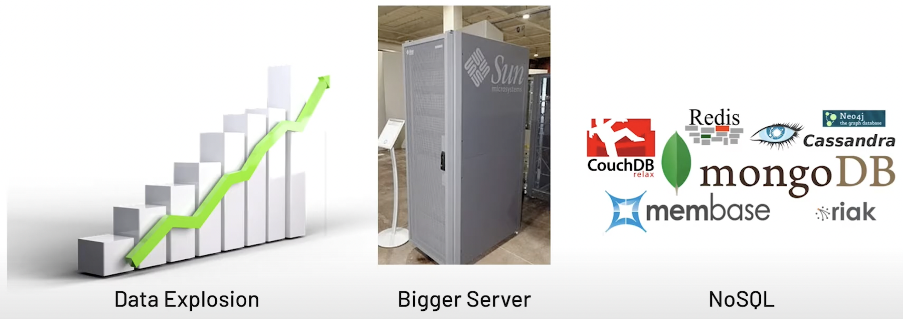
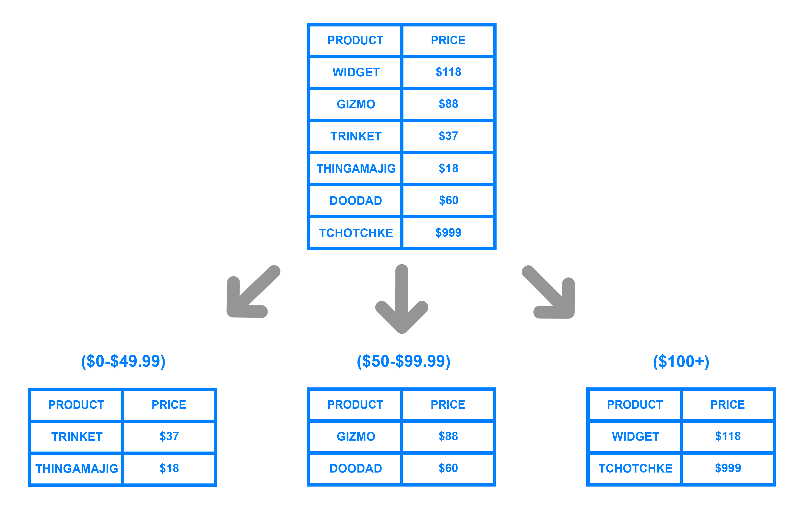
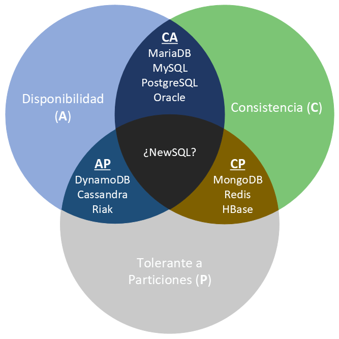

## Almacenamiento de Datos

Se puede decir que estamos en la [tercera plataforma] del almacenamiento de datos. La primera llegó con los primeros computadores y se materializó en las bases de datos jerárquicas y en red, así como en el almacenamiento ISAM. La segunda vino de la mano de internet y las arquitecturas cliente-servidor, lo que dió lugar a las bases de datos relacionales.

La tercera se ve motivada por el big data, los dispositivos móviles, las arquitecturas cloud, las redes de IoT y las tecnologías/redes sociales. Es tal el volumen de datos que se genera que aparecen nuevos paradigmas como NoSQL, NewSQL y las plataformas de Big Data. En esta sesión nos vamos a centrar en NoSQL.

NoSQL aparece como una necesidad debida al creciente volumen de datos sobre usuarios, objetos y productos que las empresas tienen que almacenar, así como la frecuencia con la que se accede a los datos. Los SGDB relacionales existentes no fueron diseñados teniendo en cuenta la escalabilidad ni la flexibilidad necesaria por las frecuentes modificaciones que necesitan las aplicaciones modernas; tampoco aprovechan que el almacenamiento a día de hoy es muy barato, ni el nivel de procesamiento que alcanzan las máquinas actuales.

<figure style="align: center;">
    
    <figcaption>Motivación de NoSQL</figcaption>
</figure>

La solución es el despliegue de las aplicaciones y sus datos en clústeres de servidores, distribuyendo el procesamiento en múltiples máquinas.

## No Solo SQL

Si definimos NoSQL formalmente, podemos decir que se trata de un conjunto de tecnologías que permiten el procesamiento rápido y eficiente de conjuntos de datos dando la mayor importancia al rendimiento, la fiabilidad y la agilidad.

Si nos basamos en el acrónimo, el término se refiere a cualquier almacén de datos que no sigue un modelo relacional, los datos no son relacionales y por tanto no utilizan SQL como lenguaje de consulta. Otra aceptación implica que el No hace referencia a *not only*, es decir, que los sistemas NoSQL se centran en sistemas complementarios a los SGBD relacionales, que fijan sus prioridades en la escalabilidad y la disponibilidad en contra de la atomicidad y consistencia de los datos.

<a name="acid"></a>

!!! info "ACID"
    Las bases de datos relacionales cumplen las características ACID para ofrecer transaccionalidad sobre los datos:

    * **A**tomicidad: las transacciones implican que se realizan todas las operaciones o no se realiza ninguna.
    * **C**onsistencia: la base de datos asegura que los datos pasan de un estado válido o otro también.
    * **I**solation (Aislamiento): Una transacción no afecta a otras transacciones, de manera que la modificación de un registro / documento no es visible por otras lecturas.
    * **Du**rabilidad: La escritura de los datos asegura que una vez finalizada una operación, los datos no se perderán.

Los diferentes tipos de bases de datos NoSQL existentes se pueden agrupar en cuatro categorías:

* **Clave-Valor**: Los almacenes clave-valor son las bases de datos NoSQL más simples. Cada elemento de la base de datos se almacena con un nombre de atributo (o clave) junto a su valor. Los almacenes más conocidos son *Redis*, *Riak* y *AWS DynamoDB*. Algunos almacenes, como es el caso de Redis, permiten que cada valor tenga un tipo (por ejemplo, integer) lo cual añade funcionalidad extra.

* **Documentales**: Cada clave se asocia a una estructura compleja que se conoce como documento. Este puede contener diferentes pares clave-valor, o pares de clave-array o incluso documentos anidados, como en un documento JSON. Los ejemplos más conocidos son *MongoDB* y *CouchDB*.

* **Grafos**: Los almacenes de grafos se usan para almacenar información sobre redes, como pueden ser conexiones sociales. Los ejemplos más conocidos son *Neo4J*, *AWS Neptune* y *ArangoDB*.

* **Basados en columnas**: Los almacenes basados en columnas como *BigTable*, *Cassandra* y *HBase* están optimizados para consultas sobre grandes conjuntos de datos, y almacenan los datos como columnas en vez de como filas.

<figure style="align: center;">
    
    <figcaption>Sistemas NoSQL</figcaption>
</figure>

### Características

Si nos centramos en sus beneficios y los comparamos con las base de datos relacionales, las bases de datos NoSQL son más escalables, ofrecen un rendimiento mayor y sus modelos de datos resuelven varios problemas que no se plantearon al definir el modelo relacional:

* Grandes volúmenes de datos estructurados, semi-estructurados y sin estructurar. Casi todas las implementaciones NoSQL ofrecen algún tipo de representación para datos sin esquema, lo que permite comenzar con una estructura y con el paso del tiempo, añadir nuevos campos, ya sean sencillos o anidados a datos ya existentes.
* Sprints ágiles, iteraciones rápidas y frecuentes *commits*/*pushes* de código, al emplear una sintaxis sencilla para la realización de consultas y la posibilidad de tener un modelo que vaya creciendo al mismo ritmo que el desarrollo.
* Arquitectura eficiente y escalable diseñada para trabajar con clusters en vez de una arquitectura monolítica y costosa. Las soluciones NoSQL soportan la escalabilidad de un modo transparente para el desarrollador.

Una característica adicional que comparten los sistemas NoSQL es que ofrecen un mecanismo de caché de datos integrado (en los sistemas relacionales se pueden configurar de manera externa), de manera que se pueden configurar los sistemas para que los datos se mantengan en memoria y se persistan de manera periódica. El uso de una caché conlleva que la consistencia de los datos no sea completa y podamos tener una consistencia eventual.

### Esquema dinámicos

Las bases de datos relacionales requieren definir los esquemas antes de añadir los datos. Una base de datos SQL necesita saber de antemano los datos que vamos a almacenar; por ejemplo, si nos centramos en los datos de un cliente, serían el nombre, apellidos, número de teléfono, etc…​

Esto casa bastante mal con los enfoques de desarrollo ágil, ya que cada vez que añadimos nuevas funcionalidades, el esquema de la base de datos suele cambiar. De modo que si a mitad de desarrollo decidimos almacenar los productos favoritos de un cliente del cual guardábamos su dirección y números de teléfono, tendríamos que añadir una nueva columna a la base de datos y migrar la base de datos entera a un nuevo esquema.

Si la base de datos es grande, conlleva un proceso lento que implica parar el sistema durante un tiempo considerable. Si frecuentemente cambiamos los datos que la aplicación almacena (al usar un desarrollo iterativo), también tendremos períodos frecuentes de inactividad del sistema. Así pues, no hay un modo efectivo mediante una base de datos relacional, de almacenar los datos que están desestructurados o que no se conocen de antemano.

Las bases de datos NoSQL se construyen para permitir la inserción de datos sin un esquema predefinido. Esto facilita la modificación de la aplicación en tiempo real, sin preocuparse por interrupciones de servicio. Aunque no tengamos un esquema al guardar la información, sí que podemos definir esquemas de lectura (*schema-on-read*) para comprobar que la información almacenada tiene el formato que espera cargar cada aplicación.

De este modo se consigue un desarrollo más rápido, integración de código más robusto y menos tiempo empleado en la administración de la base de datos.

### Particionado

Dado el modo en el que se estructuran las bases de datos relacionales, normalmente escalan verticalmente - un único servidor que almacena toda la base de datos para asegurar la disponibilidad continua de los datos. Esto se traduce en costes que se incrementan rápidamente, con un límites definidos por el propio hardware, y en un pequeño número de puntos críticos de fallo dentro de la infraestructura de datos.

La solución es escalar horizontalmente, añadiendo nuevos servidores en vez de concentrarse en incrementar la capacidad de un único servidor, lo que permite tratar con conjuntos de datos más grandes de lo que sería capaz cualquier máquina por sí sola. Este escalado horizontal se conoce como ***Sharding*** o Particionado.

El particionado no es único de las bases de datos NoSQL. Las bases de datos relacionales también lo soportan. Si en un sistema relacional queremos particionar los datos, podemos distinguir entre particionado:

* **Horizontal**: diferentes filas en diferentes particiones.
* **Vertical**: diferentes columnas en particiones distintas.

<figure style="align: center;">
    
    <figcaption>Particionado de los datos - digitalocean.com</figcaption>
</figure>

En el caso de las bases de datos NoSQL, el particionado depende del modelo de la base de datos:

* Los almacenes clave-valor y las bases de datos documentales normalmente se particionan horizontalmente.
* Las bases de datos basados en columnas se pueden particionar horizontal o verticalmente.

Escalar horizontalmente una base de datos relacional entre muchas instancias de servidores se puede conseguir pero normalmente conlleva el uso de SANs (*Storage Area Networks*) y otras triquiñuelas para hacer que el hardware actúe como un único servidor.

Como los sistemas SQL no ofrecen esta prestación de forma nativa, los equipos de desarrollo se las tienen que ingeniar para conseguir desplegar múltiples bases de datos relacionales en varias máquinas. Para ello:

* Los datos se almacenan en cada instancia de base de datos de manera autónoma
* El código de aplicación se desarrolla para distribuir los datos y las consultas y agregar los resultados de los datos a través de todas las instancias de bases de datos
* Se debe desarrollar código adicional para gestionar los fallos sobre los recursos, para realizar joins entre diferentes bases de datos, balancear los datos y/o replicarlos, etc…​

Además, muchos beneficios de las bases de datos como la integridad transaccional se ven comprometidos o incluso eliminados al emplear un escalado horizontal.

#### Auto-sharding

Por contra, las bases de datos NoSQL normalmente soportan ***auto-sharding***, lo que implica que de manera nativa y automáticamente se dividen los datos entre un número arbitrario de servidores, sin que la aplicación sea consciente de la composición del pool de servidores. Los datos y las consultas se balancean entre los servidores.

El particionado se realiza mediante un método consistente, como puede ser:

* Por **rangos** de su id: por ejemplo "los usuarios del 1 al millón están en la partición 1" o "los usuarios cuyo nombre va de la A a la E" en una partición, en otra de la M a la Q, y de la R a la Z en la tercera.
    
    <figure style="align: center;">
        
        <figcaption>Particionado por rango - digitalocean.com</figcaption>
    </figure>

* Por **listas**: dividiendo los datos por la categoría del dato, es decir, en el caso de datos sobre libros, las novelas en una partición, las recetas de cocina en otra, etc..
* Mediante un función ***hash***, la cual devuelve un valor para un elemento que determine a que partición pertenece.

    <figure style="align: center;">
        
        <figcaption>Particionado por hash - digitalocean.com</figcaption>
    </figure>

#### Cuando particionar

El motivo para particionar los datos se debe a:

* limitaciones de almacenamiento: los datos no caben en un único servidor, tanto a nivel de disco como de memoria RAM.
* rendimiento: al balancear la carga entre particiones las escrituras serán más rápidas que al centrarlas en un único servidor.
* disponibilidad: si un servidor esta ocupado, otro servidor puede devolver los datos. La carga de los servidores se reduce.

No particionaremos los datos cuando la cantidad sea pequeña, ya que el hecho de distribuir los datos conlleva unos costes que pueden no compensar con un volumen de datos insuficiente. Tampoco esperaremos a particionar cuando tengamos muchísimos datos, ya que el proceso de particionado puede provocar sobrecarga del sistema.

La nube facilita de manera considerable este escalado, mediante proveedores como AWS o Azure los cuales ofrecen virtualmente una capacidad ilimitada bajo demanda, y despreocupándose de todas las tareas necesarias para la administración de la base de datos.

Los desarrolladores ya no necesitamos construir plataformas complejas para nuestras aplicaciones, de modo que nos podemos centrar en escribir código de aplicación. Una granja de servidores con *commodity hardware* puede ofrecer el mismo procesamiento y capacidad de almacenamiento que un único servidor de alto rendimiento por mucho menos coste.

### Replicación

La replicación mantiene copias idénticas de los datos en múltiples servidores, lo que facilita que las aplicaciones siempre funcionen y los datos se mantengan seguros, incluso si alguno de los servidores sufre algún problema.

La mayoría de las bases de datos NoSQL también soportan la replicación automática, lo que implica una alta disponibilidad y recuperación frente a desastres sin la necesidad de aplicaciones de terceros encargadas de ello. Desde el punto de vista del desarrollador, el entorno de almacenamiento es virtual y ajeno al código de aplicación.


Existen dos formas de realiza la replicación:

####  Maestro-esclavo / Primario-secundario

Todas las escrituras se realizan en el nodo principal y después se replican a los nodos secundarios. El nodo primario es un SPOF (*single point of failure*).

<figure style="align: center;">
    
    <figcaption>Replicación primario-secundario</figcaption>
</figure>

#### Par-a-par (*peer-to-peer*)

Todos los nodos tienen el mismo nivel jerárquico, de manera que todos admiten escrituras. Al poder haber escrituras simultáneas sobre el mismo datos en diferentes nodos, pueden darse inconsistencia en los datos.
    
<figure style="align: center;">
    
    <figcaption>Replicación Peer-to-peer</figcaption>
</figure>

La replicación de los datos se utiliza para alcanzar:

* **escalabilidad**, incrementando el rendimiento al poder distribuir las consultas en diferentes nodos, y mejorar la redundancia al permitir que cada nodo tenga una copia de los datos.
* **disponibilidad**, ofreciendo tolerancia a fallos de hardware o corrupción de la base de datos. Al replicar los datos vamos a poder tener una copia de la base de datos, dar soporte a un servidor de datos agregados, o tener nodos a modo de copias de seguridad que pueden tomar el control en caso de fallo.
* **aislamiento** (la i en ACID - *isolation*), entendido como la propiedad que define cuando y cómo al realizar cambios en un nodo se propagan al resto de nodos. Si replicamos los datos podemos crear copias sincronizadas para separar procesos de la base de datos de producción, pudiendo ejecutar informes, analítica de datos o copias de seguridad en nodos secundarios de modo que no tenga un impacto negativo en el nodo principal, así como ofrecer un sistema sencillo para separar el entorno de producción del de preproducción.

!!! caution "Replicación vs particionado"
    No hay que confundir la replicación (copia de los datos en varias máquinas) con el particionado (cada máquina tiene un subconjunto de los datos). El entorno más seguro y con mejor rendimiento es aquel que tiene los datos particionados y replicados (cada máquina que tiene un subconjunto de los datos está replicada en 2 o más).

    <figure style="align: center;">
        
        <figcaption>Replicación y particionado - codingexplained.com/figcaption>
    </figure>


### Implantando NoSQL

Normalmente, las empresas empezarán con una prueba de baja escalabilidad de una base de datos NoSQL, de modo que les permita comprender la tecnología asumiendo muy poco riesgo. La mayoría de las bases de datos NoSQL también son open-source, y por tanto se pueden probar sin ningún coste extra. Al tener unos ciclos de desarrollo más rápidos, las empresas pueden innovar con mayor velocidad y mejorar la experiencia de sus cliente a un menor coste.

Elegir la base de datos correcta para el proyecto es un tema importante. Se deben considerar las diferentes alternativas a las infraestructuras *legacy* teniendo en cuenta varios factores:

* la escalabilidad o el rendimiento más allá de las capacidades del sistema existente.
* identificar alternativas viables respecto al software propietario.
* incrementar la velocidad y agilidad del proceso de desarrollo.

Así pues, al elegir un base de datos hemos de tener en cuenta las siguientes dimensiones:

* modelo de datos: A elegir entre un modelo documental, basado en columnas, de grafos o mediante clave-valor.
* modelo de consultas: Dependiendo de la aplicación, puede ser aceptable un modelo de consultas que sólo accede a los registros por su clave primaria. En cambio, otras aplicaciones pueden necesitar consultar por diferentes valores de cada registro. Además, si la aplicación necesita modificar los registros, la base de datos necesita consultar los datos por un índice secundario.
* modelo de consistencia: Los sistemas NoSQL normalmente mantienen múltiples copias de los datos para ofrecer disponibilidad y escalabilidad al sistema, lo que define la consistencia del mismo. Los sistemas NoSQL tienden a ser consistentes o eventualmente consistentes.
* APIs: No existe un estándar para interactuar con los sistemas NoSQL. Cada sistema presenta diferentes diseños y capacidades para los equipos de desarrollo. La madurez de un API puede suponer una inversión en tiempo y dinero a la hora de desarrollar y mantener el sistema NoSQL.
* soporte comercial y de la comunidad: Los usuarios deben considerar la salud de la compañia o de los proyectos al evaluar una base de datos. El producto debe evolucionar y mantenerse para introducir nuevas prestaciones y corregir fallos. Una base de datos con una comunidad fuerte de usuarios:

    * permite encontrar y contratar desarrolladores con destrezas en el producto.
    * facilita encontrar información, documentación y ejemplos de código.
    * ayuda a las empresas a retener el talento.
    * favorece que otras empresas de software integren sus productos y participen en el ecosistema de la base de datos.

#### Casos de uso

Una vez conocemos los diferentes sistemas y qué elementos puede hacer que nos decidamos por una solución u otra, conviene repasar los casos de uso más comunes:

* si vamos a crear una aplicación web cuyo campos sean personalizables, usaremos una solución documental.
* como una capa de caché, mediante un almacén clave-valor.
* para almacenar archivos binarios sin preocuparse de la gestión de permisos del sistema de archivos, y poder realizar consultas sobre sus metadatos, ya sea mediante una solución documental o un almacén clave-valor.
* para almacenar un enorme volumen de datos, donde la consistencia no es lo más importante, pero si la disponibilidad y su capacidad de ser distribuida, mediante una solución documental o basada en columnas.

## Modelos de Datos

La principal clasificación de los sistemas de bases de datos NoSQL se realiza respecto a los diferentes modelos de datos:

### Documental

Mientras las bases de datos relacionales almacenan los datos en filas y columnas, las bases de datos documentales emplean documentos. Estos documentos utilizan una estructura JSON, ofreciendo un modo natural e intuitivo para modelar datos de manera similar a la orientación a objetos, donde cada documento es un objeto.

<figure style="align: center;">
    
    <figcaption>Representación de un documento</figcaption>
</figure>

Los documentos se agrupan en colecciones o bases de datos, dependiendo del sistema, lo que permite agrupar documentos.

Los documentos contienen uno o más campos, donde cada campo contiene un valor con un tipo, ya sea cadena, fecha, binario o array u otro documento. En vez de extender los datos entre múltiples columnas y tablas, cada registro y sus datos asociados se almacenan de manera unida en un único documento. Esto simplifica el acceso a los datos y reduce (y en ocasiones elimina) la necesidad de *joins* y transacciones complejas.

Dicho de otra manera, en las bases de datos documentales, los datos que van juntos y se emplean juntos, se almacenan juntos.

#### Características

En una base de datos documental, la noción de esquema es dinámico: cada documento puede contener diferentes campos. Esta flexibilidad puede ser útil para modelar datos desestructurados y polimórficos, lo que facilita la evolución del desarrollo al permitir añadir nuevos campos de manera dinámica.

Perfectamente podemos tener dos documentos que pertenecen a la misma colección, pero con atributos diferentes. Por ejemplo, un primer documento puede ser el siguiente:

``` json
{
  "_id": "BW001",
  "nombre"    : "Bruce",
  "apellido"  : "Wayne",
  "edad"      : 35,
  "salario"   : 10000000
}
```

Mientras que un segundo documento dentro de la misma colección podría ser:

``` json
{
  "_id": "JK1",
  "nombre"    : "Joker",
  "edad"      : 34,
  "salario"    : 5000000,
  "direccion" : {               // (1)!
    "calle"   : "Asilo Arkham",
    "ciudad"  : "Gotham"
  },
  "proyectos" : [               // (2)!
    "desintoxicacion-virus",
    "top-secret-007"
  ]
}
```

1. Un objeto o subdocumento permite agrupar información similar a una relación 1:1 de un modelo relacional. De esta manera, no necesitamos una tabla `Direccion`.
2. Un array puede contener valores o documentos, de manera que podríamos tener un array de documentos, permitiendo agrupar información similar a una relación 1:N de un modelo relacional. De esta manera, no necesitamos una tabla `Proyectos`.

Normalmente, cada documento contiene un elemento clave, sobre el cual se puede obtener un documento de manera unívoca. De todos modos, las bases de datos documentales ofrecen un completo mecanismo de consultas, posibilitando obtener información por cualquier campo del documento. Algunos productos ofrecen opciones de indexado para optimizar las consultas, como pueden ser índices compuestos, dispersos, con tiempo de vida (TTL), únicos, de texto o geoespaciales.

Además, estos sistemas ofrecen productos que permiten analizar los datos, mediante funciones de agregación o implementación de MapReduce.

Respecto a la modificaciones, los documentos se pueden actualizar en una única sentencia, sin necesidad de dar rodeos para elegir los datos a modificar.

#### Casos de uso

Las bases de datos documentales sirven para propósito general, válidos para un amplio abanico de aplicaciones gracias a la flexibilidad que ofrece el modelo de datos, lo que permite consultar cualquier campo y modelar de manera natural de manera similar a la programación orientada a objetos.

Entre los casos de éxito de estos sistemas cabe destacar:

* Sistemas de flujo de eventos: entre diferentes aplicaciones dentro de una empresa
* Gestores de Contenido, plataformas de Blogging: al almacenar los documentos mediante JSON, facilita la estructura de datos para guardar los comentarios, registros de usuarios, etc…​
* Analíticas Web, datos en Tiempo Real: al permitir modificar partes de un documento, e insertar nuevos atributos a un documento cuando se necesita una nueva métrica
* Aplicaciones eCommerce: conforme las aplicaciones crecen, el esquema también lo hace

Si nos centramos en aquellos casos donde no conviene este tipo de sistemas podemos destacar:

* Sistemas operacionales con transacciones complejas.
* Sistemas con consultas agregadas que modifican su estructura. Si los criterios de las consultas no paran de cambiar, acabaremos normalizando los datos.

Los productos más destacados son:

* MongoDB: <http://www.mongodb.com>. Esta base de datos la vamos a estudiar en profundidad en esta unidad de trabajo.
* CouchDB: <http://couchdb.apache.org>

### Clave-Valor

Un almacén clave-valor es una simple tabla *hash* donde todos los accesos a la base de datos se realizan a través de la clave primaria.

Desde una perspectiva de modelo de datos, los almacenes de clave-valor son los más básicos.

Su funcionamiento es similar a tener una tabla relacional con dos columnas, por ejemplo `id` y `nombre`, siendo `id` la columna utilizada como clave y `nombre` como valor. Mientras que en una base de datos en el campo `nombre` sólo podemos almacenar datos de tipo cadena o numérico, en un almacén clave-valor, el valor puede ser de un dato simple o un objeto. Cuando una aplicación accede mediante la clave y el valor, se almacenan el par de elementos. Si la clave ya existe, el valor se modifica.

<figure style="align: center;">
    
    <figcaption>Representación de un almacén clave-valor</figcaption>
</figure>

El cliente puede tanto obtener el valor por la clave, asignar un valor a una clave o eliminar una clave del almacén. El valor, sin embargo, es opaco al sistema, el cual no sabe que hay dentro de él, ya que los datos sólo se pueden consultar por la clave, lo cual puede ser un inconveniente. Así pues, la aplicación es responsable de saber qué hay almacenado en cada valor.

Por ejemplo, [Riak](https://riak.com) utiliza el concepto de *bucket* (cubo) como una manera de agrupar claves, de manera similar a una tabla.

Por ejemplo, *Riak* permite interactuar con la base de datos mediante peticiones HTTP:

``` bash
curl -v -X PUT <http://localhost:8091/riak/heroes/ace> -H "Content-Type: application/json" -d {"nombre" : "Batman", "color" : "Negro"}
```

Algunos almacenes clave-valor, como puede ser [Redis](https://redis.io), permiten almacenar datos con cualquier estructura, como por ejemplos listas, conjuntos, hashes y pueden realizar operaciones como intersección, unión, diferencia y rango.


=== "Comandos Redis"

    ``` redis
    SET nombre "Bruce Wayne"      // String
    HSET heroe nombre "Batman"    // Hash – set
    HSET heroe color "Negro"
    SADD "heroe:amigos" "Robin" "Alfred"   // Set – create/update
    ```

=== "Python"

    ``` python
    import redis
    r = redis.Redis()
    r.mset({"Croatia": "Zagreb", "Bahamas": "Nassau"})
    r.get("Bahamas")
    # b'Nassau'
    ```

Estas prestaciones hacen que *Redis* se extrapole a ámbitos ajenos a un almacén clave-valor. Otra característica que ofrecen algunos almacenes es que permiten crear un segundo nivel de consulta o incluso definir más de una clave para un mismo objeto.

Como los almacenes clave-valor siempre utilizan accesos por clave primaria, de manera general tienen un gran rendimiento y son fácilmente escalables.

Si queremos que su rendimiento sea máximo, pueden configurarse para que mantengan la información en memoria y que se serialice de manera periódica, a costa de tener una consistencia eventual de los datos.

#### Casos de uso

Este modelo es muy útil para representar datos desestructurados o polimórficos, ya que no fuerzan ningún esquema más allá de los pares de clave-valor.

Entre los casos de uso de estos almacenes podemos destacar el almacenaje de:

* Información sobre la sesión de navegación (*sessionid*)
* Perfiles de usuario, preferencias
* Datos del carrito de la compra
* Cachear datos

Todas estas operaciones van a asociada a operaciones de recuperación, modificación o inserción de los datos de una sola vez, de ahí su elección.

En cambio, no conviene utilizar estos almacenes cuando queremos realizar:

* Relaciones entre datos
* Transacciones entre varias operaciones
* Consultas por los datos del valor
* Operaciones con conjuntos de claves

Los almacenes más empleados son:

* Riak: <https://riak.com>
* Redis: <http://redis.io>
* AWS DynamoDB: <http://aws.amazon.com/dynamodb>
* Voldemort: <http://www.project-voldemort.com/voldemort> implementación open-source de *Amazon DynamoDB*

### Basado en columnas

Las bases de datos relacionales utilizan la fila como unidad de almacenamiento, lo que permite un buen rendimiento de escritura. Sin embargo, cuando las escrituras son ocasionales y es más comun tener que leer unas pocas columnas de muchas filas a la vez, es mejor utilizar como unidad de almacenamiento un grupos de columnas. Es decir, lo que hacemos es girar el modelo 90 grados, de manera que los registros se almacenan en columnas en vez de hacerlo por filas.

Supongamos que tenemos los siguientes datos:

<figure style="align: center;">
    
    <figcaption>Ejemplo de tabla</figcaption>
</figure>

Dependiendo del almacenamiento en filas o columnas tendríamos la siguiente representación:

<figure style="align: center;">
    
    <figcaption>Comparación filas y columnas</figcaption>
</figure>

En un formato columnar los datos del mismo tipo se agrupan, lo que permite codificarlos/comprimirlos, lo que mejora el rendimiento de acceso y reduce el tamaño:

<figure style="align: center;">
    
    <figcaption>Comparación filas y columnas</figcaption>
</figure>

!!! question "Autoevaluación"
    Si tenemos que añadir un nuevo registro ¿Qué modelo será más eficiente?

Sin embargo, a medida que se incrementa la utilización de análisis de datos en memoria, con soluciones como *Spark*, los beneficios relativos de la base de datos columnares comparados con los de las bases de datos orientadas a filas pueden llegar a ser menos importantes.

#### Representación

Un modelo basado en columnas se representa como una estructura agregada de dos niveles. El primer nivel formado por un almacén clave-valor, siendo la clave el identificador de la fila, y el valor un nuevo mapa con los datos agregados de la fila (familias de columnas). Los valores de este segundo nivel son las columnas. De este modo, podemos acceder a los datos de un fila, o a una determinada columna:

<figure style="align: center;">
    
    <figcaption>Representación de un almacén basado en columnas</figcaption>
</figure>

!!! info "BigTable"
    Los modelos de datos basados en columnas se basan en la implementación de *Google* de la tecnología *BigTable* (<http://research.google.com/archive/bigtable.html>), la cual consiste en columnas separadas y sin esquema, a modo de mapa de dos niveles.

Así pues, los almacenes basados en columnas utilizan un mapa ordenado multi-dimensional y distribuido para almacenar los datos. Están pensados para que cada fila tenga una gran número de columnas (del orden del millón), almacenando las diferentes versiones que tenga una fila (pudiendo almacenar del orden de miles de millones de filas).

#### Familias de columnas

Una **columna** consiste en un pareja `name`-`value`, donde el nombre hace de clave. Además, contiene un atributo `timestamp` para poder expirar datos y resolver conflictos de escritura.

Un ejemplo de columna podría ser:

``` json
{
  name: "nombre",
  value: "Bruce",
  timestamp: 12345667890
}
```

Una fila es una colección de columnas agrupadas a una clave. Si agrupamos filas similares tendremos una **familia de columnas**:

``` json
// familia de columnas
{
  // fila
  "tim-gordon" : {
    nombre: "Tim",
    apellido: "Gordon",
    ultimaVisita: "2015/12/12"
  }
  // fila
  "bruce-wayne" : {
    nombre: "Bruce",
    apellido: "Wayne",
    lugar: "Gotham"
  }
}
```

Con este ejemplo, podemos ver como las diferentes filas de la misma tabla (familia de columnas) no tienen por que compartir el mismo conjunto de columnas.

Además, las columnas se pueden anidar dentro de otras formando **super-columnas**, donde el valor es un nuevo mapa de columnas.

``` json
{
  name: "libro:978-84-16152-08-7",
  value: {
    autor: "Grant Morrison",
    titulo: "Batman - Asilo Arkham",
    isbn: "978-84-16152-08-7"
  }
}
```

Cuando se utilizan super columnas para crear familias de columnas tendremos una familia de super columnas.

En resumen, las bases de datos basadas en columnas, almacenan los datos en familias de columnas como filas, las cuales tienen muchas columnas asociadas al identificador de una fila. Las familias de columnas son grupos de datos relacionados, a las cuales normalmente se accede de manera conjunta.

#### Operaciones

A la hora de consultar los datos, éstos se pueden obtener por la clave primaria de la familia. Así pues, podemos obtener toda una familia, o la columna de una familia:

``` python
// Mediante Cassandra
GET Clientes['bruce-wayne'];  // familia
GET Clientes['bruce-wayne']['lugar']; // columna
```

Algunos productos ofrecen un soporte limitado para índices secundarios, pero con restricciones. Por ejemplo, *Cassandra* ofrece el lenguaje CQL similar a SQL pero sin joins, ni subconsultas donde las restricciones de *where* son sencillas:

``` sql
SELECT * FROM Clientes
SELECT nombre,email FROM Clientes
SELECT nombre,email FROM Clientes WHERE lugar='Gotham'
```

Las actualizaciones se realizan en dos pasos: primero encontrar el registro y segundo modificarlo. En estos sistemas, una modificación puede suponer una reescritura completa del registro independientemente que hayan cambiado unos pocos *bytes* del mismo.

#### Casos de uso

Las bases de datos columnares se han empleado durante décadas ofreciendo beneficios a las aplicaciones de negocio modernas, como la analítica de datos, *business intelligence* y *data warehousing*.

Son multipropósito, aunque su uso se centra en el mercado del big data, la analítica de datos, cubos multidimensionales OLAP y/o almacenar metadatos y realizar analítica en tiempo real.

Además de poder comprimir los datos, los datos están auto-indexados, lo que implica que utiliza menos espacio en disco, y acelera la ejecución de consultas agregadas entre múltiples tablas que implica el uso de joins.

En cambio, no se recomienda su uso en aplicaciones de procesamiento transaccional (OLTP), ya que las bases de datos relaciones gestionan mejor el procesamiento concurrente y el aislamiento de las operaciones.

Los productos más destacados son:

* HBase : <http://hbase.apache.org>, el cual se basa en Hadoop - <http://hadoop.apache.org>
* Cassandra : <http://cassandra.apache.org>
* Amazon Redshift: <https://aws.amazon.com/es/redshift/>

### Grafos

Las bases de datos de grafos almacenan entidades y las relaciones entre estas entidades. Las entidades se conocen como nodos, los cuales tienen propiedades. Cada nodo es similar a una instancia de un objeto. Las relaciones, también conocidas como vértices, a su vez tienen propiedades, y su sentido es importante.

<figure style="align: center;">
    
    <figcaption>Representación de un grafo</figcaption>
</figure>

Los nodos se organizan mediante relaciones que facilitan encontrar patrones de información existente entre los nodos. Este tipo de organización permite almacenar los datos una vez e interpretar los datos de diferentes maneras dependiendo de sus relaciones.

Los nodos son entidades que tienen propiedades, tales como el nombre. Por ejemplo, en el gráfico cada nodo tiene una propiedad `name`. También podemos ver que las relaciones tienen tipos, como `label`, `since`, etc…​ Estas propiedades permiten organizar los nodos. Las relaciones pueden tener múltiples propiedades, y además tienen dirección, con lo cual si queremos incluir bidireccionalidad tenemos que añadir dos relaciones en sentidos opuestos. Tanto los nodos como las relaciones tienen un atributo `id` que los identifica.

Por ejemplo, podemos comenzar a crear el grafo anterior mediante Neo4J de la siguiente manera:

``` java
Node alice = graphDb.createNode();
alice.setProperty("name", "Alice");
Node bob = graphDb.createNode();
bob.setProperty("name", "Bob");

alice.createRelationshipTo(bob, FRIEND);
bob.createRelationshipTo(alice, FRIEND);
```

Los nodos permiten tener diferentes tipos de relaciones entre ellos y así representar relaciones entre las entidades del dominio, y tener relaciones secundarias para características como categoría, camino, árboles de tiempo, listas enlazas para acceso ordenado, etc…​ Al no existir un límite en el número ni en el tipo de relaciones que puede tener un nodo, todas se pueden representar en la misma base de datos.

#### Traversing

Una vez tenemos creado un grafo de nodos y relaciones, podemos consultar el grafo de muchas maneras; por ejemplo "obtener todos los nodos que son miembros del grupo de ajedrez y que tienen más de 20 años". Realizar una consulta se conoce como hacer un *traversing* (recorrido) del mismo.

Ejemplo de Traversing mediante Neo4J:

``` java
Node ajedrez = nodeIndex.get("name", "chess").getSingle();
allRelationships = ajedrez.getRelationships(Direction.INCOMING);
```

Una ventaja a destacar de las bases de datos basadas en grafos es que podemos cambiar los requisitos de *traversing* sin tener que cambiar los nodos o sus relaciones.

En las bases de datos de grafos, recorrer las relaciones es muy rápido, ya que no se calculan en tiempo de consulta, sino que se persisten como una relación, y por tanto no hay que hacer ningún cálculo.

En cambio, en una base de datos relacional, para crear una estructura de grafo se realiza para una relación sencilla (*¿Quien es mi jefe?"*). Para poder añadir otras relaciones necesitamos muchos cambios en el esquema y trasladar datos entre tablas. Además, necesitamos de antemano saber que consultas queremos realizar para modelar las tablas y las relaciones acorde a las consultas.

Así pues, estos sistemas ofrecen modelos ricos de consultas donde se pueden investigar las relaciones simples y complejas entre los nodos para obtener información directa e indirecta de los datos del sistemas. Los tipos de análisis que se realizan sobre estos sistema se ciñen a los tipos de relación existente entre los datos.

#### Casos de uso

Mientras que el modelo de grafos no es muy intuitivo y tiene una importante curva de aprendizaje, se puede usar en un gran número de aplicaciones.

Su principal atractivo es que facilitan almacenar las relaciones entre entidades de una aplicación, como por ejemplo en una red social, o las intersecciones existentes entre carreteras. Es decir, se emplean para almacenar datos que se representan como nodos interconectados.

Por lo tanto, los casos de uso son:

* Datos conectados: redes sociales con diferentes tipos de conexiones entre los usuarios.
* Enrutamiento, entrega o servicios basados en la posición: si las relaciones almacenan la distancia entre los nodos, podemos realizar consultas sobre lugares cercanos, trayecto más corto, etc…​
* Motores de recomendaciones: de compras, de lugares visitados, etc…​

En cambio, no se recomienda su uso cuando necesitemos modificar todos o un subconjunto de entidades, ya que modificar una propiedad en todos los nodos es una operación compleja.

Los productos más destacados son:

* Neo4j: <http://neo4j.com>
* ArangoDB: <https://www.arangodb.com/>
* Apache Giraph: <https://giraph.apache.org/>
* Amazon Neptune: <https://aws.amazon.com/es/neptune/>

## Consistencia

En un sistema consistente, las escrituras de una aplicación son visibles en siguientes consultas. Con una consistencia eventual, las escrituras no son visibles inmediatamente.

Por ejemplo, en un sistema de control de stock, si el sistema es consistente, cada consulta obtendrá el estado real del inventario, mientras que si tiene consistencia eventual, puede que no sea el estado real en un momento concreto pero terminará siéndolo en breve.

### Sistemas consistentes

Cada aplicación tiene diferentes requisitos para la consistencia de los datos. Para muchas aplicaciones, es imprescindible que los datos sean consistentes en todo momento. Como los equipos de desarrollo han estado trabajo con un modelo de datos relacional durante décadas, este enfoque parece natural. Sin embargo, en otras ocasiones, la consistencia eventual es un traspiés aceptable si conlleva una mayor flexibilidad en la disponibilidad del sistema.

Las bases de datos documentales y de grafos pueden ser consistentes o eventualmente consistentes. Por ejemplo, *MongoDB* ofrece un consistencia configurable. De manera predeterminada, los datos son consistentes, de modo que todas las escrituras y lecturas se realizan sobre la copia principal de los datos. Pero como opción, las consultas de lectura, se pueden realizar con las copias secundarias donde los datos tendrán consistencia eventual. La elección de la consistencia se realiza a nivel de consulta.

### Sistemas de consistencia eventual

Con los sistemas eventualmente consistentes, hay un período de tiempo en el que todas las copias de los datos no están sincronizados. Esto puede ser aceptable para aplicaciones de sólo-lectura y almacenes de datos que no cambian frecuentemente, como los archivos históricos. Dentro del mismo saco podemos meter las aplicaciones con alta tasa de escritura donde las lecturas sean poco frecuentes, como un archivo de log.

Un claro ejemplo de sistema eventualmente consistente es el servicio DNS, donde tras registrar un dominio, puede tardar varios días en propagar los datos a través de Internet, pero siempre están disponibles aunque contenga una versión antigua de los datos.

Respecto a las bases de datos NoSQL, los almacenes de clave-valor y los basados en columnas son sistemas eventualmente consistentes. Estos tienen que soportar conflictos en las actualizaciones de registros individuales.

Como las escrituras se pueden aplicar a cualquier copia de los datos, puede ocurrir, y no sería muy extraño, que hubiese un conflicto de escritura.

Algunos sistemas como *Riak* utilizan vectores de reloj para determinar el orden de los eventos y asegurar que la operación más reciente gana en caso de un conflicto.

Otros sistemas como *CouchDB*, retienen todos los valores conflictivos y permiten al usuario resolver el conflicto. Otro enfoque seguido por *Cassandra* sencillamente asume que el valor más grande es el correcto.

Por estos motivos, las escrituras tienden a comportarse bien en sistemas eventualmente consistentes, pero las actualizaciones pueden conllevar sacrificios que complican la aplicación.

## Teorema de CAP

Propuesto por *Eric Brewer* en el año 2000, prueba que podemos crear una base de datos distribuida que elija dos de las siguientes tres características:

* **C**onsistencia: las escrituras son atómicas y todas las peticiones posteriores obtienen el nuevo valor, independientemente del lugar de la petición.
* Disponibilidad (***A**vailable*): la base de datos devolverá siempre un valor. En la práctica significa que no hay *downtime*.
* Tolerancia a **P**articiones: el sistema funcionará incluso si la comunicación con un servidor se interrumpe de manera temporal (para ello, ha de dividir los datos entre diferentes nodos). Es decir, implica que se pueden recibir lecturas desde unos nodos que no contienen información escrita en otros.

En otras palabras, podemos crear un sistema de base de datos que sea consistente y tolerante a particiones (CP), un sistema que sea disponible y tolerante a particiones (AP), o un sistema que sea consistente y disponible (CA). Pero no es posible crear una base de datos distribuida que sea consistente, disponible y tolerante a particiones al mismo tiempo.

<figure style="align: center;">
    
    <figcaption>Teorema de CAP</figcaption>
</figure>

El teorema CAP es útil cuando consideramos el sistema de base de datos que necesitamos, ya que nos permite decidir cual de las tres características vamos a descartar. La elección realmente se centra entre la disponibilidad y la consistencia, ya que la tolerancia a particiones es una decisión de arquitectura (sea o no distribuida).

Aunque el teorema dicte que si en un sistema distribuido elegimos disponibilidad no podemos tener consistencia, todavía podemos obtener consistencia eventual. Es decir, cada nodo siempre estará disponible para servir peticiones, aunque estos nodos no puedan asegurar que la información que contienen sea consistente (pero si bastante precisa), en algún momento lo será.

Algunas bases de datos tolerantes a particiones se pueden ajustar para ser más o menos consistentes o disponible a nivel de petición. Por ejemplo, *Riak* trabaja de esta manera, permitiendo a los clientes decidir en tiempo de petición que nivel de consistencia necesitan.

### Clasificación según CAP

El siguiente gráfico muestra como dependiendo de estos atributos podemos clasificar los sistemas NoSQL:

<figure style="align: center;">
    
    <figcaption>Clasificación según CAP</figcaption>
</figure>

Así pues, las bases de datos NoSQL se clasifican en:

* **CP**: Consistente y tolerantes a particiones. Tanto *MongoDB* como *HBase* son CP, ya que dentro de una partición pueden no estar disponibles para responder una determinada consulta (por ejemplo, evitando lecturas en los nodos secundarios), aunque son tolerantes a fallos porque cualquier nodo secundario se puede convertir en principal y asumir el rol del nodo caído.
* **AP**: Disponibles y tolerantes a particiones. *DynamoDB* permite replicar los datos entre sus nodos aunque no garantiza la consistencia en ninguno de los sus servidores.
* **CA**: Consistentes y disponible. Aquí es donde situaríamos a los SGDB relacionales. Por ejemplo, *PostreSQL* es CA (aunque ambas soluciones ofrecen productos complementarios para dar soporte al particionado, como Redis Cluster y PgCluster), ya que no distribuyen los datos y por tanto la partición no es una restricción.

Lo bueno es que la gran mayoría de sistemas permiten configurarse para cambiar su tipo CAP, lo que permite que *MongoDB* pase de CP a AP, o *CouchDB* de AP a CP.

### BASE

Partiendo del teorema de CAP, de forma análoga al modelo transaccional [ACID](#acid) para las bases de datos relacionales que dan soporte a la transaccionalidad ofreciendo en todo momento un sistema consistente, las bases de datos distribuidas siguen el modelo transaccional BASE, el cual se centra en la alta disponibilidad y significa:

* Básicamente disponible (***B****asically* ***A****vailable*): la base de datos siempre responde a las solicitudes recibidas, ya sea con una respuesta exitosa o con un error, aún en el caso de que el sistema soporte la tolerancia a particiones (de manera que caiga algún nodo o no esté accesible por problemas de la red). Esto puedo implicar lecturas desde nodos que no han recibido la última escritura, por lo que el resultado puede no ser consistente.
* Estado blando (***S****oft State*): la base de datos puede encontrarse en un estado inconsistente cuando se produce una lectura, de modo que es posible realizar dos veces la misma lectura y obtener dos resultados distintos a pesar de que no haya habido ninguna escritura entre ambas operaciones, sino que la escritura se había realizado antes en el tiempo y no se había persistido hasta ese momento.
* Consistencia eventual (***E****ventual consistency*): tras cada escritura, la consistencia de la base de datos sólo se alcanza una vez el cambio ha sido propagado a todos los nodos. Durante el tiempo que tarda en producirse la consistencia, observamos un estado blando de la base de datos.

Una base de datos que sigue el modelo transaccional BASE prefiere la disponibilidad antes que la consistencia (es decir, desde el punto de vista del teorema CAP es AP).

## Referencias

* [Next Generation Databases](https://link.springer.com/book/10.1007/978-1-4842-1329-2): NoSQL, NewSQL, and Big Data
* [NoSQL Distilled](https://www.informit.com/store/nosql-distilled-a-brief-guide-to-the-emerging-world-9780321826626): A Brief Guide to the Emerging World of Polyglot Persistence
* [Row vs Column Oriented Databases](https://dataschool.com/data-modeling-101/row-vs-column-oriented-databases/)
* [Understanding Database Sharding](https://www.digitalocean.com/community/tutorials/understanding-database-sharding)

## Actividades

1. (RA5075.2 / CE5.2a / 2p) Contesta a las siguientes preguntas:
    1. ¿Qué significa el prefijo No del acrónimo *NoSQL*?
    2. ¿Un sistema puede soportar al mismo tiempo replicación y particionado?
    3. Para los siguientes supuestos, indica qué modelo de datos emplearías y justifica tu respuesta:
        1. Wiki sobre de personajes de cómics.
        2. Información académica de un país (centros, alumnos, profesores, asignaturas, calificaciones, …​)
    4. Investiga en qué consiste la *persistencia políglota*.
    5. Clasifica las siguientes bases de datos según el teorema de CAP en CA, CP o AP: *BigTable, Cassandra, CouchDB, DynamoDB, HBase, MongoDB, Redis, Riak, Voldemort*.

2. (RA5075.2 / CE5.2a / 1p) Crea una presentación de 5-6 diapositivas donde expliques en qué consiste el movimiento *NewSQL*, su relación con *NoSQL* y qué ofrecen bases de datos como *CockroachDB* y/o *VoltDB*.

*[CE5.2a]: Se ha determinado la importancia de los sistemas de almacenamiento para depositar y procesar grandes cantidades de cualquier tipo de datos rápidamente.
*[RA5075.2]: Gestiona sistemas de almacenamiento y el amplio ecosistema alrededor de ellos facilitando el procesamiento de grandes cantidades de datos sin fallos y de forma rápida.
