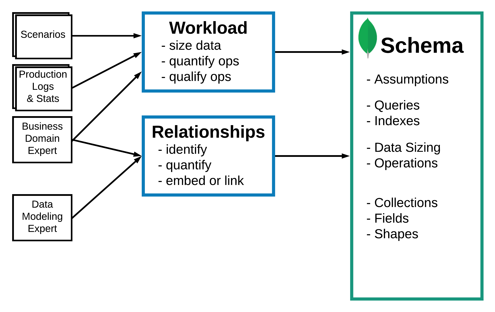
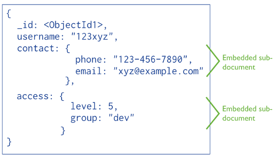
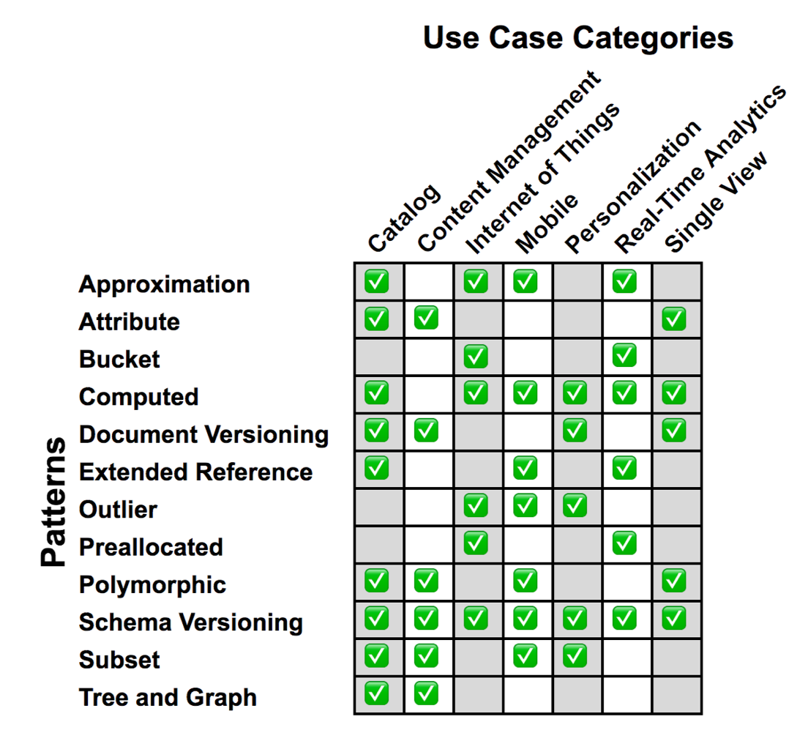
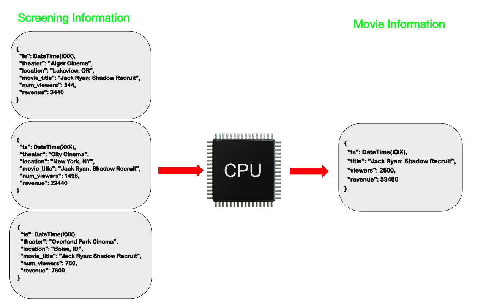

Antes de estudiar cómo modelar de forma adecuada nuestros datos en un modelo de datos documental, en concreto dentro de *MongoDB*, es conveniente recordar que:

* Mediante un documento podemos mantener toda la información que se utiliza junta en un único documento, sin necesidad de separar los datos en diferentes colecciones.
* Las propiedades transaccionales [ACID](02mongo.md#acid) se cumplen a nivel de documento. Si tenemos la información separada en varios documentos, tenemos que utilizar el [modelo transaccional](https://www.mongodb.com/docs/manual/core/transactions/) de *MongoDB* de forma programativa.

Dependiendo del tipo de relación entre dos documentos, normalizaremos los datos para minimizar la redundancia pero manteniendo en la medida de lo posible que mediante operaciones atómicas se mantenga la integridad de los datos. Para ello, bien crearemos referencias entre dos documentos o embeberemos un documento dentro de otro, pero intentando que la información más utilizada quepa en un único documento.

*MongoDB* es una base de datos documental, no relacional, donde el esquema no se debe basar en el uso de claves ajenas/*joins*, ya que realmente no existen. A la hora de diseñar un esquema, si nos encontramos que el esquema está en 3FN o si cuando hacemos consultas estamos teniendo que realizar varias consultas de manera programativa (primero acceder a una tabla, con ese `_id` ir a otra tabla, etc… o hacemos un uso extensivo del operador `$lookup` mediante el *framework* de agregación.) es que no estamos siguiendo el enfoque adecuado.

En resumen, diseñar un buen modelo de datos puede suponer que nuestro código sea más legible y mantenible, así como un mayor rendimiento de nuestras aplicaciones.

## Metodología

A la hora de tomar decisiones sobre nuestro modelo, nuestra primera decisión es si vamos a modelar para obtener una mayor simplicidad del esquema o queremos un mejor rendimiento.

Si nuestro equipo de desarrollo es pequeño o estamos desarrollando una única aplicación, nos decantaremos por la **simplicidad** cuando las consultas suelan ser siempre las mismas, pudiendo embeber la mayoría de entidades en un único documento. En cambio, si nuestro equipo es grande, multiples aplicaciones realizan un gran número de lecturas/escrituras, nos centraremos en el **rendimiento**, donde nos centraremos en el tamaño de los datos, la cantidad de las operaciones y su calificación/importancia, y embebiendo o relacionando los documentos conforme sea mejor.

!!! tip "Simplicidad vs Rendimiento"
    Es más fácil optimizar el código de una aplicación para obtener mejor rendimiento que simplificar el código o el esquema de una aplicación compleja. Así pues, en un principio, siempre hemos de apostar por la simplicidad.

Desde MongoDB recomiendan seguir la siguiente metodología a la hora de definir nuestro modelo de datos, la cual han separado en tres fases:

<figure style="align: center;">
    
    <figcaption>Metodología de modelado de datos</figcaption>
</figure>

1. Definir la **carga** (*workload*):
    * Comprender para qué operaciones estamos modelando.
    * Cuantificar y calificar las operaciones de lectura y escritura.
    * Listar las operaciones más importantes.
2. Modelar las **relaciones**
    * Las relaciones 1:1 normalmente se modelan con un documento embebido
    * las relaciones 1:M y N:M mediante un array de documentos o referencias a documentos de otra colección.
3. Reconocer y aplicar **patrones** de diseño sobre el esquema
    * Realizar transformaciones sobre el esquema, que se centran en el rendimiento, mantenimiento o simplificación de los requisitos.

Si cruzamos nuestra decisión de simplicidad/rendimiento con la metodología tenemos:

| Objetivo                      | Simplicidad     | Simplicidad y Rendimiento   | Rendimiento
| ----                          | -----           | -----                       | -----
| 1. Definir la carga           | Operaciones más frecuentes      | Mayoría de operaciones<br />Tamaño de los datos<br />Cantidad de operaciones  | Todas las operaciones<br />Tamaño de los datos <br />Cantidad de operaciones<br />Calificación de las operaciones
| 2. Entidades y relaciones     | Embeber siempre que sea posible | Embeber y relacionar  | Embeber y relacionar
| 3. Patrones de transformación | Patrón A                        | Patrones A y B        | Patrones A, B y C

A continuación veremos cada una de estas fases en detalle.

## Definir la carga

En esta primera fase es muy importante comprender para qué operaciones estamos modelando, para ello hemos medir los datos a almacenar, cuantificar y calificar las operaciones de lectura y escritura, así como listar las operaciones más importantes, con métricas tipo operaciones por segundo, latencia requerida o atributos utilizados en las consultas.

Para ello, partiremos de diferentes escenarios de uso de la aplicación, los logs y estadísticas que tengamos disponibles o el conocimiento de los analistas de negocio.

Dependiendo de la carga, puede provocar diferentes soluciones de modelado, ya que en unas pueden ser más importantes las lecturas y en otras las escrituras.

!!! note "Ejemplo de carga"
    El siguiente ejemplo está extraído del curso [M320 de Modelado de datos](https://university.mongodb.com/courses/M320/about) de la *MongoDB University*.

    * Caso de uso
        * Una organización ha desplegado 100.000.000 de sensores meteorológicos.
        * El objeto es capturar en una base de datos los datos transmitidos de todos los dispositivos para realizar predicciones y analizar tendencias.
    * Datos principales
        * Número de dispositivos: 100.000.000
        * Duración: 10 años
        * Análisis: 10 años
    * Supuestos:
        * Para las predicciones, son igual de válidos los datos por hora que por minutos.
        * Para análisis más profundos, es necesario mantener los datos por minutos. 
    * Operaciones:

        | Actor   | CRUD                                        | Datos en operaciones            | Tipo de operación | Ratio             | Información extra
        | ----    | ----                                        | ----                            | -----             | ----              | -----
        | sensor  | envío de datos cada minuto                  | `sensor_id`, métricas             | escritura         | 1.666.667 por seg | se almacena una copia (no hace falta redundancia), 1000 bytes de datos leídos, tiempo de vida de 10 años   
        | sistema | identificar sensores inoperativos           | `sensor_id`, tiempos de métricas  | lectura           | 1 por hora        | latencia y tiempo de consulta de 1 hora, mediante un full scan de los datos, los datos se renuevan cada hora
        | sistema | agregar datos cada hora                     | `sensor_id`, métricas             | escritura         | 1 por hora        | redundancia en la mayoría de nodos, tiempo de vida de 10 años
        | analista / científico de datos | ejecutar 10 consultas analíticas por hora | métricas de temperatura         | lectura           | 100 por hora (10 por hora por 10 analistas)      | latencia y tiempo de consulta de 10 minutos, mediante un full scan de los datos, los datos se renuevan cada hora

    * Operación detallada:
        * Actor: sensor
        * Descripción: Envío de datos meteorológicos al servidor
        * Tipo: escritura
        * Datos: `sensor_id`, `timestamp`, métricas del sensor
        * Frecuencia: 1.600.000 por seg === 100.000.000 por hora / 60
        * Tamaño de datos: 1000 bytes
        * Tiempo de vida: 10 años
        * Duración de los datos: 1 nodo, sin necesidad de redundancia

    De este supuesto podemos deducir que la carga es mayoritariamente de escrituras (con un ratio de 99% de escrituras y 1% de lecturas), donde debemos en la medida de lo posible, reducirlas o agruparlas. Además, la mayoría de lecturas requieren un full scan de los datos con baja latencia, de manera que podemos ejecutar esas consultas sobre nodos dedicados a la analítica. La creación de consultas agregadas o pre-calculadas puede acelerar estas consultas.

## Modelar las relaciones

Las aplicaciones que emplean *MongoDB* utilizan dos técnicas para relacionar documentos:

* Crear referencias
* Embeber documentos

### Referencias manuales

De manera similar a una base de datos relacional, se almacena el campo `_id` de un documento en otro documento a modo de clave ajena. De este modo, la aplicación realiza una segunda consulta para obtener los datos relacionados. Estas referencias son sencillas y suficientes para la mayoría de casos de uso.

<figure style="align: center;">
    
    <figcaption>Referencias manuales</figcaption>
</figure>

Por ejemplo, si nos basamos en el gráfico anterior, podemos conseguir referenciar manualmente estos objetos del siguiente modo:

``` js
var idUsuario = ObjectId();

db.usuario.insertOne({
  _id: idUsuario,
  nombre: "123xyz"
});

db.contacto.insertOne({
  usuario_id: idUsuario,
  telefono: "123 456 7890",
  email: "xyz@ejemplo.com"
});
```

Para relacionar los dos documentos, haremos uso de la operación [`$lookup`](https://www.mongodb.com/docs/manual/reference/operator/aggregation/lookup/) para hacer el *join*, o haremos una segunda consulta para la segunda colección. Un ejemplo de *join* mediante `$lookup`:

``` js hl_lines="2"
db.usuario.aggregate([ {
  $lookup: {
    from: "contacto",
    localField: "_id",
    foreignField: "usuario_id",
    as: "contacto_data"
  }
} ])
```

Y como resultado obtenemos un documento con el usuario y la información del contacto dentro de un array embebido (aunque en este ejemplo sólo tenemos un contacto para el usuario)

``` json
{ _id: ObjectId("634589696e96ece54fbcbca2"),
  nombre: '123xyz',
  contacto_data: 
   [ { _id: ObjectId("634589696e96ece54fbcbca3"),
       usuario_id: ObjectId("634589696e96ece54fbcbca2"),
       telefono: '123 456 7890',
       email: 'xyz@ejemplo.com' } ] }
```

El operador `$lookup` lo estudiaremos en profundidad en la siguiente sesión.

### DBRef

Son referencias de un documento a otro mediante el valor del campo `_id`, el nombre de la colección y, opcionalmente, el nombre de la base de datos. Estos objetos siguen una convención para representar un documento mediante la notación `{ "$ref" : <nombreColeccion>, "$id" : <valorCampo_id>, "$db" : <nombreBaseDatos> }`.

Al incluir estos nombres, las *DBRef* permite referenciar documentos localizados en diferentes colecciones.

Así pues, si reescribimos el código anterior mediante *DBRef* tendríamos que el contacto lo insertamos de la siguiente manera:

``` js
db.contacto.insertOne({
  usuario_id: new DBRef("usuario", idUsuario),
  telefono: "123-456-7890",
  email: "xyz@example.com"
});
```

Y al recuperarlo, vemos que ha almacenado la referencia:

``` json
{
  _id: ObjectId("6345899d6e96ece54fbcbca4"),
  usuario_id: DBRef("usuario", ObjectId("634589696e96ece54fbcbca2")),
  telefono: '123-456-7890',
  email: 'xyz@example.com' }
}
```

De manera similar a las referencias manuales, mediante consultas adicionales se obtendrán los documentos referenciados.

Muchos drivers (incluido el de Python, mediante la clase [DBRef](https://pymongo.readthedocs.io/en/stable/api/bson/dbref.html)) contienen métodos auxiliares que realizan las consultas con referencias DBRef automáticamente.

!!! warning "Evita DBRef"
    Desde la propia documentación de *MongoDB* recomiendan el uso de referencias manuales y el operador `$lookup`, a no ser que dispongamos documentos de una colección que referencian a documentos que se encuentran en varias colecciones diferentes.

### Datos embebidos

En cambio, si dentro de un documento almacenamos los datos mediante sub-documentos, ya sea dentro de un atributo o un array, podremos obtener todos los datos mediante un único acceso, sin necesidad de claves ajenas ni comprobaciones de integridad referencial.

<figure style="align: center;">
    
    <figcaption>Datos embebidos</figcaption>
</figure>

Generalmente, emplearemos datos embebidos cuando tengamos:

* relaciones "contiene" entre entidades, entre relaciones de documentos "uno a uno" o "uno a pocos".
* relaciones "uno a muchos" entre entidades. En estas relaciones los documentos hijo (o "muchos") siempre aparecen dentro del contexto del padre o del documento "uno".

Los datos embebidos/incrustados ofrecen mejor rendimiento al permitir obtener los datos mediante una única operación, así como modificar datos relacionados en una sola operación atómica de escritura (sin necesidad de transacciones)

Un aspecto a tener en cuenta es que un documento BSON puede contener un máximo de 16MB. Si quisiéramos que un atributo contenga más información, tendríamos que utilizar el API de GridFS.

Vamos a estudiar en detalle cada uno de los tipos de [relaciones](https://www.mongodb.com/docs/manual/applications/data-models-relationships/), para intentar clarificar cuando es conveniente utilizar referencias o datos embebidos.

### Relaciones 1:1

Cuando existe una relación 1:1, como pueda ser entre `Persona` y `Curriculum`, o `Persona` y `Direccion` hay que embeber un documento dentro del otro, como parte de un atributo:

``` js title="persona.json"
{
  nombre: "Aitor",
  edad: 45,
  direccion: {
    calle: "Secreta",
    ciudad: "Elx"
  }
}
```

La principal ventaja de este planteamiento es que mediante una única consulta podemos obtener tanto los detalles del usuario como su dirección.

Un par de aspectos que nos pueden llevar a no embeberlos son:

* la frecuencia de acceso. Si a uno de ellos se accede raramente, puede que convenga tenerlos separados para liberar memoria.
* el tamaño de los elementos. Si hay uno que es mucho más grande que el otro, o uno lo modificamos muchas más veces que el otro, para que cada vez que hagamos un cambio en un documento no tengamos que modificar el otro será mejor separarlos en documentos separados.

Pero siempre teniendo en cuenta la atomicidad de los datos, ya que si necesitamos modificar los dos documentos al mismo tiempo, tendremos que embeber uno dentro del otro.

### Relaciones 1:N

Vamos a distinguir dos tipos:

* **1 a pocos (1:F)** (*one to few*), como por ejemplo, dentro de un blog, la relación entre `Mensaje` y `Comentario`. En este caso, la mejor solución es crear un array dentro de la entidad 1 (en nuestro caso, `Mensaje`). De este modo, el `Mensaje` contiene un array de `Comentario`:

    ``` js title="mensaje.json"
    {
      titulo: "La broma asesina",
      url: "http://es.wikipedia.org/wiki/Batman:_The_Killing_Joke",
      texto: "La dualidad de Batman y Joker",
      comentarios: [
        {
          autor: "Bruce Wayne",
          fecha: ISODate("2022-10-11T09:31:32Z"),
          comentario: "A mí me encantó"
        },
        {
          autor: "Bruno Díaz",
          fecha: ISODate("2022-10-11T10:07:28Z"),
          comentario: "El mejor"
        }
      ]
    }
    ```

    !!! caution "Vigilar el tamaño"
        Hay que tener siempre en mente la restricción de los 16 MB de BSON. Si vamos a embeber muchos documentos y estos son grandes, hay que vigilar no llegar a dicho tamaño.

* **1 a muchos (1:N)** (*one to many*), como puede ser entre `Editorial` y `Libro`. Para este tipo de relación es mejor usar referencias entre los documentos colocando la referencia en el lado del muchos:

    ``` js title="editorial.json"
    {
      _id: 1,
      nombre: "O'Reilly",
      pais: "EE.UU."
    }
    ```

    ``` js title="libros.json"
    {
      _id: 1234,
      titulo: "MongoDB: The Definitive Guide",
      autor: [ "Kristina Chodorow", "Mike Dirolf" ],
      numPaginas: 216,
      editorial_id: 1,
    },
    {
      _id: 1235,
      titulo: "50 Tips and Tricks for MongoDB Developer",
      autor: "Kristina Chodorow",
      numPaginas: 68,
      editorial_id: 1,
    }
    ```

    Si cada vez que recuperamos un libro queremos tener el nombre de la editorial y con una sola consulta recuperar todos los datos, en vez poner la referencia a la editorial, podemos embeber toda la información (esto se conoce como el patrón [*referencia extendida*](#referencia-extendida)), a costa de que un futuro cambio en el nombre de la editorial conlleve modificar muchos libros:

    ``` js title="libros2.json"
    {
      _id: 1234,
      titulo: "MongoDB: The Definitive Guide",
      autor: [ "Kristina Chodorow", "Mike Dirolf" ],
      numPaginas: 216,
      editorial: {
        _id: 1,
        nombre: "O'Reilly",
        pais: "EE.UU."
      }
    },{
      _id: 1235,
      titulo: "50 Tips and Tricks for MongoDB Developer",
      autor: "Kristina Chodorow",
      numPaginas: 68,
      editorial: {
        _id: 1,
        nombre: "O'Reilly",
        pais: "EE.UU."
      }
    }
    ```

    Un caso particular en las relaciones uno a muchos que se traducen en documentos embebidos es cuando la información que nos interesa tiene un valor concreto en un momento determinado. Por ejemplo, dentro de un pedido, el precio de los productos debe embeberse, ya que si en un futuro se modifica el precio de un producto determinado debido a una oferta, el pedido realizado no debe modificar su precio total.

    Del mismo modo, al almacenar la dirección de una persona, también es conveniente embeberla. No queremos que la dirección de envío de un pedido ya enviado se modifique si un usuario cambia sus datos personales.

    En cambio, si necesitamos acceder por separado a los diferentes objetos de una relación, puede que nos convenga separarlo en dos colecciones distintas, aunque luego tengamos que hacer un *join*.

* **1 a muchísimos/tropecientos (1:S)** (*one to squillions/zillions*), como puede ser entre una aplicación y los mensajes del log, los cuales pueden llegar a tener un volumen de millones de mensaje por aplicación. Teniendo siempre en mente la restricción de los 16MB de BSON, podemos modelar estas relaciones mediante un array de referencias:

    ``` js title="aplicacion.json"
    {
      _id: ObjectId("111111"),
      nombre: "Gestión de clientes",
    }
    ```

    ``` js title="logs.json"
    {
      _id: ObjectId("123456"),
      app: ObjectId("111111"),
      actividad: "Alta Cliente",
      mensaje: "El cliente XXX se ha creado correctamente"
      date: ISODate("2022-10-12")
    },{
      _id: ObjectId("123457"),
      app: ObjectId("111111"),
      actividad: "Modificación Cliente",
      mensaje: "No se ha podido modificar el XXX por un error del sistema"
      date: ISODate("2022-10-12")
    },
    ```

    De esta manera, pasamos la relación de 1 a muchos a realmente ser de muchos a 1, donde cada mensaje de log almacena la aplicación a la que pertenecen, y ya no tenemos que mantener un array de logs dentro de cada aplicación.

### Relaciones N:M

Más que relaciones muchos a muchos, suelen ser relaciones pocos a pocos, como por ejemplo, `Libro` y `Autor`, o `Profesor` y `Estudiante`.

Supongamos que tenemos libros modelados de la siguiente manera:

``` js title="libro.json"
{
  _id: 1,
  titulo: "La historia interminable",
  anyo: 1979
}
```

Y autores con la siguiente estructura:

``` js title="autor.json"
{
  _id: 1,
  nombre: "Michael Ende",
  pais: "Alemania"
}
```

Podemos resolver esta relación de tres maneras:

1. Siguiendo un enfoque relacional, empleando un documento como la entidad que agrupa con referencias manuales a los dos documentos.

    ```  js title="libro-autor.json"
    {
      _id: 1,
      autor_id: 1,
      libro_id: 1
    }
    ```

    Este enfoque se desaconseja porque necesita acceder a tres colecciones para obtener toda la información.

2. Mediante 2 documentos, cada uno con un array que contenga los identificadores del otro documento (*2 Way Embedding*). Hay que tener cuidado porque podemos tener problemas de inconsistencia de datos si no actualizamos correctamente.

    ``` js title="libro-con-autores.json"
    {
      _id: 1,
      titulo: "La historia interminable",
      anyo: 1979,
      autores: [1]
    },{
      _id: 2,
      titulo: "Momo",
      anyo: 1973,
      autores: [1]
    }
    ```

    ``` js title="autor-con-libros.json"
    {
      _id: 1,
      nombre: "Michael Ende",
      pais: "Alemania",
      libros: [1, 2]
    }
    ```

3. Embeber un documento dentro de otro (*One Way Embedding*). Por ejemplo:

    ``` js title="libro-con-autores-embebidos.json"
    {
        _id: 1,
        titulo: "La historia interminable",
        anyo: 1979,
        autores: [{nombre:"Michael Ende", pais:"Alemania"}]
    },{
        _id: 2,
        titulo: "Momo",
        anyo: 1973,
        autores: [{nombre:"Michael Ende", pais:"Alemania"}]
    }
    ```

    En principio este enfoque no se recomienda porque el documento puede crecer mucho y provocar anomalías de modificaciones donde la información no es consistente. Si se opta por esta solución, hay que tener en cuenta que si un documento depende de otro para su creación (por ejemplo, si metemos los profesores dentro de los estudiantes, no vamos a poder dar de alta a profesores sin haber dado de alta previamente a un alumno).

    A modo de resumen, en las relaciones N:M, hay que establecer el tamaño de N y M. Si N como máximo vale 3 y M 500000, entonces deberíamos seguir un enfoque de embeber la N dentro de la M (*One Way Embedding*).

    En cambio, si N vale 3 y M vale 5, entonces podemos hacer que ambos embeban al otro documento (*Two Way Embedding*).

!!! tip "Rendimiento e Integridad"
    A modo de resumen, embeber documentos ofrece un mejor rendimiento que referenciar, ya que con una única operación (ya sea una lectura o una escritura) podemos acceder a varios documentos.

!!! caution "Cuidado con los arrays"
    Los array no pueden crecer de forma descontrolada.
    Si hay un par de cientos de documentos en el lado de N, no hay que embeberlos. Si hay más de unos pocos miles de documentos en el lado de N, no hay que usar un array de referencias.
    Arrays con una alta cardinalidad son una clara pista para no embeber.

### Jerárquicas

Si tenemos que modelar alguna entidad que tenga hijos y nos importa las relaciones padre-hijos (categoría-subcategoría), podemos tanto embeber un array con los hijos de un documento (*children*), como embeber un array con los padres de un documento (*ancestors*)

Más información en <https://www.mongodb.com/docs/manual/applications/data-models-tree-structures/>

## Patrones

Ahora que ya hemos estudiado como modelar las relaciones entre diferentes documentos, hay un [conjunto de patrones](https://www.mongodb.com/blog/post/building-with-patterns-a-summary), e igual de importante, [anti-patrones](https://www.mongodb.com/developer/products/mongodb/schema-design-anti-pattern-summary), que nos pueden ayudar a la hora de diseñar o migrar un sistema.

Podemos agrupar los patrones en tres categorías:

* Representación: atributo, versionado de documentos y esquema, polimórfico
* Frecuencia de acceso: subconjuntos, aproximación, referencia cruzada
* Agrupación: calculado, cubo, atípico

<figure style="align: center;">
    
    <figcaption>Patrones y Casos de Uso - mongodb.com</figcaption>
</figure>

### Representación

Los patrones de representación se centran en la representación del esquema. Destacamos los patrones:

* Atributo
* Versionado de documento
* Versionado de esquema
* Polimórfico

#### Atributo

El patrón [atributo / *attribute*](https://www.mongodb.com/blog/post/building-with-patterns-the-attribute-pattern) se utiliza cuando tenemos un conjunto de valores separados entre varios campos que semánticamente están agrupados.

Supongamos que tenemos un documento con información sobre el precio de un producto:

``` json
{
  producto: "ps5",
  precio_es: 549.99,
  precio_uk: 479.99,
  precio_us: 499.99
}
```

Agrupamos los atributos en un campo `precios` (normalmente un array de documentos embebidos):

``` json
{
  producto: "ps5",
  precios: [
    { pais: "es", precio: 549.99},
    { pais: "uk", precio: 479.99},
    { pais: "us", precio: 499.99},
  ]
}
```

Al añadir un nuevo elemento, en vez de añadir un nuevo campo al documento, crearemos un nuevo documento dentro del array.

Además, con este patrón podríamos añadir más información, como puede ser la moneda:

``` json
{
  producto: "ps5",
  precios: [
    { pais: "es", precio: 549.99, moneda:"eur"},
    { pais: "uk", precio: 479.99, moneda:"pound"},
    { pais: "us", precio: 499.99, moneda:"dollar"},
  ]
}
```

Como ventaja, podemos destacar que esta solución facilita la indexación de los campos y que permite realizar la ordenación de los datos por los campos embebidos.

#### Versionado de documentos

El patrón [versionado de documentos / *document versioning*](https://www.mongodb.com/blog/post/building-with-patterns-the-document-versioning-pattern) se utiliza cuando necesitamos mantener diferentes versiones de un documento, por ejemplo, para mantener un histórico.

En ese caso, podemos añadir un atributo `revision`  (de manera similar a como lo hace *git*) a modo de un contador con las diferentes versiones de cada documento. Además, tendremos dos colecciones, una con los datos históricos, y otra con los últimos datos (y sobre la cual se suelen hacer las consultas).

#### Versionado de esquema

El patrón [versionado de esquema / *schema versioning*](https://www.mongodb.com/blog/post/building-with-patterns-the-schema-versioning-pattern) se utiliza cuando tenemos diferentes esquemas para un mismo documento, ya sea por una evolución de nuestro modelo, por la integración de datos externos, etc...

Para ello, añadiremos un atributo `schema_version` para indicar que versión del esquema cumplen los datos y poder identificar la estructura del documento con el que estamos trabajando. Además, nos permite evitar el *downtime* al realizar la actualización del esquema facilitando la transición del esquema antiguo al nuevo.

Supongamos que partimos del siguiente esquema para nuestros clientes:

``` json title="cliente.json"
    _id: ObjectId("12345"),
    nombre: "Aitor Medrano",
    email: "a.medrano@edu.gva.es",
    telefono: "612 34 56 78"
```

Y conforme evoluciona nuestra aplicación vemos que vamos añadiendo más y más métodos de contacto, por lo que decidimos crear un documento embebido para agrupar funcionalmente dichos datos. Esta acción puede provocar accesos erróneos al teléfono o al email, por lo que creamos el atributo `schema_version` para saber cuál es la estructura que nuestra aplicación espera leer:

``` json title="cliente-esquema-v2.json"
    _id: ObjectId("12345"),
    schema_version: 2,
    nombre: "Aitor Medrano",
    contacto: {
        email: "a.medrano@edu.gva.es",
        telefono: "612 34 56 78", 
        twitter: "@aitormedrano"

    }
```

#### Polimórfico

El patrón [polimórfico / *polymorphic*](https://www.mongodb.com/developer/products/mongodb/polymorphic-pattern/) se utiliza cuando tenemos un conjunto de documentos que tienen más similitudes que diferencias y necesitamos que estén en una única colección.

Supongamos que tenemos una base de datos sobre películas, y tenemos una colección para los directores, otra para los actores/actrices, otra para los músicos, etc... Claramente dichos documentos compartirán muchos atributos, como son el nombre, la fecha de nacimiento, sexo, lugar de origen, etc... los cuales podemos colocar en la misma colección añadiendo un atributo `type` con el tipo del documento (por ejemplo, `actor`, `músico`, `director`, etc...). Aquellos datos que son diferentes, los podemos colocar en subdocumentos para agrupar sus atributos de forma semántica.

Al agruparlos en una única colección, además de ser más fácil de implementar, permite unificar las consultas en una única colección.

### Frecuencia de acceso

Son los patrones que debemos utilizar cuando los casos de uso hagan lecturas de forma intensiva, destacando los patrones:

* Subconjunto
* Aproximación
* Referencia cruzada

#### Subconjunto

El patrón [subconjunto / *subset*](https://www.mongodb.com/blog/post/building-with-patterns-the-subset-pattern) se utiliza cuando tenemos documentos muy grandes, con muchos atributos y que contienen colecciones de muchos documentos que normalmente no se necesitan al recuperar un documento.

Es decir, tenemos documentos de los cuales sólo necesitamos un subconjunto de sus datos. Al aplicar este patrón, creamos dos colecciones, una con los datos originales, y otra los atributos más utilizados, relacionando ambas colecciones mediante un atributo que cree una relación 1:1.

Si retomamos el ejemplo de la base de datos de película, al entrar en una película normalmente no recuperaremos toda la información de la misma ni el listado completo de actores y demás personal que haya trabajado en la misma.
Probablemente, con una pequeña sinopsis, el director y los tres o cuatro actores/actrices principales sea suficiente, lo que conllevará consultas más rápidas y menos tiempo de respuesta al transmitir menos información.

#### Aproximación

El patrón [aproximación / *approximation*](https://www.mongodb.com/blog/post/building-with-patterns-the-approximation-pattern) se utiliza cuando tenemos una aplicación que realiza muchísimas escrituras y la exactitud en el resultado no es prioritario.

Por ejemplo, si necesitamos almacenar la cantidad de visitas a una página web, o la población de una determinada ciudad, con un valor aproximado de los datos puede ser suficiente. En vez de realizar una operación de inserción/modificación con cada visita, la aplicación cliente puede ir acumulando las operaciones y comnunicarse con la base de datos cada 100 operaciones, lo que supone ahorrarnos 99 operaciones.

La aplicación cliente puede utilizar un contador para ir contando las operaciones y al llegar a 100 realizar una modificación o, en vez de un contador, llamar a una función que devuelva un numero aleatorio entre 0 y 100, el cual devolverá 0 alrededor del 1% de las veces, de manera que al cumplirse la condición, realicemos la operación de modificación.

De esta manera, conseguiremos realizar menos escrituras y mantener ciertos valores estadísticos válidos. En contra, no tendremos el valor exacto y la implementación se debe realizar en el cliente.

#### Referencia extendida

El patrón [referencia extendida / *extended reference*](https://www.mongodb.com/blog/post/building-with-patterns-the-extended-reference-pattern) se utiliza cuando vemos que realizamos muchos *join* para obtener toda la información a la que la aplicación suele acceder.

Para ello, duplicaremos los datos de los documentos referenciados.

Aunque ya vimos un ejemplo de este patrón en las relaciones 1:N, supongamos que tenemos una colección de pedidos que referencia al cliente que realiza la compra:

``` json title="pedidos.json"
{
  _id: ObjectId("12345"),
  fecha: ISODate("2022-10-13T17:41:33Z"),
  cliente_id: ObjectId("112233"),
  pedido: {
    producto: "ps5",
    cantidad: 1,
    precio: 499
  }
}
```

Y otra colección de clientes con los datos del comprador:

``` json title="clientes.json"
{
  _id: ObjectId("12345"),
  nombre: "Aitor Medrano",
  calle: "Secreta",
  ciudad: "Elx",
  categoria: "Platino",
  contacto: [
    {
      tipo: "email",
      valor: "a.medrano@edu.gva.es"
    },     {
      tipo: "telefono",
      valor: "612 345 678"
    } 
  ]
}
```

Si cada vez que recuperamos un pedido nos interesa el nombre y la dirección de la persona que lo realiza, vamos a necesitar siempre un *join*. El patrón referencia extendida se traduce en duplicar los datos aunque haya redundancia para evitar dicho *join*:

``` json title="pedidos-extendido.json" hl_lines="6-8"
{
  _id: ObjectId("12345"),
  fecha: ISODate("2022-10-13T17:41:33Z"),
  cliente: {
    _id: ObjectId("112233"),
    nombre: "Aitor Medrano",
    calle: "Secreta",
    ciudad: "Elx"
  }
  pedido: {
    producto: "ps5",
    cantidad: 1,
    precio: 499
  }
}
```

### Agrupación

Los patrones de agrupación se utilizan para escalar el esquema de manera rápida y de forma eficiente. Se utilizan para aplicaciones que hacen muchas más lecturas que escrituras, destacando los patrones:

* Calculado
* Cubo
* Atípico

#### Calculado

El patrón [calculado / *computed*](https://www.mongodb.com/blog/post/building-with-patterns-the-computed-pattern) se utiliza cuando queremos evitar tener que recalcular datos en cada lectura. Para ello, en una colección aparte se guardan los datos calculados, de manera que cuando llega un nuevo registro a la colección con los datos, se recalcula este valor y se modifica el documento oportuno en la colección de datos calculados.

<figure style="align: center;">
    
    <figcaption>Patrón calculado - mongodb.com</figcaption>
</figure>

Este patrón tiene sentido en aplicaciones donde hay muchas más lecturas que escrituras, ya que el cálculo se realiza en tiempo de escritura.

#### Cubo

Cuando trabajamos con IoT, analítica de datos, o series temporales es normal crear una colección con un documento por cada medida que se tome.

``` json title="sensor.json"
{
   sensor_id: 12345,
   timestamp: ISODate("2022-01-31T10:00:00.000Z"),
   temp: 40
},
{
   sensor_id: 12345,
   timestamp: ISODate("2022-01-31T10:01:00.000Z"),
   temp: 40
},
```

Para evitar la creación de índices que ocupen muchísima memoria RAM, mediante el patrón [cubo / bucket](https://www.mongodb.com/blog/post/building-with-patterns-the-bucket-pattern) crearemos un array de documentos con cada medida y un resumen con los datos agregados:

``` json title="sensor-cubo.json"
{
    sensor_id: 12345,
    fecha_inicio: ISODate("2022-01-31T10:00:00.000Z"),
    fecha_fin: ISODate("2022-01-31T10:59:59.000Z"),
    medidas: [
       {
          timestamp: ISODate("2022-01-31T10:00:00.000Z"),
          temp: 40
       },
       {
          timestamp: ISODate("2022-01-31T10:01:00.000Z"),
          temp: 40
       }
    ],
   cantidad: 2,
   suma: 80
}
```

Estos documentos los podemos agrupar por horas, días, etc... lo cuales podemos colocar en colecciones con datos trimestrales, anuales, etc... De esta manera, nos facilita el almacenamiento, análisis y purga de los datos dentro de los requisitos temporales de nuestras aplicaciones.

#### Atípico

El patrón [atípico / *outlier*](https://www.mongodb.com/blog/post/building-with-patterns-the-outlier-pattern) se utiliza cuando tenemos datos que son atípicos, es decir, que se salen del rango normal de comportamiento de la aplicación.

Supongamos que tenemos una aplicación de cine donde marcamos en una lista las películas que queremos ver (*whistlist*), y suponemos que los usuarios colocarán dentro de dicho array un máximo de 100 películas. ¿Qué sucede si un usuario quiere añadir 1000 películas? Ese usuario es un caso atípico, y en vez de cambiar todo el modelo de datos por él, se crea una excepción mediante el patrón atípico.

Para ello, podemos añadir un atributo al documento, al que podemos llamar `outlier` que marcaremos a `true` cuando necesitemos acceder a otra colección para recuperar las películas favoritas que le faltan al usuario.

Con una primera consulta, si vemos que tenemos un `outlier`, desde la aplicación haremos el *join* para recuperar el resto de datos.

!!! note "Otros patrones"

    * Patrón [Árbol / *Tree*](https://www.mongodb.com/blog/post/building-with-patterns-the-tree-pattern): Para la representación de datos jerárquicos y evitar *joins* a la hora de hacer consultas, incluyendo la referencia de hijos, padres, array de *ancestors*, etc...
    * Patrón [Preasignación / *Pre-Allocation*](https://www.mongodb.com/blog/post/building-with-patterns-the-preallocation-pattern): El cual plantea una definición inicial de una estructura de datos para simplificar posteriormente su uso. Este patrón era más necesario en versiones antiguas de MongoDB, cuando gestionaba la memoria de forma menos eficiente que las versiones actuales. 

## Validación de esquemas

Aunque los esquemas son dinámicos y podemos añadir nuevos campos conforme evoluciona nuestro modelo, podemos validar los esquemas para:

* asegurar la existencia de un campo.
* asegurar que un campo está rellenado (no nulo).
* asegurar el tipo de datos de un campo.
* restringir entre un conjunto de valores.

Desde la versión 3.6 de MongoDB, podemos utilizar el operador [`$jsonSchema`](https://www.mongodb.com/docs/manual/reference/operator/query/jsonSchema/#json-schema) para [validar los documentos](https://www.mongodb.com/docs/manual/core/schema-validation/).

Para ello, definimos un documento con, al menos, las propiedades:

* `required`: indica los campos obligatorios
* `properties`: define los nombres de los campos y sus [tipos](https://www.mongodb.com/docs/manual/reference/bson-types/) (mediante la propiedad `bsonType`).

Por ejemplo, vamos a basarnos en un documento que vimos en la sesión anterior:

``` json
yo = {
  _id: ObjectId("631704a042aae0893122f2d6"),
  nombre: 'Aitor',
  apellidos: 'Medrano',
  fnac: ISODate("1977-10-03T00:00:00.000Z"),
  hobbies: [ 'programación', 'videojuegos', 'baloncesto' ],
  casado: true,
  hijos: 2,  
  contacto: { twitter: '@aitormedrano', email: 'a.medrano@edu.gva.es' },
  fechaCreacion: Timestamp({ t: 1662452896, i: 1 })
}
```

Podríamos definir su validador de la siguiente manera:

``` json
validador = {
  validator: {  
    $jsonSchema: {
      required: [ "nombre", "fnac", "contacto"],
      properties: {
        nombre: {
          bsonType: "string",
          description: "debe ser un string y es un campo obligatorio"
        },
        apellidos: {
          bsonType: "string"
        },
        fnac: {
          bsonType: "date"
        },
        hobbies: {
          bsonType: "array",
          uniqueItems: true,
          items: {
            bsonType: "string",
          }
        },
        casado: {
          bsonType: "bool"
        },
        hijos: {
          bsonType: "int",
          minimum: 0,
          maximum: 49,
          description: "la cantidad de hijos debe ser positiva e inferior a 50"
        },
        contacto: {
          bsonType: "object",
          required: [ "email" ],
          properties: {
            "twitter": { bsonType: "string" },
            "email": { bsonType: "string" }
          }
        }, 
        fechaCreacion: {
          bsonType: "timestamp"
        }
      }
    }
  }
}
db.createCollection("personas", validador)
```

De manera, que si ahora insertamos la persona, no tendremos ningún error. Vamos a crear una nueva persona que no cumpla la validación:

``` js
mal = {
  nombre: 'Usuario mal',
  hijos: 333,  
  contacto: { twitter: '@usuario_mal'}
}
db.personas.insertOne(mal)
```

Y recibiremos un error de validación describiendo los errores encontrado:

``` json hl_lines="9 15 22"
MongoServerError: Document failed validation
Additional information:
{ failingDocumentId: {},
  details: 
   { operatorName: '$jsonSchema',
     schemaRulesNotSatisfied: 
      [ { operatorName: 'properties',
          propertiesNotSatisfied: 
           [ { propertyName: 'hijos',
               details: 
                [ { operatorName: 'maximum',
                    specifiedAs: { maximum: 49 },
                    reason: 'comparison failed',
                    consideredValue: 333 } ] },
             { propertyName: 'contacto',
               details: 
                [ { operatorName: 'required',
                    specifiedAs: { required: [ 'email' ] },
                    missingProperties: [ 'email' ] } ] } ] },
        { operatorName: 'required',
          specifiedAs: { required: [ 'nombre', 'fnac', 'contacto' ] },
          missingProperties: [ 'fnac' ] } ] } }
```

!!! tip "Expresiones de validación"
    También podemos añadir expresiones de validación entre campos, de manera que el valor de un campo depende del valor de otro:

    ``` js
    db.createCollection{ "ventas", {
      validator: {
        "$and": [         
          { // Mediante expresiones de consultas
            "$expr": {
              "$lt": ["$lineaPedido.precioConDescuento", "$lineaPedido.precio"]
            }
          },
          { // Mediante el esquema JSON                    
            "$jsonSchema": {
              "properties": {
                "productos": { "bsonType": "array" }
              }
            }
          }
        ]
      }
    }
    ```

Si queremos añadir una validación a una colección ya existente, podemos hacer uso del comando [`collMod`](https://www.mongodb.com/docs/manual/reference/command/collMod/):

``` bash
db.runCommand("collMod": <nombreColeccion>, "validator": <esquemaValidador>)
```

Más información sobre la validación de esquemas en <https://www.mongodb.com/docs/manual/core/schema-validation/> y en <https://www.digitalocean.com/community/tutorials/how-to-use-schema-validation-in-mongodb>

!!! important "Consejo final"
    Independientemente de la carga, la manera que modelemos las relaciones y los patrones que apliquemos, lo más importante es que el modelado va a depender directamente de la forma que nuestras aplicaciones accedan a los datos. Por ello es tan importante definir primero los casos de uso/historias de usuario que van provocar el acceso a los datos.

## Referencias

* Curso [M320: Data Modeling](https://university.mongodb.com/courses/M320/about) de la *MongoDB University*
* Vídeo [*A Complete Methodology of Data Modeling for MongoDB*](https://www.youtube.com/watch?v=DUCvYbcgGsQ)
* [*New Cardinality Notations and Styles for Modeling NoSQL Document-store Databases*](https://digibuo.uniovi.es/dspace/bitstream/handle/10651/47241/New%20cardinality.pdf)
* [*MongoDB Schema Design Best Practices*](https://www.mongodb.com/developer/products/mongodb/mongodb-schema-design-best-practices/#type-of-relationships)
* [*6 Rules of Thumb for MongoDB Schema Design*](https://www.mongodb.com/blog/post/6-rules-of-thumb-for-mongodb-schema-design-part-1)
* [Performance Best Practices: MongoDB Data Modeling and Memory Sizing](https://www.mongodb.com/blog/post/performance-best-practices-mongodb-data-modeling-and-memory-sizing)

## Actividades

<!--
1. (RA5074.1 / CE4.1d / 1p) Define el modelo de datos necesario para la siguiente aplicación de e-commerce:

    * Tenemos una aplicación que vende productos. Estos productos se almacenan en diferentes almacenes, de los cuales conocemos su nombre y dirección (calle, número, ciudad y país). Los productos que vendemos pueden localizarse hasta un máximo de 200 almacenes.
    * De cada producto, necesitamos almacenar su nombre y descripción, sí como un máximo de 1000 análisis realizados por los usuarios. De cada análisis, almacenaremos la fecha, el propio cuerpo del análisis y el usuario que lo ha realizado.
    * Finalmente, de los usuarios, además de su nombre, almacenaremos los datos de sus tarjetas de crédito (un máximo de 10), como son el tipo, número, fecha de expedición y código de seguridad. También guardaremos la dirección de envío donde va a recibir los productos.
    * Las operaciones prioritarias para la aplicación son:
        * listado de productos con información de sus almacenes
        * listado de análisis de un determinado producto
        * creación de usuario y su/s tarjeta/s de crédito en una única operación

    Para ello, crea diferentes colecciones/documentos json con datos de muestra así como validadores para cada una de las colecciones que necesites.
-->

1. (RA5075.1 / CE5.1a / 3p) Define el modelo de datos necesario para modelar al aplicación de captura de datos del PIA Lara:

    * Debes tener en cuenta la gestión de los usuarios, los cuales pueden ser los usuarios finales (clientes), los técnicos de asistencia (técnicos), así como los usuarios administradores de la aplicación.
    * De los clientes, además del nombre completo, sexo y la fecha de nacimiento, registraremos su enfermedad (puede que con subcategorías), así como su patología/disfonía (¿con una descripción?), y otros datos que consideres oportunos.
    * Un cliente va a grabar muchas muestras de audios, y además del audio (el cual almacenaremos en un sistema externo y del cual en nuestra base de datos NoSQL almacenaremos su ruta/id), guardaremos la fecha de la grabación, usuario, texto, ¿estado de ánimo del cliente?, ¿velocidad de grabación? ... (aquí deberéis pensar en todos los datos que necesitemos para un mejor etiquetado de los datos).
    * Los textos de grabación (*sylabus*) pueden estar predefinidos, de manera que desde el administrador o el técnico se dén de alta, o que cada cliente/técnico los inserte en el momento de grabar el audio. Todos los textos se agruparán por categoría, y cada texto/frase, puede tener un número de orden, así como un estado de ánimo.
    * Los listados que luego necesitaremos para recuperar los datos son:
        * Cliente de una determinada enfermedad/patología, pudiendo segmentar por rangos de edad y sexo.
        * Audios y datos de las muestras de un determinado cliente.
        * Audios y datos de las muestras de una determinada enfermedad.
        * Audios y datos de las muestras de una determinada patología.
        * Textos predefinidos de una categoría asignados a un cliente.

    !!! tip "Recuerda"
        Para luego realizar un buen modelo de IA, los datos en su mayoría deberían ser numéricos. Los datos categóricos sirven para matizar y/o filtrar los datos, y si son un conjunto cerrado, luego se pueden codificar como números, por ejemplo mediante el patrón *One Hot Encoding*.

    Para ello, primero define la carga del modelo y a continuación, crea diferentes colecciones/documentos JSON con datos de muestra así como validadores para cada una de las colecciones que necesites.

2. (RA5075.1 / CE5.1a / 1p) Nuestro ayuntamiento está diseñando un plan energético para fomentar la instalación de placas solares. Aquellos viviendas que se sitúen en barrios que generan más energía de la que consumen recibirán un bono económico por el exceso de energía.

    Nuestra base de datos almacena, para cada vivienda, cuanta energía produce por hora (en kW), cuanta consume, y cuanta necesita consumir de la red eléctrica. Un dato de una muestra de energía sería:

    ``` json title="energia.json"
    {
      "_id": ObjectId("6316fc1597eb703de2add36e"),
      "propietario_id": ObjectId("6317048697eb703de2add36f"),
      "date": ISODate("2022-10-26T13:01:00.000Z"),
      "kW hora": {
        "consumo": 11,
        "generado": 6,
        "necesidad-red": 5
      }
    }
    ```

    Y los datos de un propietario:

    ``` json title="cliente.json"
    {
      "_id": ObjectId("6317048697eb703de2add36f"),
      "nombre": "Aitor Medrano",
      "direccion": {
        "calle": "Secreta",
        "numero": "123",
        "ciudad": "Elche",
        "barrio": "Carrús",
        "provincia": "Alicante",
        "cp": "03206"
      }
    }
    ```

    Refactoriza el documento/colección aplicando los patrones que consideres necesarios, explicando cada uno de los patrones que hayas empleado, con el objetivo de recuperar para cada día, la medidas acumuladas para un determinado barrio.

<!--
https://university.mongodb.com/exam/guide

https://github.com/JaimeRC/mongodb-university-courses/blob/master/M320:%20Data%20Modeling/Chapter%204:%20Patterns%20(Part%202)/README.md

https://learning.oreilly.com/library/view/mastering-mongodb-6-x/9781803243863/B18155_15.xhtml#_idParaDest-284

https://www.mongodb.com/docs/manual/core/schema-validation/view-existing-validation-rules/#std-label-schema-view-validation-rules
-->

*[RA5074.3]: Gestiona y almacena datos facilitando la búsqueda de respuestas en grandes conjuntos de datos.
*[RA5075.1]: Gestiona soluciones a problemas propuestos, utilizando sistemas de almacenamiento y herramientas asociadas al centro de datos
*[CE4.3d]: Se han desarrollado sistemas de gestión, almacenamiento y procesamiento de grandes volúmenes de datos de manera eficiente y segura, teniendo en cuenta la normativa existente.
*[CE5.1a]: Se ha caracterizado el proceso de diseño y construcción de soluciones en sistemas de almacenamiento de datos.

<!--
FIXME: revisar relaciones N:M ... explicar mejor, diferenciar entre 1:F y 1:N o 1:M bidireccional
-->