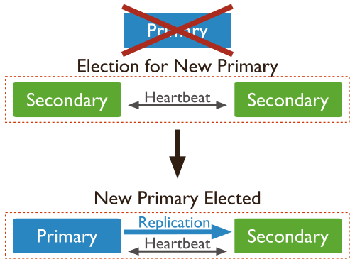
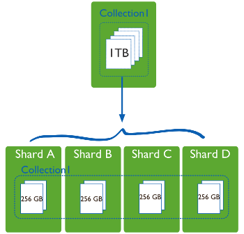
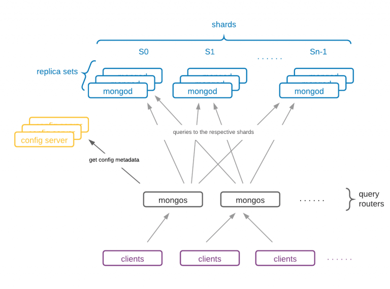

## Replicación

Un aspecto muy importante de *MongoDB* es que soporta la replicación de los datos de forma nativa mediante el uso de conjuntos de réplicas.

### Conjunto de réplicas

En MongoDB se replican los datos mediante un conjunto de réplicas  (*Replica Set*), el cual es un grupo de servidores (nodos *mongod*) donde uno de ellos ejerce la función de primario y por tanto recibe las peticiones de los clientes, y el resto de servidores hace de secundarios, manteniendo copias de los datos del primario.

<figure style="align: center;">
    
    <figcaption>Conjunto de Réplicas en MongoDB</figcaption>
</figure>

Si el nodo primario se cae, los secundarios eligen un nuevo primario entre ellos mismos, en un proceso que se conoce como votación. La aplicación se conectará al nuevo primario de manera transparente. Cuando el antiguo nodo primario vuelva en sí, será un nuevo nodo secundario.

Al usar replicación, si un servidor se cae, siempre vamos a poder obtener los datos a partir de otros servidores del conjunto. Si los datos de un servidor se dañan o son inaccesibles, podemos crear una nueva copia desde uno de los miembros del conjunto.

#### Elementos de un conjunto de réplicas

Los tipos de nodos que podemos encontrar en un conjunto de réplica son:

* **Regular**: Es el tipo de nodo más común.
* **Primario**: Acepta todas las operaciones de escritura de los clientes. Cada conjunto de réplicas tendrá sólo un primario, y como sólo un miembro acepta operaciones de escritura, ofrece consistencia estricta para todas las lecturas realizadas desde él.
* **Secundario**: Los secundarios replican el *oplog* primario y aplican las operaciones a sus conjuntos de datos. De este modo, los nodos secundarios son un espejo del primario. Si el primario deja de estar disponible, el conjunto de réplica elegirá a un secundario para que sea el nuevo primario, mediante un proceso de votación.

    Por defecto, los clientes realizan las lecturas desde el nodo primario. Sin embargo, los clientes pueden indicar que quieren realizar lecturas desde los nodos secundarios.

    !!! danger "Consistencia eventual"
        Es posible que al realizar lecturas de un nodo secundario la información que se obtenga no refleje el estado del nodo primario.

* Árbitro: se emplea sólo para votar. No contiene copia de los datos y no se puede convertir en primario. Los conjuntos de réplica pueden tener árbitros para añadir votos en las elecciones de un nuevo primario. Siempre tienen un voto, y permiten que los conjuntos de réplica tengan un número impar de nodos, sin la necesidad de tener un miembro que replique los datos. Además, no requieren hardware dedicado.

    !!! important "A tener en cuenta"
        * No ejecutar un árbitro en sistemas que también ejecutan los miembros primarios y secundarios del conjunto de réplicas.
        * Sólo añadir un árbitro a un conjunto con un número par de miembros.
        * Si se añade un árbitro a un conjunto con un número impar de miembros, el conjunto puede sufrir un empate.

* Retrasado (delayed): nodo que se emplea para la recuperación del sistema ante un fallo. Para ello, hay que asignar la propiedad `priority:0`. Este nodo nunca será un nodo primario.

* Oculto: empleado para analíticas del sistema.

##### oplog

Para soportar la replicación, el nodo primario almacena todos los cambios en su [*oplog*](https://www.mongodb.com/docs/manual/core/replica-set-oplog/).

De manera simplificada, el *oplog* es un diario de todos los cambios que la instancia principal realiza en las bases de datos con el propósito de replicar dichos cambios en un nodo secundario para asegurar que las dos bases de datos sean idénticas.

El servidor principal mantiene el *oplog*, y el secundario consulta al principal por nuevas entradas que aplicar a sus propias copias de las bases de datos replicadas. Este proceso se realiza de manera asíncrona, de manera que todos los miembros del conjunto de réplicas contienen una copia del *oplog*.

El oplog crea un *timestamp* para cada entrada. Esto permite que un secundario controle la cantidad de información que se ha modificado desde una lectura anterior, y qué entradas necesita transferir para ponerse al día. Si paramos un secundario y lo reiniciamos más adelante, utilizará el *oplog* para obtener todos los cambios que ha perdido mientras estaba offline.

El *oplog* se almacena en una colección limitada (*capped*) y ordenada de un tamaño determinado. La opción `oplogSize` define en MB el tamaño del archivo. Para un sistema de 64 bits con comportamiento de lectura/escritura normales, el `oplogSize` debería ser de al menos un 5% del espacio de disco disponible. Si el sistema tiene más escrituras que lecturas, puede que necesitemos incrementar este tamaño para asegurar que cualquier nodo secundario pueda estar *offline* una cantidad de tiempo razonable sin perder información.

### Creando un conjunto de réplicas

!!! note "Replicación y particionado en MongoAtlas"
    El cluster gratuito de MongoAtlas ya ofrece replicación de los datos, pero no nos permite administrarlo, al tratarse de un clúster compartido.

Para poder probar tanto la replicación como el particionado, necesitamos tener control sobre los servidores. Por ello, en esta sesión vamos a utilizar *Docker* para montar la infraestructura.

Para ello, vamos a partir del archivo de [docker-compose-replicaset.yml](resources/docker-compose-replicaset.yml) donde creamos tres contenedores (siendo `mongo1` el nodo principal y `mongo2` y `mongo3` los secundarios) dentro de una misma red y que pertenecen al conjunto de réplicas `iabdrs`:

``` yaml title="docker-compose-replicaset.yml"
services:
  mongo1:
    container_name: mongo1
    image: mongo
    volumes:
      - ./rs-init.sh:/scripts/rs-init.sh
      - ./init.js:/scripts/init.js
    networks:
      - mongo-network
    ports:
      - 27017:27017
    depends_on:
      - mongo2
      - mongo3
    links:
      - mongo2
      - mongo3
    entrypoint: [ "/usr/bin/mongod", "--bind_ip_all", "--replSet", "iabdrs" ]

  mongo2:
    container_name: mongo2
    image: mongo
    networks:
      - mongo-network
    ports:
      - 27018:27017
    entrypoint: [ "/usr/bin/mongod", "--bind_ip_all", "--replSet", "iabdrs" ]

  mongo3:
    container_name: mongo3
    image: mongo
    networks:
      - mongo-network
    ports:
      - 27019:27017
    entrypoint: [ "/usr/bin/mongod", "--bind_ip_all", "--replSet", "iabdrs" ]

networks:
  mongo-network:
    driver: bridge
```

!!! info "Despliegue"
    Normalmente, cada instancia `mongod` se coloca en un servidor físico y todos en el puerto estándar (27017).

    En nuestro caso, vamos a crear un conjunto de tres réplicas, y en vez de hacerlo en tres máquinas distintas, como los tres contenedores residen en la misma máquina, lo haremos en tres puertos diferentes (del 27017 al 27019)

El nodo principal necesita un *script* para inicializarse, el cual cargamos en el volumen como [`rs-init.sh`](resources/rs-init.sh). En dicho fichero definimos un documento con la configuración del clúster, donde el `_id` tiene que ser igual al usado al crear la réplica, y el array de `members` contiene las réplicas creadas donde los puertos han de coincidir. Dicho documento se pasará como parámetro a la operación [`rs.initiate`](https://www.mongodb.com/docs/manual/reference/method/rs.initiate/):

``` sh title="rs-init.sh"
#!/bin/bash

DELAY=25

mongosh <<EOF
var config = {
    "_id": "iabdrs",
    "version": 1,
    "members": [
        {
            "_id": 1,
            "host": "mongo1:27017",
            "priority": 2
        },
        {
            "_id": 2,
            "host": "mongo2:27017",
            "priority": 1
        },
        {
            "_id": 3,
            "host": "mongo3:27017",
            "priority": 1
        }
    ]
};
rs.initiate(config, { force: true });
EOF

echo "****** Esperando ${DELAY} segundos a que se apliquen la configuración del conjunto de réplicas ******"

sleep $DELAY

mongosh < /scripts/init.js
```

Finalmente, mediante el archivo [`init.js`](resources/init.js) comprobamos el estado de la réplica y creamos el usuario administrador:

``` js title="rs-init.sh"
rs.status();
db.createUser({user: 'admin', pwd: 'admin', roles: [ { role: 'root', db: 'admin' } ]});
```

Así pues, una vez tenemos los tres archivos en la misma carpeta, ya podemos lanzar *Docker Compose* para crear los contenedores:

``` bash
docker-compose --file docker-compose-replicaset.yml --project-name iabd-mongodb-replica up -d
```

Ya sólo nos queda ejecutar el *script* de inicialización sobre el nodo principal:

``` bash
docker exec mongo1 /scripts/rs-init.sh
```

Al ejecutarse el script, se inicializa el conjunto de réplicas y se obtiene su estado (mediante `rs.status()`) el cual se muestra por consola y podemos observar como ha creado los tres nodos, diferenciando el nodo principal de los secundarios:

``` json hl_lines="2 11 39 42 60 63 83 86"
iabdrs [direct: primary] test> {
  set: 'iabdrs',
  date: ISODate("2022-10-26T09:54:42.137Z"),
  myState: 1,
  term: Long("1"),
  syncSourceHost: '',
  syncSourceId: -1,
  heartbeatIntervalMillis: Long("2000"),
  majorityVoteCount: 2,
  writeMajorityCount: 2,
  votingMembersCount: 3,
  writableVotingMembersCount: 3,
  optimes: {
    lastCommittedOpTime: { ts: Timestamp({ t: 1666778080, i: 1 }), t: Long("1") },
    lastCommittedWallTime: ISODate("2022-10-26T09:54:40.457Z"),
    readConcernMajorityOpTime: { ts: Timestamp({ t: 1666778080, i: 1 }), t: Long("1") },
    appliedOpTime: { ts: Timestamp({ t: 1666778080, i: 1 }), t: Long("1") },
    durableOpTime: { ts: Timestamp({ t: 1666778080, i: 1 }), t: Long("1") },
    lastAppliedWallTime: ISODate("2022-10-26T09:54:40.457Z"),
    lastDurableWallTime: ISODate("2022-10-26T09:54:40.457Z")
  },
  lastStableRecoveryTimestamp: Timestamp({ t: 1666778030, i: 1 }),
  electionCandidateMetrics: {
    lastElectionReason: 'electionTimeout',
    lastElectionDate: ISODate("2022-10-26T09:53:10.197Z"),
    electionTerm: Long("1"),
    lastCommittedOpTimeAtElection: { ts: Timestamp({ t: 1666777979, i: 1 }), t: Long("-1") },
    lastSeenOpTimeAtElection: { ts: Timestamp({ t: 1666777979, i: 1 }), t: Long("-1") },
    numVotesNeeded: 2,
    priorityAtElection: 2,
    electionTimeoutMillis: Long("10000"),
    numCatchUpOps: Long("0"),
    newTermStartDate: ISODate("2022-10-26T09:53:10.363Z"),
    wMajorityWriteAvailabilityDate: ISODate("2022-10-26T09:53:11.139Z")
  },
  members: [
    {
      _id: 1,
      name: 'mongo1:27017',
      health: 1,
      state: 1,
      stateStr: 'PRIMARY',
      uptime: 129,
      optime: { ts: Timestamp({ t: 1666778080, i: 1 }), t: Long("1") },
      optimeDate: ISODate("2022-10-26T09:54:40.000Z"),
      lastAppliedWallTime: ISODate("2022-10-26T09:54:40.457Z"),
      lastDurableWallTime: ISODate("2022-10-26T09:54:40.457Z"),
      syncSourceHost: '',
      syncSourceId: -1,
      infoMessage: 'Could not find member to sync from',
      electionTime: Timestamp({ t: 1666777990, i: 1 }),
      electionDate: ISODate("2022-10-26T09:53:10.000Z"),
      configVersion: 1,
      configTerm: 1,
      self: true,
      lastHeartbeatMessage: ''
    },
    {
      _id: 2,
      name: 'mongo2:27017',
      health: 1,
      state: 2,
      stateStr: 'SECONDARY',
      uptime: 102,
      optime: { ts: Timestamp({ t: 1666778070, i: 1 }), t: Long("1") },
      optimeDurable: { ts: Timestamp({ t: 1666778070, i: 1 }), t: Long("1") },
      optimeDate: ISODate("2022-10-26T09:54:30.000Z"),
      optimeDurableDate: ISODate("2022-10-26T09:54:30.000Z"),
      lastAppliedWallTime: ISODate("2022-10-26T09:54:40.457Z"),
      lastDurableWallTime: ISODate("2022-10-26T09:54:40.457Z"),
      lastHeartbeat: ISODate("2022-10-26T09:54:40.322Z"),
      lastHeartbeatRecv: ISODate("2022-10-26T09:54:41.327Z"),
      pingMs: Long("0"),
      lastHeartbeatMessage: '',
      syncSourceHost: 'mongo1:27017',
      syncSourceId: 1,
      infoMessage: '',
      configVersion: 1,
      configTerm: 1
    },
    {
      _id: 3,
      name: 'mongo3:27017',
      health: 1,
      state: 2,
      stateStr: 'SECONDARY',
      uptime: 102,
      optime: { ts: Timestamp({ t: 1666778070, i: 1 }), t: Long("1") },
      optimeDurable: { ts: Timestamp({ t: 1666778070, i: 1 }), t: Long("1") },
      optimeDate: ISODate("2022-10-26T09:54:30.000Z"),
      optimeDurableDate: ISODate("2022-10-26T09:54:30.000Z"),
      lastAppliedWallTime: ISODate("2022-10-26T09:54:40.457Z"),
      lastDurableWallTime: ISODate("2022-10-26T09:54:40.457Z"),
      lastHeartbeat: ISODate("2022-10-26T09:54:40.322Z"),
      lastHeartbeatRecv: ISODate("2022-10-26T09:54:41.326Z"),
      pingMs: Long("0"),
      lastHeartbeatMessage: '',
      syncSourceHost: 'mongo1:27017',
      syncSourceId: 1,
      infoMessage: '',
      configVersion: 1,
      configTerm: 1
    }
  ],
  ok: 1,
  '$clusterTime': {
    clusterTime: Timestamp({ t: 1666778080, i: 1 }),
    signature: {
      hash: Binary(Buffer.from("0000000000000000000000000000000000000000", "hex"), 0),
      keyId: Long("0")
    }
  },
  operationTime: Timestamp({ t: 1666778080, i: 1 })
}
```

Una vez que ya hemos arrancando todo, podemos conectarnos a nuestro conjunto de réplica mediante `mongosh` (si no le pasamos ningún parámetro, se conecta automáticamente a `localhost` y al puerto 27017). Dentro del shell, los comandos que trabajan con réplicas comienzan por el prefijo **`rs`**. Por ejemplo, mediante `rs.help()` obtendremos la ayuda de los métodos disponibles:

``` bash
> mongosh
iabdrs [direct: primary] test> rs.help()

  Replica Set Class:

    initiate                                   Initiates the replica set.
    config                                     Returns a document that contains the current replica set configuration.
    conf                                       Calls replSetConfig
    reconfig                                   Reconfigures an existing replica set, overwriting the existing replica set configuration.
    reconfigForPSASet                          Reconfigures an existing replica set, overwriting the existing replica set configuration, if the reconfiguration is a transition from a Primary-Arbiter to a Primary-Secondary-Arbiter set.
    status                                     Calls replSetGetStatus
    isMaster                                   Calls isMaster
    hello                                      Calls hello
    printSecondaryReplicationInfo              Calls db.printSecondaryReplicationInfo
    printSlaveReplicationInfo                  DEPRECATED. Use rs.printSecondaryReplicationInfo
    printReplicationInfo                       Calls db.printReplicationInfo
    add                                        Adds replica set member to replica set.
    addArb                                     Calls rs.add with arbiterOnly=true
    remove                                     Removes a replica set member.
    freeze                                     Prevents the current member from seeking election as primary for a period of time. Uses the replSetFreeze command
    stepDown                                   Causes the current primary to become a secondary which forces an election. If no stepDownSecs is provided, uses 60 seconds. 
Uses the replSetStepDown command
    syncFrom                                   Sets the member that this replica set member will sync from, overriding the default sync target selection logic.
    secondaryOk                                This method is deprecated. Use db.getMongo().setReadPref() instead

  For more information on usage: https://docs.mongodb.com/manual/reference/method/js-replication/
```

La próxima vez que lancemos las réplicas ya no deberemos configurarlas. Así pues, el proceso de enlazar e iniciar las réplicas sólo se realiza una vez.

### Trabajando con las réplicas

Una vez que hemos visto que las tres réplicas están funcionando, vamos a comprobar cómo podemos trabajar con ellas.

Ya hemos visto cómo al conectarnos al clúster, nos aparece como símbolo del *shell* el nombre del conjunto de la réplica seguido de dos puntos y `primary` si nos hemos conectado al nodo principal, o `secondary` en caso contrario.

``` sh
iabdrs [direct: primary] test> 
```

Para saber si nos hemos conectado al nodo correcto, mediante [`db.hello()`](https://www.mongodb.com/docs/upcoming/reference/command/hello/#hello) obtendremos el tipo del nodo (propiedad `isWritablePrimary`) e información sobre el resto de nodos (antes se utilizaba el método `isMaster` el cual se ha marcado como *deprecated*):

``` js hl_lines="7 8 10"
iabdrs [direct: primary] test> db.hello()
{
  topologyVersion: {
    processId: ObjectId("635a9dbbc752fabab79400d6"),
    counter: Long("6")
  },
  hosts: [ 'mongo1:27017', 'mongo2:27017', 'mongo3:27017' ],
  setName: 'iabdrs',
  setVersion: 1,
  isWritablePrimary: true,
  secondary: false,
  primary: 'mongo1:27017',
  me: 'mongo1:27017',
  electionId: ObjectId("7fffffff0000000000000001"),
  lastWrite: {
    opTime: { ts: Timestamp({ t: 1666883479, i: 1 }), t: Long("1") },
    lastWriteDate: ISODate("2022-10-27T15:11:19.000Z"),
    majorityOpTime: { ts: Timestamp({ t: 1666883479, i: 1 }), t: Long("1") },
    majorityWriteDate: ISODate("2022-10-27T15:11:19.000Z")
  },
  maxBsonObjectSize: 16777216,
  maxMessageSizeBytes: 48000000,
  maxWriteBatchSize: 100000,
  localTime: ISODate("2022-10-27T15:11:20.366Z"),
  logicalSessionTimeoutMinutes: 30,
  connectionId: 48,
  minWireVersion: 0,
  maxWireVersion: 17,
  readOnly: false,
  ok: 1,
  '$clusterTime': {
    clusterTime: Timestamp({ t: 1666883479, i: 1 }),
    signature: {
      hash: Binary(Buffer.from("0000000000000000000000000000000000000000", "hex"), 0),
      keyId: Long("0")
    }
  },
  operationTime: Timestamp({ t: 1666883479, i: 1 })
}
```

Ahora que sabemos que estamos en el nodo principal, vamos a insertar datos.

Para ello, vamos a insertar 1.000 documentos:

``` js
for (i=0; i<1000; i++) {
  db.pruebas.insertOne({num: i})
}
```

Estos 1.000 documentos se han insertado en el nodo principal, y se han replicado a los secundarios. Para comprobar la replicación, abrimos un nuevo terminal y nos conectamos a un nodo secundario:

``` sh
$ mongosh --port 27018
iabdrs [direct: secondary] test>
```

Si desde el nodo secundario intentamos consultar el total de documentos de la colección obtendremos un error:

``` bash
iabdrs [direct: secondary] test> db.pruebas.countDocuments()
MongoServerError: not primary and secondaryOk=false - consider using db.getMongo().setReadPref() or readPreference in the connection string
```

El error indica que no somos un nodo primario y por lo tanto no podemos leer de él. Para permitir lecturas en los nodos secundarios, mediante `db.getMongo().setReadPref('secondary')` le decimos a `mongosh` que sabemos que nos hemos conectado a un secundario y admitimos la posibilidad de obtener datos obsoletos.

``` bash
iabdrs [direct: secondary] test> db.getMongo().setReadPref('secondary')
iabdrs [direct: secondary] test> db.pruebas.countDocuments()
1000
```

Pero que podamos leer no significa que podamos escribir. Si intentamos escribir en un nodo secundario obtendremos un error:

``` bash
iabdrs [direct: secondary] test> db.pruebas.insertOne({num : 1001})
MongoServerError: not primary
```

### Preferencias de lectura

En el ejemplo anterior hemos visto como hemos cambiado las preferencias de lectura para permitir hacerlo desde los nodos secundarios. Así pues, las [preferencias de lectura](https://www.mongodb.com/docs/upcoming/core/read-preference/) definen como MongoDB enruta las lecturas realizadas a los miembros del conjunto de réplicas.

<figure style="align: center;">
    
    <figcaption>Preferencias de lectura</figcaption>
</figure>

Por defecto, las aplicaciones dirigen las operaciones de consulta al miembro principal (con el modo de lectura `primary`, el cual es el modo por defecto). Pero los clientes puede indicar otras preferencias:

* `primaryPreferred`: si está disponible, las lecturas se realizan en el nodo primario, pero si no estuviera en pie, habilita las lecturas de los secundarios.
* `secondary`: todas las operaciones de lectura se realizan en nodos secundarios.
* `secondaryPreferred`: primero prueba con los secundarios, y si no hay ninguno disponible, la lectura la realiza del primario.
* `nearest`: las lecturas se realizan del nodo más cercano en base a la latencia, independientemente que el nodo sea primario o secundario.

Para indicar la preferencia de lectura, ya hemos visto que lo haremos con la función [Mongo.setReadPref()](https://www.mongodb.com/docs/manual/reference/method/Mongo.setReadPref/):

``` bash
iabdrs [direct: secondary] test> db.getMongo().setReadPref('nearest')
```

### Consistencia en la escritura

Ya hemos visto que tanto las lecturas como las escrituras se realizan de manera predeterminada en el nodo principal.

Las aplicaciones pueden decidir que las escrituras vayan al nodo primario pero las lecturas al secundario. Esto puede provocar que haya lecturas caducas, con datos obsoletos, pero como beneficio podemos escalar el sistema.

La replicación es un proceso asíncrono. En el período de tiempo en el que el sistema de votación sucede, no se completa ninguna escritura.

*MongoDB* garantiza la [consistencia en la escritura (Write Concern)](https://docs.mongodb.com/manual/reference/write-concern/), lo que implica que sea un sistema consistente. Para ello, ofrece un mecanismo que garantiza que una escritura ha sido exitosa. Dependiendo del nivel de configuración de la consistencia, las inserciones, modificaciones y borrados pueden tardar más o menos. Si reducimos el nivel de consistencia, el rendimiento será mejor, a costa de poder obtener datos obsoletos u perder datos que no se han terminado de serializar en disco. Con un nivel de consistencia más alto, los clientes esperan tras enviar una operación de escritura a que MongoDB les confirme la operación.

Los valores que podemos configurar se realizan mediante las siguientes opciones:

* `w`: indica el número de servidores que se han de replicar para que la inserción devuelva un ACK.
* `j`: indica si las escrituras se tienen que trasladar a un diario de bitácora (*journal*)
* `wtimeout`: indica el límite de tiempo a esperar como máximo, para prevenir que una escritura se bloquee indefinidamente.

#### Niveles de consistencia de escritura

Con estas opciones, podemos configurar diferentes niveles de consistencia son:

* Sin confirmación: `w:0`, también conocido como *fire-and-forget*, ya que no se espera ningún tipo de confirmación.
* Con confirmación: `w:1`, el cual es el modo por defecto, y sólo espera confirmación del nodo principal.
* Con diario: `w:1`, `j:true`. Cada inserción primero se escribe en el diario y posteriormente en el directorio de datos.
* Con confirmación de la mayoría: `w: "majority"`, es decir, confirman la mitad + 1 de los nodos de la réplica.

Estas opciones se indican como parámetro final en las operaciones de inserción y modificación de datos. Por ejemplo:

``` js
db.pruebas.insertOne(
  {num : 1002},
  {writeConcern: {w: "majority", wtimeout: 5000}}
)
```

En resumen, a mayor cantidad de nodos, mayor es la tolerancia a fallos pero cada operación necesita más tiempo y recursos para realizar la persistencia de los datos.

### Consistencia en la lectura

De igual manera que podemos decidir en cuantos nodos se deben propagar las escrituras, podemos indicar cuantos nodos debemos leer para dar un dato como válido. Para ello, *MongoDB* da soporte a diferentes niveles de [consistencia en la lectura (Read Concern)](https://www.mongodb.com/docs/manual/reference/read-concern/):

* `local`: devuelve el dato más reciente en el cluster. Cualquier dato que haya sido escrito en el nodo primario puede ser elegido para devolverse. Sin embargo, no se garantiza que este dato sea replicado a los miembros del conjunto en caso de fallo. Este es el nivel por defecto en las operaciones de lectura contra el nodo primario.
* `available`: equivalente de `local` cuando las operaciones de lectura se efectúan contra un nodo secundario.
* `majority`: únicamente devuelve datos que hayan sido confirmados en una mayoría de nodos dentro del conjunto.
* `linearizable`: devuelve datos que hayan sido confirmados por una mayoría de nodos, pero permite al desarrollador establecer su propia funcionalidad.
* `snapshot`: sólo disponible para transacciones multi-documento, realiza una "foto" de los datos al inicio de la transacción.

Imaginemos un escenario en el que recibimos la confirmación de escritura por el nodo primario. Inmediatamente efectuamos una operación de lectura, el nodo devuelve el dato, pero éste falla antes de replicar la operación de escritura a los nodos secundarios. Sobre esta operación se efectuará un proceso de *rollback* en el momento que el nodo primario vuelva a estar disponible, por lo que ese dato realmente no existirá en el conjunto replicado. Es decir, la aplicación actualmente tiene un dato que no existe en el conjunto.

Mediante la consistencia en la lectura, podemos obtener unas mínimas garantías de que el dato que estamos leyendo es correcto y durable. Cuando se utiliza, únicamente devolverá datos cuya grabación haya sido confirmada por el número de nodos especificados en sus opciones. Se puede escoger entre devolver el dato más reciente que exista en el cluster, o el dato recibido por una mayoría de miembros en el cluster.

El hecho de que un documento no se considere correcto, no quiere decir necesariamente que se haya perdido, sino que en el momento de su lectura, no ha cumplido las condiciones necesarias de durabilidad para ser devuelto. Puede ser que la lectura se esté produciendo antes de que el dato haya sido propagado al número mínimo de miembros necesario, y por eso no se obtenga, pero en lecturas sucesivas sí puede aparecer.

### Tolerancia a fallos

Cuando un nodo primario no se comunica con otros miembros del conjunto durante más de 10 segundos, el conjunto de réplicas intentará, de entre los secundarios, que un miembro se convierta en el nuevo primario.

Para ello se realiza un proceso de votación, de modo que el nodo que obtenga el mayor número de votos se erigirá en primario. Este proceso de votación se realiza bastante rápido (menos de 3 segundos), durante el cual no existe ningún nodo primario y por tanto la réplica no acepta escrituras y todos los miembros se convierten en nodos de sólo-lectura.

<figure style="align: center;">
    
    <figcaption>Elección de un nuevo primario</figcaption>
</figure>

#### Proceso de votación

Cuando un nodo secundario no puede contactar con su nodo primario, contactará con el resto de miembros y les indicará que quiere ser elegido como primario. Es decir, cada nodo que no encuentre un primario se nominará como posible primario, de modo que un nodo no nomina a otro a ser primario, únicamente vota sobre una nominación ya existente.

Antes de dar su voto, el resto de nodos comprobarán:

* si ellos tienen conectividad con el primario
* si el nodo que solicita ser primario tienen una réplica actualizada de los datos. Todas las operaciones replicadas están ordenadas por el *timestamp* ascendentemente, de modo los candidatos deben tener operaciones posteriores o iguales a cualquier miembro con el que tengan conectividad.
* si existe algún nodo con una prioridad mayor que debería ser elegido.

Si algún miembro que quiere ser primario recibe una mayoría de "sís" se convertirá en el nuevo primario, siempre y cuando no haya un servidor que vete la votación. Si un miembro la veta es porque conoce alguna razón por la que el nodo que quiere ser primario no debería serlo, es decir, ha conseguido contactar con el antiguo primario.

Una vez un candidato recibe una mayoría de "sís", su estado pasará a ser primario.

#### Configuración recomendada

!!! info "Cantidad de elementos"
    En la votación, se necesita una mayoría de nodos para elegir un primario, ya que una escritura se considera segura cuando ha alcanzado a la mayoría de los nodos.  
    Esta mayoría se define como más de la mitad de todos los nodos del conjunto.  
    Hay que destacar que la mayoría no se basa en los elementos que queden en pie o estén disponibles, sino en el conjunto definido en la configuración del conjunto.

Se recomiendan dos configuraciones:

1. Mediante una mayoría del conjunto en un centro de datos. Este planteamiento es bueno si tenemos un *data center* donde queremos que siempre se aloje el nodo primario de la réplica. Siempre que el centro de datos funcione normalmente, habrá un nodo primario. Sin embargo, si el centro primario pierde la conectividad, el centro de datos secundario no podrá elegir un nuevo primario.
2. Mediante el mismo número de servidores en cada centro de datos, más un servidor que rompe la igualdad en una tercera localización. Este diseño es conveniente cuando ambos centros de datos tienen el mismo grado de confiabilidad y robustez.

#### Comprobando la tolerancia

Para comprobar la tolerancia a fallos, desde el nodo primario vamos a detenerlo:

Si nos hemos conectados desde dentro del contenedor a `localhost` con la opción `--host "127.0.0.1`, vamos a poder detenerlo mediante el comando [`shutdown`](https://www.mongodb.com/docs/manual/reference/command/shutdown/):

``` bash
iabdrs [direct: primary] test> db.adminCommand({"shutdown" : 1})
```

Otra posibilidad en vez de detenerlo es degradarlo a nodo secundario mediante [rs.stepDown()](https://www.mongodb.com/docs/manual/reference/method/rs.stepDown/) y forzar un proceso de votación entre el resto de nodos:

``` bash
iabdrs [direct: primary] test> rs.stepDown()
{
  ok: 1,
  '$clusterTime': {
    clusterTime: Timestamp({ t: 1666885736, i: 1 }),
    signature: {
      hash: Binary(Buffer.from("0000000000000000000000000000000000000000", "hex"), 0),
      keyId: Long("0")
    }
  },
  operationTime: Timestamp({ t: 1666885736, i: 1 })
}
iabdrs [direct: secondary] test>
```

Si pasamos al shell del antiguo nodo secundario, y le preguntamos si es el principal, veremos que ahora indica que la propiedad `isWritablePrimary` es `true` que ahora el primary es `mongo2:27017`:

``` json hl_lines="10 12"
iabdrs [direct: primary] test> rs.hello()
{
  topologyVersion: {
    processId: ObjectId("635ab0cb3f36955c651fa584"),
    counter: Long("7")
  },
  hosts: [ 'mongo1:27017', 'mongo2:27017', 'mongo3:27017' ],
  setName: 'iabdrs',
  setVersion: 1,
  isWritablePrimary: true,
  secondary: false,
  primary: 'mongo2:27017',
  me: 'mongo2:27017',
  ...
```

#### Recuperación del sistema

Si en un conjunto de réplicas se cae el primario y hay escrituras que se han pasado al `oplog` y tenemos que otros nodos no las han replicado, cuando el nodo primario vuelva en sí como secundario y se sincronice con el nuevo primario, se dará cuenta que hay operaciones de escritura pendientes y las pasará a *rollback*, para que si se desean se apliquen manualmente.

Para evitar este escenario, se necesita emplear consistencia en la escritura, de manera que hasta que la escritura no se haya replicado en la mayoría de los nodos no se considere como una escritura exitosa.

## Particionado

Ya vimos en la primera sesión que dentro del entorno de las bases de datos, particionar consiste en dividir los datos entre múltiples máquinas. Al poner un subconjunto de los datos en cada máquina, vamos a poder almacenar más información y soportar más carga sin necesidad de máquinas más potentes, sino una mayor cantidad de máquinas más modestas (y mucho más baratas).

El *Sharding* es una técnica que fragmenta los datos de la base de datos horizontalmente agrupándolos de algún modo que tenga sentido y que permita un direccionamiento más rápido.

<figure style="align: center;">
    
    <figcaption>Sharding</figcaption>
</figure>

Por lo tanto, estos *shards* (fragmentos) pueden estar localizados en diferentes bases de datos y localizaciones físicas.

El *Sharding* no tiene por qué estar basado únicamente en una colección y un campo, puede ser a nivel de todas las colecciones. Por ejemplo podríamos decir "*todos los datos de usuarios cuyo perfil esté en los Estados Unidos los redirigimos a la base de datos del servidor en Estados Unidos, y todos los de Asia van a la base de datos de Asia*".

*MongoDB* implementa el *sharding* de forma nativa y automática (de ahí el término de *auto-sharding*), siguiendo un enfoque basado en rangos.

Para ello, divide una colección entre diferentes servidores, utilizando `mongos` como router de las peticiones entre los *sharded clusters*.
Esto favorece que el desarrollador ignore que la aplicación no se comunica con un único servidor, balanceando de manera automática los datos y permitiendo incrementar o reducir la capacidad del sistema a conveniencia.

!!! tip "Paciencia..."
    Antes de plantearse hacer *auto-sharding* sobre nuestros datos, es conveniente dominar cómo se trabaja con *MongoDB* y el uso de conjuntos de réplica.

### Sharded Cluster

El particionado de MongoDB permite crear un cluster de muchas máquinas, dividiendo a nivel de colección y poniendo un subconjunto de los datos de la colección en cada uno de los fragmentos.

Los componentes de un *sharded cluster* son:

* ***Shards*** (Fragmentos): Cada una de las máquinas del cluster, que almacena un subconjunto de los datos de la colección. Cada *shard* es una instancia de *mongod* o un conjunto de réplicas. En un entorno de producción, todos los *shards* son conjuntos de réplica.
* **Servidores de Configuración**: Cada servidor de configuración es una instancia de `mongod` que almacena metadatos sobre el cluster. Los metadatos mapean los trozos con los shards, definiendo qué rangos de datos definen un trozo (*chunk*) de la colección, y qué trozos se encuentran en un determinado *shard*.  
    En entornos de producción se aconseja tener 3 servidores de configuración (uno primario y dos secundarios) ya que si sólo tuviésemos uno, al producirse una caída el cluster quedaría inaccesible.

* **Enrutadores**: Cada router es una instancia `mongos` que enruta las lecturas y escrituras de las aplicaciones a los *shards*. Las aplicaciones no acceden directamente a los *shards*, sino al router. Estos enrutadores funcionan de manera similar a una tabla de contenidos, indicándonos dónde se encuentran los datos. Una vez recopilados los datos de los diferentes *shards*, se fusionan y se encarga de devolverlos a la aplicación.

    En entornos de producción es común tener varios routers para balancear la carga de los clientes.

<figure style="align: center;">
    
    <figcaption>Componentes de un Sharded cluster</figcaption>
</figure>

!!! question "Autoevaluación"
    Supongamos que queremos ejecutar múltiples routers `mongos` para soportar la redundancia. ¿Qué elemento asegurará la tolerancia a fallos y cambiará de un `mongos` a otro dentro de tu aplicación? [^1]

    * `mongod`
    * `mongos`
    * Driver
    * Los servidores de configuración de *sharding*

    [^1]: El driver se encarga de manera transparente de conectar al router adecuado, y cambiar un router por otro si al que estamos conectado se cae

### Shard key

Para que *MongoDB* sepa cómo dividir una colección entre rangos no solapados hay que elegir una [*shard key*](https://www.mongodb.com/docs/manual/core/sharding-shard-key/), normalmente el identificador del documento, por ejemplo, `student_id`. Este identificador (o su *hash*) es la clave del *chunk* (por lo hace la misma función que una clave primaria).

La *shard key* puede ser un campo sencillo o compuesto el cual debe estar indexado, y que va a determinar la distribución de los documentos entre los fragmentos del clúster.

<figure style="align: center;">
    
    <figcaption>Fragmentación por la shard-key</figcaption>
</figure>

Para las búsquedas, borrados y actualizaciones, al emplear la *shard key*, `mongos` sabe a que *shard* enviar la petición. En cambio, si la operación no la indica, se hará un *broadcast* a todas los *shards* para averiguar donde se encuentra.

Entre los aspectos a tener en cuenta a la hora de [elegir una *shard key*](https://www.mongodb.com/docs/manual/core/sharding-choose-a-shard-key) cabe destacar que debe:

* Tener una alta cardinalidad, para asegurar que los documentos puedan dividirse en los distintos fragmentos. Por ejemplo, si elegimos un *shard key* que solo tiene 3 valores posibles y tenemos 5 fragmentos, *MongoDB* no sabrá como separar los documentos en los 5 fragmentos. Cuantos más valores posibles pueda tener la clave de fragmentación, más eficiente será la división de los trozos entre los fragmentos disponibles.
* Tener un alto nivel de aleatoriedad. Si utilizamos una clave que siga un patrón incremental como una fecha o un ID, conllevará que al insertar documentos, el mismo fragmento estará siendo utilizando constantemente durante el rango de valores definido para él. Esto provoca que los datos estén separados de una manera óptima, pero pondrá siempre bajo estrés a un fragmento en períodos de tiempo mientras que los otros posiblemente queden con muy poca actividad (comportamiento conocido como *hotspotting*).  
    Una solución a las claves que siguen patrones incrementales es aplicar una función *hash* y crear una clave *hasheada* que si tiene un alto nivel de aleatoriedad.
* Considerar los patrones de las consultas, ya que si elegimos una buena clave, al realizar consultas por la clave, todos los datos se encontrarán en el mismo fragmento.

### Particionado con Docker

Para este caso, vamos a crear dos conjuntos de réplicas de dos nodos cada una, y a su vez, particionaremos los datos en dos *shards*.

Además, vamos a añadir un único router y un servidor de configuración (aunque lo ideal sería crear un conjunto de réplicas de servidores de configuración).

Así pues, crearemos:

* un contenedor para el router (`router1`) el cual ejectua el servicio `mongos` y que va a conectar con el servidor de configuración.
* un contenedor para el servidor de configuración (`configsvr1`) indicándole mediante el parámetro `--configsvr` su propósito, así como la réplica a la que pertenece (todo servidor de configuración debe pertenecer a una réplica, aunque en nuestro caso sólo hemos creado uno)
* dos nodos (`mongo-shard1a` y `mongo-shard1b`) para el primer shard (parámetro `--shardsvr`) que pertenecen al conjunto de réplicas `iabdshard1`.
* dos nodos más (`mongo-shard2a` y `mongo-shard2b`) para el segundo shard (parámetro `--shardsvr`) que pertenecen al conjunto de réplicas `iabdshard2`.

Para ello, hemos definido el archivo [docker-compose-replicaset-sharded.yml](resources/docker-compose-replicaset-sharded.yml) con la definición de los contenedores:

``` yaml title="docker-compose-replicaset-sharded.yml" hl_lines="12 23 37 46 57 66"
services:

  router1:
    container_name: router1
    image: mongo
    volumes:
      - ./router-init.js:/scripts/router-init.js
    networks:
      - mongo-network-sharded
    ports:
      - 27117:27017
    entrypoint: [ "/usr/bin/mongos", "--port", "27017", "--configdb", "rs-config-server/configsvr1:27017", "--bind_ip_all" ]

  configsvr1:
    container_name: configsvr1 
    image: mongo
    volumes:
      - ./configserver-init.js:/scripts/configserver-init.js
    networks:
      - mongo-network-sharded
    ports:
      - 27118:27017
    entrypoint: [ "/usr/bin/mongod", "--port", "27017", "--configsvr", "--replSet", "rs-config-server", "--bind_ip_all" ]
    links:
      - mongo-shard1a
      - mongo-shard2a

  mongo-shard1a:
    container_name: mongo-shard1a
    image: mongo
    volumes:
      - ./shard1-init.js:/scripts/shard1-init.js
    networks:
      - mongo-network-sharded
    ports:
      - 27119:27017
    entrypoint: [ "/usr/bin/mongod", "--port", "27017", "--shardsvr", "--bind_ip_all", "--replSet", "iabdshard1" ]

  mongo-shard1b:
    container_name: mongo-shard1b
    image: mongo
    networks:
      - mongo-network-sharded
    ports:
      - 27120:27017
    entrypoint: [ "/usr/bin/mongod", "--port", "27017", "--shardsvr", "--bind_ip_all", "--replSet", "iabdshard1" ]

  mongo-shard2a:
    container_name: mongo-shard2a
    image: mongo
    volumes:
      - ./shard2-init.js:/scripts/shard2-init.js
    networks:
      - mongo-network-sharded
    ports:
      - 27121:27017
    entrypoint: [ "/usr/bin/mongod", "--port", "27017", "--shardsvr", "--bind_ip_all", "--replSet", "iabdshard2" ]

  mongo-shard2b:
    container_name: mongo-shard2b
    image: mongo
    networks:
      - mongo-network-sharded
    ports:
      - 27122:27017
    entrypoint: [ "/usr/bin/mongod", "--port", "27017", "--shardsvr", "--bind_ip_all", "--replSet", "iabdshard2" ]

networks:
  mongo-network-sharded:
    driver: bridge
```

Y lanzamos los contenedores mediante *docker-compose*:

``` bash
docker-compose --file docker-compose-replicaset-sharded.yml --project-name iabd-mongodb-replica-sharded up -d
```

#### Inicializar los servidores de configuración

El primer paso es inicializar los servidores de configuración mediante el script [`configserver-init.js`](resources/configserver-init.js):

``` js title="configserver-init.js"
rs.initiate({_id: "rs-config-server", configsvr: true, version: 1, members: [ { _id: 0, host : 'configsvr1:27017' } ] })
```

Y lo lanzamos:

``` sh
docker exec configsvr1 sh -c "mongosh < /scripts/configserver-init.js"
```

#### Configurar el conjunto de réplicas

Para cada uno de los conjuntos de réplicas (`iabdshard1` y `iabdshard2`) que van a contener los datos, hemos de configurar sus nodos, haciendo uso de los scripts [`shard1-init.js`](resources/shard1-init.js) y [`shard2-init.js`](resources/shard2-init.js):

``` js title="shard1-init.js"
rs.initiate(
  {
     _id: "iabdshard1",
     version: 1,
     members: [
        { _id: 0, host : "mongo-shard1a:27017" },
        { _id: 1, host : "mongo-shard1b:27017" },
     ]
  }
)
```

``` js title="shard2-init.js"
rs.initiate(
  {
     _id: "iabdshard2",
     version: 1,
     members: [
        { _id: 0, host : "mongo-shard2a:27017" },
        { _id: 1, host : "mongo-shard2b:27017" },
     ]
  }
)
```

E inicializamos los conjunto de réplicas:

``` sh
docker exec mongo-shard1a sh -c "mongosh < /scripts/shard1-init.js"
docker exec mongo-shard2a sh -c "mongosh < /scripts/shard2-init.js"
```

#### Configurar el router

Finalmente, configuramos el *router* a partir del *script* [`router-init.js`](resources/router-init.js) donde estamos indicándole al *router* qué nodos forman parte del particionado:

``` js title="router-init.js"
sh.addShard("iabdshard1/mongo-shard1a:27017")
sh.addShard("iabdshard1/mongo-shard1b:27017")
sh.addShard("iabdshard2/mongo-shard2a:27017")
sh.addShard("iabdshard2/mongo-shard2b:27017")
```

Y lo ejecutamos:

``` sh
docker exec router1 sh -c "mongosh < /scripts/router-init.js"
```

!!! tip "sh"
    De manera similar que hemos visto que con el conjunto de réplicas se emplean el prefijo `rs`, para interactuar con los componentes implicados en el sharding se emplea `sh`, pero únicamente desde el nodo que hace de *router*.
    Por ejemplo, mediante `sh.help()` obtendremos la ayuda de los métodos disponibles.

### Conexión al router

El router es un nodo de *MongoDB* que se va a encargar de aceptar las peticiones de los clientes y enrutarlas al *shard* adecuado. Para ello, podemos:

* Conectarnos al contenedor y abrimos un terminal y veremos como en el *prompt* aparece `mongos`:

    ``` bash
    docker exec -it router1 bash
    mongosh
    [direct: mongos] test> 
    ```

* O abrir directamente un sesión al puerto 27117, que es donde habíamos colocado nuestro router:

    ``` bash
    mongosh 127.0.0.1:27117
    [direct: mongos] test>
    ```

Si comprobamos el estado del *shard* veremos que tenemos dos *shards*, cada uno replicado en dos nodos, con sus identificadores y *hosts*:

``` js hl_lines="14 20"
[direct: mongos] test> sh.status()
shardingVersion
{
  _id: 1,
  minCompatibleVersion: 5,
  currentVersion: 6,
  clusterId: ObjectId("6363af7bfab6e20f2a7c1409")
}
---
shards
[
  {
    _id: 'iabdshard1',
    host: 'iabdshard1/mongo-shard1a:27017,mongo-shard1b:27017',
    state: 1,
    topologyTime: Timestamp({ t: 1667477424, i: 6 })
  },
  {
    _id: 'iabdshard2',
    host: 'iabdshard2/mongo-shard2a:27017,mongo-shard2b:27017',
    state: 1,
    topologyTime: Timestamp({ t: 1667477424, i: 12 })
  }
]
...
```

En un entorno de producción, en vez de tener dos *shards* en dos nodos, habrá un conjunto de réplicas para asegurar la alta disponibilidad. Además, tendremos tres servidores de configuración para asegurar la disponibilidad de éstos. Del mismo modo, habrá tantos procesos `mongos` creados como conexiones de clientes:

<figure style="align: center;">
    
    <figcaption>Sharding en un entorno de Producción</figcaption>
</figure>

### Habilitando el Sharding

Una vez hemos creado la estructura necesaria para soportar el particionado vamos a insertar un conjunto de datos para posteriormente particionarlos.

Para ello, vamos a insertar diez mil usuarios en una colección:

``` js
[direct: mongos] test> use iabd
switched to db iabd
[direct: mongos] iabd> for (var i=0; i<10000; i++) {
    db.usuarios.insertOne({"login":"usuario" + i, "nombre":"nombre" + i*2, "fcreacion": new Date()},  { writeConcern: { w:"0"}});
}
```

Una vez creados, comprobamos que se han insertado:

``` js
[direct: mongos] iabd> db.usuarios.countDocuments()
10000
[direct: mongos] iabd> db.usuarios.findOne()
{
  _id: ObjectId("6363edb79f30da8391b700c4"),
  login: 'usuario0',
  nombre: 'nombre0',
  fcreacion: ISODate("2022-11-03T16:35:03.184Z")
}
```

Como podemos observar, interactuar con `mongos` es igual a hacerlo con `mongosh`.

Ahora mismo no sabemos en cuál de los dos *shards* se han almacenado los datos. Además, estos datos no están particionados, es decir residen en sólo uno de los shards.

Para habilitar el sharding a nivel de base de datos y que los datos se repartan entre los fragmentos disponibles, ejecutaremos el comando [`sh.enableSharding(<nombreDB>)`](https://www.mongodb.com/docs/manual/reference/method/sh.enableSharding/):

``` js
[direct: mongos] iabd> sh.enableSharding("iabd")
{
  ok: 1,
  '$clusterTime': {
    clusterTime: Timestamp({ t: 1667493383, i: 1 }),
    signature: {
      hash: Binary(Buffer.from("0000000000000000000000000000000000000000", "hex"), 0),
      keyId: Long("0")
    }
  },
  operationTime: Timestamp({ t: 1667480498, i: 1 })
}
```

Si volvemos a comprobar el estado del *shard*, tenemos que se ha creado la nueva base de datos y nos indica cual es su fragmento primario.

``` js hl_lines="26 27"
[direct: mongos] iabd> sh.status()
...
---
databases
[
  {
    database: { _id: 'config', primary: 'config', partitioned: true },
    collections: {
      'config.system.sessions': {
        shardKey: { _id: 1 },
        unique: false,
        balancing: true,
        chunkMetadata: [
          { shard: 'iabdshard1', nChunks: 512 },
          { shard: 'iabdshard2', nChunks: 512 }
        ],
        chunks: [
          'too many chunks to print, use verbose if you want to force print'
        ],
        tags: []
      }
    }
  },
  {
    database: {
      _id: 'iabd',
      primary: 'iabdshard1',
      partitioned: false,
      version: {
        uuid: new UUID("84bce0ad-38a4-4b72-a377-350272542657"),
        timestamp: Timestamp({ t: 1667493302, i: 1 }),
        lastMod: 1
      }
    },
    collections: {}
  }
]
```

Antes de habilitar el *sharding* para una determinada colección, tenemos que crear un índice sobre la *shard key* (si la colección estuviera vacía, no necesitamos crear el índice, ya que al indicar la *shard key*, *MongoDB* automáticamente crearé el índice por nosotros):

``` js
db.usuarios.createIndex({"login": 1})
```

Una vez habilitado el *shard* ya podemos fragmentar la colección:

``` js
sh.shardCollection("iabd.usuarios", {"login": 1}, false)
```

El método [shardCollection](https://www.mongodb.com/docs/manual/reference/method/sh.shardCollection/) particiona una colección a partir de una *shard key*, ya sea mediante claves *hashes* o utilizando rangos. En nuestro caso, al indicarle `{"login": "hashed"}` particionará los datos repartiéndolos de manera equitativa entre los fragmentos.

Para ello, recibe tres parámetros:

* nombre de la colección, con nomenclatura de `nombreBD.nombreColección`
* nombre del campo para fragmentar la colección, es decir, el *shard key*. Uno de los requisitos es que esta clave tenga una alta cardinalidad. Si fuese nuestro caso, en vez de utilizar una clave *hash*, podemos indicar que lo organice mediante rangos indicando el campo y un 1, por ejemplo, `{"login": 1}`.
* *booleano* que indica si el valor utilizado como *shard key* es único. Para ello, el índice que se crea sobre el campo debe ser del tipo *unique*.

Este comando divide la colección en fragmentos (*chunks*), la cual es la unidad que utiliza *MongoDB* para mover los datos. Una vez que se ha ejecutado, *MongoDB* comenzará a balancear la colección entre los *shards* del cluster. Este proceso no es instantáneo. Si la colección contiene un gran conjunto de datos puede llevar horas completar el balanceo.

Si ahora volvemos a comprobar el estado del *shard* obtendremos:

``` js
[direct: mongos] iabd> sh.status()
...
databases
[
  {
    database: { _id: 'config', primary: 'config', partitioned: true },
    ...
  },
  {
    database: {
      _id: 'iabd',
      primary: 'iabdshard1',
      partitioned: false,
      version: {
        uuid: new UUID("9e694228-600c-4a50-b11c-174f846a3c64"),
        timestamp: Timestamp({ t: 1667489404, i: 1 }),
        lastMod: 1
      }
    },
    collections: {
      'iabd.usuarios': {
        shardKey: { login: 'hashed' }, // (1)!
        unique: false,
        balancing: true,
        chunkMetadata: [ { shard: 'iabdshard1', nChunks: 1 } ],
        chunks: [               // (2)!
          { min: { login: MinKey() }, // (3)!
            max: { login: () },
            'on shard': 'iabdshard1',
            'last modified': Timestamp({ t: 1, i: 0 }) }
        ],
        tags: []
      }
    }
  }
]
```

1. Muestra que la *shard key* se basa en rangos
2. la propiedad `chunks` muestra la cantidad de trozos que alberga cada partición. Así, pues en este momento tenemos un único *chunk*
3. Para cada uno de los fragmentos se muestra el rango de valores que alberga cada chunk, así como en que *shard* se ubica. Las funciones `MinKey()` y `MinKey()` son similares a menos infinito y más infinito, es decir, no hay ningún valor por debajo ni por encima de ellos. Es decir, indican los topes de la colección.

### Trabajando con particiones

En este momento, el shard está creado pero todos los nodos residen en un único fragmento dentro de una partición. Para obtener esta información, podemos ver el estado del *sharding* o consultar la distribución de una colección mediante el método [`getShardDistribution`](https://www.mongodb.com/docs/manual/reference/method/db.collection.getShardDistribution/):

``` js
[direct: mongos] iabd> db.usuarios.getShardDistribution()
Shard iabdshard1 at iabdshard1/mongo-shard1a:27017,mongo-shard1b:27017
{
  data: '852KiB',
  docs: 10000,
  chunks: 1,
  'estimated data per chunk': '852KiB',
  'estimated docs per chunk': 10000
}
---
Totals
{
  data: '852KiB',
  docs: 10000,
  chunks: 1,
  'Shard iabdshard1': [
    '100 % data',
    '100 % docs in cluster',
    '87B avg obj size on shard'
  ]
}
```

Vamos a volver a insertar 10.000 usuarios más a ver qué sucede:

``` js
[direct: mongos] iabd> for (var i=10000; i<20000; i++) {
    db.usuarios.insertOne({"login":"usuario" + i, "nombre":"nombre" + i*2, "fcreacion": new Date()},  { writeConcern: { w:"0"}});
}
[direct: mongos] iabd> db.usuarios.countDocuments()
20000
```

!!! note "Forzando el *split*"
    Si al insertar más datos no se reparten los datos de forma automática, podemos forzarlo mediante las operaciones [`sh.splitAt`](https://www.mongodb.com/docs/manual/reference/method/sh.splitAt), donde le indicamos el valor donde el fragmento en dos, y [`sh.splitFind`](https://www.mongodb.com/docs/manual/reference/method/sh.splitFind) que realiza la división por la mediana, de manera que ambos fragmentos deberían ser semejantes.

    Por ejemplo:

    ``` js
    sh.splitFind("iabd.usuarios", {"login":1})
    ```

Si ahora comprobamos el estado del *shard*, los datos se deberían haber repartido entre los *shards* disponibles:

``` js hl_lines="10-11 14-15"
mongos> sh.status()
{
    ...
    collections: {
      'iabd.usuarios': {
        shardKey: { login: 1 },
        unique: false,
        balancing: true,
        chunkMetadata: [
          { shard: 'iabdshard1', nChunks: 1 },
          { shard: 'iabdshard2', nChunks: 1 }
        ],
        chunks: [
          { min: { login: MinKey() }, max: { login: 'usuario18999' }, 'on shard': 'iabdshard2', 'last modified': Timestamp({ t: 2, i: 0 }) },
          { min: { login: 'usuario18999' }, max: { login: MaxKey() }, 'on shard': 'iabdshard1', 'last modified': Timestamp({ t: 2, i: 1 }) }
        ],
        tags: []
      }
    }
  }
]
```

Si volvemos a comprobar la distribución, ahora vemos como ha repartido los documentos:

``` js hl_lines="2 11"
[direct: mongos] iabd> db.usuarios.getShardDistribution()
Shard iabdshard1 at iabdshard1/mongo-shard1a:27017,mongo-shard1b:27017
{
  data: '1.68MiB',
  docs: 20000,
  chunks: 1,
  'estimated data per chunk': '1.68MiB',
  'estimated docs per chunk': 20000
}
---
Shard iabdshard2 at iabdshard2/mongo-shard2a:27017,mongo-shard2b:27017
{
  data: '866KiB',
  docs: 10000,
  chunks: 1,
  'estimated data per chunk': '866KiB',
  'estimated docs per chunk': 10000
}
---
Totals
{
  data: '2.52MiB',
  docs: 30000,
  chunks: 2,
  'Shard iabdshard1': [
    '66.51 % data',
    '66.66 % docs in cluster',
    '88B avg obj size on shard'
  ],
  'Shard iabdshard2': [
    '33.48 % data',
    '33.33 % docs in cluster',
    '88B avg obj size on shard'
  ]
}
```

## Referencias

* [Replicación en MongoDB](https://www.mongodb.com/basics/replication)
* [Particionado en MongoDB](https://www.mongodb.com/basics/sharding)
* [How to deploy a MongoDB replica set using docker-compose](https://blog.devgenius.io/how-to-deploy-a-mongodb-replicaset-using-docker-compose-a538100db471)
* [Demo MongoDB (6.0.1) Sharded Cluster with Docker Compose](https://github.com/minhhungit/mongodb-cluster-docker-compose)
* Ejemplos de código sobre [replicación](https://www.mongodb.com/developer/products/mongodb/cheat-sheet/#replica-set) y [particionado](https://www.mongodb.com/developer/products/mongodb/cheat-sheet/#sharded-cluster).

## Actividades

1. (RA5075.2 / CE5.2c / 2p) Se pide crear una conjunto de 4 réplicas de nombre `iabdrs4` en la cual insertaremos los datos de [1000 ciudades](resources/1000cities.json), los cuales deberás [importar a una base de datos](02mongo.md#mongodb-database-tools).

    Una vez creado, se pide:

    1. Obtener el estado del conjunto de réplicas
    2. Consultar una ciudad en un nodo secundario.
    3. Habilitar las lecturas en los nodos secundarios.
    4. Volver a consultar la ciudad en el nodo secundario.
    5. Insertar una ciudad en el nodo secundario.
    6. Degradar el nodo primario
    7. Averiguar cual es el nuevo nodo primario.

    Adjunta un documento con los scripts de creación, comandos empleados y las salidas generadas.

2. (RA5075.2 / CE5.2c / 2p) Se pide crear un clúster de MongoDB con tres nodos y tres particiones y volver a importar las [1000 ciudades](resources/1000cities.json).

    Una vez creado, se pide:

    1. Particionar los datos por el nombre de la ciudad.
    2. Una vez cargado los datos, obtener el estado del *sharding*.
    3. Si los datos no están particionados, forzar el *split* de los mismos.
    4. Tras ello, vaciar la colección y volver a importar los datos. Una vez importados, obtener de nuevo el estado del sharding.

    Adjunta un documento con los scripts de creación, los comandos empleados y las salidas generadas.

*[CE5.2c]: Se ha probado la tolerancia a fallos de los sistemas.
*[RA5075.2]: Gestiona sistemas de almacenamiento y el amplio ecosistema alrededor de ellos facilitando el procesamiento de grandes cantidades de datos sin fallos y de forma rápida.

<!--
https://www.mongodb.com/developer/products/mongodb/cheat-sheet/#sharded-cluster

FIXME: revisar métodos splitAt, splitFind... rangos con tag, zonas, etc..
-->