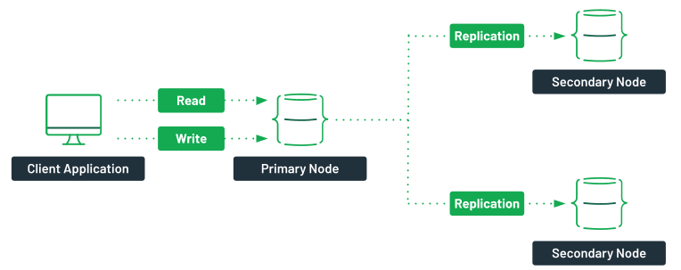

## Replicación

https://www.mongodb.com/basics/replication

Un aspecto muy importante de MongoDB es que soporta la replicación de los datos de forma nativa mediante el uso de conjuntos de réplicas.

### Conjunto de réplicas

En MongoDB se replican los datos mediante un conjunto de réplicas  (*Replica Set*), el cual es un grupo de servidores (nodos *mongod*) donde uno de ellos ejerce la función de primario y por tanto recibe las peticiones de los clientes, y el resto de servidores hace de secundarios, manteniendo copias de los datos del primario.

<figure style="align: center;">
    
    <figcaption>Conjunto de Réplicas en MongoDB</figcaption>
</figure>

Si el nodo primario se cae, los secundarios eligen un nuevo primario entre ellos mismos, en un proceso que se conoce como votación. La aplicación se conectará al nuevo primario de manera transparente. Cuando el antiguo nodo primario vuelva en sí, será un nuevo nodo secundario.

Al usar replicación, si un servidor se cae, siempre vamos a poder obtener los datos a partir de otros servidores del conjunto. Si los datos de un servidor se dañan o son inaccesibles, podemos crear una nueva copia desde uno de los miembros del conjunto.

#### Elementos de un conjunto de réplicas

Los tipos de nodos que podemos encontrar en un conjunto de réplica son:

* Regular: Es el tipo de nodo más común.
* Primario: Acepta todas las operaciones de escritura de los clientes. Cada conjunto de réplicas tendrá sólo un primario, y como sólo un miembro acepta operaciones de escritura, ofrece consistencia estricta para todas las lecturas realizadas desde él.
* Secundario: Los secundarios replican el *oplog* primario y aplican las operaciones a sus conjuntos de datos. De este modo, los nodos secundarios son un espejo del primario. Si el primario deja de estar disponible, el conjunto de réplica elegirá a un secundario para que sea el nuevo primario, mediante un proceso de votación.

    Por defecto, los clientes realizan las lecturas desde el nodo primario. Sin embargo, los clientes pueden indicar que quieren realizar lecturas desde los nodos secundarios.

    !!! danger "Consistencia eventual"
        Es posible que al realizar lecturas de un nodo secundario la información que se obtenga no refleje el estado del nodo primario.

* Árbitro: se emplea sólo para votar. No contiene copia de los datos y no se puede convertir en primario. Los conjuntos de réplica pueden tener árbitros para añadir votos en las elecciones de un nuevo primario. Siempre tienen un voto, y permiten que los conjuntos de réplica tengan un número impar de nodos, sin la necesidad de tener un miembro que replique los datos. Además, no requieren hardware dedicado.

    !!! important "A tener en cuenta"
        * No ejecutar un árbitro en sistemas que también ejecutan los miembros primarios y secundarios del conjunto de réplicas.
        * Sólo añadir un árbitro a un conjunto con un número par de miembros.
        * Si se añade un árbitro a un conjunto con un número impar de miembros, el conjunto puede sufrir un empate.

* Retrasado (delayed): nodo que se emplea para la recuperación del sistema ante un fallo. Para ello, hay que asignar la propiedad `priority:0`. Este nodo nunca será un nodo primario.

* Oculto: empleado para analíticas del sistema.

##### oplog

Para soportar la replicación, el nodo primario almacena todos los cambios en su [*oplog*](https://www.mongodb.com/docs/manual/core/replica-set-oplog/).

De manera simplificada, el *oplog* es un diario de todos los cambios que la instancia principal realiza en las bases de datos con el propósito de replicar dichos cambios en un nodo secundario para asegurar que las dos bases de datos sean idénticas.

El servidor principal mantiene el *oplog*, y el secundario consulta al principal por nuevas entradas que aplicar a sus propias copias de las bases de datos replicadas. Este proceso se realiza de manera asíncrona, de manera que todos los miembros del conjunto de réplicas contienen una copia del *oplog*.

El oplog crea un *timestamp* para cada entrada. Esto permite que un secundario controle la cantidad de información que se ha modificado desde una lectura anterior, y qué entradas necesita transferir para ponerse al día. Si paramos un secundario y lo reiniciamos más adelante, utilizará el *oplog* para obtener todos los cambios que ha perdido mientras estaba offline.

El *oplog* se almacena en una colección limitada (*capped*) y ordenada de un tamaño determinado. La opción `oplogSize` define en MB el tamaño del archivo. Para un sistema de 64 bits con comportamiento de lectura/escritura normales, el `oplogSize` debería ser de al menos un 5% del espacio de disco disponible. Si el sistema tiene más escrituras que lecturas, puede que necesitemos incrementar este tamaño para asegurar que cualquier nodo secundario pueda estar *offline* una cantidad de tiempo razonable sin perder información.

#### Creando un conjunto de réplicas

!!! note "Replicación y particionado en MongoAtlas"
    El cluster gratuito de MongoAtlas ya ofrece replicación de los datos, pero no nos permite administrarlo, al tratarse de un clúster compartido.

Para poder probar tanto la replicación como el particionado, necesitamos tener control sobre los servidores. Por ello, en esta sesión vamos a utilizar *Docker* para montar la infraestructura.

Para ello, vamos a partir del archivo de [docker-compose-replicaset.yml](resources/docker-compose-replicaset.yml) donde creamos tres contenedores (siendo `mongo1` el nodo principal y `mongo2` y `mongo3` los secundarios) dentro de una misma red y que pertenecen al conjunto de réplicas `iabdrs`:

``` yml title="docker-compose-replicaset.yml"
services:
  mongo1:
    container_name: mongo1
    image: mongo
    volumes:
      - ./rs-init.sh:/scripts/rs-init.sh
      - ./init.js:/scripts/init.js
    networks:
      - mongo-network
    ports:
      - 27017:27017
    depends_on:
      - mongo2
      - mongo3
    links:
      - mongo2
      - mongo3
    restart: always
    entrypoint: [ "/usr/bin/mongod", "--bind_ip_all", "--replSet", "iabdrs" ]

  mongo2:
    container_name: mongo2
    image: mongo
    networks:
      - mongo-network
    ports:
      - 27018:27017
    restart: always
    entrypoint: [ "/usr/bin/mongod", "--bind_ip_all", "--replSet", "iabdrs" ]

  mongo3:
    container_name: mongo3
    image: mongo
    networks:
      - mongo-network
    ports:
      - 27019:27017
    restart: always
    entrypoint: [ "/usr/bin/mongod", "--bind_ip_all", "--replSet", "iabdrs" ]

networks:
  mongo-network:
    driver: bridge
```

!!! info "Despliegue"
    Normalmente, cada instancia `mongod` se coloca en un servidor físico y todos en el puerto estándar.

    En nuestro caso, vamos a crear un conjunto de tres réplicas, y en vez de hacerlo en tres máquinas distintas, como los tres contenedores residen en la misma máquina, lo haremos en tres puertos diferentes (del 27017 al 27019)

El nodo principal necesita cargar un *script* para inicializarse, el cual cargamos en el volumen como `rs-init.sh`:

``` sh title="rs-init.sh"
#!/bin/bash

DELAY=25

mongosh <<EOF
var config = {
    "_id": "iabdrs",
    "version": 1,
    "members": [
        {
            "_id": 1,
            "host": "mongo1:27017",
            "priority": 2
        },
        {
            "_id": 2,
            "host": "mongo2:27017",
            "priority": 1
        },
        {
            "_id": 3,
            "host": "mongo3:27017",
            "priority": 1
        }
    ]
};
rs.initiate(config, { force: true });
EOF

echo "****** Esperando ${DELAY} segundos a que se apliquen la configuración del conjunto de réplicas ******"

sleep $DELAY

mongosh < /scripts/init.js
```

Finalmente, mediante el archivo [`init.js`](resources/init.js) comprobamos el estado de la réplica y creamos el usuario administrador:

``` js title="rs-init.sh"
rs.status();
db.createUser({user: 'admin', pwd: 'admin', roles: [ { role: 'root', db: 'admin' } ]});
```

Así pues, una vez tenemos los tres archivos en la misma carpeta, ya podemos lanzar *Docker Compose* para crear los contenedores:

``` bash
docker-compose --file docker-compose-replicaset.yml --project-name iabd-mongodb-replica up -d
```

Y finalmente, sólo nos queda ejecutar el *script* de inicialización sobre el nodo principal:

``` bash
docker exec mongo1 /scripts/rs-init.sh
```

Al ejecutarse el script, se inicializa el conjunto de replicas y se obtiene su estado (mediante `rs.status()`) el cual se muestra por consola:

``` json hl_lines="2 11 39 42 60 63 83 86"
iabdrs [direct: primary] test> {
  set: 'iabdrs',
  date: ISODate("2022-10-26T09:54:42.137Z"),
  myState: 1,
  term: Long("1"),
  syncSourceHost: '',
  syncSourceId: -1,
  heartbeatIntervalMillis: Long("2000"),
  majorityVoteCount: 2,
  writeMajorityCount: 2,
  votingMembersCount: 3,
  writableVotingMembersCount: 3,
  optimes: {
    lastCommittedOpTime: { ts: Timestamp({ t: 1666778080, i: 1 }), t: Long("1") },
    lastCommittedWallTime: ISODate("2022-10-26T09:54:40.457Z"),
    readConcernMajorityOpTime: { ts: Timestamp({ t: 1666778080, i: 1 }), t: Long("1") },
    appliedOpTime: { ts: Timestamp({ t: 1666778080, i: 1 }), t: Long("1") },
    durableOpTime: { ts: Timestamp({ t: 1666778080, i: 1 }), t: Long("1") },
    lastAppliedWallTime: ISODate("2022-10-26T09:54:40.457Z"),
    lastDurableWallTime: ISODate("2022-10-26T09:54:40.457Z")
  },
  lastStableRecoveryTimestamp: Timestamp({ t: 1666778030, i: 1 }),
  electionCandidateMetrics: {
    lastElectionReason: 'electionTimeout',
    lastElectionDate: ISODate("2022-10-26T09:53:10.197Z"),
    electionTerm: Long("1"),
    lastCommittedOpTimeAtElection: { ts: Timestamp({ t: 1666777979, i: 1 }), t: Long("-1") },
    lastSeenOpTimeAtElection: { ts: Timestamp({ t: 1666777979, i: 1 }), t: Long("-1") },
    numVotesNeeded: 2,
    priorityAtElection: 2,
    electionTimeoutMillis: Long("10000"),
    numCatchUpOps: Long("0"),
    newTermStartDate: ISODate("2022-10-26T09:53:10.363Z"),
    wMajorityWriteAvailabilityDate: ISODate("2022-10-26T09:53:11.139Z")
  },
  members: [
    {
      _id: 1,
      name: 'mongo1:27017',
      health: 1,
      state: 1,
      stateStr: 'PRIMARY',
      uptime: 129,
      optime: { ts: Timestamp({ t: 1666778080, i: 1 }), t: Long("1") },
      optimeDate: ISODate("2022-10-26T09:54:40.000Z"),
      lastAppliedWallTime: ISODate("2022-10-26T09:54:40.457Z"),
      lastDurableWallTime: ISODate("2022-10-26T09:54:40.457Z"),
      syncSourceHost: '',
      syncSourceId: -1,
      infoMessage: 'Could not find member to sync from',
      electionTime: Timestamp({ t: 1666777990, i: 1 }),
      electionDate: ISODate("2022-10-26T09:53:10.000Z"),
      configVersion: 1,
      configTerm: 1,
      self: true,
      lastHeartbeatMessage: ''
    },
    {
      _id: 2,
      name: 'mongo2:27017',
      health: 1,
      state: 2,
      stateStr: 'SECONDARY',
      uptime: 102,
      optime: { ts: Timestamp({ t: 1666778070, i: 1 }), t: Long("1") },
      optimeDurable: { ts: Timestamp({ t: 1666778070, i: 1 }), t: Long("1") },
      optimeDate: ISODate("2022-10-26T09:54:30.000Z"),
      optimeDurableDate: ISODate("2022-10-26T09:54:30.000Z"),
      lastAppliedWallTime: ISODate("2022-10-26T09:54:40.457Z"),
      lastDurableWallTime: ISODate("2022-10-26T09:54:40.457Z"),
      lastHeartbeat: ISODate("2022-10-26T09:54:40.322Z"),
      lastHeartbeatRecv: ISODate("2022-10-26T09:54:41.327Z"),
      pingMs: Long("0"),
      lastHeartbeatMessage: '',
      syncSourceHost: 'mongo1:27017',
      syncSourceId: 1,
      infoMessage: '',
      configVersion: 1,
      configTerm: 1
    },
    {
      _id: 3,
      name: 'mongo3:27017',
      health: 1,
      state: 2,
      stateStr: 'SECONDARY',
      uptime: 102,
      optime: { ts: Timestamp({ t: 1666778070, i: 1 }), t: Long("1") },
      optimeDurable: { ts: Timestamp({ t: 1666778070, i: 1 }), t: Long("1") },
      optimeDate: ISODate("2022-10-26T09:54:30.000Z"),
      optimeDurableDate: ISODate("2022-10-26T09:54:30.000Z"),
      lastAppliedWallTime: ISODate("2022-10-26T09:54:40.457Z"),
      lastDurableWallTime: ISODate("2022-10-26T09:54:40.457Z"),
      lastHeartbeat: ISODate("2022-10-26T09:54:40.322Z"),
      lastHeartbeatRecv: ISODate("2022-10-26T09:54:41.326Z"),
      pingMs: Long("0"),
      lastHeartbeatMessage: '',
      syncSourceHost: 'mongo1:27017',
      syncSourceId: 1,
      infoMessage: '',
      configVersion: 1,
      configTerm: 1
    }
  ],
  ok: 1,
  '$clusterTime': {
    clusterTime: Timestamp({ t: 1666778080, i: 1 }),
    signature: {
      hash: Binary(Buffer.from("0000000000000000000000000000000000000000", "hex"), 0),
      keyId: Long("0")
    }
  },
  operationTime: Timestamp({ t: 1666778080, i: 1 })
}
```

Una vez que ya hemos arrancando todo, podemos conectarnos a nuestro conjunto de réplica mediante `mongosh` (si no le pasamos ningún parámetro, se conecta automáticamente a `localhost` y al puerto 27017). Dentro del shell, los comandos que trabajan con réplicas comienzan por el prefijo **`rs`**. Por ejemplo, mediante `rs.help()` obtendremos la ayuda de los métodos disponibles:

``` bash
> mongosh
iabdrs [direct: primary] test> rs.help()

  Replica Set Class:

    initiate                                   Initiates the replica set.
    config                                     Returns a document that contains the current replica set configuration.
    conf                                       Calls replSetConfig
    reconfig                                   Reconfigures an existing replica set, overwriting the existing replica set configuration.
    reconfigForPSASet                          Reconfigures an existing replica set, overwriting the existing replica set configuration, if the reconfiguration is a transition from a Primary-Arbiter to a Primary-Secondary-Arbiter set.
    status                                     Calls replSetGetStatus
    isMaster                                   Calls isMaster
    hello                                      Calls hello
    printSecondaryReplicationInfo              Calls db.printSecondaryReplicationInfo
    printSlaveReplicationInfo                  DEPRECATED. Use rs.printSecondaryReplicationInfo
    printReplicationInfo                       Calls db.printReplicationInfo
    add                                        Adds replica set member to replica set.
    addArb                                     Calls rs.add with arbiterOnly=true
    remove                                     Removes a replica set member.
    freeze                                     Prevents the current member from seeking election as primary for a period of time. Uses the replSetFreeze command
    stepDown                                   Causes the current primary to become a secondary which forces an election. If no stepDownSecs is provided, uses 60 seconds. 
Uses the replSetStepDown command
    syncFrom                                   Sets the member that this replica set member will sync from, overriding the default sync target selection logic.
    secondaryOk                                This method is deprecated. Use db.getMongo().setReadPref() instead

  For more information on usage: https://docs.mongodb.com/manual/reference/method/js-replication/
```


https://blog.devgenius.io/how-to-deploy-a-mongodb-replicaset-using-docker-compose-a538100db471


https://github.com/minhhungit/mongodb-cluster-docker-compose


. Mediante,
A continuación, crearemos un documento con la configuración donde el _id tiene que ser igual al usado al crear la réplica, y el array de members contiene las replicas creadas donde los puertos han de coincidir.

Configurando el conjunto de réplicas
> config = { _id: "replicaExperto", members:[
{_id : 0, host : "localhost:27017"},
  { _id : 1, host : "localhost:27018"},
{_id : 2, host : "localhost:27019"}
]};
Si en los miembros ponemos slaveDelay: numSeg podemos retrasar un nodo respecto al resto (también deberemos indicar que priority : 0 para que no sea un nodo principal). Más información en <http://docs.mongodb.org/manual/core/replica-set-delayed-member/>
Tras crear el documento de configuración, podemos iniciar el conjunto mediante:

``` js
> rs.initiate(config)
{
  "info" : "Config now saved locally.  Should come online in about a minute.",
  "ok" : 1
}
```

Si ahora volvemos a consultar el estado de la réplica tendremos:

replicaExperto:PRIMARY> rs.status()
{
  "set" : "replicaExperto",
  "date" : ISODate("2016-02-09T17:57:52.273Z"),
  "myState" : 1,
  "term" : NumberLong(1),
  "heartbeatIntervalMillis" : NumberLong(2000),
  "members" : [
   {
      "_id" : 0,
      "name" : "localhost:27017",
      "health" : 1,
      "state" : 1,
      "stateStr" : "PRIMARY",
      "uptime" : 89,
      "optime" : {
        "ts" : Timestamp(1455040665, 2),
        "t" : NumberLong(1)
      },
      "optimeDate" : ISODate("2016-02-09T17:57:45Z"),
      "infoMessage" : "could not find member to sync from",
      "electionTime" : Timestamp(1455040665, 1),
      "electionDate" : ISODate("2016-02-09T17:57:45Z"),
      "configVersion" : 1,
      "self" : true
    },
   {
      "_id" : 1,
      "name" : "localhost:27018",
      "health" : 1,
      "state" : 2,
      "stateStr" : "SECONDARY",
      "uptime" : 17,
      "optime" : {
        "ts" : Timestamp(1455040665, 2),
        "t" : NumberLong(1)
      },
      "optimeDate" : ISODate("2016-02-09T17:57:45Z"),
      "lastHeartbeat" : ISODate("2016-02-09T17:57:51.287Z"),
      "lastHeartbeatRecv" : ISODate("2016-02-09T17:57:47.860Z"),
      "pingMs" : NumberLong(0),
      "syncingTo" : "localhost:27017",
      "configVersion" : 1
   },
   {
      "_id" : 2,
      "name" : "localhost:27019",
      "health" : 1,
      "state" : 2,
      "stateStr" : "SECONDARY",
      "uptime" : 17,
      "optime" : {
        "ts" : Timestamp(1455040665, 2),
        "t" : NumberLong(1)
      },
      "optimeDate" : ISODate("2016-02-09T17:57:45Z"),
      "lastHeartbeat" : ISODate("2016-02-09T17:57:51.287Z"),
      "lastHeartbeatRecv" : ISODate("2016-02-09T17:57:47.869Z"),
      "pingMs" : NumberLong(1),
      "syncingTo" : "localhost:27017",
      "configVersion" : 1
   }
  ],
  "ok" : 1
}
La próxima vez que lancemos las réplicas ya no deberemos configurarlas. Así pues, el proceso de enlazar e iniciar las réplicas sólo se realiza una vez.


``` js
> rs.status()
< rs.status()
{
  set: 'atlas-4wikkb-shard-0',
  date: 2022-10-20T17:42:51.267Z,
  myState: 1,
  term: Long("22"),
  syncSourceHost: '',
  syncSourceId: -1,
  heartbeatIntervalMillis: Long("2000"),
  majorityVoteCount: 2,
  writeMajorityCount: 2,
  votingMembersCount: 3,
  writableVotingMembersCount: 3,
  optimes: {
    lastCommittedOpTime: { ts: Timestamp({ t: 1666287770, i: 5 }), t: Long("22") },
    lastCommittedWallTime: 2022-10-20T17:42:50.864Z,
    readConcernMajorityOpTime: { ts: Timestamp({ t: 1666287770, i: 5 }), t: Long("22") },
    appliedOpTime: { ts: Timestamp({ t: 1666287770, i: 5 }), t: Long("22") },
    durableOpTime: { ts: Timestamp({ t: 1666287770, i: 5 }), t: Long("22") },
    lastAppliedWallTime: 2022-10-20T17:42:50.864Z,
    lastDurableWallTime: 2022-10-20T17:42:50.864Z
  },
  lastStableRecoveryTimestamp: Timestamp({ t: 1666287740, i: 5 }),
  electionCandidateMetrics: {
    lastElectionReason: 'stepUpRequestSkipDryRun',
    lastElectionDate: 2022-10-14T19:15:57.110Z,
    electionTerm: Long("22"),
    lastCommittedOpTimeAtElection: { ts: Timestamp({ t: 1665774957, i: 1 }), t: Long("21") },
    lastSeenOpTimeAtElection: { ts: Timestamp({ t: 1665774957, i: 1 }), t: Long("21") },
    numVotesNeeded: 2,
    priorityAtElection: 7,
    electionTimeoutMillis: Long("5000"),
    priorPrimaryMemberId: 1,
    numCatchUpOps: Long("0"),
    newTermStartDate: 2022-10-14T19:15:57.214Z,
    wMajorityWriteAvailabilityDate: 2022-10-14T19:15:58.574Z
  },
  members: [
    {
      _id: 0,
      name: 'ac-opunia9-shard-00-00.dfaz5er.mongodb.net:27017',
      health: 1,
      state: 2,
      stateStr: 'SECONDARY',
      uptime: 512912,
      optime: [Object],
      optimeDurable: [Object],
      optimeDate: 2022-10-20T17:42:50.000Z,
      optimeDurableDate: 2022-10-20T17:42:50.000Z,
      lastAppliedWallTime: 2022-10-20T17:42:50.864Z,
      lastDurableWallTime: 2022-10-20T17:42:50.864Z,
      lastHeartbeat: 2022-10-20T17:42:50.357Z,
      lastHeartbeatRecv: 2022-10-20T17:42:50.646Z,
      pingMs: Long("1"),
      lastHeartbeatMessage: '',
      syncSourceHost: 'ac-opunia9-shard-00-02.dfaz5er.mongodb.net:27017',
      syncSourceId: 2,
      infoMessage: '',
      configVersion: 2,
      configTerm: 22
    },
    {
      _id: 1,
      name: 'ac-opunia9-shard-00-01.dfaz5er.mongodb.net:27017',
      health: 1,
      state: 2,
      stateStr: 'SECONDARY',
      uptime: 512651,
      optime: [Object],
      optimeDurable: [Object],
      optimeDate: 2022-10-20T17:42:49.000Z,
      optimeDurableDate: 2022-10-20T17:42:49.000Z,
      lastAppliedWallTime: 2022-10-20T17:42:50.864Z,
      lastDurableWallTime: 2022-10-20T17:42:50.864Z,
      lastHeartbeat: 2022-10-20T17:42:49.935Z,
      lastHeartbeatRecv: 2022-10-20T17:42:51.180Z,
      pingMs: Long("1"),
      lastHeartbeatMessage: '',
      syncSourceHost: 'ac-opunia9-shard-00-02.dfaz5er.mongodb.net:27017',
      syncSourceId: 2,
      infoMessage: '',
      configVersion: 2,
      configTerm: 22
    },
    {
      _id: 2,
      name: 'ac-opunia9-shard-00-02.dfaz5er.mongodb.net:27017',
      health: 1,
      state: 1,
      stateStr: 'PRIMARY',
      uptime: 512922,
      optime: [Object],
      optimeDate: 2022-10-20T17:42:50.000Z,
      lastAppliedWallTime: 2022-10-20T17:42:50.864Z,
      lastDurableWallTime: 2022-10-20T17:42:50.864Z,
      syncSourceHost: '',
      syncSourceId: -1,
      infoMessage: '',
      electionTime: Timestamp({ t: 1665774957, i: 2 }),
      electionDate: 2022-10-14T19:15:57.000Z,
      configVersion: 2,
      configTerm: 22,
      self: true,
      lastHeartbeatMessage: ''
    }
  ],
  ok: 1,
  '$clusterTime': {
    clusterTime: Timestamp({ t: 1666287770, i: 5 }),
    signature: {
      hash: Binary(Buffer.from("ee0dfe4005d204a45bbc1ee1fa92de822cfd48c2", "hex"), 0),
      keyId: Long("7098414637623803905")
    }
  },
  operationTime: Timestamp({ t: 1666287770, i: 5 })
}
```

Podemos comprobar si un nodo es el principal mediante rs.isMaster():

``` js
rs.isMaster()
{
  topologyVersion: {
    processId: ObjectId("6349b501e763f7899c34bae7"),
    counter: Long("6")
  },
  hosts: [
    'ac-opunia9-shard-00-00.dfaz5er.mongodb.net:27017',
    'ac-opunia9-shard-00-01.dfaz5er.mongodb.net:27017',
    'ac-opunia9-shard-00-02.dfaz5er.mongodb.net:27017'
  ],
  setName: 'atlas-4wikkb-shard-0',
  setVersion: 2,
  ismaster: true,
  secondary: false,
  primary: 'ac-opunia9-shard-00-02.dfaz5er.mongodb.net:27017',
  tags: {
    workloadType: 'OPERATIONAL',
    provider: 'AWS',
    region: 'EU_WEST_3',
    nodeType: 'ELECTABLE'
  },
  me: 'ac-opunia9-shard-00-02.dfaz5er.mongodb.net:27017',
  electionId: ObjectId("7fffffff0000000000000016"),
  lastWrite: {
    opTime: { ts: Timestamp({ t: 1666287857, i: 4 }), t: Long("22") },
    lastWriteDate: 2022-10-20T17:44:17.000Z,
    majorityOpTime: { ts: Timestamp({ t: 1666287857, i: 4 }), t: Long("22") },
    majorityWriteDate: 2022-10-20T17:44:17.000Z
  },
  maxBsonObjectSize: 16777216,
  maxMessageSizeBytes: 48000000,
  maxWriteBatchSize: 100000,
  localTime: 2022-10-20T17:44:17.555Z,
  logicalSessionTimeoutMinutes: 30,
  connectionId: 131669,
  minWireVersion: 0,
  maxWireVersion: 13,
  readOnly: false,
  ok: 1,
  '$clusterTime': {
    clusterTime: Timestamp({ t: 1666287857, i: 4 }),
    signature: {
      hash: Binary(Buffer.from("7221a4b1c5ea0867cc6930eae945434bd9b68a17", "hex"), 0),
      keyId: Long("7098414637623803905")
    }
  },
  operationTime: Timestamp({ t: 1666287857, i: 4 }),
  isWritablePrimary: true
}
```

FIXME: esto es importante

``` js
rs.status()
rs.initiate({"_id": "replicaTest",
  members: [
{_id: 0, host: "127.0.0.1:27017" },
    { _id: 1, host: "127.0.0.1:27018" },
{_id: 2, host: "127.0.0.1:27019", arbiterOnly:true }]
})
rs.add("mongodbd1.example.net:27017")
rs.addArb("mongodbd2.example.net:27017")
rs.remove("mongodbd1.example.net:27017")
rs.conf()
rs.isMaster()
rs.printReplicationInfo()
rs.printSlaveReplicationInfo()
rs.reconfig(<valid_conf>)
rs.slaveOk()
rs.stepDown(20, 5) // (stepDownSecs, secondaryCatchUpPeriodSecs)
```

#### Trabajando con las réplicas

Una vez que hemos visto que las tres réplicas están funcionando, vamos a comprobar como podemos trabajar con ellas.

Para ello, nos conectamos al nodo principal (al ser el puerto predeterminado, podemos omitirlo):

$ mongosh --port 27017
Al conectarnos al nodo principal, nos aparece como símbolo del shell el nombre del conjunto de la réplica seguido de dos puntos y PRIMARY si nos hemos conectado al nodo principal, o SECONDARY en caso contrario.

replicaExperto:PRIMARY>
Para saber si nos hemos conectado al nodo correcto, mediante rs.isMaster() obtendremos el tipo del nodo (propiedad ismaster) e información sobre el resto de nodos:

replicaExperto:PRIMARY> rs.isMaster()
{
  "hosts" : [
    "localhost:27017",
    "localhost:27018",
    "localhost:27019"
  ],
  "setName" : "replicaExperto",
  "setVersion" : 1,
  "ismaster" : true,
  "secondary" : false,
  "primary" : "localhost:27017",
  "me" : "localhost:27017",
  "electionId" : ObjectId("56ba28990000000000000001"),
  "maxBsonObjectSize" : 16777216,
  "maxMessageSizeBytes" : 48000000,
  "maxWriteBatchSize" : 1000,
  "localTime" : ISODate("2016-02-09T18:00:46.397Z"),
  "maxWireVersion" : 4,
  "minWireVersion" : 0,
  "ok" : 1
}
Ahora que sabemos que estamos en el nodo principal, vamos a insertar datos.

Para ello, vamos a insertar 100 documentos:

Insertamos 100 documentos sobre replicaExperto:PRIMARY
for (i=0; i<1000; i++) {
  db.pruebas.insert({num: i})
}
Estos 1000 documentos se han insertado en el nodo principal, y se han replicado a los secundarios. Para comprobar la replicación, abrimos un nuevo terminal y nos conectamos a un nodo secundario:

$ mongosh --port 27018
replicaExperto:SECONDARY>
Si desde el nodo secundario intentamos consultar el total de documentos de la colección obtendremos un error:

replicaExperto:SECONDARY> db.pruebas.count()
count failed: { "ok" : 0, "errmsg" : "not master and slaveOk=false", "code" : 13435 }
El error indica que no somos un nodo primario y por lo tanto no podemos leer de él. Para permitir lecturas en los nodos secundarios, mediante rs.slaveOk() le decimos a mongosh que sabemos que nos hemos conectado a un secundairo y admitimos la posibilidad de obtener datos obsoletos.

replicaExperto:SECONDARY> rs.slaveOk()
replicaExperto:SECONDARY> db.pruebas.count()
1000
Pero que podamos leer no significa que podamos escribir. Si intentamos escribir en un nodo secundario obtendremos un error:

replicaExperto:SECONDARY> db.pruebas.insert({num : 1001})
WriteResult({ "writeError" : { "code" : 10107, "errmsg" : "not master" } }

#### Tolerancia a fallos

Cuando un nodo primario no se comunica con otros miembros del conjunto durante más de 10 segundos, el conjunto de réplicas intentará, de entre los secundarios, que un miembro se convierta en el nuevo primario.

Para ello se realiza un proceso de votación, de modo que el nodo que obtenga el mayor número de votos se erigirá en primario. Este proceso de votación se realiza bastante rápido (menos de 3 segundos), durante el cual no existe ningún nodo primario y por tanto la réplica no acepta escrituras y todos los miembros se convierten en nodos de sólo-lectura.

Elección de un nuevo primario
Figure 4. Elección de un nuevo primario
Proceso de votación
Cuando un nodo secundario no puede contactar con su nodo primario, contactará con el resto de miembros y les indicará que quiere ser elegido como primario. Es decir, cada nodo que no encuentre un primario se nominará como posible primario, de modo que un nodo no nomina a otro a ser primario, únicamente vota sobre una nominación ya existente.

Antes de dar su voto, el resto de nodos comprobarán:

si ellos tienen conectividad con el primario

si el nodo que solicita ser primario tienen una réplica actualizada de los datos. Todas las operaciones replicadas están ordenadas por el timestamp ascendentemente, de modo los candidatos deben tener operaciones posteriores o iguales a cualquier miembro con el que tengan conectividad.

si existe algún nodo con una prioridad mayor que debería ser elegido.

Si algún miembro que quiere ser primario recibe una mayoría de "sís" se convertirá en el nuevo primario, siempre y cuando no haya un servidor que vete la votación. Si un miembro la veta es porque conoce alguna razón por la que el nodo que quiere ser primario no debería serlo, es decir, ha conseguido contactar con el antiguo primario.

Una vez un candidato recibe una mayoría de "sís", su estado pasará a ser primario.

Cantidad de elementos
En la votación, se necesita una mayoría de nodos para elegir un primario, ya que una escritura se considera segura cuando ha alcanzado a la mayoría de los nodos. Esta mayoría se define como más de la mitad de todos los nodos del conjunto. Hay que destacar que la mayoría no se basa en los elementos que queden en pie o estén disponibles, sino en el conjunto definido en la configuración del conjunto.

Por lo tanto, es importante configurar el conjunto de una manera que siempre se puede elegir un nodo primario. Por ejemplo, en un conjunto de cinco nodos, si los nodos 1, 2 y 3 están en un centro de datos y los miembros 4 y 5 en otro, debería haber casi siempre una mayoría disponible en el primer centro de datos (es más probable que se pierda la conexión de red entre centros de datos que dentro de ellos).

Elección de un nuevo primario
Figure 5. Elección de un nuevo primario
Por lo tanto, una configuración que hay que evitar es aquella compuesta por dos elementos: uno primario y uno secundario. Si uno de los dos miembros deja de estar disponible, el otro miembro no puede verlo. En esta situación, ninguna parte de la partición de red tiene una mayoría, con lo que acabaríamos con dos secundarios.

Por ello, el número mínimo de nodos es 3, para que al realizar una nueva elección se pueda elegir un nuevo nodo.

Comprobando la tolerancia
Para comprobar esto, desde el nodo primario vamos a detenerlo:

replicaExperto:PRIMARY> db.adminCommand({"shutdown" : 1})
Otra posibilidad en vez de detenerlo es degradarlo a nodo secundario:

replicaExperto:PRIMARY> rs.stepDown()
Si pasamos al antiguo nodo secundario, y le preguntamos si es el principal obtendremos:

replicaExperto:SECONDARY> rs.isMaster()
{
  "setName" : "replicaExperto",
  "setVersion" : 1,
  "ismaster" : false,
  "secondary" : true,
  "hosts" : [
    "localhost:27018",
    "localhost:27019",
    "localhost:27017"
  ],
  "primary" : "localhost:27019",
  "me" : "localhost:27018",
  "maxBsonObjectSize" : 16777216,
  "maxMessageSizeBytes" : 48000000,
  "maxWriteBatchSize" : 1000,
  "localTime" : ISODate("2015-03-24T21:55:27.382Z"),
  "maxWireVersion" : 2,
  "minWireVersion" : 0,
  "ok" : 1
}
Si nos fijamos en la propiedad primary, veremos que tenemos un nuevo primario.

Configuración recomendada
Se recomiendan dos configuraciones:

Mediante una mayoría del conjunto en un centro de datos. Este planteamiento es bueno si tenemos un data center donde queremos que siempre se aloje el nodo primario de la réplica. Siempre que el centro de datos funcione normalmente, habrá un nodo primario. Sin embargo, si el centro primario pierde la conectividad, el centro de datos secundario no podrá elegir un nuevo primario.

Mediante el mismo número de servidores en cada centro de datos, más un servidor que rompe la igualdad en una tercera localización. Este diseño es conveniente cuando ambos centros de datos tienen el mismo grado de confiabilidad y robustez.

#### Recuperación del sistema

Si en un conjunto de réplicas se cae el primario y hay escrituras que se han pasado al oplog de modo que los otros nodos no las han replicado, cuando el nodo primario vuelva en sí como secundario y se sincronice con el primario, se dará cuenta que hay operaciones de escritura pendientes y las pasará a rollback, para que si se desean se apliquen manualmente.

Para evitar este escenario, se necesita emplear consistencia en la escritura, de manera que hasta que la escritura no se haya replicado en la mayoría de los nodos no se considere como una escritura exitosa.

### Consistencia en la escritura

Ya hemos visto que tanto las lecturas como las escrituras se realizan de manera predeterminada en el nodo primario.

Las aplicaciones pueden decidir que las escrituras vayan al nodo primario pero las lecturas al secundario. Esto puede provocar que haya lecturas caducas, con datos obsoletos, pero como beneficio podemos escalar el sistema.

La replicación es un proceso asíncrono. En el período de tiempo en el que el sistema de votación sucede, no se completa ninguna escritura.

MongoDB garantiza la consistencia en la escritura, haciendo que sea un sistema consistente. Para ello, ofrece un sistema que garantiza que una escritura ha sido exitosa. Dependiendo del nivel de configuración de la consistencia, las inserciones, modificaciones y borrados pueden tardar más o menos. Si reducimos el nivel de consistencia, el rendimiento será mejor, a costa de poder obtener datos obsoletos u perder datos que no se han terminado de serializar en disco. Con un nivel de consistencia más alto, los clientes esperan tras enviar una operación de escritura a que MongoDB les confirme la operación.

Los valores que podemos configurar se realizan mediante las siguientes opciones:

* `w`: indica el número de servidores que se han de replicar para que la inserción devuelva un ACK.
* `j`: indica si las escrituras se tienen que trasladar a un diario de bitácora (journal)
* `wtimeout`: indica el límite de tiempo a esperar como máximo, para prevenir que una escritura se bloquee indefinidamente.

### Niveles de consistencia

Con estas opciones, podemos configurar diferentes niveles de consistencia son:

* Sin confirmación: `w:0`, también conocido como *fire-and-forget*.
* Con confirmación: `w:1`, el cual es el modo por defecto.
* Con diario: `w:1`, `j:true`. Cada inserción primero se escribe en el diario y posteriormente en el directorio de datos.
* Con confirmación de la mayoría: `w: "majority"`, es decir, confirman la mitad + 1 de los nodos de la replica.

Estas opciones se indican como parámetro final en las operaciones de inserción y modificación de datos. Por ejemplo:

``` js
db.pruebas.insert(
  {num : 1002},
  {writeConcern: {w: "majority", wtimeout: 5000}}
)
```

En resumen, a mayor cantidad de nodos, mayor es la tolerancia a fallos pero cada operación necesita más tiempo y recursos para realizar la persistencia de los datos.

Más información en <http://docs.mongodb.org/manual/core/write-concern/> y <https://www.youtube.com/watch?v=49BPAY1Yb5w>

FIXME: Revisar notebook curso MongoDB_PYTHON

## Particionado (Sharding)

https://www.mongodb.com/basics/sharding

<https://www.digitalocean.com/community/tutorials/understanding-database-sharding>

Ya vimos en la primera sesión que dentro del entorno de las bases de datos, particionar consiste en dividir los datos entre múltiples máquinas. Al poner un subconjunto de los datos en cada máquina, vamos a poder almacenar más información y soportar más carga sin necesidad de máquinas más potentes, sino una mayor cantidad de máquinas más modestas (y mucho más baratas).

El *Sharding* es una técnica que fragmenta los datos de la base de datos horizontalmente agrupándolos de algún modo que tenga sentido y que permita un direccionamiento más rápido.

<figure style="align: center;">
    
    <figcaption>Sharding</figcaption>
</figure>

Por lo tanto, estos shards (fragmentos) pueden estar localizados en diferentes bases de datos y localizaciones físicas.

El *Sharding* no tiene por qué estar basado únicamente en una colección y un campo, puede ser a nivel de todas las colecciones. Por ejemplo podríamos decir "todos los datos de usuarios cuyo perfil esté en los Estados Unidos los redirigimos a la base de datos del servidor en Estados Unidos, y todos los de Asia van a la base de datos de Asia".

``` js
sh.status()
sh.addShard("rs1/mongodbd1.example.net:27017")
sh.shardCollection("mydb.coll", {zipcode: 1})

sh.moveChunk("mydb.coll", { zipcode: "53187" }, "shard0019")
sh.splitAt("mydb.coll", {x: 70})
sh.splitFind("mydb.coll", {x: 70})
sh.disableAutoSplit()
sh.enableAutoSplit()

sh.startBalancer()
sh.stopBalancer()
sh.disableBalancing("mydb.coll")
sh.enableBalancing("mydb.coll")
sh.getBalancerState()
sh.setBalancerState(true/false)
sh.isBalancerRunning()

sh.addTagRange("mydb.coll", {state: "NY", zip: MinKey }, { state: "NY", zip: MaxKey }, "NY")
sh.removeTagRange("mydb.coll", {state: "NY", zip: MinKey }, { state: "NY", zip: MaxKey }, "NY")
sh.addShardTag("shard0000", "NYC")
sh.removeShardTag("shard0000", "NYC")

sh.addShardToZone("shard0000", "JFK")
sh.removeShardFromZone("shard0000", "NYC")
sh.removeRangeFromZone("mydb.coll", {a: 1, b: 1}, {a: 10, b: 10})
```

### Particionando con MongoDB

*MongoDB* implementa el *sharding* de forma nativa y automática (de ahí el término de *auto-sharding*), siguiendo un enfoque basado en rangos.

Para ello, divide una colección entre diferentes servidores, utilizando `mongos` como router de las peticiones entre los sharded clusters.

Esto favorece que el desarrollador ignore que la aplicación no se comunica con un único servidor, balanceando de manera automática los datos y permitiendo incrementar o reducir la capacidad del sistema a conveniencia.

Antes de plantearse hacer auto-sharding sobre nuestros datos, es conveniente dominar cómo se trabaja con MongoDB y el uso de conjuntos de réplica.

#### Sharded Cluster

El particionado de MongoDB permite crear un cluster de muchas máquinas, dividiendo a nivel de colección y poniendo un subconjunto de los datos de la colección en cada uno de los fragmentos.

Los componentes de un sharded clusters son:

* ***Shards*** (Fragmentos): Cada una de las máquinas del cluster, que almacena un subconjunto de los datos de la colección. Cada shard es una instancia de mongod o un conjunto de réplicas. En un entorno de producción, todos los shards son conjuntos de réplica.
* **Servidores de Configuracion**: Cada servidor de configuración es una instancia de mongod que almacena metadatos sobre el cluster. Los metadatos mapean los trozos con los shards, definiendo qué rangos de datos definen un trozo (chunk) de la colección, y qué trozos se encuentran en un determinado shard.  
    En entornos de producción se aconseja tener 3 servidores de configuración ya que si sólo tuviésemos uno, al producirse una caída el cluster quedaría inaccesible.

* **Enrutadores**: Cada router es una instancia mongos que enruta las lecturas y escrituras de las aplicaciones a los shards. Las aplicaciones no acceden directamente a los shards, sino al router. Estos enrutadores funcionan de manera similar a una tabla de contenidos, que nos indica donde se encuentran los datos. Una vez recopilados los datos de los diferentes shards, se fusionan y se encarga de devolverlos a la aplicación.

En entornos de producción es común tener varios routers para balancear la carga de los clientes.


<figure style="align: center;">
    
    <figcaption>Componentes de un Sharded cluster</figcaption>
</figure>

!!! question "Autoevaluación"
    Supongamos que queremos ejecutar múltiples routers mongos para soportar la redundancia. ¿Qué elemento asegurará la tolerancia a fallos y cambiará de un mongos a otro dentro de tu aplicación?

    * mongod
    * mongos
    * Driver
    * Los servidores de configuración de sharding

#### Shard key

Para que MongoDB sepa cómo dividir una colección en trozos, hay que elegir una shard key, normalmente el identificador del documento, por ejemplo, student_id. Este identificador es la clave del chunk (por lo hace la misma función que una clave primaria).

Para las búsquedas, borrados y actualizaciones, al emplear la shard key, mongos sabe a que shard enviar la petición. En cambio, si la operación no la indica, se hará un broadcast a todas los shards para averiguar donde se encuentra.

Por eso, toda inserción debe incluir la *shard key*. En el caso de tratarse de una clave compuesta, la inserción debe contener la clave completa.

Entre los aspectos a tener en cuenta a la hora de elegir una shard key cabe destacar que debe:

* Tener una alta cardinalidad, para asegurar que los documentos puedan dividirse en los distintos fragmentos. Por ejemplo, si elegimos un shard key que solo tiene 3 valores posibles y tenemos 5 fragmentos, no podríamos separar los documentos en los 5 fragmentos al solo tener 3 valores posibles para separar. Cuantos más valores posibles pueda tener la clave de fragmentación, más eficiente será la división de los trozos entre los fragmentos disponibles.
* Tener un alto nivel de aleatoriedad. Si utilizamos una clave que siga un patrón incremental como una fecha o un ID, conllevará que al insertar documentos, el mismo fragmento estará siendo utilizando constantemente durante el rango de valores definido para él. Esto provoca que los datos estén separados de una manera óptima, pero pondrá siempre bajo estrés a un fragmento en períodos de tiempo mientras que los otros posiblemente queden con muy poca actividad (comportamiento conocido como hotspotting).

Una solución a las claves que siguen patrones incrementales es aplicar una funcion hash y crear una clave hasheada que si tiene un alto nivel de aleatoriedad.

Más consejos sobre como elegir la shard key en <http://techinsides.blogspot.com.es/2013/09/keynote-concerns-how-to-choose-mongodb.html>
Finalmente, destacar que toda shard key debe tener un índice asociado.

### Preparando el Sharding con MongoDB

Para comenzar, vamos a crear un particionado en dos instancias en las carpetas /data/s1/db y /data/s2/db. Los logs los colocaremos en /data/logs y crearemos un servidor para la configuración de los metadatos del shard en /data/con1/db:

mkdir -p /data/s1/db /data/s2/db /data/logs /data/conf1/db
chown `id -u` /data/s1/db /data/s2/db /data/logs /data/conf1/db
A continuación, arrancaremos un proceso mongod por cada uno de los shards (con la opción --shardsvr) y un tercero para la base de datos de configuración (con la opción --configsvr). Finalmente, también lanzaremos un proceso mongos:

Script de creación del Shard - (creaShard.sh)
mongod --shardsvr --dbpath  /data/s1/db --port 27000 --logpath /data/logs/sh1.log --smallfiles --oplogSize 128 --fork
mongod --shardsvr --dbpath  /data/s2/db --port 27001 --logpath /data/logs/sh2.log --smallfiles --oplogSize 128 --fork
mongod --configsvr --dbpath  /data/conf1/db --port 25000 --logpath  /data/logs/config.log --fork
mongos --configdb localhost:25000 --logpath  /data/logs/mongos.log --fork
El cual lanzaremos mediante

bash < creaShard.sh
Una vez creado, arrancaremos un shell del mongo, y observaremos como se lanza mongos:

$ mongo
MongoDB shell version: 3.2.1
connecting to: test
mongos>
Finalmente, configuraremos el shard mediante el método sh.addShard(URI), obteniendo confirmación tras cada cada uno:

mongos> sh.addShard("localhost:27000")
{ "shardAdded" : "shard0000", "ok" : 1 }  
mongos> sh.addShard("localhost:27001")
{ "shardAdded" : "shard0001", "ok" : 1 }
El valor de la propiedad shardAdded nos devuelve el identificado unívoco de cada shard.
De manera similar que con el conjunto de réplicas se emplean el prefijo rs, para interactuar con los componentes implicados en el sharding se emplea sh. Por ejemplo, mediante sh.help() obtendremos la ayuda de los métodos disponibles.
Así pues, en este momento tenemos montada un shard con:

dos instancias de mongod para almacenar datos en los puertos 27000 y 27001 (shards)

una instancia monogd en el puerto 25000 (servidor de configuración) encargada de almacenar los metadatos del shard, a la cual sólo se deberían conectar el proceso mongos o los drivers para obtener información sobre el shard y la shard key

y un proceso mongos (enrutador), encargado de aceptar las peticiones de los clientes y enrutar las peticiones al shard adecuado.

Shard con dos máquinas
Figure 8. Shard con dos máquinas
Si comprobamos el estado del shard podremos comprobar como tenemos dos shards, con sus identificadores y URIs:

mongos> sh.status()
--- Sharding Status ---
sharding version: {
  "_id" : 1,
  "minCompatibleVersion" : 5,
  "currentVersion" : 6,
  "clusterId" : ObjectId("56bc7054ba6728d2673a1755")
}
shards:
  {  "_id" : "shard0000",  "host" : "localhost:27000" }
  {  "_id" : "shard0001",  "host" : "localhost:27001" }
active mongoses:
  "3.2.1" : 1
balancer:
  Currently enabled:  yes
  Currently running:  no
  Failed balancer rounds in last 5 attempts:  0
  Migration Results for the last 24 hours:
    No recent migrations
databases:
En un entorno de producción, en vez de tener dos shards, habrá un conjunto de réplicas para asegurar la alta disponibilidad. Además, tendremos tres servidores de configuración para asegurar la disponibilidad de éstos. Del mismo modo, habrá tantos procesos mongos creados para un shard como conexiones de clientes.

Sharding en un entorno de Producción
Figure 9. Sharding en un entorno de producción
En init_sharded_replica.sh podéis comprobar como crear sharding sobre un conjunto de réplicas.
4.6.3. Habilitando el Sharding
Una vez hemos creado la estructura necesaria para soportar el sharding vamos a insertar un conjunto de datos para posteriormente particionarlos.

Para ello, vamos a insertar cien mil usuarios en una colección:

mongos> use expertojava
switched to db expertojava
mongos> for (var i=0; i<100000; i++) {
  db.usuarios.insert({"login":"usu" + i,"nombre":"nom" + i*2, "fcreacion": new Date()});
}
mongos> db.usuarios.count()
100000
Como podemos observar, interactuar con mongos es igual a hacerlo con mongo.

Ahora mismo no sabemos en qué cual de los dos shards se han almacenado los datos. Además, estos datos no están particionados, es decir residen en sólo uno de los shards.

Para habilitar el sharding a nivel de base de datos y que los datos se repartan entre los fragmentos disponibles, ejecutaremos el comando sh.enableSharding(nombreDB) :

mongos> sh.enableSharding("expertojava")
Si volvemos a comprobar el estado del shard, tenemos que se ha creado la nueva base de datos que contiene la propiedad "partitioned" : true, la cual nos informa que esta fragmentada.

Antes de habilitar el sharding para una determinada colección, tenemos que crear un índice sobre la shard key:

mongos> db.usuarios.createIndex({"login": 1})
{
  "raw" : {
    "localhost:27000" : {
      "createdCollectionAutomatically" : false,
      "numIndexesBefore" : 1,
      "numIndexesAfter" : 2,
      "ok" : 1
      }
    },
  "ok" : 1
}
Una vez habilitado el shard ya podemos fragmentar la colección:

mongos> sh.shardCollection("expertojava.usuarios", {"login": 1}, false)
El método shardCollection particiona una colección a partir de una shard key. Para ello, recibe tres parámetros:

nombre de la colección, con nomenclatura de nombreBD.nombreColección

nombre del campo para fragmentar la colección, es decir, el shard key. Uno de los requisitos es que esta clave tengo una alta cardinalidad. Si tenemos una propiedad con una cardinalidad baja, podemos hacer un hash de la propiedad mediante {"login": "hashed"}. Como en nuestro caso hemos utilizado un campo con valores únicos hemos puesto {"login": 1}.

booleano que indica si el valor utilizado como shard key es único. Para ello, el índice que se crea sobre el campo debe ser del tipo unique.

Este comando divide la colección en chunks, la cual es la unidad que utiliza MongoDB para mover los datos. Una vez que se ha ejecutado, MongoDB comenzará a balancear la colección entre los shards del cluster. Este proceso no es instantáneo. Si la colección contiene un gran conjunto de datos puede llevar horas completar el balanceo.

Si ahora volvemos a comprobar el estado del shard obtendremos:

``` js
mongos> sh.status()
--- Sharding Status ---
  sharding version: {
    "_id" : 1,
    "minCompatibleVersion" : 5,
    "currentVersion" : 6,
    "clusterId" : ObjectId("56bc7054ba6728d2673a1755")
  }
  shards:
   {  "_id" : "shard0000",  "host" : "localhost:27000" }
   {  "_id" : "shard0001",  "host" : "localhost:27001" }
  active mongoses:
  "3.2.1" : 1
  balancer:
   Currently enabled:  yes
   Currently running:  no
   Failed balancer rounds in last 5 attempts:  0
   Migration Results for the last 24 hours:
    No recent migrations
  databases:
    {  "_id" : "expertojava",  "primary" : "shard0000",  "partitioned" : true }
      expertojava.usuarios
        shard key: { "login" : 1 }
        unique: false
        balancing: true
        chunks:  
          shard0000 1
        { "login" : { "$minKey" : 1 } } -->> { "login" : { "$maxKey" : 1 } } on : shard0000 Timestamp(1, 0)
```
        
la propiedad chunks muestra la cantidad de trozos que alberga cada partición. Así, pues en este momento tenemos 1 chunk
Para cada uno de los fragmentos se muestra el rango de valores que alberga cada chunk, así como en que shard se ubica.
Las claves $minKey y $maxKey son similares a menos infinito y más infinito, es decir, no hay ningún valor por debajo ni por encima de ellos. Es decir, indican los topes de la colección.

### Trabajando con el Sharding

En este momento, el shard esta creado pero todos los nodos residen en un único fragmento dentro de un partición. Vamos a volver a insertar 100.000 usuarios más a ver que sucede.

``` js
mongos> for (var i=100000; i<200000; i++) {
  db.usuarios.insert({"login":"usu" + i,"nombre":"nom" + i*2, "fcreacion": new Date()});
}
mongos> db.usuarios.count()
200000
```

Si ahora comprobamos el estado del shard, los datos se deberían haber repartido entre los shards disponibles:

``` js
mongos> sh.status()
--- Sharding Status ---
sharding version: {
  "_id" : 1,
  "minCompatibleVersion" : 5,
  "currentVersion" : 6,
  "clusterId" : ObjectId("56bc7054ba6728d2673a1755")
}
shards:
  {  "_id" : "shard0000",  "host" : "localhost:27000" }
  {  "_id" : "shard0001",  "host" : "localhost:27001" }
active mongoses:
  "3.2.1" : 1
balancer:
  Currently enabled:  yes
  Currently running:  no
  Failed balancer rounds in last 5 attempts:  0
  Migration Results for the last 24 hours:
    31 : Success
databases:
  {  "_id" : "expertojava",  "primary" : "shard0000",  "partitioned" : true }
    expertojava.usuarios
      shard key: { "login" : 1 }
      unique: false
      balancing: true
      chunks:  
        shard0000 32
        shard0001 31
      too many chunks to print, use verbose if you want to force print
```

Con estos datos se ha forzado a balancear los mismos entre los dos fragmentos, habiendo en cada uno de ellos 32 y 31 trozos respectivamente
Si ahora realizamos una consulta y obtenemos su plan de ejecución veremos como se trata de una consulta que se ejecuta en paralelo:

``` js
mongos> db.usuarios.find({"login":"usu12345"}).explain()
{
  "queryPlanner" : {
    "mongosPlannerVersion" : 1,
    "winningPlan" : {
      "stage" : "SINGLE_SHARD",
      "shards" : [
        {
          "shardName" : "shard0001",
          "connectionString" : "localhost:27001",
          "serverInfo" : {
            "host" : "MacBook-Air-de-Aitor.local",
            "port" : 27001,
            "version" : "3.2.1",
            "gitVersion" : "a14d55980c2cdc565d4704a7e3ad37e4e535c1b2"
          },
          "plannerVersion" : 1,
          "namespace" : "expertojava.usuarios",
          "indexFilterSet" : false,
          "parsedQuery" : {
            "login" : {
              "$eq" : "usu12345"
            }
          },
          "winningPlan" : {
            "stage" : "FETCH",
            "inputStage" : {
              "stage" : "SHARDING_FILTER",
              "inputStage" : {
                  "stage" : "IXSCAN",
                  "keyPattern" : {
                    "login" : 1
                },
                "indexName" : "login_1",
                "isMultiKey" : false,
                "isUnique" : false,
                "isSparse" : false,
                "isPartial" : false,
                "indexVersion" : 1,
                "direction" : "forward",
                "indexBounds" : {
                  "login" : [
                    "[\"usu12345\", \"usu12345\"]"
                  ]
                }
              }
            }
          },
          "rejectedPlans" : [ ]
        }
      ]
    }
  },
  "ok" : 1
}
```

Podemos observar como se ha realizado una fase SINGLE_SHARD de manera que ha accedido únicamente al shard0001, y posteriormente una fase de SHARDING_FILTER en la cual ha empleado un índice para el escaneo (IXSCAN).

Si en vez de obtener un documento concreto, obtenemos el plan de ejecución de obtener todos los documentos tendremos:

``` js
mongos> db.usuarios.find().explain()
{
  "queryPlanner" : {
    "mongosPlannerVersion" : 1,
    "winningPlan" : {
      "stage" : "SHARD_MERGE",
      "shards" : [
        {
          "shardName" : "shard0000",
          "connectionString" : "localhost:27000",
          "serverInfo" : {
            "host" : "MacBook-Air-de-Aitor.local",
            "port" : 27000,
            "version" : "3.2.1",
            "gitVersion" : "a14d55980c2cdc565d4704a7e3ad37e4e535c1b2"
          },
          "plannerVersion" : 1,
          "namespace" : "expertojava.usuarios",
          "indexFilterSet" : false,
          "parsedQuery" : {
            "$and" : [ ]
          },
          "winningPlan" : {
            "stage" : "SHARDING_FILTER",
            "inputStage" : {
              "stage" : "COLLSCAN",
              "filter" : {
                "$and" : [ ]
              },
              "direction" : "forward"
            }
          },
          "rejectedPlans" : [ ]
        },
        {
          "shardName" : "shard0001",
          "connectionString" : "localhost:27001",
          "serverInfo" : {
            "host" : "MacBook-Air-de-Aitor.local",
            "port" : 27001,
            "version" : "3.2.1",
            "gitVersion" : "a14d55980c2cdc565d4704a7e3ad37e4e535c1b2"
          },
          "plannerVersion" : 1,
          "namespace" : "expertojava.usuarios",
          "indexFilterSet" : false,
          "parsedQuery" : {
            "$and" : [ ]
          },
          "winningPlan" : {
            "stage" : "SHARDING_FILTER",
            "inputStage" : {
              "stage" : "COLLSCAN",
              "filter" : {
                "$and" : [ ]
              },
              "direction" : "forward"
            }
          },
          "rejectedPlans" : [ ]
        }
      ]
    }
  },
  "ok" : 1
}
```

Así pues, si en una consulta no le enviamos la shard key como criterio, mongos enviará la consulta a cada shard y realizará un SHARD_MERGE con la información devuelta de cada shard. Si la consulta contiene la shard key, la consulta se enruta directamente al shard apropiado.

## Referencias

* asd

## Actividades

<https://docs.mongodb.com/manual/reference/write-concern/>
<https://docs.mongodb.com/manual/reference/read-concern/>
<https://docs.mongodb.com/manual/core/read-preference/>


<!--
RDBMS Index vs. MongoDB Index

In RDBMS, indexes are built on any number of columns in a table.

In MongoDB, because there is far less need to bring data together, indexes are mainly used for filtering and sorting, rarely for joining. This leads to lower memory usage for indexes.

Building an index on a set of fields in a collection is the equivalent of having an index that would be built on a set of columns in a table.

And as for traditional relational databases, indexes in MongoDB are also the most important thing to look for to ensure excellent performance.

-->