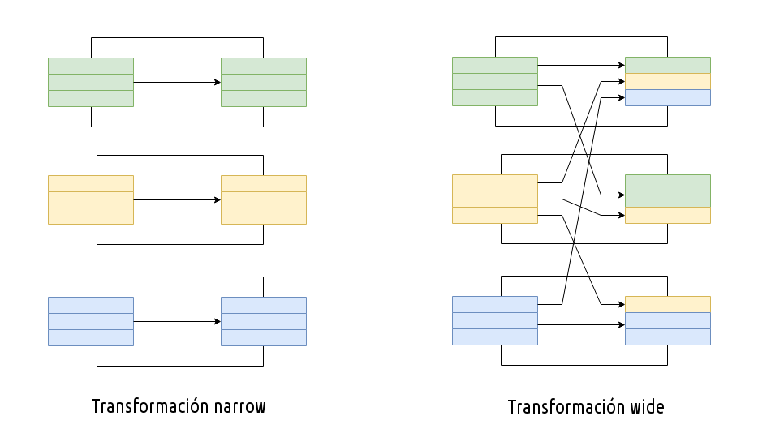

# RDD

Un [RDD](https://spark.apache.org/docs/latest/rdd-programming-guide.html#resilient-distributed-datasets-rdds) (***Resilient Distributed Datasets***) es una estructura de datos que abstrae los datos para su procesamiento en paralelo.

Antes de *Spark* 2.0, los RDD eran el interfaz principal para interactuar con los datos.

Se trata de una colección de elementos tolerantes a fallos que son immutables (una vez creados, no se pueden modificar) y diseñados para su procesamiento distribuido. Cada conjunto de datos en los RDD se divide en particiones lógicas, que se pueden calcular en diferentes nodos del clúster.

Hay dos formas de crear un RDD:

* Paralelizando una colección ya existente en nuestra aplicación *Spark*.
* Referenciando un dataset de un sistema externo como *HDFS*, *HBase*, etc...

Sobre los RDD se pueden realizar dos tipos de operaciones:

* **Acción**: devuelven un valor tras ejecutar una computación sobre el conjunto de datos.
* **Transformación**: es una operación perezosa que crea un nuevo conjunto de datos a partir de otro RDD/*Dataset*, tras realizar un filtrado, *join*, etc...

!!! warning "¿RDD obsoleto?"
    Antes de la versión 2.0, el principal interfaz para programar en *Spark* eran los RDD. Tras la versión 2.0, fueron sustituidos por los *Dataset*, que son RDD fuertemente tipados que además están optimizados a bajo nivel.
    Aunque el interfaz RDD todavía tiene soporte, sin embargo, se recomienda el uso de los *Dataset* por su mejor rendimiento.
    A lo largo de estas sesiones iremos combinando ambos interfaces para conocer las similitudes y diferencias.

## Acciones

A continuación vamos a revisar las acciones más comunes. Puedes consultar todas las acciones disponibles en la [documentación oficial](https://spark.apache.org/docs/latest/rdd-programming-guide.html#actions):

### Parallelize

Podemos crear RDD directamente desde cero sin necesidad de leer los datos desde un fichero. Para ello, a partir de un [`SparkContext`](https://spark.apache.org/docs/latest/api/python/reference/api/pyspark.SparkContext.html) podemos utilizar [`parallelize`](https://spark.apache.org/docs/latest/api/python/reference/api/pyspark.SparkContext.parallelize.html) sobre una lista.

Esta acción divide una colección de elementos entre los nodos de nuestro clústers. Por ejemplo:

``` python
miRDD = sc.parallelize([1,2,3,4,5,6,7,8,9])

lista  = ['Hola', 'Adiós', 'Hasta luego']
listaRDD = sc.parallelize(lista) # Creamos un RDD a partir de una lista
listaRDD4 = sc.parallelize(lista,4) # Creamos un RDD con 4 particiones
```

### Take y Sample

Una vez tenemos un RDD, y sobre él queremos recuperar un número determinado de resultados, de forma similar a *limit* en SQL, tenemos la acción [`take`](https://spark.apache.org/docs/latest/api/python/reference/api/pyspark.RDD.take.html):

``` python
miRDD.take(3)       # [1, 2, 3]
listaRDD.take(2)    # ['Hola', 'Adiós']
```

Otra opción es utilizar [`sample`](https://spark.apache.org/docs/latest/api/python/reference/api/pyspark.RDD.sample.html) para obtener una muestra de los datos, aunque en este caso no es una acción sino una transformación, ya que va a obtener información posiblemente de varias particiones, teniendo que barajar los datos (*shuffle*):

``` python
miRDDmuestra = miRDD.sample(False, 0.5)
miRDDmuestra.collect()  # [2, 4, 6, 7, 8, 9] / [1, 2, 3, 4, 6] / [5, 8, 9]
```

Esta transformación recibe varios parámetros:

* `withReplacement`: booleano para indicar si queremos elementos repetidos
* `fraction`: valor entre 0 y 1 que expresa la probabilidad de elegir cada elemento
* opcionalmente se le puede pasar un tercer valor con la semilla

Así pues, en el ejemplo anterior, cada llamada a *sample* ha generado un RDD diferente, sin valores repetidos, pero con un tamaño de RDD variable.

!!! tip "Muestra estratificada"
    Si necesitamos que nuestra muestra esté estratificada para que los datos no estén sesgados podemos utilizar [`sampleByKey`](https://spark.apache.org/docs/latest/api/python/reference/api/pyspark.RDD.sampleByKey.html):

    ``` python
    datos = sc.parallelize([(1, 'a'), (1, 'b'), (2, 'c'), (2, 'd'), (2, 'e'), (3, 'f')])

    # indicamos la probabilidad para cada clave
    fracciones = {1: 0.1, 2: 0.6, 3: 0.3}

    approxSample = datos.sampleByKey(False, fracciones)     # [(2, 'c'), (2, 'd')]
    ```

Para obtener una muestra mediante una acción, tenemos la opción [takeSample](https://spark.apache.org/docs/latest/api/python/reference/api/pyspark.RDD.takeSample.html) que funciona de forma similar pero sin hacer *shuffle* y devuelve una lista:

``` python
miRDDmuestraT = miRDD.takeSample(False, 5)
print(miRDDmuestraT)  # [1, 8, 9, 7, 2]
```

El primer parámetro vuelve a indicar si hay repetidos, pero el segundo fija la cantidad de elementos a devolver.

Por último, mediante [`top`](https://spark.apache.org/docs/latest/api/python/reference/api/pyspark.RDD.top.html) obtenemos los primeros elementos una vez ordenado el RDD:

``` python
miRDD.top(3)    # [9, 8, 7]
```

De forma similar, tenemos [`takeOrdered`](https://spark.apache.org/docs/latest/api/python/reference/api/pyspark.RDD.takeOrdered.html) que recupera la cantidad de registros necesarios pero ordenados ascendentemente (al contrario que `top`), con la opción de ordenarlos descendentemente (similar a `top`):

``` python
miRDD.takeOrdered(3)    # [1, 2, 3]
miRDD.takeOrdered(3, lambda x: -x)    # [9, 8, 7]
```

Hay que tener cuidado si el conjunto de datos es muy grande, porque tanto `take` como `takeSample`, `takeOrdered` y `top` llevarán todos los datos a memoria.

!!! important "Funciones lambda"
    *Spark* hace un uso extensivo de las funciones *lambda* de *Python* para simplificar el código.

    Una función *lambda* no es más que una función anónima condensada en una sola línea:

    ``` python
    # par1 y par2 son los parámetros de entrada, y expresión el código de la función
    lambda par1, par2: expresión
    ```

    Por ejemplo, si tuviéramos una función que suma dos números, podríamos hacerla en *Python* de estas dos maneras:

    ``` python
    def suma(x,y):
        return(x + y)

    sumaL = lambda x,y : x + y

    res = suma(3, 4)
    resL = sumaL(3, 4)
    ```

    A lo largo de los ejemplos de esta sesión y las siguientes nos iremos familiarizando con su uso.

### Collect

Un fallo muy posible a la hora de mostrar los datos de un RDD es utilizar `rdd.foreach(print)` o `rdd.map(print)`.

En una única máquina, esta operación generaría la salida esperada mostrando todos los elementos del RDD. Sin embargo, al trabajar en un clúster, la salida a *stdout* la realizarían los diferentes nodos y no el nodo principal.

Así pues, para mostrar todos los elementos de un *RDD*/*DataFrame*/*Dataset* hemos de emplear el método [`collect`](https://spark.apache.org/docs/latest/api/python/reference/api/pyspark.RDD.collect.html), el cual primero mostrará los RDD del nodo principal (*driver node*), y luego para cada nodo del cluster mostrará sus datos.

``` python
rdd.collect()
```

!!! caution "Out of memory"
    Hay que tener mucho cuidado, ya que nos podemos quedar fácilmente sin memoria, ya que `collect` se trae los datos de todos los ejecutores a un único nodo, el que ésta ejecutando el código (*driver*).

Si sólo necesitamos mostrar unos pocos elementos, un enfoque más seguro es utilizar `take`:

``` python
rdd.take(100)
```

## Transformaciones

En *Spark*, las estructuras de datos son inmutables, de manera que una vez creadas no se pueden modificar. Para poder modificar un *RDD/DataFrame*, hace falta realizar una [transformación](<https://spark.apache.org/docs/latest/rdd-programming-guide.html#transformations>), siendo el modo de expresar la lógica de negocio mediante *Spark*.

Todas las transformaciones en *Spark* se evalúan de manera perezosa (***lazy evaluation***), de manera que los resultados no se computan inmediatamente, sino que se retrasa el cálculo hasta que el valor sea necesario. Para ello, se van almacenando los pasos necesarios y se ejecutan únicamente cuando una acción requiere devolver un resultado al *driver*. Este diseño facilita un mejor rendimiento (por ejemplo, imagina que tras una operación *map* se realiza un *reduce* y en vez de devolver todo el conjunto de datos tras el *map*, sólo le enviamos al *driver* el resultado de la reducción).

Así pues, las acciones provocan la evaluación de todas las transformaciones previas que se habían evaluado de forma perezosa y estaban a la espera.

Por defecto, cada transformación RDD/DataSet se puede recalcular cada vez que se ejecute una acción. Sin embargo, podemos persistir un RDD en memoria mediante los métodos `persist` (o `cache`), de manera que Spark mantendrá los datos para un posterior acceso más eficiente. También podemos persistir RDD en disco o replicarlo en múltiples nodos.

### Tipos de transformaciones

Existen dos tipos de transformaciones, dependiendo de las dependencias entre las particiones de datos:

* Transformaciones ***Narrow***: consisten en dependencias *estrechas* en las que cada partición de entrada contribuye a una única partición de salida.

* Transformaciones ***Wide***: consisten en dependencias *anchas* de manera que varias particiones de entrada contribuyen a muchas otras particiones de salida, es decir, cada partición de salida depende de diferentes particiones de entrada. Este proceso también se conoce como *shuffle*, ya que *Spark* baraja los datos entre las particiones del clúster.

<figure style="align: center;">
    
    <figcaption>Transformaciones Narrow vs Wide</figcaption>
</figure>

Con las transformaciones *narrow*, *Spark* realiza un *pipeline* de las dependencias, de manera que si especificamos múltiples filtros sobre DataFrames/RDD, se realizarán todos en memoria.

Esto no sucede con las transformaciones *wide*, ya que al realizar un *shuffle* los resultados se persisten en disco.

!!! info "Cuidado con shuffle"
    Las operaciones *shuffle* son computacionalmente caras, ya que implican E/S en disco, serialización de datos y E/S en red. Para organizar los datos previos al *shuffle*, *Spark* genera un conjunto de tareas (tareas *map* para organizar los datos, y *reduce* para agregar los resultados).

    Internamente, el resultado de las tareas *map* se mantienen en memoria hasta que no caben. Entonces, se ordenan en la partición destino y se persisten en un único archivo. En la fase de reducción, las tareas leen los bloques ordenados que son relevantes.

    Las operaciones *reduceByKey* y *aggregateByKey* son de las que más memoria consumen, al tener que crear las estructuras de datos para organizar los registros en las tareas de *map*, y luego generar los resultados agregados en la de *reduce*. Si los datos no caben en memoria, *Spark* los lleva a disco, incurriendo en operaciones adicionales de E/S en disco y del recolector de basura.

A continuación veremos las diferentes transformaciones que podemos realizar con Spark.

## Transformaciones *Narrow*

Para los siguientes ejemplo, utilizaremos el siguiente fichero de [empleados.txt](../hadoop/resources/empleados.txt) que ya utilizamos en la sesión de *Hive*:

``` text title="empleados.txt"
Michael|Montreal,Toronto|Male,30|DB:80|Product:DeveloperLead
Will|Montreal|Male,35|Perl:85|Product:Lead,Test:Lead
Shelley|New York|Female,27|Python:80|Test:Lead,COE:Architect
Lucy|Vancouver|Female,57|Sales:89,HR:94|Sales:Lead
```

### Map

La transformación [`map`](https://spark.apache.org/docs/latest/api/python/reference/api/pyspark.RDD.map.html) aplica la función recibida a cada elemento del RDD, de manera que vamos a poder añadir una nueva columna, modificar una existente, etc...

Por ejemplo, si la entrada es un RDD que contiene `[1, 2, 3, 4, 5]`, al hacer `rdd.map(lambda x: x*2)` obtendríamos un nuevo RDD con `[2, 4, 6, 8, 10]`:

``` python
rdd = sc.parallelize([1, 2, 3, 4, 5])
resultRDD = rdd.map(lambda x: x*2)
resultRDD.collect()          # [2, 4, 6, 8, 10]
```

Mediante la función `textFile` podemos cargar un archivo. Supongamos que tenemos cargado en Hadoop el archivo [empleados.txt](../hadoop/resources/empleados.txt):

``` python
rddLocal = sc.textFile("empleados.txt")
rdd = sc.textFile("hdfs://iabd-virtualbox:9000/user/iabd/datos/empleados.txt") 
rdd.count()                 # 4 - cantidad de líneas
resultRDD = rdd.map(len)    # obtenemos la cantidad de caracteres cada línea
resultRDD.collect()         # [61, 52, 60, 50]
```

Si quisiéramos mostrar los datos de los empleados, podríamos recoger los datos del RDD y recorrerlo:

``` python
empleados = rdd.collect()
for empleado in empleados:
    print(empleado)
```

### FlatMap

La transformación [flatMap](https://spark.apache.org/docs/latest/api/python/reference/api/pyspark.RDD.flatMap.html) es muy similar a la anterior, pero en vez de devolver una lista con un elemento por cada entrada, devuelve una única lista deshaciendo las colecciones en elementos individuales:

``` python
rdd = sc.textFile("empleados.txt") 
resultFM = rdd.flatMap(lambda x: x.split("|"))
resultFM.collect()
```

Obtendríamos cada atributo separado y todos dentro de la misma lista:

``` json
['Michael',
 'Montreal,Toronto',
 'Male,30',
 'DB:80',
 'Product:Developer\x04Lead',
 'Will',
 'Montreal',
 'Male,35',
 'Perl:85',
 'Product:Lead,Test:Lead',
 'Shelley',
 'New York',
 'Female,27',
 'Python:80',
 'Test:Lead,COE:Architect',
 'Lucy',
 'Vancouver',
 'Female,57',
 'Sales:89,HR:94',
 'Sales:Lead']
```

### Filter

Permite filtrar los elementos que cumplen una condición mediante [`filter`](https://spark.apache.org/docs/latest/api/python/reference/api/pyspark.RDD.filter.html):

``` python
rdd = sc.parallelize([1, 2, 3, 4, 5])
resultRDD = rdd.filter(lambda x: x%2==0)
resultRDD.collect()     # [2, 4] 
```

También podemos anidar diferentes transformaciones. Para este ejemplo, vamos a crear tuplas formadas por un número y su cuadrado, y luego quitar los que no coincide el número con su cuadrado (sólo coinciden el 0 y el 1), y luego aplanarlo en una lista:

``` python
rdd10 = sc.parallelize(range(10+1))
rddPares = rdd10.map(lambda x: (x, x**2)).filter(lambda x: (x[0] != x[1])).flatMap(lambda x: x)
rddPares.collect()      # [2, 4, 3, 9, 4, 16, 5, 25, 6, 36, 7, 49, 8, 64, 9, 81, 10, 100]
```

Veamos otro ejemplo. Retomamos los datos de los empleados y si queremos filtrar los empleados que son hombres, primero separamos por las `|` y nos quedamos con el tercer elemento que contiene el sexo y la edad. A continuación, separamos por la coma para quedarnos en el sexo en la posición 0 y la edad en el 1, y comparamos con el valor deseado:

``` python
rdd = sc.textFile("empleados.txt") 
hombres = rdd.filter(lambda x: x.split("|")[2].split(",")[0] == "Male")
resultFM.collect()
```

Obteniendo:

``` json
['Michael|Montreal,Toronto|Male,30|DB:80|Product:Developer\x04Lead',
 'Will|Montreal|Male,35|Perl:85|Product:Lead,Test:Lead']
```

<!--
rdd10 = sc.parallelize(range(2, 10+1)) 
-->

### Distinct

Si utilizamos [distinct](https://spark.apache.org/docs/latest/api/python/reference/api/pyspark.RDD.distinct.html) eliminaremos los elementos repetidos:

``` python
rdd = sc.parallelize([1,1,2,2,3,4,5])
resultRDD = rdd.distinct()
resultRDD.collect()     # [4, 1, 5, 2, 3]
```

### Trabajando con conjuntos

#### Union

Mediante [`union`](https://spark.apache.org/docs/latest/api/python/reference/api/pyspark.RDD.union.html) unimos dos RDD en uno:

``` python
rdd1 = sc.parallelize([1,2,3,4])
rdd2 = sc.parallelize([5,6,7,8])
resultRDD = rdd1.union(rdd2)
resultRDD.collect()     # [1, 2, 3, 4, 5, 6, 7, 8]
```

#### Intersection

Mediante [`intersection`](https://spark.apache.org/docs/latest/api/python/reference/api/pyspark.RDD.intersection.html), obtendremos los elementos que tengan en común:

``` python
rdd1 = sc.parallelize([1,2,3,4])
rdd2 = sc.parallelize([3,4,5,6])
resultRDD = rdd1.intersection(rdd2)
resultRDD.collect()     # [3, 4]
```

#### Subtract

Mediante [`subtract`](https://spark.apache.org/docs/latest/api/python/reference/api/pyspark.RDD.subtract.html), obtendremos los elementos propios que no estén en el RDD recibido:

``` python
rdd1 = sc.parallelize([1,2,3,4])
rdd2 = sc.parallelize([3,4,5,6])
resultRDD = rdd1.subtract(rdd2)
resultRDD.collect()     # [1, 2]
```

!!! question "Autoevaluación"
    Si tenemos dos RDD (A y B):

    ``` python
    rddA = sc.parallelize([1,2,3,4])
    rddB = sc.parallelize([3,4,5,6])
    ```

    === "Enunciado"

        ¿Cómo conseguimos los elementos que están en A y no B y los de B que no están en A? (es decir `[1, 2, 5, 6]`)):

    === "Solución"

        ``` python
        resultRDD = rddA.subtract(rddB).union(rddB.subtract(rddA))
        resultRDD.collect()     # [1, 2, 5, 6]
        ```

## RDD de Pares

Una técnica muy común a la hora de trabajar con RDD es hacerlo con elementos que tienen el formato `(clave, valor)`, pudiendo las claves y los valores ser de cualquier tipo.

``` python
listaTuplas = [(1,'a'), (2,'b'), (3,'c'), (4,'d')]
rddTuplas= sc.parallelize(listaTuplas)
```

Sobre estos RDD podemos realizar algoritmos *MapReduce* para muchas funciones de procesamiento de datos, como es la agrupación, ordenación, *join*, *count*, etc...

Para generar un RDD de pares, además de crearlo nosotros a partir de una lista, podemos emplear las siguientes operaciones:

* [`zip`](https://spark.apache.org/docs/latest/api/python/reference/api/pyspark.RDD.zip.html): une dos RDDs del mismo tamaño:

    ``` python
    lista1 = ['a','b','c','e','f','g','h']
    lista2 = [4, 5, 6, 7, 8, 9, 10]
    rddZip = sc.parallelize(lista1).zip(sc.parallelize(lista2)).collect()
    # [('a', 4), ('b', 5), ('c', 6), ('e', 7), ('f', 8), ('g', 9), ('h', 10)]

    rddZipSecuencia = sc.parallelize(zip(lista1,range(len(lista1)))) # usando el tamaño de la lista
    # [('a', 0), ('b', 1), ('c', 2), ('e', 3), ('f', 4), ('g', 5), ('h', 6)]
    ```

    Otros métodos relacionados son [zipWithIndex](https://spark.apache.org/docs/latest/api/python/reference/api/pyspark.RDD.zipWithIndex.html) y [zipWithUniqueId](https://spark.apache.org/docs/latest/api/python/reference/api/pyspark.RDD.zipWithUniqueId.html).

* `map`: asignando a cada elemento un valor o cálculo sobre él mismo:

    ``` python
    lista  = ['Hola', 'Adiós', 'Hasta luego']
    rddMap = sc.parallelize(lista).map(lambda x: (x, len(x)))
    # [('Hola', 4), ('Adiós', 5), ('Hasta luego', 11)]
    ```

* `keyBy`: permite crear las claves a partir de cada elemento:

    ``` python
    rddKeyBy = sc.parallelize(lista).keyBy(lambda x: x[0])  # creamos una clave con la primera letra
    # [('H', 'Hola'), ('A', 'Adiós'), ('H', 'Hasta luego')]
    ```

!!! question "Autoevaluación"

    A partir de la lista `"Perro Gato Loro Pez León Tortuga Gallina"`

    === "Enunciado"

        1. Crea un RDD a partir de esta lista
        2. Convierte el RDD normal en un RDD de pares cuya clave sea la primera letra del animal
        3. Crea otro RDD de pares pero poniendo como clave un número incremental
        4. ¿Y si queremos que el índice incremental empiece en 100?

    === "Solución"

        ``` python
        animales = "Perro Gato Loro Pez León Tortuga Gallina"
        animalesLista = animales.split(" ")
        rdd1 = sc.parallelize(animalesLista)
        rdd2 = rdd1.keyBy(lambda x: x[0])
        rdd3 = sc.parallelize(zip(range(len(animalesLista)), animalesLista))
        rdd4 = sc.parallelize(zip(range(100,100+len(animalesLista)), animalesLista))
        ```

Sobre los RDD de pares, podemos realizar las siguientes transformaciones:

* [`keys`](https://spark.apache.org/docs/latest/api/python/reference/api/pyspark.RDD.keys.html): devuelve las claves
* [`values`](https://spark.apache.org/docs/latest/api/python/reference/api/pyspark.RDD.values.html): devuelve los valores
* [`mapValues`](https://spark.apache.org/docs/latest/api/python/reference/api/pyspark.RDD.mapValues.html): Aplica la función sobre los valores
* [`flatMapValues`](https://spark.apache.org/docs/latest/api/python/reference/api/pyspark.RDD.flatMapValues.html) Aplica la función sobre los valores y los aplana.

A continuación se muestra un fragmento de código para poner en práctica las transformaciones comentadas:

```  python
listaTuplas = [('a',1), ('z',3), ('b',4), ('c',3), ('a',4)]
rddTuplas = sc.parallelize(listaTuplas)

claves = rddTuplas.keys()       # ['a', 'z', 'b', 'c', 'a']
valores = rddTuplas.values()    # [1, 3, 4, 3, 4]

rddMapValues = rddTuplas.mapValues(lambda x: (x,x*2))
# [('a', (1, 2)), ('z', (3, 6)), ('b', (4, 8)), ('c', (3, 6)), ('a', (4, 8))]
rddFMV = rddTuplas.flatMapValues(lambda x: (x,x*2))
# [('a', 1),
#  ('a', 2),
#  ('z', 3),
#  ('z', 6),
#  ('b', 4),
# ...
```

## Transformaciones *Wide*

Las siguientes transformaciones, además de trabajar con RDD de pares, mezclan los datos de las particiones mediante el *shuffle* de los elementos.

Para los siguientes ejemplos, utilizaremos un fichero de ventas [pdi_sales.csv](resources/pdi_sales.csv) (versión extendida) / [pdi_sales_small.csv](resources/pdi_sales_small.csv) (versión reducida) el cual tiene el siguiente formato:

``` csv title="pdi_sales.csv"
ProductID;Date;Zip;Units;Revenue;Country
725;1/15/1999;41540          ;1;115.5;Germany
787;6/6/2002;41540          ;1;314.9;Germany
...
```

### ReduceByKey

Mediante la transformación [reducedByKey](https://spark.apache.org/docs/latest/api/python/reference/api/pyspark.RDD.reduceByKey.html) los datos se calculan utilizando una función de reducción a partir de la clave combinando en la misma máquina las parejas con la misma clave antes de que los datos se barajen.

Vamos a comenzar con un ejemplo sencillo, contando cuantas ventas se han realizado en cada país, o lo que es lo mismo, las veces que aparece cada palabra en el fichero:

``` python
rdd = sc.textFile("pdi_sales_small.csv")
# Recogemos el país y las unidades de las ventas
parPais1 = rdd.map(lambda x: (x.split(";")[-1].strip(), 1))
# parPais1.collect()
# [('Country', 1),
#  ('Germany', 1),
#  ('Germany', 1),
#  ('Germany', 1), ...
```

Hemos creado un RDD de pares compuesto por el nombre del país y el número uno, para luego en la fase de reducción sumar estos valores. Pero si nos fijamos, el archivo csv contiene el encabezado con los datos, el cual debemos quitar:

``` python
header = parPais1.first()
parPais1SinHeader = parPais1.filter(lambda linea: linea != header)
# parPais1SinHeader.collect()
# [('Germany', 1),
#  ('Germany', 1),
#  ('Germany', 1), ...
```

Y finalmente, ya podemos reducir por la clave:

``` python
paisesTotal = parPais1SinHeader.reduceByKey(lambda a,b: a+b)
# paisesTotal.collect()
# [('Mexico', 30060), ('France', 30060), ('Germany', 30059), ('Canada', 30060)]
```

!!! tip "Funciones lambda en reduce"
    Al aplicar una transformación de tipo *reduce*, la función *lambda* recibirá dos parámetros, siendo el primero el valor acumulado y el segundo el valor del elemento a operar.

Veamos otro ejemplo, en este caso vamos a calcular el total de unidades vendidas por país, de manera que vamos a coger el nombre del país (*Country*) y las unidades (*Units*) vendidas:

``` python
rdd = sc.textFile("pdi_sales_small.csv")
# Recogemos el país y las unidades de las ventas
paisesUnidades = rdd.map(lambda x: (x.split(";")[-1].strip(), x.split(";")[3]))
# Le quitamos el encabezado
header = paisesUnidades.first()
paisesUnidadesSinHeader = paisesUnidades.filter(lambda linea: linea != header)
# Pasamos las unidades a un número entero
paisesUnidadesInt = paisesUnidadesSinHeader.map(lambda x: (x[0], int(x[1])))
# Reducimos por el país y sumamos las unidades
paisesTotalUnidades = paisesUnidadesInt.reduceByKey(lambda a,b: a+b)
paisesTotalUnidades.collect()
```

Y el resultado:

``` json
[('Mexico', 31095), ('France', 31739), ('Germany', 31746), ('Canada', 31148)]
```

!!! question "Autoevaluación"

    Dada la siguiente lista de compra:

    ``` python
    lista = [('pan',3), ('agua',2), ('azúcar',1), ('leche',2), ('pan',1), ('cereales',3), ('agua',0.5), ('leche',2), ('filetes',5)]
    ```

    === "Enunciado"

        Calcula:

        1. El total que se ha gastado por cada producto
        2. Cuánto es lo máximo que se ha pagado por cada producto

    === "Solución"

        ``` python
        lista = [('pan',3), ('agua',2), ('azúcar',1), ('leche',2), ('pan',1), ('cereales',3), ('agua',0.5), ('leche',2), ('filetes',5)]
        rdd = sc.parallelize(lista)
        rdd1 = rdd.reduceByKey(lambda x,y: x+y)
        rdd2 = rdd.reduceByKey(lambda x,y: max(x,y))
        ```

### GroupByKey

Permite agrupar los datos a partir de una clave, repartiendo los resultados (*shuffle*) entre todos los nodos:

``` python
rdd = sc.textFile("pdi_sales_small.csv")
# Creamos un RDD de pares con el nombre del país como clave, y una lista con los valores
ventas = rdd.map(lambda x: (x.split(";")[-1].strip(), x.split(";")))
# Quitamos el primer elemento que es el encabezado del CSV
header = paisesUnidades.first()
paisesUnidadesSinHeader = paisesUnidades.filter(lambda linea: linea != header)
# Agrupamos las ventas por nombre del país
paisesAgrupados = ventas.groupByKey()
paisesAgrupados.collect()
```

Obtendremos para cada país, un iterable con todos sus datos:

``` json
[('Canada', <pyspark.resultiterable.ResultIterable at 0x7f814cd4b2e0>),
 ('France', <pyspark.resultiterable.ResultIterable at 0x7f816c3a9700>),
 ('Germany', <pyspark.resultiterable.ResultIterable at 0x7f814cd96eb0>),
 ('Mexico', <pyspark.resultiterable.ResultIterable at 0x7f814cd965e0>)]
```

Podemos transformar los iterables a una lista:

``` python
paisesAgrupadosLista = paisesAgrupados.map(lambda x: (x[0], list(x[1])))
paisesAgrupadosLista.collect()
```

Obteniendo:

``` json
[('Canada ',
  [['725', '1/15/1999', 'H1B            ', '1', '115.4', 'Canada '],
   ['2235', '1/15/1999', 'H1B            ', '2', '131.1', 'Canada '],
   ['713', '1/15/1999', 'H1B            ', '1', '160.1', 'Canada '],
   ...
```

!!! question "Autoevaluación"

    Ahora tenemos las cuentas de las compras de 3 días:

    * día 1: pan 3€, agua 2€, azúcar 1€, leche 2€, pan 4€
    * día 2: pan 1€, cereales 3€, agua 0.5€, leche 2€, filetes 5€
    * día 3: filetes 2€, cereales 1€


    Dada la siguiente lista de compra:

    ``` python
    dia1 = [('pan',3), ('agua',2), ('azúcar',1), ('leche',2), ('pan',4)]
    dia2 = [('pan',1), ('cereales',3), ('agua',0.5), ('leche',2), ('filetes',5)]
    dia3 = [('filetes',2), ('cereales',1)]
    ```

    === "Enunciado"

        1. ¿Cómo obtenemos lo que hemos gastado en cada producto?
        2. ¿Y el gasto medio que hemos realizado en cada uno de ellos?

    === "Solución"

        ``` python
        dia1 = [('pan',3), ('agua',2), ('azúcar',1), ('leche',2), ('pan',4)]
        dia2 = [('pan',1), ('cereales',3), ('agua',0.5), ('leche',2), ('filetes',5)]
        dia3 = [('filetes',2), ('cereales',1)]

        rdd = sc.parallelize(dia1).union(sc.parallelize(dia2)).union(sc.parallelize(dia3))
        rdd1=rdd.groupByKey()
        # [('leche', <pyspark.resultiterable.ResultIterable at 0x7f3494aea130>),
        #  ('agua', <pyspark.resultiterable.ResultIterable at 0x7f3494acd4c0>),
        #  ('pan', <pyspark.resultiterable.ResultIterable at 0x7f3494acd2b0>),
        #  ('cereales', <pyspark.resultiterable.ResultIterable at 0x7f3494acd850>),
        #  ('filetes', <pyspark.resultiterable.ResultIterable at 0x7f34944e3be0>),
        #  ('azúcar', <pyspark.resultiterable.ResultIterable at 0x7f34944e3fa0>)]

        rdd1a = [(x,list(y)) for x,y in rdd1.collect()]
        # rdd1a ya no es un RDD, es una lista que se ha cargado en el driver
        rdd1b = rdd1.map(lambda x: (x[0], list(x[1])))
        #rdd1b sigue siendo un RDD
        # [('leche', [2, 2]),
        #  ('agua', [2, 0.5]),
        #  ('pan', [3, 4, 1]),
        #  ('cereales', [3, 1]),
        #  ('filetes', [5, 2]),
        #  ('azúcar', [1])]

        rdd2 = rdd1.map(lambda x: (x[0], sum(x[1])/len(x[1])))
        # [('leche', 2.0),
        #  ('agua', 1.25),
        #  ('pan', 2.6666666666666665),
        #  ('cereales', 2.0),
        #  ('filetes', 3.5),
        #  ('azúcar', 1.0)]
        ```

!!! tip "Mejor `reduceByKey` que `groupByKey`"
    Si el tipo de operación a realizar es posible mediante una operación de *reduce*, su rendimiento será una solución más eficiente. Más información en el artículo [Avoid Group By](https://databricks.gitbooks.io/databricks-spark-knowledge-base/content/best_practices/prefer_reducebykey_over_groupbykey.html)

### SortByKey

[sortByKey](https://spark.apache.org/docs/latest/api/python/reference/api/pyspark.RDD.sortByKey.html) permite ordenar los datos a partir de una clave. Los pares de la misma máquina se ordenan primero por la misma clave, y luego los datos de las diferentes particiones se barajan.

Para ello crearemos una tupla, siendo el primer elemento un valor numérico por el cual ordenar, y el segundo el dato asociado.

Vamos a partir del ejemplo anterior para ordenar los paises por la cantidad de ventas:

``` python
# Ejemplo anterior
rdd = sc.textFile("pdi_sales.csv")
paisesUnidades = rdd.map(lambda x: (x.split(";")[-1].strip(), x.split(";")[3]))
header = paisesUnidades.first()
paisesUnidadesSinHeader = paisesUnidades.filter(lambda linea: linea != header)
paisesTotalUnidades = paisesUnidadesSinHeader.reduceByKey(lambda a,b: int(a)+int(b))

# Le damos la vuelta a la lista
unidadesPaises = paisesTotalUnidades.map(lambda x: (x[1],x[0]))
unidadesPaises.collect()
```

Ahora tendríamos:

``` json
[(77609, 'Canada'),
 (327730, 'France'),
 (244265, 'Germany'),
 (223463, 'Mexico')]
```

Y a continuación los ordenamos:

``` python
unidadesPaisesOrdenadas = unidadesPaises.sortByKey()
unidadesPaisesOrdenadas.collect()
```

Y comprobamos el resultado:

``` json
[(77609, 'Canada'),
 (223463, 'Mexico'),
 (244265, 'Germany'),
 (327730, 'France')]
```

Si quisiéramos obtener los datos en orden descendente, le pasamos `False` a la transformación:

``` python
unidadesPaisesOrdenadasDesc = unidadesPaises.sortByKey(False)
```

### SortBy

Mediante [sortBy](https://spark.apache.org/docs/latest/api/python/reference/api/pyspark.RDD.sortBy.html) podemos ordenar los datos indicando nosotros la función de ordenación:

``` python
paisesTotalUnidades.sortBy(lambda x: x[1]).collect()
```

Obteniendo:

``` json
[('Canada', 77609),
 ('Mexico', 223463),
 ('Germany', 244265),
 ('France', 327730)]
```

Si queremos ordenar descendentemente, le pasamos un segundo parámetro con valor `False` (indica si la ordenación es ascendente):

``` python
paisesTotalUnidades.sortBy(lambda x: x[1], False).collect()
```

!!! info "Join"
    Aunque los RDD permitan realizar operaciones *join*, realmente este tipo de operaciones se realizan mediante *DataFrames*, por lo que omitimos su explicación en esta sesión y la dejamos para la siguiente.

## Particiones

*Spark* organiza los datos en particiones, considerándolas divisiones lógicas de los datos entre los nodos del clúster. Por ejemplo, si el almacenamiento se realiza en HDFS, cada partición se asigna a un bloque.

Cada una de las particiones va a llevar asociada una tarea de ejecución, de manera que a más particiones, mayor paralelización del proceso.

Veamos con código como podemos trabajar con las particiones:

``` python
rdd = sc.parallelize([1,1,2,2,3,3,4,5])
rdd.getNumPartitions() # 4
rdd = sc.parallelize([1,1,2,2,3,3,4,5], 2)
rdd.getNumPartitions() # 2

rddE = sc.textFile("empleados.txt")
rddE.getNumPartitions() # 2
rddE = sc.textFile("empleados.txt", 3)
rddE.getNumPartitions() # 3
```

La mayoría de operaciones / transformaciones / acciones que trabajan con los datos admiten un parámetro extra indicando la cantidad de particiones con las que queremos trabajar.

<!--
FIXME: revisar <https://techmagie.wordpress.com/2015/12/19/understanding-spark-partitioning/> y <https://www.projectpro.io/article/how-data-partitioning-in-spark-helps-achieve-more-parallelism/297>
-->

### MapPartitions

A diferencia de la transformación `map` que se invoca por cada elemento del RDD/DataSet, [`mapPartitions`](https://spark.apache.org/docs/latest/api/python/reference/api/pyspark.RDD.mapPartitions.html) se llama por cada partición.

La función que recibe como parámetro recogerá como entrada un iterador con los elementos de cada partición:

``` python
rdd = sc.parallelize([1,1,2,2,3,3,4,5], 2)

def f(iterator): yield sum(iterator)
resultadoRdd = rdd.mapPartitions(f)
resultadoRdd.collect()  # [6, 15]

resultadoRdd2 = rdd.mapPartitions(lambda iterator: [list(iterator)])
resultadoRdd2.collect() # [[1, 1, 2, 2], [3, 3, 4, 5]]
```

En el ejemplo, ha dividido los datos en dos particiones, la primera con `[1, 1, 2, 2]` y la otra con `[3, 3, 4, 5]`, y de ahí el resultado de sumar sus elementos es `[6, 15]`.

<!--
FIXME: revisar <https://www.mytechmint.com/pyspark-mappartitions/> y <https://sparkbyexamples.com/pyspark/pyspark-mappartitions/>
-->

### mapPartitionsWithIndex

De forma similar al caso anterior, pero ahora [`mapPartitionsWithIndex`](https://spark.apache.org/docs/latest/api/python/reference/api/pyspark.RDD.mapPartitionsWithIndex.html) recibe una función cuyos parámetros son el índice de la partición y el iterador con los datos de la misma:

``` python
def mpwi(indice, iterador):
    return [(indice, list(iterador))]

resultadoRdd = rdd.mapPartitionsWithIndex(mpwi)
resultadoRdd.collect()
# [(0, [1, 1, 2, 2]), (1, [3, 3, 4, 5])]
```

### Modificando las particiones

Podemos modificar la cantidad de particiones mediante dos transformaciones *wide*: `coalesce` y `repartition`.

Mediante [`coalesce`](https://spark.apache.org/docs/latest/api/python/reference/api/pyspark.RDD.coalesce.html) podemos obtener un nuevo RDD con la cantidad de particiones a reducir:

``` python
rdd = sc.parallelize([1,1,2,2,3,3,4,5], 3)
rdd.getNumPartitions() # 3
rdd1p = rdd.coalesce(1)
rdd1p.getNumPartitions() # 2
```

En cambio, mediante [`repartition`](https://spark.apache.org/docs/latest/api/python/reference/api/pyspark.RDD.repartition.html) podemos obtener un nuevo RDD con la cantidad exacta de particiones deseadas (al reducir las particiones, `repartition` realiza un *shuffle* para redistribuir los datos, por lo tanto, si queremos reducir la cantidad de particiones, es más eficiente utilizar *coalesce*):

``` python
rdd = sc.parallelize([1,1,2,2,3,3,4,5], 3)
rdd.getNumPartitions() # 3
rdd2p = rdd.repartition(2)
rdd2p.getNumPartitions() # 2
```

<!--
## Acumuladores y Broadcast

accumulators to aggregate information and broadcast variables to efficiently distribute large values

broadcast variables, allows the program to efficiently send a large, read-only value to all the worker nodes for use in one or more Spark operations. They come in handy, for example, if your application needs to send a large, read-only lookup table to all the nodes, or even a large feature vector in a machine learning algorithm.

``` python
import sys
from pyspark.sql import SparkSession

spark = SparkSession.builder.appName("app1").getOrCreate()

# Broadcast
broadcastVar = spark.sparkContext.broadcast([1, 2, 3])

print("")
print( broadcastVar.value )
print("")

# Accumulador
accum = spark.sparkContext.accumulator(0)
sumatorioError = 0

def myFunc(x):
  global sumatorioError
  
  accum.add(x)
  sumatorioError+=x
 
rdd=spark.sparkContext.parallelize([1,2,3,4,5])
rdd.foreach( myFunc )

print("")
print( accum )
print( sumatorioError )
print("")
```
-->

## Referencias

* [Documentación oficial de Apache Spark](https://spark.apache.org/docs/latest/)
* [RDD Programming Guide](https://spark.apache.org/docs/latest/rdd-programming-guide.html)
* [Learning Apache Spark, 2nd Edition](https://www.oreilly.com/library/view/learning-spark-2nd/9781492050032/)
* [Spark RDD Cheatsheet en PDF](http://datacamp-community-prod.s3.amazonaws.com/acfa4325-1d43-4542-8ce4-bea2d287db10) y en [formato web](https://www.datacamp.com/blog/pyspark-cheat-sheet-spark-in-python)
* Repositorio GitHub con [apuntes sobre Spark de Vivek Bombatkar](https://github.com/vivek-bombatkar/MyLearningNotes/tree/master/spark)
* [Learning Apache Spark with Python](https://runawayhorse001.github.io/LearningApacheSpark/index.html)

## Actividades

(RA5074.1 / CE4.1b) En las siguientes actividades vamos a familiarizarnos con el uso de Spark con RDD y las diferentes acciones y transformaciones disponibles.

1. (1p) A partir de la lista siguiente `['Alicante','Elche','Valencia','Madrid','Barcelona','Bilbao','Sevilla']`:

    1. Almacena sólo las ciudades que tengan la letra `e` en su nombre y muéstralas.
    2. Muestra las ciudades que tienen la letra `e` y el número de veces que aparece en cada nombre. Por ejemplo `('Elche', 2)`.
    3. Averigua las ciudades que solo tengan una única `e`.
    4. Nos han enviado una nueva lista pero no han separado bien las ciudades. Reorganiza la lista y colocalas correctamente, y cuenta las apariciones de la letra `e` de cada ciudad.
    `ciudades_mal = [['Alicante.Elche','Valencia','Madrid.Barcelona','Bilbao.Sevilla'],['Murcia','San Sebastián','Melilla.Aspe']]`

2. (1p) A partir de las siguientes listas:

    * Inglés: `hello, table, angel, cat, dog, animal, chocolate, dark, doctor, hospital, computer`
    * Español: `hola, mesa, angel, gato, perro, animal, chocolate, oscuro, doctor, hospital, ordenador`

    Una vez creado un RDD con tuplas de palabras y su traducción (puedes usar `zip` para unir dos listas):

    ``` python
    [('hello', 'hola'),
     ('table', 'mesa'),
     ('angel', 'angel'),
     ('cat', 'gato')...
    ```

    Averigua:

    1. Palabras que se escriben igual en inglés y en español
    2. Palabras que en español son distintas que en inglés
    3. Obtén una única lista con las palabras en ambos idiomas que son distintas entre ellas (`['hello', 'hola', 'table', ...`)
    4. Haz dos grupos con todas las palabras, uno con las que empiezan por vocal y otro con las que empiecen por consonante.

3. (0.75p) A partir del fichero de [El Quijote](resources/el_quijote.txt):

    1. Crear un RDD a partir del fichero y crea una lista con todas las palabras del documento.
    2. ¿Cuantas veces aparece la palabra `Dulcinea` (independientemente de si está en mayúsculas o minúsculas)? ¿Y `Rocinante`? (86 y 120 ocurrencias respectivamente)
    3. Devuelve una lista ordenada según el número de veces que sale cada palabra de más a menos (las primeras ocurrencias deben ser `[('que', 10731), ('de', 9035), ('y', 8668), ('la', 5014), ...`).
    4. Almacena el resultado en HDFS en  `/user/iabd/spark/wcQuijote` (investiga el método [`saveAsTextFile`](https://spark.apache.org/docs/latest/api/python/reference/api/pyspark.RDD.saveAsTextFile.html)).

4. (0.75p) Dada una cadena que contiene una lista de nombres `Juan, Jimena, Luis, Cristian, Laura, Lorena, Cristina, Jacobo, Jorge`, una vez transformada la cadena en una lista y luego en un RDD:

    1. Agrúpalos según su inicial, de manera que tengamos tuplas formadas por la letra inicial y todos los nombres que comienzan por dicha letra:

        ``` python
        [('J', ['Juan', 'Jimena', 'Jacobo', 'Jorge']),
        ('L', ['Luis', 'Laura', 'Lorena']),
        ('C', ['Cristian', 'Cristina'])]
        ```

    2. De la lista original, obtén una muestra de 5 elementos sin repetir valores.
    3. Devuelve una muestra de datos de aproximadamente la mitad de registros que la lista original con datos que pudieran llegar a repetirse.

5. (0.5p) Dada una lista de elementos desordenados y algunos repetidos, devolver una muestra de 5 elementos, que estén en la lista, sin repetir y ordenados descendentemente.

    ``` python
    lista = 4,6,34,7,9,2,3,4,4,21,4,6,8,9,7,8,5,4,3,22,34,56,98
    ```

    1. Selecciona el elemento mayor de la lista resultante.
    2. Muestra los dos elementos menores.

6. (0.5p) En una red social sobre cine, tenemos un fichero [ratings.txt](resources/ratings.txt) compuesta por el código de la película, el código del usuario, la calificación asignada y el *timestamp* de la votación con el siguiente formato:

    ``` text
    1::1193::5::978300760
    1::661::3::978302109
    1::914::3::978301968
    ```

    Se pide crear dos script en *Python*, así como los comandos necesarios para ejecutarlos (mediante `spark-submit`) para:

    1. Obtener para cada película, la nota media de todas sus votaciones.
    2. Películas cuya nota media sea superior a 3.

## Proyecto

A continuación planteamos el siguiente proyecto para realizar en clase:

1. (1.5 ptos) Tenemos las calificaciones de las asignaturas de [matemáticas](resources/notas_mates.txt), [inglés](resources/notas_ingles.txt) y [física](resources/notas_fisica.txt) de los alumnos del instituto en 3 documentos de texto. A partir de estos ficheros:

    1. Crea 3 RDD de pares, uno para cada asignatura, con los alumnos y sus notas
    2. Crea un solo RDD con todas las notas
    3. ¿Cuál es la nota más baja que ha tenido cada alumno?
    4. ¿Cuál es la nota media de cada alumno?
    5. ¿Cuantos estudiantes suspende cada asignatura?  
    `[('Mates', 7), ('Física', 8), ('Inglés', 7)]`
    6. ¿En qué asignatura suspende más gente?
    7. Total de notables o sobresalientes por alumno, es decir, cantidad de notas superiores o igual a 7.
    8. ¿Qué alumno no se ha presentado a inglés?
    9. ¿A cuántas asignaturas se ha presentado cada alumno?
    10. Obtén un RDD con cada alumno con sus notas

*[RA5074.1]: Aplica técnicas de análisis de datos que integran, procesan y analizan la información, adaptando e implementando sistemas que las utilicen.
*[CE4.1b]: Se ha extraído de forma automática información y conocimiento a partir de grandes volúmenes de datos.

<!--
https://github.com/PacktPublishing/Apache-Spark-3-for-Data-Engineering-and-Analytics-with-Python-/blob/main/Section%203%20Resources/XYZ%20Research.txt
-->

<!--
* Procesamiento de mensajes con Apache Kafka
* Captura de datos con Apache Flume
* Integración de Apache Flume y Apache Kafka
-->

<!--
<https://www.analyticsvidhya.com/blog/2021/10/a-comprehensive-guide-to-apache-spark-rdd-and-pyspark/>
<https://donnemartin.com/apache-spark-tutorial.html>
-->

<!--
A RDD acts like a graph of transformational pointers, so in the case of a partial failure, the RDD representing a specific phase of processing can be recomputed efficiently. The RDD itself stores no physical data, simply metadata, making it a means to coordinate data processing across a distributed cluster of network connected computers
-->