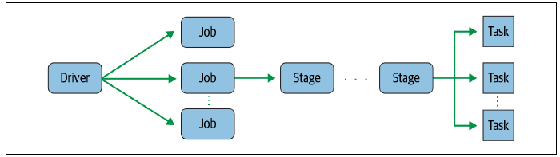

# Spark

La analítica de datos es el proceso de inspeccionar, limpiar, transformar y modelar los datos con el objetivo de descubrir información útil, obtener conclusiones sobre los datos y ayudar en la toma de decisiones.

Para ello, el uso de *Spark* de la mano de *Python*, *NumPy* y *Pandas* como interfaz de la analítica es clave en el día a día de un científico/ingeniero de datos.

Podemos considerar *Spark* como una navaja suiza, ya que permite trabajar con todo el ciclo del datos, desde la ingesta y la validación de los datos en *raw*, limpieza, transformación y agregación de los datos, así como la realización de un análisis exploratorio de los mismos.

La versión 3.0 de [*Apache Spark*](https://spark.apache.org) se lanzó en 2020, diez años después de su nacimiento. Esta versión incluye mejoras de rendimiento (el doble en consultas adaptativas), facilidad en el uso del API de Pandas, un nuevo interfaz gráfico para el streaming que facilita el seguimiento y depuración de las consultas y ajustes de rendimiento.

En la actualidad ya vamos por la versión 3.3.1 (a diciembre de 2022).

## Introducción

<figure style="float: right;">
    
    <figcaption>Logo de Apache Spark</figcaption>
</figure>

*Spark* es un framework de computación distribuida similar a *Hadoop-MapReduce* (así pues, *Spark* no es un lenguaje de programación), pero que en vez de almacenar los datos en un sistema de ficheros distribuidos o utilizar un sistema de gestión de recursos, lo hace en memoria. El hecho de almacenar en memoria los cálculos intermedios implica que sea mucho más eficiente que *MapReduce*.

En el caso de tener la necesidad de almacenar los datos o gestionar los recursos, se apoya en sistemas ya existentes como *HDFS*, *YARN* o *Apache Mesos*. Por lo tanto, *Hadoop* y *Spark* son sistemas complementarios.

El diseño de *Spark* se basa principalmente en cuatro características:

* ^^Velocidad^^: enfocado al uso en un clúster de *commodity hardware* con una gestión eficiente del multihilo y procesamiento paralelo. *Spark* construye sus consultas mediante un grafo dirigido acíclico (DAG) y utiliza un planificador para descomponer el grafo en tareas que se ejecutan en paralelo en los nodos de los clústers. Finalmente, utiliza un motor de ejecución (*Tungsten*) que genera código compacto para optimizar la ejecución. Todo ello teniendo en cuenta que los resultados intermedios se almacenan en memoria.
* ^^Facilidad de uso^^: *Spark* ofrece varias capas de abstracción sobre los datos, como son los *RDD*, *DataFrames* y *Dataset*. Al ofrecer un conjunto de transformaciones y acciones como operaciones de su API, *Spark* facilita el desarrollo de aplicaciones *Big data*.
* ^^Modularidad^^: soporte para todo tipo de cargas mediante cualquiera de los lenguajes de programación soportados: *Scala*, *Java*, *Python*, *SQL* y *R*, así como los módulos de *Spark SQL* para consultas interactivas, *Spark Structured Streaming* para procesamiento de datos en *streaming*, *Spark MLlib* para *machine learning* y *GraphX* para trabajar con grafos. De esta manera, mediante una única aplicación *Spark* se puede hacer todo sin necesidad de utilizar APIs separadas.
* ^^Extensibilidad^^: Al centrarse unicamente en el procesamiento, la gestión de los datos se puede realizar a partir de *Hadoop*, *Cassandra*, *HBase*, *MongoDB*, *Hive* o cualquier SGBD relacional, haciendo todo en memoria. Además, se puede extender el API para utilizar otras fuentes de datos, como *Apache Kafka*, *Amazon S3* o *Azure Storage*.

En términos de flexibilidad, Spark ofrece un *stack* unificado que permite resolver múltiples tipos de procesamiento de datos, tanto aplicaciones *batch* como consultas interactivas, algoritmos de *machine learning* que requieren muchas iteraciones, aplicaciones de ingesta en *streaming* con rendimiento cercado al tiempo real, etc... Antes de *Spark*, para cada uno de estos tipos de procesamiento necesitábamos una herramienta diferente, ahora con Spark tenemos una *bala de plata* que reduce los costes y recursos necesarios.

### Spark vs Hadoop

La principal diferencia es que la computación se realiza en memoria, lo que puede implicar un mejora de hasta 100 veces mejor rendimiento. Para ello, se realiza una evaluación perezosa de las operaciones, de manera, que hasta que no se realiza una operación, los datos realmente no se cargan.

Para solucionar los problemas asociados a *MapReduce*, Spark crea un espacio de memoria RAM compartida entre los ordenadores del clúster. Este permite que los *NodeManager*/*WorkerNode* compartan variables (y su estado), eliminando la necesidad de escribir los resultados intermedios en disco. Esta zona de memoria compartida se traduce en el uso de RDD, *DataFrames* y *DataSets*, permitiendo realizar procesamiento en memoria a lo largo de un clúster con tolerancia a fallos.

### Stack unificado

El elemento principal es ***Spark Core*** el cual aporta toda la funcionalidad necesaria para preparar y ejecutar las aplicaciones distribuidas, gestionando la planificación y tolerancia a fallos de las diferentes tareas. Para ello, el núcleo ofrece un entorno *NoSQL* idóneo para el análisis exploratorio e interactivo de los datos. *Spark* se puede ejecutar en *batch* o en modo interactivo y tiene soporte para *Python*. Independientemente del lenguaje utilizado (ya sea *Python*, *Java*, *Scala*, *R* o *SQL*) el código se despliega entre todos los nodos a lo largo del clúster.

Además, contiene otros 4 grandes componentes construidos sobre el *core*:

<figure style="align: center;">
    
    <figcaption>Componentes de Spark</figcaption>
</figure>

1. ***Spark Streaming*** es una herramienta para la creación de aplicaciones de procesamiento en *streaming* que ofrece un gran rendimiento con soporte para la tolerancia a fallos. Los datos pueden venir desde fuentes de datos tan diversas como *Kafka*, *Flume*, *Twitter* y tratarse en tiempo real.
2. ***Spark SQL*** ofrece un interfaz SQL para trabajar con *Spark*, permitiendo la lectura de datos tanto de una tabla de cualquier base de datos relacional como de ficheros con formatos estructurados (*CSV*, texto, *JSON*, *Avro*, *ORC*, *Parquet*, etc...) y construir tablas permanentes o temporales en *Spark*. Tras la lectura, permite combinar sentencias SQL para trabajar con los datos y cargar los resultados en un *DataFrame de Spark*.

    Por ejemplo, con este fragmento leemos un fichero JSON desde nuestro sistema de almacenamiento, creamos una tabla temporal y mediante una consulta SQL cargamos los datos en un *DataFrame* de *Spark*:

    ``` python
    df_zips = spark.read.csv("zips.json")
    df_zips.createOrReplaceTempView("zips")
    df_resultado = spark.sql("""SELECT city, state
        FROM zips WHERE pop > 10000
        ORDER BY pop DESC""")
    ```

3. ***Spark MLlib*** es un módulo de *machine learning* que ofrece la gran mayoría de algoritmos de ML y permite construir *pipelines* para el entrenamiento y evaluación de los modelos IA.
4. ***GraphX*** permite procesar estructuras de datos en grafo, siendo muy útiles para recorrer las relaciones de una red social u ofrecer recomendaciones sobre gustos/afinidades. En este curso no vamos a entrar en detalle en este módulo.

Además, la comunidad de *Spark* dispone de un gran número de conectores para diferentes fuentes de datos, herramientas de monitorización, etc... que conforman su propio ecosistema:

<figure style="align: center;">
    
    <figcaption>Ecosistema de Spark</figcaption>
</figure>

## Puesta en Marcha

En nuestra máquina virtual, únicamente necesitamos ejecutar el comando `pyspark` el cual arrancará directamente un cuaderno *Jupyter*:

``` bash
iabd@iabd-virtualbox:~/Spark$ pyspark
[I 16:50:57.168 NotebookApp] Serving notebooks from local directory: /home/iabd/Spark
[I 16:50:57.168 NotebookApp] The Jupyter Notebook is running at:
[I 16:50:57.168 NotebookApp] http://localhost:8888/?token=b7b4c7232e5d9d3f7c7fdd51d75e5fe314c3f2c637e90652
[I 16:50:57.168 NotebookApp]  or http://127.0.0.1:8888/?token=b7b4c7232e5d9d3f7c7fdd51d75e5fe314c3f2c637e90652
[I 16:50:57.168 NotebookApp] Use Control-C to stop this server and shut down all kernels (twice to skip confirmation).
[C 16:50:57.968 NotebookApp] 
    
    To access the notebook, open this file in a browser:
        file:///home/iabd/.local/share/jupyter/runtime/nbserver-9654-open.html
    Or copy and paste one of these URLs:
        http://localhost:8888/?token=b7b4c7232e5d9d3f7c7fdd51d75e5fe314c3f2c637e90652
     or http://127.0.0.1:8888/?token=b7b4c7232e5d9d3f7c7fdd51d75e5fe314c3f2c637e90652
[W 16:51:02.666 NotebookApp] 404 GET /api/kernels/a8119b9f-91ce-4eee-b32b-9be48a0d281e/channels?session_id=5860cf5e65fa481d9110c9ff9904d3f7 (127.0.0.1): Kernel does not exist: a8119b9f-91ce-4eee-b32b-9be48a0d281e
[W 16:51:02.676 NotebookApp] 404 GET /api/kernels/a8119b9f-91ce-4eee-b32b-9be48a0d281e/channels?session_id=5860cf5e65fa481d9110c9ff9904d3f7 (127.0.0.1) 12.30ms referer=None
```

!!! tip "Jupyter Notebook"
    Si instalamos PySpark según las [instrucciones de la propia web](https://spark.apache.org/docs/latest/api/python/getting_started/install.html), al ejecutar `pyspark` se lanzara el [*spark-shell*](https://spark.apache.org/docs/latest/quick-start.html):
    
    ``` bash
    (base) jovyan@d747fe4a9742:~$ pyspark
    Python 3.10.8 | packaged by conda-forge | (main, Nov 22 2022, 08:13:37) [GCC 10.4.0] on linux
    ...
    Welcome to
        ____              __
        / __/__  ___ _____/ /__
        _\ \/ _ \/ _ `/ __/  '_/
    /__ / .__/\_,_/_/ /_/\_\   version 3.3.1
        /_/

    Using Python version 3.10.8 (main, Nov 22 2022 08:13:37)
    Spark context Web UI available at http://127.0.0.1:4040
    Spark context available as 'sc' (master = local[*], app id = local-1672853494013).
    SparkSession available as 'spark'.
    >>>
    ```
    
    
    Para que se abra automáticamente *Jupyter Lab*, necesitamos exportar las siguientes variables de entorno:

    ``` bash title="~/.bashrc"
    export PYSPARK_DRIVER_PYTHON=jupyter
    export PYSPARK_DRIVER_PYTHON_OPTS='notebook'
    ```

    Más información en <https://www.sicara.ai/blog/2017-05-02-get-started-pyspark-jupyter-notebook-3-minutes>

Así pues, automáticamente se abrirá una ventana en el navegador web donde crear/trabajar con los cuadernos *Jupyter*:

<figure style="align: center;">
    
    <figcaption>Cuadernos Jupyter con PySpark</figcaption>
</figure>

### Uso de Docker

Otra posibilidad es utilizar alguna de las imágenes *Docker* disponibles que facilitan su uso. En nuestro caso, recomendamos las imágenes disponibles en <https://github.com/jupyter/docker-stacks>.

Para lanzar la imagen de *PySpark* con cuadernos *Jupyter* utilizaremos:

``` bash
docker run -d -p 8888:8888 -p 4040:4040 -p 4041:4041 jupyter/pyspark-notebook
```

O si queremos crear un volumen con la carpeta actual:

``` bash
docker run -d -v ${PWD}:/home/jovyan/work -p 8888:8888 -p 4040:4040 -p 4041:4041 --name pyspark jupyter/pyspark-notebook
```

### Clúster de Spark

Si queremos montar nosotros mismo un clúster de Spark, una vez tenemos todas las máquinas instaladas con *Java*, *Python* y *Spark*, debemos distinguir entre:

* Nodo maestro/*driver* - el cual deberemos arrancar con:

    ``` bash
    $SPARK_HOME/sbin/start-master.sh -h 0.0.0.0
    ```

* *Workers* (esclavos) - los cuales arrancaremos con:

    ``` bash
    $SPARK_HOME/sbin/start-worker.sh spark://<ip-servidor-driver>:7077
    ```

    Sobre los workers, le podemos indicar la cantidad de CPUs mediante la opción `-c` y la cantidad de RAM con `-m`. Por ejemplo, si quisiéramos lanzar un worker con 8 núcleos y 16GB de RAM haríamos:

    ``` bash
    $SPARK_HOME/sbin/start-slave.sh spark://<ip-servidor-driver>:7077 -c 8 -m 16G
    ```

Una vez arrancado, si accedemos a `http://ip-servidor-driver:8080` veremos el IU de *Spark* con los *workers* arrancados.

Más información en la [documentación oficial](https://spark.apache.org/docs/3.3.1/spark-standalone.html).

### Uso en la nube

Para trabajar con *Spark* desde la nube disponemos de varias alternativas, ya sean herramientas que permiten trabajar con cuadernos *Jupyter* como pueden ser *Google Colab* o *Databricks*, o montar un clúster mediante AWS EMR (*Elastic MapReduce*) o *Azure HDInsight*.

#### Google Colab

Primero nos vamos a centrar en *Google Colab*. A lo largo del curso, ya hemos empleado esta herramienta tanto en sistemas de aprendizaje como en el análisis exploratorio de los datos.

Para que funcione *Spark* dentro de *Google Colab*, únicamente hemos de instalar las librerías. Se adjunta un [cuaderno con ejemplo de código](https://gist.github.com/aitor-medrano/f180cc5672fd8eed87fe32c051e0cc80):

``` markdown
# 1. Instalar las dependencias
!apt-get install openjdk-8-jdk-headless -qq > /dev/null
!wget -q https://downloads.apache.org/spark/spark-3.3.1/spark-3.3.1-bin-hadoop3.tgz
!tar xvf spark-3.3.1-bin-hadoop3.tgz
!pip install -q pyspark

# 2. Configurar el entorno
import os
os.environ["JAVA_HOME"] = "/usr/lib/jvm/java-8-openjdk-amd64"
os.environ["SPARK_HOME"] = f"/content/spark-3.3.1-bin-hadoop3"

# 3. Cargar Pyspark
from pyspark.sql import SparkSession
spark = SparkSession.builder.appName("s8a").master("local[*]").getOrCreate()
spark
```

El cual podemos observar cómo se ejecuta en Colab:

<figure style="align: center;">
    
    <figcaption>Ejemplo de cuaderno en Google Colab</figcaption>
</figure>

#### Databricks

*Databricks* es una plataforma analítica de datos basada en Apache Spark desarrollada por la compañía con el mismo nombre. La empresa, creada en el 2013 por los desarrolladores principales de *Spark*, permite realizar analítica Big Data e Inteligencia Artificial con *Spark* de una forma sencilla y colaborativa.

*Databricks* se integra de forma transparente con *AWS*, *Azure* y *Google Cloud*. En una [entrada del blog de la empresa de noviembre de 2021](https://databricks.com/blog/2021/11/02/databricks-sets-official-data-warehousing-performance-record.html)  anuncian un nuevo record de procesamiento que implica que su rendimiento es 3 veces superior a la competencia y con un coste menor.

Para poder trabajar con *Databricks* de forma gratuita, podemos hacer uso de [Databricks Community Edition](https://community.cloud.databricks.com/login.html), donde podemos crear nuestros propios cuadernos *Jupyter* y trabajar con *Spark* sin necesidad de instalar nada.

El único paso inicial tras registrarnos, es crear un clúster básico (con 15.3GB de memoria y dos núcleos) desde la opción *Create* del menú de la izquierda:

<figure style="align: center;">
    
    <figcaption>Creación de un clúster en Databricks</figcaption>
</figure>

Tras un par de minutos se habrá creado y lanzado el clúster, ya estaremos listos para crear un nuevo *notebook* y tener acceso a *Spark* directamente desde el objeto `spark`:

<figure style="align: center;">
    
    <figcaption>Ejemplo de cuaderno en Databricks</figcaption>
</figure>

Si queremos, podemos hacer [público](https://databricks-prod-cloudfront.cloud.databricks.com/public/4027ec902e239c93eaaa8714f173bcfc/258974416188569/67277107946785/7969755578738041/latest.html) el cuaderno y compartirlo con la comunidad.

### SparkContext vs SparkSession

*SparkContext* es el punto de entrada a *Spark* desde las versiones 1.x y se utiliza para crear de forma programativa RDD, acumuladores y variables *broadcast* en el clúster. Desde Spark 2.0, la mayoría de funcionalidades (métodos) disponibles en *SparkContext* también los están en *SparkSession*. Su objeto `sc` está disponible en el *spark-shell* y se puede crear de forma programativa mediante la clase `SparkContext`.

``` python
from pyspark import SparkContext
sc = SparkContext.getOrCreate()
```

*SparkSession* se introdujo en la versión 2.0 y es el punto de entrada para crear *RDD*, *DataFrames* y *DataSets*. El objeto `spark` se encuentra disponible por defecto en el *spark-shell* y se puede crear de forma programativa mediante el patrón builder de `SparkSession`.

``` python
from pyspark.sql import SparkSession
spark = SparkSession.builder.getOrCreate() 
```

Además, desde una sesión de *Spark* podemos obtener un contexto a través de la propiedad `sparkContext`:

``` python
from pyspark.sql import SparkSession
spark = SparkSession.builder.getOrCreate()
sc = spark.sparkContext
```

### Hola Spark

Lo primero que debemos hacer siempre es conectarnos a la sesión de *Spark*, el cual le indica a *Spark* como acceder al clúster. Si utilizamos la imagen de *Docker*, debemos obtener siempre la sesión a partir de la clase `SparkSession`:

``` python title="ejemploDockerSpark.py"
from pyspark.sql import SparkSession

spark = SparkSession.builder.getOrCreate() # SparkSession de forma programativa
sc = spark.sparkContext                    # SparkContext a partir de la sesión

# Suma de los 100 primeros números
rdd = sc.parallelize(range(100 + 1))
rdd.sum()
```

En cambio, si utilizamos la instalación de *PySpark* (o la solución de *Databricks*) que tenemos en la máquina virtual, directamente podemos acceder a la instancia de `SparkSession` a través del objeto global `spark`:

``` python title="ejemploPySpark.py"
sc = spark.sparkContext     # spark es una instancia de la clase SparkSession

rdd = sc.parallelize(range(100 + 1))
rdd.sum()
```

En ambos casos, si mostramos el contenido del contexto obtendremos algo similar a:

``` text
Version
    v3.3.1
Master
    local[*]
AppName
    PySparkShell
```

A continuación podemos ver el resultado completo en su ejecución dentro de un cuaderno *Jupyter*:

<figure style="align: center;">
    
    <figcaption>Hola Spark</figcaption>
</figure>

!!! tip "Nombre de la aplicación"
    Si queremos darle nombre a la aplicación *Spark*, lo podemos hacer al obtener la *SparkSession*:

    ``` python
    spark = SparkSession.builder.appName("spark-s8a").getOrCreate()
    ```
<!--
<https://www.datamechanics.co/blog-post/tutorial-running-pyspark-inside-docker-containers>
-->

### Spark Submit

De la misma manera que mediante *Hadoop* podíamos lanzar un proceso al clúster para su ejecución, *Spark* ofrece el comando `spark-submit` para enviar un script al driver para su ejecución de forma distribuida.

Así pues, si colocamos nuestro código en un archivo de *Python*:

``` python title="holaSpark.py"
from pyspark.sql import SparkSession

spark = SparkSession.builder.getOrCreate()
sc = spark.sparkContext

# Suma de los 100 primeros números
rdd = sc.parallelize(range(100 + 1))
suma = rdd.sum()
print("--------------")
print(suma)
print("--------------")
```

Lo podemos ejecutar mediante (en nuestra máquina virtual antes debemos resetear una variable de entorno para que no ejecute automáticamente el cuaderno jupyter: `unset PYSPARK_DRIVER_PYTHON`):

``` bash
spark-submit holaMundo.py
```

Si nuestro servidor estuviera en otra dirección IP, deberíamos indicarle donde encontrar el *master*:

``` bash
spark-submit --master spark://<ip-servidor-driver>:7077 holaMundo.py
```

Más información en la [documentación oficial](<https://spark.apache.org/docs/latest/submitting-applications.html>)

!!! tip "AWS desde Spark"

    Para conectar a AWS desde Spark hace falta:

    1. Descargar dos librerías y configurarlas en `$SPARK_HOME/conf/spark-defaults.conf` (o colocarlas directamente en la carpeta `$SPARK_HOME/jars`):

    ``` conf
    # https://mvnrepository.com/artifact/org.apache.hadoop/hadoop-aws 
    # https://mvnrepository.com/artifact/com.amazonaws/aws-java-sdk-bundle/1.11.901
    spark.driver.extraClassPath = /opt/spark-3.3.1/conf/hadoop-aws-3.3.4.jar:/opt/spark-3.3.1/conf/aws-java-sdk-bundle-1.12.367.jar
    spark.executor.extraClassPath = /opt/spark-3.3.1/conf/hadoop-aws-3.3.4.jar:/opt/spark-3.3.1/conf/aws-java-sdk-bundle-1.12.367.jar
    ```

    2. Configurar las credencias de AWS en `.aws/credentials` (esto lo hicimos varias veces en las sesiones de *cloud*)

    3. Tras crear la sesión de Spark, configurar el proveedor de credenciales:

    ``` python
    spark = SparkSession.builder.getOrCreate()

    spark._jsc.hadoopConfiguration().set("fs.s3a.aws.credentials.provider", "com.amazonaws.auth.profile.ProfileCredentialsProvider")

    df = spark.read.csv("s3a://s8a-spark-s3/departure_delays.csv")
    ```

## Arquitectura

Ya hemos comentado que *Spark* es un sistema distribuido diseñado para procesar grandes volúmenes de datos de forma rápida y eficiente. Este sistema normalmente se despliega en un conjunto de máquinas que se conocen como un *clúster Spark*, pudiendo estar compuesta de unas pocas máquinas o miles de ellas. Según el [FAQ de Spark](https://spark.apache.org/faq.html), el clúster más grande de Spark contiene más de 8000 nodos.

A la hora del despliegue, se utiliza un sistema de gestión de recursos como el gestor propio de Spark (conocido como [*Spark Standalone*](https://spark.apache.org/docs/latest/spark-standalone.html)), [Apache Mesos](https://spark.apache.org/docs/latest/running-on-mesos.html), [Kubernetes](https://spark.apache.org/docs/latest/running-on-kubernetes.html) o [YARN](https://spark.apache.org/docs/latest/running-on-yarn.html) para gestionar de forma inteligente y eficiente el clúster.

Los dos componentes principales del clúster zon:

* el **gestor de clúster**: nodo maestro que sabe donde se localizan los esclavos, cuanta memoria disponen y el número de *cores* CPU de cada nodo. Su mayor responsabilidad es orquestar el trabajo asignándolo a los diferentes nodos.
* los nodos trabajadores (***workers***): cada nodo ofrece recursos (memoria, CPU, etc...) al gestor del clúster y realiza las tareas que se le asignen.

### Aplicaciones Spark

Una aplicación Spark se compone de dos partes:

1. La **lógica de procesamiento** de los datos, la cual realizamos mediante alguna de las API que ofrece *Spark* (*Java*, *Scala*, *Python*, etc...), desde algo sencillo que realice una ETL sobre los datos a problemas más complejos que requieran múltiples iteraciones y tarden varias horas como entrenar un modelo de *machine learning*.
2. **Driver**: es el coordinador central encargado de interactuar con el clúster *Spark* y averiguar qué máquinas deben ejecutar la lógica de procesamiento. Para cada una de esas máquinas, el driver realiza una petición al clúster para lanzar un proceso conocido como **ejecutor** (*executor*). Además, el driver *Spark* es responsable de gestionar y distribuir las tareas a cada ejecutor, y si es necesario, recoger y fusionar los datos resultantes para presentarlos al usuario. Estas tareas se realizan a través de la *SparkSession*.

Cada ejecutor es un proceso JVM (*Java Virtual Machine*) dedicado para una aplicación *Spark* específica. Un ejecutor vivirá tanto como dure la aplicación *Spark*, lo cual puede ser segundos, minutos o días, dependiendo de la complejidad de la aplicación. Conviene destacar que los ejecutores son elementos aislados que no se comparten entre aplicaciones *Spark*, por lo que la única manera de compartir información entre diferente ejecutores es mediante un sistema de almacenamiento externo como HDFS.

<figure style="align: center;">
    
    <figcaption>Arquitectura entre una aplicación Spark y el gestor del clúster</figcaption>
</figure>

Así pues, *Spark* utiliza una arquitectura maestro/esclavo, donde el *driver* es el maestro, y los ejecutores los esclavos. Cada uno de estos componentes se ejecutan como un proceso independiente en el clúster *Spark*. Por lo tanto, una aplicación *Spark* se compone de un *driver* y múltiples ejecutores. Cada ejecutor realiza lo que se le pide en forma de tareas, ejecutando cada una de ellas en un núcleo CPU separado. Así es como el procesamiento paralelo acelera el tratamiento de los datos. Además, cada ejecutor, bajo petición de la lógica de la aplicación, se responsabiliza de *cachear* un fragmento de los datos en memoria y/o disco.

Al lanzar una aplicación *Spark*, podemos indicar el número de ejecutores que necesita la aplicación, así como la cantidad de memoria y número de núcleos que debería tener cada ejecutor.

<figure style="align: center;">
    
    <figcaption>Clúster compuesto por un driver y tres ejecutores</figcaption>
</figure>

### Job, Stage y Task

Cuando creamos una aplicación *Spark*, por debajo, se distinguen los siguientes elementos:

* ***Job*** (trabajo): computación paralela compuesta de múltiples tareas que se crean tras una acción de Spark (`save`, `collect`, etc...). Al codificar nuestro código mediante *PySpark*, el *driver* convierte la aplicación *Spark* en uno o más *jobs*, y a continuación, estos *jobs* los transforma en un DAG (grafo). Este grafo, en esencia, es el plan de ejecución, donde cada elemento dentro del DAG puede implicar una o varias *stages* (escenas).
* ***Stage*** (escena): cada *job* se divide en pequeños conjuntos de tareas que forman un escenario. Como parte del grafo, las *stages* se crean a partir de si las operaciones se pueden realizar de forma paralela o de forma secuencial. Como no todas las operaciones pueden realizarse en una única *stage*, en ocasiones se dividen en varias, normalmente debido a los límites computacionales de los diferentes ejecutores.
* ***Task*** (tarea): unidad de trabajo más pequeña que se envía a los ejecutores *Spark*. Cada escenario se compone de varias tareas. Cada una de las tareas se asigna a un único núcleo y trabaja con una única partición de los datos. Por ello, un ejecutor con 16 núcleos puede tener 16 o más tareas trabajando en 16 o más particiones en paralelo.

<figure style="align: center;">
    
    <figcaption>Driver → Job → Stage → Task</figcaption>
</figure>

### DataFrame

La principal abstracción de los datos en Spark es el ***Dataset***. Se pueden crear desde las fuentes de entrada de *Hadoop* (como ficheros que provienen de HDFS o S3) o mediante transformaciones de otros *Datasets*.
Dado el cariz de *Python*, no necesitamos que los *Dataset* estén fuertemente tipados, por eso, todos los *Dataset* que usemos serán `Dataset[Row]` (si trabajásemos mediante *Java* o *Scala* sí deberíamos indicar el tipo de sus datos), y por consistencia con el concepto de *Pandas* y *R*, los llamaremos ***DataFrame***.

Por ejemplo, veamos cómo podemos crear un *DataFrame* a partir de un fichero de texto:

``` python
from pyspark.sql import SparkSession

spark = SparkSession.builder.getOrCreate() 

quijoteTxt = spark.read.text("el_quijote.txt")
quijoteTxt.count()  # número de filas del DataFrame - 2186
quijoteTxt.first()  # primera fila - Row(value='DON QUIJOTE DE LA MANCHA')
# Transformamos un DataFrame en otro nuevo
lineasConQuijote = quijoteTxt.filter(quijoteTxt.value.contains("Quijote"))  # DataFrame con las líneas que contiene la palabra Quijote
lineasConQuijote.count()  # cantidad de líneas con la palabra Quijote - 584
# Las transformaciones se pueden encadenar
quijoteTxt.filter(quijoteTxt.value.contains("Quijote")).count()     # idem - 584
```

Estudiaremos los *DataFrame* en profundidad en la [próximas sesiones](02dataframeAPI.md).

## Spark UI

Si accedemos a la dirección <http://127.0.0.1:4040/>, veremos un interfaz gráfico donde podemos monitorizar y analizar el código *Spark* ejecutado. La barra superior muestra un menú con las opciones para visualizar los *jobs*, *stages*, el almacenamiento, el entorno y sus variables de configuración, y finalmente los ejecutores:

<figure style="align: center;">
    
    <figcaption>Spark Shell UI</figcaption>
</figure>

Por ejemplo, si ejecutamos el ejemplo de [`groupByKey` de la siguiente sesión](01rdd.md#groupbykey), obtenemos el siguiente DAG:

<figure style="align: center;">
    
    <figcaption>Ejemplo de DAG</figcaption>
</figure>

Si pulsamos por ejemplo sobre la fase de `groupBy` obtendremos sus estadísticas de ejecución:

<figure style="align: center;">
    
    <figcaption>Estadísticas de una fase</figcaption>
</figure>

!!! tip "Spark UI en Databricks"
    Para acceder a la herramienta de monitorización en Databricks, una vez creado un clúster, en la opción calcular podremos seleccionar el clúster creado y en la pestaña *IU de Spark* acceder al mismo interfaz gráfico:

    <figure style="align: center;">
        
        <figcaption>Spark UI en Databricks</figcaption>
    </figure>


## Referencias

* [Documentación oficial de Apache Spark](https://spark.apache.org/docs/latest/)
* [Learning Apache Spark, 2nd Edition](https://www.oreilly.com/library/view/learning-spark-2nd/9781492050032/)
* Repositorio GitHub con [apuntes sobre Spark de Vivek Bombatkar](https://github.com/vivek-bombatkar/MyLearningNotes/tree/master/spark)
* [Learning Apache Spark with Python](https://runawayhorse001.github.io/LearningApacheSpark/index.html)

## Actividades

1. (RA5075.4 / CE5.4a, CE5.4b  / 2p) Reproduce el ejemplo de [*DataFrames*](#dataframe) sobre el fichero de [El Quijote](resources/el_quijote.txt) adjuntado varias capturas de pantalla (entorno, ejecución y monitorización) al realizarlo en:
    * la [máquina virtual](#puesta-en-marcha) o un [entorno Docker](#uso-de-docker).
    * y en [Databricks](#databricks).

*[RA5075.4]: Realiza el seguimiento de la monitorización de un sistema, asegurando la fiabilidad y estabilidad de los servicios que se proveen.
*[CE5.4a]: Se han aplicado herramientas de monitorización eficiente de los recursos.
*[CE5.4b]: Se han recogido métricas, procesamiento y visualización de los datos.

<!--
https://github.com/PacktPublishing/Apache-Spark-3-for-Data-Engineering-and-Analytics-with-Python-/blob/main/Section%203%20Resources/XYZ%20Research.txt
-->

<!--
<https://www.analyticsvidhya.com/blog/2021/10/a-comprehensive-guide-to-apache-spark-rdd-and-pyspark/>
<https://donnemartin.com/apache-spark-tutorial.html>
-->
