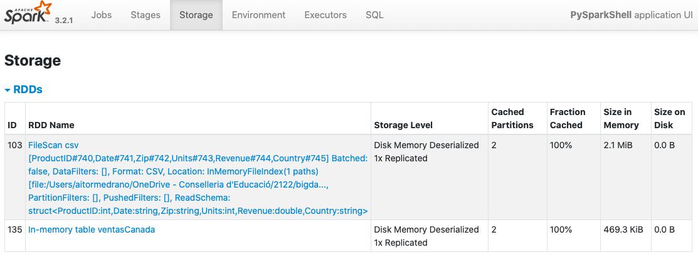
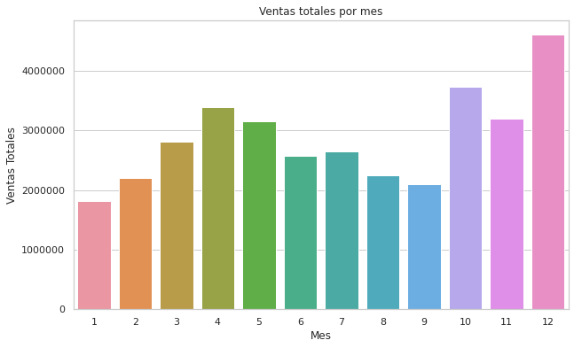
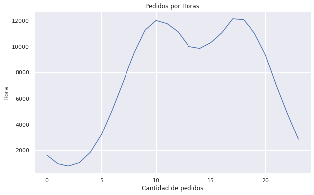

# Spark DataFrames II

## Agregaciones

Una vez tenemos un DataFrame, podemos realizar analítica de datos sobre el *dataset* entero, o sobre una o más columnas y aplicar una función de agregación que permita sumar, contar o calcular la media de cualquier grupo, entre otras opciones.

Para ello, *PySpark* ofrece un amplio [conjunto de funciones](https://spark.apache.org/docs/latest/api/python/reference/pyspark.sql.html#functions). En nuestro caso, vamos a realizar algunos ejemplos para practicar con las funciones más empleadas.

### Contando

=== "count"

    [count](https://spark.apache.org/docs/latest/api/python/reference/pyspark.sql/api/pyspark.sql.functions.count.html): Devuelve la cantidad de elementos no nulos:

    ``` python
    from pyspark.sql.functions import count
    df.select(count("Country")).show()
    # +--------------+
    # |count(Country)|
    # +--------------+
    # |        120239|
    # +--------------+
    ```

=== "count_distinct"

    [count_distinct / countDistinct](https://spark.apache.org/docs/latest/api/python/reference/pyspark.sql/api/pyspark.sql.functions.count_distinct.html): Devuelve la cantidad de elementos no nulos diferentes:

    ``` python
    from pyspark.sql.functions import count_distinct
    df.select(count_distinct("Country"), count_distinct("Zip")).show()
    # +-----------------------+-------------------+
    # |count(DISTINCT Country)|count(DISTINCT Zip)|
    # +-----------------------+-------------------+
    # |                      4|               2585|
    # +-----------------------+-------------------+
    ```

=== "approx_count_distinct"

    [approx_count_distinct / approxCountDistinct](https://spark.apache.org/docs/latest/api/python/reference/pyspark.sql/api/pyspark.sql.functions.approx_count_distinct.html): Devuelve aproximadamente la cantidad de elementos no nulos diferentes (puede recibir un segundo parámetro la máximo desviación estándar admitida). Este método es mucho más rápido que contar exactamente el número de resultado, y para datasets muy grandes, en ocasiones puede ser útil:


    ``` python
    from pyspark.sql.functions import approx_count_distinct
    df.select(approx_count_distinct("Country"), approx_count_distinct("Zip")).show()
    # +------------------------------+--------------------------+
    # |approx_count_distinct(Country)|approx_count_distinct(Zip)|
    # +------------------------------+--------------------------+
    # |                             4|                      2737|
    # +------------------------------+--------------------------+
    ```

### Calculando

=== "min y max"

    [min](https://spark.apache.org/docs/latest/api/python/reference/pyspark.sql/api/pyspark.sql.functions.min.html) y [max](https://spark.apache.org/docs/latest/api/python/reference/pyspark.sql/api/pyspark.sql.functions.max.html) permiten obtener el menor y el mayor valor respectivamente:

    ``` python
    from pyspark.sql.functions import min, max
    df.select(min("Units"), max("Units")).show()
    # +----------+----------+
    # |min(Units)|max(Units)|
    # +----------+----------+
    # |         1|        77|
    # +----------+----------+
    ```

=== "sum"

    [sum](https://spark.apache.org/docs/latest/api/python/reference/pyspark.sql/api/pyspark.sql.functions.sum.html) permite sumar todos los valores de una columna:

    ``` python
    from pyspark.sql.functions import sum
    df.select(sum("Units"), sum("Revenue")).show()
    # +----------+--------------------+
    # |sum(Units)|        sum(Revenue)|
    # +----------+--------------------+
    # |    125728|5.0107274999986745E7|
    # +----------+--------------------+
    ```

=== "sum_distinct"

    [sum_distinct / sumDistinct](https://spark.apache.org/docs/latest/api/python/reference/pyspark.sql/api/pyspark.sql.functions.sum_distinct.html) suma los valores diferentes de una columna:

    ``` python
    from pyspark.sql.functions import sum_distinct
    df.select(sum_distinct("Units"), sum_distinct("Revenue")).show()
    # +-------------------+---------------------+
    # |sum(DISTINCT Units)|sum(DISTINCT Revenue)|
    # +-------------------+---------------------+
    # |                308|   1189127.0999999985|
    # +-------------------+---------------------+
    ```

=== "avg"

    [avg](https://spark.apache.org/docs/latest/api/python/reference/pyspark.sql/api/pyspark.sql.functions.avg.html) calcula la media aritmética:

    ``` python
    from pyspark.sql.functions import sum, count, avg
    df.select(avg("Revenue"), sum("Revenue")/count("Revenue")).show()
    # +-----------------+-------------------------------+
    # |     avg(Revenue)|(sum(Revenue) / count(Revenue))|
    # +-----------------+-------------------------------+
    # |416.7306364822291|              416.7306364822291|
    # +-----------------+-------------------------------+
    ```

!!! info "Asimetría, varianza y desviación estándar"
    Si nos interesa obtener información estadística sobre los datos, también disponemos de las funciones `skewness`, `kurtosis`, `variance`, `var_pop`, `stddev` y `stddev_pop`.

### Agrupando

Si agrupamos varias columnas de tipo categóricas (con una cardinalidad baja), podemos realizar cálculos sobre el resto de columnas.

Sobre un *DataFrame*, podemos agrupar los datos por la columna que queramos utilizando el método [groupBy](https://spark.apache.org/docs/latest/api/python/reference/pyspark.sql/api/pyspark.sql.DataFrame.groupBy.html), el cual nos devuelve un [GroupedData](https://spark.apache.org/docs/latest/api/python/reference/pyspark.sql/api/pyspark.sql.GroupedData.html#pyspark.sql.GroupedData), sobre el que posteriormente realizar operaciones como `avg(cols)`, `count()`, `mean(cols)`, `min(cols)`, `max(cols)` o `sum(cols)`:

=== "count"

    ``` python
    from pyspark.sql.functions import sum
    df.groupBy("Country").count().show()
    # +-------+-----+
    # |Country|count|
    # +-------+-----+
    # |Germany|30059|
    # | France|30060|
    # | Mexico|30060|
    # | Canada|30060|
    # +-------+-----+
    ```

=== "sum"

    ``` python
    from pyspark.sql.functions import sum
    df.groupBy("Country").sum("Revenue").show()
    # +-------+--------------------+
    # |Country|        sum(Revenue)|
    # +-------+--------------------+
    # |Germany|1.4982119999999512E7|
    # | France|1.2087942100000832E7|
    # | Mexico| 1.139459870000116E7|
    # | Canada|1.1642614200001905E7|
    # +-------+--------------------+
    ```

Si necesitamos realizar más de un agregación sobre el mismo grupo, mediante [agg](https://spark.apache.org/docs/latest/api/python/reference/pyspark.sql/api/pyspark.sql.GroupedData.agg.html) podemos indicar una o más expresiones de columnas:

``` python
df.groupBy("Country").agg(sum("Revenue"), count("Revenue")).show()
# +-------+--------------------+--------------+
# |Country|        sum(Revenue)|count(Revenue)|
# +-------+--------------------+--------------+
# |Germany|1.4982119999999512E7|         30059|
# | France|1.2087942100000832E7|         30060|
# | Mexico| 1.139459870000116E7|         30060|
# | Canada|1.1642614200001905E7|         30060|
# +-------+--------------------+--------------+
```

También podemos indicar los elementos a calcular mediante un diccionario donde las claves son los campos y los valores la función a calcular:

``` python
df.groupBy("Country").agg({"Zip":"count", "Revenue":"avg"}).show()
# +-------+----------+------------------+
# |Country|count(Zip)|      avg(Revenue)|
# +-------+----------+------------------+
# |Germany|     30059| 498.4237665923521|
# | France|     30060| 402.1271490352905|
# | Mexico|     30060| 379.0618330007039|
# | Canada|     30060|387.31251497012323|
# +-------+----------+------------------+
```

### Agrupando colecciones

En ocasiones necesitamos agrupar en una colección todos los valores para un grupo en particular. Para ello, podemos usar [collect_list](https://spark.apache.org/docs/latest/api/python/reference/pyspark.sql/api/pyspark.sql.functions.collect_list.html) (con repetidos) o [collect_set](https://spark.apache.org/docs/latest/api/python/reference/pyspark.sql/api/pyspark.sql.functions.collect_set.html) (sin repeticiones):

Por ejemplo, para cada país, vamos a recuperar un listado con los códigos postales de aquellos pedidos que hayan superado las 5 unidades:

``` python
from pyspark.sql.functions import collect_list, collect_set
df.where("Units > 5").groupBy("Country").agg(collect_list("Zip"), collect_set("Zip")).show()
# +-------+--------------------+--------------------+
# |Country|   collect_list(Zip)|    collect_set(Zip)|
# +-------+--------------------+--------------------+
# |Germany|[22397, 22111, 40...|[22111, 12589, 22...|
# | France|[75213 CEDEX 16, ...|[06082 CEDEX 1, 0...|
# | Mexico|[7100, 7810, 9739...|[9739, 10300, 781...|
# | Canada|[T2X, V6G, V6G, T6V]|     [V6G, T2X, T6V]|
# +-------+--------------------+--------------------+
```

### Tablas pivote

Las tablas pivote permite obtener un resumen de los datos a partir de columnas categóricas sobre la que realizar cálculos, tal como se hace en las hojas de cálculo con las tablas dinámicas.

Por ejemplo, vamos a obtener la cantidad recaudada por las ventas de cada año por cada pais:

``` python
df.groupBy(year("Date")).pivot("Country").sum("Revenue").show()
# +----------+------------------+------------------+------------------+------------------+
# |year(Date)|            Canada|            France|           Germany|            Mexico|
# +----------+------------------+------------------+------------------+------------------+
# |      2003| 2360085.999999947|1105230.9000000046|1407120.0000000007|         1049457.5|
# |      2004| 1539140.499999946|              null|              null|              null|
# |      2001| 2193437.799999908|              null|              null|233419.20000000004|
# |      2000|1806678.3999999042|1108846.8999999764| 4510606.799999941| 4240448.399999928|
# |      1999|1382756.6999999764| 7594921.200000435| 5928459.100000297|3419368.2000001906|
# |      2002|2360514.7999998857| 2278943.099999957| 3135934.099999964|2451905.3999999263|
# +----------+------------------+------------------+------------------+------------------+
```

También podemos hacer más de un cálculo sobre la tabla pivote:

``` python
df.groupBy(year("Date")).pivot("Country").agg(sum("Revenue").alias("total"), sum("Units").alias("cantidad")).show()
# +----------+------------------+---------------+------------------+---------------+------------------+----------------+------------------+---------------+
# |year(Date)|      Canada_total|Canada_cantidad|      France_total|France_cantidad|     Germany_total|Germany_cantidad|      Mexico_total|Mexico_cantidad|
# +----------+------------------+---------------+------------------+---------------+------------------+----------------+------------------+---------------+
# |      2003| 2360085.999999947|           6375|1105230.9000000046|           2794|1407120.0000000007|            3099|         1049457.5|           2510|
# |      2004| 1539140.499999946|           3636|              null|           null|              null|            null|              null|           null|
# |      2001| 2193437.799999908|           5976|              null|           null|              null|            null|233419.20000000004|            583|
# |      2000|1806678.3999999042|           5049|1108846.8999999764|           2456| 4510606.799999941|            9738| 4240448.399999928|          11935|
# |      1999|1382756.6999999764|           3964| 7594921.200000435|          20432| 5928459.100000297|           12266|3419368.2000001906|           9895|
# |      2002|2360514.7999998857|           6148| 2278943.099999957|           6057| 3135934.099999964|            6643|2451905.3999999263|           6172|
# +----------+------------------+---------------+------------------+---------------+------------------+----------------+------------------+---------------+
```

## Joins

Hasta ahora todo la analítica la hemos realizado sobre un único *DataFrame*. Aunque si seguimos un proceso ELT es probable que tengamos todos los datos en un único lugar, en ocasiones necesitamos cruzar la información de dos datasets.

Si nos basamos en el planteamiento de una base de datos relacional, para unir dos *DataFrames* necesitamos unir la clave ajena de uno con la clave primaria del otro.

Para estos ejemplos, vamos a cambiar de *datasets* y utilizar datos de vuelos de avión que han tenido algún tipo de retraso ([departure_delays.csv](resources/departure_delays.csv)) y otro con los códigos de los aeropuertos ([airport-codes-na.tsv](resources/airport-codes-na.tsv)).

=== "Vuelos con retraso"

    Fichero CSV con la coma como separador de campos.

    ``` csv title="departure_delays.csv"
    date,delay,distance,origin,destination
    01011245,6,602,ABE,ATL
    01020600,-8,369,ABE,DTW
    01021245,-2,602,ABE,ATL
    01020605,-4,602,ABE,ATL
    ```

=== "Códigos de aeropuertos"

    Fichero TSV con el tabulador como separador campos, donde el campo `IATA` es la clave de cada aeropuerto.

    ``` tsv title="airport-codes-na.tsv"
    City State Country IATA
    Abbotsford BC Canada YXX
    Aberdeen SD USA ABR
    Abilene TX USA ABI
    Akron OH USA CAK
    Alamosa CO USA ALS
    Albany GA USA ABY
    ```

Así pues, lo primero que vamos a hacer es cargar ambos *DataFrames*:

``` python
from pyspark.sql import SparkSession

spark = SparkSession.builder.appName("s8a-dataframes-joins").getOrCreate()

df_vuelos = spark.read.option("sep",",").option("header", "true").option("inferSchema", "true").csv("departure_delays.csv")
# df_vuelos.printSchema()
# df_vuelos.count()   # 1391578
df_aeropuertos = spark.read.option("sep","\t").option("header", "true").option("inferSchema", "true").csv("airport-codes-na.tsv")
# df_aeropuertos.printSchema()
```

### Mediante SQL

Si queremos hacer un *join* mediante SQL, sólo tenemos que emplear la misma sintaxis que con cualquier sistema relacional, de manera que primero crearemos las vistas temporales:

``` python
df_vuelos.createOrReplaceTempView("vuelos")
df_aeropuertos.createOrReplaceTempView("aeropuertos")
```

Y a continuación realizamos la consulta:

``` python
df_join = spark.sql("select v.origin, a.city from vuelos v join aeropuertos a on v.origin == a.IATA")
df_join.show(3)

# +------+---------+
# |origin|     city|
# +------+---------+
# |   ABE|Allentown|
# |   ABE|Allentown|
# |   ABE|Allentown|
# +------+---------+
# only showing top 3 rows
```

Si quisiéramos obtener el nombre de los dos aeropuertos, necesitamos realizar dos veces el join:

``` python
df_join = spark.sql("select v.*, a.City as originCity, b.City as destinationCity from vuelos v JOIN aeropuertos a on v.origin == a.IATA join aeropuertos b on v.destination = b.IATA")
df_join.show(3)

# +-------+-----+--------+------+-----------+----------+---------------+
# |   date|delay|distance|origin|destination|originCity|destinationCity|
# +-------+-----+--------+------+-----------+----------+---------------+
# |1011245|    6|     602|   ABE|        ATL| Allentown|        Atlanta|
# |1020600|   -8|     369|   ABE|        DTW| Allentown|        Detroit|
# |1021245|   -2|     602|   ABE|        ATL| Allentown|        Atlanta|
# +-------+-----+--------+------+-----------+----------+---------------+
# only showing top 3 rows
```

Si existiera algún vuelo cuyos códigos de aeropuerto no tuviéramos disponible en el *dataset* de los códigos de aeropuertos, no nos aparecería. Por tanto, sería más conveniente realizar un *left join*:

``` python
df_left_join = spark.sql("select v.*, a.City as originCity, b.City as destinationCity from vuelos v LEFT JOIN aeropuertos a on v.origin == a.IATA LEFT JOIN aeropuertos b on v.destination = b.IATA")
df_left_join.show(3)
df_left_join.count()    # 1391578
```

!!! info "Todo tipo de joins"
    Además de los casos vistos, podemos realizar otros tipos de joins como *cross*, *semi*, *full*, *outer*, etc... Más información en la [documentación oficial](https://spark.apache.org/docs/latest/sql-ref-syntax-qry-select-join.html)

Un caso particular que conviene conocer es el *left anti join*. Este tipo de *join* permite obtener aquellos registros de la izquierda que no aparecen en la parte derecha, de manera que si seguimos con el ejemplo, podemos recuperar aquellos vuelos cuyos aeropuertos no tenemos en el *dataset* con los códigos:

``` python
df_left_anti_join = spark.sql("select * from vuelos v LEFT ANTI JOIN aeropuertos a ON v.origin == a.IATA ")
df_left_anti_join.count()   # 14416
```

### Mediante Python

Si no queremos utilizar SQL o ya tenemos fragmentos de código que interactúan con el *DataFrame API*, podemos utilizar el método [join](https://spark.apache.org/docs/latest/api/python/reference/pyspark.sql/api/pyspark.sql.DataFrame.join.html).

Este método une dos *DataFrames*, indicando la expresión de unión y opcionalmente el tipo:

``` python
exprJoin1 = df_vuelos.origin == df_aeropuertos.IATA
df_joinp1 = df_vuelos.join(df_aeropuertos, exprJoin1, "inner")
df_joinp1.count()    # 1377162
```

!!! tip "Forma corta"
    Si las columnas que unen los *DataFrames* tienen el mismo nombre, podemos simplificar el código indicando únicamente su nombre:

    ``` python
    df1.join(df2, "user_id")
    ```

    Además, si queremos hacer un *inner join*, podemos no indicarlo ya que es el tipo por defecto.


En vez de pasarle `inner`, le podemos indicar el tipo de join: `left`, `right`, `cross`, `left_anti`, etc...

``` python
expr_join1 = df_vuelos.origin == df_aeropuertos.IATA
df_left_anti_join = df_vuelos.join(df_aeropuertos, expr_join1, "left_anti")
df_left_anti_join.count()   # 14416
```

Finalmente, como en nuestro caso teníamos dos *joins*, tanto para los vuelos de origen como los de destino, necesitamos volver a unir:

``` python
from pyspark.sql.functions import col
# le indicamos alias a los campos para eliminar ambigüedades
expr_join2 = col("a.destination") == col("b.IATA")
df_joinp2 = (df_joinp1.alias("a")).join((df_aeropuertos.alias("b")), expr_join2, "inner")
df_joinp2.count()    # 1361141
```

## Funciones

Para dominar realmente Spark, hay que tener destreza en todas las funciones existente para el tratamiento de fechas, cadenas, operaciones matemáticas, para trabajar con colecciones, etc...

Además, siempre podemos crear nuestras propias funciones de usuario para ampliar el lenguaje.

Aunque ya hemos utilizado algunas a lo largo de los apuntes, a continuación vamos a repasar las funciones más empleadas.

### Fechas

* Si necesitamos convertir de texto a fecha: [`to_date`](https://spark.apache.org/docs/latest/api/python/reference/pyspark.sql/api/pyspark.sql.functions.to_date.html), [`to_timestamp`](https://spark.apache.org/docs/latest/api/python/reference/pyspark.sql/api/pyspark.sql.functions.to_timestamp.html), [`unix_timestamp`](https://spark.apache.org/docs/latest/api/python/reference/pyspark.sql/api/pyspark.sql.functions.unix_timestamp.html)
* Para formatear las fechas: [`date_format`](https://spark.apache.org/docs/latest/api/python/reference/pyspark.sql/api/pyspark.sql.functions.date_format.html), [`from_unixtime`](https://spark.apache.org/docs/latest/api/python/reference/pyspark.sql/api/pyspark.sql.functions.from_unixtime.html) ([patrones de fechas](https://spark.apache.org/docs/latest/sql-ref-datetime-pattern.html))
* Para realizar cálculos sobre fechas: `datediff`, `months_between`, `last_day`, `date_add`, `date_sub`, `next_day`
* Extraer un valor de una fecha: `year`, `month`, `weekofyear`, `dayofmonth`, `dayofyear`, `hour`, `minute`, `second`

Más información en la [documentación oficial](https://spark.apache.org/docs/latest/sql-ref-functions-builtin.html#date-and-timestamp-functions)

``` python
from pyspark.sql import SparkSession
from pyspark.sql.functions import to_date

spark = SparkSession.builder.appName("s8a-dataframes-sql").getOrCreate()

df = spark.read.option("sep",";").option("header", "true").option("inferSchema", "true").csv("pdi_sales_small.csv")
# Cambiamos el tipo de dato a fecha
df = df.withColumn("Date", to_date(df.Date, "M/d/yyy"))

import pyspark.sql.functions
df.select("Date", date_format("Date", "dd-MM-yyy"),
            next_day("Date", "Sun"), last_day("Date"),
            dayofmonth("Date"), dayofyear("Date"),
            month("Date"), year("Date")).show(2)
# +----------+----------------------------+-------------------+--------------+----------------+---------------+-----------+----------+
# |      Date|date_format(Date, dd-MM-yyy)|next_day(Date, Sun)|last_day(Date)|dayofmonth(Date)|dayofyear(Date)|month(Date)|year(Date)|
# +----------+----------------------------+-------------------+--------------+----------------+---------------+-----------+----------+
# |1999-01-15|                  15-01-1999|         1999-01-17|    1999-01-31|              15|             15|          1|      1999|
# |2002-06-06|                  06-06-2002|         2002-06-09|    2002-06-30|               6|            157|          6|      2002|
# +----------+----------------------------+-------------------+--------------+----------------+---------------+-----------+----------+
# only showing top 2 rows
```

### Cadenas

Por ejemplo, tenemos las funciones para quitar espacios ([`ltrim`](https://spark.apache.org/docs/latest/api/python/reference/pyspark.sql/api/pyspark.sql.functions.ltrim.html), [`rtrim`](https://spark.apache.org/docs/latest/api/python/reference/pyspark.sql/api/pyspark.sql.functions.rtrim.html), [`trim`](https://spark.apache.org/docs/latest/api/python/reference/pyspark.sql/api/pyspark.sql.functions.trim.html)) y pasar a mayúsculas/minúsculas ([`lower`](https://spark.apache.org/docs/latest/api/python/reference/pyspark.sql/api/pyspark.sql.functions.lower.html), [`upper`](https://spark.apache.org/docs/latest/api/python/reference/pyspark.sql/api/pyspark.sql.functions.upper.html)):

``` python
df.select("Zip", ltrim("Zip").alias("l"), rtrim("Zip").alias("r"), 
         lower("Zip"), upper("Zip")
         ).where(trim(df.Country)=="Canada").show(3)
# +---------------+---------------+---+---------------+---------------+
# |            Zip|              l|  r|     lower(Zip)|     upper(Zip)|
# +---------------+---------------+---+---------------+---------------+
# |H1B            |H1B            |H1B|h1b            |H1B            |
# +---------------+---------------+---+---------------+---------------+
# only showing top 1 row
```

O funciones para poner la inicial en mayúsculas ([`initcap`](https://spark.apache.org/docs/latest/api/python/reference/pyspark.sql/api/pyspark.sql.functions.initcap.html)), darle la vuelta ([`reverse`](https://spark.apache.org/docs/latest/api/python/reference/pyspark.sql/api/pyspark.sql.functions.reverse.html)), obtener su tamaño o reemplazar caracteres ([`translate`](https://spark.apache.org/docs/latest/api/python/reference/pyspark.sql/api/pyspark.sql.functions.translate.html)):

``` python
df.select("Country", initcap("Country"), reverse("Country"),
          length("Country"), translate("Country", "na", "pe")
         ).where(trim(df.Country)=="Canada").show(1)
# +-------+----------------+----------------+---------------+--------------------------+
# |Country|initcap(Country)|reverse(Country)|length(Country)|translate(Country, na, pe)|
# +-------+----------------+----------------+---------------+--------------------------+
# |Canada |         Canada |          adanaC|              7|                   Cepede |
# +-------+----------------+----------------+---------------+--------------------------+
# only showing top 1 row
```

También podemos trabajar con subcadenas ([`substring`](https://spark.apache.org/docs/latest/api/python/reference/pyspark.sql/api/pyspark.sql.functions.substring.html)), encontrar ocurrencias ([`locate`](https://spark.apache.org/docs/latest/api/python/reference/pyspark.sql/api/pyspark.sql.functions.locate.html)) o partir una cadena en trozos ([`split`](https://spark.apache.org/docs/latest/api/python/reference/pyspark.sql/api/pyspark.sql.functions.split.html)):

``` python
df.select("Country", split("Country", "a"), locate("a", "Country"),
          substring("Country",3,2)
         ).where(trim(df.Country)=="Canada").show(1)
+-------+---------------------+---------------------+------------------------+
|Country|split(Country, a, -1)|locate(a, Country, 1)|substring(Country, 3, 2)|
+-------+---------------------+---------------------+------------------------+
|Canada |         [C, n, d,  ]|                    2|                      na|
+-------+---------------------+---------------------+------------------------+
only showing top 1 row
```

Otras funciones que se suelen utilizar son [`concat`](https://spark.apache.org/docs/latest/api/python/reference/pyspark.sql/api/pyspark.sql.functions.concat.html) y  [`concat_ws`](https://spark.apache.org/docs/latest/api/python/reference/pyspark.sql/api/pyspark.sql.functions.concat.html) para unir cadenas, [`levenshtein`](https://spark.apache.org/docs/latest/api/python/reference/pyspark.sql/api/pyspark.sql.functions.levenshtein.html) para calcular la distancia entre dos cadenas, [`lpad`](https://spark.apache.org/docs/latest/api/python/reference/pyspark.sql/api/pyspark.sql.functions.lpad.html) y [`rpad`](https://spark.apache.org/docs/latest/api/python/reference/pyspark.sql/api/pyspark.sql.functions.rpad.html) para completar con espacios, etc... Si necesitas trabajar con expresiones regulares puedes utilizar [`regexp_extract`](https://spark.apache.org/docs/latest/api/python/reference/pyspark.sql/api/pyspark.sql.functions.regexp_extract.html) para extraer parte de una cadena como [`regexp_replace`](https://spark.apache.org/docs/latest/api/python/reference/pyspark.sql/api/pyspark.sql.functions.regexp_replace.html) para sustituir.

### Colecciones

Para probar las funciones que trabajan con colecciones, vamos a cambiar de *dataset* y trabajar con uno compartido por [Kaggle](https://www.kaggle.com/datasets/yelp-dataset/yelp-dataset) con datos de negocios de Yelp que tenemos almacenados en una versión reducida en [yelp_academic_dataset_business.json](resources/yelp_academic_dataset_business.json). Los negocios tienen una propiedad denominada `categories` que contiene un array con las categorías de los mismos:

``` json title="persons.json"
{
   "business_id":"O_X3PGhk3Y5JWVi866qlJg",
   "full_address":"1501 W Bell Rd\nPhoenix, AZ 85023",
   "hours":{
      "Monday":{
         "close":"18:00",
         "open":"11:00"
      },
      "Tuesday":{
         "close":"18:00",
         "open":"11:00"
      },
        ...
   },
   "open":true,
   "categories":[
      "Active Life",
      "Arts & Entertainment",
      "Stadiums & Arenas",
      "Horse Racing"
   ],
   "city":"Phoenix",
   ...
}
```

El primer paso es cargar el documento y ver el esquema leído por *Spark*:

``` python
from pyspark.sql import SparkSession

spark = SparkSession.builder.appName("s8a-dataframes-arrays").getOrCreate()

df = spark.read.option("inferSchema", "true").option("multiline",True).json("yelp_academic_dataset_business.json")
    
df.printSchema()
```

Como podemos observar, sigue una estructura de elementos anidados:

``` text
root
 |-- attributes: struct (nullable = true)
 |    |-- Accepts Credit Cards: boolean (nullable = true)
 |    |-- Alcohol: string (nullable = true)
 |    |-- Ambience: struct (nullable = true)
 |    |    |-- casual: boolean (nullable = true)
 |    |    |-- classy: boolean (nullable = true)
 |    |    |-- divey: boolean (nullable = true)
 |    |    |-- hipster: boolean (nullable = true)
 |    |    |-- intimate: boolean (nullable = true)
 |    |    |-- romantic: boolean (nullable = true)
 |    |    |-- touristy: boolean (nullable = true)
 |    |    |-- trendy: boolean (nullable = true)
 |    |    |-- upscale: boolean (nullable = true)
 |    |-- Attire: string (nullable = true)
 ...
 |    |-- Wi-Fi: string (nullable = true)
 |-- business_id: string (nullable = true)
 |-- categories: array (nullable = true)
 |    |-- element: string (containsNull = true)
 |-- city: string (nullable = true)
 |-- full_address: string (nullable = true)
 ...
```

Por ejemplo, vamos a ver mediante un ejemplo las siguientes funciones:

* `size`: devuelve el tamaño de la colección
* `sort_array`: ordena la colección
* `array_contains`: comprueba si hay un elemento en la colección

``` python
from pyspark.sql.functions import *
df.select("name", "hours.Sunday", size("categories").alias("totalCategorias"),
               sort_array("categories").alias("categorias"),
               array_contains("categories", "Restaurants").alias("Restaurantes")).show(10, truncate=False)
# +-------------------------------+--------------+---------------+---------------------------------------------------------------------------------+------------+
# |name                           |Sunday        |totalCategorias|categorias                                                                       |Restaurantes|
# +-------------------------------+--------------+---------------+---------------------------------------------------------------------------------+------------+
# |Turf Paradise Race Course      |{18:00, 11:00}|4              |[Active Life, Arts & Entertainment, Horse Racing, Stadiums & Arenas]             |false       |
# |Sam's Club Members Only        |null          |5              |[Automotive, Department Stores, Fashion, Shopping, Tires]                        |false       |
# |Forever 21                     |{18:00, 11:00}|5              |[Accessories, Fashion, Men's Clothing, Shopping, Women's Clothing]               |false       |
# |Loving Hands Pet Care          |{19:00, 06:00}|3              |[Pet Boarding/Pet Sitting, Pet Services, Pets]                                   |false       |
# |Amec Mid-City Animal Hospital  |null          |2              |[Pets, Veterinarians]                                                            |false       |
# |Los Armandos Asadero Y Mariscos|{03:00, 20:00}|2              |[Mexican, Restaurants]                                                           |true        |
# |Clayton Companies              |null          |4              |[Home Services, Property Management, Real Estate, Real Estate Services]          |false       |
# |Bertha's Café                  |null          |5              |[Bakeries, Breakfast & Brunch, Food, Restaurants, Sandwiches]                    |true        |
# |Jerry's Artarama               |{17:00, 11:00}|4              |[Art Supplies, Arts & Crafts, Framing, Shopping]                                 |false       |
# |Shauna Brown Fitness           |null          |5              |[Active Life, Fitness & Instruction, Health & Medical, Massage Therapy, Trainers]|false       |
# +-------------------------------+--------------+---------------+---------------------------------------------------------------------------------+------------+
only showing top 10 rows
```

!!! tip inline end
    Recuerda que en el apartado [Agrupando colecciones](#agrupando-colecciones) vimos como podemos crear colecciones al realizar una agrupación.

Así pues, además del nombre, hemos obtenido el horario de los domingos utilizando la notación `.` para acceder a los campos anidados, la cantidad de categorías de cada comercio, un listado ordenado con sus categorías y finalmente si es un restaurante.

Otro tipo de operación que podemos realizar es desenrollar una colección mediante la función [`explode`](https://spark.apache.org/docs/latest/api/python/reference/pyspark.sql/api/pyspark.sql.functions.explode.html) y generar una fila nueva por cada elemento de la colección:

``` python
df.select("name", explode("categories")).show(10, truncate=False)
# +-------------------------+--------------------+
# |name                     |col                 |
# +-------------------------+--------------------+
# |Turf Paradise Race Course|Active Life         |
# |Turf Paradise Race Course|Arts & Entertainment|
# |Turf Paradise Race Course|Stadiums & Arenas   |
# |Turf Paradise Race Course|Horse Racing        |
# |Sam's Club Members Only  |Tires               |
# |Sam's Club Members Only  |Automotive          |
# |Sam's Club Members Only  |Fashion             |
# |Sam's Club Members Only  |Shopping            |
# |Sam's Club Members Only  |Department Stores   |
# |Forever 21               |Women's Clothing    |
# +-------------------------+--------------------+
# only showing top 10 rows
```

### JSON

Es común que se de el caso de que los datos que leemos desde un sistema externo estén en formato JSON pero que el proceso de ingesta lo haya realizado como si fuera una cadena de texto.

Supongamos que tenemos la siguiente cadena y generados un DataFrame a partir de un RDD:

``` python
tareas = ["""{"dia": "Lunes", "tareas": ["Corregir ejercicios", "Ir a nadar", "Comprar pan"]}"""]
# ['{"dia": "Lunes", "tareas": ["Corregir ejercicios", "Ir a nadar", "Comprar pan"]}']
tareasRDD = spark.sparkContext.parallelize(tareas)
tareasStrDF = tareasRDD.toDF("string")
# tareasStrDF es un DF con una columna con nombre value de tipo string
tareasStrDF.printSchema()
# root
#  |-- value: string (nullable = true)
tareasStrDF.show()
# +--------------------+
# |               value|
# +--------------------+
# |{"dia": "Lunes", ...|
# +--------------------+
```

Para pasarlo a JSON, necesitamos definir un esquema con la estructura del documento JSON:

``` python
from pyspark.sql.types import StructType, StructField, StringType, ArrayType

esquemaTareas = StructType([
    StructField("dia", StringType(), False),
    StructField("tareas", ArrayType(StringType(), False), False)
])
```

Y a continuación ya podemos transformar el formato mediante la función [`from_json`](https://spark.apache.org/docs/latest/api/python/reference/pyspark.sql/api/pyspark.sql.functions.from_json.html):

``` python
todosDF = tareasStrDF.select(from_json("value", esquemaTareas).alias("datos"))
todosDF.printSchema()
# root
#  |-- datos: struct (nullable = true)
#  |    |-- dia: string (nullable = true)
#  |    |-- tareas: array (nullable = true)
#  |    |    |-- element: string (containsNull = true)
```

Y ahora ya podemos acceder a los datos (en el siguiente ejemplo empleamos la función [`getItem`](https://spark.apache.org/docs/latest/api/python/reference/pyspark.sql/api/pyspark.sql.functions.getItem.html) para acceder a un elemento de una columna):

``` python
todosDF.select(col("datos").getItem("dia"),
     "datos.tareas",
     (todosDF.datos.getItem("tareas")[0]).alias("tarea1")).show(truncate=False)
+---------+----------------------------------------------+-------------------+
|datos.dia|tareas                                        |tarea1             |
+---------+----------------------------------------------+-------------------+
|Lunes    |[Corregir ejercicios, Ir a nadar, Comprar pan]|Corregir ejercicios|
+---------+----------------------------------------------+-------------------+
```

Para terminar, si necesitamos la operación inversa, y lo que queremos es crear una representación JSON de una columna, podemos utilizar la función [`getItem`](https://spark.apache.org/docs/latest/api/python/reference/pyspark.sql/api/pyspark.sql.functions.getItem.html):

``` python
todosDF.select(to_json("datos")).show(truncate=False)
# +---------------------------------------------------------------------------+
# |to_json(datos)                                                             |
# +---------------------------------------------------------------------------+
# |{"dia":"Lunes","tareas":["Corregir ejercicios","Ir a nadar","Comprar pan"]}|
# +---------------------------------------------------------------------------+
```

### UDF

Además de las funciones que ofrece Spark, en cualquier momento podemos crear nuestras funciones de usuario (*User-Defined Functions*) para ampliar la expresividad de Spark. Antes de utilizarlas, las hemos de definir y registrar.

Si volvemos al *dataset* de ventas, teníamos la siguiente información:

``` python
df.select("ProductID", "Revenue", "Units").sort("Units", ascending=False).show(5)
# +---------+-------+-----+
# |ProductID|Revenue|Units|
# +---------+-------+-----+
# |      495|43194.1|   77|
# |     2091| 6347.7|   41|
# |     2091| 6240.1|   41|
# |     2091| 3652.7|   24|
# |     2091| 3560.9|   23|
# +---------+-------+-----+
# only showing top 5 rows
```

Vamos a crear una función para que, si vende más de una unidad, se le asigne a cada producto un bonus de un 1%. Para ello, primero definiremos la función mediante *Python*, y posteriormente, la registraremos mediante la función [`udf`](https://spark.apache.org/docs/latest/api/python/reference/pyspark.sql/api/pyspark.sql.functions.udf.html):

``` python
from pyspark.sql.functions import udf
from pyspark.sql.types import DoubleType

def bonus(unidades, ventas):
    if unidades == 1 :
        return 0.0
    else:
        return unidades * ventas / 100
    
udfBonus = udf(bonus, DoubleType())
```

Así pues, si realizamos una consulta, ya podemos utilizar la función recién creada como si fuera una propia de *Spark*:

``` python
df.select("ProductID", "Revenue", "Units", udfBonus(df.Units, df.Revenue)).sort("Units", ascending=False).show(5)
# +---------+-------+-----+---------------------+
# |ProductID|Revenue|Units|bonus(Units, Revenue)|
# +---------+-------+-----+---------------------+
# |      495|43194.1|   77|   33259.456999999995|
# |     2091| 6347.7|   41|             2602.557|
# |     2091| 6240.1|   41|   2558.4410000000003|
# |     2091| 3652.7|   24|    876.6479999999999|
# |     2091| 3560.9|   23|              819.007|
# +---------+-------+-----+---------------------+
# only showing top 5 rows
```

Si queremos definir la función para poder utilizarla dentro de Spark SQL y obtener el mismo resultado, hemos de registrar la función mediante ***`spark.udf.register`***, la cual recibe el nombre que le asignaremos a la función, el nombre de la función Python a invocar, y el tipo de dato que devuelve:

``` python
spark.udf.register("udfBonus", bonus, DoubleType())
spark.sql("select ProductID, Revenue, Units,  udfBonus(Units, Revenue) as bonus from ventas order by Units desc").show(5)
```

!!! caution "UDF y Python"
    En un principio, se desaconseja la creación de UDF mediante *Python*, ya que su uso penalizar de forma significativa el rendimiento.
    Los ejecutores son procesos en máquinas virtuales de Java que están escritos en Java, y por ello, ejecutan código Java o Scala de forma nativa. En cambio, para Python tiene que ejecutar un proceso separado para ejecutar la UDF, lo que implica un coste extra para serializar y volver a deserializar los datos para cada fila del *dataset*.

## Persistencia

Un *DataFrame* se puede persistir/cachear en memoria conforme necesitemos (también lo podemos hacer con los RDD). Su principal propósito es cuando vamos a acceder a un DataFrame una y otra vez y no necesitamos que se vuelvan a evaluar todas las operaciones (como pueden ser los algoritmos iterativos utilizados en *Machine Learning*).

Cuando persistimos un *dataset*, cada nodo almacena sus datos particionados en memoria y/o disco y los reutiliza en otras operaciones sobre dicho *dataset*.

Para ello, se emplean los métodos [`cache`](https://spark.apache.org/docs/latest/api/python/reference/pyspark.sql/api/pyspark.sql.DataFrame.cache.html) / [`persist`](https://spark.apache.org/docs/latest/api/python/reference/pyspark.sql/api/pyspark.sql.DataFrame.persist.html) y [`unpersist`](https://spark.apache.org/docs/latest/api/python/reference/pyspark.sql/api/pyspark.sql.DataFrame.unpersist.html) para cachear y liberar los datos.

``` python
df.persist()
df.count()  # forzamos la evaluación perezosa
```

Si queremos realizarlo con *SparkSQL*:

``` python
ventasCanada.createOrReplaceTempView("ventasCanada")
// Si queremos cachear la tabla mediante SQl
spark.catalog.cacheTable("ventasCanada")
```

Una vez persistidos los datos, si accedemos a <http://localhost:4040> veremos en la pestaña *Storage* que se ha creado la tabla, su tipo de almacenamiento y particiones cacheadas:

<figure style="align: center;">
    
    <figcaption>Elementos cacheados con Spark UI</figcaption>
</figure>

Una diferencia fundamental a la hora de persistir un *DataFrame* en comparación con un RDD, es que como Spark SQL conoce el esquema de los datos en el *DataFrame*, puede organizarlos de forma columnar y aplicar compresión sobre éstos para minimizar el espacio necesario.

## DataFrames y Pandas

En cualquier momento podemos pasar los datos de un *DataFrame* de *PySpark* a uno de *Pandas* para poder aprovechar su API.

Si seguimos con el *dataset* de *Yelp*, vamos a preparar una consulta de nos devuelva la cantidad de votos recibidos y puntuación media de cada ciudad:

```  python
from pyspark.sql.functions import count, avg, round
dfVotosCiudades = df.groupBy("city").agg(count("city").alias("votos"), round(avg("stars"), 3).alias("media")).orderBy("votos", ascending=False).limit(10)
dfVotosCiudades.show()
# +----------+-----+-----+
# |      city|votos|media|
# +----------+-----+-----+
# |   Phoenix| 5492|3.658|
# |Scottsdale| 2617|3.809|
# |     Tempe| 1444| 3.64|
# |      Mesa| 1348|3.644|
# |  Chandler| 1178|3.677|
# |  Glendale|  821|3.588|
# |   Gilbert|  630|3.755|
# |    Peoria|  385|3.614|
# |  Surprise|  241|3.598|
# |  Goodyear|  214|3.498|
# +----------+-----+-----+
```

Nos traemos esos datos a *Pandas* mediante el método **`.toPandas()`**.:

``` python
pdVC = dfVotosCiudades.toPandas()
```

A partir de este momento `pdVC` es un *DataFrame* de *Pandas*:

<figure style="align: center;">
    
    <figcaption>Conversión a un DataFrame de Pandas</figcaption>
</figure>

Y con el *DataFrame* de *Pandas*, ya podemos generar gráficos:

``` python
import pandas as pd
import matplotlib.pyplot as plt
import seaborn as sns

plt.figure(figsize=(10,6))
plt.ticklabel_format(useOffset=False, style="plain")
sns.set_theme(style="whitegrid")
sns.barplot(x="votos", y="city", data=pdVC).set_title("Votos por Ciudad")
plt.xlabel("Votos emitidos")
plt.ylabel("Ciudades")

plt.show()
```

<figure style="align: center;">
    
    <figcaption>Gráfico generado mediante Pandas y Spark</figcaption>
</figure>

O por ejemplo, si queremos unir dos gráficos:

``` python
plt.figure(figsize=(10,6))
sns.set_theme(style="white")
ax = sns.barplot(data = pdVC, y="votos", x="city")

ax2 = ax.twinx()
sns.lineplot(data = pdVC['media'], marker='o', color='crimson', ax=ax2)
plt.show()
```

Obteniendo:

<figure style="align: center;">
    
    <figcaption>Gráfico generado mediante Pandas y Spark</figcaption>
</figure>

!!! warning "Out of Memory"
    Mucho cuidado al utilizar Pandas, ya que al convertir el *DataFrame* nos vamos a traer todos los datos al driver, perdiendo la distribución de los datos y pudiendo provocar un error de falta de memoria.

Así pues, hay que evitar a toda costa utilizar *Pandas* para tratar los datos, ya que perdemos toda la potencia de trabajo en clúster (*Pandas* sólo puede utilizar los recursos del nodo principal). Únicamente lo utilizaremos cuando vayamos a visualizar los datos mediante *Matplotlib* / *Seaborn* como requisito de estas librerías.

<!--
https://github.com/vivek-bombatkar/MyLearningNotes/tree/master/spark#from-pandas-to-spark
-->

## Referencias

* Documentación oficial sobre [Spark SQL, DataFrames and Datasets Guide](https://spark.apache.org/docs/latest/sql-programming-guide.html)
* [Beginning Apache Spark 3: With DataFrame, Spark SQL, Structured Streaming, and Spark Machine Learning Library](https://link.springer.com/book/10.1007/978-1-4842-7383-8)
* [Spark by Examples](https://sparkbyexamples.com/pyspark/)
* [The Most Complete Guide to pySpark DataFrames](https://towardsdatascience.com/the-most-complete-guide-to-pyspark-dataframes-2702c343b2e8)
* [Spark SQL Cheatsheet en PDF](http://datacamp-community-prod.s3.amazonaws.com/02213cb4-b391-4516-adcd-57243ced8eed) y en [formato web](https://www.datacamp.com/blog/pyspark-cheat-sheet-spark-dataframes-in-python)

<!--
2085680-8372834-1990332-1616010-5139491-4428950-8671321-4806110-3358726

Bomberos de San Francisco: https://data.sfgov.org/Public-Safety/Fire-Incidents/wr8u-xric/data 212MB
https://data.sfgov.org/Public-Safety/Fire-Department-Calls-for-Service/nuek-vuh3 2139 MB
https://github.com/yukia3e/learning-spark-3/tree/master/src/sql/02_basic
-->

## Actividades

1. Vamos a seguir realizando analíticas de datos sobre las películas, ya que nos han enviado un nuevo archivo llamado [`movie-ratings.tsv`](resources/movie-ratings.tsv) que contiene las calificaciones de las películas.

    1. Crea un DataFrame que contenga los datos de ambos *datasets*.
    2. Muestra para cada año, la película con mayor puntuación (año, título de la película, puntuación)
    3. Sobre los datos anteriores, obtén también una lista con los nombres de los intérpretes.
    4. Averigua las tres parejas de intérpretes han trabajado juntos en más ocasiones. La salida debe tener tres columnas: `interprete1`, `interprete2` y `cantidad`. (necesitas utilizar un *self-join*)

2. Hemos recibido un dataset con las ventas de 2019 de una tienda americana de productos de tecnología, mediante un conjunto de ficheros en formato CSV comprimidos en [salesdata.zip](resources/salesdata.zip).

    1. Una vez descomprimidos los datos, crea un *DataFrame* con todos los datos, infiriendo el esquema.
    2. Vuelve a realizar la lectura de los datos pero con el siguiente esquema:

        ``` python
        from pyspark.sql.types import StructType, StructField, StringType, IntegerType, DoubleType
        esquema = StructType([
            StructField("Order ID", IntegerType(), False),
            StructField("Product", StringType(), False),
            StructField("Quantity Ordered", IntegerType(), True),
            StructField("Price Each", DoubleType(), False),
            StructField("Order Date", StringType(), False),
            StructField("Purchase Address", StringType(), False)
        ])
        ```

    3. Tras la lectura, vamos a realizar la limpieza de datos. El primer paso será renombrar la columnas para eliminar los espacios en blanco.
    4. Elimina las filas que contengan algún campo nulo.
    5. Comprueba si las cabeceras de los archivos aparecen como datos del *dataset* (por ejemplo, un producto cuyo nombre sea `Product`). Si fuera el caso, elimina dichas filas.
    6. A partir del campo dirección, crea dos nuevas columnas para almacenar la ciudad (`City`) y el estado (`State`). Por ejemplo, para la dirección `136 Church St, New York City, NY 10001`, la ciudad es `New York City` y el estado es `NY`.
    7. Modifica el campo con la fecha del pedido para que su formato sea *timestamp*.
    8. Sobre el campo anterior, crea dos nuevas columnas, con el mes (`Month`) y el año (`Year`) del pedido.
    9. Almacena los datos en formato Parquet en la carpeta `salesoutput` particionando los datos por año y mes. Tras ejecutar esta operación, comprueba en disco la estructura de archivos creada.
    10. Sobre los datos almacenados, realiza una nueva lectura pero solo leyendo los datos de 2019 los cuales deberían estar almacenados en `./salesdataoutput/Year=2019`.
    11. Averigua cual ha sido el mes que ha recaudado más. Para ello, deberás multiplicar el precio por la cantidad de unidades, y posteriormente, realizar alguna agregación. Sobre el resultado, crea un gráfico similar al siguiente:

        <figure style="align: center;">
            
            <figcaption>Ventas por mes</figcaption>
        </figure>

    12. Obtén un gráfico con las 10 ciudades que más unidades han vendido.

        <figure style="align: center;">
            
            <figcaption>Ciudades con más unidades vendidas</figcaption>
        </figure>

    13. Cantidad de pedidos por Horas en las que se ha realizado un pedido que contenía al menos dos productos:

        <figure style="align: center;">
            
            <figcaption>Pedidos de al menos dos productos por horas</figcaption>
        </figure>

    14. Listado con los productos del estado de `NY` que se han comprado a la vez, obteniendo un resultado similar a:

        ``` text
        +------------------------------------------------------------+-----+
        |Productos                                                   |count|
        +------------------------------------------------------------+-----+
        |[iPhone, Lightning Charging Cable]                          |126  |
        |[Google Phone, USB-C Charging Cable]                        |124  |
        |[Google Phone, Wired Headphones]                            |52   |
        ...
        ```

3. (opcional) Vuelve a realizar todo el ejercicio anterior pero utilizando únicamente Spark SQL.
