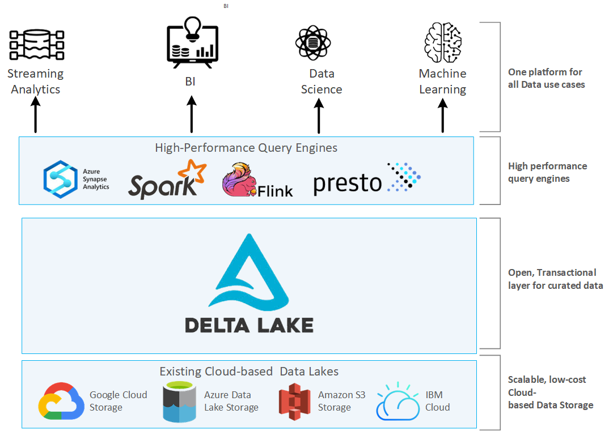

# Spark JDBC y uso del catálogo. Delta Lake

## Conectando con bases de datos

Para conectar desde [Spark con una base de datos relacional](https://spark.apache.org/docs/latest/sql-data-sources-jdbc.html) (*RDBMS*) necesitamos:

* un driver JDBC compatible
* las [propiedades de conexión](https://spark.apache.org/docs/latest/sql-data-sources-jdbc.html#data-source-option) a la base de datos.

En *PySpark*, el *driver* lo podemos añadir directamente a la carpeta `jars` disponible en `$SPARK_HOME`, o a la hora de lanzar *Spark* utilizando la opción `--jars <fichero1.jar>,<fichero2.jar>` o `--packages <groupId:artifactId:version>`.

Así pues, para conectar con nuestra base de datos `retail_db` que tenemos configurada en la máquina virtual, primero copiaremos el [driver de MySQL](resources/mysql-connector-j-8.0.31.jar) en la carpeta `$SPARK_HOME/jars`.

Si tuviéramos problemas a la hora de crear la conexión con la base de datos, indicaremos en la configuración qué archivos añadimos al *classpath*:

``` python
spark = SparkSession.builder.appName("s8a-dataframes-jdbc") \
    .config('spark.driver.extraClassPath', 'mysql-connector-j-8.0.31.jar') \
    .getOrCreate()
```

El siguiente paso es configurar la conexión a la base de datos:

``` python
url = "jdbc:mysql://localhost/retail_db"
propiedades = {
    "driver": "com.mysql.cj.jdbc.Driver",
    "user": "iabd",
    "password": "iabd"
}
```

!!! tip "Spark y MySQL con Docker"

    Para poder acceder a MySQL desde la imagen de Spark, necesitamos que formen parte de la misma red. Para ello, lo más cómodo es utilizar *Docker Compose* y definir las dependencias:

    ``` yaml
    services:
        spark:
            image: jupyter/pyspark-notebook
            container_name: iabd-spark
            ports:
                - "8888:8888"
                - "4040:4040"
                - "4041:4041"
            links:
                - mysql
            volumes:
                - ./:/home/jovyan/work
                - ./mysql-connector-j-8.0.31.jar:/usr/local/spark/jars/mysql-connector-j-8.0.31.jar
        mysql:
            image: mysql:latest
            container_name: iabd-mysql
            command: --default-authentication-plugin=mysql_native_password
            ports:
              - "3306:3306"
            environment:
              TZ: Europe/Madrid
              MYSQL_ROOT_PASSWORD: iabd
              MYSQL_DATABASE: retail_db
              MYSQL_USER: iabd
              MYSQL_PASSWORD: iabd
    ```

    Una vez colocado el [driver de MySQL](resources/mysql-connector-j-8.0.31.jar) en la misma carpeta, lanzamos *docker-compose*:

    ``` bash
    docker-compose -p iabd-spark-mysql up -d
    ```

    Tras arrancar los contenedores, la primera vez, deberemos cargar la [base de datos](resources/create_db.sql):

    ``` bash
    docker exec -i iabd-mysql mysql -h 0.0.0.0 -P 3306 -uiabd -piabd retail_db < create_db.sql
    ```

    A partir de aquí, es importante destacar que la *url* de conexión a la base de datos, en vez de acceder a `localhost`, lo hace al nombre del contenedor `iabd-mysql`:

    ``` python
    url = "jdbc:mysql://iabd-mysql/retail_db"
    ```

### Leyendo datos

Para finalmente cargar los datos mediante el método [`read.jdbc`](https://spark.apache.org/docs/latest/api/python/reference/pyspark.sql/api/pyspark.sql.DataFrameReader.jdbc.html):

``` python
df = spark.read.jdbc(url=url,\
    table="customers",\
    properties=propiedades) 
```

Y sobre el *dataframe*, ya podemos obtener su esquema y realizar las transformaciones que necesitemos:

``` python
df.printSchema()
# root
#  |-- customer_id: integer (nullable = true)
#  |-- customer_fname: string (nullable = true)
#  |-- customer_lname: string (nullable = true)
#  |-- customer_email: string (nullable = true)
#  |-- customer_password: string (nullable = true)
#  |-- customer_street: string (nullable = true)
#  |-- customer_city: string (nullable = true)
#  |-- customer_state: string (nullable = true)
#  |-- customer_zipcode: string (nullable = true)
df.show(2)
# +-----------+--------------+--------------+--------------+-----------------+--------------------+-------------+--------------+----------------+
# |customer_id|customer_fname|customer_lname|customer_email|customer_password|     customer_street|customer_city|customer_state|customer_zipcode|
# +-----------+--------------+--------------+--------------+-----------------+--------------------+-------------+--------------+----------------+
# |          1|       Richard|     Hernandez|     XXXXXXXXX|        XXXXXXXXX|  6303 Heather Plaza|  Brownsville|            TX|           78521|
# |          2|          Mary|       Barrett|     XXXXXXXXX|        XXXXXXXXX|9526 Noble Embers...|    Littleton|            CO|           80126|
# +-----------+--------------+--------------+--------------+-----------------+--------------------+-------------+--------------+----------------+
# only showing top 2 rows
```

Si necesitamos configurar en más detalle la forma de recoger los datos, es mejor acceder mediante el método `format` (cuidado con el nombre de la tabla que ahora utiliza el atributo `dbtable`):

``` python hl_lines="1 3" hl_lines="3"
df_format = spark.read.format("jdbc") \
  .option("url", url_iabd) \
  .option("dbtable", "customers") \
  .option("user", "iabd") \
  .option("password", "iabd") \
  .load()
```

Un caso particular es cuando queremos asignarle a un *dataframe* el resultado de una consulta. Para ello, podemos indicarle en el parámetro `query` la consulta SQL con la información a recoger:

``` python hl_lines="3"
df_query = spark.read.format("jdbc") \
  .option("url", url_iabd) \
  .option("query", "(select customer_id, customer_fname, customer_lname from customers where customer_city='Las Vegas')") \
  .option("user", "iabd") \
  .option("password", "iabd") \
  .load()

df_query.printSchema()
# root
#  |-- customer_id: integer (nullable = true)
#  |-- customer_fname: string (nullable = true)
#  |-- customer_lname: string (nullable = true)
df_query.show(3)
# +-----------+--------------+--------------+
# |customer_id|customer_fname|customer_lname|
# +-----------+--------------+--------------+
# |         99|         Betty|         Munoz|
# |        204|          Mary|         Smith|
# |        384|       Mildred|    Cunningham|
# +-----------+--------------+--------------+
# only showing top 3 rows
```

!!! info "Más opciones"
    Más información sobre todas las opciones disponibles en la [documentación oficial](https://spark.apache.org/docs/latest/sql-data-sources-jdbc.html#data-source-option).

### Escribiendo datos

Si lo que queremos es almacenar el resultado en una base de datos, utilizaremos el método [write.jdbc](https://spark.apache.org/docs/latest/api/python/reference/pyspark.sql/api/pyspark.sql.DataFrameWriter.jdbc.html) o `write.format('jdbc')` finalizando con [`save`](https://spark.apache.org/docs/latest/api/python/reference/pyspark.sql/api/pyspark.sql.DataFrameWriter.save.html):

=== "write.jdbc()"

    ``` python
    df.write.jdbc(url=url, \
            table="<nueva_tabla>", \
            properties=propiedades) 
    ```

=== "write.format('jdbc')"

    ``` python
    df.write.format("jdbc") \
      .option("url", "<jdbc_url>") \
      .option("dbtable", "<nueva_tabla>") \
      .option("user", "<usuario>") \
      .option("password", "<contraseña>") \
      .save()
    ```

Por ejemplo, vamos a crear una copia del *DataFrame* de clientes con sólo tres columnas, y almacenaremos este *DataFrame* en una nueva tabla:

``` python hl_lines="13 17"
jdbcSelectDF = jdbcDF.select("customer_id", "customer_fname", "customer_lname")
jdbcSelectDF.show(3)
# +-----------+--------------+--------------+
# |customer_id|customer_fname|customer_lname|
# +-----------+--------------+--------------+
# |          1|       Richard|     Hernandez|
# |          2|          Mary|       Barrett|
# |          3|           Ann|         Smith|
# +-----------+--------------+--------------+
# only showing top 3 rows
jdbcSelectDF.count()
# 12435
jdbcSelectDF.write.format("jdbc") \
    .option("driver", "com.mysql.cj.jdbc.Driver") \
    .option("url", "jdbc:mysql://iabd-mysql") \
    .option("dbtable", "retail_db.clientes") \
    .option("user", "iabd") \
    .option("password", "iabd") \
    .save()
```

Si accedemos a *MySQL*, podremos comprobar cómo se han insertado 12435 registros.

Si volvemos a realizar la persistencia de los datos, obtendremos un error porque la tabla ya existe. Para evitar este error, podemos añadir los datos a una tabla existente mediante el método [`mode`](https://spark.apache.org/docs/latest/api/python/reference/pyspark.sql/api/pyspark.sql.DataFrameWriter.mode.html) con valor `append`, o para machacarlos con el valor `overwrite`:

``` python hl_lines="8"
jdbcSelectDF.write \
    .format("jdbc") \
    .option("driver", "com.mysql.cj.jdbc.Driver") \
    .option("url", "jdbc:mysql://localhost/retail_db") \
    .option("dbtable", "clientes2") \
    .option("user", "iabd") \
    .option("password", "iabd") \
    .mode("append") \
    .save()
```

!!! warning "overwrite borra la tabla"
    Mediante `mode("overwrite")`, la tabla se elimina y se vuelven a cargar los datos desde cero.
    Si queremos que se vuelvan a cargar los datos pero no se cree de nuevo la tabla (por que no queremos que se borren las claves ni los índices existentes), hemos de añadirle la opción `option("truncate", "true")` para que limpie la tabla pero sin eliminarla ni volver a crearla.

### Utilizando Databricks

Si trabajamos con *Databricks* y queremos [recuperar o almacenar datos via JDBC](https://docs.databricks.com/external-data/jdbc.html), ya tenemos parte del trabajo hecho porque tiene los *drivers* instalados (pero utiliza los *drivers* de *MariaDB* en vez de *MySQL*).

Así pues, por ejemplo, para recuperar los datos de una base de datos remota (por ejemplo, la base de datos que creamos en la sesión de [cloud con RDS](../cloud/06datos.md)) haríamos:

``` python
driver = "org.mariadb.jdbc.Driver"

database_host = "iabd-retail.cdexqeikfdkr.us-east-1.rds.amazonaws.com"
database_port = "3306"
database_name = "retail_db"
table = "customers"
user = "admin"
password = "adminadmin"

url = f"jdbc:mysql://{database_host}:{database_port}/{database_name}"

df_remoto = (spark.read
  .format("jdbc")
  .option("driver", driver)
  .option("url", url)
  .option("dbtable", table)
  .option("user", user)
  .option("password", password)
  .load()
)
```

Desde la versión 12 de *Databricks*, podemos utilizar directamente el formato `mysql` (o `postgresql` si fuera el caso):

``` python
df_remoto_mysql = (spark.read.format("mysql")
  .option("dbtable", table)
  .option("host", database_host)
  .option("port", 3306)
  .option("database", database_name)
  .option("user", user)
  .option("password", password)
  .load()
)
```

## Spark SQL Catalog

Los catálogos de datos son un elemento esencial dentro de una organización, al ofrecer una vista de los datos disponibles, los cuales se pueden extender para describir su creación (persona, equipo u organización). Este catálogo lo gestionan los ***data stewards***, un rol muy específico de los equipos *big data* que no solo se encargan de administrar el uso y los enfoques de los datos en la empresa, sino que tratan de asegurar la calidad de la información, el cumplimiento de las políticas de privacidad, la correcta comunicación entre los diferentes departamentos y la educación informática y tecnológica de los empleados relacionada con el mundo del dato.

Volviendo al catálogo de datos, el cual al final es un conjunto de metadatos, actúa como un contrato público que se establece durante la vida del dato, definiendo el cómo, cuándo y el porqué se consume un determinado dato, por ejemplo, indicando la disponibilidad de cada campo (por ejemplo, si tendrá un valor por defecto o nulo), así como reglas sobre la gobernanza y acceso de cada campo, etc...

El catálogo de datos por excelencia es el que forma parte de *Apache Hive*, y se conoce como el ***Hive Metastore***, el cual ofrece una fuente veraz para describir la localización, codificación de los datos (texto, Parquet, ORC, ...), el esquema de las columnas, y estadísticas de las tablas almacenadas para facilitar su uso a todos los roles que interactúan con los datos (ingenieros de datos, analistas, ingenieros de ML, ...)

### Bases de datos

El catálogo se organiza, en su primer nivel, en **bases de datos**, la cuales agrupan y categorizan las tablas que utiliza nuestro equipo de trabajo, permitiendo identificar su propietario y restringir el acceso. Dentro del *Hive Metastore*, una base de datos funciona como un prefijo dentro de una ruta física de nuestro *data warehouse*, evitando colisiones entre nombres de tablas.

!!! tip "Una base de datos por equipo"
    Es conveniente que cada equipo de trabajo o unidad de negocio utilice sus propias bases de datos en Spark.

#### Configurando Spark con Hive

En nuestra máquina virtual ya tenemos configurado el uso del *Hive Metastore* como catálogo de *Spark*. Para ello, hemos colocado dentro de `$SPARK_HOME/conf` una copia del archivo `hive-site.xml` con la información de acceso:

``` xml title="hive-site.xml"
<configuration>
   <property>
    <name>javax.jdo.option.ConnectionURL</name>
    <value>jdbc:mysql://localhost:3306/hive?createDatabaseIfNotExist=true</value>
  </property>
  <property>
    <name>javax.jdo.option.ConnectionDriverName</name>
    <value>com.mysql.cj.jdbc.Driver</value>
  </property>
  <property>
    <name>javax.jdo.option.ConnectionUserName</name>
    <value>iabd</value>
  </property>
  <property>
    <name>javax.jdo.option.ConnectionPassword</name>
    <value>iabd</value>
  </property>
</configuration>
```

Y en el archivo de configuración de *Spark*, en `$SPARK_HOME/conf/spark-defaults.conf` hemos añadido dos propiedades para indicarle que vamos a utilizar la implementación del catálogo de *Hive* y que queremos que almacene las bases de datos que creemos en `/opt/spark-3.3.1/warehouse/`:

``` properties hl_lines="3 6" title="spark-defaults.conf"
# The default location to read and write distributed SQL tables.
# This location can be located on the local file system and on any HDFS compatible file system.
spark.sql.warehouse.dir /opt/spark-3.3.1/warehouse/

# Defines the backing SQL catalog for the Spark session.
spark.sql.catalogImplementation hive
```

Si hubiésemos querido que las bases de datos que creemos desde Spark también lo hicieran dentro de HDFS (que sería lo recomendable), deberíamos indicar la ruta:

``` properties
spark.sql.warehouse.dir hdfs://iabd-virtualbox:9000/user/hive/warehouse/
```

#### Accediendo al catálogo

A partir de la sesión de *Spark*, podemos acceder al objeto [`catalog`](https://spark.apache.org/docs/latest/api/python/reference/pyspark.sql/catalog.html) que contiene un conjunto de métodos para interactuar con él.

Podemos comprobar su uso mediante una consulta a `show databases` o accediendo al método [`listDatabases()`](https://spark.apache.org/docs/latest/api/python/reference/pyspark.sql/api/pyspark.sql.Catalog.listDatabases.html) del [`catalog`](https://spark.apache.org/docs/latest/api/python/reference/pyspark.sql/catalog.html):

``` python
spark.sql("show databases").show()
# +---------+
# |namespace|
# +---------+
# |  default|
# |     iabd|
# +---------+
spark.catalog.listDatabases()
# [Database(name='default', description='Default Hive database', locationUri='hdfs://iabd-virtualbox:9000/user/hive/warehouse'),
#  Database(name='iabd', description='', locationUri='hdfs://iabd-virtualbox:9000/user/hive/warehouse/iabd.db')]
```

De manera que obtenemos las bases de datos que está utilizando actualmente (como puedes observar, son las bases de datos que hemos creado previamente en la sesión de [Hive](../hadoop/06hive.md)).

Si queremos ver cual es nuestra base de datos activa, utilizaremos el método [`currentDatabase`](https://spark.apache.org/docs/latest/api/python/reference/pyspark.sql/api/pyspark.sql.Catalog.currentDatabase.html):

``` python
spark.catalog.currentDatabase()
# 'default'
```

#### Creando una base de datos

De la misma manera que hemos creado sentencias SQL en Spark, podemos generar sentencias DDL y DML. Así pues, para crear una base de datos, hemos de hacer uso del API SQL y utilizar la sentencia DDL de [`CREATE DATABASE`](https://spark.apache.org/docs/latest/sql-ref-syntax-ddl-create-database.html). Por ejemplo, vamos a crear una base de datos `s8a` donde colocaremos las tablas que crearemos en esta sesión:

``` python
spark.sql("create database if not exists s8a")
```

Una vez creada, la activamos mediante `use`:

``` python
spark.sql("use s8a")
```

Si comprobamos la ruta, podemos ver cómo la ha creado en el almacén de Spark que hemos indicado previamente en la configuración:

``` python hl_lines="4"
spark.catalog.listDatabases()
# [Database(name='default', description='Default Hive database', locationUri='hdfs://iabd-virtualbox:9000/user/hive/warehouse'),
#  Database(name='iabd', description='', locationUri='hdfs://iabd-virtualbox:9000/user/hive/warehouse/iabd.db'),
#  Database(name='s8a', description='', locationUri='file:/opt/spark-3.3.1/warehouse/s8a.db')]
```

<!--
FIXME: continuar https://learning.oreilly.com/library/view/modern-data-engineering/9781484274521/html/505711_1_En_6_Chapter.xhtml#PC17

https://towardsdatascience.com/3-ways-to-create-tables-with-apache-spark-32aed0f355ab

https://cca175.itversity.com/spark-python/08_spark_metastore.html
https://jaceklaskowski.gitbooks.io/mastering-spark-sql/content/demo/demo-connecting-spark-sql-to-hive-metastore.html
-->

### Trabajando con tablas

Vamos a suponer que tenemos el *DataFrame* de clientes que hemos cargado previamente desde JDBC, y creamos una vista sobre él:

``` python
jdbcDF = spark.read \
    .format("jdbc") \
    .option("driver", "com.mysql.cj.jdbc.Driver") \
    .option("url", "jdbc:mysql://localhost") \
    .option("dbtable", "retail_db.customers") \
    .option("port", "3306") \
    .option("user", "iabd") \
    .option("password", "iabd") \
    .load()
jdbcDF.createOrReplaceTempView("clientes")
```

Si comprobamos las tablas de nuestra base de datos mediante el método [`listTables`](https://spark.apache.org/docs/latest/api/python/reference/pyspark.sql/api/pyspark.sql.Catalog.listTables.html), aparecerá la vista como una tabla temporal (`TEMPORARY`), lo que significa que sólo está disponible en memoria:

``` python
spark.catalog.listTables()
# [Table(name='clientes', database=None, description=None, tableType='TEMPORARY', isTemporary=True)]
```

Al ser temporal, al detener *Spark*, dicha tabla desaparecerá. Si queremos que la tabla esté disponible en nuestro *data lake* y que podamos consultarla desde el catálogo del *Hive Metastore*, necesitamos persistirla.

#### Persistiendo tablas

Cuando tenemos un *DataFrame* lo podemos persistir como una tabla, lo que en terminología de *Hive* sería una tabla interna o gestionada, mediante [`saveAsTable`](https://spark.apache.org/docs/latest/api/python/reference/pyspark.sql/api/pyspark.sql.DataFrameWriter.saveAsTable.html):

``` python
jdbcDF.write.mode("errorIfExists") \  # (1)!
      .saveAsTable("clientes")
```

1. Hemos configurado el modo de escritura a `errorIfExists` para asegurarnos que no borramos ningún datos de nuestro *datalake*.

Si volvemos a comprobar las tablas, podemos ver como la nueva tabla ahora forma parte de la base de datos `s8a` y que tu tipo es `MANAGED`:

``` python
spark.catalog.listTables()
# [Table(name='clientes', database='s8a', description=None, tableType='MANAGED', isTemporary=False),
#  Table(name='clientes', database=None, description=None, tableType='TEMPORARY', isTemporary=True)]
```

Podemos configurar diferentes opciones a la hora de persistir las tablas. Por ejemplo, si queremos persistir la tabla en formato JSON sobrescribiendo los datos hemos de indicarlo con `format('json')` y `mode('overwrite')`:

``` python
jdbcDF.write.format("json").mode("overwrite").saveAsTable("clientesj")
```

!!! info "Por defecto en formato Parquet"
    Por defecto, al persistir una tabla, se realiza en formato *Parquet* y comprimido mediante *Snappy*.

#### Tablas externas

Si queremos crear una tabla no gestionada, también conocida como tabla externa, la cual se almacena como [tablas en Hive](https://spark.apache.org/docs/latest/sql-data-sources-hive-tables.html), necesitamos indicar la ruta de los datos en el momento de la creación mediante la clausula `LOCATION`.

Vamos a crear una tabla de clientes con los datos que tenemos almacenados en HDFS que [cargamos mediante Sqoop en la sesión de Hive](../hadoop/06hive.md#caso-de-uso-1-creación-y-borrado-de-tablas) en la ruta `/user/iabd/hive/customer`.

Así pues, nuestra sentencia DDL sería:

``` python
spark.sql("""
CREATE EXTERNAL TABLE IF NOT EXISTS clientese
(
  custId INT,
  fName STRING,
  lName STRING,
  city STRING
)
ROW FORMAT DELIMITED
FIELDS TERMINATED BY '|'
STORED AS TEXTFILE
LOCATION 'hdfs://iabd-virtualbox:9000/user/iabd/hive/customer'""")
```

Si volvemos a comprobar las tablas, veremos que que la ha marcado `EXTERNAL`:

``` python hl_lines="3"
spark.catalog.listTables()
# [Table(name='clientes', database='s8a', description='Datos de clientes obtenidos desde retail_db.customers', tableType='MANAGED', isTemporary=False),
#  Table(name='clientese', database='s8a', description=None, tableType='EXTERNAL', isTemporary=False),
#  Table(name='clientesj', database='s8a', description=None, tableType='MANAGED', isTemporary=False)]
```

Y si realizamos una consulta, obtenemos los mismos datos que hay almacenados en HDFS:

``` python
spark.sql("select * from clientese limit 3").show();
# +------+-------+---------+-----------+
# |custId|  fName|    lName|       city|
# +------+-------+---------+-----------+
# |     1|Richard|Hernandez|Brownsville|
# |     2|   Mary|  Barrett|  Littleton|
# |     3|    Ann|    Smith|     Caguas|
# +------+-------+---------+-----------+
```

También podemos crear una tabla externa indicando la [opción `path`](https://spark.apache.org/docs/latest/sql-data-sources-load-save-functions.html#saving-to-persistent-tables), de manera que nos creará los datos en HDFS (recuerda que por defecto almacena los datos en formato *Parquet*):

``` python
jdbcDF.write.option("path", "hdfs://iabd-virtualbox:9000/user/iabd/spark/customer").saveAsTable("clienteses")
```

#### Cargando tablas

Una vez las tablas ya están persistidas, en cualquier momento podemos recuperarlas y asociarlas a un nuevo *DataFrame* mediante el método [`table`](https://spark.apache.org/docs/latest/api/python/reference/pyspark.sql/api/pyspark.sql.DataFrameReader.table.html):

``` python
df_clientes = spark.table("clientes")
df_clientes.printSchema()
# root
#  |-- customer_id: integer (nullable = true)
#  |-- customer_fname: string (nullable = true)
#  |-- customer_lname: string (nullable = true)
#  |-- customer_email: string (nullable = true)
#  |-- customer_password: string (nullable = true)
#  |-- customer_street: string (nullable = true)
#  |-- customer_city: string (nullable = true)
#  |-- customer_state: string (nullable = true)
#  |-- customer_zipcode: string (nullable = true)
```

#### Cacheando tablas

En la [sesión anterior](02agregaciones.md#persistencia) estudiamos cómo persistir los *DataFrames* y vimos como también podemos persistir una vista, incluso cómo comprobar su estado en el Spark UI.

Para cachear tablas, usaremos el método [`cacheTable`](https://spark.apache.org/docs/latest/api/python/reference/pyspark.sql/api/pyspark.sql.Catalog.cacheTable.html):

``` python
spark.catalog.cacheTable("clientes")
```

Si por el contrario, queremos liberar la memoria de una tabla que ha sido cacheada, usaremos el método [`uncacheTable`](https://spark.apache.org/docs/latest/api/python/reference/pyspark.sql/api/pyspark.sql.Catalog.uncacheTable.html):

``` python
spark.catalog.uncacheTable("clientes")
```

Si queremos limpiar toda la caché, disponemos del método [`clearCache`](https://spark.apache.org/docs/latest/api/python/reference/pyspark.sql/api/pyspark.sql.Catalog.clearCache.html):

``` python
spark.catalog.clearCache()
```

!!! tip "Refrescando la caché"
    Un caso muy común al trabajar con datos cacheados es que desde una aplicación externa se actualicen los datos y la caché contenga una copia obsoleta.

    Para refrescar los datos, podemos utilizar el método [`refreshTable`](https://spark.apache.org/docs/latest/api/python/reference/pyspark.sql/api/pyspark.sql.Catalog.refreshTable.html):

    ``` python
    spark.catalog.refreshTable("clientes")
    ```

    Un punto a destacar es que si una aplicación Spark sobrescribe una tabla que habíamos cacheado, Spark directamente invalidará la caché local, de manera que no será necesario que en nuestra lógica de aplicación refresquemos las tablas de forma explícita.
    
    Sólo lo haremos si la sobrescritura de los datos la realiza una aplicación ajena a Spark sobre una tabla externa.

#### Borrando tablas

Si dejamos de utilizar una tabla y la queremos eliminar del *Metastore*, podemos realizarlo directamente mediante su sentencia de DDL [`DROP TABLE`](https://spark.apache.org/docs/latest/sql-ref-syntax-ddl-drop-table.html#drop-table):

``` python
spark.sql("DROP TABLE IF EXISTS cliente")
```

### Spark y el Metastore

Para comprender cómo se almacenan los metadatos de las bases de datos y las tablas gestionadas es importante conocer donde se almacenan los metadatos.

Si abrimos un terminal y accedemos al MySQL de nuestra máquina virtual, podemos ver todas las tablas que utiliza el Hive Metastore:

``` bash hl_lines="1 10 13"
$ mysql -uiabd -piabd
Welcome to the MariaDB monitor.  Commands end with ; or \g.
Your MariaDB connection id is 143
Server version: 10.3.37-MariaDB-0ubuntu0.20.04.1 Ubuntu 20.04

Copyright (c) 2000, 2018, Oracle, MariaDB Corporation Ab and others.

Type 'help;' or '\h' for help. Type '\c' to clear the current input statement.

MariaDB [(none)]> use hive
Database changed

MariaDB [hive]> show tables;
+-------------------------------+
| Tables_in_hive                |
+-------------------------------+
| AUX_TABLE                     |
| BUCKETING_COLS                |
| CDS                           |
| COLUMNS_V2                    |
| COMPACTION_QUEUE              |
| COMPLETED_COMPACTIONS         |
| COMPLETED_TXN_COMPONENTS      |
| CTLGS                         |
| DATABASE_PARAMS               |
| DBS                           |
...
| WRITE_SET                     |
+-------------------------------+
74 rows in set (0,000 sec)

MariaDB [hive]> 
```

De todas las tablas, nos vamos a centrar en la tabla DBS, que almacena las bases de datos creadas, donde podemos observar, además de su nombre, la localización de cada base de datos y su propietario:

``` bash
MariaDB [hive]> select * from DBS;
+-------+-----------------------+---------------------------------------------------------+---------+------------+------------+-----------+
| DB_ID | DESC                  | DB_LOCATION_URI                                         | NAME    | OWNER_NAME | OWNER_TYPE | CTLG_NAME |
+-------+-----------------------+---------------------------------------------------------+---------+------------+------------+-----------+
|     1 | Default Hive database | hdfs://iabd-virtualbox:9000/user/hive/warehouse         | default | public     | ROLE       | hive      |
|    21 | NULL                  | hdfs://iabd-virtualbox:9000/user/hive/warehouse/iabd.db | iabd    | iabd       | USER       | hive      |
|    31 |                       | file:/opt/spark-3.3.1/warehouse/s8a.db                  | s8a     | iabd       | USER       | hive      |
+-------+-----------------------+---------------------------------------------------------+---------+------------+------------+-----------+
3 rows in set (0,001 sec)
```

Si nos quedamos con el identificador de cada base de datos (`DB_ID`), el cual actúa como clave primaria, vamos a poder consultar las tablas de una determinada base de datos consultando la tabla `TBLS`:

``` bash
MariaDB [hive]> select * from TBLS where DB_ID = 31;
+--------+-------------+-------+------------------+-------+------------+-----------+-------+-----------+---------------+--------------------+--------------------+--------------------+
| TBL_ID | CREATE_TIME | DB_ID | LAST_ACCESS_TIME | OWNER | OWNER_TYPE | RETENTION | SD_ID | TBL_NAME  | TBL_TYPE      | VIEW_EXPANDED_TEXT | VIEW_ORIGINAL_TEXT | IS_REWRITE_ENABLED |
+--------+-------------+-------+------------------+-------+------------+-----------+-------+-----------+---------------+--------------------+--------------------+--------------------+
|     61 |  1673256646 |    31 |                0 | iabd  | NULL       |         0 |   111 | clientes  | MANAGED_TABLE | NULL               | NULL               |                    |
|     62 |  1673256649 |    31 |                0 | iabd  | NULL       |         0 |   112 | clientesj | MANAGED_TABLE | NULL               | NULL               |                    |
+--------+-------------+-------+------------------+-------+------------+-----------+-------+-----------+---------------+--------------------+--------------------+--------------------+
```

Y repetimos el proceso, ahora nos quedamos con el identificador de la tabla, y consultamos la tabla `TABLE_PARAMS`, donde podemos ver donde se almacena toda la información que utiliza Spark para leer las tablas de forma automática:

``` bash
MariaDB [hive]> select * from TABLE_PARAMS where TBL_ID = 61;
+--------+----------------------------+------------------------------------------------------------------------------------------------------------------------------------------------------------------------------------------------------------------------------------------------------------------------------------------------------------------------------------------------------------------------------------------------------------------------------------------------------------------------------------------------------------------------------------------------------------------------------------------------------------------------------------------------------------------------------------------------------------------------------------------------------------------------------------------+
| TBL_ID | PARAM_KEY                  | PARAM_VALUE                                                                                                                                                                                                                                                                                                                                                                                                                                                                                                                                                                                                                                                                                                                                                                              |
+--------+----------------------------+------------------------------------------------------------------------------------------------------------------------------------------------------------------------------------------------------------------------------------------------------------------------------------------------------------------------------------------------------------------------------------------------------------------------------------------------------------------------------------------------------------------------------------------------------------------------------------------------------------------------------------------------------------------------------------------------------------------------------------------------------------------------------------------+
|     61 | numFiles                   | 1                                                                                                                                                                                                                                                                                                                                                                                                                                                                                                                                                                                                                                                                                                                                                                                        |
|     61 | spark.sql.create.version   | 3.3.1                                                                                                                                                                                                                                                                                                                                                                                                                                                                                                                                                                                                                                                                                                                                                                                    |
|     61 | spark.sql.sources.provider | parquet                                                                                                                                                                                                                                                                                                                                                                                                                                                                                                                                                                                                                                                                                                                                                                                  |
|     61 | spark.sql.sources.schema   | {"type":"struct","fields":[{"name":"customer_id","type":"integer","nullable":true,"metadata":{"scale":0}},{"name":"customer_fname","type":"string","nullable":true,"metadata":{"scale":0}},{"name":"customer_lname","type":"string","nullable":true,"metadata":{"scale":0}},{"name":"customer_email","type":"string","nullable":true,"metadata":{"scale":0}},{"name":"customer_password","type":"string","nullable":true,"metadata":{"scale":0}},{"name":"customer_street","type":"string","nullable":true,"metadata":{"scale":0}},{"name":"customer_city","type":"string","nullable":true,"metadata":{"scale":0}},{"name":"customer_state","type":"string","nullable":true,"metadata":{"scale":0}},{"name":"customer_zipcode","type":"string","nullable":true,"metadata":{"scale":0}}]} |
|     61 | totalSize                  | 251792                                                                                                                                                                                                                                                                                                                                                                                                                                                                                                                                                                                                                                                                                                                                                                                   |
|     61 | transient_lastDdlTime      | 1673256646                                                                                                                                                                                                                                                                                                                                                                                                                                                                                                                                                                                                                                                                                                                                                                               |
+--------+----------------------------+------------------------------------------------------------------------------------------------------------------------------------------------------------------------------------------------------------------------------------------------------------------------------------------------------------------------------------------------------------------------------------------------------------------------------------------------------------------------------------------------------------------------------------------------------------------------------------------------------------------------------------------------------------------------------------------------------------------------------------------------------------------------------------------+
6 rows in set (0,001 sec)
```

### Facilitando el descubrimiento de datos

Una vez sabemos cómo se almacenan los metadatos, podemos consultarlos para descubrir los datos, proceso que se conoce como *data discovery*.

Volviendo a nuestros cuadernos Jupyter, si nos centramos en la base de datos `s8a` y consultamos sus tablas mediante [`listTables`](https://spark.apache.org/docs/latest/api/python/reference/pyspark.sql/api/pyspark.sql.Catalog.listTables.html), observamos que no tienen descripción, lo cual a la hora de poder descubrir datos no es nada positivo:

``` python
spark.sql("use s8a")
spark.catalog.listTables()
# [Table(name='clientes', database='s8a', description=None, tableType='MANAGED', isTemporary=False),
#  Table(name='clientesj', database='s8a', description=None, tableType='MANAGED', isTemporary=False)]
```

Para poder añadirle la descripción a las tablas, mediante DML modificamos las propiedades de la tabla, en concreto la propiedad `comment`:

``` sql
spark.sql(
"""
ALTER TABLE clientes
SET TBLPROPERTIES (
  'comment' = 'Datos de clientes obtenidos desde retail_db.customers',
  'active' = 'true'
)
""")
```

Si volvemos a consultar las tablas, ya podemos ver su descripción:

```  python hl_lines="2"
spark.catalog.listTables()
# [Table(name='clientes', database='s8a', description='Datos de clientes obtenidos desde retail_db.customers', tableType='MANAGED', isTemporary=False),
#  Table(name='clientesj', database='s8a', description=None, tableType='MANAGED', isTemporary=False)]
```

Vamos a comprobar ahora las columnas de las tablas mediante [`listColumns`](https://spark.apache.org/docs/latest/api/python/reference/pyspark.sql/api/pyspark.sql.Catalog.listColumns.html):

``` python
spark.catalog.listColumns("clientes")
# [Column(name='customer_id', description=None, dataType='int', nullable=True, isPartition=False, isBucket=False),
#  Column(name='customer_fname', description=None, dataType='string', nullable=True, isPartition=False, isBucket=False),
#  Column(name='customer_lname', description=None, dataType='string', nullable=True, isPartition=False, isBucket=False),
#  Column(name='customer_email', description=None, dataType='string', nullable=True, isPartition=False, isBucket=False),
#  Column(name='customer_password', description=None, dataType='string', nullable=True, isPartition=False, isBucket=False),
#  Column(name='customer_street', description=None, dataType='string', nullable=True, isPartition=False, isBucket=False),
#  Column(name='customer_city', description=None, dataType='string', nullable=True, isPartition=False, isBucket=False),
#  Column(name='customer_state', description=None, dataType='string', nullable=True, isPartition=False, isBucket=False),
#  Column(name='customer_zipcode', description=None, dataType='string', nullable=True, isPartition=False, isBucket=False)]
```

Igual que antes, tenemos la descripción en blanco (valor `None`), por lo que mediante DML modificamos el comentario de cada columna:

``` python
spark.sql("ALTER TABLE clientes ALTER COLUMN customer_id COMMENT 'Identificador unívoco (PK) del cliente'")
spark.sql("ALTER TABLE clientes ALTER COLUMN customer_fname COMMENT 'Nombre del cliente'");
```

Y comprobamos como han cambiado ambos campos:

``` python hl_lines="2 3"
spark.catalog.listColumns("clientes")
# [Column(name='customer_id', description='Identificador unívoco (PK) del cliente', dataType='int', nullable=True, isPartition=False, isBucket=False),
#  Column(name='customer_fname', description='Nombre del cliente', dataType='string', nullable=True, isPartition=False, isBucket=False),
#  Column(name='customer_lname', description=None, dataType='string', nullable=True, isPartition=False, isBucket=False),
#  Column(name='customer_email', description=None, dataType='string', nullable=True, isPartition=False, isBucket=False),
#  Column(name='customer_password', description=None, dataType='string', nullable=True, isPartition=False, isBucket=False),
#  Column(name='customer_street', description=None, dataType='string', nullable=True, isPartition=False, isBucket=False),
#  Column(name='customer_city', description=None, dataType='string', nullable=True, isPartition=False, isBucket=False),
#  Column(name='customer_state', description=None, dataType='string', nullable=True, isPartition=False, isBucket=False),
#  Column(name='customer_zipcode', description=None, dataType='string', nullable=True, isPartition=False, isBucket=False)]
```

## Delta Lake

<figure style="float: right">
    
    <figcaption>Logo de Delta Lake</figcaption>
</figure>

En la sesión de [Data Lakes](https://manoli-iborra.github.io/bigdata2122/apuntes16.html) ya estudiamos qué ofrece un *data lake* y sus diferencias respecto a los *data warehouses*, así como una pequeña introducción al concepto de [*data lakehouse*](https://manoli-iborra.github.io/bigdata2122/apuntes16.html#data-lakehouse).

[*Delta Lake*](https://delta.io/) es un producto que ofrece transaccionalidad y soporte para *upserts* y *merges* en *data lakes* manteniendo una escalabilidad horizontal y ofreciendo la separación del almacenamiento y la computación que necesita el *big data*. Así pues, podemos considerar a *Delta Lake* como una implementación del concepto de *data lakehouse*, el cual combina lo mejor de los *data warehouses* y *data lakes*, ofreciendo transacciones ACID, gestión escalable de los metadatos, un modelo unificado para procesar datos tanto por lotes como en *streaming*, histórico auditable y soporte para sentencias DML sobre los datos.

Podemos ejecutarlo sobre *data lakes* ya existentes y es completamente compatibles con varios motores de procesamiento como es el caso de *Apache Spark*, y de ahí, el motivo de estudiarlo en esta sesión.

!!! info "Data Lakehouse por dentro"
    El almacenamiento de un *data lakehouse* se cede a servicios de almacenamiento de objetos, los cuales son muy económicos, como son Amazon S3 o Azure ADLs, almacenando los dato en formatos abiertos como Apache Parquet.

    Sin embargo, para ser un *data lakehouse*, necesitamos soporte para transacciones ACID. Para ello, debemos tener una capa de metadatos transaccionales sobre el almacenamiento cloud, que defina que objetos forman parte de que versión de tabla.

    Para conseguir un gran rendimiento en las consultas SQL es necesario ofrecer servicios de caché, estructuras de datos auxiliares como índices y estadísticas para poder optimizar la capa de datos.

    La herramienta final es el desarrollo de un API estándar, como es la DataFrame API, la cual soportan herramientas como *TensorFlow* o *Spark MLlib*, la cual permite, de forma declarativa, la construcción de un grafo DAG con su ejecución. 

    Otros productos alternativos como implementación del concepto de *data lakehouse* son [Apache Iceberg](https://iceberg.apache.org/) y [Apache Hudi](https://hudi.apache.org/).

Formalmente, podemos decir que *Delta Lake* ofrece una capa de metadatos, caché e indexación sobre el almacenamiento de un *data lake*, de manera que ofrece un nivel de abstracción con soporte para transacciones ACID y versionado de los datos.

Se trata de un proyecto *open-source* desde que en 2019 *Databricks* lo liberó. Por supuesto, *Databricks* ofrece soporte completo de *Delta Lake* como capa de persistencia de datos.

### Características

*Delta Lake* ofrece las siguientes características:

* ^^Transacciones ACID^^. Todas las transacciones realizadas con Spark se realizan de manera durable y se exponen a otros consumidores de forma atómica, gracias al *Delta Transaction Log*.
* ^^Soporte completo de DML^^, pudiendo realizar borrados y modificados, pero también fusiones complejas de datos o escenarios *upserts*, lo que simplifica la creación de dimensiones y tablas de hechos al construir un MDW (*modern data warehouse*), así como cumplir la GDPR respecto a la modificación y/o borrado de datos.
* ^^Time travel^^. El fichero de log de transacciones de Delta Lake guarda cada cambio realizado sobre los datos en el orden en el que se han realizado. Este log se convierte en un herramienta de auditoria completa, lo que facilita que administradores y desarrolladores puedan revertir a una versión anterior de los datos, y asea para auditorías, *rollbacks* o la realización de pruebas. Esta característica se conoce como *Time Travel*.
* ^^Unificación del procesamiento batch y streaming^^ en un único modelo, ya que puede realizar *merges* de los flujos de datos (requisito muy común al trabajar con IoT).
* ^^Evolución y aplicación de esquemas^^, al provocar el cumplimiento de un esquema a la hora de leer o escribir datos desde el lago, permitiendo una evolución segura del esquema para casos de uso donde los datos necesitan evolucionar.
* ^^Soporte de metadatos ricos y escalables^^, ya que los metadatos pueden crecer y convertirse en *big data* y no escalar correctamente, de manera que *Delta Lake* facilita el escalado y procesamiento eficiente mediante Spark pudiendo manejar petabytes de datos.

### Arquitectura Medallion

La [arquitectura *Medallion*](https://www.databricks.com/glossary/medallion-architecture) es un patrón de diseño de datos que se utiliza para organizar los datos en un *lakehouse*, con el objetivo de mejorar progresivamente la estructura y calidad de los datos conforme fluyen a través de las diferentes capas de la arquitectura (de la capa *raw*/bronce a la plata, y de ahí a la oro.)

<figure style="align: center">
    
    <figcaption>Arquitectura Medallion de un lago de datos - databricks.com</figcaption>
</figure>

Conforme los datos transicionan de la capa bronce y plata a la de oro (conforme evolución los datos valen más, y de ahí su material) obtenemos datos más precisos. Cuando realizamos la ingesta de datos mediante procesos *batch* o en *streaming* los almacenamos en la capa de bronce en su formato crudo (*raw*), tras limpiarlos, normalizarlos y realizar el procesado necesario para realizar nuestras consultas, los volvemos a almacenar en la capa de plata (*curated*). Finalmente, en la capa de oro almacenamos los datos agregados, con las tablas de sumario que contienen los KPI o las tablas necesarias para la visualización de los datos por parte de las herramientas de negocio como *PowerBI* o *Tableau*.

<!--
FIXME: https://learn.microsoft.com/es-es/azure/databricks/lakehouse/medallion
-->

Para este flujo de datos entre capas, *Databricks* ofrece las tablas *Delta Live* y el uso de *pipelines* (esta opción no está habilitada en la versión educativa y no la vamos a poder probar). Tenéis un ejemplo completo en [Getting Started with Delta Live Tables](https://www.databricks.com/discover/pages/getting-started-with-delta-live-tables).

### Arquitectura de un Lakehouse

El uso de la arquitectura que propone *Delta Lake* permite el procesamiento simultáneos de los datos *batch* y en *streaming*, de manera que podemos tener escribir los datos *batch* y los flujos en *streaming* en la misma tabla, y a su vez, se escriben de manera progresiva en otras tablas más limpias y refinadas.

La arquitectura de un *lakehouse* se compone de tres capas, y en nuestro caso, se concreta en:

* la capa de almacenamiento, por ejemplo, sobre S3.
* la capa transaccional, que la implementa *Delta Lake*.
* la capa de procesamiento, que la aporta *Spark*.

<figure style="align: center">
    
    <figcaption>Arquitectura de un lakehouse con Delta Lake</figcaption>
</figure>

### El ecosistema Delta

*Delta Lake* se utiliza en su mayor medida como *lakehouse* por más de 7000 empresas, procesando exabytes de datos por día.

Sin embargo, los *data warehouses* y las aplicaciones de *machine learning* no son el único objetivo de *Delta Lake*, ya que el soporte transaccional ACID aporta confiabilidad al *data lake* y permite ingestar y consumir datos tanto en *streaming* como por lotes.

El ecosistema de *DeltaLake* se compone de una conjunto de componentes individuales entre los que destacan *Delta Lake Storage*, *Delta Sharing*, y *Delta Connectors*.

#### Delta Lake Storage

Se trata de una capa de almacenamiento que corre sobre los lagos de datos basados en el cloud, como son *Azure Data Lake Storage* (ADLS), *AWS S3* o *Google Cloud Storage* (GCS), añadiendo transaccionalidad al lago de datos y las tablas, y por tanto, ofreciendo características de un *data warehouse* a un *data lake*.

Se trata del componente principal, ya que el resto de elementos del ecosistema dependen de él.

#### Delta Sharing

Todo lago de datos va a tener que compartir sus datos en algún momento, lo que requiere una solución segura y confiable que nos asegure la privacidad deseada en los datos.

*Delta Sharing* es un protocolo para compartir datos seguros para grandes conjuntos de datos almacenados en el *data lake*, de manera que podemos compartir los datos almacenados en S3 o *ADLS* y acceder mediante *Spark* o *PowerBI* sin necesidad de desplegar ningún componente adicional, facilitando compartir los datos incluso entre diferentes proveedores cloud sin necesidad de ningún desarrollo.

<figure style="align: center">
    
    <figcaption>Delta Sharing</figcaption>
</figure>

Por ejemplo, podemos:

* Procesar en AWS mediante Spark datos que están almacenados en Azure ADLS.
* Procesar en Google mediante Rust datos que están almacenados en S3.

Más información sobre el ecosistema de *Delta Sharing* en la página de [*Sharing*](https://delta.io/sharing) de *Delta Lake*.

#### Delta Connectors

El principal objetivo de los conectores *Delta* es llevar *Delta Lake* a otros motores de procesamiento ajenos a *Spark*. Para ello, ofrece conectores open source que realizan la conexión directa a *DeltaLake* sin necesidad de pasar por *Spark*.

Los conectores más destacados son:

* *Delta Standalone*: librerías Java/Python/Rust/etc... para desarrollar aplicaciones que leen y escriben en Delta Lake.
* *Hive*. Lectura de datos desde *Apache Hive*.
* *Flink*. Lectura y escritura de datos desde *Apache Flink*.
* *Sql-delta-import*. Permite importar datos desde cualquier fuente de datos JDBC.
* *Power BI*. Función de Power Query que permite la lectura  de una tabla Delta desde cualquier fuente de datos soportado por Power BI.

Más información sobre los conectores existentes, donde cada día hay más, en la página de [Integrations](https://delta.io/integrations) de *Delta Lake*.

### Hola Delta

!!! info "Probando Delta Lake"
    Para poder realizar los ejemplos y practicar *DeltaLake*, en esta sesión nos vamos a centrar en la máquina virtual o mediante *DataBricks*, ya que no existe (de momento) una imagen de *DeltaLake* para *Docker*.

Si nos centramos en nuestra instalación de la máquina virtual, cuando lanzamos `pyspark` tenemos que indicarle que vamos a utilizar `delta` mediante la opción `packages`:

``` bash
pyspark --packages io.delta:delta-core_2.12:2.1.0 --conf "spark.sql.extensions=io.delta.sql.DeltaSparkSessionExtension" --conf "spark.sql.catalog.spark_catalog=org.apache.spark.sql.delta.catalog.DeltaCatalog"
```

Para facilitar su uso, en nuestro máquina virtual hemos creado un alias:

``` bash
pysparkdl
```

Si partimos de los datos que teníamos en el *DataFrame* de clientes, podemos persistirlos en Delta indicando su formato mediante `format("delta")`:

``` python
spark.sql("use s8a")
df = spark.table("clientes")
# DeltaLake el Local
df.write.format("delta").save("/tmp/raw/clientes")
# DeltaLake el DataBricks
df.write.format("delta").save("/delta/raw/clientes")
# DeltaLake el HDFS
df.write.format("delta").save("hdfs://iabd-virtualbox:9000/user/iabd/delta/raw/clientes")
```

Si intentamos volver a escribir los datos en la misma ruta, obtendremos un error. Si queremos sobrescribir los datos, necesitamos indicarle el modo `overwrite`:

``` python
df.write.format("delta").mode("overwrite").save("/tmp/raw/clientes")
```

Para recuperar los datos, realizamos una lectura indicando siempre el formato `delta'`:

``` python
# DeltaLake el Local
dfdeltal = spark.read.format("delta").load("/tmp/raw/clientes")
dfdeltahdfs = spark.read.format("delta").load("hdfs://iabd-virtualbox:9000/user/iabd/delta/raw/clientes")
```

### Por dentro

Si accedemos al sistema de archivos local, HDFS o Databricks DBFS, podemos analizar la estructura de archivos que ha utilizado para almacenar la información.

*Delta Lake* almacena los datos en formato *Parquet* en la ruta indicada (y si hubiéramos indicando particiones, en sus subcarpetas), y luego crea una carpeta denominada `_delta_log` donde almacena el *DeltaLog* o log transaccional en formato JSON, en el cual va registrando los cambios *delta* que se realizan sobre los datos. 

Vamos a comprobar qué datos se han almacenado en HDFS:

``` bash
iabd@iabd-virtualbox:~/datos$ hdfs dfs -ls -R /user/iabd/delta/raw/clientes
drwxr-xr-x   - iabd supergroup          0 2023-01-29 12:23 /user/iabd/delta/raw/clientes/_delta_log
-rw-r--r--   1 iabd supergroup       2605 2023-01-29 12:23 /user/iabd/delta/raw/clientes/_delta_log/00000000000000000000.json
-rw-r--r--   3 iabd supergroup     251875 2023-01-29 12:23 /user/iabd/delta/raw/clientes/part-00000-05cb7b9c-c529-4f5e-83ab-0dc79d0422bf-c000.snappy.parquet
```

Si realizamos otra operación, por ejemplo, sobrescribimos la tabla, generará nuevos datos y otro fichero de log:

``` python
df.write.format("delta").mode("overwrite").save("hdfs://iabd-virtualbox:9000/user/iabd/delta/raw/clientes")
```

Lo comprobamos volviendo a listar los archivos almacenados:

``` bash hl_lines="4 6"
iabd@iabd-virtualbox:~/datos$ hdfs dfs -ls -R /user/iabd/delta/raw/clientes
drwxr-xr-x   - iabd supergroup          0 2023-01-29 12:29 /user/iabd/delta/raw/clientes/_delta_log
-rw-r--r--   1 iabd supergroup       2605 2023-01-29 12:23 /user/iabd/delta/raw/clientes/_delta_log/00000000000000000000.json
-rw-r--r--   1 iabd supergroup       1592 2023-01-29 12:29 /user/iabd/delta/raw/clientes/_delta_log/00000000000000000001.json
-rw-r--r--   3 iabd supergroup     251875 2023-01-29 12:23 /user/iabd/delta/raw/clientes/part-00000-05cb7b9c-c529-4f5e-83ab-0dc79d0422bf-c000.snappy.parquet
-rw-r--r--   3 iabd supergroup     251875 2023-01-29 12:29 /user/iabd/delta/raw/clientes/part-00000-1f226209-881f-4ff7-af04-6eedd64e1581-c000.snappy.parquet
```

Ahora vamos a añadir nuevos datos, utilizando un nuevo *dataframe* e indicando el modo de escritura con `append`:

``` python
cols = ['customer_id', 'customer_fname', 'customer_lname']
datos = [
(88888, "Aitor", "Medrano"), 
(99999, "Pedro", "Casas")
]

nuevosClientes = spark.createDataFrame(datos, cols)
# cambiamos el tipo a int pq por defecto le asigna long
nuevosClientes = nuevosClientes.withColumn("customer_id", nuevosClientes.customer_id.cast("int"))

nuevosClientes.write.format("delta").mode("append").save("hdfs://iabd-virtualbox:9000/user/iabd/delta/raw/clientes")
```

!!! warning "Fusionando el esquema"
    Si los tipos de los datos no cuadran con el esquema almacenado en DeltaLake, tendremos un error. Para habilitar que fusione los esquemas podemos indicarlo con `.option("mergeSchema", "true")`:

    ``` python
    nuevosClientes.write.format("delta").mode("append").option("mergeSchema", "true").save("hdfs://iabd-virtualbox:9000/user/iabd/delta/raw/clientes")
    ```

Ahora podemos ver como ha creado un nuevo archivo de log pero dos archivos de datos. En concreto, el archivo de log ha registrado las dos inserciones, y cada archivo de *Parquet* contiene únicamente cada uno de los registros:

``` bash hl_lines="5 8 9"
iabd@iabd-virtualbox:~/datos$ hdfs dfs -ls -R /user/iabd/delta/raw/clientes
drwxr-xr-x   - iabd supergroup          0 2023-01-29 12:39 /user/iabd/delta/raw/clientes/_delta_log
-rw-r--r--   1 iabd supergroup       2605 2023-01-29 12:23 /user/iabd/delta/raw/clientes/_delta_log/00000000000000000000.json
-rw-r--r--   1 iabd supergroup       1592 2023-01-29 12:29 /user/iabd/delta/raw/clientes/_delta_log/00000000000000000001.json
-rw-r--r--   1 iabd supergroup       1309 2023-01-29 12:39 /user/iabd/delta/raw/clientes/_delta_log/00000000000000000002.json
-rw-r--r--   3 iabd supergroup     251875 2023-01-29 12:23 /user/iabd/delta/raw/clientes/part-00000-05cb7b9c-c529-4f5e-83ab-0dc79d0422bf-c000.snappy.parquet
-rw-r--r--   3 iabd supergroup     251875 2023-01-29 12:29 /user/iabd/delta/raw/clientes/part-00000-1f226209-881f-4ff7-af04-6eedd64e1581-c000.snappy.parquet
-rw-r--r--   3 iabd supergroup       1035 2023-01-29 12:39 /user/iabd/delta/raw/clientes/part-00000-b7124036-ce26-4b95-a759-080e829b8de6-c000.snappy.parquet
-rw-r--r--   3 iabd supergroup       1020 2023-01-29 12:39 /user/iabd/delta/raw/clientes/part-00001-6164f53a-ca34-4b73-96ef-8d2f2cfbbb47-c000.snappy.parquet
```

Por ejemplo, si descargamos y visualizamos uno de los archivos de Parquet veremos sus datos:

``` bash
iabd@iabd-virtualbox:~/Descargas$ parquet-tools show part-00000-b7124036-ce26-4b95-a759-080e829b8de6-c000.snappy.parquet 
+---------------+------------------+------------------+
|   customer_id | customer_fname   | customer_lname   |
|---------------+------------------+------------------|
|         88888 | Aitor            | Medrano          |
+---------------+------------------+------------------+
```

Finalmente, si queremos comprobar los datos, a partir del *dataframe* que habíamos leído desde *HDFS*, podemos comprobar como los datos ya aparecen:

``` python
dfdeltahdfs.sort("customer_id", ascending=False).show(3)
# +-----------+--------------+--------------+--------------+-----------------+----------------+-------------+--------------+----------------+
# |customer_id|customer_fname|customer_lname|customer_email|customer_password| customer_street|customer_city|customer_state|customer_zipcode|
# +-----------+--------------+--------------+--------------+-----------------+----------------+-------------+--------------+----------------+
# |      99999|         Pedro|         Casas|          null|             null|            null|         null|          null|            null|
# |      88888|         Aitor|       Medrano|          null|             null|            null|         null|          null|            null|
# |      12435|         Laura|        Horton|     XXXXXXXXX|        XXXXXXXXX|5736 Honey Downs|  Summerville|            SC|           29483|
# +-----------+--------------+--------------+--------------+-----------------+----------------+-------------+--------------+----------------+
# only showing top 3 rows
```

### Trabajando con tablas Delta

Para trabajar con tablas *Delta*, aunque podemos realizar todas las operaciones mediante *SQL*, *Delta Lake* ofrece un API para realizar modificaciones condicionales, borrados o *upserts* de datos en las tablas.

Para ello, el primer paso obtener una tabla *delta* mediante el método [`DeltaTable.forPath`](https://docs.delta.io/latest/api/python/index.html#module-delta.tables):

``` python
from delta.tables import *

dtabla = DeltaTable.forPath(spark, "hdfs://iabd-virtualbox:9000/user/iabd/delta/raw/clientes")
```

Una vez tenemos la tabla, ya podemos, por ejemplo, modificar las ciudades haciendo uso del método [`update(condición, valor)`](https://docs.delta.io/latest/api/python/index.html#delta.tables.DeltaTable.update):

``` python
dtabla.update("customer_city = 'Bruklyn'",  {"customer_city": "'Brooklyn'"})
```

O borrar los clientes de `Brownsville`, mediante el método [`delete(condición)`](https://docs.delta.io/latest/api/python/index.html#delta.tables.DeltaTable.delete):

``` python
dtabla.delete("customer_city = 'Brownsville'"})
# borramos los últimos clientes insertados
dtabla.delete("customer_id > 33333")
```

<!--
FIXME: continuar 
https://docs.delta.io/latest/delta-update.html#language-python
https://learning.oreilly.com/library/view/learning-spark-2nd/9781492050032/ch09.html#:-:text=Upserting%20change%20data%20to%20a%20table%20using%20merge()
-->

### Viajando en el tiempo

Podemos realizar consultas sobre *snapshots* de nuestras tablas delta mediante el [*time travel*](https://docs.delta.io/latest/delta-batch.html#-deltatimetravel).

Si queremos acceder a datos que hemos sobrescrito, podemos viajar al pasado de la tabla antes de que se sobrescribieran los datos mediante la opción `versionAsOf`:

``` python
df = spark.read.format("delta").option("versionAsOf", 0).load("hdfs://iabd-virtualbox:9000/user/iabd/delta/raw/clientes")
df.show()
```

Si comprobamos los datos, veremos que tenemos los datos iniciales tras realizar la carga de los datos.

<!--
FIXME: continuar 
https://learning.oreilly.com/library/view/learning-spark-2nd/9781492050032/ch09.html#auditing_data_changes_with_operation_his
-->

<!--
!!! info "vacuum"

    Si comprobamos cuando hemos sobrescrito los datos, cada vez se guarda una copia de lo que había y lo nuevo. Esto puede provocar que se llene el disco de los *workers*. Para ello, Delta Lake utiliza  .... para eso está el vacuum, por ejemplo, 7 días, y significa que va a guardar el histórico de los últimos 7 días.

    Por cada 10 operaciones que aparezca en los logs con json, se crea un archivo Parquet.
-->

<!--
Spark DeltaLake:
https://towardsdatascience.com/from-data-lakes-to-data-reservoirs-aa2efebb4f25

https://delta.io/learn/getting-started

https://www.datio.com/bbdd/potenciando-los-datos-con-delta-lake/
https://learn.microsoft.com/es-es/azure/databricks/delta/

Spark - Minio
https://rhuanca.medium.com/on-premise-delta-lake-con-minio-da87f5f2b331

https://learning.oreilly.com/library/view/learning-spark-2nd/9781492050032/ch09.html#loading_data_into_a_delta_lake_table
-->

## Referencias

* [Modern Data Engineering with Apache Spark - Scott Haines - Apress](https://learning.oreilly.com/library/view/modern-data-engineering/9781484274521/)
* [Construir data lakes fiables con Delta Lake - Carlos del Cacho](https://www.youtube.com/watch?v=_pCUra3_BGA)
* [Delta Lake: Up and Running - Bennie Haelen - O'Reilly](https://learning.oreilly.com/library/view/delta-lake-up/9781098139711/)
* [Delta Lake: High-Performance ACID Table Storage over Cloud Object Stores](https://www.databricks.com/wp-content/uploads/2020/08/p975-armbrust.pdf)

## Actividades

(RA5074.1 / CE4.1b y CE4.1d) En las siguientes actividades vamos a familiarizarnos con el uso del API de *Spark JDBC*, el acceso al catálogo y *DeltaLake*.

1. (1p) Vamos a repetir una actividad que realizamos durante la sesión de Hive. Para ello, se pide recuperar desde la base de datos `retail_db` las tablas `customers` y `orders` en dos dataframes tal como hemos hecho en [el apartado Leyendo Datos](#leyendo-datos), y a continuación, realizar un *join* de manera que contenga la información de cada pedido y la ciudad del cliente.
2. (1p) Sobre el *dataframe* anterior, en la base de datos `iabd`, crea una tabla gestionada en el catálogo cuyo nombre sea `pedidos_ciudad`, y añade comentarios tanto a a la tabla como a sus columnas.
3. (1p) A partir de los [ejercicios 3 y 4 de la sesión anterior](02agregaciones.md#actividades) donde tras consumir unos datos de ventas, realizábamos una limpieza de los datos, renombrábamos columnas y posteriormente una serie de agregaciones para visualizar en gráficos el resultado, se pide crear tantas tablas en *Delta Lake* como consideres, siguiendo la arquitectura *Medallion*, utilizando una nomenclatura adecuada.
4. (1p) Tras una auditoria, hemos descubierto que había un libro oculto de contabilidad con ciertas ventas que no habían sido registradas en el sistema. Así pues, crea datos ficticios extra de ventas para el año 2019, colócalo en la capa *raw*, y a continuación, actualiza los datos del resto de tablas.

*[RA5074.1]: Aplica técnicas de análisis de datos que integran, procesan y analizan la información, adaptando e implementando sistemas que las utilicen.
*[CE4.1b]: Se ha extraído de forma automática información y conocimiento a partir de grandes volúmenes de datos.
*[CE4.1d]: Se ha construido un conjunto de datos complejos y se han relacionado entre sí.

<!--
Configurar DeltaLake con S3
Crear una bd directamente en Hive, no en la ruta de Spark
-->