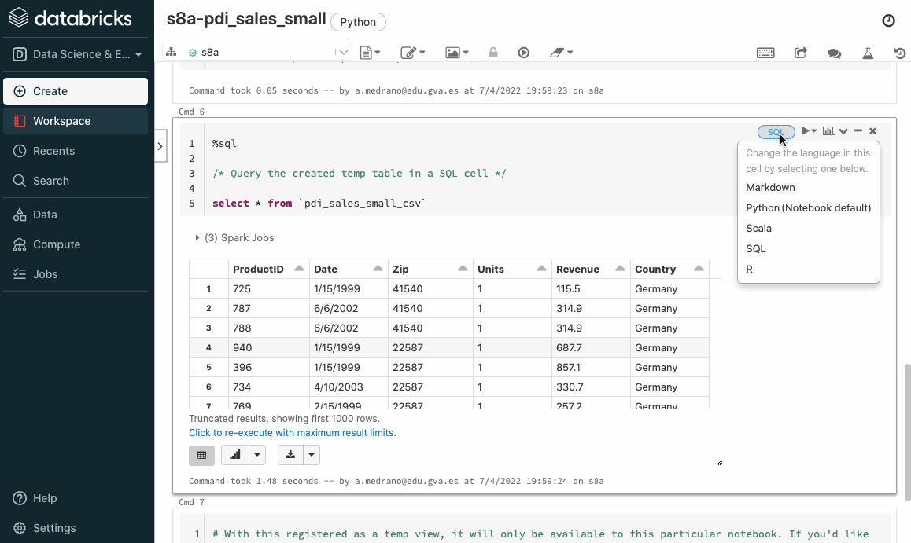
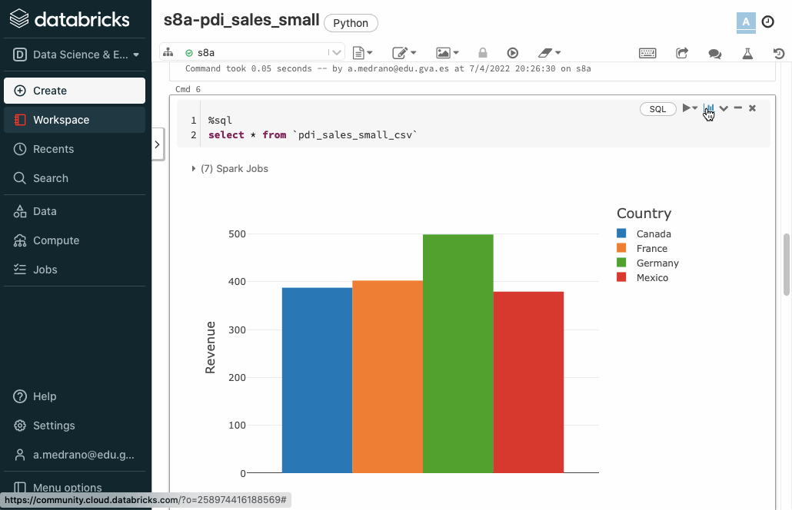
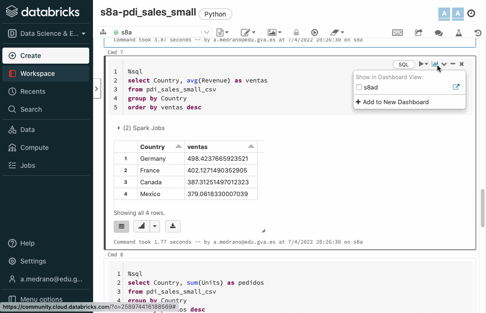

# Spark DataFrames / SQL

En la sesiones anteriores hemos introducido Spark y el uso de RDD para interactuar con los datos. Tal como comentamos, los RDD permiten trabajar a bajo nivel, siendo más cómodo y eficiente hacer uso de *DataFrames* y el lenguaje SQL.

## DataFrames

Un *DataFrame* es una estructura equivalente a una tabla de base de datos relacional, con un motor bien optimizado para el trabajo en un clúster. Los datos se almacenan en filas y columnas y ofrece un conjunto de operaciones para manipular los datos.

El trabajo con *DataFrames* es más sencillo y eficiente que el procesamiento con RDD, por eso su uso es predominante en los nuevos desarrollos con *Spark*.

A continuación veremos cómo podemos obtener y persistir *DataFrames* desde diferentes fuentes y formatos de datos

### Creando Dataframes

El caso más básico es crear un *DataFrame* a partir de un RDD mediante [`toDF`](https://spark.apache.org/docs/latest/api/python/reference/pyspark.sql/api/pyspark.sql.DataFrame.toDF.html):

``` python
from pyspark.sql import SparkSession

spark = SparkSession.builder.getOrCreate() # SparkSession de forma programativa
# Creamos un RDD
datos = [("Aitor", 182), ("Pedro", 178), ("Marina", 161)]
rdd = spark.sparkContext.parallelize(datos)
# Creamos un DataFrame y mostramos su esquema
dfRDD = rdd.toDF()
dfRDD.printSchema()
```

Y mediante [`printSchema`](https://spark.apache.org/docs/latest/api/python/reference/pyspark.sql/api/pyspark.sql.DataFrame.printSchema.html) obtenemos un resumen del esquema del *DataFrame* , donde para cada columna se indica el nombre, el tipo y si admite valores nulos:

``` text
root
 |-- _1: string (nullable = true)
 |-- _2: long (nullable = true)
```

Podemos ver como los nombres de las columnas son `_1` y `_2`. Para asignarle un nombre adecuado podemos pasarle una lista con los nombres a la hora de crear el *DataFrame*:

``` python
columnas = ["nombre","altura"]
dfRDD = rdd.toDF(columnas)
dfRDD.printSchema()
```

Y ahora obtenemos:

``` text
root
 |-- nombre: string (nullable = true)
 |-- altura: long (nullable = true)
```

Si queremos mostrar sus datos, haremos uso del método `show`:

``` bash
df.show()
```

Obteniendo una vista de los datos en forma de tabla:

``` text
+------+------+
|nombre|altura|
+------+------+
| Aitor|   182|
| Pedro|   178|
|Marina|   161|
+------+------+
```

También podemos crear un *DataFrame* directamente desde una *SparkSession* sin crear un RDD previamente mediante el método [`createDataFrame`](https://spark.apache.org/docs/latest/api/python/reference/pyspark.sql/api/pyspark.sql.SparkSession.createDataFrame.html):

``` python
# También podemos crear un DF desde SparkSession
dfDesdeDatos = spark.createDataFrame(datos).toDF(*columnas)
dfDesdeDatos.printSchema()
```

### Mostrando los datos

Para los siguientes apartados, supongamos que queremos almacenar ciertos datos de clientes, como son su nombre y apellidos, ciudad y sueldo:

``` python
clientes = [
    ("Aitor", "Medrano", "Elche", 3000),
    ("Pedro", "Casas", "Elche", 4000),
    ("Laura", "García", "Elche", 5000), 
    ("Miguel", "Ruiz", "Torrellano", 6000),
    ("Isabel", "Guillén", "Alicante", 7000)
]
columnas = ["nombre","apellidos", "ciudad", "sueldo"]
df = spark.createDataFrame(clientes, columnas)
```

Para mostrar los datos, ya hemos visto que podemos utilizar el método `show`, al cual le podemos indicar o no la cantidad de registros a recuperar, así como si queremos que los datos se trunquen o no, o si los queremos mostrar en vertical:

``` python
df.show(2)
# +------+---------+------+------+
# |nombre|apellidos|ciudad|sueldo|
# +------+---------+------+------+
# | Aitor|  Medrano| Elche|  3000|
# | Pedro|    Casas| Elche|  4000|
# +------+---------+------+------+
# only showing top 2 rows
df.show(truncate=False)
# +------+---------+----------+------+
# |nombre|apellidos|ciudad    |sueldo|
# +------+---------+----------+------+
# |Aitor |Medrano  |Elche     |3000  |
# |Pedro |Casas    |Elche     |4000  |
# |Laura |García   |Elche     |5000  |
# |Miguel|Ruiz     |Torrellano|6000  |
# |Isabel|Guillén  |Alicante  |7000  |
# +------+---------+----------+------+
df.show(3, vertical=True)
# -RECORD 0------------
#  nombre    | Aitor   
#  apellidos | Medrano 
#  ciudad    | Elche   
#  sueldo    | 3000    
# -RECORD 1------------
#  nombre    | Pedro   
#  apellidos | Casas   
#  ciudad    | Elche   
#  sueldo    | 4000    
# -RECORD 2------------
#  nombre    | Laura   
#  apellidos | García  
#  ciudad    | Elche   
#  sueldo    | 5000    
# only showing top 3 rows
```

Si sólo queremos recuperar unos pocos datos, podemos hacer uso de [head](https://spark.apache.org/docs/latest/api/python/reference/pyspark.sql/api/pyspark.sql.DataFrame.head.html) o [first](https://spark.apache.org/docs/latest/api/python/reference/pyspark.sql/api/pyspark.sql.DataFrame.first.html) los cuales devuelven objetos [Row](https://spark.apache.org/docs/latest/api/python/reference/pyspark.sql/api/pyspark.sql.Row.html):

``` python
df.first()
# Row(nombre='Aitor', apellidos='Medrano', ciudad='Elche', sueldo=3000)
df.head()
# Row(nombre='Aitor', apellidos='Medrano', ciudad='Elche', sueldo=3000)
df.head(3)
# [Row(nombre='Aitor', apellidos='Medrano', ciudad='Elche', sueldo=3000),
#  Row(nombre='Pedro', apellidos='Casas', ciudad='Elche', sueldo=4000),
#  Row(nombre='Laura', apellidos='García', ciudad='Elche', sueldo=5000)]
```

Si queremos obtener un valor en concreto, una vez recuperada una fila, podemos acceder a sus columnas:

``` python
nom1 = df.first()[0]           # 'Aitor'
nom2 = df.first()["nombre"]    # 'Aitor'
```

También podemos obtener un sumario de los datos (igual que con *Pandas*) mediante [describe](https://spark.apache.org/docs/latest/api/python/reference/pyspark.sql/api/pyspark.sql.DataFrame.describe.html):

``` python
df.describe().show()
# +-------+------+---------+----------+------------------+
# |summary|nombre|apellidos|    ciudad|            sueldo|
# +-------+------+---------+----------+------------------+
# |  count|     5|        5|         5|                 5|
# |   mean|  null|     null|      null|            5000.0|
# | stddev|  null|     null|      null|1581.1388300841897|
# |    min| Aitor|    Casas|  Alicante|              3000|
# |    max| Pedro|     Ruiz|Torrellano|              7000|
# +-------+------+---------+----------+------------------+
```

Si únicamente nos interesa saber cuantas filas tiene nuestro *DataFrame*, podemos hacer uso de [count](https://spark.apache.org/docs/latest/api/python/reference/pyspark.sql/api/pyspark.sql.DataFrame.count.html):

``` python
df.count()  # 5
```

Por último, como un *DataFrame* por debajo es un RDD, podemos usar `collect` y `take` conforme necesitemos y recuperar objetos de tipo [Row](https://spark.apache.org/docs/latest/api/python/reference/pyspark.sql/api/pyspark.sql.Row.html):

``` python
df.collect()
# [Row(nombre='Aitor', apellidos='Medrano', ciudad='Elche', sueldo=3000),
#  Row(nombre='Pedro', apellidos='Casas', ciudad='Elche', sueldo=4000),
#  Row(nombre='Laura', apellidos='García', ciudad='Elche', sueldo=5000),
#  Row(nombre='Miguel', apellidos='Ruiz', ciudad='Torrellano', sueldo=6000),
#  Row(nombre='Isabel', apellidos='Guillén', ciudad='Alicante', sueldo=7000)]
df.take(2)
# [Row(nombre='Aitor', apellidos='Medrano', ciudad='Elche', sueldo=3000),
#  Row(nombre='Pedro', apellidos='Casas', ciudad='Elche', sueldo=4000)]
nom = df.collect()[0][0]        # 'Aitor'
```

### Cargando diferentes formatos

Lo más usual es cargar los datos desde una archivo externo. Para ello, mediante el API de *DataFrameReader* cargaremos los datos directamente en un *Dataframe* mediante diferentes métodos dependiendo del formato (admite tanto el nombre de un recurso como una ruta de una carpeta).

Para cada formato, existe un método corto que se llama como el formato en sí, y un método general donde mediante `format` indicamos el formato y que finaliza con el método `load` siempre dentro de `spark.read`:

=== "CSV"

    ``` python hl_lines="1 7"
    dfCSV = spark.read.csv("datos.csv")
    dfCSV = spark.read.csv("datos/*.csv")   # Una carpeta entera
    dfCSV = spark.read.option("sep", ";").csv("datos.csv")
    dfCSV = spark.read.option("header", "true").csv("datos.csv")
    dfCSV = spark.read.option("header", True).option("inferSchema", True).csv("datos.csv")
    dfCSV = spark.read.options(sep=";", header=True, inferSchema=True).csv("pdi_sales.csv")
    dfCSV = spark.read.format("csv").load("datos.csv") 
    dfCSV = spark.read.load(format="csv", header="true", inferSchema="true").csv("datos.csv")
    ```

    Más información en la [documentación oficial](https://spark.apache.org/docs/latest/sql-data-sources-csv.html)

=== "TXT"

    ``` python
    dfTXT = spark.read.text("datos.txt")
    # cada fichero se lee entero como un registro
    dfTXT = spark.read.option("wholetext", true).text("datos/")
    
    dfTXT = spark.read.format("txt").load("datos.txt")
    ```

    Más información en la [documentación oficial](https://spark.apache.org/docs/latest/sql-data-sources-text.html)

=== "JSON"

    ``` python
    dfJSON = spark.read.json("datos.json")
    dfJSON = spark.read.format("json").load("datos.json")
    ```

    Más información en la [documentación oficial](https://spark.apache.org/docs/latest/sql-data-sources-json.html)

    !!! caution "DataFrames desde JSON"
        *Spark* espera que cada documento JSON ocupe una única línea. Si cada documento ocupa más de una línea, se lo indicamos mediante la opción `multiline`:

        ``` python
        df = spark.read.option("multiline",True).option("inferSchema", "true").json("datos.json")
        ```

=== "Parquet"

    ``` python
    dfParquet = spark.read.parquet("datos.parquet")
    dfParquet = spark.read.format("parquet").load("datos.parquet")
    ```

    Más información en la [documentación oficial](https://spark.apache.org/docs/latest/sql-data-sources-parquet.html)

Si lo que queremos es persistir los datos, en vez de `read`, utilizaremos `write` y si usamos la forma general usaremos el método `save`:

=== "CSV"

    ``` python
    dfCSV.write.csv("datos.csv")
    dfCSV.write.format("csv").save("datos.csv")
    dfCSV.write.format("csv").mode("overwrite").save("datos.csv")
    ```

    Más información en la [documentación oficial](https://spark.apache.org/docs/latest/sql-data-sources-csv.html)

=== "TXT"

    ``` python
    dfTXT.write.text("datos.txt")
    dfTXT.write.option("lineSep",";").text("datos.txt")
    dfTXT.write.format("txt").save("datos.txt")
    ```

    Más información en la [documentación oficial](https://spark.apache.org/docs/latest/sql-data-sources-text.html)

=== "JSON"

    ``` python
    dfJSON.write.json("datos.json")
    dfJSON.write.format("json").save("datos.json")
    ```

    Más información en la [documentación oficial](https://spark.apache.org/docs/latest/sql-data-sources-json.html)

=== "Parquet"

    ``` python
    dfParquet.write.parquet("datos.parquet")
    dfParquet.write.format("json").save("datos.parquet")
    ```

    Más información en la [documentación oficial](https://spark.apache.org/docs/latest/sql-data-sources-parquet.html)

!!! tip "Un único archivo de salida"
    Por cada partición, Spark generará un archivo de salida. Recuerda que podemos [reducir el número de particiones](01rdd.md#modificando-las-particiones) mediante [coalesce](https://spark.apache.org/docs/latest/api/python/reference/pyspark.sql/api/pyspark.RDD.coalesce.html) o [repartition](https://spark.apache.org/docs/latest/api/python/reference/pyspark.sql/api/pyspark.RDD.repartition.html).

Una vez vista la sintaxis, vamos a ver un ejemplo completo de lectura de un archivo CSV (el archivo [`pdi_sales.csv`](resources/pdi_sales.csv) que hemos utilizado durante todo el curso) que está almacenado en HDFS y que tras leerlo, lo guardamos como JSON de nuevo en HDFS:

``` python
from pyspark.sql import SparkSession

spark = SparkSession.builder.appName("s8a-dataframe-csv").getOrCreate()

# Lectura de CSV con el ; como separador de columnas y con encabezado
df = spark.read.option("delimiter",";").option("header", "true").csv("hdfs://iabd-virtualbox:9000/user/iabd/pdi_sales.csv")

# df.printSchema()

df.write.json("hdfs://iabd-virtualbox:9000/user/iabd/pdi_sales_json")
```

Es conveniente destacar que para acceder a HDFS, únicamente hemos de indicar la URL del recurso con el prefijo `hdfs://` más el host del *namenode*.

### Comprimiendo los datos

Para configurar el algoritmo de compresión, si los datos está en Parquet o Avro, a nivel de la sesión de Spark, podemos realizar su configuración:

``` python
spark.setConf("spark.sql.parquet.compression.codec","snappy")
spark.setConf("spark.sql.parquet.compression.codec","none")
spark.setConf("spark.sql.avro.compression.codec","snappy")
```

Si sólo queremos hacerlo para una operación en particular, para cada lectura/escritura le añadimos `.option("compression", "algoritmo")`. Por ejemplo:

``` python
dfVentas = spark.read.option("compression", "snappy").option("delimiter",";").option("header", "true").csv("pdi_sales.csv")
dfClientes = spark.read.option("compression", "snappy").parquet("clientes.parquet")
dfVentas.write.option("compression", "snappy").format("avro").save("ventas.avro")
```

## Datos y Esquemas

El esquema completo de un *DataFrame* se modela mediante un `StructType`, el cual contiene una colección de objetos `StructField`.
Así pues, cada columna de un *DataFrame* de *Spark* se modela mediante un objeto `StructField` indicando su nombre, tipo y gestión de los nulos.

Hemos visto que al crear un *DataFrame* desde un archivo externo, podemos inferir el esquema. Si queremos crear un *DataFrame* desde un esquema propio utilizaremos los tipos `StructType`, `StructField`, así como `StringType`, `IntegerType` o el tipo necesario para cada columna. Para ello, primero hemos de importarlos (como puedes observar, estas clases pertenecen a las librerías SQL de *PySpark*):

``` python
from pyspark.sql import SparkSession
from pyspark.sql.types import StructType, StructField, StringType, IntegerType
```

!!! info "Tipos"
    Además de cadenas y enteros, flotantes (`FloatType`) o dobles (`DoubleType`), tenemos tipos booleanos (`BooleanType`), de fecha (DateType y TimestampType), así como tipos complejos como `ArrayType`, `MapType` y `StructType`.
    Para más información, consultar la [documentación oficial](https://spark.apache.org/docs/latest/sql-ref-datatypes.html).

Volvamos al ejemplo anterior donde tenemos ciertos datos de clientes, como son su nombre y apellidos, ciudad y sueldo:

``` python
clientes = [
    ("Aitor", "Medrano", "Elche", 3000),
    ("Pedro", "Casas", "Elche", 4000),
    ("Laura", "García", "Elche", 5000), 
    ("Miguel", "Ruiz", "Torrellano", 6000),
    ("Isabel", "Guillén", "Alicante", 7000)
]
```

Para esta estructura, definiremos un esquema con los campos, indicando para cada uno de ellos su nombre, tipo y si admite valores nulos:

``` python
esquema = StructType([
    StructField("nombre", StringType(), False),
    StructField("apellidos", StringType(), False),
    StructField("ciudad", StringType(), True),
    StructField("sueldo", IntegerType(), False)
])
```

A continuación ya podemos crear un *DataFrame* con datos propios que cumplen un esquema haciendo uso del método `createDataFrame`:

``` python
df = spark.createDataFrame(data=clientes, schema=esquema)
df.printSchema()
# root
#  |-- nombre: string (nullable = false)
#  |-- apellidos: string (nullable = false)
#  |-- ciudad: string (nullable = true)
#  |-- sueldo: integer (nullable = false)
df.show(truncate=False)
# +------+---------+----------+------+
# |nombre|apellidos|ciudad    |sueldo|
# +------+---------+----------+------+
# |Aitor |Medrano  |Elche     |3000  |
# |Pedro |Casas    |Elche     |4000  |
# |Laura |García   |Elche     |5000  |
# |Miguel|Ruiz     |Torrellano|6000  |
# |Isabel|Guillén  |Alicante  |7000  |
# +------+---------+----------+------+
```

Si lo que queremos es asignarle un esquema a un *DataFrame* que vamos a leer desde una fuente de datos externa, hemos de emplear el método `schema`:

``` python
dfClientes = spark.read.option("header", True).schema(esquema).csv("clientes.csv")
```

!!! tip "Rendimiento y esquema"
    La inferencia de los tipos de los datos es un proceso computacionalmente costoso. Por ello, si nuestro conjunto de datos es grande, es muy recomendable crear el esquema de forma programativa y configurarlo en la carga de datos.

    Se recomienda la lectura del artículo [Using schemas to speed up reading into Spark DataFrames](https://t-redactyl.io/blog/2020/08/using-schemas-to-speed-up-reading-into-spark-dataframes.html).

Respecto al esquema, tenemos diferentes propiedades como `columns`, `dtypes` y `schema` con las que obtener su información:

``` python
df.columns
# ['nombre', 'apellidos', 'ciudad', 'sueldo']
df.dtypes
# [('nombre', 'string'),
#  ('apellidos', 'string'),
#  ('ciudad', 'string'),
#  ('sueldo', 'int')]
df.schema
# StructType(List(StructField(nombre,StringType,false),StructField(apellidos,StringType,false),StructField(ciudad,StringType,true),StructField(sueldo,IntegerType,false)))
```

Si una vez hemos cargado un *DataFrame* queremos cambiar el tipo de una de sus columnas, podemos hacer uso del método `withColumn`:

``` python
# Forma larga
from pyspark.sql.types import DoubleType
df = df.withColumn("sueldo", df.sueldo.cast(DoubleType())
# Forma corta
df = df.withColumn("sueldo", df.sueldo.cast("double"))

# df = df.withColumn("fnac", to_date(df.Date, "M/d/yyy"))
```

## DataFrame API

Una vez tenemos un *DataFrame* podemos trabajar con los datos mediante un conjunto de operaciones estructuradas, muy similares al lenguaje relacional. Estas operaciones también se clasifican en transformaciones y acciones, recordando que las transformaciones utilizan una evaluación perezosa.

Es muy importante tener en cuenta que todas las operaciones que vamos a realizar a continuación son immutables, es decir, nunca van a modificar el *DataFrame* sobre el que realizamos la transformación. Así pues, realizaremos encadenamiento de transformaciones (*transformation chaining*) o asignaremos el resultado a un nuevo *DataFrame*.

!!! tip "Preparación"

    Para los siguientes apartados, vamos a trabajar sobre el siguiente *DataFrame* con el fichero de [ventas](resources/pdi_sales_small.csv) que hemos utilizado a lo largo del curso:

    ```  python
    from pyspark.sql import SparkSession

    spark = SparkSession.builder.appName("s8a-dataframes-api").getOrCreate()
    # Lectura de CSV con el ; como separador de columnas y con encabezado
    df = spark.read.option("sep",";").option("header", "true").option("inferSchema", "true").csv("pdi_sales_small.csv")
    df.printSchema()
    ```

    El esquema generado es:

    ``` text
    root
    |-- ProductID: integer (nullable = true)
    |-- Date: string (nullable = true)
    |-- Zip: string (nullable = true)
    |-- Units: integer (nullable = true)
    |-- Revenue: double (nullable = true)
    |-- Country: string (nullable = true)
    ```

### Proyectando

La operación [select](https://spark.apache.org/docs/latest/api/python/reference/pyspark.sql/api/pyspark.sql.DataFrame.select.html) permite indicar las columnas a recuperar pasándolas como parámetros:

=== "Consulta de columnas"

    ``` python
    df.select("ProductID","Revenue").show(3)
    ```

=== "Resultado"

    ``` text
    +---------+-------+
    |ProductID|Revenue|
    +---------+-------+
    |      725|  115.5|
    |      787|  314.9|
    |      788|  314.9|
    +---------+-------+
    only showing top 3 rows
    ```

También podemos realizar cálculos (referenciando a los campos con `nombreDataframe.nombreColumna`) sobre las columnas y crear un alias (operación asociada a un campo):

=== "Cálculos y creación de alias"

    ``` python
    df.select(df.ProductID,(df.Revenue+10).alias("VentasMas10")).show(3)
    ```

=== "Resultado"

    ``` text
    +---------+-----------+
    |ProductID|VentasMas10|
    +---------+-----------+
    |      725|      125.5|
    |      787|      324.9|
    |      788|      324.9|
    +---------+-----------+
    only showing top 3 rows
    ```

Si tenemos un *DataFrame* con un gran número de columnas y queremos recuperarlas todas a excepción de unas pocas, es más cómodo utilizar la transformación [drop](https://spark.apache.org/docs/latest/api/python/reference/pyspark.sql/api/pyspark.sql.DataFrame.drop.html), la cual funciona de manera opuesta a `select`, es decir, indicando las columnas que queremos quitar del resultado:

``` python
# Obtenemos el mismo resultado
df.select("ProductID", "Date", "Zip")
df.drop("Units", "Revenue", "Country")
```

### Trabajando con columnas

Para acceder a las columnas, debemos crear objetos [Column](https://spark.apache.org/docs/latest/api/python/reference/pyspark.sql/column.html). Para ello, podemos seleccionarlos a partir de un *DataFrame* como una propiedad o mediante la función [col](https://spark.apache.org/docs/latest/api/python/reference/pyspark.sql/api/pyspark.sql.functions.col.html):

``` python
nomCliente = df.nombre
nomCliente = df["ProductID"]
nomCliente = col("ProductID")
```

Así pues, podemos recuperar ciertas columnas de un DataFrame con cualquier de las siguientes expresiones:

``` python
from pyspark.sql.functions import col

df.select("ProductID", "Revenue").show()
df.select(df.ProductID, df.Revenue).show()
df.select(df["ProductID"], df["Revenue"]).show()
df.select(col("ProductID"), col("Revenue")).show()
```

https://spark.apache.org/docs/latest/api/python/reference/pyspark.sql/api/pyspark.sql.DataFrame.join.html

#### col vs expr

En ocasiones se confunde el uso de la función [`col`](https://spark.apache.org/docs/latest/api/python/reference/pyspark.sql/api/pyspark.sql.functions.col.html) con [`expr`](https://spark.apache.org/docs/latest/api/python/reference/pyspark.sql/api/pyspark.sql.functions.expr.html). Aunque podemos referenciar a una columna haciendo uso de `expr`, su uso provoca que se parseé la cadena recibida para interpretarla.

Para el siguiente ejemplo, supongamos que tenemos un *DataFrame* con datos de clientes. Utilizaremos también la función [concat_ws](https://spark.apache.org/docs/latest/api/python/reference/pyspark.sql/api/pyspark.sql.functions.concat_ws.html) para concatenar textos utilizado un separador.

``` python
from pyspark.sql.functions import col,expr

df.select(concat_ws(" ", col("nombre"), col("apellidos")).alias("nombreCompleto"),
          "sueldo",
          (col("sueldo")*1.1).alias("nuevoSueldo")).show() 
df.select(concat_ws(" ", col("nombre"), col("apellidos")).alias("nombreCompleto"),
          "sueldo",
          expr("sueldo*1.1").alias("nuevoSueldo")).show() 
```

#### Añadiendo columnas

Una vez tenemos un *DataFrame*, podemos añadir columnas mediante el método [withColumn](https://spark.apache.org/docs/latest/api/python/reference/pyspark.sql/api/pyspark.sql.DataFrame.withColumn.html):

``` python
dfNuevo = df.withColumn("total", df.Units * df.Revenue)
dfNuevo.show()
# +---------+----------+---------------+-----+-------+-------+------+
# |ProductID|      Date|            Zip|Units|Revenue|Country| total|
# +---------+----------+---------------+-----+-------+-------+------+
# |      725|1999-01-15|41540          |    1|  115.5|Germany| 115.5|
# |      787|2002-06-06|41540          |    1|  314.9|Germany| 314.9|
# |      788|2002-06-06|41540          |    1|  314.9|Germany| 314.9|
# |      901|1999-02-15|13587          |    2|  818.9|Germany|1637.8|
# ...
```

!!! info "withColumn"
    Anteriormente hemos utilizado el método `withColumn` para cambiarle el tipo a un campo ya existente. Así pues, si referenciamos a una columna que ya existe, en vez de crearla, la sustituirá.

Otra forma de añadir una columna con una expresión es mediante la transformación [`selectExpr`](https://spark.apache.org/docs/latest/api/python/reference/pyspark.sql/api/pyspark.sql.DataFrame.selectExpr.html). Por ejemplo, podemos conseguir el mismo resultado que en el ejemplo anterior de la siguiente manera:

``` python
df.selectExpr("*", "Units * Revenue as total").show()`
# +---------+----------+---------------+-----+-------+-------+------+
# |ProductID|      Date|            Zip|Units|Revenue|Country| total|
# +---------+----------+---------------+-----+-------+-------+------+
# |      725|1999-01-15|41540          |    1|  115.5|Germany| 115.5|
# |      787|2002-06-06|41540          |    1|  314.9|Germany| 314.9|
# |      788|2002-06-06|41540          |    1|  314.9|Germany| 314.9|
# |      901|1999-02-15|13587          |    2|  818.9|Germany|1637.8|
# ...
```

Aunque más adelante veremos como realizar transformaciones con agregaciones, mediante `selectExpr` también podemos realizar analítica de datos aprovechando la potencia de SQL:

``` python
df.selectExpr("count(distinct(ProductID)) as productos","count(distinct(Country)) as paises").show()
# +---------+------+
# |productos|paises|
# +---------+------+
# |      799|     4|
# +---------+------+
```

#### Cambiando el nombre

Si por algún extraño motivo necesitamos cambiarle el nombre a una columna (por ejemplo, vamos a unir dos *DataFrames* que tienen columnas con el mismo nombre pero en posiciones diferentes, o que al inferir el esquema tenga un nombre críptico o demasiado largo y queremos que sea más legible) podemos utilizar la transformación [withColumnRenamed](https://spark.apache.org/docs/latest/api/python/reference/pyspark.sql/api/pyspark.sql.DataFrame.withColumnRenamed.html):

``` python
df.withColumnRenamed("Zip", "PostalCode").show(5)
# +---------+----------+---------------+-----+-------+-------+
# |ProductID|      Date|     PostalCode|Units|Revenue|Country|
# +---------+----------+---------------+-----+-------+-------+
# |      725|1999-01-15|41540          |    1|  115.5|Germany|
# |      787|2002-06-06|41540          |    1|  314.9|Germany|
# |      788|2002-06-06|41540          |    1|  314.9|Germany|
# |      940|1999-01-15|22587          |    1|  687.7|Germany|
# |      396|1999-01-15|22587          |    1|  857.1|Germany|
# +---------+----------+---------------+-----+-------+-------+
# only showing top 5 rows
```

### Filtrando

Si queremos eliminar filas, usaremos el método [filter](https://spark.apache.org/docs/latest/api/python/reference/pyspark.sql/api/pyspark.sql.DataFrame.filter.html):

``` python
df.filter(df.Country=="Germany").show()
# +---------+----------+---------------+-----+-------+-------+
# |ProductID|      Date|            Zip|Units|Revenue|Country|
# +---------+----------+---------------+-----+-------+-------+
# |      725|1999-01-15|41540          |    1|  115.5|Germany|
# |      787|2002-06-06|41540          |    1|  314.9|Germany|
# |      788|2002-06-06|41540          |    1|  314.9|Germany|
# |      940|1999-01-15|22587          |    1|  687.7|Germany|
```

Por similitud con SQL, podemos utilizar también `where` como un alias de `filter`:

``` python
df.where(df.Units>20).show()
# +---------+----------+---------------+-----+-------+-------+
# |ProductID|      Date|            Zip|Units|Revenue|Country|
# +---------+----------+---------------+-----+-------+-------+
# |      495|1999-03-15|75213 CEDEX 16 |   77|43194.1| France|
# |     2091|1999-05-15|9739           |   24| 3652.7| Mexico|
# |     2091|1999-06-15|40213          |   41| 6240.1|Germany|
# |     2091|1999-10-15|40213          |   41| 6347.7|Germany|
# |     2091|1999-12-15|40213          |   23| 3560.9|Germany|
# +---------+----------+---------------+-----+-------+-------+
```

Podemos utilizar los operadores lógicos (`&` para conjunción y `|` para la disyunción) para crear condiciones compuestas (recordad rodear cada condición entre paréntesis):

``` python
df.filter((df.Country=="Germany") & (df.Units>20)).show()
# +---------+----------+---------------+-----+-------+-------+
# |ProductID|      Date|            Zip|Units|Revenue|Country|
# +---------+----------+---------------+-----+-------+-------+
# |     2091|1999-06-15|40213          |   41| 6240.1|Germany|
# |     2091|1999-10-15|40213          |   41| 6347.7|Germany|
# |     2091|1999-12-15|40213          |   23| 3560.9|Germany|
# +---------+----------+---------------+-----+-------+-------+
df.filter((df.ProductID==2314) | (df.ProductID==1322)).show()
# +---------+----------+---------------+-----+-------+-------+
# |ProductID|      Date|            Zip|Units|Revenue|Country|
# +---------+----------+---------------+-----+-------+-------+
# |     2314|1999-05-15|46045          |    1|   13.9|Germany|
# |     1322|2000-01-06|75593 CEDEX 12 |    1|  254.5| France|
# +---------+----------+---------------+-----+-------+-------+
```

Un caso particular de filtrado es la eliminación de los registros repetidos, lo cual lo podemos hacer de dos maneras:

* Haciendo uso del método [distinct](https://spark.apache.org/docs/latest/api/python/reference/pyspark.sql/api/pyspark.sql.DataFrame.distinct.html) tras haber realizado alguna transformación
* Utilizando [dropDuplicates](https://spark.apache.org/docs/latest/api/python/reference/pyspark.sql/api/pyspark.sql.DataFrame.dropDuplicates.html) sobre un *DataFrame*:

``` python
df.select("Country").distinct().show()
df.dropDuplicates(["Country"]).select("Country").show()
# +-------+
# |Country|
# +-------+
# |Germany|
# | France|
# | Mexico|
# | Canada|
# +-------+
```

### Ordenando

Una vez recuperados los datos deseados, podemos ordenarlos mediante [sort](https://spark.apache.org/docs/latest/api/python/reference/pyspark.sql/api/pyspark.sql.DataFrame.sort.html) u [orderBy](https://spark.apache.org/docs/latest/api/python/reference/pyspark.sql/api/pyspark.sql.DataFrame.orderBy.html) (son operaciones totalmente equivalentes):

``` python
df.select("ProductID","Revenue").sort("Revenue").show(5)
df.sort("Revenue").show(5)
df.sort("Revenue", ascending=True).show(5)
df.sort(df.Revenue.asc()).show(5)

# Ordenación descendiente
df.sort(df.Revenue.desc()).show(5)
df.sort("Revenue", ascending=False).show(5)
from pyspark.sql.functions import desc

# Ordenación diferente en cada columna
df.sort(df.Revenue.desc(), df.Units.asc()).show(5)
df.sort(["Revenue","Units"], ascending=[0,1]).show(5)
```

Por ejemplo, con la última operación obtendríamos:

``` text
+---------+----------+---------------+-----+-------+-------+
|ProductID|      Date|            Zip|Units|Revenue|Country|
+---------+----------+---------------+-----+-------+-------+
|      495|1999-03-15|75213 CEDEX 16 |   77|43194.1| France|
|      495|2000-03-01|75391 CEDEX 08 |   18|10395.0| France|
|      464|2003-06-11|75213 CEDEX 16 |   16|10075.8| France|
|      464|2000-08-01|22397          |   17| 9817.5|Germany|
|      495|2000-03-01|06175 CEDEX 2  |   16| 9240.0| France|
+---------+----------+---------------+-----+-------+-------+
only showing top 5 rows
```

Normalmente, tras realizar una ordenación, es habitual quedarse con un subconjunto de los datos. Para ello, podemos utilizar la transformación [limit](https://spark.apache.org/docs/latest/api/python/reference/pyspark.sql/api/pyspark.sql.DataFrame.limit.html).

Por ejemplo, la siguiente transformación es similar al ejemplo anterior, sólo que ahora al driver únicamente le llegan 5 registros, en vez de traerlos todos y sólo mostrar 5:

``` python
df.sort(df.Revenue.desc(), df.Units.asc()).limit(5).show()
```

### Añadiendo filas

La única manera de añadir filas a un *DataFrame* es creando uno nuevo que sea el resultado de unir dos *DataFrames* que compartan el mismo esquema (mismo nombres de columnas y en el mismo orden). Para ello, utilizaremos la transformación [union](https://spark.apache.org/docs/latest/api/python/reference/pyspark.sql/api/pyspark.sql.DataFrame.union.html) que realiza la unión por el orden de las columnas:

``` python
nuevasVenta = [
    (6666, "2022-03-24", "03206", 33, 3333.33, "Spain"),
    (6666, "2022-03-25", "03206", 22, 2222.22, "Spain"),
]
# Creamos un nuevo DataFrame con las nuevas Ventas
nvDF = spark.createDataFrame(nuevasVenta)
# Unimos los dos DataFrames
dfUpdated = df.union(nvDF)
```

### Cogiendo muestras

Si necesitamos recoger un subconjunto de los datos, ya sea para preparar los datos para algún modelo de *machine learning* como para una muestra aleatoria de los mismos, podemos utilizar las siguientes transformaciones:

* [sample](https://spark.apache.org/docs/latest/api/python/reference/pyspark.sql/api/pyspark.sql.DataFrame.sample.html) permite obtener una muestra a partir de un porcentaje (no tiene porqué obtener una cantidad exacta). También admite un semilla e indicar si queremos que pueda repetir los datos.

    ``` python
    df.count()                  # 120239
    muestra = df.sample(0.10)
    muestra.count()             # 11876
    muestraConRepetidos = df.sample(True, 0.10)
    muestraConRepetidos.count() # 11923
    ```

* [randomSplit](https://spark.apache.org/docs/latest/api/python/reference/pyspark.sql/api/pyspark.sql.DataFrame.randomSplit.html) recupera diferentes *DataFrames* cuyos tamaños en porcentaje se indican como parámetros (si no suman uno, los parámetros se normalizan):

    ``` python
    dfs = df.randomSplit([0.8, 0.2])
    dfEntrenamiento = dfs[0]
    dfPrueba = dfs[1]
    dfEntrenamiento.count()     # 96194
    dfPrueba.count()            # 24045
    ```

<!--
* [sampleBy](https://spark.apache.org/docs/latest/api/python/reference/pyspark.sql/api/pyspark.sql.DataFrame.sampleBy.html)
-->

## Trabajando con datos sucios

Hay tres formas de gestionar la suciedad de los datos o la omisión completa de los mismos:

1. Eliminar las filas que tienen valores vacíos en una o más columnas.
2. Rellenar los valores nulos con valores que definimos nosotros.
3. Sustituir los datos erróneos por algún valor que sepamos como gestionarlo.

Vamos a ver cada uno de estos casos a partir del siguiente *dataset*:

``` python
malasVentas = [
    (6666, "2022-03-22", "03206", 33, 3333.33, "Spain"),
    (6666, "2022-03-22", None, 33, 3333.33, "Spain"),
    (6666, "2022-03-23", "03206", None, 2222.22, "Spain"),
    (6666, "2022-03-24", "03206", None, None, "Espain"),
    (None, None, None, None, None, None)
]
malDF = spark.createDataFrame(malasVentas, ["ProductID", "Date", "Zip", "Units", "Revenue" , "Country"])
malDF.show()
# +---------+----------+-----+-----+-------+-------+
# |ProductID|      Date|  Zip|Units|Revenue|Country|
# +---------+----------+-----+-----+-------+-------+
# |     6666|2022-03-22|03206|   33|3333.33|  Spain|
# |     6666|2022-03-22| null|   33|3333.33|  Spain|
# |     6666|2022-03-23|03206| null|2222.22|  Spain|
# |     6666|2022-03-24|03206| null|   null| Espain|
# |     6666|2022-03-25|03206| null|2222.22|   null|
# +---------+----------+-----+-----+-------+-------+
```

Si queremos saber si una columna contiene nulos, podemos hacer un filtrado utilizando el método [isNull](https://spark.apache.org/docs/latest/api/python/reference/pyspark.sql/api/pyspark.sql.Column.isNull.html) sobre los campos deseados (también podemos utilizar [isNotNull](https://spark.apache.org/docs/latest/api/python/reference/pyspark.sql/api/pyspark.sql.Column.isNotNull.html) si queremos el caso contrario):

``` python
malDF.filter(malDF.Zip.isNull()).show()
# +---------+----------+----+-----+-------+-------+
# |ProductID|      Date| Zip|Units|Revenue|Country|
# +---------+----------+----+-----+-------+-------+
# |     6666|2022-03-22|null|   33|3333.33|  Spain|
# +---------+----------+----+-----+-------+-------+
```

Para trabajar con las filas que contengan algún dato nulo, podemos acceder a la propiedad `na`, la cual devuelve un [DataFrameNaFunctions](https://spark.apache.org/docs/latest/api/python/reference/pyspark.sql/api/pyspark.sql.DataFrameNaFunctions.html) sobre la que podemos indicarle:

* que la elimine mediante el método [`drop`](https://spark.apache.org/docs/latest/api/python/reference/pyspark.sql/api/pyspark.sql.DataFrameNaFunctions.drop.html) / [`dropna`](https://spark.apache.org/docs/latest/api/python/reference/pyspark.sql/api/pyspark.sql.DataFrame.dropna.html). Puede recibir `"any"` (borrará las filas que contengan algún nulo) o `"all"` (borrará las filas que todas sus columnas contengan nulos) y una lista con las columnas a considerar:

    ``` python
    # Elimina todos los nulos
    malDF.na.drop().show()
    # +---------+----------+-----+-----+-------+-------+
    # |ProductID|      Date|  Zip|Units|Revenue|Country|
    # +---------+----------+-----+-----+-------+-------+
    # |     6666|2022-03-22|03206|   33|3333.33|  Spain|
    # +---------+----------+-----+-----+-------+-------+

    # Elimina las filas que todas sus columnas son nulas
    malDF.na.drop("all").show()
    # +---------+----------+-----+-----+-------+-------+
    # |ProductID|      Date|  Zip|Units|Revenue|Country|
    # +---------+----------+-----+-----+-------+-------+
    # |     6666|2022-03-22|03206|   33|3333.33|  Spain|
    # |     6666|2022-03-22| null|   33|3333.33|  Spain|
    # |     6666|2022-03-23|03206| null|2222.22|  Spain|
    # |     6666|2022-03-24|03206| null|   null| Espain|
    # +---------+----------+-----+-----+-------+-------+

    # Elimina las filas que tienen el Zip nulo
    malDF.na.drop(subset=["Zip"]).show()
    # +---------+----------+-----+-----+-------+-------+
    # |ProductID|      Date|  Zip|Units|Revenue|Country|
    # +---------+----------+-----+-----+-------+-------+
    # |     6666|2022-03-22|03206|   33|3333.33|  Spain|
    # |     6666|2022-03-23|03206| null|2222.22|  Spain|
    # |     6666|2022-03-24|03206| null|   null| Espain|
    # +---------+----------+-----+-----+-------+-------+
    ```

    También podemos indicar la cantidad de nulos que ha de contener cada fila para eliminarla mediante el parámetro `thresh`:

    ``` python
    # Elimina las filas con 3 o más nulos
    malDF.dropna(thresh = 3)
    ```

* que la rellene mediante el método [`fill`](https://spark.apache.org/docs/latest/api/python/reference/pyspark.sql/api/pyspark.sql.DataFrameNaFunctions.fill.html) / [`fillna`](https://spark.apache.org/docs/latest/api/python/reference/pyspark.sql/api/pyspark.sql.DataFrame.fillna.html), indicando el valor y si queremos, sobre qué columnas aplicar la modificación:

    ``` python
    # Rellenamos los zips vacíos por 99999
    malDF.na.fill("99999", subset=["Zip"]).show()
    # malDF.na.fill("99999", ["Zip"]).show()
    # malDF.fillna({"Zip": "99999"})
    # +---------+----------+-----+-----+-------+-------+
    # |ProductID|      Date|  Zip|Units|Revenue|Country|
    # +---------+----------+-----+-----+-------+-------+
    # |     6666|2022-03-22|03206|   33|3333.33|  Spain|
    # |     6666|2022-03-22|99999|   33|3333.33|  Spain|
    # |     6666|2022-03-23|03206| null|2222.22|  Spain|
    # |     6666|2022-03-24|03206| null|   null| Espain|
    # |     null|      null|99999| null|   null|   null|
    # +---------+----------+-----+-----+-------+-------+
    ```

* que la sustituya mediante el método [`replace`](https://spark.apache.org/docs/latest/api/python/reference/pyspark.sql/api/pyspark.sql.DataFrameNaFunctions.replace.html)

    ``` python
    # Cambiamos Espain por Spain
    malDF.na.replace("Espain", "Spain").show()
    # +---------+----------+-----+-----+-------+-------+
    # |ProductID|      Date|  Zip|Units|Revenue|Country|
    # +---------+----------+-----+-----+-------+-------+
    # |     6666|2022-03-22|03206|   33|3333.33|  Spain|
    # |     6666|2022-03-22| null|   33|3333.33|  Spain|
    # |     6666|2022-03-23|03206| null|2222.22|  Spain|
    # |     6666|2022-03-24|03206| null|   null|  Spain|
    # |     null|      null| null| null|   null|   null|
    # +---------+----------+-----+-----+-------+-------+
    ```

Otro caso muy común es realizar una operación sobre una columna para transformar su valor, por ejemplo, pasar todo el texto a minúsculas o dividir una columna entre 100 para cambiar la escala.

En nuestro caso, vamos a modificar las columnas *Zip* y *Country* para realizar un `trim` y borrar los espacios en blanco:

``` python
from pyspark.sql.functions import col, trim
df = df.withColumn("Country", trim(col("Country"))).withColumn("Zip", trim(col("Zip")))
```

## Usando SQL

En la era del big data SQL es la lengua franca, permitiendo a perfiles con pocos conocimientos de programación trabajar de forma eficiente con los datos (siempre poniendo el foco en la analítica de datos, no en el procesamiento transaccional).

*Spark* soporta el ANSI SQL 2003, ampliamente establecido en el mundo de las bases de datos.

Para correr SQL en *Spark* podemos hacerlo a través de:

* El cliente SQL, es cual se ofrece como un comando en `./bin/spark-sql`
* Mediante un servidor ODBC/JDBC
* De forma programativa mediante aplicaciones *Spark*.

Las dos primeras opciones se integran con *Apache Hive* para utilizar su *metastore*. Ahora nos vamos a centrar en la última.

### Vistas temporales

Ya hemos visto que los *DataFrames* tienen una estructura similar a una tabla de una base de datos relacional. Para poder realizar consultas, necesitaremos crear vistas temporales mediante el método [`createTempView`](https://spark.apache.org/docs/latest/api/python/reference/pyspark.sql/api/pyspark.sql.DataFrame.createTempView.html) o [`createOrReplaceTempView`](https://spark.apache.org/docs/latest/api/python/reference/pyspark.sql/api/pyspark.sql.DataFrame.createOrReplaceTempView.html) para posteriormente realizar una consulta sobre la vista creada a través de [`spark.sql`](https://spark.apache.org/docs/latest/api/python/reference/pyspark.sql/api/pyspark.sql.SparkSession.sql.html):

``` python
# 1. definimos la vista
df.createOrReplaceTempView("ventas")
# 2. realizamos la consulta
ventasCanada = spark.sql("select * from ventas where trim(Country)='Canada'")
ventasCanada.show(3)
# +---------+---------+---------------+-----+-------+-------+
# |ProductID|     Date|            Zip|Units|Revenue|Country|
# +---------+---------+---------------+-----+-------+-------+
# |      725|1/15/1999|H1B            |    1|  115.4|Canada |
# |     2235|1/15/1999|H1B            |    2|  131.1|Canada |
# |      713|1/15/1999|H1B            |    1|  160.1|Canada |
# +---------+---------+---------------+-----+-------+-------+
# only showing top 3 rows
```

### Vistas globales

Las vistas temporales tienen un alcance de *SparkSession*, de manera que desaparecen una vez finalice la sesión que ha creado la vista. Si necesitamos tener una vista que se comparta entre todas las sesiones y que permanezca viva hasta que la aplicación *Spark* finalice, podemos crear una vista temporal global mediante [`createOrReplaceGlobalTempView`](https://spark.apache.org/docs/latest/api/python/reference/pyspark.sql/api/pyspark.sql.DataFrame.createOrReplaceGlobalTempView.html)

Estas vistas se almacenan en la base de datos `global_temp` y en las consultas es necesario poner el prefijo `global_temp` para acceder a sus vistas.

``` python
# 1. definimos la vista global
df.createOrReplaceGlobalTempView("ventasg")
# 2. realizamos la consulta
ventasCanadaG = spark.sql("select * from global_temp.ventasg where trim(Country)='Canada'")
ventasCanadaG.show(3)
# +---------+---------+---------------+-----+-------+-------+
# |ProductID|     Date|            Zip|Units|Revenue|Country|
# +---------+---------+---------------+-----+-------+-------+
# |      725|1/15/1999|H1B            |    1|  115.4|Canada |
# |     2235|1/15/1999|H1B            |    2|  131.1|Canada |
# |      713|1/15/1999|H1B            |    1|  160.1|Canada |
# +---------+---------+---------------+-----+-------+-------+
# only showing top 3 rows

# Creamos otra sesión y vemos como funciona
spark.newSession().sql("select count(*) from global_temp.ventasg where trim(Country)='Canada'").show()
```

### Eliminando vistas

Para borrar una vista que hayamos creado, necesitamos acceder al *Spark Catalog* que veremos en una [sesión posterior](02catalog#spark-sql-catalog), y utilizar el método [`dropTempView`](https://spark.apache.org/docs/latest/api/python/reference/pyspark.sql/api/pyspark.sql.Catalog.dropTempView.html) o [`dropGlobalTempView`](https://spark.apache.org/docs/latest/api/python/reference/pyspark.sql/api/pyspark.sql.Catalog.dropGlobalTempView.html)
dependiendo del tipo de vista:

``` python
spark.catalog.dropTempView("ventas")
spark.catalog.dropGlobalTempView("ventasg")
```

## Trabajando con *Databricks*

En la sesión anterior ya vimos como crear RDDs con *Databricks*. En esta ocasión, vamos a trabajar mediante *DataFrames* y SQL para ver toda la flexibilidad que nos aporta.

Una vez creado de nuevo el cluster, vamos a cargar los datos mediante la opción *Data*, subiendo el archivo [`pdi_sales_small.csv`](resources/pdi_sales_small.csv):

<figure style="align: center;">
    
    <figcaption>Subiendo datos a Databricks</figcaption>
</figure>

Una vez cargado el archivo, pulsamos sobre el botón ***Create table in notebook*** de manera que nos crea un cuaderno *Jupyter* donde podemos consultar los datos y crear una vista temporal:

<figure style="align: center;">
    
    <figcaption>Cargados los datos en un DataFrame</figcaption>
</figure>

Para que funcione correctamente con nuestro datos, vamos a modificar el código:

``` python
infer_schema = "true"
first_row_is_header = "true"
delimiter = ";"
```

Y tras cargar el *dataset*, antes de crear la vista, vamos a limpiar los países:

``` python
from pyspark.sql.functions import trim
df = df.withColumn("Country", trim(df.Country))
```

### Datos visuales

Si volvemos a ejecutar el cuaderno, ahora sí que cargará correctamente los datos. Si nos vamos a la celda que realiza una consulta sobre todos los datos, podemos ver en la parte superior derecha como el lenguaje empleado en la celda es SQL, por ello la primera línea comienza con `%sql`, y a continuación ya podemos introducir directamente código SQL, teniendo la opción de visualizar los datos tanto en modo texto como mediante gráficos:

<figure style="align: center;">
    
    <figcaption>Datos y gráficos mediante SQL</figcaption>
</figure>

### Cuadro de mandos

Además, con las tablas y/o gráficos que generamos dentro de *Databricks*, podemos generar un sencillo cuadro de mandos.

Vamos a crear un par de consultas, una para obtener las ventas medias por país:

``` sql
%sql
select Country, avg(Revenue) as ventas
from pdi_sales_small_csv
group by Country
order by ventas desc
```

Y otra para las unidas pedidas por cada país:

``` sql
%sql
select Country, sum(Units) as pedidos
from pdi_sales_small_csv
group by Country
order by pedidos desc
```

Si pulsamos sobre el icono del gráfico de barras de la esquina superior derecha de una celda SQL, podemos añadir el resultado de la celda a un *dashboard*:

<figure style="align: center;">
    
    <figcaption>Creando un cuadro de mandos</figcaption>
</figure>

Una vez creado, sólo tenemos que seleccionar las celdas que queramos, e ir añadiéndolas al cuadro de mandos creado. Posteriormente, podemos abrirlo, resituar los elementos y visualizarlo:

<figure style="align: center;">
    
    <figcaption>Añadiendo elementos a un cuadro de mandos</figcaption>
</figure>

## Referencias

* Documentación oficial sobre [Spark SQL, DataFrames and Datasets Guide](https://spark.apache.org/docs/latest/sql-programming-guide.html)
* [Beginning Apache Spark 3: With DataFrame, Spark SQL, Structured Streaming, and Spark Machine Learning Library](https://link.springer.com/book/10.1007/978-1-4842-7383-8)
* [Spark by Examples](https://sparkbyexamples.com/pyspark/)
* [The Most Complete Guide to pySpark DataFrames](https://towardsdatascience.com/the-most-complete-guide-to-pyspark-dataframes-2702c343b2e8)
* [Spark SQL Cheatsheet en PDF](http://datacamp-community-prod.s3.amazonaws.com/02213cb4-b391-4516-adcd-57243ced8eed) y en [formato web](https://www.datacamp.com/blog/pyspark-cheat-sheet-spark-dataframes-in-python)

<!--
2085680-8372834-1990332-1616010-5139491-4428950-8671321-4806110-3358726

Bomberos de San Francisco: https://data.sfgov.org/Public-Safety/Fire-Incidents/wr8u-xric/data 212MB
https://data.sfgov.org/Public-Safety/Fire-Department-Calls-for-Service/nuek-vuh3 2139 MB
https://github.com/yukia3e/learning-spark-3/tree/master/src/sql/02_basic
-->

## Actividades

(RA5074.1 / CE4.1b) En las siguientes actividades vamos a familiarizarnos con el uso del API de *DataFrames* de *Spark*.

1. (1.5p) A partir del archivo [nombres.json](resources/nombres.json), crea un *DataFrame* y realiza las siguientes operaciones:

    1. Crea una nueva columna (columna `Mayor30`) que indique si la persona es mayor de 30 años.
    2. Crea una nueva columna (columna `FaltanJubilación`) que calcule cuantos años le faltan para jubilarse (supongamos que se jubila a los 67 años)
    3. Crea una nueva columna (columna `Apellidos`) que contenga `XYZ` (puedes utilizar la función [`lit`](https://spark.apache.org/docs/latest/api/python/reference/pyspark.sql/api/pyspark.sql.functions.lit.html))
    4. Elimina las columna `Mayor30` y `Apellidos`?
    5. Crea una nueva columna (columna `AnyoNac`) con el año de nacimiento de cada persona (puedes utilizar la función [`current_date`](https://spark.apache.org/docs/latest/api/python/reference/pyspark.sql/api/pyspark.sql.functions.current_date.html)).
    6. Añade un id incremental para cada fila (campo `Id`) y haz que al hacer un `show` se vea en primer lugar (puedes utilizar la función [`monotonically_increasing_id`](https://spark.apache.org/docs/latest/api/python/reference/pyspark.sql/api/pyspark.sql.functions.monotonically_increasing_id.html)) seguidos del `Nombre`, `Edad`, `AnyoNac`, `FaltaJubilacion` y `Ciudad`

    Al realizar los seis pasos, el resultado del DataFrame será similar a :

    ``` text
    +---+------+----+-------+----------------+--------+
    | Id|Nombre|Edad|AnyoNac|FaltanJubilacion|  Ciudad|
    +---+------+----+-------+----------------+--------+
    |  0| Aitor|  45|   1977|              22|   Elche|
    |  1| María|  23|   1999|              44|Alicante|
    |  2| Laura|  19|   2003|              48|   Elche|
    |  3| Sonia|  45|   1977|              22|    Aspe|
    |  4| Pedro|null|   null|            null|   Elche|
    +---+------+----+-------+----------------+--------+
    ```

2. (1p) A partir del archivo [`VentasNulos.csv`](resources/VentasNulos.csv):

    1. Elimina las filas que tengan al menos 4 nulos.

    2. Con las filas restantes, sustituye:

        1. Los nombres nulos por `Empleado`
        2. Las ventas nulas por la media de las ventas de los compañeros(redondeado a entero).
        3. Los euros nulos por el valor del compañero que menos € ha ganado
        4. La ciudad nula por `C.V.`
        5. El identificador nulo por `XYZ`

        Para los pasos ii) y iii) puedes crear un *DataFrame* que obtenga el valor a asignar y luego pasarlo como parámetro al método para rellenar los nulos.

3. (1.5p) A partir del archivo [`movies.tsv`](resources/movies.tsv), crea una esquema de forma declarativa con los campos:

    * `interprete` de tipo `string`
    * `pelicula` de tipo `string`
    * `anyo` de tipo `int`

    Cada fila del fichero implica que el actor/actriz ha trabajado en dicha película en el año indicado.

    1. Una vez creado el esquema, carga los datos en un *DataFrame*.
    2. ¿Cuantas películas diferentes hay?
    3. ¿En cuantas películas ha trabajado `Murphy, Eddie (I)`?
    4. Muestra los intérpretes que aparecen tanto en `Superman` como en `Superman II`.
    5. ¿Cuáles son los actores que han aparecido en más de 30 películas?
    6. ¿En que película anterior a 1980 aparecen al menos 25 intérpretes?
    7. Muestra la cantidad de películas producidas cada año (solo debe mostrar el año y la cantidad), ordenando el listado por la cantidad de forma descendente.
    8. A partir de la consulta anterior, crea un gráfico de barras que muestre el año y la cantidad de películas, ordenados por fecha.

*[RA5074.1]: Aplica técnicas de análisis de datos que integran, procesan y analizan la información, adaptando e implementando sistemas que las utilicen.
*[CE4.1b]: Se ha extraído de forma automática información y conocimiento a partir de grandes volúmenes de datos.
