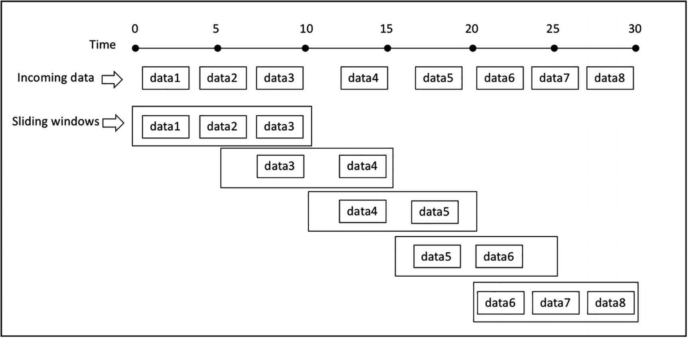

# Spark Streaming II

## *Windowing*

Al realizar agregaciones basadas en el tiempo, es importante aclarar el concepto de ventana temporal (*windowing*). Una ventana temporal puede durar una semana, una hora, un minuto o incluso un segundo.

Estas ventanas permiten acotar los datos sobre un flujo que en principio no tiene un inicio ni un fin predefinidos.

Existen diferentes tipos de ventanas temporales:

* de tamaño fijo (*fixed/tumbling window*): divide los flujos de datos en segmentos fijos, con un tamaño de ventana, un tiempo de inicio y uno de finalización. En este tipo, cada dato se asigna a una única ventana, de manera que es fácil realizar agregaciones como la suma, el máximo o la media.
* deslizantes (*sliding*): cada ventana tiene una longitud y un intervalo de deslizamiento. Si el intervalo tiene el mismo tamaño que la ventana, actúa igual que una ventana de tamaño fijo. En la imagen podemos ver un intervalo de deslizamiento más pequeño que el tamaño de la ventana, lo que implica que un dato puede llegar a más de una ventana. Como las ventanas deslizantes se solapan, las agregaciones de datos producen resultados más precisos que con ventanas de tamaño fijo.
* de sesión (*session*): se utiliza para analizar el comportamiento de usuario de un sitio web. No tienen un tamaño definido, sino que se define por la duración de la navegación del usuario.

<figure style="align: center;">
    
    <figcaption>Tipos de ventanas temporales</figcaption>
</figure>

En esta sesión nos vamos a centrar en las ventajas de tamaño fijo y las deslizantes.

## Caso 5: Trabajando con ventanas

Para entender cómo funcionan las ventanas vamos a basarnos en el caso 1, donde leíamos datos desde un *socket* y contábamos las apariciones de las palabras.

Antes de nada, en un terminal, vamos a lanzar el servidor de *sockets*:

``` bash
nc -lk 9999
```

Volvemos a nuestro cuaderno de *Jupyter*, y del código del caso 1 vamos a modificar algunos aspectos para agrupar los datos recibidos en una ventana fija de dos minutos. Al leer los datos, indicaremos que queremos obtener el *timestamp* de cada dato:

``` python hl_lines="13"
from pyspark.sql import SparkSession
spark = SparkSession.builder \
        .appName("Ventana fija IABD WordCount") \
        .master("local[2]") \
        .config("spark.streaming.stopGracefullyOnShutdown", "true") \
        .config("spark.sql.shuffle.partitions", 3) \
        .getOrCreate()

dfLineas = spark.readStream \
    .format("socket") \
    .option("host", "localhost") \
    .option("port", "9999") \
    .option('includeTimestamp', 'true')\
    .load()
```

Si obtenemos el esquema de los datos que leemos ahora tendremos el campo `value` con el texto leído, y el campo `timestamp` con la marca de tiempo:

``` python
dfLineas.printSchema()
# root
#  |-- value: string (nullable = true)
#  |-- timestamp: timestamp (nullable = true)
```

Al prepara el *DataFrame* con las palabras, vamos a incluir también el *timestamp*:

``` python hl_lines="4"
from pyspark.sql.functions import explode, split
dfPalabras = dfLineas.select(
    explode(split(dfLineas.value, ' ')).alias('palabra'),
    dfLineas.timestamp)
```

Y ahora es cuando trabajamos con las ventanas. Para ello, haremos uso de la función [`window`](https://spark.apache.org/docs/latest/api/python/reference/pyspark.sql/api/pyspark.sql.functions.window.html) para agrupar las palabras con una ventana fija de 2 minutos, agrupando tanto la ventana temporal fija como cada palabra, para obtener su cantidad como dato agregado:

``` python hl_lines="3"
from pyspark.sql.functions import window
windowedCounts = dfPalabras.groupBy(
    window(dfPalabras.timestamp, "2 minutes"), dfPalabras.palabra
).count().orderBy('window')
```

Finalmente, realizamos la consulta (vamos a indicar que no trunque los datos para poder visualizar toda la información de la ventana):

``` python
palabrasQuery = windowedCounts.writeStream \
    .format("console") \
    .outputMode("complete") \
    .option('truncate', 'false')\
    .start()
```

Introducimos la siguientes frases:

``` text
Hola Mundo
Hola desde el Severo
```

Y obtenemos:

``` python
-------------------------------------------
Batch: 1
-------------------------------------------
+------------------------------------------+-------+-----+
|window                                    |palabra|count|
+------------------------------------------+-------+-----+
|{2022-05-05 17:32:00, 2022-05-05 17:34:00}|Mundo  |1    |
|{2022-05-05 17:32:00, 2022-05-05 17:34:00}|Hola   |1    |
+------------------------------------------+-------+-----+

-------------------------------------------
Batch: 2
-------------------------------------------
+------------------------------------------+-------+-----+
|window                                    |palabra|count|
+------------------------------------------+-------+-----+
|{2022-05-05 17:32:00, 2022-05-05 17:34:00}|el     |1    |
|{2022-05-05 17:32:00, 2022-05-05 17:34:00}|Mundo  |1    |
|{2022-05-05 17:32:00, 2022-05-05 17:34:00}|desde  |1    |
|{2022-05-05 17:32:00, 2022-05-05 17:34:00}|Severo |1    |
|{2022-05-05 17:32:00, 2022-05-05 17:34:00}|Hola   |2    |
+------------------------------------------+-------+-----+
```

Para cada palabra introducida dentro de la misma ventana temporal (en nuestro caso la hemos definido de 2 minutos, nos cuenta sus ocurrencias).

Si nos esperamos un par de minutos y enviamos `Severo Ochoa y el Mundo`, obtenemos:

``` python hl_lines="13-17"
-------------------------------------------
Batch: 3
-------------------------------------------

+------------------------------------------+-------+-----+
|window                                    |palabra|count|
+------------------------------------------+-------+-----+
|{2022-05-05 17:32:00, 2022-05-05 17:34:00}|el     |1    |
|{2022-05-05 17:32:00, 2022-05-05 17:34:00}|Mundo  |1    |
|{2022-05-05 17:32:00, 2022-05-05 17:34:00}|desde  |1    |
|{2022-05-05 17:32:00, 2022-05-05 17:34:00}|Severo |1    |
|{2022-05-05 17:32:00, 2022-05-05 17:34:00}|Hola   |2    |
|{2022-05-05 17:34:00, 2022-05-05 17:36:00}|Mundo  |1    |
|{2022-05-05 17:34:00, 2022-05-05 17:36:00}|Ochoa  |1    |
|{2022-05-05 17:34:00, 2022-05-05 17:36:00}|Severo |1    |
|{2022-05-05 17:34:00, 2022-05-05 17:36:00}|el     |1    |
|{2022-05-05 17:34:00, 2022-05-05 17:36:00}|y      |1    |
+------------------------------------------+-------+-----+
```

Podemos observar como las palabras de esta última frase han entrado en una ventana diferente, y por tanto, al agruparse se cuentan desde 0.

### Ventanas deslizantes

Ya hemos visto como funcionan las ventanas fijas. Con las ventanas deslizantes, vamos a poder recoger datos en más de una ventana a la vez:

<figure style="align: center;">
    
    <figcaption>Ventana deslizante</figcaption>
</figure>

Centrándonos en el mismo ejemplo, únicamente vamos a modificar el fragmento de código donde agrupamos los datos, para que manteniendo una ventana de 2 minutos, ahora tenga un deslizamiento de un minuto:

``` python hl_lines="3"
from pyspark.sql.functions import window
windowedCounts = words_df.groupBy(
    window(words_df.timestamp, "2 minutes", "1 minute"), words_df.palabra
).count().orderBy('window')
```

Al introducir `Hola Mundo`, ha duplicado los datos recibidos para darles cabida en las dos ventanas que van a cubrir cada instante temporal (realmente, la primera ventana no comienza en el minuto actual, es al revés, termina en el minuto posterior al actual):

``` python
-------------------------------------------
Batch: 1
-------------------------------------------
+------------------------------------------+-------+-----+
|window                                    |palabra|count|
+------------------------------------------+-------+-----+
|{2022-05-05 17:56:00, 2022-05-05 17:58:00}|Mundo  |1    |
|{2022-05-05 17:56:00, 2022-05-05 17:58:00}|Hola   |1    |
|{2022-05-05 17:57:00, 2022-05-05 17:59:00}|Hola   |1    |
|{2022-05-05 17:57:00, 2022-05-05 17:59:00}|Mundo  |1    |
+------------------------------------------+-------+-----+
```

En el mismo instante, introducimos `Severo Ochoa`, lo que provoca que vuelta a realizar el mismo proceso, introduciendo ambas palabras en las dos ventanas existentes:

``` python hl_lines="7 8 11 13"
-------------------------------------------
Batch: 2
-------------------------------------------
+------------------------------------------+-------+-----+
|window                                    |palabra|count|
+------------------------------------------+-------+-----+
|{2022-05-05 17:56:00, 2022-05-05 17:58:00}|Ochoa  |1    |
|{2022-05-05 17:56:00, 2022-05-05 17:58:00}|Severo |1    |
|{2022-05-05 17:56:00, 2022-05-05 17:58:00}|Mundo  |1    |
|{2022-05-05 17:56:00, 2022-05-05 17:58:00}|Hola   |1    |
|{2022-05-05 17:57:00, 2022-05-05 17:59:00}|Severo |1    |
|{2022-05-05 17:57:00, 2022-05-05 17:59:00}|Hola   |1    |
|{2022-05-05 17:57:00, 2022-05-05 17:59:00}|Ochoa  |1    |
|{2022-05-05 17:57:00, 2022-05-05 17:59:00}|Mundo  |1    |
+------------------------------------------+-------+-----+
```

Dentro de la misma ventana introducimos `Hola Mundo desde el Severo Ochoa`, obteniendo el tercer *micro-batch*:

``` python
-------------------------------------------
Batch: 3
-------------------------------------------
+------------------------------------------+-------+-----+
|window                                    |palabra|count|
+------------------------------------------+-------+-----+
|{2022-05-05 17:56:00, 2022-05-05 17:58:00}|Ochoa  |2    |
|{2022-05-05 17:56:00, 2022-05-05 17:58:00}|el     |1    |
|{2022-05-05 17:56:00, 2022-05-05 17:58:00}|Severo |2    |
|{2022-05-05 17:56:00, 2022-05-05 17:58:00}|Mundo  |2    |
|{2022-05-05 17:56:00, 2022-05-05 17:58:00}|Hola   |2    |
|{2022-05-05 17:56:00, 2022-05-05 17:58:00}|desde  |1    |
|{2022-05-05 17:57:00, 2022-05-05 17:59:00}|el     |1    |
|{2022-05-05 17:57:00, 2022-05-05 17:59:00}|Severo |2    |
|{2022-05-05 17:57:00, 2022-05-05 17:59:00}|desde  |1    |
|{2022-05-05 17:57:00, 2022-05-05 17:59:00}|Hola   |2    |
|{2022-05-05 17:57:00, 2022-05-05 17:59:00}|Ochoa  |2    |
|{2022-05-05 17:57:00, 2022-05-05 17:59:00}|Mundo  |2    |
+------------------------------------------+-------+-----+
```

Finalmente, nos esperamos un poco para provocar entrar en otra ventana e introducimos `Segunda ventana`:

``` python hl_lines="13 19 21-22"
-------------------------------------------
Batch: 4
-------------------------------------------
+------------------------------------------+-------+-----+
|window                                    |palabra|count|
+------------------------------------------+-------+-----+
|{2022-05-05 17:56:00, 2022-05-05 17:58:00}|Ochoa  |2    |
|{2022-05-05 17:56:00, 2022-05-05 17:58:00}|el     |1    |
|{2022-05-05 17:56:00, 2022-05-05 17:58:00}|Severo |2    |
|{2022-05-05 17:56:00, 2022-05-05 17:58:00}|Mundo  |2    |
|{2022-05-05 17:56:00, 2022-05-05 17:58:00}|Hola   |2    |
|{2022-05-05 17:56:00, 2022-05-05 17:58:00}|desde  |1    |
|{2022-05-05 17:57:00, 2022-05-05 17:59:00}|Segunda|1    |
|{2022-05-05 17:57:00, 2022-05-05 17:59:00}|Severo |2    |
|{2022-05-05 17:57:00, 2022-05-05 17:59:00}|desde  |1    |
|{2022-05-05 17:57:00, 2022-05-05 17:59:00}|el     |1    |
|{2022-05-05 17:57:00, 2022-05-05 17:59:00}|Hola   |2    |
|{2022-05-05 17:57:00, 2022-05-05 17:59:00}|Ochoa  |2    |
|{2022-05-05 17:57:00, 2022-05-05 17:59:00}|ventana|1    |
|{2022-05-05 17:57:00, 2022-05-05 17:59:00}|Mundo  |2    |
|{2022-05-05 17:58:00, 2022-05-05 18:00:00}|ventana|1    |
|{2022-05-05 17:58:00, 2022-05-05 18:00:00}|Segunda|1    |
+------------------------------------------+-------+-----+
```

Finalmente, introducimos `Segunda ventana Ochoa` para comprobar como rellena las dos últimas ventanas:

``` python hl_lines="13 18-19 21-23"
-------------------------------------------
Batch: 5
-------------------------------------------
+------------------------------------------+-------+-----+
|window                                    |palabra|count|
+------------------------------------------+-------+-----+
|{2022-05-05 17:56:00, 2022-05-05 17:58:00}|Ochoa  |2    |
|{2022-05-05 17:56:00, 2022-05-05 17:58:00}|el     |1    |
|{2022-05-05 17:56:00, 2022-05-05 17:58:00}|Severo |2    |
|{2022-05-05 17:56:00, 2022-05-05 17:58:00}|Mundo  |2    |
|{2022-05-05 17:56:00, 2022-05-05 17:58:00}|Hola   |2    |
|{2022-05-05 17:56:00, 2022-05-05 17:58:00}|desde  |1    |
|{2022-05-05 17:57:00, 2022-05-05 17:59:00}|Segunda|2    |
|{2022-05-05 17:57:00, 2022-05-05 17:59:00}|Severo |2    |
|{2022-05-05 17:57:00, 2022-05-05 17:59:00}|desde  |1    |
|{2022-05-05 17:57:00, 2022-05-05 17:59:00}|el     |1    |
|{2022-05-05 17:57:00, 2022-05-05 17:59:00}|Hola   |2    |
|{2022-05-05 17:57:00, 2022-05-05 17:59:00}|Ochoa  |3    |
|{2022-05-05 17:57:00, 2022-05-05 17:59:00}|ventana|2    |
|{2022-05-05 17:57:00, 2022-05-05 17:59:00}|Mundo  |2    |
|{2022-05-05 17:58:00, 2022-05-05 18:00:00}|ventana|2    |
|{2022-05-05 17:58:00, 2022-05-05 18:00:00}|Ochoa  |1    |
|{2022-05-05 17:58:00, 2022-05-05 18:00:00}|Segunda|2    |
+------------------------------------------+-------+-----+
```

!!! question "Autoevaluación"
    Si definimos una ventana temporal de tres minutos de duración, con un deslizamiento de un minuto, y lanzamos el primer mensaje a las 11:45:50, ¿cuantas ventanas se crearán y cuales serán sus rangos temporales? [^1]

    [^1]:
        Se crearán tres ventanas, del minuto 11:43:00 al minuto 11:46:00, del minuto 11:44:00 al minuto 11:47:00 y finalmente del minuto 11:45:00 al minuto 11:48:00

## Caso 6: Bolsa I

Para este caso de uso, vamos a suponer que recibimos un [fichero con eventos](resources/entrada/bolsa1.json) sobre valores de un mercado financiero con el siguiente formato:

``` json title="bolsa1.json"
{"CreatedTime": "2022-05-09 10:05:00", "Type": "BUY", "Amount": 500, "BrokerCode": "AME"}
{"CreatedTime": "2022-05-09 10:12:00", "Type": "BUY", "Amount": 300, "BrokerCode": "AME"}
{"CreatedTime": "2022-05-09 10:20:00", "Type": "BUY", "Amount": 800, "BrokerCode": "AME"}
{"CreatedTime": "2022-05-09 10:40:00", "Type": "BUY", "Amount": 900, "BrokerCode": "AME"}
{"CreatedTime": "2022-05-09 10:25:00", "Type": "SELL", "Amount": 400, "BrokerCode": "AME"}
{"CreatedTime": "2022-05-09 10:48:00", "Type": "SELL", "Amount": 600, "BrokerCode": "AME"}
{"CreatedTime": "2022-05-09 10:50:00", "Type": "SELL", "Amount": 100, "BrokerCode": "AME"}
```

Nuestro departamento de visualización nos pide que transformemos los datos recibidos para crear la siguiente estructura:

| TInicio   | TFin      | Compras   | Ventas    | Neto  |
| ----      | ----      | ----      | ----      | ----  |
| 9:00      | 9:15      | 0         | 0         | 0     |
| 9:15      | 9:30      | 1000      | 300       | 700   |
| 9:30      | 9:45      | 1500      | 700       | 800   |
| 9:45      | 10:00     | 1600      | 900       | 700   |

Así pues, necesitamos agrupar los datos con una ventana fija de 15 minutos, e ir acumulando las cantidades (`Amount`), dependiendo de que el tipo (`Type`) sea una compra (`BUY`) o una venta (`SELL`) para luego calcular su valor neto como la diferencia de estos dos últimos.

Nuestro primer paso, será crear la conexión a *Spark* y la lectura de la carpeta donde irán llegando los ficheros de datos (recuerda crear la carpeta `entrada` antes de ejecutar la lectura):

``` python
from pyspark.sql import SparkSession
spark = SparkSession \
        .builder \
        .appName("Bolsa Streaming IABD") \
        .master("local[2]") \
        .config("spark.streaming.stopGracefullyOnShutdown", "true") \
        .config("spark.sql.shuffle.partitions", 3) \
        .getOrCreate()

# Definimos el esquema de los datos de entrada
from pyspark.sql.types import StructType, StructField, StringType, IntegerType
bolsaSchema = StructType([
    StructField("CreatedTime", StringType()),
    StructField("Type", StringType()),
    StructField("Amount", IntegerType()),
    StructField("BrokerCode", StringType())
])

# Configuramos la lectura de fichero en formato JSON
rawDF = spark.readStream \
        .format("json") \
        .option("path", "entrada") \
        .option("maxFilesPerTrigger", 1) \
        .schema(bolsaSchema) \
        .load()

rawDF.printSchema()
# root
#  |-- CreatedTime: string (nullable = true)
#  |-- Type: string (nullable = true)
#  |-- Amount: integer (nullable = true)
#  |-- BrokerCode: string (nullable = true)
```

El siguiente paso, es crear las columnas con la fecha en formato *timestamp* y las nuevas columnas `Compras` y `Ventas`:

``` python
from pyspark.sql.functions import to_timestamp, col, expr
accionesDF = rawDF.withColumn("CreatedTime", to_timestamp(col("CreatedTime"), "yyyy-MM-dd HH:mm:ss")) \
    .withColumn("Compras", expr("case when Type == 'BUY' then Amount else 0 end")) \
    .withColumn("Ventas", expr("case when Type == 'SELL' then Amount else 0 end"))

accionesDF.printSchema()
# root
#  |-- CreatedTime: timestamp (nullable = true)
#  |-- Type: string (nullable = true)
#  |-- Amount: integer (nullable = true)
#  |-- BrokerCode: string (nullable = true)
#  |-- Compras: integer (nullable = true)
#  |-- Ventas: integer (nullable = true)
```

Si queremos ver el resultado e intentamos realizar `accionesDF.show()`, nos dará un error al no haber realizado un *start* del streaming. Para probarlo como si fuera un proceso batch sólo tenemos que cambiar el método `readStream` de la lectura por `read` y ya funcionará:

``` python
rawDF = spark.read \
        .format("json") \
        ...

accionesDF.show()
# +-------------------+----+------+----------+-------+------+
# |        CreatedTime|Type|Amount|BrokerCode|Compras|Ventas|
# +-------------------+----+------+----------+-------+------+
# |2022-05-09 10:05:00| BUY|   500|       AME|    500|     0|
# |2022-05-09 10:12:00| BUY|   300|       AME|    300|     0|
# |2022-05-09 10:20:00| BUY|   800|       AME|    800|     0|
# |2022-05-09 10:40:00| BUY|   900|       AME|    900|     0|
# |2022-05-09 10:25:00|SELL|   400|       AME|      0|   400|
# |2022-05-09 10:48:00|SELL|   600|       AME|      0|   600|
# |2022-05-09 10:50:00|SELL|   100|       AME|      0|   100|
# +-------------------+----+------+----------+-------+------+
```

Una vez hemos comprobado que tenemos preparados los datos con el formato y contenido adecuados, vamos a agruparlos con una ventana de 15 minutos:

``` python
from pyspark.sql.functions import window, sum
windowDF = accionesDF \
    .groupBy(  # col("BrokerCode"),
         window(col("CreatedTime"), "15 minutes")) \
    .agg(sum("Compras").alias("Compras"),
         sum("Ventas").alias("Ventas"))

salidaDF = windowDF.select("window.start", "window.end", "Compras", "Ventas")

bolsaWriterQuery = salidaDF.writeStream \
    .format("console") \
    .outputMode("complete") \
    .start()

bolsaWriterQuery.awaitTermination()
```

Y tras volver a poner `readStream` y arrancarlo, obtenemos:

``` python
+-------------------+-------------------+-------+------+
|              start|                end|Compras|Ventas|
+-------------------+-------------------+-------+------+
|2022-05-09 10:00:00|2022-05-09 10:15:00|    800|     0|
|2022-05-09 10:15:00|2022-05-09 10:30:00|    800|   400|
|2022-05-09 10:30:00|2022-05-09 10:45:00|    900|     0|
|2022-05-09 10:45:00|2022-05-09 11:00:00|      0|   700|
+-------------------+-------------------+-------+------+
```

Estos datos se parecen a la información que queríamos, pero únicamente esta sumando los datos de cada ventana, sin acumularlos con todos los datos anteriores. A día de hoy, la única forma de sumar todos los datos agregados es utilizar las [funciones ventana](../hadoop/06hive.md#consultas-de-agregación) (similares a las que vimos al trabajar con *Hive*) dentro de un proceso *batch*.

Así pues, vamos a almacenar los datos en un fichero en formato *Parquet*, para que luego desde un proceso Batch realizar los cálculos que nos faltan. Pero antes necesitamos introducir el concepto de marca de agua.

## Watermarking

Cuando los datos llegan tarde a nuestro sistema (se generan en la ventana N, pero llegan a *Spark* en la ventana N+M), *Spark* gestiona todas las ventanas y actualiza los cálculos. Estos cálculos, como hemos comentado, son el estado de las transformaciones y se almacenan en los diferentes ejecutores del clúster de *Spark*.

¿Qué sucede con un dato que se genera a las 12:04 pero llega a *Spark* a las 12:11, si nuestras ventanas tienen un tamaño de 10 minutos con un deslizamiento de 5 minutos? Al mantener el estado, *Spark* puede modificar la ventana de las 12:00 a las 12:10 y actualizar los cálculos:

<figure style="align: center;">
    
    <figcaption>Gestión de datos tardíos</figcaption>
</figure>

El problema es que estos cálculos se almacenan para todos los datos, con lo cual el estado crece ininterrumpidamente. Para definir que las ventanas expiren, necesitamos conocer el concepto de **marca de agua** (*watermark*), el cual va a permitir indicar el tiempo que el sistema debe esperar a datos que llegan tarde, de manera que si exceden la marca de agua, los datos se desechan. Al definir las marcas de agua, *Spark Streaming* realiza un seguimiento de los tiempos de los eventos de los datos e intenta limpiar los datos caducados de los ejecutores.

La decisión de la definición de la marca de agua pertenece a negocio, y debe responder a:

* ¿Cuál es el máximo retraso posible/aceptable?
* ¿Cuándo dejan los datos de ser relevantes?

Una vez tenemos claro el rango temporal en el que los datos son aceptables, los definimos antes de agrupar y utilizando las mismas columnas de agrupación (en nuestro caso, por la columna `timestamp`) mediante el método [withWatermark](https://spark.apache.org/docs/latest/api/python/reference/pyspark.sql/api/pyspark.sql.DataFrame.withWatermark.html):

``` python
from pyspark.sql.functions import window
windowedCounts = dfPalabras \
    .withWatermark(dfPalabras.timestamp, "30 minutes") \
    .groupBy(
        window(dfPalabras.timestamp, "2 minutes", "1 minute"), dfPalabras.palabra) \
    .count().orderBy('window')
```

De esta manera, si llega una palabra con un retraso de más de 30 minutos, se desechará. Además, el estado de la ventana se limpiará cuando pasen esos 30 minutos, de manera que su tamaño siempre estará limitado por el *timestamp* de los datos recibidos en los última media hora.

!!! caution "Marcas de agua y modo de salida completo"
    Si utilizamos marcas de agua para limitar el estado de la ventana, es importante tener en cuenta que si el modo de salida es completo, no se limpiará el estado, es decir, es como si no utilizásemos marcas de agua.

### Modo *update*

En cambio, mediante el modo *update* sí que se limpia la ventana de estado, realizando operaciones de tipo *upsert*, por ejemplo con un *sink* que sí soporte las modificaciones, como cualquiera base de datos. Aunque hay que tener cuidado si nuestro *sink* es de tipo fichero, ya que no puede modificar los ficheros JSON/*Parquet* y creará archivos duplicados.

Veamos un ejemplo donde definimos una marca de agua de 10 minutos sobre una ventana también de 10 minutos sobre la columna *timestamp* con *triggers* cada 5 minutos:

<figure style="align: center;">
    
    <figcaption>Marca de agua - modo update</figcaption>
</figure>

La línea punteada en azul representa el mayor evento leído, el cual va a definir la marca de agua (tiempo del mayor evento menos 10 minutos)

Cuando llega el dato *dog* de las 12:14, fija la marca de agua a las 12:04 para el siguiente trigger. Todo lo que sea anterior a las 12:04 se desechará y lo posterior, se tratará (por ejemplo, al llegar *cat* a las 12:09) y se contabiliza en las dos ventanas posibles.

Sin embargo, cuando llega *owl* a las 12:21, fija la marca de agua a las 12:11, y por tanto limpia la ventana que va de las 12:00 a las 12:10, y todos los datos posteriores que llegan anteriores a la marca de agua como *donkey* a las 12:04 se descartan por llegar demasiado tarde.

Tras cada trigger, por el modo *update*, los cálculos (filas en lila) se escriben en el destino.

### Modo *append*

Anteriormente hemos comentado que no podíamos utilizar el modo *append* con la agregaciones, ya que *Spark* necesita saber que los registros no se actualizarán o modificarán en el futuro. En cambio, al definir una marca de agua, ahora sí que podremos hacerlo. Para ello, sólo emitirá el resultado una vez ha finalizado una ventana y no pueda aceptar nuevos eventos tardíos.

Supongamos que nuestra marca de agua es de treinta minutos, teniendo un ventana de estado actual de 10:00 a 10:30, con un tamaño de ventana de 15 minutos. Si nos llega un mensaje a las 10:45, nuestra ventana de estado pasará a ser de 10:15 a 10:45, y a la ventana de 10:00 a 10:15 ya no podrá llegar ningún mensaje, de manera que puede mostrar los cálculos y realizar el *append* de dichos datos.

Si el retraso de la marca de agua no es crítica para nuestro sistema, mediante *watermarking* y el modo de salida *append*, podemos utilizar un *sink* de tipo fichero.

Si retomamos el mismo ejemplo de antes, pero ahora con el modo *append*, y nos fijamos en los pasos finales, cuando la marca de agua pasaba a ser a las 12:11 provocaba que caducase la ventana de las 12:00 a las 12:10. En el siguiente trigger es cuando dichos datos se persisten en el *sink*:

<figure style="align: center;">
    
    <figcaption>Marca de agua - modo append</figcaption>
</figure>

<!--
<https://github.com/PacktPublishing/Apache-Spark-Streaming-with-Python-and-PySpark-v>
<https://github.com/jleetutorial/python-spark-streaming>  
-->

## Caso 7: Bolsa II

Ahora que ya hemos visto el concepto de marca de agua, podemos crear un marco para que los valores que lleguen tarde se descarten y poder almacenar la información en fichero en formato *Parquet* con el modo de salida *append*.

Así pues, cuando agrupamos los datos, vamos a definir una marca de agua de 30 minutos:

``` python
from pyspark.sql.functions import window, sum
windowDF = accionesDF \
    .withWatermark("CreatedTime", "30 minutes") \
    .groupBy(  # col("BrokerCode"),
         window(col("CreatedTime"), "15 minutes")) \
    .agg(sum("Compras").alias("Compras"),
         sum("Ventas").alias("Ventas"))
```

Y posteriormente ya podemos almacenar los datos en un fichero:

``` python
bolsaWriterQuery = salidaDF.writeStream \
    .format("parquet") \
    .queryName("BolsaWQuery") \
    .outputMode("append") \
    .option("path", "salida") \
    .option("checkpointLocation", "chk-point-dir-caso7") \
    .trigger(processingTime="1 minute") \
    .start()
```

Si vamos a la carpeta, tendremos diferentes fichero. Si creamos un [nuevo fichero](resources/entrada/bolsa2.json) con un dato que se salga de la marca de agua, los datos antiguos *caducarán* y se persistirán en disco:

``` json title="bolsa2.json"
{"CreatedTime": "2022-05-09 12:50:00", "Type": "BUY", "Amount": 150, "BrokerCode": "AME"}
```

Así pues, si ahora los cargamos mediante un proceso *batch*, podremos ver los datos:

``` python
rawBolsaDF = spark.read \
    .format("parquet") \
    .option("path", "salida") \
    .load()
rawBolsaDF.show()
# +-------------------+-------------------+-------+------+
# |              start|                end|Compras|Ventas|
# +-------------------+-------------------+-------+------+
# |2022-05-09 10:00:00|2022-05-09 10:15:00|    800|     0|
# |2022-05-09 10:15:00|2022-05-09 10:30:00|    800|   400|
# |2022-05-09 10:45:00|2022-05-09 11:00:00|      0|   700|
# |2022-05-09 10:30:00|2022-05-09 10:45:00|    900|     0|
# +-------------------+-------------------+-------+------+
```

Ahora ya podemos hacer uso de las [funciones ventana](https://spark.apache.org/docs/latest/sql-ref-syntax-qry-select-window.html), y calcular el total acumulado:

``` python
from pyspark.sql import Window
ventanaTotal = Window.orderBy("end") \
    .rowsBetween(Window.unboundedPreceding, Window.currentRow)

salidaDF = rawBolsaDF \
    .withColumn("Compras", sum("Compras").over(ventanaTotal)) \
    .withColumn("Ventas", sum("Ventas").over(ventanaTotal)) \
    .withColumn("Neto", expr("Compras - Ventas"))

salidaDF.show(truncate=False)
# +-------------------+-------------------+-------+------+----+
# |start              |end                |Compras|Ventas|Neto|
# +-------------------+-------------------+-------+------+----+
# |2022-05-09 10:00:00|2022-05-09 10:15:00|800    |0     |800 |
# |2022-05-09 10:15:00|2022-05-09 10:30:00|1600   |400   |1200|
# |2022-05-09 10:30:00|2022-05-09 10:45:00|1600   |1100  |500 |
# |2022-05-09 10:45:00|2022-05-09 11:00:00|2500   |1100  |1400|
# +-------------------+-------------------+-------+------+----+
```

## Datos duplicados

Aunque *Spark Streaming* asegura la fiabilidad de los datos mediante la entrega de mensajes *exactly-one*, es posible que desde nuestras fuentes de datos nos envíen un dato más de una vez (por problemas con la red o fallos de transmisión).

Dentro de *Structured Streaming* podemos gestionar los datos duplicados tanto con marcas de agua como sin ellas. Debes tener en cuenta que si no utilizamos *watermarking*, el estado de *Spark* necesita almacenar de manera ilimitada todos los datos, lo que puede llevar a un problema de falta de memoria.

Para evitar los registros duplicados, los diferentes eventos deberían tener un identificador único y pasárselo como parámetro al método [`dropDuplicates`](https://spark.apache.org/docs/latest/api/python/reference/pyspark.sql/api/pyspark.sql.DataFrame.dropDuplicates.html):

``` python
streamingDF = spark.readStream. ...

# Sin marcas de agua
streamingDF.dropDuplicates("id")

# Mediante marca de agua, eliminamos tanto por el identificador como por la ventana temporal
streamingDF \
  .withWatermark("ts", "10 minutes") \
  .dropDuplicates("id", "ts")
```

!!! info "Procesamiento con estado ([*Stateful operations*](https://spark.apache.org/docs/latest/structured-streaming-programming-guide.html#arbitrary-stateful-operations))"
    Si necesitamos realizar operaciones avanzadas que requieren realizar un seguimiento sobre diferentes eventos dentro de una misma sesión (por ejemplo, ver si ha llegado más de 3 veces una temperatura superior a X grados), podemos utilizar las funciones `mapGroupWithState` y `flatMapGroupsWithState` (solo disponibles a día de hoy mediante *Java* y *Scala*), que permiten definir una función de usuario a aplicar sobre el estado.

## Joins en streaming

Una de las cosas más *curiosas* que podemos hacer con un *DataFrame* en *streaming* es realizar un [*join*](https://spark.apache.org/docs/latest/structured-streaming-programming-guide.html#join-operations) con otro *DataFrame* estático u otro en *streaming*, es decir, con datos que todavía no existen.

Realizar un *join* es una operación compleja y la parte divertida es que no todos los datos están disponibles en el momento de realizar el *join*, por lo tanto su resultado se genera de forma incremental tras cada *trigger*, de forma similar a como se generan las agregaciones.

Unir un *stream* con un *DataFrame* estático es una operación sin estado, ya que *Spark* no necesita mantener el estado y sólo está uniendo los datos de un único *micro-batch*.

``` python
estaticoDF = spark.read. ...
streamingDF = spark.readStream. ...
streamingDF.join(estaticoDF, "claveAjena")  # inner join entre streaming y estático
streamingDF.join(estaticoDF, "claveAjena", "left_outer")  # left outer join con estático
```

En cambio, unir dos *DataFrames* en *streaming* sí que es una operación con estado, ya que *Spark* necesita almacenar los datos de ambos en el almacenamiento del estado y comprobar continuamente si hay relación entre los nuevos datos que llegan en cada *micro-batch*. Dado que los *DataFrames* en *stream* no tienen un final definido, *Spark Structured Streaming* debe mantener todos los datos recogidos de ambos *DataFrames* de un *join*, ya que pueden llegar futuros datos que sí cumplan la relación. Para evitar que el estado se quede sin memoria disponible, podemos utilizar marcas de agua en ambos *DataFrames* e incluir una restricción basada en el tiempo de evento definido en la condición de *join*.

Supongamos que queremos unir un flujo de impresiones de anuncios (cuando se muestra un anuncio) con otro flujo de los *clicks* que los usuarios realizan sobre los anuncios para correlacionarlos y monetizar los *clicks*:

``` python
from pyspark.sql.functions import expr

impresiones = spark.readStream. ...
clicks = spark.readStream. ...

# Le asignamos una marca de agua a las columnas de tiempos de eventos
impresionesConMarcaAgua = impresiones.withWatermark("impresionTime", "2 hours")
clicksConMarcaAgua = clicks.withWatermark("clickTime", "3 hours")

# Join con restricciones temporales
# Los clicks solo se pueden recibir una vez impreso el anuncio y hasta una hora después
impresionesConMarcaAgua.join(
  clicksConMarcaAgua,
  expr("""
    clickAnuncioId = impresionAnuncioId AND
    clickTime >= impresionTime AND
    clickTime <= impresionTime + interval 1 hour
    """)
)
```

!!! caution "Limpieza"
    Conviene recordar que la limpieza de los registros del estado que quedan fuera de la marca de agua puede realizar tan pronto como cambie la marca o se puede retrasar debido a optimizaciones de Spark. Así pues, Spark no garantiza que los registros que están fuera de la marca de agua se ignoren por completo, sino que lo que estén dentro nunca se descartarán.

El soporte que hay para los diferentes tipos de join depende de los tipos de *DataFrames*:

| Izquierda + Derecha   | Inner Join    | Left Join | Right Join    | Full Outer |
| ----                  | ----          | ----      | ----          | ----  |
| Estático + Streaming  | Sí            | No        | Sí            | No    |
| Streaming + Streaming | Sí            | Condicional. Debe especificar marca de agua en el lado derecho y restricción temporal                 | Condicional. Debe especificar marca de agua en el lado izquierdo y restricción temporal                    | Condicional. Debe especificar marca de agua en un lado y restricción temporal |

En todos los casos que se indican restricciones temporales, opcionalmente se puede especificar marca de agua en el otro lado para facilitar la limpieza del estado.

## Caso 8: Join entre Kafka y MariaDB

En este caso de uso a leer datos de *Kafka* y unir la información recibida con una fuente de datos estática como puede ser *MariaDB*.

Vamos a simular que recibimos información sobre usuarios que han realizado login en una aplicación externa y hemos de cruzar sus datos con una base de datos que centraliza todos los usuarios de nuestra empresa.

Para ello, en *MariaDB* vamos a crear una base de datos y una tabla con información sobre usuarios:

``` sql
CREATE DATABASE `spark` /*!40100 DEFAULT CHARACTER SET utf8mb4 */;

CREATE TABLE spark.usuarios (
    id BIGINT UNSIGNED auto_increment NOT NULL,
    nombre varchar(100) NOT NULL,
    ultimoLogin TIMESTAMP NOT NULL,
    CONSTRAINT usuarios_PK PRIMARY KEY (id)
)
ENGINE=InnoDB
DEFAULT CHARSET=utf8mb4
COLLATE=utf8mb4_general_ci;
DROP TABLE IF EXISTS spark.usuarios;
```

En esta tabla, almacenamos los datos centralizados de los usuarios de nuestra empresa:

``` sql
INSERT INTO spark.usuarios (id, nombre, ultimoLogin) VALUES
    (1, 'Aitor Medrano','2022-05-13 13:36:58.0'),
    (2, 'Pedro Casas','2022-05-14 13:46:58.0'),
    (3, 'Laura García','2022-05-15 13:56:58.0'),
    (4, 'Mª Josep Vidal','2022-05-16 14:06:58.0');
```

Mediante *Kafka*, vamos a recibir los datos de los usuarios que entran a nuestras aplicaciones desde un topic llamado `usuariosk` con mensaje con el siguiente formato:

``` json
{"login_id": "1", "login_time": "2022-05-17 12:15:00"}
{"login_id": "3", "login_time": "2022-05-18 12:15:00"}
{"login_id": "2", "login_time": "2022-05-19 12:15:00"}
{"login_id": "5", "login_time": "2022-05-20 12:15:00"}
```

Una vez que crucemos los datos, si el usuario ya existía en nuestra base de datos (coinciden `id` y `login_id`) modificaremos la fecha de su `ultimoLogin`.

Una vez tenemos claro los datos de entrada, arrancamos Kafka y creamos el *topic*:

``` bash
zookeeper-server-start.sh ./config/zookeeper.properties
kafka-server-start.sh ./config/server.properties
kafka-topics.sh --create --topic usuariosk --bootstrap-server iabd-virtualbox:9092
```

### Lectura en streaming

Vamos a comenzar con el fragmento de código que realiza la lectura desde *Kafka*, creando la sesión *Spark* y leyendo del topic `usuariosk`:

``` python
spark = SparkSession \
    .builder \
    .master("local[3]") \
    .appName("IABD Kafka join MariaDB") \
    .config("spark.streaming.stopGracefullyOnShutdown", "true") \
    .config("spark.sql.shuffle.partitions", 2) \
    .getOrCreate()

from pyspark.sql.types import StructType, StructField, StringType
kafkaSchema = StructType([
    StructField("login_id", StringType()),
    StructField("login_time", StringType())
])

kafkaDF = spark \
    .readStream \
    .format("kafka") \
    .option("kafka.bootstrap.servers", "iabd-virtualbox:9092") \
    .option("subscribe", "usuariosk") \
    .option("startingOffsets", "earliest") \
    .load()

# Pasamos el value de Kafka a string y luego a JSON
from pyspark.sql.functions import from_json, col
valueDF = kafkaDF.select(from_json(col("value").cast("string"), kafkaSchema).alias("value"))

# Cast del campo login_time a tipo fecha
from pyspark.sql.functions import to_timestamp
loginDF = valueDF.select("value.*") \
    .withColumn("login_time", to_timestamp(col("login_time"), "yyyy-MM-dd HH:mm:ss"))
```

Así pues, `loginDF` es un *DataFrame* que realiza *streaming* sobre *Kafka*.

### Lectura estática

El segundo paso es crear otro *DataFrame* que obtenga los datos desde MariaDB (en esta caso un *DataFrame* estático, sin *streaming*) haciendo uso del acceso a base de datos relacionales mediante JDBC, tal como vimos en una [sesión anterior](02catalog.md#conectando-con-bases-de-datos).

Con el driver JDBC ya cargado en *Spark*, realizamos la lectura de los datos:

``` python
jdbcDF = spark.read \
    .format("jdbc") \
    .option("driver", "com.mysql.cj.jdbc.Driver") \
    .option("url", "jdbc:mysql://localhost") \
    .option("dbtable", "spark.usuarios") \
    .option("user", "iabd") \
    .option("password", "iabd") \
    .load()
```

### Join

Finalmente, un vez leídos los datos desde MariaDB, ya podemos hacer el *join*:

``` python hl_lines="4"
joinExpr = loginDF.login_id == jdbcDF.id
joinType = "inner"

joinDF = loginDF.join(jdbcDF, joinExpr, joinType).drop(loginDF.login_id)
joinDF.printSchema()
# root
#  |-- login_time: timestamp (nullable = true)
#  |-- id: decimal(20,0) (nullable = true)
#  |-- nombre: string (nullable = true)
#  |-- ultimoLogin: timestamp (nullable = true)
```

Y sobre el *join*, elegimos que columnas enviamos a la consola cada minuto:

``` python
resultadoDF = joinDF.select(col("id"), col("nombre"), col("login_time"), col("ultimoLogin"))

queryWriter = resultadoDF.writeStream \
    .format("console") \
    .outputMode("update") \
    .option("checkpointLocation", "chk-point-dir-caso8") \
    .trigger(processingTime="1 minute") \
    .start()

queryWriter.awaitTermination()
```

Una vez lanzado, creamos un productor de *Kafka*:

``` python
kafka-console-producer.sh --topic usuariosk --bootstrap-server iabd-virtualbox:9092
```

y le enviamos datos de entrada a la aplicación:

``` json
{"login_id": "1", "login_time": "2022-05-17 12:15:00"}
```

Si vamos a la consola de *Spark*, veremos como ha creado el join:

``` bash
-------------------------------------------                                     
Batch: 1
-------------------------------------------
+---+-------------+-------------------+-------------------+
| id|       nombre|        ultimoLogin|         login_time|
+---+-------------+-------------------+-------------------+
|  1|Aitor Medrano|2022-05-16 13:36:58|2022-05-17 12:15:00|
+---+-------------+-------------------+-------------------+
```

### Persistencia en base de datos

Si quisiéramos guardar los datos con los últimos *logins*, podemos hacer uso del *sink* `foreachBatch` para crear una función que se invocará con cada *batch*. Así pues, en cada *batch* podríamos persistir los datos en una nueva tabla (a día de hoy no podemos realizar una operación de *update* a partir de un *DataFrame*, es decir, no permite *upserts*), por ejemplo, a la tabla `usuariosNuevos`.

Si queremos preparar el *DataFrame* para que tenga la misma estructura que la otra tabla que hemos utiliza cuando creamos el resultado, podemos hacer:

``` python
resultadoDF = joinDF.select(col("id"), col("nombre"), col("login_time").alias("ultimoLogin))
resultadoDF.printSchema()
# root
#  |-- id: decimal(20,0) (nullable = true)
#  |-- nombre: string (nullable = true)
#  |-- ultimoLogin: timestamp (nullable = true)
```

Necesitamos crear una función que se invocará con cada *batch*. Para ello, usaremos el *sink* de tipo [foreachBatch](https://spark.apache.org/docs/latest/api/python/reference/pyspark.ss/api/pyspark.sql.streaming.DataStreamWriter.foreachBatch.html) al cual le pasaremos una función que recibirá como parámetro los datos leídos en el micro-batch así como un identificador del *batch*. En dicha función, en nuestro caso, vamos a persistir los datos en una nueva tabla donde se añadirán todos los registros resultantes del *join
*:

``` python hl_lines="1 7 15"
def guardarMysql = (batch_df, batch_id):
    batch_df
        .withColumn("batchId", lit(batchId)) \
        .write.format("jdbc") \
        .option("driver", "com.mysql.cj.jdbc.Driver") \
        .option("url", "jdbc:mysql://localhost") \
        .option("dbtable", "spark.usuariosNuevos") \
        .option("user", "iabd") \
        .option("password", "iabd") \
        .mode("append")
        .save()
        
queryWriter = resultadoDF.writeStream \
  .outputMode("append") \
  .foreachBatch(guardarMysql) \
  .start()

queryWriter.awaitTermination()
```

## Referencias

* Documentación oficial sobre [Spark Structured Streaming](https://spark.apache.org/docs/latest/structured-streaming-programming-guide.html)
* [Stream Processing with Apache Spark](https://learning.oreilly.com/library/view/stream-processing-with/9781491944233/)
* [Beginning Apache Spark 3: With DataFrame, Spark SQL, Structured Streaming, and Spark Machine Learning Library](https://link.springer.com/book/10.1007/978-1-4842-7383-8)
* [Real-Time Stream Processing Using Apache Spark 3 for Python Developers](https://www.packtpub.com/product/real-time-stream-processing-using-apache-spark-3-for-python-developers-video/9781803246543)

## Actividades

En las siguientes actividades, además de los cuadernos de *Jupyter* con la solución a cada ejercicio, adjunta capturas de pantalla de las salida generadas.

1. (RA5074.1 / CE4.1d / 1p) Realiza el caso de uso 5, tanto con ventanas fijas como mediante ventanas deslizantes, pero con un tamaño de ventana fijo de tres minutos y con un deslizamiento de dos minutos. Justifica la cantidad de ventanas que aparecen.
2. (RA5074.1 / CE4.1d / 2p) A partir del *script* `bizum-kafka.py` el cual envía datos de *Bizums* a *Kafka* al topic `iabd-bizum` con una periodicidad aleatoria, calcula la cantidad media recibida, la mayor y la menor, así como la cantidad de eventos recibidos con una ventana temporal de 3 minutos con una marca de agua de 30 segundos.

    En un principio muestra el resultado por consola y a continuación, almacena el resultado en *MongoDB* en modo *update* (puedes consultar los apuntes de la sesión de [Spark y bases de datos](02catalog.md#mongo-spark-connector) para ver cómo almacenar un *DataFrame* en *MongoDB*). Adjunta capturas de los mensajes que llegan al *topic* (puedes utilizar un consumidor de *Kafka* mediante el terminal), así como el resultado de una consulta sobre la colección en *MongoDB* donde se almacenan los datos.

    Se adjunta el código del script:

    ``` python title="bizum-kafka.py"
    from faker import Faker
    import time
    from random import randint
    from datetime import date, datetime, timedelta
    from kafka import KafkaProducer
    from json import dumps

    fake = Faker('es_ES')
    today = str(date.today())
    i=0

    producer = KafkaProducer(
        value_serializer=lambda m: dumps(m, default=str).encode('utf-8'),
        bootstrap_servers=['iabd-virtualbox:9092'])

    while True:

        datos={}
        datos['records']=[]
        cant_bizums = randint(1,5)

        for x in range(cant_bizums):
            # datos de un bizum
            seg_random = randint(1,59)

            data = {
                "timestamp": datetime.now() + timedelta(seconds=seg_random),
                "nombre":fake.name(),
                "cantidad":fake.random_int(min=15, max=600, step=1),
                "concepto":fake.sentence(nb_words=3)
            }

            producer.send("iabd-bizum", value=data)


        producer.flush()
        i = i + 1
        time.sleep(10) # 10 segundos   
    ```

    Y un ejemplo de los mensajes recibidos en *Kafka*:

    ``` json
    {"timestamp": "2023-03-29 09:45:28.714978", "nombre": "Sandalio Casas Mendez", "cantidad": 43, "concepto": "Tempora quae suscipit."}
    {"timestamp": "2023-03-29 09:46:15.715211", "nombre": "Eva Lucena Arribas", "cantidad": 567, "concepto": "Dicta."}
    {"timestamp": "2023-03-29 09:45:35.738855", "nombre": "Pedro de Aranda", "cantidad": 353, "concepto": "Aperiam amet deserunt."}
    {"timestamp": "2023-03-29 09:45:56.739494", "nombre": "Alex del Acevedo", "cantidad": 304, "concepto": "Itaque ipsa."}
    {"timestamp": "2023-03-29 09:46:17.758687", "nombre": "Nuria Alonso Vidal", "cantidad": 119, "concepto": "Aspernatur."}
    {"timestamp": "2023-03-29 09:45:44.759399", "nombre": "Leonel Bou Sanz", "cantidad": 355, "concepto": "Eligendi voluptas a."}
    ```

    Recuerda que debes arrancar *Spark* con los paquetes de *Kafka* y *MongoDB*:

    ``` bash
    pyspark --packages org.apache.spark:spark-sql-kafka-0-10_2.12:3.3.1,org.mongodb.spark:mongo-spark-connector_2.12:10.1.1 
    ```

3. (RA5074.1 / CE4.1d / 1p) Realiza el caso de uso 8. Además, modifícalo para crear una ventana temporal de 15 minutos y envía nuevos datos de usuarios que entren al sistema que provoquen la limpieza del estado.

*[RA5074.1]: Aplica técnicas de análisis de datos que integran, procesan y analizan la información, adaptando e implementando sistemas que las utilicen.
*[CE4.1b]: Se ha extraído de forma automática información y conocimiento a partir de grandes volúmenes de datos.
*[CE4.1d]: Se ha construido un conjunto de datos complejos y se han relacionado entre sí.
