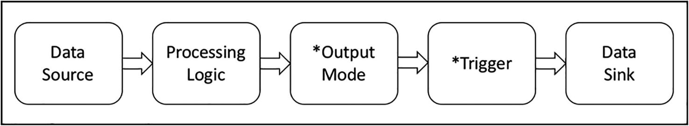
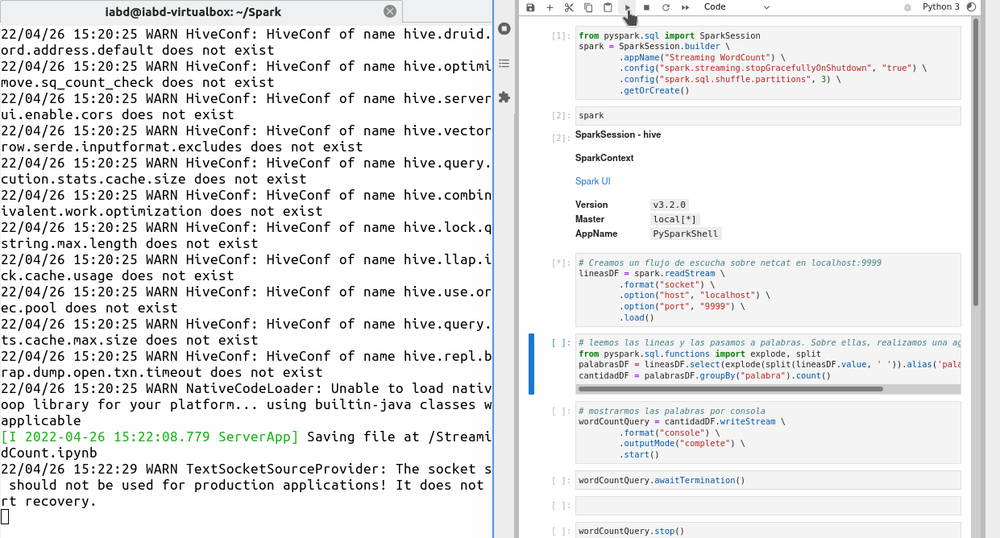
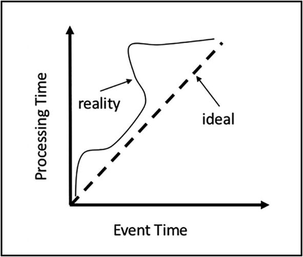
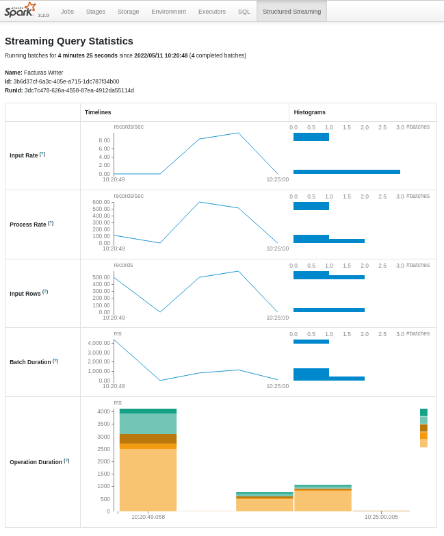
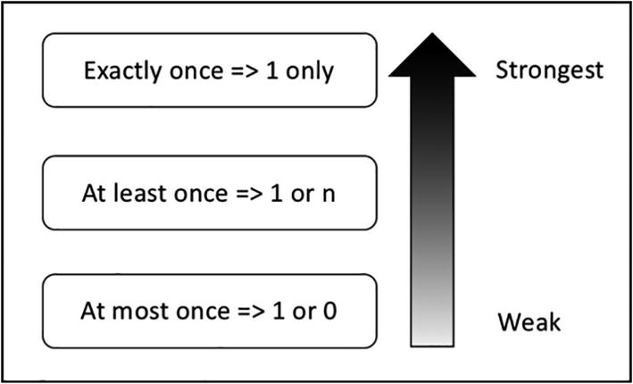
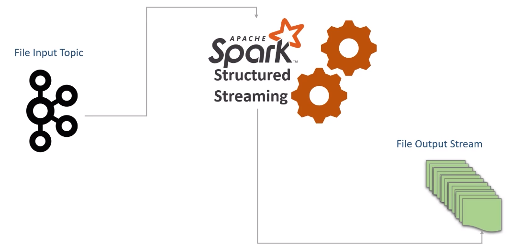
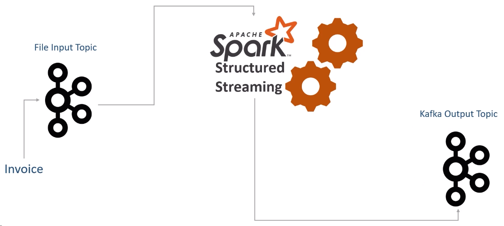
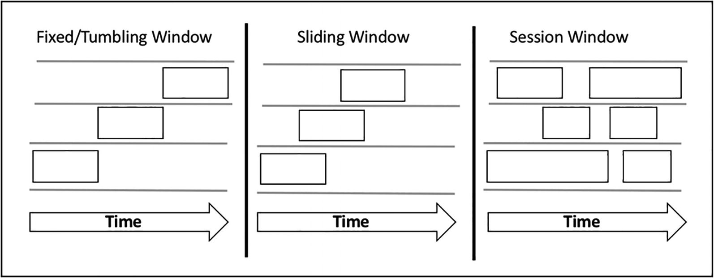
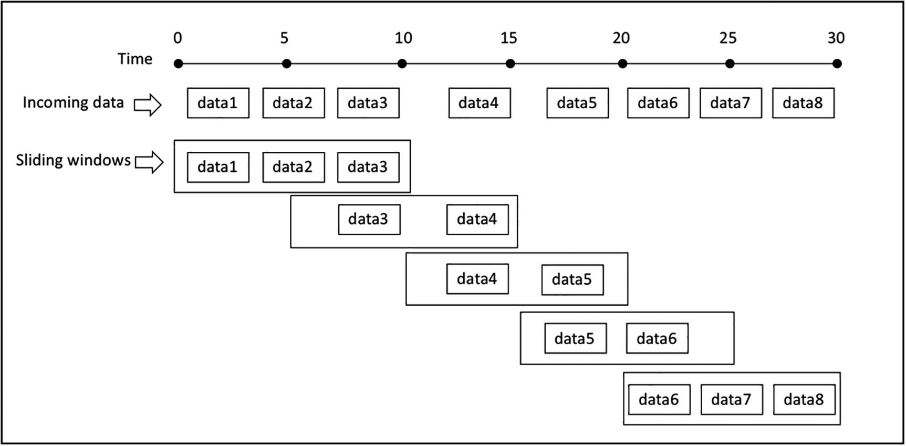

# Spark Streaming

Aunque ya estudiamos el concepto de *Streaming* en la sesión sobre [Ingesta de Datos](../hadoop/02etl.md) no viene mal recordar que cuando el procesamiento se realiza en *streaming*:

* Los datos se generan de manera continuada desde una o más fuentes de datos.
* Las fuentes de datos, por lo general, envían los datos de forma simultánea.
* Los datos se reciben en pequeños fragmentos (del orden de KB).

Vamos a considerar un *stream* como un flujo de datos continuo e ilimitado, sin un final definido que aporta datos a nuestros sistemas cada segundo.

El desarrollo de aplicaciones que trabajan con datos en *streaming* suponen un mayor reto que las aplicaciones *batch*, dada la impredecibilidad de los datos, tanto su ritmo de llegada como su orden.

Uno de los casos de uso más comunes del procesamiento en streaming es realizar algún calculo agregado sobre los datos que llegan y resumirlos/sintetizarlos en un destino externo para que luego ya sea un aplicación web o un motor de analítica de datos los consuma.

Las principales herramientas para el tratamiento de datos en streaming son [Apache Samza](https://samza.apache.org/), [Apache Flink](https://flink.apache.org/), [Apache Kafka](https://kafka.apache.org/) (de manera conjunta con Kafka Streams) y por supuesto, [Apache Spark](https://spark.apache.org/).

## *Streaming* en *Spark*

*Spark Streaming* es una extensión del núcleo de *Spark* que permite el procesamiento de flujos de datos en vivo ofreciendo tolerancia a fallos, un alto rendimiento y altamente escalable.

Los datos se pueden ingestar desde diversas fuentes de datos, como *Kafka*, *sockets* TCP, etc.. y se pueden procesar mediante funciones de alto nivel, ya sea mediante el uso de RDD y algoritmos *MapReduce*, o utilizando *DataFrames* y la sintaxis SQL. Finalmente, los datos procesados se almacenan en sistemas de ficheros, bases de datos o cuadros de mandos.

<figure style="align: center;">
    
    <figcaption>Streaming con Spark</figcaption>
</figure>

De hecho, podemos utilizar tanto *Spark MLlib* y sus algoritmos de *machine learning* como el procesamiento de grafos en los flujos de datos.

Spark dispone dos soluciones para trabajar con datos en *streaming*:

* [*Spark DStream*](https://spark.apache.org/docs/latest/streaming-programming-guide.html): más antigua, conocida como la primera generación,  basada en RDDs
* [*Spark Structured Streaming*](https://spark.apache.org/docs/latest/structured-streaming-programming-guide.html) basada en el uso de *DataFrames* y diseñada para construir aplicaciones que puedan reaccionar a los datos en tiempo real.

Vamos a presentar ambas soluciones, pero en este sesión nos centraremos principalmente en *Spark Structured Streaming*.

### DStream

[*Spark DStream*](https://spark.apache.org/docs/latest/streaming-programming-guide.html) (*Discretized Stream*), como ya hemos comentado, es la primera versión y actualmente no se recomienda su uso.

Funciona mediante un modelo de *micro-batching* para dividir los flujos de entrada de datos en fragmentos que son procesados por el núcleo de Spark. Este planteamiento tenía mucho sentido cuando el principal modelo de programación de Spark eran los RDD, ya que cada fragmento recibido se representaba mediante un RDD.

Así pues, *Spark DStream* recibe los datos de entrada en flujos y los divide en *batches*, por ejemplo en bloques cada N segundos, los cuales procesa *Spark* mediante RDD para generar los flujos de resultados procesados:

<figure style="align: center;">
    
    <figcaption>DStream por dentro</figcaption>
</figure>

### Structured Streaming

[*Spark Structured Streaming*](https://spark.apache.org/docs/latest/structured-streaming-programming-guide.html) es la segunda generación de motor para el tratamiento de datos en *streaming*, y fue diseñado para ser más rápido, escalable y con mayor tolerancia a los errores que *DStream*, ya que utiliza el motor de Spark SQL.

Además, podemos expresar los procesos en streaming de la misma manera que realizaríamos un proceso *batch* con datos estáticos. El motor de Spark SQL se encarga de ejecutar los datos de forma continua e incremental, y actualizar el resultado final como datos streaming. Para ello, podemos utilizar el API de Java, Scala, Python o R para expresar las agregaciones, ventanas de eventos, joins de *stream* a *batch*, etc.... Finalmente, el sistema asegura la tolerancia de fallos mediante la entrega de cada mensaje una sola vez (***exactly-once***) a través de *checkpoints* y logs.

Los pasos esenciales a realizar al codificar una aplicación en streaming consiste en especificar uno o más fuentes de datos, ofreciendo la lógica para manipular los flujos de entrada de datos mediante transformaciones de *DataFrames*, definir el *trigger* que provoca la lectura y el modo de salida, y finalmente indicar el destino de los datos (*data sink*) donde escribir los resultados.

<figure style="align: center;">
    
    <figcaption>Elementos para procesar datos en Streaming</figcaption>
</figure>

Debido a que tanto el modo de salida como el trigger tienen valores por defecto, es posible que no tengamos que indicarlos ni configurarlos, lo que reduce el desarrollo de procesos a un bucle infinito de leer, transformar y enviar al destino (*read + transform + sink*). Cada una de las iteraciones de ese bucle infinito se conoce como un ***micro-batch***, las cuales tienen unas latencias situadas alrededor de los 100 ms. Desde Spark 2.3 existe un nuevo modo de procesamiento de baja latencia conocido como [Procesamiento Continuo](https://spark.apache.org/docs/latest/structured-streaming-programming-guide.html#continuous-processing), que puede obtener latencias de 1ms. Al tratarse todavía de un tecnología en fase de experimentación, queda fuera de la presente sesión.

## Caso 1: Hola Spark Streaming

Para ver nuestro primer caso de uso, vamos a realizar un proceso de contar palabras sobre un flujo continuo de datos que proviene de un socket.

Para ello, en un terminal, abrimos un *listener* de Netcat en el puerto 9999:

``` bash
nc -lk 9999
```

Tras arrancar *Netcat*, ya podemos crear nuestra aplicación *Spark* (vamos a indicar que cree 2 hilos, lo cual es el mínimo necesario para realizar *streaming*, uno para recibir y otro para procesar):

``` python
from pyspark.sql import SparkSession
spark = SparkSession \
        .builder \
        .appName("Streaming s8a WordCount") \
        .master("local[2]") \
        .getOrCreate()

# Creamos un flujo de escucha sobre netcat en localhost:9999 (read)
lineasDF = spark.readStream \
        .format("socket") \
        .option("host", "localhost") \
        .option("port", "9999") \
        .load()

# Leemos las líneas y las pasamos a palabras.
# Sobre ellas, realizamos la agrupación count (transformación)
from pyspark.sql.functions import explode, split
palabrasDF = lineasDF.select(explode(split(lineasDF.value, ' ')).alias('palabra'))
cantidadDF = palabrasDF.groupBy("palabra").count()

# Mostramos las palabras por consola (sink)
wordCountQuery = cantidadDF.writeStream \
        .format("console") \
        .outputMode("complete") \
        .start()

# dejamos Spark a la escucha
wordCountQuery.awaitTermination()
```

Conforme escribamos en el terminal de *Netcat* irán apareciendo en la consola de *Spark* los resultados:

<figure style="align: center;">
    
    <figcaption>Ejecución de Streaming WordCount</figcaption>
</figure>

Al ejecutar la consulta, *Spark* crea un proceso a la escucha de manera ininterrumpida de nuevos datos. Mientras no lleguen datos, Spark queda a la espera, de manera que cuando llegue algún dato al flujo de entrada, se creará un nuevo *micro-batch*, lo que lanzará un nuevo *job* de Spark.

Si queremos detenerlo, podemos hacerlo de forma explícita:

``` python
wordCountQuery.stop()
```

O configurar la *SparkSession* para que detenga el *streaming* al finalizar el proceso:

``` python hl_lines="3"
spark = SparkSession.builder \
        .appName("Streaming WordCount") \
        .config("spark.streaming.stopGracefullyOnShutdown", "true") \
        .getOrCreate()
```

Por defecto, Spark utiliza 200 particiones para barajar los datos. Como no tenemos muchos datos, para obtener un mejor rendimiento, podemos reducir su cantidad:

``` python hl_lines="4"
spark = SparkSession.builder \
        .appName("Streaming WordCount") \
        .config("spark.streaming.stopGracefullyOnShutdown", "true") \
        .config("spark.sql.shuffle.partitions", 3) \
        .getOrCreate()
```

## Elementos

La idea básica al trabajar los datos en *streaming* es como una tabla de entrada de tamaño ilimitado, y conforme llegan nuevos datos, tratarlos como un nuevo conjunto de filas que se adjuntan a la tabla.

<figure style="align: center;">
    
    <figcaption>Datos como registros</figcaption>
</figure>

A continuación vamos a repasar los elementos principales de un flujo en streaming, los cuales son la fuente de datos, las operaciones en *streaming* mediante las transformaciones, los modos de salida, trigger y los *sink* de datos.

!!! info "Hablemos del tiempo"

    <figure style="float: right;">
        
        <figcaption>Eventos vs Procesamiento</figcaption>
    </figure>

    Existen dos tipos de tiempo, el tiempo del evento (*event time*) que representa cuando se crea el dato y el de procesado (*processing time*), que representa el momento en el que el motor de procesamiento/analítica de datos procesa el dato.
    Por ejemplo, si nos centramos en un escenario IoT, el tiempo del evento es cuando se toma el dato del sensor, y el de procesamiento cuando nuestro motor de *streaming* realiza la transformación/agregación sobre los datos del sensor.

    A la hora de trabajar con los datos, hemos de realizarlo siempre con el tiempo de los eventos, ya que representan el instante en el que se crean los datos. En un estado ideal, los datos llegan y se procesan casi de forma instantánea, pero la realidad es otra, y la latencia existente provoca la necesidad de descartar el tiempo de procesamiento.

    Para manejar los flujos de entrada ajenos a un flujo constante, una práctica muy común es dividr los datos en trozos utilizando el tiempo inicial y final como límites de una ventana temporal.

### Fuentes de Datos

Mientras que en el procesamiento *batch* las fuentes de datos son *dataset* estáticos que residen en un almacenamiento como pueda ser un sistema local, HDFS o S3, al hablar de procesamiento en *streaming* las fuentes de datos generan los datos de forma continuada, por lo que necesitamos otro tipo de fuentes.

*Structured Streaming* ofrece un conjunto predefinido de [fuentes de datos](https://spark.apache.org/docs/latest/structured-streaming-programming-guide.html#input-sources) que se leen a partir de un [DataStreamReader](https://spark.apache.org/docs/latest/api/python/reference/pyspark.sql/api/pyspark.sql.streaming.DataStreamReader.html). Los tipos existentes son:

* ^^Fichero^^: permite leer ficheros desde un directorio como un flujo de datos, con soporte para ficheros de texto, CSV, JSON, Parquet, etc...

    ``` python
    # Lee todos los ficheros csv de un directorio
    esquemaUsuario = StructType() \
        .add("nombre", "string").add("edad", "integer")
    csvDF = spark.readStream \
        .option("sep", ";") \
        .schema(esquemaUsuario) \
        .csv("/path/al/directorio")  # equivalente a format("csv").load("/path/al/directorio")
    ```

    Podemos configurar otras opciones como `maxFilesPerTrigger` con la cantidad de archivos a cargar en cada *trigger*, así como la política de lectura cuando su número sea mayor de uno mediante la propiedad booleana `latestFirst`.

* ^^Kafka^^: para leer datos desde brokers *Kafka* (versiones 0.10 o superiores). Realizaremos un ejemplo en las siguientes secciones.
* ^^Socket^^: lee texto UTF8 desde una conexión *socket* (es el que hemos utilizado en el caso de uso 1). Sólo se debe utilizar para pruebas ya que no ofrece garantía de tolerancia de fallos de punto a punto.

    ``` python
    socketDF = spark \
        .readStream \
        .format("socket") \
        .option("host", "localhost") \
        .option("port", 9999) \
        .load()
    ```

* ^^Rate^^: Genera datos indicando una cantidad de filas por segundo, donde cada fila contiene un *timestamp* y el valor de un contador secuencial (la primera fila contiene el 0). Esta fuente también se utiliza para la realización de pruebas y *benchmarking*.

    ``` python
    socketDF = spark \
        .readStream \
        .format("rate") \
        .option("rowsPerSecond", 1)
        .load()
    ```

* ^^Tabla^^ (desde *Spark 3.1*): Almacena los datos en una tabla temporal de SparkSQL, la cual podemos utilizar tanto para cargar como para persistir los cálculos realizados. Más información en la [documentación oficial](https://spark.apache.org/docs/latest/structured-streaming-programming-guide.html#streaming-table-apis).

### *Sinks*

De la misma manera, también tenemos un conjunto de [*Sinks*](https://spark.apache.org/docs/latest/structured-streaming-programming-guide.html#output-sinks) predefinidos como destino de los datos:

* ^^Fichero^^: Podemos almacenar los resultados en un sistema de archivos, HDFS o S3, con soporte para los formatos CSV, JSON, ORC y Parquet.

    ``` python
    # Otros valores pueden ser "json", "csv", etc...
    writeStream.format("parquet") \        
        .option("path", "/path/al/directorio") \ 
        .start()
    ```

* ^^Kafka^^: Envía los datos a un clúster de *Kafka*:

    ``` python
    writeStream.format("kafka") \        
        .option("kafka.bootstrap.servers", "host1:port1,host2:port2")
        .option("topic", "miTopic")
        .start()
    ```

* ^^Foreach^^ y ^^ForeachBatch^^: permiten realizar operaciones y escribir lógica sobre la salida de una consulta de streaming, ya sea a nivel de fila (*foreach*) como a nivel de micro-batch (*foreachBatch*). Más información en la [documentación oficial](https://spark.apache.org/docs/latest/structured-streaming-programming-guide.html#using-foreach-and-foreachbatch).
* ^^Consola^^: se emplea para pruebas y depuración y permite mostrar el resultado por consola.

    ``` python
    writeStream.format("console") \        
        .start()
    ```

    Admite las opciones `numRows` para indicar las filas a mostrar y `truncate` para truncar los datos si las filas son muy largas.

* ^^Memoria^^: se emplea para pruebas y depuración, ya que sólo permite un volumen pequeño de datos para evitar un problema de falta de memoria en el driver para almacenar la salida. Los datos se almacenan en una tabla temporal a la cual podemos acceder desde *SparkSQL*:

    ``` python
    writeStream.format("memory") \  
        .queryName("nombreTabla")  
        .start()
    ```

### Modos de salida

El [modo de salida](https://spark.apache.org/docs/latest/structured-streaming-programming-guide.html#output-modes) determina como salen los datos a un sumidero de datos. Existen tres opciones:

* Añadir (*`append`*): para insertar los datos, cuando sabemos que no vamos a modificar ninguna salida anterior, y que cada *batch* únicamente escribirá nuevos registros. Es el modo por defecto.
* Modificar (*`update`*): similar a un *upsert*, donde veremos solo registros que, bien son nuevos, bien son valores antiguos que debemos modificar.
* Completa (*`complete`*): para sobrescribir completamente el resultado, de manera que siempre recibimos la salida completa.

En el caso 1 hemos utilizado el modo de salida completa, de manera que con cada dato nuevo, se mostraba como resultado todas las palabras y su cantidad. Si hubiésemos elegido el modo *update*, en cada micro-batch solo se mostraría el resultado acumulado de cada *batch*.

Por ejemplo, si introducimos:

``` text
Spark en el Severo Ochoa
El Severo Ochoa está en Elche
```

Dependiendo del modo de salida, al introducir la segunda frase con la siguiente consulta:

=== "Complete"

    ``` python hl_lines="3"
    wordCountQuery = cantidadDF.writeStream \
        .format("console") \
        .outputMode("complete") \
        .start()
    ```

    Aparece la cuenta de todas las palabras:

    ``` text
    +---------+-----+
    |  palabra|count|
    +---------+-----+
    |    Spark|    1|
    |    Elche|    1|
    |    Ochoa|    2|
    |       El|    1|
    |       en|    2|
    |Streaming|    1|
    |     está|    1|
    |   Severo|    2|
    |       el|    1|
    +---------+-----+
    ```

=== "Update"

    ``` python hl_lines="3"
    wordCountQuery = cantidadDF.writeStream \
        .format("console") \
        .outputMode("update") \
        .start()
    ```

    Sólo aparecen las palabras del segundo micro-batch:

    ``` text
    +-------+-----+
    |palabra|count|
    +-------+-----+
    |     El|    1|
    |  Ochoa|    2|
    |  Elche|    1|
    | Severo|    2|
    |   está|    1|
    |     en|    2|
    +-------+-----+
    ```

Con este ejemplo, el modo *append* no tiene sentido (ya que para contar las palabras necesitamos las anteriores), y *Spark* es tan listo que cuando realizamos agregaciones no permite su uso y lanza una excepción del tipo `AnalysisException`:

``` bash
AnalysisException: Append output mode not supported when there are streaming aggregations on streaming DataFrames/DataSets without watermark;
Aggregate [palabra#59], [palabra#59, count(1) AS count#63L]
```

Si dejase, solo deberían aparecer las palabra `El`, `está` y `Elche`, ya que son los elementos que no existían previamente.

En resumen, el modo `append` es sólo para inserciones, `update` para modificaciones e inserciones y finalmente `complete` sobrescribe los resultados previos.

Además, no todos los tipos de salida se pueden aplicar siempre, va a depender del tipo de operaciones que realicemos. Volveremos a tratarlos cuando veamos las marcas de agua en el apartado [Watermarking](#watermarking).

### Transformaciones

Dentro de *Spark Structured Streaming* tenemos dos tipos de transformaciones:

* Sin estado (*stateless*): los datos de cada *micro-batch* son independientes de los anteriores, y por tanto, podemos realizar las transformaciones `select`, `filter`, `map`, `flatMap`, `explode`. Es importante destacar que estas transformaciones no soportan el modo de salida *complete*, por lo que sólo podemos utilizar los modos *append* o *update*.
* Con estado (*stateful*): aquellas que implica realizar agrupaciones, agregaciones, *windowing* y/o *joins*, ya que mantienen el estado entre los diferentes *micro-batches*. Destacar que un abuso del estado puede causar problemas de falta de memoria, ya que el estado se almacena en la memoria de los ejecutores (*executors*). Por ello, *Spark* ofrece dos tipos de operaciones con estado:

    * Gestionadas (*managed*): *Spark* gestiona el estado y libera la memoria conforme sea necesario.
    * Sin gestionar (*unmanaged*): permite que el desarrollador defina las políticas de limpieza del estado (y su liberación de memoria), por ejemplo, a partir de políticas basadas en el tiempo. A día de hoy sólo están disponibles mediante *Java* o *Spark*.

Además, hay que tener en cuenta que no todas las operaciones que realizamos con *DataFrames* están soportadas al trabajar en *streaming*, como pueden ser `limit`, `distinct`, `cube` o `sort` (podemos ordenar en algunos casos después de haber realizado una agregación), ya que los datos no están acotados y provocará una excepción del tipo `AnalysisException`.

### Triggers

Un [trigger](https://spark.apache.org/docs/latest/structured-streaming-programming-guide.html#triggers) define el intervalo (*timing*) temporal de procesamiento de los datos en *streaming*, indicando si la consulta se ejecutará como un *micro-batch* mediante un intervalo fijo o con una consulta con procesamiento continuo.

Así pues, un trigger es un mecanismo para que el motor de Spark SQL determine cuando ejecutar la computación en *streaming*.

Los posibles tipos son:

* *Sin especificar*, de manera que cada micro-batch se va a ejecutar tan pronto como lleguen datos.
* *Por intervalo de tiempo*. Si indicamos un intervalo de un minuto, una vez finalizado un job, si no ha pasado un minuto, se esperará a ejecutarse. Si el micro-batch tardase más de un minuto, el siguiente se ejecutaría inmediatamente. Así pues, de esta manera, Spark permite colectar datos de entrada y procesarlos de manera conjunta (en vez de procesar individualmente cada registro de entrada).
* *Un intervalo*, de manera que funciona como un proceso *batch* estándar, creando un único proceso *micro-batch*.
* *Continuo*, para permitir latencias del orden de milisegundos mediante [Continuous Processing](https://spark.apache.org/docs/latest/structured-streaming-programming-guide.html#continuous-processing). Se trata de una opción experimental desde la versión 2.3 de Spark.

## Caso 2: Facturas

En este caso de uso vamos a poner en práctica algunos de los conceptos que acabamos de ver.

Vamos a suponer que tenemos un empresa compuesta de diferentes sucursales. Cada una de ellas, cada 5 minutos genera un fichero con los datos de las facturas ([*invoices.zip*](resources/invoices.zip)) que han generado. Cada una de las facturas contiene una o más líneas de factura, las cuales queremos separar en facturas simples.

Así pues, vamos a partir de documentos JSON con la siguiente estructura:

``` json
{
    "InvoiceNumber":"51402977",
    "CreatedTime":1595688900348,
    "StoreID":"STR7188",
    "PosID":"POS956",
    "CashierID":"OAS134",
    "CustomerType":"PRIME",
    "CustomerCardNo":"4629185211",
    "TotalAmount":11114.0,
    "NumberOfItems":4,
    "PaymentMethod":"CARD",
    "TaxableAmount":11114.0,
    "CGST":277.85,
    "SGST":277.85,
    "CESS":13.8925,
    "DeliveryType":"TAKEAWAY",
    "InvoiceLineItems":[
        {"ItemCode":"458","ItemDescription":"Wine glass","ItemPrice":1644.0,"ItemQty":2,"TotalValue":3288.0},
        {"ItemCode":"283","ItemDescription":"Portable Lamps","ItemPrice":2236.0,"ItemQty":1,"TotalValue":2236.0},
        {"ItemCode":"498","ItemDescription":"Carving knifes","ItemPrice":1424.0,"ItemQty":2,"TotalValue":2848.0},
        {"ItemCode":"523","ItemDescription":"Oil-lamp clock","ItemPrice":1371.0,"ItemQty":2,"TotalValue":2742.0}]}
```

Y a partir de él, generaremos 4 documentos (uno por cada línea de factura) con la siguiente estructura:

``` json
{
    "InvoiceNumber":"51402977",
    "CreatedTime":1595688900348,
    "StoreID":"STR7188",
    "PosID":"POS956",
    "CustomerType":"PRIME",
    "PaymentMethod":"CARD",
    "DeliveryType":"TAKEAWAY",
    "ItemCode":"458",
    "ItemDescription":"Wine glass",
    "ItemPrice":1644.0,
    "ItemQty":2,
    "TotalValue":3288.0
}
```

### Cargando los datos

Las facturas que nos envían las colocan en una carpeta a la que tenemos acceso (para este ejercicio, podemos descargar los archivos y colocarlos en la carpeta `entrada`), de manera que primero crearemos la sesión y realizaremos la lectura desde dicha carpeta. Es importante destacar que para que funcione la inferencia de la estructura del documento, debemos disponer de algún archivo en nuestra carpeta de `entrada` y activar la propiedad `spark.sql.streaming.schemaInference`:

``` python
from pyspark.sql import SparkSession
spark = SparkSession \
        .builder \
        .appName("Streaming de Ficheros") \
        .master("local[2]") \
        .config("spark.streaming.stopGracefullyOnShutdown", "true") \
        .config("spark.sql.shuffle.partitions", 3) \
        .config("spark.sql.streaming.schemaInference", "true") \
        .getOrCreate()

raw_df = spark.readStream \
        .format("json") \
        .option("path", "entrada") \
        .load()

raw_df.printSchema()
# root
#  |-- CESS: double (nullable = true)
#  |-- CGST: double (nullable = true)
#  |-- CashierID: string (nullable = true)
#  |-- CreatedTime: long (nullable = true)
#  |-- CustomerCardNo: string (nullable = true)
#  |-- CustomerType: string (nullable = true)
#  |-- DeliveryAddress: struct (nullable = true)
#  |    |-- AddressLine: string (nullable = true)
#  |    |-- City: string (nullable = true)
#  |    |-- ContactNumber: string (nullable = true)
#  |    |-- PinCode: string (nullable = true)
#  |    |-- State: string (nullable = true)
#  |-- DeliveryType: string (nullable = true)
#  |-- InvoiceLineItems: array (nullable = true)
#  |    |-- element: struct (containsNull = true)
#  |    |    |-- ItemCode: string (nullable = true)
#  |    |    |-- ItemDescription: string (nullable = true)
#  |    |    |-- ItemPrice: double (nullable = true)
#  |    |    |-- ItemQty: long (nullable = true)
#  |    |    |-- TotalValue: double (nullable = true)
#  |-- InvoiceNumber: string (nullable = true)
#  |-- NumberOfItems: long (nullable = true)
#  |-- PaymentMethod: string (nullable = true)
#  |-- PosID: string (nullable = true)
#  |-- SGST: double (nullable = true)
#  |-- StoreID: string (nullable = true)
#  |-- TaxableAmount: double (nullable = true)
#  |-- TotalAmount: double (nullable = true)
```

Aunque en este caso hemos realizado la inferencia de la estructura de los datos de entrada, lo normal es indicar el esquema de los datos.

### Proyectando

El siguiente paso es seleccionar los datos que nos interesan. Para ello, tras revisar la estructura de salida que deseamos, realizamos una selección de las columnas y utilizaremos la función `explode` para desenrollar el array de facturas `InvoiceLineItems`:

``` python
explode_df = raw_df.selectExpr("InvoiceNumber", "CreatedTime", "StoreID",
                                 "PosID", "CustomerType",
                                 "PaymentMethod", "DeliveryType",
                                 "explode(InvoiceLineItems) as LineItem")
explode_df.printSchema()
# root
#  |-- InvoiceNumber: string (nullable = true)
#  |-- CreatedTime: long (nullable = true)
#  |-- StoreID: string (nullable = true)
#  |-- PosID: string (nullable = true)
#  |-- CustomerType: string (nullable = true)
#  |-- PaymentMethod: string (nullable = true)
#  |-- DeliveryType: string (nullable = true)
#  |-- LineItem: struct (nullable = true)
#  |    |-- ItemCode: string (nullable = true)
#  |    |-- ItemDescription: string (nullable = true)
#  |    |-- ItemPrice: double (nullable = true)
#  |    |-- ItemQty: long (nullable = true)
#  |    |-- TotalValue: double (nullable = true)
```

!!! question "Direcciones de las facturas"
    Cuando el tipo de entrega no es `TAKEAWAY`, tendremos rellenada la dirección de los pedidos. En ese caso, podemos asignar los campos y aunque haya documentos que no tengan dichos elementos, nuestro pipeline funcionará para ambos casos.

    ``` python
    explode_df = raw_df.selectExpr("InvoiceNumber", "CreatedTime", "StoreID", "PosID",
        "CustomerType", "PaymentMethod", "DeliveryType", "DeliveryAddress.City",
        "DeliveryAddress.State",
        "DeliveryAddress.PinCode", "explode(InvoiceLineItems) as LineItem")
    ```

Tras ello, vamos a renombrar los campos para quitar los campos anidados (creando columnas nuevas con el nombre deseando y eliminando la columna `LineItem`):

``` python
from pyspark.sql.functions import expr
limpio_df = explode_df \
    .withColumn("ItemCode", expr("LineItem.ItemCode")) \
    .withColumn("ItemDescription", expr("LineItem.ItemDescription")) \
    .withColumn("ItemPrice", expr("LineItem.ItemPrice")) \
    .withColumn("ItemQty", expr("LineItem.ItemQty")) \
    .withColumn("TotalValue", expr("LineItem.TotalValue")) \
    .drop("LineItem")
limpio_df.printSchema()
# root
#  |-- InvoiceNumber: string (nullable = true)
#  |-- CreatedTime: long (nullable = true)
#  |-- StoreID: string (nullable = true)
#  |-- PosID: string (nullable = true)
#  |-- CustomerType: string (nullable = true)
#  |-- PaymentMethod: string (nullable = true)
#  |-- DeliveryType: string (nullable = true)
#  |-- ItemCode: string (nullable = true)
#  |-- ItemDescription: string (nullable = true)
#  |-- ItemPrice: double (nullable = true)
#  |-- ItemQty: long (nullable = true)
#  |-- TotalValue: double (nullable = true)
```

### Guardando el resultado

Una vez tenemos el proceso de transformación de datos, sólo nos queda crear el *WriterQuery* para escribir el resultado del flujo de datos. En este caso, vamos a almacenarlo también como ficheros en la carpeta `salida` en formato *JSON* a intervalos de un minuto:

``` python
facturaWriterQuery = limpio_df.writeStream \
    .format("json") \
    .queryName("Facturas Writer") \
    .outputMode("append") \
    .option("path", "salida") \
    .option("checkpointLocation", "chk-point-dir") \
    .trigger(processingTime="1 minute") \
    .start()
```

### Refinando

Una vez que vemos que todo funciona, podemos realizar unos ajustes de configuración.

Por ejemplo, vamos a configurar que sólo consuma un fichero cada vez. Para ello, en el *reader* configuramos la opción `maxFilesPerTrigger`, la cual permite limitar la cantidad de ficheros de cada micro-batch.

Otras opciones que se usan de manera conjunta son `cleanSource` y `sourceArchiveDir`, que permiten archivar los ficheros procesados de forma automática. La opción `cleanSource` puede tomar los valores `archive` o `delete`. Si decidimos archivar, mediante `sourceArchiveDir` indicamos el destino donde se moverán.

``` python
raw_df = spark.readStream \
    .format("json") \
    .option("path", "entrada") \
    .option("maxFilesPerTrigger", 1) \
    .option("cleanSource", "delete") \
    .load()
```

Hay que tener en cuenta, que tanto archivar como eliminar van a impactar negativamente en el rendimiento de cada micro-batch. Nosotros hemos de limpiar el directorio de entrada, eso es un hecho. Si ejecutamos *micro-batch* largos, podemos usar la opción `cleanSource`. En cambio, si nuestros *batches* son muy cortos y el utilizar `cleanSource` no es factible por la demora que introduce, debemos crear un proceso de limpieza separado que se ejecute cada X horas y que limpie nuestro directorio de entrada.

### Monitorización

Una vez hemos realizado una consulta, podemos obtener [información](https://spark.apache.org/docs/latest/structured-streaming-programming-guide.html#managing-streaming-queries) sobre la misma de forma programativa:

``` python
facturaWriterQuery.explain() # muestra una explicación detalla del plan de ejecución
# == Physical Plan ==
# *(1) Project [InvoiceNumber#314, CreatedTime#308L, StoreID#319, PosID#317, CustomerType#310, PaymentMethod#316, DeliveryType#312, _extract_City#339 AS City#52, _extract_State#340 AS State#53, _extract_PinCode#341 AS PinCode#54, LineItem#55.ItemCode AS ItemCode#67, LineItem#55.ItemDescription AS ItemDescription#81, LineItem#55.ItemPrice AS ItemPrice#96, LineItem#55.ItemQty AS ItemQty#112L, LineItem#55.TotalValue AS TotalValue#129]
# ...
facturaWriterQuery.recentProgress # muestra una lista de los últimos progresos de la consulta
# [{'id': '3b6d37cf-6a3c-405e-a715-1dc787f34b00',
#   'runId': '3dc7c478-626a-4558-87ea-4912da55114d',
#   'name': 'Facturas Writer',
#   'timestamp': '2022-05-11T08:20:49.058Z',
#   'batchId': 0,
#   'numInputRows': 500,
#   'inputRowsPerSecond': 0.0,
#   'processedRowsPerSecond': 113.55893708834887,
#   'durationMs': {'addBatch': 2496,
# ...
facturaWriterQuery.lastProgress # muestra el último progreso
# {'id': '3b6d37cf-6a3c-405e-a715-1dc787f34b00',
#  'runId': '3dc7c478-626a-4558-87ea-4912da55114d',
#  'name': 'Facturas Writer',
#  'timestamp': '2022-05-11T08:33:00.001Z',
#  'batchId': 3,
#  'numInputRows': 0,
#  'inputRowsPerSecond': 0.0,
#  'processedRowsPerSecond': 0.0,
#  'durationMs': {'latestOffset': 5, 'triggerExecution': 8},
# ...
```

Estas mismas estadísticas las podemos obtener de forma gráfica. Al ejecutar procesos en Streaming, si accedemos a Spark UI, ahora podremos ver la pestaña *Structured Streaming* con información detallada de la cantidad datos de entrada, tiempo procesado y duración de los micro-batches:

<figure style="align: center;">
    
    <figcaption>Spark UI en Structured Streaming</figcaption>
</figure>

Además, podemos iniciar tantas consultas como queramos en una única sesión de Spark, las cuales se ejecutarán de forma concurrente utilizando los recursos del clúster de Spark.

## Tolerancia a fallos

Un aplicación en *streaming* se espera que se ejecute de forma ininterrumpida mediante un bucle infinito de micro-batches.

Realmente, un escenario de ejecución infinita no es posible, ya que la aplicación se detendrá por:

* un fallo, ya sea por un dato mal formado o un error de red.
* mantenimiento del sistema, para actualizar la aplicación o el hardware donde corre.

!!! info "Tipos de entrega"
    Cuando los datos llegar a un motor de *streaming* de datos, este es responsable de su procesado. Para tratar la tolerancia a fallos, existen tres escenarios posibles:

    <figure style="float: right">
        
        <figcaption>Tipos de entrega de mensajes</figcaption>
    </figure>

    * Una vez como mucho (*at most once*): no se entrega más de una copia de un dato. Es decir, puede darse el caso de que no llegue, pero no habrá repetidos.
    * Una vez al menos (*at least once*): en este caso no habrá pérdidas, pero un dato puede llegar más de una vez. 
    * Una vez exacta (*exactly once*): se garantiza que cada dato se entrega una única vez, sin pérdidas ni duplicados.

Por ello, una aplicación *Spark Streaming* se debe reiniciar de forma transparente para mantener la característica de ***exactly-once*** la cual implica que:

1. No se pierde ningún registro
2. No crea registros duplicados.

Para ello, *Spark Structured Streaming* mantiene el estado de los micro-batches mediante [*checkpoints*](https://spark.apache.org/docs/latest/structured-streaming-programming-guide.html#recovering-from-failures-with-checkpointing) que se almacenan en la carpeta indicada por la opción `checkpointLocation`:

``` python hl_lines="6"
facturaWriterQuery = limpio_df.writeStream \
    .format("json") \
    .queryName("Facturas Writer") \
    .outputMode("append") \
    .option("path", "salida") \
    .option("checkpointLocation", "chk-point-dir") \
    .trigger(processingTime="1 minute") \
    .start()
```

La localización de esta carpeta debería ser un sistema de archivo confiable y tolerante a fallos, como HDFS o Amazon S3.

Esta carpeta contiene dos elementos:

* Posición de lectura, que realiza la misma función que los *offset* en Kafka, y representa el inicio y el final del rango de datos procesados por el actual *micro-batch*, de manera que Spark conoce el progreso exacto del procesamiento. Una vez ha finalizado el *micro-batch*, Spark realiza un *commit* para indicar que se han procesado los datos de forma exitosa.
* Información del estado, que contiene los datos intermedios del *micro-batch*, como la cantidad total de palabras contadas.

De esta manera, Spark mantiene toda la información necesaria para reiniciar un micro-batch que no ha finalizado. Sin embargo, la capacidad de reiniciarse no tiene por qué garantizar la política *exactly-once*. Para ello, es necesario cumplir los siguientes requisitos:

1. Reiniciar la aplicación con el mismo `checkpointLocation`. Si se elimina la carpeta o se ejecuta la misma consulta sobre otro directorio de *checkpoint* es como si realizásemos una consulta desde 0.
2. Utilizar una fuente de datos que permita volver a leer los datos incompletos del *micro-batch*, por ejemplo, tanto los ficheros de texto como *Kafka* permiten volver a leer los datos desde un punto determinado. Sin embargo, los datos que provienen de un socket no permite volver a leerlos.
3. Asegurar que la lógica de aplicación, dados los mismos datos de entrada, produce siempre el mismo resultado (aplicación determinista). Si por ejemplo, nuestra lógica de aplicación utilizará alguna dependencia basada en fechas o el tiempo, ya no obtendríamos el mismo resultado.
4. El destino (*sink*) debe ser capaz de identificar los elementos duplicados e ignorarlos o actualizar la copia antigua con el mismo registro, es decir, son idempotentes.

## Caso 3: Consumiendo *Kafka*

Cuando el tiempo de procesamiento debe ser inferior del orden de minutos, trabajar con ficheros deja de ser una opción.

Para este caso, vamos a simular el caso anterior, pero en vez de ficheros, vamos a cargar los datos desde [*Kafka*](https://spark.apache.org/docs/latest/structured-streaming-kafka-integration.html) y seguiremos generando los datos en un sistema de archivos.

<figure style="align: center;">
    
    <figcaption>Arquitectura caso 3</figcaption>
</figure>

FIXME: corregir

Antes de comenzar, necesitamos configurar el paquete `spark-sql-kafka` en *Spark*. Para ello, lo configuraremos en el archivo `spark-defaults.conf` que tenemos en `/opt/spark-3.3.1/conf`:

``` conf
spark.jars.packages     org.apache.spark:spark-sql-kafka-0-10_2.12:3.2.1
```

Una vez configurado, ya podemos arrancar `pyspark` y crear la sesión y el *DataFrame* de lectura:

``` python hl_lines="9-12"
from pyspark.sql import SparkSession
spark = SparkSession \
        .builder \
        .appName("Kafka Streaming") \
        .master("local[3]") \
        .getOrCreate()

kafkaDF = spark.readStream \
        .format("kafka") \
        .option("kafka.bootstrap.servers", "iabd-virtualbox:9092") \
        .option("subscribe", "facturas") \
        .option("startingOffsets", "earliest") \
        .load()
```

De esta manera nos subscribimos al topic `facturas` y realizamos la lectura desde el inicio.

Antes de poder ejecutar el *reader*, hemos de arrancar Kafka y crear el topic `facturas`. Para ello, una vez estamos en la carpeta de instalación de Kafka (en nuestro caso `/opt/kafka_2.13-2.8.1`), ejecutaremos los siguientes comandos:

``` bash
zookeeper-server-start.sh ./config/zookeeper.properties
kafka-server-start.sh ./config/server.properties
kafka-topics.sh --create --topic facturas --bootstrap-server iabd-virtualbox:9092
```

Si mostramos el esquema tenemos:

``` python
kafkaDF.printSchema()
# root
#  |-- key: binary (nullable = true)
#  |-- value: binary (nullable = true)
#  |-- topic: string (nullable = true)
#  |-- partition: integer (nullable = true)
#  |-- offset: long (nullable = true)
#  |-- timestamp: timestamp (nullable = true)
#  |-- timestampType: integer (nullable = true)
```

Donde podemos ver que cada mensaje tiene una `key` y un `value`, así como otros campos relativos a *Kafka* que *Spark* utilizará para gestionar la tolerancia a fallos.

Es importante destacar que el campo `value` es de tipo binario, por lo que necesitamos pasarlo a formato JSON.

### Leyendo datos

Para poder leer los datos, necesitamos indicar el esquema del campo `value`. Para ello, primero definimos el esquema:

``` python
from pyspark.sql.types import StructType, StructField, StringType, LongType, DoubleType, IntegerType, ArrayType
esquema = StructType([
    StructField("InvoiceNumber", StringType()),
    StructField("CreatedTime", LongType()),
    StructField("StoreID", StringType()),
    StructField("PosID", StringType()),
    StructField("CashierID", StringType()),
    StructField("CustomerType", StringType()),
    StructField("CustomerCardNo", StringType()),
    StructField("TotalAmount", DoubleType()),
    StructField("NumberOfItems", IntegerType()),
    StructField("PaymentMethod", StringType()),
    StructField("CGST", DoubleType()),
    StructField("SGST", DoubleType()),
    StructField("CESS", DoubleType()),
    StructField("DeliveryType", StringType()),
    StructField("DeliveryAddress", StructType([
        StructField("AddressLine", StringType()),
        StructField("City", StringType()),
        StructField("State", StringType()),
        StructField("PinCode", StringType()),
        StructField("ContactNumber", StringType())
    ])),
    StructField("InvoiceLineItems", ArrayType(StructType([
        StructField("ItemCode", StringType()),
        StructField("ItemDescription", StringType()),
        StructField("ItemPrice", DoubleType()),
        StructField("ItemQty", IntegerType()),
        StructField("TotalValue", DoubleType())
    ]))),
])
```

Una vez que tenemos el esquema, necesitamos realizar un *casting* de la columna para cargarla como si fuese un *string* y deserializar los datos a formato JSON mediante [`from_json`](https://spark.apache.org/docs/latest/api/python/reference/pyspark.sql/api/pyspark.sql.functions.from_json.html):

!!! tip "Kafka Source - CSV y Avro"
    Si los datos estuviesen en formato *CSV* usaremos [`from_csv`](https://spark.apache.org/docs/latest/api/python/reference/pyspark.sql/api/pyspark.sql.functions.from_csv.html) o si el formato fuese *Avro* utilizaríamos [`from_avro`](https://spark.apache.org/docs/latest/api/python/reference/pyspark.sql/api/pyspark.sql.avro.functions.from_avro.html)).

    Más información sobre *Avro* y *Spark* en la [documentación oficial](https://spark.apache.org/docs/latest/sql-data-sources-avro.html).

``` python
from pyspark.sql.functions import from_json, col
valueDF = kafkaDF.select(from_json(col("value").cast("string"), esquema).alias("value"))
valueDF.printSchema()
# root
#  |-- value: struct (nullable = true)
#  |    |-- InvoiceNumber: string (nullable = true)
#  |    |-- CreatedTime: long (nullable = true)
#  |    |-- StoreID: string (nullable = true)
#  |    |-- PosID: string (nullable = true)
#  |    |-- CashierID: string (nullable = true)
#  |    |-- CustomerType: string (nullable = true)
#  |    |-- CustomerCardNo: string (nullable = true)
#  |    |-- TotalAmount: double (nullable = true)
#  |    |-- NumberOfItems: integer (nullable = true)
#  |    |-- PaymentMethod: string (nullable = true)
#  |    |-- CGST: double (nullable = true)
#  |    |-- SGST: double (nullable = true)
#  |    |-- CESS: double (nullable = true)
#  |    |-- DeliveryType: string (nullable = true)
#  |    |-- DeliveryAddress: struct (nullable = true)
#  |    |    |-- AddressLine: string (nullable = true)
#  |    |    |-- City: string (nullable = true)
#  |    |    |-- State: string (nullable = true)
#  |    |    |-- PinCode: string (nullable = true)
#  |    |    |-- ContactNumber: string (nullable = true)
#  |    |-- InvoiceLineItems: array (nullable = true)
#  |    |    |-- element: struct (containsNull = true)
#  |    |    |    |-- ItemCode: string (nullable = true)
#  |    |    |    |-- ItemDescription: string (nullable = true)
#  |    |    |    |-- ItemPrice: double (nullable = true)
#  |    |    |    |-- ItemQty: integer (nullable = true)
#  |    |    |    |-- TotalValue: double (nullable = true)
```

De la misma manera que hicimos en el caso anterior, vamos a realizar la operación `explode` para desenrollar las líneas de facturas (en este caso, con los campos de dirección incluidos) y luego renombramos los campos:

``` json
from pyspark.sql.functions import expr

explodeDF = valueDF.selectExpr("value.InvoiceNumber", "value.CreatedTime",
    "value.StoreID", "value.PosID", "value.CustomerType",
    "value.PaymentMethod", "value.DeliveryType", "value.DeliveryAddress.City",
    "value.DeliveryAddress.State", "value.DeliveryAddress.PinCode",
    "explode(value.InvoiceLineItems) as LineItem")

limpioDF = explodeDF \
    .withColumn("ItemCode", expr("LineItem.ItemCode")) \
    .withColumn("ItemDescription", expr("LineItem.ItemDescription")) \
    .withColumn("ItemPrice", expr("LineItem.ItemPrice")) \
    .withColumn("ItemQty", expr("LineItem.ItemQty")) \
    .withColumn("TotalValue", expr("LineItem.TotalValue")) \
    .drop("LineItem")
```

### Comprobando el resultado

Y finalmente creamos la consulta de *streaming*:

``` python
facturaWriterQuery  = limpioDF.writeStream \
    .format("json") \
    .queryName("Facturas Kafka Writer") \
    .outputMode("append") \
    .option("path", "salida") \
    .option("checkpointLocation", "chk-point-dir") \
    .trigger(processingTime="1 minute") \
    .start()

facturaWriterQuery.awaitTermination()
```

Una vez lanzado, volvemos a un terminal y creamos un productor:

``` bash
kafka-console-producer.sh --topic facturas --bootstrap-server iabd-virtualbox:9092
```

Y sobre el terminal, le pegamos una factura:

``` json
{"InvoiceNumber":"51402977","CreatedTime":1595688900348,"StoreID":"STR7188","PosID":"POS956","CashierID":"OAS134","CustomerType":"PRIME","CustomerCardNo":"4629185211","TotalAmount":11114.0,"NumberOfItems":4,"PaymentMethod":"CARD","TaxableAmount":11114.0,"CGST":277.85,"SGST":277.85,"CESS":13.8925,"DeliveryType":"TAKEAWAY","InvoiceLineItems":[{"ItemCode":"458","ItemDescription":"Wine glass","ItemPrice":1644.0,"ItemQty":2,"TotalValue":3288.0},{"ItemCode":"283","ItemDescription":"Portable Lamps","ItemPrice":2236.0,"ItemQty":1,"TotalValue":2236.0},{"ItemCode":"498","ItemDescription":"Carving knifes","ItemPrice":1424.0,"ItemQty":2,"TotalValue":2848.0},{"ItemCode":"523","ItemDescription":"Oil-lamp clock","ItemPrice":1371.0,"ItemQty":2,"TotalValue":2742.0}]}
```

Si nos vamos a la carpeta `salida`, veremos que ha creado un fichero con tantos documentos como líneas de factura tiene el documento anterior:

``` json
{"InvoiceNumber":"51402977","CreatedTime":1595688900348,"StoreID":"STR7188","PosID":"POS956","CustomerType":"PRIME","PaymentMethod":"CARD","DeliveryType":"TAKEAWAY","ItemCode":"458","ItemDescription":"Wine glass","ItemPrice":1644.0,"ItemQty":2,"TotalValue":3288.0}
{"InvoiceNumber":"51402977","CreatedTime":1595688900348,"StoreID":"STR7188","PosID":"POS956","CustomerType":"PRIME","PaymentMethod":"CARD","DeliveryType":"TAKEAWAY","ItemCode":"283","ItemDescription":"Portable Lamps","ItemPrice":2236.0,"ItemQty":1,"TotalValue":2236.0}
{"InvoiceNumber":"51402977","CreatedTime":1595688900348,"StoreID":"STR7188","PosID":"POS956","CustomerType":"PRIME","PaymentMethod":"CARD","DeliveryType":"TAKEAWAY","ItemCode":"498","ItemDescription":"Carving knifes","ItemPrice":1424.0,"ItemQty":2,"TotalValue":2848.0}
{"InvoiceNumber":"51402977","CreatedTime":1595688900348,"StoreID":"STR7188","PosID":"POS956","CustomerType":"PRIME","PaymentMethod":"CARD","DeliveryType":"TAKEAWAY","ItemCode":"523","ItemDescription":"Oil-lamp clock","ItemPrice":1371.0,"ItemQty":2,"TotalValue":2742.0}
```

Si nos dedicamos a pegar diferentes facturas (tienes más en [`facturasKafka.json`](resources/facturasKafka.json)), cada minuto se generará un nuevo archivo.

!!! caution "Limpieza"
    Recuerda que si quieres volver a ejecutar el código, debes eliminar la carpeta `chk-point-dir` así como la carpeta de `salida`.

## Caso 4: Produciendo a *Kafka*

Vamos a plantear que en vez de los ficheros de datos que generábamos con las líneas de las facturas, queremos crear un documento que contenga:

* código del cliente: `CustomerCardNo`
* cantidad total: `TotalAmount`
* puntos de fidelidad obtenidos: `EarnedLoyaltyPoints`, el cual se obtiene a partir de `TotalAmount` * `0.2`

<figure style="align: center;">
    
    <figcaption>Arquitectura caso 4</figcaption>
</figure>

Además, este documento que generamos lo queremos enviar a un nuevo *topic* de Kafka (`notificaciones`) para que lo consuma otra aplicación, indicando como clave el número de factura (`InvoiceNumber`) y como valor el documento creado.

Comenzamos de la misma forma que el caso anterior, creando los recursos de Kafka en diferentes terminales:

``` bash
zookeeper-server-start.sh ./config/zookeeper.properties
kafka-server-start.sh ./config/server.properties
kafka-topics.sh --create --topic facturas --bootstrap-server iabd-virtualbox:9092
kafka-topics.sh --create --topic notificaciones --bootstrap-server iabd-virtualbox:9092
```

A continuación, en nuestro cuaderno *Jupyter*, creamos la sesión y conectamos con Kafka:

``` python hl_lines="9-12"
from pyspark.sql import SparkSession
spark = SparkSession \
        .builder \
        .appName("Kafka Streaming Sink") \
        .master("local[3]") \
        .getOrCreate()

kafkaDFS = spark.readStream \
        .format("kafka") \
        .option("kafka.bootstrap.servers", "iabd-virtualbox:9092") \
        .option("subscribe", "facturas") \
        .option("startingOffsets", "earliest") \
        .load()
```

Y volvemos a definir el esquema:

``` python
from pyspark.sql.types import StructType, StructField, StringType, LongType, DoubleType, IntegerType, ArrayType
esquema = StructType([
    StructField("InvoiceNumber", StringType()),
    StructField("CreatedTime", LongType()),
    StructField("StoreID", StringType()),
    StructField("PosID", StringType()),
    StructField("CashierID", StringType()),
    StructField("CustomerType", StringType()),
    StructField("CustomerCardNo", StringType()),
    StructField("TotalAmount", DoubleType()),
    StructField("NumberOfItems", IntegerType()),
    StructField("PaymentMethod", StringType()),
    StructField("CGST", DoubleType()),
    StructField("SGST", DoubleType()),
    StructField("CESS", DoubleType()),
    StructField("DeliveryType", StringType()),
    StructField("DeliveryAddress", StructType([
        StructField("AddressLine", StringType()),
        StructField("City", StringType()),
        StructField("State", StringType()),
        StructField("PinCode", StringType()),
        StructField("ContactNumber", StringType())
    ])),
    StructField("InvoiceLineItems", ArrayType(StructType([
        StructField("ItemCode", StringType()),
        StructField("ItemDescription", StringType()),
        StructField("ItemPrice", DoubleType()),
        StructField("ItemQty", IntegerType()),
        StructField("TotalValue", DoubleType())
    ]))),
])

```

### Creando las notificaciones

Una vez hemos recuperado los datos con el esquema, vamos a elegir las columnas que necesitamos y posteriormente vamos a transformar el *DataFrame* para crear **solo dos columnas** (este es el requisito de los mensajes de *Kafka*), una formada por la clave que llamaremos `key` y que contendrá el campo `InvoiceNumber`, y otra columna que llamaremos `value` y contendrá el documento JSON serializado con los campos que nos interesan enviar al *topic* de `notificaciones`:

``` python
from pyspark.sql.functions import from_json, col, expr
valueDF = kafkaDFS.select(from_json(col("value").cast("string"), esquema).alias("value"))

notificationDF = valueDF.select("value.InvoiceNumber",
        "value.CustomerCardNo", "value.TotalAmount") \
    .withColumn("LoyaltyPoints", expr("TotalAmount * 0.2"))

# Transformamos las cuatro columnas en lo que espera Kafka, un par de (key, value)
kafkaTargetDF = notificationDF.selectExpr("InvoiceNumber as key",
        """to_json(named_struct(
        'CustomerCardNo', CustomerCardNo,
        'TotalAmount', TotalAmount,
        'EarnedLoyaltyPoints', TotalAmount * 0.2)) as value""")
```

La función `named_struct` crea un mapa formado por múltiples pares de (clave, valor), los cuales recibe de forma secuencial. Pues ver ejemplos de su uso de la mano de [`to_json`](https://spark.apache.org/docs/latest/api/python/reference/pyspark.sql/api/pyspark.sql.functions.to_json.html) en la [documentación oficial](https://spark.apache.org/docs/latest/sql-ref-functions-builtin.html#json-functions).

!!! tip "Kafka Sink - CSV y Avro"
    Del mismo modo que hemos explicado antes, si queremos trabajar con CSV podemos utilizar la función [`to_csv`](https://spark.apache.org/docs/latest/api/python/reference/pyspark.sql/api/pyspark.sql.functions.to_csv.html). En cambio, si el formato de nuestros datos fuera *Avro* utilizaríamos la función [`to_avro`](https://spark.apache.org/docs/latest/api/python/reference/pyspark.sql/api/pyspark.sql.avro.functions.to_avro.html).

Finalmente, lanzamos la consulta, destacando que para indicar el *topic* ahora utilizaremos la opción `topic` (en vez de `subscribe` que utilizamos en el *reader*) :

```  python hl_lines="4-6"
notificacionWriterQuery = kafkaTargetDF \
    .writeStream \
    .queryName("Notificaciones Writer") \
    .format("kafka") \
    .option("kafka.bootstrap.servers", "iabd-virtualbox:9092") \
    .option("topic", "notificaciones") \
    .outputMode("append") \
    .option("checkpointLocation", "chk-point-dir") \
    .start()

notificacionWriterQuery.awaitTermination()
```

Para comprobar que funciona correctamente, una vez lanzada la consulta, volvemos a un terminal y creamos un consumidor que quede a la escucha del *topic* `notificaciones`:

``` bash
kafka-console-consumer.sh --topic notificaciones --from-beginning --bootstrap-server iabd-virtualbox:9092
```

Y tras ello, lanzamos un productor al *topic* `facturas`:

``` bash
kafka-console-producer.sh --topic facturas --bootstrap-server iabd-virtualbox:9092
```

Y sobre el terminal, le pegamos una factura al productor:

``` json
{"InvoiceNumber":"51402977","CreatedTime":1595688900348,"StoreID":"STR7188","PosID":"POS956","CashierID":"OAS134","CustomerType":"PRIME","CustomerCardNo":"4629185211","TotalAmount":11114.0,"NumberOfItems":4,"PaymentMethod":"CARD","TaxableAmount":11114.0,"CGST":277.85,"SGST":277.85,"CESS":13.8925,"DeliveryType":"TAKEAWAY","InvoiceLineItems":[{"ItemCode":"458","ItemDescription":"Wine glass","ItemPrice":1644.0,"ItemQty":2,"TotalValue":3288.0},{"ItemCode":"283","ItemDescription":"Portable Lamps","ItemPrice":2236.0,"ItemQty":1,"TotalValue":2236.0},{"ItemCode":"498","ItemDescription":"Carving knifes","ItemPrice":1424.0,"ItemQty":2,"TotalValue":2848.0},{"ItemCode":"523","ItemDescription":"Oil-lamp clock","ItemPrice":1371.0,"ItemQty":2,"TotalValue":2742.0}]}
```

Y veremos como el consumidor nos muestra el documento con las diferentes notificaciones:

``` json
{"CustomerCardNo":"4629185211","TotalAmount":11114.0,"EarnedLoyaltyPoints":2222.8}
{"CustomerCardNo":"2762345282","TotalAmount":8272.0,"EarnedLoyaltyPoints":1654.4}
{"CustomerCardNo":"2599848717","TotalAmount":3374.0,"EarnedLoyaltyPoints":674.8000000000001}
{"CustomerCardNo":"4629185211","TotalAmount":11114.0,"EarnedLoyaltyPoints":2222.8}
```

Más información en la [documentación oficial](https://spark.apache.org/docs/latest/structured-streaming-kafka-integration.html) sobre integración de *Kafka* con *Spark Streaming*.

## Caso 5: Windowing

Al realizar agregaciones basadas en el tiempo, es importante aclarar el concepto de ventana temporal (*windowing*). Una ventana temporal puede durar una semana, una hora, un minuto o incluso un segundo.

Estas ventanas permiten acotar los datos sobre un flujo que en principio no tiene un inicio ni un fin predefinidos.

Existen diferentes tipos de ventanas temporales:

* de tamaño fijo (*fixed/tumbling window*): divide los flujos de datos en segmentos fijos, con un tamaño de ventana, un tiempo de inicio y uno de finalización. En este tipo, cada dato se asigna a una única ventana, de manera que es fácil realizar agregaciones como la suma, el máximo o la media.
* deslizantes (*sliding*): cada ventana tiene una longitud y un intervalo de deslizamiento. Si el intervalo tiene el mismo tamaño que la ventana, actúa igual que una ventana de tamaño fijo. En la imagen podemos ver un intervalo de deslizamiento más pequeño que el tamaño de la ventana, lo que implica que un dato puede llegar a más de una ventana. Como las ventana deslizantes se solapan, la agregaciones de datos producen resultados más precisos que con ventanas de tamaño fijo.
* de sesión (*session*): se utiliza para analizar el comportamiento de usuario de un sitio web. No tienen un tamaño definido, sino que se define por la duración de la navegación del usuario.

<figure style="align: center;">
    
    <figcaption>Tipos de ventanas temporales</figcaption>
</figure>

### Ventana fija

Del código del caso 1, vamos a modificar algunos aspectos para agrupar los datos recibidos en una ventana de dos minutos. Al leer los datos, vamos a indicar que queremos obtener el *timestamp* de cada dato:

``` python hl_lines="5"
lines_df = spark.readStream \
    .format("socket") \
    .option("host", "localhost") \
    .option("port", "9999") \
    .option('includeTimestamp', 'true')\
    .load()
```

Cuando preparamos el dataframe con las palabras, vamos a incluir también el *timestamp*:

``` python hl_lines="4"
from pyspark.sql.functions import explode, split
words_df = lines_df.select(
    explode(split(lines_df.value, ' ')).alias('palabra'),
    lines_df.timestamp)
```

Y con las palabras, utilizando la función [`window`](https://spark.apache.org/docs/latest/api/python/reference/pyspark.sql/api/pyspark.sql.functions.window.html) con una ventana fija de 2 minutos, agrupamos tanto la ventana temporal como cada palabra para obtener su cantidad:

``` python hl_lines="3"
from pyspark.sql.functions import window
windowedCounts = words_df.groupBy(
    window(words_df.timestamp, "2 minutes"), words_df.palabra
).count().orderBy('window')
```

Finalmente, realizamos la consulta (vamos a indicar que no trunque los datos para poder visualizar toda la información de la ventana)

``` python
word_count_query = windowedCounts.writeStream \
    .format("console") \
    .outputMode("complete") \
    .option('truncate', 'false')\
    .start()
```

Tras ejecutar el servidor de *sockets*:

``` bash
nc -lk 9999
```

Introducimos la siguientes frases:

``` text
Hola Mundo
Hola desde el Severo
```

Y obtenemos:

``` python
-------------------------------------------
Batch: 1
-------------------------------------------
+------------------------------------------+-------+-----+
|window                                    |palabra|count|
+------------------------------------------+-------+-----+
|{2022-05-05 17:32:00, 2022-05-05 17:34:00}|Mundo  |1    |
|{2022-05-05 17:32:00, 2022-05-05 17:34:00}|Hola   |1    |
+------------------------------------------+-------+-----+

-------------------------------------------
Batch: 2
-------------------------------------------
+------------------------------------------+-------+-----+
|window                                    |palabra|count|
+------------------------------------------+-------+-----+
|{2022-05-05 17:32:00, 2022-05-05 17:34:00}|el     |1    |
|{2022-05-05 17:32:00, 2022-05-05 17:34:00}|Mundo  |1    |
|{2022-05-05 17:32:00, 2022-05-05 17:34:00}|desde  |1    |
|{2022-05-05 17:32:00, 2022-05-05 17:34:00}|Severo |1    |
|{2022-05-05 17:32:00, 2022-05-05 17:34:00}|Hola   |2    |
+------------------------------------------+-------+-----+
```

Para cada palabra introducida dentro de la misma ventana temporal (en nuestro caso la hemos definido de 2 minutos, nos cuenta sus ocurrencias).

Si nos esperamos un par de minutos y enviamos `Severo Ochoa y el Mundo`, obtenemos:

``` python hl_lines="13-17"
-------------------------------------------
Batch: 3
-------------------------------------------

+------------------------------------------+-------+-----+
|window                                    |palabra|count|
+------------------------------------------+-------+-----+
|{2022-05-05 17:32:00, 2022-05-05 17:34:00}|el     |1    |
|{2022-05-05 17:32:00, 2022-05-05 17:34:00}|Mundo  |1    |
|{2022-05-05 17:32:00, 2022-05-05 17:34:00}|desde  |1    |
|{2022-05-05 17:32:00, 2022-05-05 17:34:00}|Severo |1    |
|{2022-05-05 17:32:00, 2022-05-05 17:34:00}|Hola   |2    |
|{2022-05-05 17:34:00, 2022-05-05 17:36:00}|Mundo  |1    |
|{2022-05-05 17:34:00, 2022-05-05 17:36:00}|Ochoa  |1    |
|{2022-05-05 17:34:00, 2022-05-05 17:36:00}|Severo |1    |
|{2022-05-05 17:34:00, 2022-05-05 17:36:00}|el     |1    |
|{2022-05-05 17:34:00, 2022-05-05 17:36:00}|y      |1    |
+------------------------------------------+-------+-----+
```

Podemos observar como las palabras de esta última frase han entrado en una ventana diferente, y por tanto, al agruparse se cuentan desde 0.

### Ventanas deslizantes

Ya hemos visto como funcionan las ventanas fijas. Con las ventanas deslizantes, vamos a poder recoger datos en más de una ventana a la vez:

<figure style="align: center;">
    
    <figcaption>Ventana deslizante</figcaption>
</figure>

Centrándonos en el mismo ejemplo, únicamente vamos a modificar el fragmento de código donde agrupamos los datos, para que manteniendo una ventana de 2 minutos, ahora tenga un deslizamiento de un minuto:

``` python hl_lines="3"
from pyspark.sql.functions import window
windowedCounts = words_df.groupBy(
    window(words_df.timestamp, "2 minutes", "1 minute"), words_df.palabra
).count().orderBy('window')
```

Al introducir `Hola Mundo`, ha duplicado los datos recibidos para darles cabida en las dos ventanas que van a cubrir cada instante temporal:

``` python
-------------------------------------------
Batch: 1
-------------------------------------------
+------------------------------------------+-------+-----+
|window                                    |palabra|count|
+------------------------------------------+-------+-----+
|{2022-05-05 17:56:00, 2022-05-05 17:58:00}|Mundo  |1    |
|{2022-05-05 17:56:00, 2022-05-05 17:58:00}|Hola   |1    |
|{2022-05-05 17:57:00, 2022-05-05 17:59:00}|Hola   |1    |
|{2022-05-05 17:57:00, 2022-05-05 17:59:00}|Mundo  |1    |
+------------------------------------------+-------+-----+
```

En el mismo instante, introducimos `Severo Ochoa`, lo que provoca que vuelta a realizar el mismo proceso, introduciendo ambas palabras en las dos ventanas existentes:

``` python hl_lines="7 8 11 13"
-------------------------------------------
Batch: 2
-------------------------------------------
+------------------------------------------+-------+-----+
|window                                    |palabra|count|
+------------------------------------------+-------+-----+
|{2022-05-05 17:56:00, 2022-05-05 17:58:00}|Ochoa  |1    |
|{2022-05-05 17:56:00, 2022-05-05 17:58:00}|Severo |1    |
|{2022-05-05 17:56:00, 2022-05-05 17:58:00}|Mundo  |1    |
|{2022-05-05 17:56:00, 2022-05-05 17:58:00}|Hola   |1    |
|{2022-05-05 17:57:00, 2022-05-05 17:59:00}|Severo |1    |
|{2022-05-05 17:57:00, 2022-05-05 17:59:00}|Hola   |1    |
|{2022-05-05 17:57:00, 2022-05-05 17:59:00}|Ochoa  |1    |
|{2022-05-05 17:57:00, 2022-05-05 17:59:00}|Mundo  |1    |
+------------------------------------------+-------+-----+
```

Dentro de la misma ventana introducimos `Hola Mundo desde el Severo Ochoa`, obteniendo el tercer *micro-batch*:

``` python
-------------------------------------------
Batch: 3
-------------------------------------------
+------------------------------------------+-------+-----+
|window                                    |palabra|count|
+------------------------------------------+-------+-----+
|{2022-05-05 17:56:00, 2022-05-05 17:58:00}|Ochoa  |2    |
|{2022-05-05 17:56:00, 2022-05-05 17:58:00}|el     |1    |
|{2022-05-05 17:56:00, 2022-05-05 17:58:00}|Severo |2    |
|{2022-05-05 17:56:00, 2022-05-05 17:58:00}|Mundo  |2    |
|{2022-05-05 17:56:00, 2022-05-05 17:58:00}|Hola   |2    |
|{2022-05-05 17:56:00, 2022-05-05 17:58:00}|desde  |1    |
|{2022-05-05 17:57:00, 2022-05-05 17:59:00}|el     |1    |
|{2022-05-05 17:57:00, 2022-05-05 17:59:00}|Severo |2    |
|{2022-05-05 17:57:00, 2022-05-05 17:59:00}|desde  |1    |
|{2022-05-05 17:57:00, 2022-05-05 17:59:00}|Hola   |2    |
|{2022-05-05 17:57:00, 2022-05-05 17:59:00}|Ochoa  |2    |
|{2022-05-05 17:57:00, 2022-05-05 17:59:00}|Mundo  |2    |
+------------------------------------------+-------+-----+
```

Finalmente, nos esperamos un poco para provocar entrar en otra ventana e introducimos `Segunda ventana`:

``` python hl_lines="13 19 21-22"
-------------------------------------------
Batch: 4
-------------------------------------------
+------------------------------------------+-------+-----+
|window                                    |palabra|count|
+------------------------------------------+-------+-----+
|{2022-05-05 17:56:00, 2022-05-05 17:58:00}|Ochoa  |2    |
|{2022-05-05 17:56:00, 2022-05-05 17:58:00}|el     |1    |
|{2022-05-05 17:56:00, 2022-05-05 17:58:00}|Severo |2    |
|{2022-05-05 17:56:00, 2022-05-05 17:58:00}|Mundo  |2    |
|{2022-05-05 17:56:00, 2022-05-05 17:58:00}|Hola   |2    |
|{2022-05-05 17:56:00, 2022-05-05 17:58:00}|desde  |1    |
|{2022-05-05 17:57:00, 2022-05-05 17:59:00}|Segunda|1    |
|{2022-05-05 17:57:00, 2022-05-05 17:59:00}|Severo |2    |
|{2022-05-05 17:57:00, 2022-05-05 17:59:00}|desde  |1    |
|{2022-05-05 17:57:00, 2022-05-05 17:59:00}|el     |1    |
|{2022-05-05 17:57:00, 2022-05-05 17:59:00}|Hola   |2    |
|{2022-05-05 17:57:00, 2022-05-05 17:59:00}|Ochoa  |2    |
|{2022-05-05 17:57:00, 2022-05-05 17:59:00}|ventana|1    |
|{2022-05-05 17:57:00, 2022-05-05 17:59:00}|Mundo  |2    |
|{2022-05-05 17:58:00, 2022-05-05 18:00:00}|ventana|1    |
|{2022-05-05 17:58:00, 2022-05-05 18:00:00}|Segunda|1    |
+------------------------------------------+-------+-----+
```

Finalmente, introducimos `Segunda ventana Ochoa` para comprobar como rellena las dos últimas ventanas:

``` python hl_lines="13 18-19 21-23"
-------------------------------------------
Batch: 5
-------------------------------------------
+------------------------------------------+-------+-----+
|window                                    |palabra|count|
+------------------------------------------+-------+-----+
|{2022-05-05 17:56:00, 2022-05-05 17:58:00}|Ochoa  |2    |
|{2022-05-05 17:56:00, 2022-05-05 17:58:00}|el     |1    |
|{2022-05-05 17:56:00, 2022-05-05 17:58:00}|Severo |2    |
|{2022-05-05 17:56:00, 2022-05-05 17:58:00}|Mundo  |2    |
|{2022-05-05 17:56:00, 2022-05-05 17:58:00}|Hola   |2    |
|{2022-05-05 17:56:00, 2022-05-05 17:58:00}|desde  |1    |
|{2022-05-05 17:57:00, 2022-05-05 17:59:00}|Segunda|2    |
|{2022-05-05 17:57:00, 2022-05-05 17:59:00}|Severo |2    |
|{2022-05-05 17:57:00, 2022-05-05 17:59:00}|desde  |1    |
|{2022-05-05 17:57:00, 2022-05-05 17:59:00}|el     |1    |
|{2022-05-05 17:57:00, 2022-05-05 17:59:00}|Hola   |2    |
|{2022-05-05 17:57:00, 2022-05-05 17:59:00}|Ochoa  |3    |
|{2022-05-05 17:57:00, 2022-05-05 17:59:00}|ventana|2    |
|{2022-05-05 17:57:00, 2022-05-05 17:59:00}|Mundo  |2    |
|{2022-05-05 17:58:00, 2022-05-05 18:00:00}|ventana|2    |
|{2022-05-05 17:58:00, 2022-05-05 18:00:00}|Ochoa  |1    |
|{2022-05-05 17:58:00, 2022-05-05 18:00:00}|Segunda|2    |
+------------------------------------------+-------+-----+
```

## Caso 6: Bolsa I

Para este caso de uso, vamos a suponer que recibimos un fichero con eventos sobre valores de un mercado financiero con el siguiente formato:

``` json
{"CreatedTime": "2022-05-09 10:05:00", "Type": "BUY", "Amount": 500, "BrokerCode": "AME"}
{"CreatedTime": "2022-05-09 10:12:00", "Type": "BUY", "Amount": 300, "BrokerCode": "AME"}
{"CreatedTime": "2022-05-09 10:20:00", "Type": "BUY", "Amount": 800, "BrokerCode": "AME"}
{"CreatedTime": "2022-05-09 10:40:00", "Type": "BUY", "Amount": 900, "BrokerCode": "AME"}
{"CreatedTime": "2022-05-09 10:25:00", "Type": "SELL", "Amount": 400, "BrokerCode": "AME"}
{"CreatedTime": "2022-05-09 10:48:00", "Type": "SELL", "Amount": 600, "BrokerCode": "AME"}
{"CreatedTime": "2022-05-09 10:50:00", "Type": "SELL", "Amount": 100, "BrokerCode": "AME"}
```

Nuestro departamento de visualización nos pide que transformemos los datos recibidos para crear la siguiente estructura:

| TInicio   | TFin      | Compras   | Ventas    | Neto  |
| ----      | ----      | ----      | ----      | ----  |
| 9:00      | 9:15      | 0         | 0         | 0     |
| 9:15      | 9:30      | 1000      | 300       | 700   |
| 9:30      | 9:45      | 1500      | 700       | 800   |
| 9:45      | 10:00     | 1600      | 900       | 700   |

Así pues, necesitamos agrupar los datos con una ventana fija de 15 minutos, e ir acumulando las cantidades (`Amount`), dependiendo de que el tipo (`Type`) sea una compra (`BUY`) o una venta (`SELL`) para luego calcular su valor neto como la diferencia de estos dos últimos.

Nuestro primer paso, será crear la conexión a Spark y la lectura de la carpeta donde irán llegando los ficheros de datos:

``` python
from pyspark.sql import SparkSession
spark = SparkSession \
        .builder \
        .appName("Bolsa Streaming s8a") \
        .master("local[2]") \
        .config("spark.streaming.stopGracefullyOnShutdown", "true") \
        .config("spark.sql.shuffle.partitions", 3) \
        .getOrCreate()

# Definimos el esquema de los datos de entrada
from pyspark.sql.types import StructType, StructField, StringType, IntegerType
bolsaSchema = StructType([
    StructField("CreatedTime", StringType()),
    StructField("Type", StringType()),
    StructField("Amount", IntegerType()),
    StructField("BrokerCode", StringType())
])

# Configuramos la lectura de fichero en formato JSON
rawDF = spark.readStream \
        .format("json") \
        .option("path", "entrada") \
        .option("maxFilesPerTrigger", 1) \
        .schema(bolsaSchema) \
        .load()

rawDF.printSchema()
# root
#  |-- CreatedTime: string (nullable = true)
#  |-- Type: string (nullable = true)
#  |-- Amount: integer (nullable = true)
#  |-- BrokerCode: string (nullable = true)
```

El siguiente paso, es crear las columnas con la fecha en formato *timestamp* y las nuevas columnas `Compras` y `Ventas`:

``` python
from pyspark.sql.functions import to_timestamp, col, expr
accionesDF = rawDF.withColumn("CreatedTime", to_timestamp(col("CreatedTime"), "yyyy-MM-dd HH:mm:ss")) \
    .withColumn("Compras", expr("case when Type == 'BUY' then Amount else 0 end")) \
    .withColumn("Ventas", expr("case when Type == 'SELL' then Amount else 0 end"))

accionesDF.printSchema()
# root
#  |-- CreatedTime: timestamp (nullable = true)
#  |-- Type: string (nullable = true)
#  |-- Amount: integer (nullable = true)
#  |-- BrokerCode: string (nullable = true)
#  |-- Compras: integer (nullable = true)
#  |-- Ventas: integer (nullable = true)
```

Si queremos ver el resultado e intentamos realizar `accionesDF.show()`, nos dará un error al no haber realizar un *start* del streaming. Para probarlo como si fuera un proceso batch sólo tenemos que cambiar el método `readStream` de la lectura por `read` y ya funcionará:

``` python
rawDF = spark.read \
        .format("json") \
        ...

accionesDF.show()
# +-------------------+----+------+----------+-------+------+
# |        CreatedTime|Type|Amount|BrokerCode|Compras|Ventas|
# +-------------------+----+------+----------+-------+------+
# |2022-05-09 10:05:00| BUY|   500|       AME|    500|     0|
# |2022-05-09 10:12:00| BUY|   300|       AME|    300|     0|
# |2022-05-09 10:20:00| BUY|   800|       AME|    800|     0|
# |2022-05-09 10:40:00| BUY|   900|       AME|    900|     0|
# |2022-05-09 10:25:00|SELL|   400|       AME|      0|   400|
# |2022-05-09 10:48:00|SELL|   600|       AME|      0|   600|
# |2022-05-09 10:50:00|SELL|   100|       AME|      0|   100|
# +-------------------+----+------+----------+-------+------+
```

Una vez hemos comprobado que hemos preparado los datos con el formato y contenido adecuados, vamos a agruparlos con una ventana de 15 minutos:

``` python
from pyspark.sql.functions import window, sum
windowDF = accionesDF \
    .groupBy(  # col("BrokerCode"),
         window(col("CreatedTime"), "15 minutes")) \
    .agg(sum("Compras").alias("Compras"),
         sum("Ventas").alias("Ventas"))

salidaDF = windowDF.select("window.start", "window.end", "Compras", "Ventas")

bolsaWriterQuery = salidaDF.writeStream \
    .format("console") \
    .outputMode("complete") \
    .start()

bolsaWriterQuery.awaitTermination()
```

Y tras volver a poner `readStream` y arrancarlo, obtenemos:

``` python
+-------------------+-------------------+-------+------+
|              start|                end|Compras|Ventas|
+-------------------+-------------------+-------+------+
|2022-05-09 10:00:00|2022-05-09 10:15:00|    800|     0|
|2022-05-09 10:15:00|2022-05-09 10:30:00|    800|   400|
|2022-05-09 10:30:00|2022-05-09 10:45:00|    900|     0|
|2022-05-09 10:45:00|2022-05-09 11:00:00|      0|   700|
+-------------------+-------------------+-------+------+
```

Estos datos se parecen a la información que queríamos, pero únicamente esta sumando los datos de cada ventana, sin acumularlos con todos los datos anteriores. A día de hoy, la única forma de sumar todos los datos agregados es utilizar las [funciones ventana](../hadoop/06hive.md#consultas-de-agregación) (similares a las que vimos al trabajar con *Hive*) dentro de un proceso *batch*.

Así pues, vamos a almacenar los datos en un fichero en formato Parquet, para que luego desde un proceso Batch realizar los cálculos que nos faltan. Pero antes necesitamos introducir el concepto de marca de agua.

## Watermarking

Cuando los datos llegan tarde a nuestro sistema (se generan en la ventana N, pero llegan a *Spark* en la ventana N+M), *Spark* gestiona todas las ventanas y actualiza los cálculos. Estos cálculos, como hemos comentado, son el estado de las transformaciones y se almacenan en los diferentes ejecutores del clúster de *Spark*.

¿Qué sucede con un dato que se genera a las 12:04 pero llega a Spark a las 12:11, si nuestras ventanas tienen un tamaño de 10 minutos? Como se mantiene el estado, Spark puede modificar la ventana de las 12:00 a las 12:10 y actualizar los cálculos:

<figure style="align: center;">
    
    <figcaption>Gestión de datos tardíos</figcaption>
</figure>

El problema es que estos cálculos se almacenan para todos los datos, con lo cual el estado crece ininterrumpidamente. Para definir que las ventanas expiren, necesitamos conocer el concepto de **marca de agua** (*watermark*), el cual va a permitir indicar el tiempo que el sistema debe esperar a datos que llegan tarde, de manera que si exceden la marca de agua, los datos se desechan. Al definir las marcas de agua, *Spark Streaming* realiza un seguimiento de los tiempos de los eventos de los datos e intenta limpiar los datos caducados de los ejecutores.

La decisión de la definición de la marca de agua pertenece a negocio, y debe responder a:

* ¿Cuál es el máximo retraso posible/aceptable?
* ¿Cuándo dejan los datos de ser relevantes?

Una vez tenemos claro el rango temporal en el que los datos son aceptables, los definimos antes de agrupar y utilizando las mismas columnas de agrupación (en nuestro caso, por la columna `timestamp`) mediante el método [withWatermark](https://spark.apache.org/docs/latest/api/python/reference/pyspark.sql/api/pyspark.sql.DataFrame.withWatermark.html):

``` python
from pyspark.sql.functions import window
windowedCounts = words_df \
    .withWatermark(words_df.timestamp, "30 minutes") \
    .groupBy(
        window(words_df.timestamp, "2 minutes", "1 minute"), words_df.palabra) \
    .count().orderBy('window')
```

De esta manera, si llega una palabra con un retraso de más de 30 minutos, se desechará. Además, el estado de la ventana se limpiará cuando pasen esos 30 minutos, de manera que su tamaño siempre estará limitado por el *timestamp* de los datos recibidos en los última media hora.

Si utilizamos marcas de agua para limitar el estado de la ventana, es importante tener en cuenta que si el modo de salida es completo, no se limpiará el estado, es decir, es como si no utilizásemos marcas de agua.

### Modo *update*

En cambio, mediante el modo *update* sí que se limpia la ventana de estado, realizando operaciones de tipo *upsert*, por ejemplo con un *sink* que sí soporte las modificaciones, como cualquiera base de datos. Aunque hay que tener cuidado si nuestro *sink* es de tipo fichero, ya que no puede modificar los ficheros JSON/Parquet y creará archivos duplicados.

Veamos un ejemplo donde definimos una marca de agua de 10 minutos sobre una ventana también de 10 minutos sobre la columna *timestamp* con *triggers* cada 5 minutos:

<figure style="align: center;">
    
    <figcaption>Marca de agua - modo update</figcaption>
</figure>

La línea punteada en azul representa el mayor evento leído, el cual va a definir la marca de agua (tiempo del mayor evento menos 10 minutos)

Cuando llega el dato *dog* de las 12:14, fija la marca de agua a las 12:04 para el siguiente trigger. Todo lo que sea anterior a las 12:04 se desechará y lo posterior, se tratará (por ejemplo, al llegar *cat* a las 12:09) y se contabiliza en las dos ventanas posibles.

Sin embargo, cuando llega *owl* a las 12:21, fija la marca de agua a las 12:11, y por tanto limpia la ventana que va de las 12:00 a las 12:10, y todos los datos posteriores que llegan anteriores a la marca de agua como *donkey* a las 12:04 se descartan por llegar demasiado tarde.

Tras cada trigger, por el modo *update*, los cálculos (filas en lila) se escriben en el destino.

### Modo *append*

Aunque anteriormente comentamos que no podíamos utilizar el modo *append* con la agregaciones, ya que *Spark* necesita saber que los registros no se actualizarán o modificarán en el futuro. Al definir una marca de agua, ahora sí que podremos hacerlo. Para ello, sólo emitirá el resultado una vez ha finalizado una ventana y no pueda tener aceptar nuevos eventos tardíos.

Supongamos que nuestra marca de agua es de treinta minutos, teniendo un ventana de estado actual de 10:00 a 10:30, con un tamaño de ventana de 15 minutos. Si nos llega un mensaje a las 10:45, nuestra ventana de estado pasará a ser de 10:15 a 10:45, y a la ventana de 10:00 a 10:15 ya no podrá llegar ningún mensaje, de manera que puede mostrar los cálculos y realizar el *append* de dichos datos.

Si el retraso de la marca de agua no es crítica para nuestro sistema, mediante *watermarking* y el modo de salida *append*, podemos utilizar un *sink* de tipo fichero.

Si retomamos el mismo ejemplo de antes, pero ahora con el modo *append*, y nos fijamos en los pasos finales, cuando la marca de agua pasaba a ser a las 12:11 provocaba que caducase la ventana de las 12:00 a las 12:10. En el siguiente trigger es cuando dichos datos se persisten en el *sink*:

<figure style="align: center;">
    
    <figcaption>Marca de agua - modo append</figcaption>
</figure>

<!--
<https://github.com/PacktPublishing/Apache-Spark-Streaming-with-Python-and-PySpark-v>
<https://github.com/jleetutorial/python-spark-streaming>  
-->

## Caso 7: Bolsa II

Ahora que ya hemos visto el concepto de marca de agua, podemos crear un marco para que los valores que lleguen tarde se descarten y poder almacenar la información en fichero en formato Parquet con el modo de salida *append*.

Así pues, cuando agrupamos los datos, vamos a definir una marca de agua de 30 minutos:

``` python
from pyspark.sql.functions import window, sum
windowDF = accionesDF \
    .withWatermark("CreatedTime", "30 minutes") \
    .groupBy(  # col("BrokerCode"),
         window(col("CreatedTime"), "15 minutes")) \
    .agg(sum("Compras").alias("Compras"),
         sum("Ventas").alias("Ventas"))
```

Y posteriormente ya podemos almacenar los datos en un fichero:

``` python
bolsaWriterQuery = salidaDF.writeStream \
    .format("parquet") \
    .queryName("BolsaWQuery") \
    .outputMode("append") \
    .option("path", "salida") \
    .option("checkpointLocation", "chk-point-dir") \
    .trigger(processingTime="1 minute") \
    .start()
```

Si vamos a la carpeta, tendremos diferentes fichero. Si creamos un nuevo fichero con un dato que se salga de la marca de agua, los datos antiguos *caducarán* y se persistirán en disco. Así pues, si ahora los cargamos mediante un proceso *batch*, podremos ver los datos:

``` python
rawBolsaDF = spark.read \
    .format("parquet") \
    .option("path", "salida") \
    .load()
rawBolsaDF.show()
# +-------------------+-------------------+-------+------+
# |              start|                end|Compras|Ventas|
# +-------------------+-------------------+-------+------+
# |2022-05-09 10:00:00|2022-05-09 10:15:00|    800|     0|
# |2022-05-09 10:15:00|2022-05-09 10:30:00|    800|   400|
# |2022-05-09 10:45:00|2022-05-09 11:00:00|      0|   700|
# |2022-05-09 10:30:00|2022-05-09 10:45:00|    900|     0|
# +-------------------+-------------------+-------+------+
```

Ahora ya podemos hacer uso de las funciones ventanas, y calcular el total acumulado:

``` python
from pyspark.sql import Window
ventanaTotal = Window.orderBy("end") \
    .rowsBetween(Window.unboundedPreceding, Window.currentRow)

salidaDF = rawBolsaDF \
    .withColumn("Compras", sum("Compras").over(ventanaTotal)) \
    .withColumn("Ventas", sum("Ventas").over(ventanaTotal)) \
    .withColumn("Neto", expr("Compras - Ventas"))

salidaDF.show(truncate=False)
# +-------------------+-------------------+-------+------+----+
# |start              |end                |Compras|Ventas|Neto|
# +-------------------+-------------------+-------+------+----+
# |2022-05-09 10:00:00|2022-05-09 10:15:00|800    |0     |800 |
# |2022-05-09 10:15:00|2022-05-09 10:30:00|1600   |400   |1200|
# |2022-05-09 10:30:00|2022-05-09 10:45:00|1600   |1100  |500 |
# |2022-05-09 10:45:00|2022-05-09 11:00:00|2500   |1100  |1400|
# +-------------------+-------------------+-------+------+----+
```

## Join

Una de las cosas más *curiosas* que podemos hacer con un *DataFrame* en *streaming* es realizar un [*join*](https://spark.apache.org/docs/latest/structured-streaming-programming-guide.html#join-operations) con otro *DataFrame* estático u otro en *streaming*, es decir, con datos que todavía no existen.

Realizar un *join* es una operación compleja y la parte divertida es que no todos los datos están disponibles en el momento de realizar el *join*, por lo tanto su resultado se genera de forma incremental tras cada *trigger*, de forma similar a como se generan las agregaciones.

Unir un stream con un DataFrame estático es una operación sin estado, ya que Spark no necesita mantener el estado y sólo está uniendo los datos de un único micro-batch.

``` python
estaticoDF = spark.read. ...
streamingDF = spark.readStream. ...
streamingDF.join(estaticoDF, "claveAjena")  # inner join entre streaming y estático
streamingDF.join(estaticoDF, "claveAjena", "left_outer")  # left outer join con estático
```

En cambio, unir dos *DataFrames* en streaming sí que es una operación con estado, ya que Spark necesita almacenar los datos de ambos en el almacenamiento del estado y comprobar continuamente si hay relación entre los nuevos datos que llegan en cada micro-batch. Dado que los *DataFrames* en stream no tienen un final definido, *Spark Structured Streaming* debe mantener todos los datos recogidos de ambos *DataFrames* de un *join*, ya que pueden llegar futuros datos que sí cumplan la relación. Para evitar que el estado se quede sin memoria disponible, podemos utilizar marcas de agua en ambos *DataFrames* e incluir una restricción basada en el tiempo de evento definido en la condición de *join*.

Supongamos que queremos unir un flujo de impresiones de anuncios (cuando se muestra un anuncio) con otro flujo de los clicks que los usuarios realizan sobre los anuncios para correlacionarlos y monetizar los clicks:

``` python
from pyspark.sql.functions import expr

impresiones = spark.readStream. ...
clicks = spark.readStream. ...

# Le asignamos una marca de agua a las columnas de tiempos de eventos
impresionesConMarcaAgua = impresiones.withWatermark("impresionTime", "2 hours")
clicksConMarcaAgua = clicks.withWatermark("clickTime", "3 hours")

# Join con restricciones temporales
# Los clicks solo se pueden recibir una vez impreso el anuncio y hasta una hora después
impresionesConMarcaAgua.join(
  clicksConMarcaAgua,
  expr("""
    clickAnuncioId = impresionAnuncioId AND
    clickTime >= impresionTime AND
    clickTime <= impresionTime + interval 1 hour
    """)
)
```

!!! caution "Limpieza"
    Conviene recordar que la limpieza de los registros del estado que quedan fuera de la marca de agua puede realizar tan pronto como cambie la marca o se puede retrasar debido a optimizaciones de Spark. Así pues, Spark no garantiza que los registros que están fuera de la marca de agua se ignoren por completo, sino que lo que estén dentro nunca se descartarán.

El soporte que hay para los diferentes tipos de join depende de los tipos de *DataFrames*:

| Izquierda + Derecha   | Inner Join    | Left Join | Right Join    | Full Outer |
| ----                  | ----          | ----      | ----          | ----  |
| Estático + Streaming  | Sí            | No        | Sí            | No    |
| Streaming + Streaming | Sí            | Condicional. Debe especificar marca de agua en el lado derecho y restricción temporal                 | Condicional. Debe especificar marca de agua en el lado izquierdo y restricción temporal                    | Condicional. Debe especificar marca de agua en un lado y restricción temporal |

En todos los casos que se indican restricciones temporales, opcionalmente se puede especificar marca de agua en el otro lado para facilitar la limpieza del estado.

## Caso 8: Join entre Kafka y MariaDB

En este caso de uso a leer datos de *Kafka* y unir la información recibida con una fuente de datos estática como puede ser *MariaDB*.

Vamos a simular que recibimos información sobre usuarios que han realizado login en una aplicación externa y hemos de cruzar sus datos con una base de datos que centraliza todos los usuarios de nuestra empresa.

Para ello, en *MariaDB* vamos a crear una base de datos y una tabla con información sobre usuarios:

``` sql
CREATE DATABASE `spark` /*!40100 DEFAULT CHARACTER SET utf8mb4 */;

CREATE TABLE spark.usuarios (
    id BIGINT UNSIGNED auto_increment NOT NULL,
    nombre varchar(100) NOT NULL,
    ultimoLogin TIMESTAMP NOT NULL,
    CONSTRAINT usuarios_PK PRIMARY KEY (id)
)
ENGINE=InnoDB
DEFAULT CHARSET=utf8mb4
COLLATE=utf8mb4_general_ci;
DROP TABLE IF EXISTS spark.usuarios;
```

En esta tabla, almacenamos los datos centralizados de los usuarios de nuestra empresa:

``` sql
INSERT INTO spark.usuarios (id, nombre, ultimoLogin) VALUES
    (1, 'Aitor Medrano','2022-05-13 13:36:58.0'),
    (2, 'Pedro Casas','2022-05-14 13:46:58.0'),
    (3, 'Laura García','2022-05-15 13:56:58.0'),
    (4, 'Mª Josep Vidal','2022-05-16 14:06:58.0');
```

Mediante *Kafka*, vamos a recibir los datos de los usuarios que entran a nuestras aplicaciones desde un topic llamado `usuariosk` con mensaje con el siguiente formato:

``` json
{"login_id": "1", "login_time": "2022-05-17 12:15:00"}
{"login_id": "3", "login_time": "2022-05-18 12:15:00"}
{"login_id": "2", "login_time": "2022-05-19 12:15:00"}
{"login_id": "5", "login_time": "2022-05-20 12:15:00"}
```

Una vez que crucemos los datos, si el usuario ya existía en nuestra base de datos (coinciden `id` y `login_id`) modificaremos la fecha de su `ultimoLogin`.

Una vez tenemos claro los datos de entrada, arrancamos Kafka y creamos el *topic*:

``` bash
zookeeper-server-start.sh ./config/zookeeper.properties
kafka-server-start.sh ./config/server.properties
kafka-topics.sh --create --topic usuariosk --bootstrap-server iabd-virtualbox:9092
```

### Lectura en streaming

Vamos a comenzar con el fragmento de código que realiza la lectura desde *Kafka*, creando la sesión *Spark* y leyendo del topic `usuariosk`:

``` python
spark = SparkSession \
    .builder \
    .master("local[3]") \
    .appName("s8a Kafka join MariaDB") \
    .config("spark.streaming.stopGracefullyOnShutdown", "true") \
    .config("spark.sql.shuffle.partitions", 2) \
    .getOrCreate()

kafkaSchema = StructType([
    StructField("login_id", StringType()),
    StructField("login_time", StringType())
])

kafkaDF = spark \
    .readStream \
    .format("kafka") \
    .option("kafka.bootstrap.servers", "iabd-virtualbox:9092") \
    .option("subscribe", "usuariosk") \
    .option("startingOffsets", "earliest") \
    .load()

# Pasamos el value de Kafka a string y luego a JSON
valueDF = kafkaDF.select(from_json(col("value").cast("string"), kafkaSchema).alias("value"))

# Cast del campo login_time a tipo fecha
loginDF = valueDF.select("value.*") \
    .withColumn("login_time", to_timestamp(col("login_time"), "yyyy-MM-dd HH:mm:ss"))
```

Así pues, `loginDF` es un *DataFrame* que realiza *streaming* sobre Kafka.

### Lectura estática

FIXME: reescribir

El segundo paso es crear otro *DataFrame* que obtenga los datos desde MariaDB (en esta caso un *DataFrame* estático, sin *streaming*). Para ello, primero hemos de copiar el [driver JDBC de Mysql](resources/mysql-connector-j-8.0.31.jar) en nuestro sistema (en mi caso lo he hecho en `/opt/spark-3.2.0/conf` y configurar en `spark-defaults.conf` que vamos a emplear dicho *driver* JDBC:

``` bash title="spark-defaults.conf"
spark.driver.extraClassPath = /opt/spark-3.2.0/conf/mysql-connector-java-5.1.49-bin.jar
spark.executor.extraClassPath = /opt/spark-3.2.0/conf/mysql-connector-java-5.1.49-bin.jar
```

Con el driver JDBC ya cargado en *Spark*, realizamos la lectura de los datos:

``` python
jdbcDF = spark.read \
    .format("jdbc") \
    .option("driver", "com.mysql.jdbc.Driver") \
    .option("url", "jdbc:mysql://localhost") \
    .option("dbtable", "spark.usuarios") \
    .option("user", "iabd") \
    .option("password", "iabd") \
    .load()
```

### Join

Finalmente, un vez leídos los datos desde MariaDB, ya podemos hacer el *join*:

``` python
joinExpr = loginDF.login_id == jdbcDF.id
joinType = "inner"

joinDF = loginDF.join(jdbcDF, joinExpr, joinType) \
    .drop(loginDF.login_id)
joinDF.printSchema()
# root
#  |-- login_time: timestamp (nullable = true)
#  |-- id: decimal(20,0) (nullable = true)
#  |-- nombre: string (nullable = true)
#  |-- ultimoLogin: timestamp (nullable = true)

resultadoDF = joinDF.select(col("id"), col("nombre"), col("login_time"), col("ultimoLogin))

queryWriter = resultadoDF.writeStream \
    .format("console") \
    .outputMode("update") \
    .option("checkpointLocation", "chk-point-dir") \
    .trigger(processingTime="1 minute") \
    .start()

queryWriter.awaitTermination()
```

Una vez lanzado, creamos un productor de *Kafka*:

``` python
kafka-console-producer.sh --topic usuariosk --bootstrap-server iabd-virtualbox:9092
```

y le enviamos datos de entrada a la aplicación:

``` json
{"login_id": "1", "login_time": "2022-05-17 12:15:00"}
```

Si vamos a la consola de *Spark*, veremos como ha creado el join:

``` bash
-------------------------------------------                                     
Batch: 1
-------------------------------------------
+---+-------------+-------------------+-------------------+
| id|       nombre|        ultimoLogin|         login_time|
+---+-------------+-------------------+-------------------+
|  1|Aitor Medrano|2022-05-16 13:36:58|2022-05-17 12:15:00|
+---+-------------+-------------------+-------------------+
```

Si queremos preparar el *DataFrame* para que tenga la misma estructura que nuestra base de datos cuando creamos el resultado:

``` python
resultadoDF = joinDF.select(col("id"), col("nombre"), col("login_time").alias("ultimoLogin))
resultadoDF.printSchema()
# root
#  |-- id: decimal(20,0) (nullable = true)
#  |-- nombre: string (nullable = true)
#  |-- ultimoLogin: timestamp (nullable = true)
```

## Datos duplicados

Aunque *Spark Streaming* asegura la fiabilidad de los datos mediante la entrega de mensajes *exactly-one*, es posible que desde nuestras fuentes de datos nos envíen un dato más de una vez (por problemas con la red o fallos de transmisión).

Dentro de *Structured Streaming* podemos gestionar los datos duplicados tanto con marcas de agua como sin ellas. Debes tener en cuenta que si no utilizamos *watermarking*, el estado de *Spark* necesite almacenar de manera ilimitada todos los datos, lo que puede llevar a un problema de falta de memoria.

Para evitar los registros duplicados, los diferente eventos deberían tener un identificador único:

``` python
streamingDF = spark.readStream. ...

# Sin marcas de agua
streamingDF.dropDuplicates("id")

# Mediante marca de agua, eliminamos tanto por el identificador como la ventana temporal
streamingDF \
  .withWatermark("ts", "10 minutes") \
  .dropDuplicates("id", "ts")
```

!!! info "Procesamiento con estado ([*Stateful operations*](https://spark.apache.org/docs/latest/structured-streaming-programming-guide.html#arbitrary-stateful-operations))"
    Si necesitamos realizar operaciones avanzadas que requiere realizar un seguimiento sobre diferentes eventos dentro de una misma sesión (por ejemplo, ver si ha llegado más de 3 veces una temperatura superior a X grados), podemos utilizar las funciones `mapGroupWithState` y `flatMapGroupsWithState` (solo disponibles a día de hoy mediante *Java* y *Scala*), que permiten definir una función de usuario a aplicar sobre el estado.

## Referencias

* Documentación oficial sobre [Spark Structured Streaming](https://spark.apache.org/docs/latest/structured-streaming-programming-guide.html)
* [Beginning Apache Spark 3: With DataFrame, Spark SQL, Structured Streaming, and Spark Machine Learning Library](https://link.springer.com/book/10.1007/978-1-4842-7383-8)
* [Real-Time Stream Processing Using Apache Spark 3 for Python Developers](https://www.packtpub.com/product/real-time-stream-processing-using-apache-spark-3-for-python-developers-video/9781803246543)

## Actividades

1. Realiza el caso de uso 1 e introduce datos para generar 5 *micro-batchs*. Accede al Spark UI y comprueba los *jobs* y *stages* creados, y justifica su cantidad.

2. Realiza el caso de uso 2, realizando capturas de la carpeta `salida` tras la colocación de los datos de cada archivo de facturas en la carpeta de `entrada`. Previamente, configura el *reader* para que tras cargar cada archivo, lo elimine. Finalmente muestra un resumen de las estadísticas tanto del plan de ejecución como de los últimos progresos.

3. Realiza los casos de uso 3 y 4 en un único cuaderno *Jupyter*, de manera que sólo haya un *reader*, pero creando dos *WriterQuery*. Hay dos aspectos que debes tener en cuenta:

    1. En vez de indicar en cada escritor que espere a que finalice:

        ``` python
        facturaWriterQuery.awaitTermination()
        notificacionWriterQuery.awaitTermination()
        ```

        Le diremos a *Spark* que espere que termine alguno de ellos mediante [awaitAnyTermination](https://spark.apache.org/docs/latest/api/python/reference/pyspark.sql/api/pyspark.sql.streaming.StreamingQueryManager.awaitAnyTermination.html):

        ``` python
        spark.streams.awayAnyTermination()
        ```

    2. Deberás configurar diferentes carpetas para `checkpointLocation` (cada *WriterQuery* debe tener su propia carpeta para los *checkpoints*)

4. (opcional) El archivo [bizums.zip](resources/bizums.zip) contiene una simulación de datos de *bizum* que llegan a nuestra cuenta. Crea una aplicación de *Spark Streaming* que muestre para cada persona, cual es *bizum* más alto.

    Para ello, disponemos de un *script* *Python* que, al ejecutarlo, se encarga de simular el envío de *bizums*:

    ``` bash
    python3 Bizums.py
    ```

    El formato de estos datos es CSV formado por el `Nombre;Cantidad;Concepto` (dos nombres en mayúsculas y en minúsculas son de la misma persona). Un ejemplo de un *bizum* recibido sería similar a:

    ``` csv
    Aitor;25;Cena restaurante
    ```

    Muestra el resultado completo por consola.

5. Realiza el caso de uso 5, tanto con ventanas fijas como deslizantes.
6. Realiza los casos de uso que trabajan los conceptos de ventanas y *watermarking*, es decir, los casos de uso 6 y 7.
7. (opcional) Realiza el caso de uso 8. Además, modifícalo para crear una ventana temporal de 15 minutos y envía nuevos datos de usuarios que entran al sistema que provoquen la limpieza del estado.

<!--

(opcional) coger el dataset de iot de ventanas deslizantes de 15 minutos, y utilizar Kafka para leer los datos, mostrar temperatura máxima de los últimos 5 minutos

https://blog.coeo.com/databricks-structured-streaming-part2

https://www.mongodb.com/docs/spark-connector/master/python/write-to-mongodb/
-->